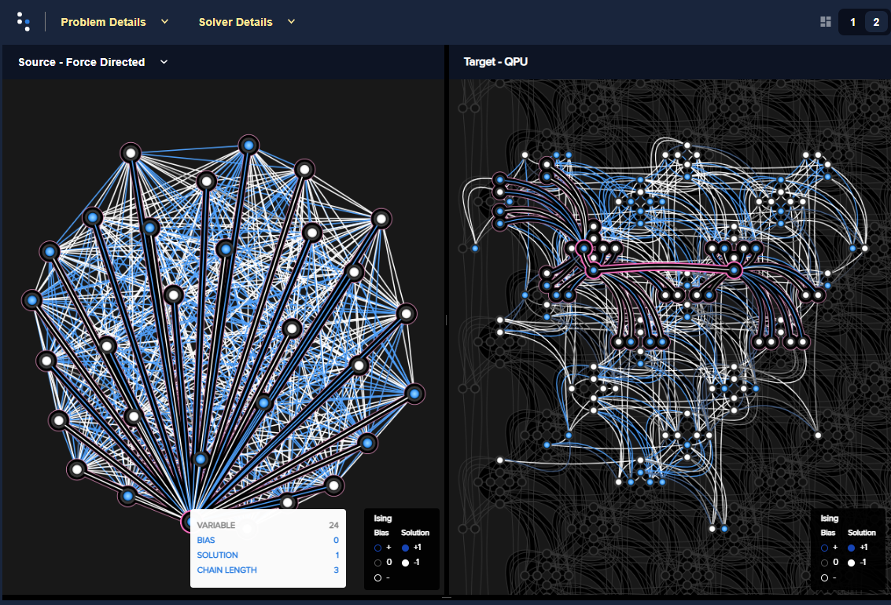

.. image:: docs/_static/Ocean_SDK_Banner.png

.. image:: https://img.shields.io/pypi/v/dwave-ocean-sdk.svg
    :target: https://pypi.python.org/pypi/dwave-ocean-sdk

.. image:: https://img.shields.io/pypi/pyversions/dwave-ocean-sdk.svg
    :target: https://pypi.python.org/pypi/dwave-ocean-sdk

.. image:: https://readthedocs.com/projects/d-wave-systems-dwave-ocean-sdk/badge
    :target: https://docs.ocean.dwavesys.com

.. image:: https://ci.appveyor.com/api/projects/status/c8ofdgyiy4w38lu3?svg=true
    :target: https://ci.appveyor.com/project/dwave-adtt/dwave-ocean-sdk

.. image:: https://circleci.com/gh/dwavesystems/dwave-ocean-sdk.svg?style=svg
    :target: https://circleci.com/gh/dwavesystems/dwave-ocean-sdk

.. index-start-marker

Installer for D-Wave's Ocean Tools.

`Ocean <https://docs.ocean.dwavesys.com/en/stable>`_ is
`D-Wave's <https://www.dwavesys.com>`_ suite of tools for solving hard problems
with quantum computers.

Installation
============

.. installation-start-marker

Compatible with Python 3.6+:

.. code-block:: bash

    pip install dwave-ocean-sdk

To install from source:

.. code-block:: bash

    python setup.py install

.. installation-end-marker

Getting Started
===============

Start learning with the following D-Wave resources:

* `System Documentation <https://docs.dwavesys.com/docs/latest/index.html>`_ to
  learn about quantum computers and how to use them.

* `Getting Started with Ocean <https://docs.ocean.dwavesys.com/en/stable/getting_started>`_
  to install and start coding with Ocean software.

* `dwave-examples <https://github.com/dwave-examples>`_ for code examples
  and Jupyter Notebooks.

* `D-Wave website <https://www.dwavesys.com/learn/resource-library>`_ for
  whitepapers and additional resources.

Example Quantum Program
-----------------------

The following lines of code solve a
`random <https://docs.ocean.dwavesys.com/en/stable/docs_dimod/reference/generators.html>`_
problem on a quantum computer.

>>> from dwave.system import DWaveSampler, EmbeddingComposite
>>> from dimod.generators import ran_r
>>> import dwave.inspector
...
>>> bqm = ran_r(1, 30)
>>> sampler = EmbeddingComposite(DWaveSampler())
>>> sampleset = sampler.sample(bqm, num_reads=100)

The left side of the graphic below visualizes a solution to the problem with white
dots representing variables assigned values of -1 and blue dots values of +1; the
right side shows the qubits representing these variables.

Support
=======

* `Leap user community <https://support.dwavesys.com/hc/en-us/community/topics>`_
  to converse with a large community of D-Wave users.
* `Leap help center <https://support.dwavesys.com/hc/en-us>`_
  to search the Leap knowledge base.
* `GitHub issues <https://github.com/dwavesystems>`_ to open issues or request
  features on Ocean packages.

Contributing
============

Your contributions are welcome!

<link to contrib file>

License
=======
