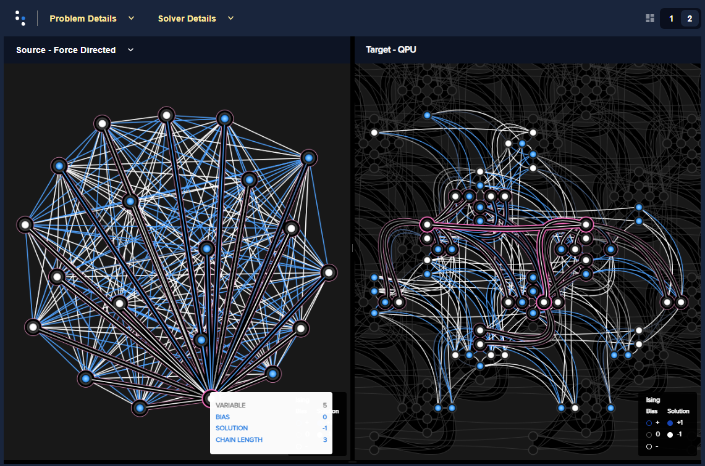

.. image:: docs/_static/Ocean_SDK_Banner.png

.. image:: https://img.shields.io/pypi/v/dwave-ocean-sdk.svg
    :target: https://pypi.python.org/pypi/dwave-ocean-sdk

.. image:: https://img.shields.io/pypi/pyversions/dwave-ocean-sdk.svg
    :target: https://pypi.python.org/pypi/dwave-ocean-sdk

.. image:: https://readthedocs.com/projects/d-wave-systems-dwave-ocean-sdk/badge
    :target: https://docs.ocean.dwavesys.com

.. image:: https://ci.appveyor.com/api/projects/status/c8ofdgyiy4w38lu3?svg=true
    :target: https://ci.appveyor.com/project/dwave-adtt/dwave-ocean-sdk

.. image:: https://circleci.com/gh/dwavesystems/dwave-ocean-sdk.svg?style=svg
    :target: https://circleci.com/gh/dwavesystems/dwave-ocean-sdk

.. index-start-marker

`Ocean <https://docs.ocean.dwavesys.com/en/stable>`_ is
`D-Wave's <https://www.dwavesys.com>`_ suite of tools for solving hard problems
with quantum computers.

.. index-end-marker

Installation
============

.. installation-start-marker

Installation from `PyPI <https://pypi.org/project/dwave-ocean-sdk/>`_:

.. code-block:: bash

    pip install dwave-ocean-sdk

For more information, see the Ocean documentation's
`installation <https://docs.ocean.dwavesys.com/en/stable/overview/install.html>`_
page.

.. installation-end-marker

Getting Started
===============

Sign up for the Leap quantum cloud service here:
`Leap signup <https://cloud.dwavesys.com/leap/signup>`_. Leap provides a
browser-based integrated development environment (IDE) with Ocean preinstalled.

Start learning with the following D-Wave resources:

* `System Documentation <https://docs.dwavesys.com/docs/latest/index.html>`_ to
  learn about quantum computers and how to use them.

* `Getting Started with Ocean <https://docs.ocean.dwavesys.com/en/stable/getting_started>`_
  to install and start coding with Ocean software.

* `dwave-examples <https://github.com/dwave-examples>`_ for code examples
  and Jupyter Notebooks.

* `Resource Library <https://www.dwavesys.com/learn/resource-library>`_ on
  D-Wave website for whitepapers and additional resources.

Example Quantum Program
-----------------------

The following lines of code solve and visualize a
`random <https://docs.ocean.dwavesys.com/en/stable/docs_dimod/reference/generators.html>`_
`problem <https://docs.ocean.dwavesys.com/en/stable/concepts/bqm.html>`_
on a quantum computer.

.. code-block:: python

  import dimod
  import dwave.inspector
  import dwave.system

  bqm = dimod.generators.ran_r(1, 20)
  sampler = dwave.system.EmbeddingComposite(dwave.system.DWaveSampler())
  sampleset = sampler.sample(bqm, num_reads=100)
  dwave.inspector.show(sampleset)

The left side of the
`visualized <https://docs.ocean.dwavesys.com/en/stable/docs_inspector/intro.html>`_
solution represents the problem's variables as circles, with white dots for
variables assigned values of -1 and blue dots for values of +1; the colors of the
connecting lines represent values of the quadratic coefficients for each pair of
variables. The right side shows the qubits representing these variables on a
quantum processing unit.

You can find introductory examples in the
`Ocean documentation <https://docs.ocean.dwavesys.com/en/stable/getting_started.html>`_
and `dwave-examples <https://github.com/dwave-examples>`_ GitHub repository, and
many customer prototype applications on the
`D-Wave website <https://www.dwavesys.com/learn/featured-applications/>`_.

Support
=======

Find support here:

* `Leap user community <https://support.dwavesys.com/hc/en-us/community/topics>`_
  to converse with a large community of D-Wave users.
* `Leap help center <https://support.dwavesys.com/hc/en-us>`_
  to search the Leap knowledge base.
* `SDK GitHub repo <https://github.com/dwavesystems/dwave-ocean-sdk/issues>`_ to
  open issues or request features on the Ocean SDK or on any one of its
  `packages <https://github.com/dwavesystems>`_.

Contributing
============

Your contributions are welcome!

Ocean's `contributing guide <https://docs.ocean.dwavesys.com/en/stable/contributing.html>`_
has guidelines for contributing to Ocean packages.

License
=======

Released under the Apache License 2.0. See LICENSE file.
