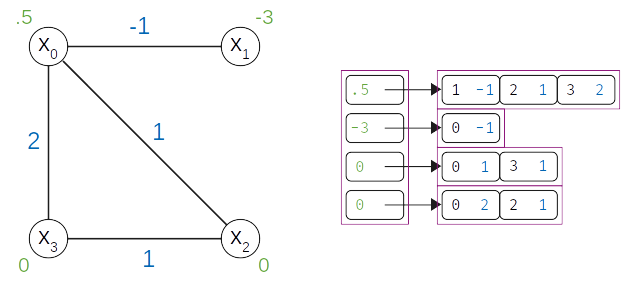

.. _concept_models:

======
Models
======

To express your problem as an objective function and submit to a |dwave_short|
sampler for solution, you formulate a model.

.. _concept_models_constrained_vs_unconstrained:

Constrained Versus Unconstrained
================================

Many real-world problems include constraints. For example, a routing problem
might limit the number of airplanes on the ground at an airport and a scheduling
problem might require a minimum interval between shifts.

Constrained models such as :class:`~dimod.ConstrainedQuadraticModel` can support
constraints by encoding both an objective and its set of constraints, as models
or in symbolic form.

Unconstrained quadratic models are used to submit problems to :term:`sampler`\ s
such as D-Wave quantum computers\ [#]_ and some hybrid quantum-classical
samplers\ [#]_. When using such samplers to handle problems with constraints,
you typically formulate the constraints as :ref:`concept_penalty`.

The :ref:`concept_models_supported` section below lists constrained and
unconstrained models.

.. [#]
    D-Wave quantum computers accept unconstrained binary quadratic models, such
    as quadratic unconstrained binary optimization (\ :term:`QUBO`\ ) models:
    binary because variables are represented by qubits that return two states
    and quadratic because polynomial terms of two variables can be represented
    by pairs of coupled qubits.

.. [#]
    Some hybrid quantum-classical samplers accept constrained and non-binary
    models; for example, a quadratic model with an integer variable that must be
    smaller than some configured value.

.. _concept_models_supported:

Supported Models
================

The following table shows the models currently supported by Ocean software,
the variables you can use with each, and some related classes.

.. |models_variables_table| replace:: Supported Models

.. include:: ../shared/models.rst
    :start-after: start_model_variables_table
    :end-before: end_model_variables_table

.. _concept_models_cqm:

Constrained Quadratic Model
===========================

.. start_concept_models_cqm

The constrained quadratic model (CQM) are problems of the form:

.. math::

    \begin{align}
        \text{Minimize an objective:} & \\
        & \sum_{i} a_i x_i + \sum_{i \le j} b_{ij} x_i x_j + c, \\
        \text{Subject to constraints:} & \\
        & \sum_i a_i^{(m)} x_i + \sum_{i \le j} b_{ij}^{(m)} x_i x_j+ c^{(m)} \circ 0,
        \quad m=1, \dots, M,
    \end{align}

where :math:`\{ x_i\}_{i=1, \dots, N}` can be binary\ [#]_, integer, or
continuous\ [#]_ variables, :math:`a_{i}, b_{ij}, c` are real values,
:math:`\circ \in \{ \ge, \le, = \}` and  :math:`M` is the total number of
constraints.

.. [#]
    For binary variables, the range of the quadratic-term summation is
    :math:`i < j` because :math:`x^2 = x` for binary values :math:`\{0, 1\}`
    and :math:`s^2 = 1` for spin values :math:`\{-1, 1\}`.

.. [#]
    Real-valued variables are currently not supported in quadratic interactions.

CQMs are typically used for applications that optimize problems that might
include real, integer and/or binary variables and one or more constraints.

.. end_concept_models_cqm

.. _concept_models_nonlinear:

Nonlinear Model
===============

.. start_concept_models_nonlinear

The nonlinear model represents a general optimization problem with an
:term:`objective function` and/or constraints over variables of various
types.

This model is especially suited for use with decision variables that represent
a common logic, such as subsets of choices or permutations of ordering. For
example, in a
`traveling salesperson problem <https://en.wikipedia.org/wiki/Travelling_salesman_problem>`_
permutations of the variables representing cities can signify the order of the
route being optimized and in a
`knapsack problem <https://en.wikipedia.org/wiki/Knapsack_problem>`_ the
variables representing items can be divided into subsets of packed and not
packed.

.. end_concept_models_nonlinear

.. _concept_models_bqm:

Binary Quadratic Models
=======================

.. start_concept_models_quadratic

The binary quadratic model (BQM) class encodes Ising and quadratic unconstrained
binary optimization (QUBO) models used by samplers such as the D-Wave system.

The BQM equation,

.. math::

    E(\bf{v})
    = \sum_{i=1} a_i v_i
    + \sum_{i<j} b_{i,j} v_i v_j
    + c
    \qquad\qquad v_i \in\{-1,+1\} \text{  or } \{0,1\}

can represent both.

.. _concept_models_ising:

Ising Model
-----------

The :term:`Ising` model is an objective function of :math:`N` variables
:math:`s=[s_1,...,s_N]` corresponding to physical Ising spins, where :math:`h_i`
are the biases and :math:`J_{i,j}` the couplings (interactions) between spins.

.. math::

    \text{Ising:} \qquad
    E(\bf{s})
    = \sum_{i=1} h_i s_i +
    \sum_{i<j} J_{i,j} s_i s_j
    \qquad\qquad s_i\in\{-1,+1\}

.. _concept_models_qubo:

QUBO
----

The :term:`QUBO` model is an objective function of :math:`N` binary variables
represented as an upper-diagonal matrix :math:`Q`, where diagonal terms are the
linear coefficients and the nonzero off-diagonal terms the quadratic
coefficients.

.. math::

    \text{QUBO:} \qquad E(\bf{x})
    =  \sum_{i\le j} x_i Q_{i,j} x_j
    \qquad\qquad x_i\in \{0,1\}

Other Models
============

Ocean software also supports these additional models.

.. _concept_models_quadratic:

Quadratic Models
----------------

.. start_concept_models_quadratic

Quadratic models are polynomials with one or two variables per term. A simple
example of a quadratic model is,

.. math::

    Ax + By + Cxy

where :math:`A`, :math:`B`, and :math:`C` are constants. Single-variable
terms---:math:`Ax` and :math:`By` here---are linear with the constant biasing
the term's variable. Two-variable terms---:math:`Cxy` here---are quadratic with
a relationship between the variables.

Quantum computers solve hard problems by minimizing an objective function.
Quadratic models are useful objective functions because the quantum processing
unit (QPU) can represent binary variables as the states of the qubits and
linear and quadratic coefficients as, respectively, the physical biases and
couplings applied to these qubits. Hybrid quantum-classical samplers, which
minimize some parts of the objective function using classical heuristics and
some by using the QPU, enable the further abstraction of problem representation.

Ocean supports various quadratic models:

*   :ref:`concept_models_ising` and :ref:`concept_models_qubo`
*   :ref:`concept_models_bqm` are unconstrained and support binary variables.
*   :ref:`concept_models_cqm` can be constrained and support real, integer
    and binary variables.
*   :ref:`concept_models_dqm` are unconstrained and support discrete variables.

Ocean also provides support for :ref:`higher order models <oceandocs:higher_order>`,
which are typically reduced to quadratic for sampling.

.. end_concept_models_quadratic

.. _concept_models_dqm:

Discrete Quadratic Models
-------------------------

The discrete quadratic model (DQM) is a polynomial over *discrete* variables,
with all terms of degree two or less, where a discrete variable represents some
collection of distinct values, such as ``{red, green, blue, yellow}`` or
``{3.2, 67}``, which are called the variable's *cases*.

A discrete quadratic model may be defined as

.. math::

    H(\bf{d}) = \sum_{i} a_i(\bf{d}_i) + \sum_{i,j} b_{i,j}(\bf{d}_i,\bf{d}_j) + c

where :math:`\bf{d}_i` are the discrete variables, :math:`a_i()` and
:math:`b_{i,j}()` are real-valued functions, and :math:`c` is a constant
(offset).

You can represent any DQM with an equivalent model over **binary** variables
by replacing each discrete variable, :math:`\bf{d}_i`, with a vector of binary
variables using `one-hot encoding <https://en.wikipedia.org/wiki/One-hot>`_,
where exactly one binary variable is True and all others are False:
:math:`\sum_a x_{i,a} = 1 \quad \forall i`.

In particular, a discrete quadratic model for :math:`N` discrete variables,
:math:`\bf{d}_i`, each with :math:`n_i` cases, is then defined by using a
binary variable, :math:`x_{i,u}`, to indicate whether discrete variable
:math:`\bf{d}_i` is set to case :math:`u`. The objective function can be
expressed by the equation:

.. math::

    E(\bf{x})
    = \sum_{i=1}^N \sum_{u=1}^{n_i} a_{i,u} x_{i,u}
    + \sum_{i=1}^N \sum_{j=i+1}^N \sum_{u=1}^{n_i} \sum_{v=1}^{n_j} b_{i,j,u,v} x_{i,u} x_{j,v}
    + c

Both representations are equivalent over the *feasible space*; that is, the
solutions that meet the one-hot-encoding constraints. The second representation
ascribes energies both to the feasible space (satisfying constraints), and an
infeasible space (violating constraints). The second representation is used
by Ocean tools.

The :class:`dimod.DiscreteQuadraticModel` class can contain this model and its
methods provide convenient utilities for working with representations
of a problem.

Data Structure
==============

Quadratic models are implemented with an adjacency structure in which each
variable tracks its own linear bias and its neighborhood. The figure below
shows the graph and adjacency representations for an example BQM,

.. math::

   E(x) = .5 x_0 - 3 x_1 - x_0 x_1 + x_0 x_2 + 2 x_0 x_3 + x_2 x_3

    Adjacency structure of a 4-variable binary quadratic model.

Related Information
===================

*   :ref:`opt_model_construction_nl` describes the construction of nonlinear models.
*   :ref:`opt_model_construction_qm` describes the construction of quadratic models.
