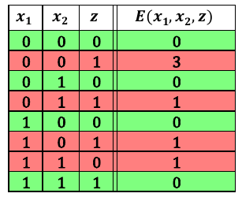
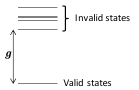

.. _concept_penalty:

==============
Penalty Models
==============

Penalty models represent :term:`constraints <constraint>` as small
:ref:`models <concept_models>`, such as binary quadratic models (:term:`BQM`),
that have higher values for infeasible states (values of variables that violate
the constraint). By adding such models to the :term:`objective function` that
represents your problem, you make it less likely that solutions that violate
the constraint are selected by :term:`solvers <solver>` that seek low-energy
states.

Descriptive Example
===================

For example, consider that you are looking for solutions to a problem that is
represented by a binary quadratic model, :code:`bqm_p`, which has variables
:math:`v_1, v_2, v_3, v_4, v_5, ...` etc. You wish to constrain the solutions to
ones where :math:`v_2 \Leftrightarrow \neg v_4`; that is, variables :math:`v_2`
and :math:`v_4` never have the same value in good solutions.

The relation :math:`v_2 \Leftrightarrow \neg v_4` represents a NOT gate,
where one variable, say :math:`v_2` is the gate's input and the other, say
:math:`v_4` its output.

You can represent such a constraint with the :term:`penalty function`:

.. math::

    2v_2v_4 - v_2 - v_4 + 1.

This penalty function represents the constraint in that for assignments of
variables that match valid states (:math:`v_2 \ne v_4`), the function evaluates
at a lower value than assignments that violate the constraint. Therefore, when
you minimize the sum of your objective function (:code:`bqm_p`) and a BQM
representing this penalty function, those assignments of variables that meet the
constraint have lower values.

The table below shows that this function penalizes states that violate the
constraint while no penalty is applied to assignments of variables that
meet the constraint. In this table, columns :math:`\mathbf{v_2}` and
:math:`\mathbf{v_4}` show all possible states of variables :math:`v_2` and
:math:`v4`; column **Valid?** shows whether the variables represent meet the
constraint; column :math:`\mathbf{P}` shows the value of the penalty for all
possible assignments of variables.

.. table:: Boolean NOT Constraint Represented by a Penalty Function.
    :name: BooleanNOTConstraint

    ======================  ====================  ==========  ==================
    :math:`\mathbf{v_2}`    :math:`\mathbf{v_4}`  **Valid?**  :math:`\mathbf{P}`
    ======================  ====================  ==========  ==================
    :math:`0`               :math:`1`             Yes         :math:`0`
    :math:`1`               :math:`0`             Yes         :math:`0`
    :math:`0`               :math:`0`             No          :math:`1`
    :math:`1`               :math:`1`             No          :math:`1`
    ======================  ====================  ==========  ==================

For example, the state :math:`v_2, v_4 = 0,1` of the first row represents valid
assignments, and the value of :math:`P` is

.. math::

    2v_2v_4 - v_2 - v_4 + 1 = 2 \times 0 \times 1 - 0 - 1 + 1 = -1+1=0,

not penalizing the valid assignment of variables. In contrast, the state
:math:`v_2, v_4 = 0,0` of the third row represents an infeasible assignment, and
the value of :math:`P` is

.. math::

    2v_2v_4 - v_2 - v_4 + 1 = 2 \times 0 \times 0 -0 -0 +1 =1,

adding a value of :math:`1` to the BQM being minimized, :code:`bqm_p`. By
penalizing both possible assignments of variables that violate the constraint,
the BQM based on this penalty function has minimal values (lowest energy states)
for variable values that meet the constraint.

Code Example
============

Consider an example of mapping an AND clause to a :term:`QUBO`. To do this,
solutions to the QUBO (solutions that minimize the energy of the QUBO) must be
exactly the valid configurations of an AND gate, ``z = AND(x_1, x_2)``.

First, import the required packages.

.. code-block:: python

    import penaltymodel as pm
    import dimod
    import networkx as nx

Next, determine the feasible configurations that the QUBO should target by
minimizing the energy of these configurations. Below is a truth table
representing an AND clause.

.. table:: AND Gate

    ====================  ====================  ==================
    ``x_1``               ``x_2``               ``z``
    ====================  ====================  ==================
    0                     0                     0
    0                     1                     0
    1                     0                     0
    1                     1                     1
    ====================  ====================  ==================

The rows of the truth table are exactly the feasible configurations.

.. code-block:: python

    feasible_configurations = [{'x1': 0, 'x2': 0, 'z': 0},
                               {'x1': 1, 'x2': 0, 'z': 0},
                               {'x1': 0, 'x2': 1, 'z': 0},
                               {'x1': 1, 'x2': 1, 'z': 1}]

At this point, you can get a penalty model.

.. code-block:: python

    bqm, gap = pm.get_penalty_model(feasible_configurations)

However, if you know the QUBO, you can build the penalty model yourself. Observe
that for the equation,

.. code-block::

    E(x_1, x_2, z) = x_1 x_2 - 2(x_1 + x_2) z + 3 z + 0

you get the following energies for each row in the truth table:

    Truth table for AND.

The energy is minimized on exactly the desired feasible configurations; you can
encode this energy function as a QUBO. Set the offset to zero because there is
no constant energy offset.

.. code-block:: python

    qubo = dimod.BinaryQuadraticModel({'x1': 0., 'x2': 0., 'z': 3.},
                                      {('x1', 'x2'): 1., ('x1', 'z'): 2., ('x2', 'z'): 2.},
                                      0.0,
                                      dimod.BINARY)

The table shows a ground energy of ``0``; you can calculate it using the qubo to
check that this is true for the feasible configuration ``(0, 1, 0)``.

.. code-block:: python

    ground_energy = qubo.energy({'x1': 0, 'x2': 1, 'z': 0})

The last value needed is the classical gap. This is the difference in energy
between the lowest infeasible state and the ground state.

    Energy gap.

With all of the pieces, you can now build the penalty model.

.. code-block:: python

    classical_gap = 1
    p_model = pm.PenaltyModel.from_specification(spec, qubo, classical_gap, ground_energy)

Related Information
===================

*   :ref:`qpu_reformulating` describes penalty functions in general,
    and penalty functions for representing Boolean operations.
