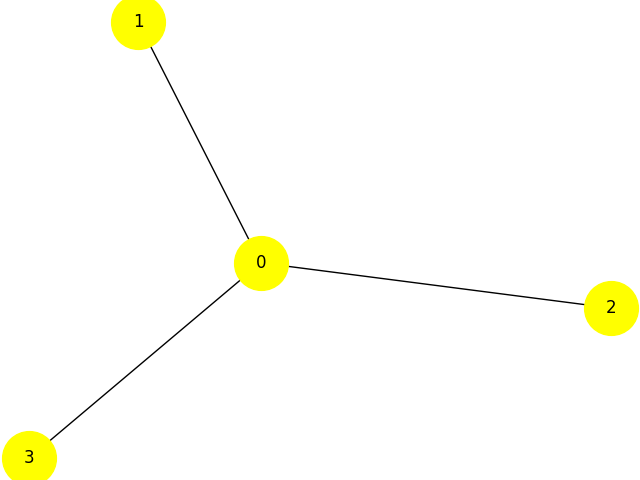

.. _concepts_samplers:

====================
Samplers and Solvers 
====================

Samplers
========

*Samplers* are processes that sample from low energy states of a problem’s :term:`objective function`. 
A BQM sampler samples from low energy states in models such as those
defined by an Ising equation or a Quadratic Unconstrained Binary Optimization (QUBO) problem
and returns an iterable of samples, in order of increasing energy.

Ocean software provides a variety of :doc:`dimod </docs_dimod/sdk_index>` samplers, which
all support ‘sample_qubo’ and ‘sample_ising’ methods as well as the generic BQM sampler method.
In addition to :class:`~dwave.system.samplers.DWaveSampler()`, classical solvers, which run on CPU or GPU, are available and
useful for developing code or on a small versions of a problem to verify code.

Hybrid Quantum-Classical Samplers
---------------------------------

Quantum-classical hybrid is the use of both classical and quantum resources to solve problems, exploiting the complementary strengths that each provides.

D-Wave's `Leap Quantum Application Environment <https://cloud.dwavesys.com/leap>`_
provides state-of-the-art hybrid solvers you can submit arbitrary BQMs to.
:std:doc:`dwave-hybrid <oceandocs:docs_hybrid/sdk_index>` provides you with a Python framework for
building a variety of flexible hybrid workflows that use quantum and classical
resources together to find good solutions to your problem.

Solvers
=======

Ocean software provides quantum, classical, and quantum-classical hybrid samplers that run either 
remotely (for example, in D-Wave’s Leap environment) or locally on your CPU. These compute resources 
are known as solvers.

.. note:: Some classical samplers actually brute-force solve small problems rather than sample, and 
   these are also referred to as “solvers”.

Composites
==========

Samplers can be composed. The `composite pattern <https://en.wikipedia.org/wiki/Composite_pattern>`_
allows layers of pre- and post-processing to be applied to binary quadratic programs without needing
to change the underlying sampler implementation. We refer to these layers as `composites`.
A composed sampler includes at least one sampler and possibly many composites.

Examples of composites are :class:`~dwave.system.composites.EmbeddingComposite()`,
which handle the mapping known as :term:`minor-embedding`,
and :class:`~dimod.reference.composites.roofduality.RoofDualityComposite()`, which 
uses `roof duality <https://en.wikipedia.org/wiki/Pseudo-Boolean_function>`_ to assign 
some variables as a pre-processing step before submitting the problem for sampling.

dimod includes reference :term:`sampler`\ s and :term:`composite`\ s for processing
quadratic (and higher order) models and refining sampling, and for
testing your code during development.

Using Samplers
==============

For an introduction to samplers and composites, see
:std:doc:`Concepts: Samplers and Composites <oceandocs:concepts/samplers>`.
For descriptions of all supported samplers, see
:ref:`Samplers reference documentation <samplers_index>`.

Example: Using a Reference Sampler
----------------------------------

To find solutions to the small four-node
`maximum cut <https://en.wikipedia.org/wiki/Maximum_cut>`_
BQM generated in the :ref:`intro_models` section, shown again in the figure below,
you can use one of dimod's reference samplers: its
:class:`~dimod.reference.samplers.ExactSolver` test sampler, for example,
calculates the energy of all possible samples.

    Star graph with four nodes.

>>> qubo = {(0, 0): -3, (1, 1): -1, (0, 1): 2, (2, 2): -1,
...         (0, 2): 2, (3, 3): -1, (0, 3): 2}
>>> dict_bqm = dimod.BQM.from_qubo(qubo)
>>> sampler_exact = dimod.ExactSolver()
>>> sampleset = sampler_exact.sample(dict_bqm)
>>> print(sampleset)
    0  1  2  3 energy num_oc.
1   1  0  0  0   -3.0       1
11  0  1  1  1   -3.0       1
2   1  1  0  0   -2.0       1
...
10  1  1  1  1    0.0       1
['BINARY', 16 rows, 16 samples, 4 variables]

Samplers can be composed. The
`composite pattern <https://en.wikipedia.org/wiki/Composite_pattern>`_ allows
layers of pre- and post-processing to be applied to quadratic programs for a
sampler implementation.

Example: Using a Composed Sampler
---------------------------------

This example uses a composed sampler on the
:std:doc:`Boolean NOT Gate <oceandocs:examples/not>`
example detailed in the :std:doc:`Getting Started <oceandocs:getting_started>`
documentation.

The :class:`~dimod.reference.composites.structure.StructureComposite`
composite enforces the shape of the binary quadratic model. In this case we
only want to accept binary quadratic models with nodes labelled ``'x'``,
``'y'``, and ``'z'``.

>>> from dimod import ExactSolver, StructureComposite
>>> nodelist = ['x', 'y', 'z']
>>> edgelist = [('x', 'y'), ('x', 'z'), ('y', 'z')]
>>> composed_sampler = StructureComposite(ExactSolver(), nodelist, edgelist)
>>> Q = {('x', 'x'): -1, ('x', 'z'): 2, ('z', 'x'): 0, ('z', 'z'): -1}
>>> sampleset = composed_sampler.sample_qubo(Q)
>>> print(sampleset)
   x  z energy num_oc.
1  1  0   -1.0       1
3  0  1   -1.0       1
0  0  0    0.0       1
2  1  1    0.0       1
['BINARY', 4 rows, 4 samples, 2 variables]
>>> Q = {('a', 'a'): -1, ('a', 'b'): 2, ('b', 'a'): 0, ('b', 'b'): -1}
>>> try:
...     sampleset = composed_sampler.sample_qubo(Q)
... except ValueError:
...     print("incorrect structure!")
incorrect structure!

Creating Samplers
=================

dimod provides an :ref:`api` you can use to create your own dimod samplers and
composed samplers.

Example: Creating a Sampler
---------------------------

This example creates a dimod sampler by implementing a single method (in this
example the :code:`sample_ising` method).

.. testcode::

    class LinearIsingSampler(dimod.Sampler):

        def sample_ising(self, h, J, **kwargs):
            kwargs = self.remove_unknown_kwargs(**kwargs)
            sample = linear_ising(h, J, **kwargs)  # Defined elsewhere
            energy = dimod.ising_energy(sample, h, J)
            return dimod.SampleSet.from_samples(sample, vartype=dimod.SPIN, energy=energy)

        @property
        def properties(self):
            return dict()

        @property
        def parameters(self):
            return dict()

The :class:`.Sampler` ABC provides the other sample methods "for free"
as mixins.

The use of samplers in solving problems is described
in the following documentation:

*   :std:doc:`Solving Problems by Sampling <oceandocs:overview/samplers>`

    Describes the available types of samplers in Ocean and their use in solving :term:`BQM`\ s.

