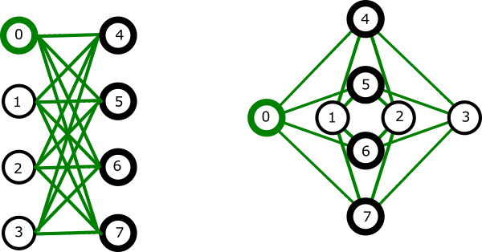
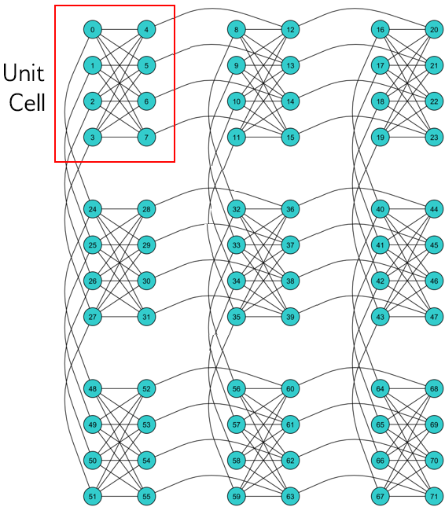
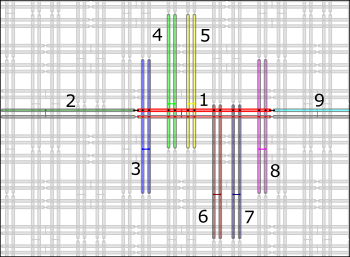
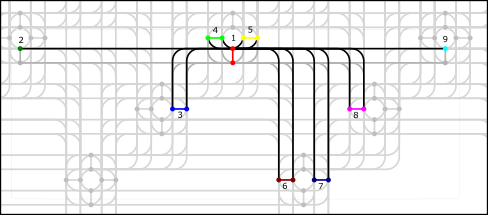
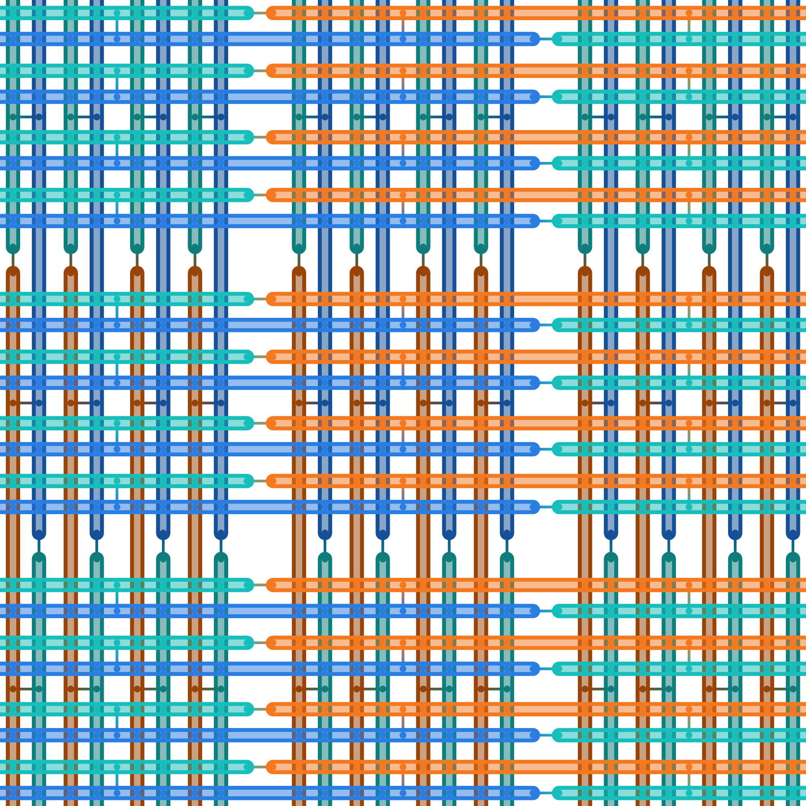

.. _topology_sdk:

============
QPU Topology
============

To solve a :term:`bqm` on the D-Wave system, you must map it to a graph that
represents the topology of the system's qubits:

* :ref:`topology_sdk_chimera` topology for D-Wave 2000Q systems
* :ref:`topology_sdk_pegasus` topology for Advantage systems
* :ref:`topology_sdk_zephyr` topology for next-generation quantum computers
  currently under development

.. note:: If you are sending your problem to a
    `Leap <https://cloud.dwavesys.com/leap/>`_ quantum-classical :term:`hybrid` solver,
    the solver handles all interactions with the QPU.

.. _topology_sdk_chimera:

Chimera
=======

The Chimera architecture comprises sets of connected unit cells, each with four
horizontal qubits connected to four vertical qubits via couplers (bipartite
connectivity). Unit cells are tiled vertically and horizontally with adjacent
qubits connected, creating a lattice of sparsely connected qubits. A unit cell
is typically rendered as either a cross or a column.

  Chimera unit cell.

  A :math:`3 {\rm x} 3`  Chimera graph, denoted C3. Qubits are arranged in 9 unit cells.

Chimera qubits are considered to have a nominal length of 4 (each qubit
is connected to 4 orthogonal qubits through internal couplers) and degree of 6 (each qubit
is coupled to 6 different qubits).

The notation CN refers to a Chimera graph consisting of an :math:`N{\rm x}N` grid of unit cells.
The D-Wave 2000Q QPU supports a C16 Chimera graph: its 2048 qubits are logically mapped into a
:math:`16 {\rm x} 16` matrix of unit cells of 8 qubits.

.. _topology_sdk_pegasus:

Pegasus
=======

In Pegasus as in Chimera, qubits are “oriented” vertically or horizontally but similarly aligned
qubits can also be also shifted by distances and in groupings that differ between Pegasus families.
Pegasus qubits are also more densely connected and have three types of coupler:

- *Internal couplers*.
  Internal couplers connect pairs of orthogonal (with opposite orientation) qubits. In Pegasus,
  each qubit is connected via internal coupling to 12 other qubits (versus four in the Chimera topology).
- *External couplers*.
  External couplers connect vertical qubits to adjacent vertical qubits and horizontal
  qubits to adjacent horizontal qubits. Each qubit has one or two external couplers.
- *Odd couplers*.
  Odd couplers connect similarly aligned pairs of qubits. Each qubit has one odd coupler.

	Pegasus qubits. Qubits are drawn as horizontal and vertical loops. The horizontal qubit in the center, shown with its odd coupler in red and numbered 1, is internally coupled to vertical qubits, in pairs 3 through 8, each pair and its odd coupler shown in a different color, and externally coupled to horizontal qubits 2 and 9, each shown in a different color.

	Pegasus qubits. Qubits in this "roadway" graphic are represented as dots and couplers as lines. The top qubit in the center, shown in red and numbered 1, is oddly coupled to the (red) qubit shown directly below it, internally coupled to vertical qubits, in pairs 3 through 8, each pair and its odd coupler shown in a different color, and externally coupled to horizontal qubits 2 and 9, each shown in a different color.

Pegasus qubits are considered to have a nominal length of 12 (each qubit is connected to
12 orthogonal qubits through internal couplers) and degree of 15 (each qubit is coupled to
15 different qubits).

As we use the notation CN to refer to a Chimera graph with size parameter N, we refer to instances
of Pegasus topologies by PN; for example, P3 is a graph with 144 nodes.

.. _topology_sdk_zephyr:

Zephyr
======

D-Wave is currently developing its next-generation QPU with the Zephyr topology:
qubits are “oriented” vertically or horizontally, as in :ref:`topology_sdk_chimera`
and :ref:`topology_sdk_pegasus`, and are shifted and connected with three coupler
types as in Pegasus, but this new graph achieves higher nominal length (16) and
degree (20).
A qubit in the Zephyr topology has sixteen internal couplers connecting it to
orthogonal qubits and two external couplers and two odd couplers connecting it to
similarly aligned qubits.

Zephyr topology enables native :math:`K_4` and :math:`K_{8,8}` subgraphs. A
:math:`Z_n` has cliques of size :math:`16n-8` with chain length :math:`n+1`.

As the notations :math:`C_n` and :math:`P_n` refer to :ref:`topology_sdk_chimera`
and :ref:`topology_sdk_pegasus` graphs with size parameter N, :math:`Z_n` refers
to instances of Zephyr topologies;
specifically, :math:`Z_n` is a :math:`(2n+1) \times (2n+1)` grid of unit cells.
For example, :math:`Z_3` is a graph with 336 nodes.

A Zephyr unit cell contains two groups of eight half qubits, with each qubit  in
the cell coupled either to four oppositely aligned qubits and one similarly aligned
qubit (four :math:`K_{4,4}` complete graphs with their internal and external
couplings) or to eight oppositely aligned qubits and one similarly aligned qubit
(a :math:`K_{8,8}` complete graph with its internal and odd couplings).

  Zephyr unit cells: for the center unit cell, one group of eight half qubits are shown in orange, another in blue.

Graph Tools
===========

The following graph tools are provided for these topologies:

* :ref:`drawing <drawing>` visualizes the graphs you create.
* :ref:`graph generation <generators_dnx>` creates graphs for the
  supported topologies of various sizes.
* :std:doc:`indexing <oceandocs:docs_dnx/reference/utilities>` helps translate
  coordinates of the supported graphs.
* :ref:`minorminer <sdk_index_minorminer>` is a heuristic tool for minor embedding.

