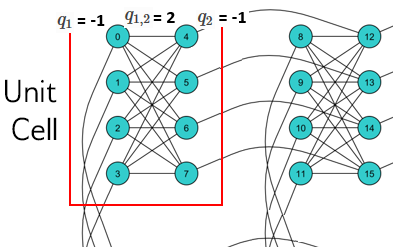
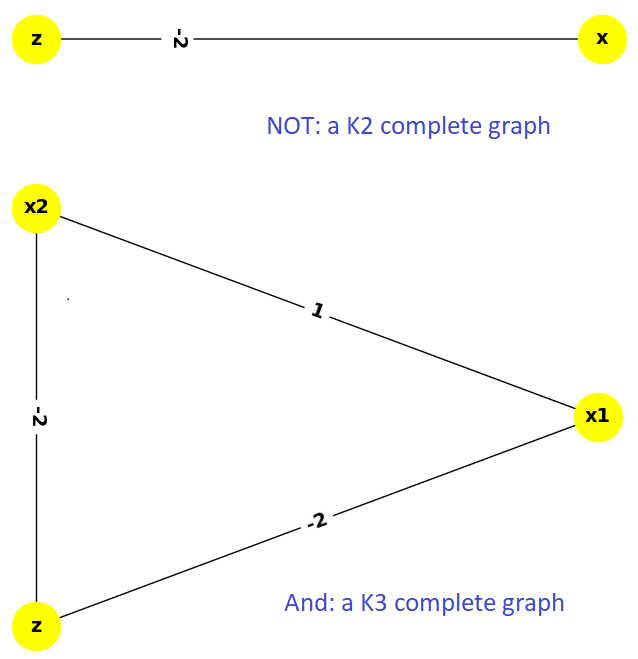

.. _and:

================
Boolean AND Gate
================

This example solves a simple problem of a Boolean AND gate on a D-Wave system to demonstrate
programming the underlying hardware more directly; in particular, :term:`minor-embedding`
a *chain*.

Other examples demonstrate more advanced steps that are typically needed for solving actual problems.

Example Requirements
====================

To run the code in this example, the following is required.

* The requisite information for problem submission through SAPI, as described in :ref:`dwavesys`
* Ocean tools :std:doc:`dwave-system <system:index>`.

If you installed `dwave-ocean-sdk <https://github.com/dwavesystems/dwave-ocean-sdk>`_
and ran :code:`dwave config create`, your installation should meet these requirements.

Solution Steps
==============

Section :ref:`solving_problems` describes the process of solving problems on the quantum
computer in two steps: (1) Formulate the problem as a :term:`binary quadratic model` (BQM)
and (2) Solve the BQM with a D-wave system or classical :term:`sampler`. In this example,
we mathematically formulate the BQM and use Ocean tools to solve it on a D-Wave system.

Formulate the AND Gate as a BQM
===============================

Ocean tools can automate the representation of logic gates as a BQM, as demonstrated
in the :ref:`multi_gate` example. The :ref:`not` example presents a mathematical
formulation of a BQM for a Boolean gate in detail. Here we briefly repeat the steps of mathematically
formulating a BQM while adding details on the underlying physical processes.

A D-Wave quantum processing unit (QPU) is a chip with interconnected qubits; for example,
a D-Wave 2000Q has up to 2048 qubits connected in a :term:`Chimera` topology. Programming it
consists mostly of setting two inputs:

* Qubit bias weights: control the degree to which a qubit tends to a particular state.
* Qubit coupling strengths: control the degree to which two qubits tend to the same state.

The biases and couplings define an energy landscape, and the D-Wave quantum computer seeks
the minimum energy of that landscape. Once you express your problem in a formulation\ [#]_
such that desired outcomes have low energy values and undesired outcomes high energy values,
the D-Wave system solves your problem by finding the low-energy states.

.. [#] This formulation, called an :term:`objective function`, corresponds to the :term:`Ising`
       model traditionally used in statistical mechanics: given :math:`N` variables
       :math:`s_1,...,s_N`, corresponding to physical Ising spins, where each variable
       :math:`s_i` can have values :math:`-1` or :math:`+1`, the system energy for
       an assignment of values is,

       .. math::

           E(\pmb{s}|\pmb{h},\pmb{J})  = \left\{ \sum_{i=1}^N h_i s_i + \sum_{i<j}^N J_{i,j} s_i s_j  \right\}

       where :math:`h_i` are biases and :math:`J_{i,j}` couplings between spins.

Here we use another binary quadratic model (BQM), the computer-science equivalent of the Ising model,
the :term:`QUBO`: given :math:`M` variables :math:`x_1,...,x_N`, where each variable :math:`x_i` can
have binary values :math:`0` or :math:`1`, the system tries to find assignments of values
that minimize

.. math::

    E(q_i, q_{i,j}; x_i) = \sum_i^N q_ix_i + \sum_{i<j}^N q_{i,j}x_i  x_j,

where :math:`q_i` and :math:`q_{i,j}` are configurable (linear and quadratic) coefficients.
To formulate a problem for the D-Wave system is to program :math:`q_i` and :math:`q_{i,j}` so
that assignments of :math:`x_1,...,x_N` also represent solutions to the problem.

AND as a Penalty Function
-------------------------

This example represents the AND operation, :math:`z \Leftrightarrow x_1 \wedge x_2`,
where :math:`x_1, x_2` are the gate's inputs and :math:`z` its output,
using a :term:`penalty function`:

.. math::

    x_1 x_2 - 2(x_1+x_2)z +3z.

This penalty function represents the AND gate in that for assignments of variables that match
valid states of the gate, the function evaluates at a lower value than assignments that would
be invalid for the gate. Therefore, when the D-Wave system minimizes a BQM based on this penalty function,
it finds those assignments of variables that match valid gate states.

You can verify that this penalty function represents the AND gate in the same way as was
done in the :ref:`not` example. See the
:std:doc:`D-Wave Problem-Solving Handbook <sysdocs_gettingstarted:doc_handbook>`
for more information about penalty functions in general, and penalty functions for representing
Boolean operations in particular.

Formulating the Problem as a QUBO
---------------------------------

For this example, the penalty function is quadratic, and easily reordered in the familiar
QUBO formulation:

.. math::

    E(q_i, q_{i,j}; x_i) = 3x_3 + x_1x_2 - 2x_1x_3 - 2x_2x_3

where :math:`z=x_3` is the AND gate's output, :math:`x_1, x_2` the inputs, linear
coefficients are :math:`q_1=3`, and quadratic coefficients are :math:`q_{1,2}=1,
q_{1,3}=-2, q_{2,3}=-2`.
The coefficients matrix is,

.. math::

     Q = \begin{bmatrix} 0 & 1 & -2\\
                           & 0 & -2\\
                           &   & 3 \end{bmatrix}

See the
:std:doc:`Getting Started with the D-Wave System <sysdocs_gettingstarted:doc_getting_started>`
and
:std:doc:`D-Wave Problem-Solving Handbook <sysdocs_gettingstarted:doc_handbook>`
books for more information about formulating problems as QUBOs.

The line of code below sets the QUBO coefficients for this AND gate.

>>> Q = {('x1', 'x2'): 1, ('x1', 'z'): -2, ('x2', 'z'): -2, ('z', 'z'): 3}

Solve the Problem by Sampling: Automated Minor-Embedding
========================================================

For reference, we first solve with the same steps used in the :ref:`not` example
before solving again while manually controlling additional parameters.

Again we use sampler *DWaveSampler()* from Ocean software's
:std:doc:`dwave-system <system:index>` and
its *EmbeddingComposite()* composite to :term:`minor-embed` our unstructured problem (variables
x1, x2, and z) on the sampler's graph structure (the QPU's numerically
indexed qubits).

The next code sets up a D-Wave system as the sampler.

.. note:: In the code below, replace sampler parameters in the third line. If
      you configured a default solver, as described in :ref:`dwavesys`, you
      should be able to set the sampler without parameters as
      :code:`sampler = DWaveSampler()`.
      You can see this information by running :code:`dwave config inspect` in your terminal.

>>> from dwave.system.samplers import DWaveSampler
>>> from dwave.system.composites import EmbeddingComposite
>>> sampler = DWaveSampler(endpoint='https://URL_to_my_D-Wave_system/', token='ABC-123456789012345678901234567890', solver='My_D-Wave_Solver')
>>> sampler_embedded = EmbeddingComposite(sampler)

As before, we ask for 5000 samples.

>>> response = sampler_embedded.sample_qubo(Q, num_reads=5000)
>>> for datum in response.data(['sample', 'energy', 'num_occurrences']):   # doctest: +SKIP
...    print(datum.sample, "Energy: ", datum.energy, "Occurrences: ", datum.num_occurrences)
...
{'x1': 1, 'x2': 0, 'z': 0} Energy:  0.0 Occurrences:  1009
{'x1': 1, 'x2': 1, 'z': 1} Energy:  0.0 Occurrences:  1452
{'x1': 0, 'x2': 0, 'z': 0} Energy:  0.0 Occurrences:  1292
{'x1': 0, 'x2': 1, 'z': 0} Energy:  0.0 Occurrences:  1246
{'x1': 0, 'x2': 1, 'z': 0} Energy:  0.0 Occurrences:  1

All the returned samples from this execution represent valid value assignments for an
AND gate, and minimize (are low-energy states of) the BQM.

Note that the last line of output from this execution shows a single sample that seems
identical to the line above it. The next section addresses that.

Solve the Problem by Sampling: Non-automated Minor-Embedding
============================================================

This section looks more closely into :term:`minor-embedding`. Above and in the :ref:`not`
example, :std:doc:`dwave-system <system:index>`
*EmbeddingComposite()* composite abstracted the minor-embedding.

Minor-Embedding a NOT Gate
--------------------------

For simplicity, we first return to the NOT gate. The :ref:`not`
example found that a NOT gate can be represented by a BQM in QUBO form with the
following coefficients:

>>> Q_not = {('x', 'x'): -1, ('x', 'z'): 2, ('z', 'x'): 0, ('z', 'z'): -1}

Minor embedding maps the two problem variables x and z to the indexed qubits of the
D-Wave QPU. Here we do this mapping ourselves.

The next line of code looks at properties of the sampler. We select the first node,
which on a QPU is a qubit, and print its adjacent nodes, i.e., coupled qubits.

>>> print(sampler.adjacency[sampler.nodelist[0]])      # doctest: +SKIP
{128, 4, 5, 6, 7}

For the D-Wave system the above code ran on, we see that the first available qubit
is adjacent to qubit 4 and four others.

We can map the NOT problem's two linear coefficients and single quadratic coefficient,
:math:`q_1=q_2=-1` and :math:`q_{1,2}=2`, to biases on qubits 0 and 4 and coupling
(0, 4). The figure below shows a minor embedding of the NOT gate into a D-Wave 2000Q QPU
unit cell (four horizontal qubits connected to four vertical qubits via couplers).

   A NOT gate minor embedded into the topmost left unit cell of a
   D-Wave 2000Q QPU. Variables :math:`x_1,x_2` are minor
   embedded as qubits 0 and 4 (blue circles). Biases :math:`q_1,q_2=-1,-1`
   and coupling strength :math:`q_{1,2}=2` are also shown.

The following code uses the *FixedEmbeddingComposite* composite to manually minor-embed
the problem. Its last line prints a confirmation that indeed the two selected qubits are adjacent
(coupled).

>>> from dwave.system.composites import FixedEmbeddingComposite
>>> sampler_embedded = FixedEmbeddingComposite(sampler, {'x': [0], 'z': [4]})
>>> print(sampler_embedded.adjacency)     # doctest: +SKIP
{'x': {'z'}, 'z': {'x'}}

As before, we ask for 5000 samples.

>>> response = sampler_embedded.sample_qubo(Q_not, num_reads=5000)
>>> for datum in response.data(['sample', 'energy', 'num_occurrences']):   # doctest: +SKIP
...    print(datum.sample, "Energy: ", datum.energy, "Occurrences: ", datum.num_occurrences)
...
{'x': 0, 'z': 1} Energy:  -1.0 Occurrences:  2520
{'x': 1, 'z': 0} Energy:  -1.0 Occurrences:  2474
{'x': 0, 'z': 0} Energy:  0.0 Occurrences:  4
{'x': 1, 'z': 1} Energy:  0.0 Occurrences:  2

From NOT to AND: an Important Difference
----------------------------------------

* The BQM for a NOT gate, :math:`-x -z  + 2xz`, can be represented by a fully connected
  :math:`K_2` graph: its linear coefficients are weights of the two connected nodes with
  the single quadratic coefficient the weight of its connecting edge.
* The BQM for an AND gate, :math:`3z + x_1x_2 - 2x_1z - 2x_2z`, needs a :math:`K_3` graph.

   NOT gate :math:`K_2` complete graph (top) versus AND gate :math:`K_3` complete graph (bottom.)

We saw above how to minor-embed a :math:`K_2` graph on a D-Wave system. To minor-embed a fully connected
:math:`K_3` graph requires *chaining* qubits.

Minor-Embedding an AND Gate
---------------------------

To understand how a :math:`K_3` graph fits on the :term:`Chimera` topology of the QPU,
look at the Chimera unit cell structure shown below. You cannot connect 3 qubits in a
closed loop. However, you can make a closed loop of 4 qubits using,
say, qubits 0, 1, 4, and 5.

.. figure:: ../_static/unit-cell.png
  :name: unit-cell
  :scale: 20 %
  :alt: Unit cell

  Chimera unit cell illustrated in two layouts.

To fit the 3-qubit loop into a 4-sided structure, create a chain of 2 qubits
to represent a single variable. For example, chain qubit 0 and qubit 4 to represent variable :math:`z`.

.. figure:: ../_static/Embedding_Chimera_AND.png
  :name: Embedding_Chimera_AND
  :scale: 60 %
  :alt: Embedding a triangular graph into Chimera by using a chain.

  Embedding a :math:`K_3` graph into Chimera by using a chain.

The strength of the coupler between qubits 0 and 4, which represents
variable :math:`z`, must be set to correlate the qubits strongly, so that in most
solutions they have a single value for :math:`z`. (Remember the output in the
`Solve the Problem by Sampling: Automated Minor-Embedding`_ section with its identical
two last lines? This was likely due to the qubits in a chain taking different values.)

The code below uses Ocean's :std:doc:`dwave-system <system:index>`
*FixedEmbeddingComposite()* composite for manual minor-embedding. Its last line prints a
confirmation that indeed all three variables are connected.
(coupled).

>>> from dwave.system.composites import FixedEmbeddingComposite
>>> embedding = {'x1': {1}, 'x2': {5}, 'z': {0, 4}}
>>> sampler_embedded = FixedEmbeddingComposite(sampler, embedding)
>>> print(sampler_embedded.adjacency)     # doctest: +SKIP
{'x1': {'x2', 'z'}, 'x2': {'x1', 'z'}, 'z': {'x1', 'x2'}}

We ask for 5000 samples.

>>> Q = {('x1', 'x2'): 1, ('x1', 'z'): -2, ('x2', 'z'): -2, ('z', 'z'): 3}
>>> response = sampler_embedded.sample_qubo(Q, num_reads=5000)
>>> for datum in response.data(['sample', 'energy', 'num_occurrences']):   # doctest: +SKIP
...    print(datum.sample, "Energy: ", datum.energy, "Occurrences: ", datum.num_occurrences)
...
{'z': 0, 'x1': 1, 'x2': 0} Energy:  0.0 Occurrences:  1088
{'z': 0, 'x1': 0, 'x2': 1} Energy:  0.0 Occurrences:  1806
{'z': 1, 'x1': 1, 'x2': 1} Energy:  0.0 Occurrences:  1126
{'z': 0, 'x1': 0, 'x2': 0} Energy:  0.0 Occurrences:  977
{'z': 1, 'x1': 0, 'x2': 1} Energy:  1.0 Occurrences:  2
{'z': 1, 'x1': 0, 'x2': 1} Energy:  1.0 Occurrences:  1

For comparison, the following code purposely weakens the chain strength (strength of the
coupler between qubits 0 and 4, which represents variable :math:`z`). The first
line prints the range of values available for the D-Wave system this code is executed
on. By default, *FixedEmbeddingComposite()* used the maximum chain strength, which
is 2. By setting it to a low value of 0.25, the two qubits are not strongly correlated
and the result is that many returned samples represent invalid states for an AND gate.

>>> print(sampler.properties['extended_j_range'])
[-2.0, 1.0]
>>> sampler_embedded = FixedEmbeddingComposite(sampler, embedding)
>>> response = sampler_embedded.sample_qubo(Q, num_reads=5000, chain_strength=0.25)
>>> for datum in response.data(['sample', 'energy', 'num_occurrences']):   # doctest: +SKIP
...    print(datum.sample, "Energy: ", datum.energy, "Occurrences: ", datum.num_occurrences)
...
{'z': 0, 'x1': 1, 'x2': 0} Energy:  0.0 Occurrences:  690
{'z': 0, 'x1': 0, 'x2': 1} Energy:  0.0 Occurrences:  936
{'z': 1, 'x1': 1, 'x2': 1} Energy:  0.0 Occurrences:  573
{'z': 0, 'x1': 0, 'x2': 0} Energy:  0.0 Occurrences:  984
{'z': 1, 'x1': 1, 'x2': 1} Energy:  0.0 Occurrences:  1
{'z': 1, 'x1': 1, 'x2': 0} Energy:  1.0 Occurrences:  525
{'z': 1, 'x1': 0, 'x2': 1} Energy:  1.0 Occurrences:  1289
{'z': 1, 'x1': 1, 'x2': 0} Energy:  1.0 Occurrences:  1
{'z': 0, 'x1': 1, 'x2': 1} Energy:  1.0 Occurrences:  1
