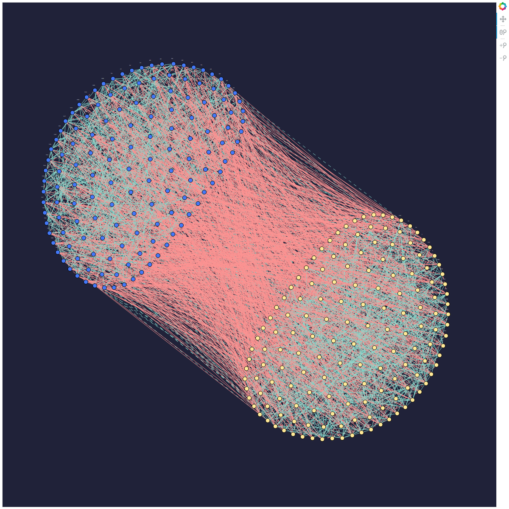

.. _example_cqm_binpacking:

===========
Bin Packing
===========

This example solves the known hard problem of 
`bin packing <https://en.wikipedia.org/wiki/Bin_packing_problem>`_ to demonstrate
using Leap's hybrid :term:`CQM` solver on a constrained problem of arbitrary 
structure and size.

Example Requirements
====================

To run the code in this example, the following is required.

* The requisite information for problem submission through SAPI, as described
  in :ref:`sapi_access`.
* Ocean tools :doc:`dwave-system </docs_system/sdk_index>` and 
  :doc:`dimod </docs_dimod/sdk_index>`.
* NumPy

.. example-requirements-start-marker

If you installed `dwave-ocean-sdk <https://github.com/dwavesystems/dwave-ocean-sdk>`_
and ran :code:`dwave setup`, your installation should meet these requirements.
In D-Wave's `Leap <https://cloud.dwavesys.com/leap/>`_ IDE, the default workspace
meets these requirements.

.. example-requirements-end-marker

Solution Steps
==============

Section :ref:`solving_problems` describes the process of solving problems on the quantum
computer in two steps: (1) Formulate the problem as a :term:`quadratic model` (QM)
and (2) Solve the QM with a D-Wave solver.
This example formulates the bin-packing problem as a 
:ref:`constrained quadratic model <cqm_sdk>` and uses the 
:class:`~dwave.system.samplers.LeapHybridCQMSampler` to find good solutions.

Formulate the Problem
=====================

>>> import numpy as np
>>> num_items = 50
>>> item_weight_range = [3, 7]
>>> weights = list(np.random.randint(*item_weight_range, num_items))
>>> bin_capacity = int(10 * np.mean(weights))

>>> from dimod import ConstrainedQuadraticModel, Binary
>>> cqm = ConstrainedQuadraticModel()
>>> bin_used = [Binary(f'bin_used_{j}') for j in range(num_items)]
>>> item_in_bin = [[Binary(f'item_in_bin_{i}_{j}') for j in range(num_items)]
...      for i in range(num_items)]

>>> cqm.set_objective(sum(bin_used))

>>> for i in range(num_items):
...     one_bin_per_item = cqm.add_constraint(sum(item_in_bin[i]) == 1, label=f'item_placing_{i}')

>>> for j in range(num_items):
...     bin_up_to_capacity = cqm.add_constraint(
...         sum(weights[i] * item_in_bin[i][j] for i in range(num_items)) - bin_used[j] * bin_capacity <= 0,
...         label=f'capacity_bin_{j}')

Solve the Problem by Sampling
=============================

As mentioned above, this example uses Ocean's :doc:`dwave_networkx </docs_dnx/sdk_index>`
function, :func:`~dwave_networkx.algorithms.social.structural_imbalance`, to create the 
appropriate BQM to represent
the problem graph and return a solution. It requires just the selection of a :term:`sampler`.

D-Wave's quantum cloud service provides cloud-based hybrid solvers you can submit arbitrary
BQMs to. These solvers, which implement state-of-the-art classical algorithms together
with intelligent allocation of the quantum processing unit (QPU) to parts of the problem
where it benefits most, are designed to accommodate even very large problems. Leap's
solvers can relieve you of the burden of any current and future development and optimization
of hybrid algorithms that best solve your problem.

Ocean software's :doc:`dwave-system </docs_system/sdk_index>`
:class:`~dwave.system.samplers.LeapHybridSampler` class enables you to easily incorporate 
Leap's hybrid solvers into your application:

>>> from dwave.system import LeapHybridSampler
>>> sampler = LeapHybridSampler()     # doctest: +SKIP

Finally, the returned set of frustrated edges and a bicoloring are counted and printed.

>>> import dwave_networkx as dnx
>>> imbalance, bicoloring = dnx.structural_imbalance(G, sampler)    # doctest: +SKIP
>>> set1 = int(sum(list(bicoloring.values())))        # doctest: +SKIP
>>> print("One set has {} nodes; the other has {} nodes.".format(set1, problem_node_count-set1))  # doctest: +SKIP
>>> print("The network has {} frustrated relationships.".format(len(list(imbalance.keys()))))    # doctest: +SKIP
One set has 143 nodes; the other has 157 nodes.
The network has 904 frustrated relationships.

The graphic below visualizes the result of one such run.

   One solution found for a 300-node problem. Two circular sets, of blue or yellow nodes, are internally connected by solid green edges representing friendly relationships while red edges representing hostile relationships and dashed green edges representing frustrated relationships are stretched out between these.
