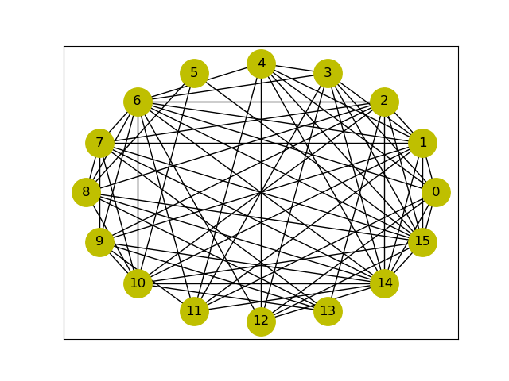
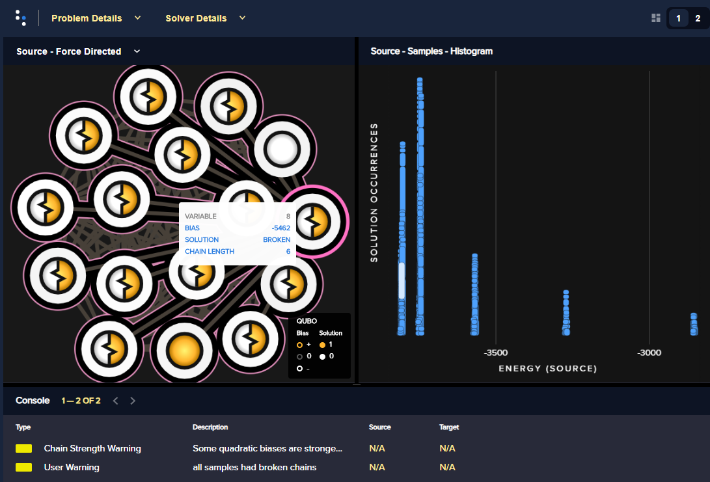
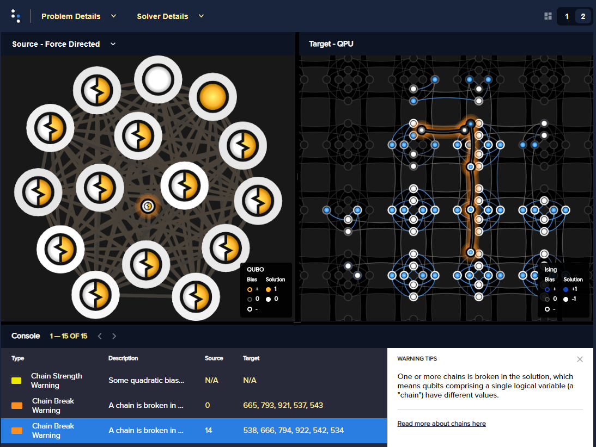
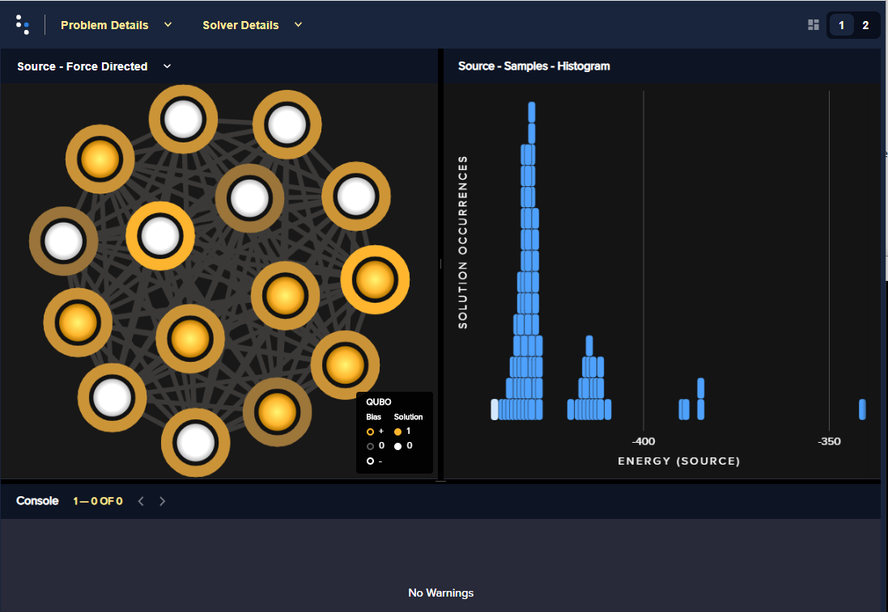

.. _inspector_graph_partitioning:

===========================
Using the Problem Inspector
===========================

This example solves a `graph partitioning <https://en.wikipedia.org/wiki/Graph_partition>`_
problem to show how D-Wave's :ref:`inspector` tool can help
you evaluate the :term:`minor-embedding` used in your problem submissions to the
quantum computer.

Example Requirements
====================

To run the code in this example, the following is required.

* The requisite information for problem submission through SAPI, as described
  in :ref:`sapi_access`.
* Ocean tools :doc:`dwave-system </docs_system/sdk_index>` and
  :doc:`dwave-inspector </docs_inspector>`.

If you installed `dwave-ocean-sdk <https://github.com/dwavesystems/dwave-ocean-sdk>`_
and ran :code:`dwave setup`, your installation should meet these requirements.
In D-Wave's `Leap <https://cloud.dwavesys.com/leap/>`_ IDE, the default workspace
meets these requirements.

Solution Steps
==============

The :ref:`solving_problems` section describes the process of solving problems on the quantum
computer in two steps: (1) Formulate the problem as a :term:`binary quadratic model` (BQM)
and (2) Solve the BQM with a D-wave system or classical :term:`sampler`. In this example,
a :term:`QUBO` is formulated with simple math, the problem is submitted naively to
the QPU, its minor embedding examined using the problem inspector, and the
submission improved.

Formulate the Problem
=====================

This example uses a synthetic problem for illustrative purposes: a NetworkX
generated graph,
`NetworkX random_geometric_graph() <https://networkx.github.io/documentation/stable/reference/generators.html#module-networkx.generators.random>`_. The problem of interest here,
which is NP-hard, is to try and find the best division of the graph's nodes into two
equal sets with a minimum number of edges between the two groups.

.. code-block:: python

    import networkx as nx

    graph_nodes = 16
    G = nx.random_geometric_graph(n=graph_nodes, radius=.5, dim=2)

   One arbitrary generation of the problem graph.

Reformulate the Problem Graph as a BQM
--------------------------------------

This example formulates the BQM as a QUBO using the same steps described in
detail in the `Graph Partitioning <https://github.com/dwave-examples/graph-partitioning>`_
code example of the `D-Wave Code Examples <https://github.com/dwave-examples>`_ GitHub
repository.

.. code-block:: python

    from collections import defaultdict
    from itertools import combinations

    gamma = 60

    Q = defaultdict(int)

    # Fill in Q matrix
    for u, v in G.edges:
        Q[(u,u)] += 1
        Q[(v,v)] += 1
        Q[(u,v)] += -2

    for i in G.nodes:
        Q[(i,i)] += gamma*(1-len(G.nodes))

    for i, j in combinations(G.nodes, 2):
    	Q[(i,j)] += 2*gamma

Print the range of values for the generated QUBO's elements:

>>> print("Maximum element is {:.2f} and minimum is {:.2f}.".format(max(Q.values()), min(Q.values())))
Maximum element is 120.00 and minimum is -898.00.

Solve the Problem by Sampling
=============================

.. note:: Importing the problem inspector activates for the session the capture of
   data such as problems sent to the QPU and returned responses, relevant details of
   minor-embedding, and warnings. The recommended workflow is to import it at the
   start of your coding session or at least before submitting your problem, as is
   done below.

.. code-block:: python

    import numpy as np
    from dwave.system import DWaveSampler, EmbeddingComposite

    # Import the problem inspector to begin data capture
    import dwave.inspector

    sampler = EmbeddingComposite(DWaveSampler(solver={'qpu': True}))

    num_reads = 1000
    response = sampler.sample_qubo(Q, num_reads=num_reads)

Check the best returned answer:

>>> print("Number of nodes in one set is {}, in the other, {}. Energy is {}.".format(
           sum(response.first.sample.values()),
           graph_nodes - sum(response.first.sample.values()),
           response.first.energy))
Number of nodes in one set is 8, in the other, 8. Energy is -3813.0.

One simple measure of the overall quality of the returned samples is the percentage
of samples based on chains with high breakage rates. Here a rate above one third is chosen:

>>> print("Percentage of samples with high rates of breaks is {}.".format(
           np.count_nonzero(response.record.chain_break_fraction > 0.33)/num_reads*100))
Percentage of samples with high rates of breaks is 78.7.

Inspect the Submission
----------------------

Use the problem inspector on the returned samples:

.. code-block:: python

    dwave.inspector.show(response)

   Problem inspector displaying the logical problem: the problem graph, on the left, and the returned energies hysteresis, on the right, for a submission with the chain strength set to its default value. For one arbitrary solution, selected by clicking an energy bar on the right (highlighted white), all values but two are shown as being based on broken chains. The selected variable on the left, variable :math:`8`, is shown to be represented on the QPU by a chain of 6 qubits.

You can select a view in the displayed problem that shows the broken chains on the
QPU qubits:

   Problem inspector displaying the embedded problem, with broken chains highlighted, for a submission with the chain strength set to its default value.

Using the same logic described in the
`Graph Partitioning <https://github.com/dwave-examples/graph-partitioning>`_
code example, the problem is resubmitted using a higher chain strength:

.. code-block:: python

    response = sampler.sample_qubo(Q, num_reads=num_reads, chain_strength=1000)

Check the best returned answer and percentage of samples based on chains with breakage
rates of over 33 percent:

>>> print("Number of nodes in one set is {}, in the other, {}. Energy is {}.".format(
           sum(response.first.sample.values()),
           graph_nodes - sum(response.first.sample.values()),
           response.first.energy))
Number of nodes in one set is 8, in the other, 8. Energy is -3813.0.
...
>>> print("Percentage of samples with high rates of breaks is {}.".format(
           np.count_nonzero(response.record.chain_break_fraction > 0.33)/num_reads*100))
Percentage of samples with high rates of breaks is 0.0.

Again use the problem inspector on the returned samples:

.. code-block:: python

    dwave.inspector.show(response)

   Problem inspector displaying the logical problem: graph and the returned energies hysteresis for a submission with the chain strength set to :math:`1000`. For one arbitrary solution, selected by clicking an energy bar on the right (highlighted white), all values are shown as being based on non-broken chains. 
