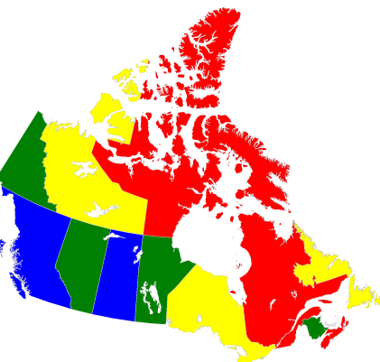

.. _map_coloring:

============
Map Coloring
============

This example solves a map-coloring problem to demonstrate using Ocean tools
to solve a problem on a D-Wave system. It demonstrates using the D-Wave system
to solve a more complex constraint satisfaction problem (CSP) than that solved in
the example of :ref:`scheduling`.

Constraint satisfaction problems require that all a problem's variables be assigned
values, out of a finite domain, that result in the satisfying of all constraints.
The map-coloring CSP, for example, is to assign a color to each region of a map such that
any two regions sharing a border have different colors.

   Coloring a map of Canada with four colors.

The constraints for the map-coloring problem can be expressed as follows:

* Each region is assigned one color only, of :math:`C` possible colors.
* The color assigned to one region cannot be assigned to adjacent regions.

Example Requirements
====================

To run the code in this example, the following is required.

* The requisite information for problem submission through SAPI, as described in
  :ref:`dwavesys`\ .
* Ocean tools
  :std:doc:`dwavebinarycsp <binarycsp:index>` and
  :std:doc:`dwave-system <system:index>`. For graphics,
  you will also need `NetworkX <https://networkx.github.io/>`_\ .

If you installed `dwave-ocean-sdk <https://github.com/dwavesystems/dwave-ocean-sdk>`_
and ran :code:`dwave config create`, your installation should meet these requirements.

Solution Steps
==============

Following the standard solution process described in Section :ref:`solving_problems`,
we (1) formulate the problem as a :term:`binary quadratic model` (BQM) by using unary
encoding to represent the :math:`C` colors: each region is represented by :math:`C`
variables, one for each possible color, which is set to value :math:`1` if selected, while the
remaining :math:`C-1` variables are :math:`0`. (2) Solve the BQM with a D-Wave system
as the sampler.

The full workflow is as follows:

#. Formulate the problem as a graph, with provinces represented as nodes and shared borders as edges,
   using 4 binary variables (one per color) for each province.
#. Create a binary constraint satisfaction problem and add all the needed constraints.
#. Convert to a binary quadratic model.
#. Sample.
#. Plot a valid solution.

Four-Color Canadian Map
=======================

This example finds a solution to the map-coloring problem for a map of Canada
using four colors (the sample code can easily be modified to change the number of
colors or use different maps). Canada's 13 provinces are denoted by postal codes:

.. list-table:: Canadian Provinces' Postal Codes
   :widths: 10 20 10 20
   :header-rows: 1

   * - Code
     - Province
     - Code
     - Province
   * - AB
     - Alberta
     - BC
     - British Columbia
   * - MB
     - Manitoba
     - NB
     - New Brunswick
   * - NL
     - Newfoundland and Labrador
     - NS
     - Nova Scotia
   * - NT
     - Northwest Territories
     - NU
     - Nunavut
   * - ON
     - Ontario
     - PE
     - Prince Edward Island
   * - QC
     - Quebec
     - SK
     - Saskatchewan
   * - YT
     - Yukon
     -
     -

.. toctree::
   :maxdepth: 1
   :hidden:

   map_coloring_full_code

.. note:: You can skip directly to the complete code for the problem here:
    :ref:`map_coloring_full_code`.

The example uses the
:std:doc:`D-Wave binary CSP tool <binarycsp:index>`
to set up constraints and convert the CSP to a binary quadratic model,
:std:doc:`dwave-system <system:index>` to set up a D-Wave
system as the :term:`sampler`, and `NetworkX <https://networkx.github.io/>`_ to
plot results.

.. code-block:: python

    import dwavebinarycsp
    from dwave.system.samplers import DWaveSampler
    from dwave.system.composites import EmbeddingComposite
    import networkx as nx
    import matplotlib.pyplot as plt

Start by formulating the problem as a graph of the map with provinces as nodes and
shared borders between provinces as edges (e.g., "('AB', 'BC')" is an edge representing
the shared border between British Columbia and Alberta).

.. code-block:: python

    # Represent the map as the nodes and edges of a graph
    provinces = ['AB', 'BC', 'MB', 'NB', 'NL', 'NS', 'NT', 'NU', 'ON', 'PE',
                 'QC', 'SK', 'YT']
    neighbors = [('AB', 'BC'), ('AB', 'NT'), ('AB', 'SK'), ('BC', 'NT'), ('BC', 'YT'),
                 ('MB', 'NU'), ('MB', 'ON'), ('MB', 'SK'), ('NB', 'NS'), ('NB', 'QC'),
                 ('NL', 'QC'), ('NT', 'NU'), ('NT', 'SK'), ('NT', 'YT'), ('ON', 'QC')]

Create a binary constraint satisfaction problem based on two types of constraints,
where `csp` is the
:std:doc:`dwavebinarycsp <binarycsp:index>` CSP object:

* :code:`csp.add_constraint(one_color_configurations, variables)` represents the constraint
  that each node (province) select a single color, as represented by valid configurations
  :code:`one_color_configurations = {(0, 0, 0, 1), (0, 0, 1, 0), (0, 1, 0, 0), (1, 0, 0, 0)}`
* :code:`csp.add_constraint(not_both_1, variables)` represents the constraint that
  two nodes (provinces) with a shared edge (border) not both select the same color.

.. code-block:: python

    # Function for the constraint that two nodes with a shared edge not both select
    # one color
    def not_both_1(v, u):
        return not (v and u)

    # Valid configurations for the constraint that each node select a single color
    one_color_configurations = {(0, 0, 0, 1), (0, 0, 1, 0), (0, 1, 0, 0), (1, 0, 0, 0)}
    colors = len(one_color_configurations)

    # Create a binary constraint satisfaction problem
    csp = dwavebinarycsp.ConstraintSatisfactionProblem(dwavebinarycsp.BINARY)

    # Add constraint that each node (province) select a single color
    for province in provinces:
        variables = [province+str(i) for i in range(colors)]
        csp.add_constraint(one_color_configurations, variables)

    # Add constraint that each pair of nodes with a shared edge not both select one color
    for neighbor in neighbors:
        v, u = neighbor
        for i in range(colors):
            variables = [v+str(i), u+str(i)]
            csp.add_constraint(not_both_1, variables)

Convert the CSP into a binary quadratic model so it can be solved on the D-Wave
system.

.. code-block:: python

    bqm = dwavebinarycsp.stitch(csp)

The next code sets up a D-Wave system as the sampler and requests 50 samples.

.. note:: In the code below, replace sampler parameters as needed. If
      you configured a default solver, as described in :ref:`dwavesys`, you
      should be able to set the sampler without parameters as
      :code:`sampler = EmbeddingComposite(DWaveSampler())`.
      You can see this information by running :code:`dwave config inspect` in your terminal.

.. code-block:: python

    # Sample 50 times
    sampler = EmbeddingComposite(DWaveSampler(endpoint='https://URL_to_my_D-Wave_system/', token='ABC-123456789012345678901234567890', solver='My_D-Wave_Solver'))
    response = sampler.sample(bqm, num_reads=50)

.. note:: The next code requires `Matplotlib <https://matplotlib.org>`_\ .

Plot a valid solution.

.. code-block:: python

    # Function that plots a returned sample
    def plot_map(sample):
        G = nx.Graph()
        G.add_nodes_from(provinces)
        G.add_edges_from(neighbors)
        # Translate from binary to integer color representation
        color_map = {}
        for province in provinces:
    	      for i in range(colors):
                if sample[province+str(i)]:
                    color_map[province] = i
        # Plot the sample with color-coded nodes
        node_colors = [color_map.get(node) for node in G.nodes()]
        nx.draw_circular(G, with_labels=True, node_color=node_colors, node_size=3000, cmap=plt.cm.rainbow)
        plt.show()

    # Plot the lowest-energy sample if it meets the constraints
    sample = next(response.samples())
    if not csp.check(sample):
        print("Failed to color map")
    else:
        plot_map(sample)

The plot shows a solution returned by the D-Wave solver. No provinces sharing a border
have the same color.

.. figure:: ../_static/map_coloring_CSP4colors.png
   :name: MapColoring_CSP4colors
   :alt: image
   :align: center
   :scale: 70 %

   Solution for a map of Canada with four colors. The graph comprises 13 nodes representing
   provinces connected by edges representing shared borders. No two nodes connected by
   an edge share a color.

.. note:: You can copy the complete code for the problem here:
    :ref:`map_coloring_full_code`.
