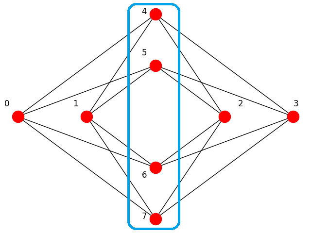

.. _max_cut:

================
Maximum Cut
================

This example solves a problem of a maximum graph cut to demonstrate using Ocean tools
to solve a problem on a D-Wave system.

It adds to the examples of :ref:`not` and :ref:`and` the following more advanced features:

* Algorithmic :term:`minor-embedding` using a composed :term:`sampler`.

A maximum cut is a subset of a graph's vertices such that the number of edges
between this subset and the remaining vertices is as large as possible.

   Maximum cut for a Chimera unit cell: the blue line around the subset of nodes
   {4, 5, 6, 7} cuts 16 edges; adding or removing a node decreases
   the number of edges between the two complementary subsets of the graph.

Example Requirements
====================

To run the code in this example, the following is required.

* The requisite information for problem submission through SAPI, as described in
  :ref:`dwavesys`\ , in a configuration file for connection to a D-Wave system,
  as described in
  `dwave-cloud-client <http://dwave-cloud-client.readthedocs.io/en/latest/>`_\ .
* Installation of Ocean tools `dwave-system <https://github.com/dwavesystems/dwave-system>`_ and
  `dwave_networkx <http://dwave-networkx.readthedocs.io/en/latest/index.html>`_\ .

Example Code
============

The example configures a D-Wave :term:`solver` you have access to as a
:term:`sampler`, creates a graph, and submits a maximum-cut problem on that graph to
the solver for solution.
The results should mostly show values representing a
valid maximum cut.

.. note:: As stated in the requirements section above, you should have set up
     a configuration file for connection to a D-Wave system, as described in
     `dwave-cloud-client <http://dwave-cloud-client.readthedocs.io/en/latest/>`_\ .

The first example code creates a graph that exactly duplicates the structure of a fully
working :term:`Chimera` unit cell. It relies on the default embedding of the DWaveSampler to correctly
:term:`minor-embed` the graph in the first :term:`Chimera` unit cell (qubits 0 to 7).
See the example in :ref:`and` for fuller code on verifying that the target qubits are active.

>>> import dwave_networkx as dnx
>>> from dwave.system.samplers import DWaveSampler
>>> G = dnx.chimera_graph(1, 1, 4)
>>> sampler = DWaveSampler()
>>> dnx.maximum_cut(G, sampler) # doctest: +SKIP
{4, 5, 6, 7}

The second example code creates a graph that duplicates the structure of two adjacent
:term:`Chimera` unit cells. It uses the `dwave-system <https://github.com/dwavesystems/dwave-system>`_
algorithm for :term:`minor-embedding` into at least two :term:`Chimera` unit cells.
Two runs produced complementary results.

>>> import dwave_networkx as dnx
>>> from dwave.system.samplers import DWaveSampler
>>> from dwave.system.composites import EmbeddingComposite
>>> G = dnx.chimera_graph(2, 1, 4)
>>> sampler = EmbeddingComposite(DWaveSampler())
>>> dnx.maximum_cut(G, sampler) # doctest: +SKIP
{4, 5, 6, 7, 8, 9, 10, 11}
>>> dnx.maximum_cut(G, sampler) # doctest: +SKIP
{0, 1, 2, 3, 12, 13, 14, 15}

Optional Example Code
=====================

.. note:: This example code requires `Matplotlib <https://matplotlib.org>`_\ .

The Ocean `dwave_networkx <http://dwave-networkx.readthedocs.io/en/latest/index.html>`_
tool includes some graphic functionality helpful for work on Chimera graphs. The following
example code visualizes the graph used in the previous example code.

>>> import dwave_networkx as dnx
>>> import matplotlib.pyplot as plt
>>> G = dnx.chimera_graph(2, 1, 4)
>>> plt.ion()
>>> dnx.draw_chimera(G, with_labels=True)

.. figure:: ../_static/draw_chimera_2_1_4.png
   :name: draw_chimera
   :align: center
   :scale: 80 %

   Visualization of two adjacent Chimera unit cells.
