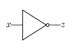

.. _not:

================
Boolean NOT Gate
================

This example solves a simple problem of a Boolean NOT gate to demonstrate the mathematical formulation
of a problem as a :term:`binary quadratic model` (BQM) and using Ocean tools to solve such problems
on a D-Wave system.
Other examples demonstrate the more
advanced steps that are typically needed for solving actual problems.

Example Requirements
====================

To run the code in this example, the following is required.

* The requisite information for problem submission through SAPI, as described in :ref:`dwavesys`
* Ocean tools :std:doc:`dwave-system <system:index>` and :std:doc:`dimod <dimod:index>`.

If you installed `dwave-ocean-sdk <https://github.com/dwavesystems/dwave-ocean-sdk>`_
and ran :code:`dwave config create`, your installation should meet these requirements.

Solution Steps
==============

Section :ref:`solving_problems` describes the process of solving problems on the quantum
computer in two steps: (1) Formulate the problem as a :term:`binary quadratic model` (BQM)
and (2) Solve the BQM with a D-wave system or classical :term:`sampler`. In this example,
we mathematically formulate the BQM and use Ocean tools to solve it on a D-Wave system.

Formulate the NOT Gate as a BQM
===============================

We use a :term:`sampler` like the D-Wave systems to solve binary quadratic models (BQM)\ [#]_\:
given :math:`M` variables :math:`x_1,...,x_N`, where each variable :math:`x_i` can
have binary values :math:`0` or :math:`1`, the system tries to find assignments of values
that minimize

.. math::

    \sum_i^N q_ix_i + \sum_{i<j}^N q_{i,j}x_i  x_j,

where :math:`q_i` and :math:`q_{i,j}` are configurable (linear and quadratic) coefficients.
To formulate a problem for the D-Wave system is to program :math:`q_i` and :math:`q_{i,j}` so
that assignments of :math:`x_1,...,x_N` also represent solutions to the problem.

.. [#] The "native" forms of BQM programmed into a D-Wave system are the :term:`Ising` model
       traditionally used in statistical mechanics and its computer-science equivalent,
       shown here, the :term:`QUBO`.

Ocean tools can automate the representation of logic gates as a BQM, as demonstrated
in the :ref:`multi_gate` example.

.. raw::  latex

    \begin{figure}
    \begin{centering}
    \begin{circuitikz}

    \node (in1) at (0, 0) {$x$};
    \node(out1) at  (2, 0) {$z$} ;

    \draw

    (1, 0) node[not port] (mynot1) {}

    (0.1, 0) -- (mynot1.in)
    (mynot1.out) -- (1.9, 0);

    \end{circuitikz}\\

    \end{centering}

    \caption{NOT gate}
    \label{fig:notGate}
    \end{figure}

    A NOT gate is shown in Figure \ref{fig:notGate}.

   A NOT gate.

Representing the Problem With a Penalty Function
------------------------------------------------

This example demonstrates a mathematical formulation of the BQM. We can represent a NOT gate,
:math:`z \Leftrightarrow \neg x`, where :math:`x` is the
gate's input and :math:`z` its output, using a :term:`penalty function`:

.. math::

    2xz-x-z+1.

This penalty function represents the NOT gate in that for assignments of variables that
match valid states of the gate, the function evaluates at a lower value than assignments
that would be invalid for the gate. Therefore, when the D-Wave minimizes a BQM based on this
penalty function, it finds those assignments of variables that match valid gate states.

The table below shows that this function penalizes states
that are not valid for the gate while no penalty is applied to assignments of
variables that correctly represent a NOT gate. In this table, column **x** is all
possible states of the gate's input; column :math:`\mathbf{z}` is the corresponding
output values; column **Valid?** shows whether the variables represent a valid state
for a NOT gate; column :math:`\mathbf{P}` shows the value of the penalty for all
possible assignments of variables.

.. table:: Boolean NOT Operation Represented by a Penalty Function.
   :name: BooleanNOTAsPenalty

   ===========  ===================  ==========  ===================
   **x**        :math:`\mathbf{z}`   **Valid?**  :math:`\mathbf{P}`
   ===========  ===================  ==========  ===================
   :math:`0`    :math:`1`            Yes         :math:`0`
   :math:`1`    :math:`0`            Yes         :math:`0`
   :math:`0`    :math:`0`            No          :math:`1`
   :math:`1`    :math:`1`            No          :math:`1`
   ===========  ===================  ==========  ===================

For example, the state :math:`x, z=0,1` of the first row represents
valid assignments, and the value of :math:`P` is

.. math::

    2xz-x-z+1 = 2 \times 0 \times 1 - 0 - 1 + 1 = -1+1=0,

not penalizing the valid assignment of variables. In contrast, the state :math:`x,
z=0,0` of the third row represents an invalid assignment, and the
value of :math:`P` is

.. math::

    2xz-x-z+1 = 2 \times 0 \times 0 -0 -0 +1 =1,

adding a value of :math:`1` to the BQM being minimized. By penalizing both possible
assignments of variables that represent invalid states of a NOT gate, the BQM based
on this penalty function has minimal values (lowest energy states) for variable values
that also represent a NOT gate.

See the system documentation for more information about penalty functions in general,
and penalty functions for representing Boolean operations.

Formulating the Problem as a QUBO
---------------------------------

Sometimes penalty functions are of cubic or higher degree and must be
reformulated as quadratic to be mapped to a binary quadratic model. For this
penalty function we just need to drop the freestanding constant: the function's
values are simply shifted by :math:`-1` but still those representing valid states of
the NOT gate are lower than those representing invalid states.
The remaining terms of the penalty function,

.. math::

    2xz-x-z,

are easily reordered in standard :term:`QUBO` formulation:

.. math::

    -x_1 -x_2  + 2x_1x_2

where :math:`z=x_2` is the NOT gate's output, :math:`x=x_1` the input, linear
coefficients are :math:`q_1=q_2=-1`, and quadratic coefficient is :math:`q_{1,2}=2`.
These are the coefficients used to program a D-Wave system.

Often it is convenient to format the coefficients as an upper-triangular matrix:

.. math::

     Q = \begin{bmatrix} -1 & 2 \\ 0 & -1 \end{bmatrix}

See the system documentation for more information about formulating problems as QUBOs.

Solve the Problem by Sampling
=============================

We now solve on a D-Wave system using sampler *DWaveSampler()* from Ocean software's
:std:doc:`dwave-system <system:index>`. We also use
its *EmbeddingComposite()* composite to map our unstructured problem (variables
such as :code:`time` etc.) to the sampler's graph structure (the QPU's numerically
indexed qubits) in a process known as :term:`minor-embedding`.

The next code sets up a D-Wave system as the sampler.

.. note:: In the code below, replace sampler parameters in the third line. If
      you configured a default solver, as described in :ref:`dwavesys`, you
      should be able to set the sampler without parameters as
      :code:`sampler = EmbeddingComposite(DWaveSampler())`.
      You can see this information by running :code:`dwave config inspect` in your terminal.

>>> from dwave.system.samplers import DWaveSampler
>>> from dwave.system.composites import EmbeddingComposite
>>> sampler = EmbeddingComposite(DWaveSampler(endpoint='https://URL_to_my_D-Wave_system/', token='ABC-123456789012345678901234567890', solver='My_D-Wave_Solver'))

Because the sampled solution is probabilistic, returned solutions may differ between runs. Typically,
when submitting a problem to the system, we ask for many samples, not just one. This way, we see multiple
“best” answers and reduce the probability of settling on a suboptimal answer. Below, we
ask for 5000 samples.

>>> Q = {('x', 'x'): -1, ('x', 'z'): 2, ('z', 'x'): 0, ('z', 'z'): -1}
>>> response = sampler.sample_qubo(Q, num_reads=5000)
>>> for datum in response.data(['sample', 'energy', 'num_occurrences']):   # doctest: +SKIP
...    print(datum.sample, "Energy: ", datum.energy, "Occurrences: ", datum.num_occurrences)
...
{'x': 0, 'z': 1} Energy:  -1.0 Occurrences:  2062
{'x': 1, 'z': 0} Energy:  -1.0 Occurrences:  2937
{'x': 1, 'z': 1} Energy:  0.0 Occurrences:  1

Almost all the returned samples represent valid value assignments for a NOT gate,
and minimize (are low-energy states of) the BQM.

Summary
=======

In the terminology of :ref:`oceanstack`\ , Ocean tools moved the original problem through the
following layers:

* The sampler API is a :term:`QUBO` formulation of the problem.
* The sampler is *DWaveSampler()*.
* The compute resource is a D-Wave system.
