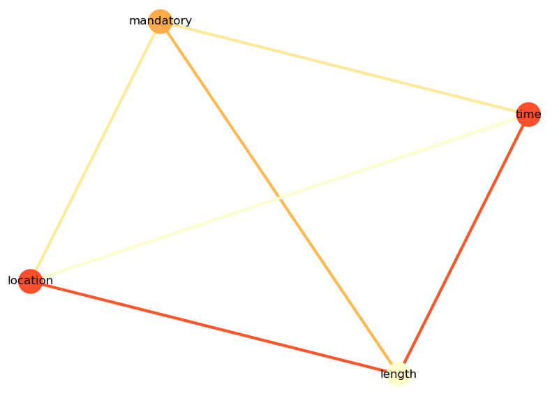
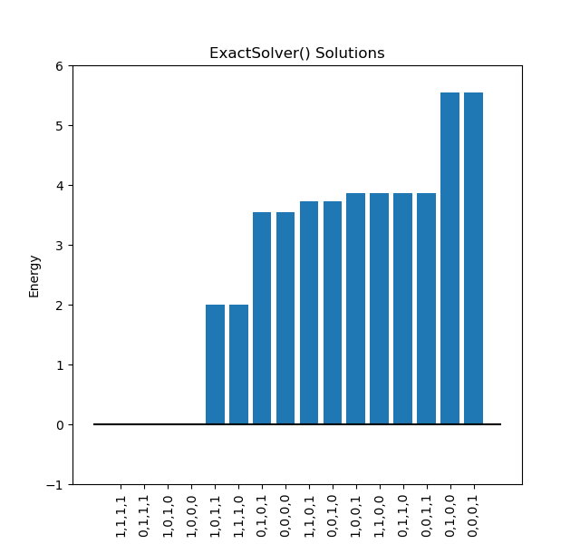

.. _scheduling:

======================
Constrained Scheduling
======================

This example solves a binary *constraint satisfaction problem* (:term:`CSP`).
CSPs require that all a problem's variables be assigned values that result in
the satisfying of all constraints. Here, the constraints are a company's policy
for scheduling meetings:

* Constraint 1: During business hours, all meetings must be attended in person
  at the office.
* Constraint 2: During business hours, participation in meetings is mandatory.
* Constraint 3: Outside business hours, meetings must be teleconferenced.
* Constraint 4: Outside business hours, meetings must not exceed 30 minutes.

Solving such a CSP means finding meetings that meet all the constraints.

The purpose of this example is to help a new user to formulate a constraint
satisfaction problem using Ocean tools and solve it on a D-Wave quantum computer.
Other examples demonstrate more advanced steps that might be needed for complex
problems.

Example Requirements
====================

To run the code in this example, the following is required.

* The requisite information for problem submission through SAPI, as described
  in :ref:`sapi_access`.
* Ocean tools :doc:`dwave-system </docs_system/sdk_index>` and
  :doc:`dimod </docs_dimod/sdk_index>`.

.. include:: hybrid_solver_service.rst
  :start-after: example-requirements-start-marker
  :end-before: example-requirements-end-marker

Solution Steps
==============

.. include:: hybrid_solver_service.rst
  :start-after: example-steps-start-marker
  :end-before: example-steps-end-marker

This example creates a :term:`binary quadratic model` (BQM) based on
:ref:`penalties <penalty_sdk>` to represent the problem's constraints.

Formulate the Problem
=====================

D-Wave quantum computers solve binary quadratic models, so the first step is to
express the problem with binary variables.

* Time of day is represented by binary variable :math:`t` with value :math:`1`
  for business hours and :math:`0` for hours outside the business day.
* Venue is represented by binary variable :math:`v` with value :math:`1` for
  office and :math:`0` for teleconference.
* Meeting length is represented by variable :math:`l` with value :math:`1` for
  short meetings (under 30 minutes) and :math:`0` for meetings of longer duration.
* Participation is represented by variable :math:`m` with value :math:`1` for
  mandatory participation and :math:`0` for optional participation.

.. note:: A slightly more complex problem might require variables with multiple
   values; for example, :code:`length` could have values :code:`{30, 60, 120}`
   representing the duration in minutes of meetings of several lengths. For such
   problems a :term:`discrete quadratic model` (DQM) could be a better choice.

   In general, problems with constraints are more simply solved using a
   :term:`constrained quadratic model` (CQM) and appropriate hybrid CQM solver, as
   demonstrated in the :ref:`example_cqm_binpacking` and
   :ref:`example_cqm_stock_selling` examples; however, the purpose of this example
   is to demonstrate solution directly on a D-Wave quantum computer.

For large numbers of variables and constraints, such problems can be hard.
This example has four binary variables, so only :math:`2^4=16` possible meeting arrangements.
As shown in the table below, it is a simple matter to work out all the combinations by hand to
find solutions that meet all the constraints.

.. table:: All Possible Meeting Options.
   :name: MeetingOptions

   ====================  =================  ==============  ==================  =================
   **Time of Day**       **Venue**          **Duration**    **Participation**   **Valid?**
   ====================  =================  ==============  ==================  =================
   Business hours        Office             Short           Mandatory           Yes
   Business hours        Office             Short           Optional            No (violates 2)
   Business hours        Office             Long            Mandatory           Yes
   Business hours        Office             Long            Optional            No (violates 2)
   Business hours        Teleconference     Short           Mandatory           No (violates 1)
   Business hours        Teleconference     Short           Optional            No (violates 1, 2)
   Business hours        Teleconference     Long            Mandatory           No (violates 1)
   Business hours        Teleconference     Long            Optional            No (violates 1, 2)
   Non-business hours    Office             Short           Mandatory           No (violates 3)
   Non-business hours    Office             Short           Optional            No (violates 3)
   Non-business hours    Office             Long            Mandatory           No (violates 3, 4)
   Non-business hours    Office             Long            Optional            No (violates 3, 4)
   Non-business hours    Teleconference     Short           Mandatory           Yes
   Non-business hours    Teleconference     Short           Optional            Yes
   Non-business hours    Teleconference     Long            Mandatory           No (violates 4)
   Non-business hours    Teleconference     Long            Optional            No (violates 4)
   ====================  =================  ==============  ==================  =================

Represent Constraints as Penalties
----------------------------------

You can represent each constraint as a BQM using :ref:`penalty_sdk`. This example
uses binary (:math:`\{0, 1\}`\ --valued) variables as follows:

* Constraint 1: During business hours, all meetings must be attended in person
  at the office.

  This constraint requires that if :math:`t=1` (time of day is within
  business hours) then :math:`v = 1` (venue is the office). A simple
  penalty function is :math:`t-tv`, as shown in the truth table below:

  .. list-table:: Constraint 1: :math:`t-tv`
     :header-rows: 1

     * - :math:`t`
       - :math:`v`
       - :math:`t-tv`
     * - 0
       - 0
       - 0
     * - 0
       - 1
       - 0
     * - 1
       - 0
       - 1
     * - 1
       - 1
       - 0

  Penalty function :math:`t-tv` sets a penalty of 1 when :math:`t=1 \; \& \; v=0`, for
  a meeting outside the office during business hours. When incorporated in an
  objective function, solutions that violate :math:`t=1 \rightarrow v=1` do not
  have yield minimal values.

  .. note:: One way to derive such a penalty function is to start with the
    simple case of a Boolean operator: to penalize :math:`a=b=1` you could use
    the AND constraint :math:`ab`. To penalize :math:`a=1, b=0`, you need
    :math:`a \overline{b}`. For :math:`\{0, 1\}`\ --valued variables,
    :math:`\overline{b} = 1-b` so you get :math:`a \overline{b} = a(1-b) = a - ab`.
    For more information on formulating such constraints, see the
    :std:doc:`D-Wave Problem-Solving Handbook <sysdocs_gettingstarted:doc_handbook>`
    guide.

* Constraint 2: During business hours, participation in meetings is mandatory.

  This constraint requires that if :math:`t=1` (time of day is within
  business hours) then :math:`m=1` (participation is mandatory). A penalty
  function is :math:`t-tm`, analogous to constraint 1.

* Constraint 3: Outside business hours, meetings must be teleconferenced.

  This constraint requires that if :math:`t=0` (time of day is outside
  business hours) then :math:`v=0` (venue is teleconference, not the office).
  A penalty function is :math:`v-tv`, a reversal of constraint 1.

* Constraint 4: Outside business hours, meetings must not exceed 30 minutes.

  This constraint requires that if :math:`t=0` (time of day is outside
  business hours) then :math:`l=1` (meeting length is short).
  A simple penalty function is :math:`1+tl-t-l`, as shown in the truth
  table below:

  .. list-table:: Constraint 1: :math:`1+tl-t-l`
     :header-rows: 1

     * - :math:`t`
       - :math:`l`
       - :math:`1+tl-t-l`
     * - 0
       - 0
       - 1
     * - 0
       - 1
       - 0
     * - 1
       - 0
       - 0
     * - 1
       - 1
       - 0

  Penalty function :math:`1+tl-t-l` sets a penalty of 1 when :math:`t=0 \; \& \; l=0`,
  for a lengthy meeting outside business hours. When incorporated in an
  objective function, solutions that violate :math:`t=0 \rightarrow l=1` do not
  have yield minimal values.

Create a BQM
------------

The total penalty for all four constraints is :math:`t-tv + t-tm + v-tv + 1+tl-t-l`.

Ocean's :doc:`dimod </docs_dimod/sdk_index>` enables the creation of BQMs.

The next code lines create a constraint from this function and adds it to CSP instance,
:code:`csp`, instantiated with binary variables.

>>> import dwavebinarycsp
>>> csp = dwavebinarycsp.ConstraintSatisfactionProblem(dwavebinarycsp.BINARY)
>>> csp.add_constraint(scheduling, ['time', 'location', 'length', 'mandatory'])

This tool, :doc:`dwavebinarycsp </docs_binarycsp/sdk_index>`, can also convert the binary CSP to a BQM.
The following code does so and the graph below
provides a view on the BQM's linear and quadratic coefficients, :math:`q_i` and :math:`q_{i,j}` respectively
in :math:`\sum_i^N q_ix_i + \sum_{i<j}^N q_{i,j}x_i  x_j`, which are the inputs for programming
the quantum computer.

>>> bqm = dwavebinarycsp.stitch(csp)

   A heatmap of the BQM, with darker colors for higher linear (node color) and quadratic (edge color) values. You can see the values simply by using the :code:`print(bqm)` command.

Solve the Problem by Sampling
=============================

For small numbers of variables, even your computer's CPU can solve CSPs
quickly. Here you solve both classically on your CPU and on the quantum computer.

Solving Classically on a CPU
----------------------------

Before using a D-Wave quantum computer, it can sometimes be helpful to test code
locally. Here, select one of Ocean software's test samplers to solve classically
on a CPU.
Ocean's :doc:`dimod </docs_dimod/sdk_index>` provides a sampler that simply
returns the BQM's value (energy) for every possible assignment of variable values.

>>> from dimod.reference.samplers import ExactSolver
>>> sampler = ExactSolver()
>>> solution = sampler.sample(bqm)

Valid solutions---assignments of variables that do not violate any constraint---should
have the lowest value of the BQM:

   Energy of all 16 possible configurations. You can see the values simply by using the :code:`print(solution)` command.

The code below prints all those solutions (assignments of variables) for which the BQM has
its minimum value\ [#]_\ .

>>> from math import isclose
>>> min_energy = solution.record.energy.min()
>>> for sample, energy in solution.data(['sample', 'energy']):    # doctest: +SKIP
...     if isclose(energy, min_energy, abs_tol=1.0):
...         time = 'business hours' if sample['time'] else 'evenings'
...         location = 'office' if sample['location'] else 'home'
...         length = 'short' if sample['length'] else 'long'
...         mandatory = 'mandatory' if sample['mandatory'] else 'optional'
...         print("During {} at {}, you can schedule a {} meeting that is {}".format(time, location, length, mandatory))
...
During evenings at home, you can schedule a short meeting that is optional
During evenings at home, you can schedule a short meeting that is mandatory
During business hours at office, you can schedule a short meeting that is mandatory
During business hours at office, you can schedule a long meeting that is mandatory

.. [#] Because it compares float values, this code uses the standard :code:`isclose`
   function to find values that are approximately equal. A small tolerance is needed
   to overcome rounding errors but for simplicity a value of :code:`abs_tol=1.0` is used
   because by default the :func:`~dwavebinarycsp.dwavebinarycsp.compilers.stitcher.stich` function increases the
   energy of solutions that violate one constraint by :code:`min_classical_gap=2.0`.

Solving on a D-Wave Quantum Computer
------------------------------------

Now solve on a D-Wave system using sampler :class:`~dwave.system.samplers.DWaveSampler`
from Ocean software's :doc:`dwave-system </docs_system/sdk_index>`. Also use
its :class:`~dwave.system.composites.EmbeddingComposite` composite to map our unstructured
problem (variables such as :code:`time` etc.) to the sampler's graph structure (the QPU's numerically
indexed qubits) in a process known as :term:`minor-embedding`. The next code sets up
a D-Wave quantum computer as the sampler.

.. include:: min_vertex.rst
   :start-after: default-config-start-marker
   :end-before: default-config-end-marker

>>> from dwave.system import DWaveSampler, EmbeddingComposite
>>> sampler = EmbeddingComposite(DWaveSampler())

Because the sampled solution is probabilistic, returned solutions may differ between runs.
Typically, when submitting a problem to a quantum computer, you ask for many samples, not just one.
This way, you see multiple “best” answers and reduce the probability of settling on a
suboptimal answer. Below, ask for 5000 samples.

>>> sampleset = sampler.sample(bqm, num_reads=5000, label='SDK Examples - Scheduling')

The code below prints all those solutions (assignments of variables) for which the BQM has
its minimum value and the number of times it was found.

>>> total = 0
... for sample, energy, occurrences in sampleset.data(['sample', 'energy', 'num_occurrences']):  # doctest: +SKIP
...     total = total + occurrences
...     if isclose(energy, min_energy, abs_tol=1.0):
...         time = 'business hours' if sample['time'] else 'evenings'
...         location = 'office' if sample['location'] else 'home'
...         length = 'short' if sample['length'] else 'long'
...         mandatory = 'mandatory' if sample['mandatory'] else 'optional'
...         print("{}: During {} at {}, you can schedule a {} meeting that is {}".format(occurrences, time, location, length, mandatory))
... print("Total occurrences: ", total)
...
1676: During business hours at office, you can schedule a long meeting that is mandatory
1229: During business hours at office, you can schedule a short meeting that is mandatory
1194: During evenings at home, you can schedule a short meeting that is optional
898: During evenings at home, you can schedule a short meeting that is mandatory
Total occurrences:  5000

Summary
=======

In the terminology of :ref:`oceanstack`\ , Ocean tools moved the original problem through the
following layers:

* Application: scheduling under constraints. There exist many CSPs that are computationally hard problems; for example, the
  map-coloring problem is to color all regions of a map such that any two regions sharing a border
  have different colors. The job-shop scheduling problem is to schedule multiple jobs done on several
  machines with constraints on the machines' execution of tasks.
* Method: constraint compilation.
* Sampler API: the Ocean tool builds a BQM with lowest values ("ground states") that
  correspond to assignments of variables that satisfy all constraints.
* Sampler: classical :class:`~dimod.reference.samplers.ExactSolver` and then
  :class:`~dwave.system.samplers.DWaveSampler`.
* Compute resource: first a local CPU then a D-Wave quantum computer.
