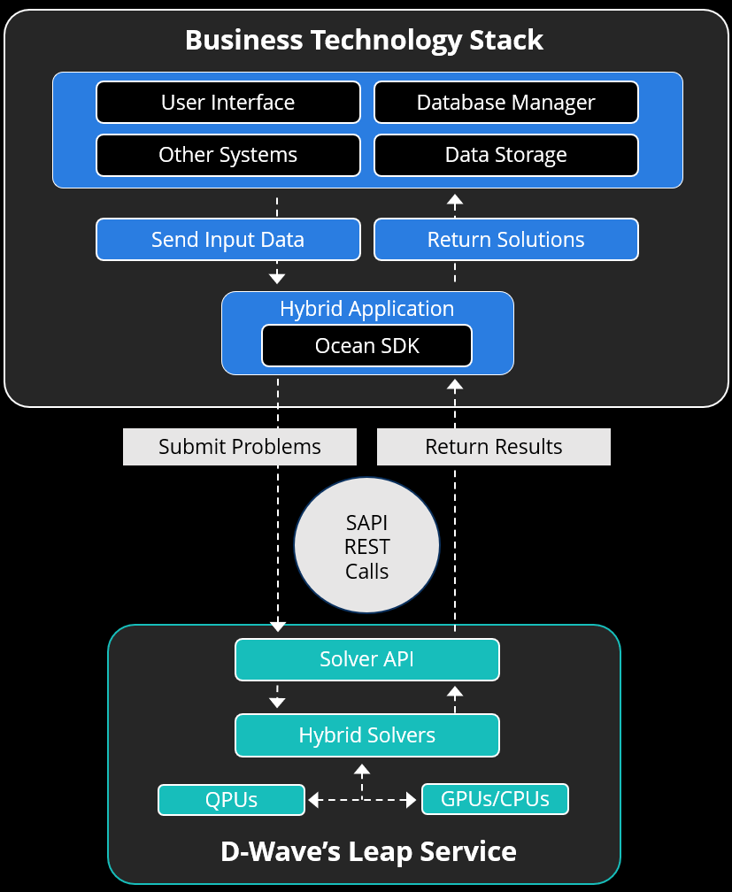

.. _opt_deploying_quantum_apps_prod:

=======================
Deploying in Production
=======================

This section provides guidelines for successfully deploying a hybrid application
in your company's production environment.

Hybrid applications can be easy to integrate with a business's technology stack
because such applications typically run batch-based, asynchronous operations,
submitting problems to and receiving results from hybrid solvers in the Leap
service.

.. _quantum_apps_prod_env:

Typical Production Environment
==============================

A business's technology stack is composed of various business systems such as a
user interface, enterprise-content development systems (e.g., Microsoft
Sharepoint), database management systems, and data lakes. A hybrid application
communicates between the business's technology stack and D-Wave's compute
infrastructure made available via the :ref:`index_ocean_sdk`, solver API
(SAPI), and Leap service. :numref:`Figure %s <HybridAppPipeline>` provides a
high-level illustration of a hybrid application integrated with an example of a
business's technology stack.

        technology stack

    Hybrid application integrated with an example of a business's technology
    stack. A hybrid application receives input data from various systems
    in the business's technology stack and uses D-Wave's Ocean SDK
    to submit problems via SAPI REST calls to the hybrid solvers in D-Wave's
    Leap service. The hybrid solvers return problem results and, again using the
    Ocean SDK, the hybrid application receives such results; the hybrid
    application postprocesses the results and returns solutions to the
    appropriate business systems.

Application Operation
=====================

The following describes the typical operations of a hybrid application in
a production environment, some of which can be complex.

#.  Authenticate and authorize access to the Leap service via a solver API
    token and configuration of the Ocean SDK's :ref:`dwave-cloud-client <index_cloud>`
    package. For information, see :ref:`ocean_sapi_access_advanced`.

#.  Preprocess input data; for example, loading, cleaning, filtering, and
    transforming raw data into inputs to the optimization model.

#.  Generate and submit the problem to a hybrid solver.

#.  (Optional) Upload the problem. Submitting a problem uploads it but sometimes,
    you may want to separate uploading from solving; for example, to solve with
    various time limits.

#.  (Optional) Poll the hybrid solver for completion of submitted problems.
    Although the Ocean SDK automatically polls, you may want to implement
    polling yourself; if so, you must explicitly download each problem's results.

#.  Handle solver errors.

    *   You do not need to retry idempotent requests because, by default, the
        Ocean SDK retries them.

    *   You may retry on timeouts to non-idempotent endpoints. For example, you
        could retry a problem submission, being aware that duplicate problems
        could be submitted.

    *   It is highly recommended that you never automatically retry on
        authentication and authorization errors as well as HTTP 5xx errors.
        Although an exception could be made for retrying on these errors while
        polling, you should ensure that you back off or stop retrying during
        long solver outages, such as scheduled maintenance.
    
#.  Post-process the problem results, which typically includes the following:

    *   Interpreting and converting the problem results into a form suitable for
        the appropriate business system and users.

    *   Sending notifications to business systems and users.

A real-world example of an enterprise-level hybrid application is
Pattison Food Group's
`production application <https://www.dwavequantum.com/resources/application/e-comm-driver-auto-scheduling-pattison-food-group>`_,
which uses D-Wave's hybrid solvers to optimize the weekly assignment
of drivers' work assignments, taking into account various constraints, such as
drivers' seniority and the required number of drivers for each shift.

.. _quantum_apps_performance_scaling:

Performance and Scaling
=======================

A hybrid application should be capable of handling large-scale, long-running
hybrid problems. To do so, ensure that the hardware and its configuration in
your production environment enables your application to perform and scale as
needed by considering the following:

*   Desired throughput (i.e., solved problems per second). Also take into
    account the your Leap project's concurrency limit to provision your
    workloads effectively.

*   Internet connection latency and bandwidth.

*   Size of problems, which can range from about 10 MB to greater than 1 GB.

*   Long and asynchronous jobs; hybrid problems can be configured to run for a
    few seconds or several hours.

*   CPU and memory requirements for hardware and virtual compute: How you model
    your problems can impact these requirements.

You should also maintain your application's code as follows:

*   Keep up to date with Ocean SDK releases to help ensure the best performance
    and take advantage of the newest features.

.. _quantum_apps_security:

Security
========

Consider the following examples of security best practices both generally and
specific to interacting with D-Wave's compute infrastructure during initial
development and maintenance.

*   Ensure that your formulated models do not have identifiable business data or
    references to such data by refraining from using references (e.g., by taking
    advantage of decision :ref:`variable <concept_variables>` labels)
    in your model that could be mapped back to sensitive business data because
    such references would appear in your submitted problems.

*   Grant your application only the minimal required access to sensitive data,
    such as personally identifiable information (PII).

*   Limit access to the application to authorized users.

*   Rotate your solver API token on a regular basis, and change it immediately
    before deploying to production, just in case it was saved outside of your
    codebase during development. In addition, ensure that your solver API token
    is secure as follows:

    *   Store your solver API token in a single secure location.

    *   Do not hardcode your solver API token in your application.

    *   Do not write your solver API token to logs nor save it to your version
        control system.

.. _quantum_apps_monitoring_logging:

Monitoring and Logging
======================

The application should log metrics, including problem IDs, log-event timestamps
and sources (e.g., modules, functions, and line numbers), and timing information
(e.g., request and response timing, data upload, and time-to-solution
for problems).

A problem ID uniquely identifies each problem and can be used to track your
submissions and troubleshoot issues. Logging as much metadata as is reasonably
possible could help make troubleshooting easier.

Consider building a dashboard to show important metrics, such as hybrid solver
usage, to your stakeholders.