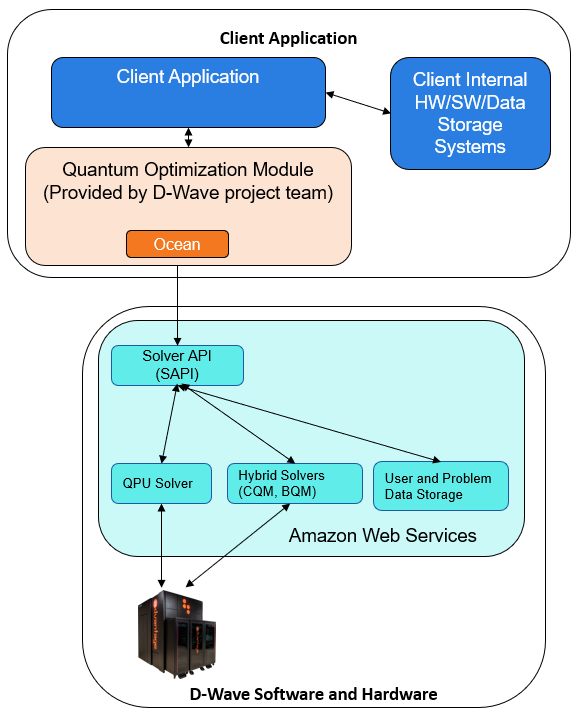

.. _opt_deploying_quantum_applications:

==============================
Deploying Quantum Applications
==============================

This chapter provides some insight into the process used by |dwave_short| and
other companies to deploy successful quantum applications to a production
environment.

After a quantum application is
:ref:`developed <opt_developing_quantum_applications>`, it can be deployed to
a :ref:`typical production environment <prod_env>` via the following
usual steps.

#.  :ref:`Determine the requirements <determine_reqs>` for integrating the
    quantum application into your business operations.

#.  :ref:`Design the application <integrate_apps>` to integrate with your
    business operations in a production-level capacity and deploy it into a test
    production environment to perform testing, which typically includes
    user-acceptance testing.

#.  Deploy the application to the production environment. This process is
    business-specific. 

#.  :ref:`Maintain and enhance <maintain_apps>` the quantum application.

.. _prod_env:

Typical Production Environment
==============================

Although production environments can vary widely between businesses, some common
components and processes can be identified. In fact, quantum applications can be
easy to integrate into business operations because quantum applications are
typically batch-based operations, submitting problems to and receiving solutions
from hybrid solvers via the Leap service.

:ref:`QuantumAppProdArch` illustrates a computing infrastructure that is common
amongst many businesses: deployment mechanisms, conventions for queues,
monitoring, and so forth.

    Quantum-application architecture in production

D-Wave's Ocean SDK is recommended as the development tool to use for submitting
problems to and receiving problem solutions from hybrid solvers. 

.. _determine_reqs:

Determining Requirements
========================

Some requirements to consider are the following:

*   Preprocessing of data used in problem submission. For example, data such as
    words or amounts may need to be extracted from databases or unstructured
    sources, such as internal Web pages or documents, and converted to the
    appropriate data type.

*   Postprocessing of solution data returned from the hybrid solvers.
    For example, solution data is returned as QUBOs and if the final output
    of the solution were to be employee schedules, then the QUBOs would need to
    be converted to a Web page or PDFs showing those schedules.
    
*   Initial desired throughput (i.e., solved problems per second).

*   Analyze latency, size, and bandwidth considerations for hybrid solvers;
    their runtime is configurable, from seconds to hours, depending on solution
    requirements.

*   Your application must be designed around asynchronous processing.

*   Problem size can range from about 10 MB to greater than 1 GB.

Security and Access Control
---------------------------

*   Use a minimum-permission model for access to sensitive data, such as
    personally identifiable information (PII).

*   Ensure that access control to the application for submitting problems is
    limited to authorized users.

*   Keep your Leap API token secure.

    *   Do not hardcode your API token into your application.

    *   Store your API token in a secure location and do not write it logs.

    *   Generate a new API token on a regular basis. 

.. _design_apps:

Designing the Application
=========================

Designing the application for production-level operations requires additional
considerations beyond those in the prototyping and development stages. For such
production-level operations, a microservice may be appropriate. A microservice
can provide the capability to handle large-scale, long-running hybrid-solver
jobs in a heterogeneous, service-oriented architecture. A microservice could
enable the following benefits:

*   Ensure efficient usage by centralizing both preprocessing and postprocessing,
    system notifications, logging, metrics, security, and so forth.

*   Ability to run long jobs. Hybrid problems can be configured to run for as
    little as a few seconds to many hours.

*   Service requests from other internal business systems.

    *   Requests could be stored in a reliable, industrial-grade queue, such as
        Redis, RabbitMQ, Amazon Elasticache, SQS, Kinesis, and so forth.

    *   Horizontally scalable queue workers could perform required preprocessing,
        retrieve additional data from datastores; and transform the hybrid problem
        into the required format and upload it to a hybrid solver in the
        Leap service.

:ref:`QuantumAppProdMicroserviceArch` shows an example of a microservice
architecture.

.. figure:: ../_images/quantum_app_prod_microservice_arch.png
    :name: QuantumAppProdMicroserviceArch
    :alt: Microservice architecture for a quantum-application architecture in
          production

    Microservice architecture for a quantum-application architecture in
    production.

In :ref:`QuantumAppProdMicroserviceArch`, queue workers grab problems off a
queue of incoming problems. Each worker handles the following:

*   Preprocessing, which could include retrieving additional data from databases,
    handling problem formulation, storing the formulated problem.

*   Submitting the job and polling the hybrid solver for completion of the job.

*   Post-processing, which could include unpacking the solution, sending
    solution to other business systems for further processing, sending
    notifications.

Monitoring and Metrics
----------------------

Each step should log metrics, including hybrid problem IDs, timestamps,
source, and timing information. Logging as much metadata as is reasonably
possible could help make troubleshooting easier. Also, consider investing in
structured logging solutions, such as Elasticsearch, Datadog, Splunk, and so
forth.

Although hybrid solvers have a high SLA, you should ensure that your
application can handle situations in which such solvers or the QPU solvers that
back them become unavailable. For example, during scheduled maintenance,
sometimes problems are paused in a queue until solvers are back online.

Finally, consider building a dashboard to show important metrics, such as hybrid
solver usage, to your stakeholders.

.. _maintain_apps:

Maintaining and Enhancing the Application
=========================================

*   For the best performance and new features, keep up to date with Ocean SDK
    releases.