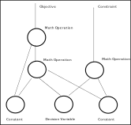

.. _opt_model_construction_nl:

==================
Model Construction
==================

`Nonlinear programming (NLP) <https://en.wikipedia.org/wiki/Nonlinear_programming>`_
is the process of solving an optimization problem where some of the
:term:`constraints <constraint>` are not linear equalities and/or the
:term:`objective function` is not a linear function. Such optimization problems
are pervasive in business and logistics: inventory management, scheduling
employees, equipment delivery, and many more.

.. _opt_model_construction_nl_intro:

Nonlinear Models
================

The :ref:`dwave-optimization <index_optimization>` tool enables you to formulate
the nonlinear models needed for such industrial optimization problems. The model
can then be submitted to the
`Leap <https://cloud.dwavesys.com/leap/>`_ service's quantum-classical
:term:`hybrid` nonlinear solver (also known as the |nlstride_tm|) to find good
solutions. The design principles and major features are described in the
:ref:`dwave-optimization philosophy <optimization_philosophy>` page.

This section explains the nonlinear model and shows how to construct such a
model. The :ref:`opt_leap_hybrid` section shows how to submit these models for
solution. Successful implementation, as for any solver, requires following some
:ref:`best practices <opt_model_construction_nl_guidance>` in formulating your
model.

For other models (e.g., :term:`CQM`), see the :ref:`opt_model_construction_qm`
section.

.. _opt_model_construction_nl_symbols:

Symbols
=======

:ref:`dwave-optimization <index_optimization>` nonlinear models can be mapped to
a
`directed acyclic graph <https://en.wikipedia.org/wiki/Directed_acyclic_graph>`_.
The model's symbols---:term:`decision variables`, intermediate variables,
constants, and mathematical operations---are represented as nodes in the graph
while the flow of operations upon these symbols are represented as the graph's
edges.

        representing symbols connected by directional lines with arrowheads.
    :align: center
    :scale: 100%

    A nonlinear model as a directed acyclic graph.

Consider an illustrative problem of finding the minimum of a function of an
integer variable, the polynomial :math:`y = i^2 - 4i`.

.. figure:: ../_images/simple_polynomial_minimization.png
    :name: simplePolynomialMinimization
    :alt: Plot of :math:`y = i^2 - 4i` with the x-axis from about -2 to +3 and
        the y-axis from -5 to +5, showing a parabola with its minimum at
        (i,y) of (+2,-4).
    :align: center
    :scale: 100%

    Minimum point of a simple polynomial, :math:`y = i^2 - 4i`.

The :ref:`dwave-optimization <index_optimization>` package can formulate the
problem as nonlinear model as follows:

>>> from dwave.optimization import Model
...
>>> model = Model()
>>> i = model.integer(lower_bound=-5, upper_bound=5)
>>> c = model.constant(4)
>>> y = i**2 - c*i
>>> model.minimize(y)

The code above has the following elements:

*   :code:`i` is a :class:`~dwave.optimization.symbols.numbers.IntegerVariable`
    symbol, typically constructed with the
    :meth:`~dwave.optimization.model.Model.integer` method, that represents
    a single integer of values between :math:`-5` and :math:`+5`. It is a
    decision variable: to find the minimum of the polynomial,
    a :term:`solver` must assign values to decision variable :code:`i` such that
    the objective function of this model is minimized.
*   :code:`c` is a :class:`~dwave.optimization.symbols.Constant`
    symbol that represents a single invariable value, :math:`4`, which is the
    linear coefficient multiplying :math:`i` in the polynomial. This type of
    symbol is used as input to mathematical operations but its value is never
    updated by a solver.
*   :code:`y` is an intermediate symbol used for convenience to formulate the
    model in a human-readable way. It is fully determined by other symbols---the
    :code:`i` and :code:`c` symbols---and so implicitly constrained. A solver
    must update :code:`y` if it updates :code:`i`, to a value fully determined
    by the value it selected to assign to :code:`i`.
*   The :class:`~dwave.optimization.symbols.Min` symbol is a mathematical
    operation on inputs from other symbols. In this model, it generates the
    objective function.

The directed acyclic graph below illustratively represents the model for
minimizing polynomial :math:`y = i^2 - 4i`.

.. figure:: ../_images/simple_polynomial_DAG.png
    :name: simplePolynomialDAG
    :alt: Illustrative directed acyclic graph of the model. The bottom two
        circles are the :math:`i` and :math:`c` symbols, which connect into
        :math:`i*i` and :math:`c*i` symbols, which then connect to a
        :math:`y = i*i -c*i` symbol, which connects to a :code:`minimize()`
        symbol that outputs the objective.
    :align: center
    :scale: 100%

    A directed acyclic graph that illustrates one way of representing the model
    for minimizing polynomial :math:`y = i^2 - 4i`.

The :ref:`dwave-optimization <index_optimization>` package's
:meth:`~dwave.optimization.model.Model.to_networkx` method generates the graph
that represents the model. The following code uses
`DAGVIZ <https://wimyedema.github.io/dagviz/>`_ to draw the NetworkX graph
for the :math:`y = i^2 - 4i` polynomial.

>>> import dagviz                      # doctest: +SKIP
...
>>> G = model.to_networkx()
>>> r = dagviz.render_svg(G)           # doctest: +SKIP
>>> with open("model.svg", "w") as f:  # doctest: +SKIP
...     f.write(r)

This creates the following image:

.. figure:: /_images/nl_model_simple_polynomial.svg
    :width: 500 px
    :name: nlModelSimplePolynomial
    :alt: Image of the directed acyclic graph for the simple polynomial model.

    The directed acyclic graph for the model.

The package provides various :ref:`symbols <optimization_symbols>` that enable
you to select those most suited to an efficient formulation of your model.

.. tip::
    Scan the :ref:`symbols <optimization_symbols>` section to see supported
    symbols, and follow the links from a symbol you need to the method used to
    instantiate it.

.. _opt_model_construction_nl_states:

States
======

States represent assignments of values to a symbol. For example, an integer
:term:`decision variable`, represented by an
:class:`~dwave.optimization.symbols.numbers.IntegerVariable` symbol, of size
:math:`2 \times 3`, might have states

.. math::
            \begin{bmatrix} 1 & 1 & 2 \\ 4 & 5 & 5
            \end{bmatrix}
            \text{ and }
            \begin{bmatrix} 1 & 1 & 3 \\ 4 & 5 & 5
            \end{bmatrix}.

Such states, which might be returned from a solver, represent two assignments
that differ in one element of the array (element :math:`(0,2)`), as is typical
at the end of an iterative solution process.

The solutions to nonlinear models you submit to the
`Leap <https://cloud.dwavesys.com/leap/>`_ service's |nlstride_short| are states
of the model's decision variables. For example, the state of symbol
:code:`i` in the model above for the simple polynomial, :math:`y = i^2 - 4i`.

The :ref:`dwave-optimization <index_optimization>` package enables you to set
the states of symbols in a model. You can set states for two purposes:

*   Setting initial states for the solver. For some problems you might have
    estimates or guesses of solutions, and by providing to the solver, as part
    of your problem submission, such assignments of decision variables as an
    initial state of the model, you may accelerate the solution.
*   Testing and developing your models.

Setting States
--------------

A newly created model has a state size of zero. After the |nlstride_short|
returns solutions, the model's state size is the number of states returned for
your problem. The following code, as an example of testing, sets a state size of
five for the :math:`y = i^2 - 4i` polynomial's model (meaning decision variable
:code:`i` has five assigned solution values).

>>> print(model.states.size())
0
>>> model.states.resize(5)
...
>>> for name, sym in {"i": i, "c": c, "y": y}.items():
...     try:
...         print(f"Variable {name} has value {sym.state(0)} for state 0")
...     except:
...         print(f"Cannot access variable {name}")
Variable i has value 0.0 for state 0
Variable c has value 4.0 for state 0
Cannot access variable y

States for the decision variable have been initialized (to zero for the
:class:`~dwave.optimization.symbols.numbers.IntegerVariable` of this example),
states for the constant symbols have an invariable value, but states of
intermediate (successor) symbols, which are implicitly constrained, depend on
the states of predecessor symbols; in this example, the state of :math:`y` is
set based on the states of :math:`i` and :math:`c`. This is calculated only when
the model is locked using the :meth:`~dwave.optimization.model.Model.lock`
method.

>>> with model.lock():
...     print(f"Variable y has value {y.state(0)} for state 0")
Variable y has value 0.0 for state 0

The following code sets values for states 0 to 4 of decision variable :code:`i`
and prints the resulting value of the model's :term:`objective function` for
each state.

>>> with model.lock():
...     for indx in range(model.states.size()):
...         i.set_state(indx, [indx])
...         print(f"For state {indx}, i={i.state(indx)} results in objective {model.objective.state(indx)}")
For state 0, i=0.0 results in objective 0.0
For state 1, i=1.0 results in objective -3.0
For state 2, i=2.0 results in objective -4.0
For state 3, i=3.0 results in objective -3.0
For state 4, i=4.0 results in objective 0.0

Accessing States
----------------

The code above selects a symbol by label ('``i``'); however, you can also
select symbols in a model without using labels. Use the
:meth:`~dwave.optimization.model.Model.iter_decisions` method to iterate over a
model's decision variables, or the
:meth:`~dwave.optimization.model.Model.iter_symbols` and
:meth:`~dwave.optimization.model.Model.iter_constraints` methods for all the
model's symbols and constraints. The :math:`y = i^2 - 4i` polynomial's model has
just one decision variable:

>>> with model.lock():
...     model.states.resize(1)
...     decision_var = next(model.iter_decisions())
...     decision_var.set_state(0, [2])
...     print(model.objective.state(0))
-4.0

This process of iterating through a model to select symbols of various types
(decision variables, constraints, etc) is helpful when constructing the model is
separated from submitting the model to a solver for solutions, for example in
a production application or when using the package's
:ref:`model generators <optimization_generators>`.

You might use a generator for a bin packing problem,
:func:`~dwave.optimization.generators.bin_packing`, for example, to find the
smallest number of bins that can hold a set of weighted items, given that each
bin has a weight capacity:

>>> from dwave.optimization.generators import bin_packing
>>> model = bin_packing([3, 5, 1, 3], 7)

Thees two lines of code instantiate a model for packing four items with various
weights into bins with maximum capacity 7. With a generator, in contrast to a
model you construct before using, you might not have direct access to its
variables to inspect states. You can submit the model to the |nlstride_short|,
as shown in the :ref:`opt_leap_hybrid` section, and the solver sets some number
of states in the model. To see these returned solutions, you select the model's
decision variable with the
:meth:`~dwave.optimization.model.Model.iter_decisions` method.

>>> items = next(model.iter_decisions())

.. _opt_model_construction_nl_constructing:

Constructing Models
===================

Typically, you construct your model by instantiating decision-variable symbols,
using such model methods as
:meth:`~dwave.optimization.model.Model.integer` and
:meth:`~dwave.optimization.model.Model.set`, and constants
(:meth:`~dwave.optimization.model.Model.constant`). You then perform operations
on these symbols, using functions such as matrix multiplication,
:func:`~dwave.optimization.mathematical.matmul`, creating successor symbols. In
this way you formulate objectives and constraints. You can use the
:func:`~dwave.optimization.model.Model.minimize` method to specify the symbol
representing an objective to optimize for.

You can create a model for the
`traveling salesperson <https://en.wikipedia.org/wiki/Travelling_salesman_problem>`_
problem using the :meth:`~dwave.optimization.model.Model.list` method to
instantiate a :class:`~dwave.optimization.symbols.ListVariable` symbol, as the
decision variable, and the :meth:`~dwave.optimization.model.Model.constant`
method to hold a distance matrix as a
:class:`~dwave.optimization.symbols.Constant` symbol. The list decision variable
is used for this problem because any itinerary of cities, each visited once, is
a `permutation <https://en.wikipedia.org/wiki/Permutation>`_ of the cities to be
visited (with each city represented by an integer).\ [#]_

>>> from dwave.optimization import Model
...
>>> model = Model()
>>> ordered_cities = model.list(3)          # decision variable
>>> DM = model.constant([                   # constant distance matrix
...     [0, 3, 1],
...     [1, 0, 3],
...     [3, 1, 0]])

.. [#]
    The :ref:`opt_model_construction_nl_guidance` section discusses how to
    select decision variables.

Such decision-variable symbols and constant symbols form the "root" of the
:term:`directed acyclic graph` underlying the model.

.. figure:: ../_images/nl_model_construct_root.svg
    :name: nlModelConstructRoot
    :alt: Illustrative directed acyclic graph of the model. One circle
        is the :code:`ordered_cities` symbol and the other is the distance
        matrix.
    :align: center

    A directed acyclic graph that shows a single decision variable,
    :code:`ordered_cities`, represented by a
    :class:`~dwave.optimization.symbols.ListVariable` symbol, and a
    constant, ``DM``, represented by a
    :class:`~~dwave.optimization.symbols.Constant` symbol, which holds the
    distance matrix.

Typically, you add symbols to the model through
:ref:`mathematical operations <optimization_math>` between symbols. The
:class:`~dwave.optimization.symbols.BasicIndexing` symbol, for example, is
created by operations similar to those of
:ref:`NumPy's basic indexing <numpy:basic-indexing>`. These symbols are
successors of the root symbols on the directed acyclic graph, and form part of
the mathematical formulation.

>>> from_city = ordered_cities[:-1]
>>> to_city = ordered_cities[1:]
>>> first_city = ordered_cities[0]
>>> last_city = ordered_cities[-1]

.. figure:: ../_images/nl_model_construct_root_basicindex.svg
    :name: nlModelConstructRootBasicIndex
    :alt: Illustrative directed acyclic graph of the model. The bottom circles
        are the :code:`ordered_cities` symbol and distance matrix; the next four
        circles are basic indexing.
    :align: center

    A directed acyclic graph that shows the root symbols at the bottom and the
    :class:`~dwave.optimization.symbols.BasicIndexing` symbols above those.

You can access these symbols by iterating on the model's symbols.

>>> with model.lock():
...     for symbol in model.iter_symbols():
...         print(f"Symbol {type(symbol)} is node {symbol.topological_index()}")
Symbol <class 'dwave.optimization.symbols.collections.ListVariable'> is node 0
Symbol <class 'dwave.optimization.symbols.constants.Constant'> is node 1
Symbol <class 'dwave.optimization.symbols.indexing.BasicIndexing'> is node 2
Symbol <class 'dwave.optimization.symbols.indexing.BasicIndexing'> is node 3
Symbol <class 'dwave.optimization.symbols.indexing.BasicIndexing'> is node 4
Symbol <class 'dwave.optimization.symbols.indexing.BasicIndexing'> is node 5

The :class:`~dwave.optimization.symbols.AdvancedIndexing` symbol is created
by operations similar to those of
:ref:`NumPy's advanced indexing <numpy:advanced-indexing>`. It is used here to
represent the distances between cities for the selected itinerary and the
distance to return from the last city to the first.

>>> itinerary = DM[from_city, to_city]
>>> return_to_origin = DM[last_city, first_city]

.. figure:: ../_images/nl_model_construct_root_advancedindex.svg
    :name: nlModelConstructRootAdvancedIndex
    :alt: Illustrative directed acyclic graph of the model. The bottom circles
        are the :code:`ordered_cities` symbol and distance matrix; the four up
        and to the right are basic indexing; the two up and to the left are
        advanced indexing.
    :align: center

    A directed acyclic graph that shows the root symbols at the bottom and the
    :class:`~dwave.optimization.symbols.BasicIndexing` and
    :class:`~dwave.optimization.symbols.AdvancedIndexing` symbols above those.

Next, sum the distances. Note that the total sum uses the ``+`` operation,
which is equivalent to the :func:`~dwave.optimization.mathematical.add`
function.

>>> distance_itinerary = itinerary.sum()
>>> distance_return = return_to_origin.sum()
>>> distance_total = distance_itinerary + distance_return

.. figure:: ../_images/nl_model_construct_root_sum.svg
    :name: nlModelConstructRootSum
    :alt: Illustrative directed acyclic graph of the model. The bottom circles
        are the :code:`ordered_cities` symbol and distance matrix; the four up
        and to the right are basic indexing; the two up and to the left are
        advanced indexing; the top three are sums.
    :align: center

    A directed acyclic graph that shows the root symbols at the bottom, the
    :class:`~dwave.optimization.symbols.BasicIndexing` and
    :class:`~dwave.optimization.symbols.AdvancedIndexing` symbols above those,
    and the :class:`~dwave.optimization.symbols.Sum` and
    :class:`~dwave.optimization.symbols.Add` symbols.

Finally, you can define the objective, which is to minimize the distance
traveled.

>>> model.minimize(distance_total)

Using the same few lines of code as in the
:ref:`opt_model_construction_nl_symbols` section above, you can draw the graph
of the model.

.. figure:: ../_images/nl_model_construct_tsp.svg
    :name: nlModelConstructTSP
    :alt: Image of the directed acyclic graph for the traveling salesperson
        model.
    :align: center

    The directed acyclic graph for the model.

You can now submit the model to the |nlstride_short| or test it. Here, all
permutations of a :class:`~dwave.optimization.symbols.ListVariable` decision
variable of length three are tested.

>>> import itertools
...
>>> list_values = [0, 1, 2]
>>> with model.lock():
...     model.states.resize(1)
...     for solution in itertools.permutations(list_values):
...         ordered_cities.set_state(0, solution)
...         print(f"Itinerary {solution} has distance {distance_total.state(0)}")
Itinerary (0, 1, 2) has distance 9.0
Itinerary (0, 2, 1) has distance 3.0
Itinerary (1, 0, 2) has distance 3.0
Itinerary (1, 2, 0) has distance 9.0
Itinerary (2, 0, 1) has distance 9.0
Itinerary (2, 1, 0) has distance 3.0

In practice, you would likely code such a model with fewer labeled symbols.

>>> from dwave.optimization import Model
...
>>> model = Model()
>>> ordered_cities = model.list(3)
>>> DM = model.constant([
...     [0, 3, 1],
...     [1, 0, 3],
...     [3, 1, 0]])
>>> itinerary = DM[ordered_cities[:-1], ordered_cities[1:]]
>>> return_to_origin = DM[ordered_cities[-1], ordered_cities[0]]
>>> distance_total = itinerary.sum() + return_to_origin.sum()
>>> model.minimize(distance_total)

You might even use an existing generator, such as the
:func:`~dwave.optimization.generators.traveling_salesperson` generator, in which
case you have no labels at all.

>>> from dwave.optimization.generators import traveling_salesperson
...
>>> DM = [[0, 3, 1], [1, 0, 3], [3, 1, 0]]
>>> model = traveling_salesperson(distance_matrix=DM)

In such cases, you access the model's states using the
:meth:`~dwave.optimization.model.Model.iter_decisions`,
:meth:`~dwave.optimization.model.Model.iter_symbols`, and
:meth:`~dwave.optimization.model.Model.iter_constraints` methods.

>>> with model.lock():
...     model.states.resize(1)
...     itinerary = next(model.iter_decisions())
...     itinerary.set_state(0, [0, 2, 1])
...     print(f"Objective is {model.objective.state(0)}")
Objective is 3.0

Successful implementation, as for any solver, requires following some best
practices in formulating your model: see the
:ref:`opt_model_construction_nl_guidance` for guidance.

.. _opt_model_construction_qm:

Other Models
============

This section provides examples of creating
:term:`quadratic models <quadratic model>` that can then be solved on a
|cloud|_ service :term:`hybrid` :term:`solver` such as the :term:`CQM` solver.
Typically you construct a :term:`model` when reformulating your problem, using
such techniques as those presented in the :ref:`qpu_reformulating` section.

The :ref:`dimod <index_dimod>` package provides a variety of model generators.
These are especially useful for testing code and learning.

CQM Example: Using a dimod Generator
------------------------------------

This example creates a CQM representing a
`knapsack problem <https://en.wikipedia.org/wiki/Knapsack_problem>`_ of ten
items.

>>> cqm = dimod.generators.random_knapsack(10)

CQM Example: Symbolic Formulation
---------------------------------

This example constructs a CQM from symbolic math, which is especially useful for
learning and testing with small CQMs.

>>> x = dimod.Binary('x')
>>> y = dimod.Integer('y')
>>> cqm = dimod.CQM()
>>> objective = cqm.set_objective(x+y)
>>> cqm.add_constraint(y <= 3) #doctest: +ELLIPSIS
'...'

For very large models, you might read the data from a file or construct from a
:std:doc:`NumPy <numpy:index>` array.

BQM Example: Using a dimod Generator
------------------------------------

This example generates a BQM from a fully-connected graph (a clique) where all
linear biases are zero and quadratic values are uniformly selected -1 or +1
values.

>>> bqm = dimod.generators.random.ran_r(1, 7)

BQM Example: Python Formulation
-------------------------------

For learning and testing with small models, construction in Python is
convenient.

The `maximum cut <https://en.wikipedia.org/wiki/Maximum_cut>`_ problem is to
find a subset of a graph's vertices such that the number of edges between it and
the complementary subset is as large as possible.

.. figure:: ../_images/four_node_star_graph.png
    :align: center
    :scale: 40 %
    :name: four_node_star_graph
    :alt: Four-node star graph

    Star graph with four nodes.

The
`dwave-examples Maximum Cut <https://github.com/dwave-examples/maximum-cut>`_
example demonstrates how such problems can be formulated as QUBOs:

.. math::

   Q = \begin{bmatrix} -3 & 2 & 2 & 2\\
                        0 & -1 & 0 & 0\\
                        0 & 0 & -1 & 0\\
                        0 & 0 & 0 & -1
       \end{bmatrix}

>>> qubo = {(0, 0): -3, (1, 1): -1, (0, 1): 2, (2, 2): -1,
...         (0, 2): 2, (3, 3): -1, (0, 3): 2}
>>> bqm = dimod.BQM.from_qubo(qubo)

BQM Example: Construction from NumPy Arrays
-------------------------------------------

For performance, especially with very large BQMs, you might read the data from a
file using methods, such as :func:`~dimod.binary.BinaryQuadraticModel.from_file`
or from :std:doc:`NumPy <numpy:index>` arrays.

This example creates a BQM representing a long ferromagnetic loop with two opposite
non-zero biases.

>>> import numpy as np
>>> linear = np.zeros(1000)
>>> quadratic = (np.arange(0, 1000), np.arange(1, 1001), -np.ones(1000))
>>> bqm = dimod.BinaryQuadraticModel.from_numpy_vectors(linear, quadratic, 0, "SPIN")
>>> bqm.add_quadratic(0, 10, -1)
>>> bqm.set_linear(0, -1)
>>> bqm.set_linear(500, 1)
>>> bqm.num_variables
1001

QM Example: Interaction Between Integer Variables
-------------------------------------------------

This example constructs a QM with an interaction between two integer variables.

>>> qm = dimod.QuadraticModel()
>>> qm.add_variables_from('INTEGER', ['i', 'j'])
>>> qm.add_quadratic('i', 'j', 1.5)

Additional Examples
-------------------

*   The :ref:`qpu_index_examples_beginner` and
    :ref:`opt_index_examples_beginner` sections have examples of using
    :term:`QPU` :term:`solvers <solver>` and |cloud|_ service :term:`hybrid`
    solvers on :term:`quadratic models <quadratic model>`.
*   The `dwave-examples GitHub repository <https://github.com/dwave-examples>`_
    provides more examples.
