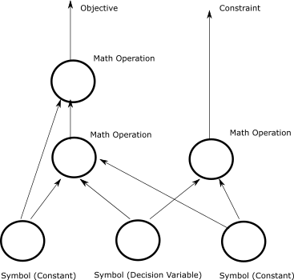
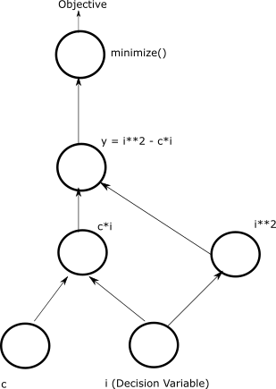
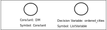
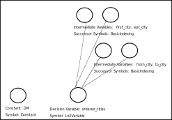
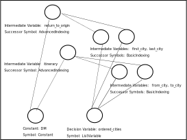
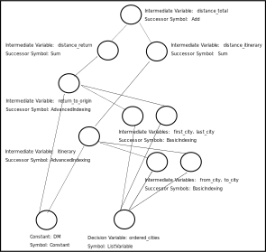
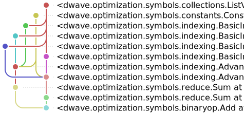
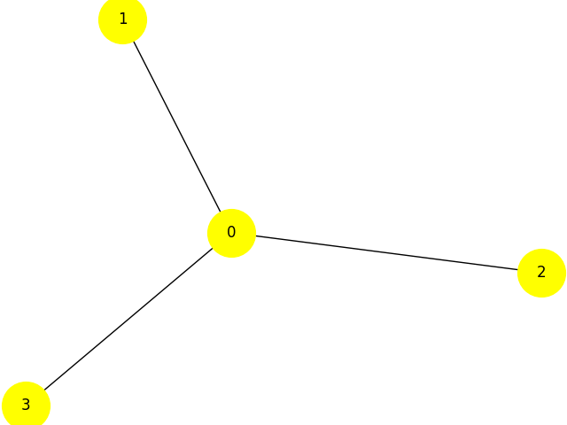

.. _opt_model_construction_nl:

==================
Model Construction
==================

`Nonlinear programming (NLP) <https://en.wikipedia.org/wiki/Nonlinear_programming>`_
is the process of solving an optimization problem where some of the
:term:`constraints <constraint>` are not linear equalities and/or the
:term:`objective function` is not a linear function. Such optimization problems
are pervasive in business and logistics: inventory management, scheduling
employees, equipment delivery, and many more.

For other models (e.g., :term:`CQM`), see the :ref:`opt_model_construction_qm`
section.

.. _opt_model_construction_nl_intro:

Nonlinear Models
================

The :ref:`dwave-optimization <index_optimization>` tool enables you to formulate
the nonlinear models needed for such industrial optimization problems. The model
can then be submitted to the
`Leap <https://cloud.dwavesys.com/leap/>`_ service's quantum-classical
:term:`hybrid` nonlinear solver (also known as the |nlstride_tm|) to find good
solutions. The design principles and major features are described in the
:ref:`dwave-optimization philosophy <optimization_philosophy>` page.

This section explains the nonlinear model and shows how to construct such a
model. The :ref:`opt_leap_hybrid` section shows how to submit these models for
solution. Successful implementation, as for any solver, requires following some
:ref:`best practices <opt_model_construction_nl_guidance>` in formulating your
model.

For other models (e.g., :term:`CQM`), see the :ref:`opt_model_construction_qm`
section.

.. _opt_model_construction_nl_symbols:

Symbols
=======

Nonlinear models can be mapped to a
`directed acyclic graph <https://en.wikipedia.org/wiki/Directed_acyclic_graph>`_.
The model's symbols---:term:`decision variables`, intermediate variables,
constants, and mathematical operations---are represented as nodes in the graph
while the flow of operations upon these symbols are represented as the graph's
edges.

        representing symbols connected by directional lines with arrowheads.
    :align: center
    :scale: 100%

    A nonlinear model as a directed acyclic graph.

Consider an illustrative problem of finding the minimum of a function of an
integer variable, the polynomial :math:`y = i^2 - 4i`.

.. figure:: ../_images/simple_polynomial_minimization.png
    :name: simplePolynomialMinimization
    :alt: Plot of :math:`y = i^2 - 4i` with the x-axis from about -2 to +3 and
        the y-axis from -5 to +5, showing a parabola with its minimum at
        (i,y) of (+2,-4).
    :align: center
    :scale: 100%

    Minimum point of a simple polynomial, :math:`y = i^2 - 4i`.

The :ref:`dwave-optimization <index_optimization>` package can formulate the
problem as nonlinear model as follows:

>>> from dwave.optimization import Model
...
>>> model = Model()
>>> i = model.integer(lower_bound=-5, upper_bound=5)
>>> c = model.constant(4)
>>> y = i**2 - c*i
>>> model.minimize(y)

The code above has the following elements:

*   :code:`i` is a :class:`~dwave.optimization.symbols.numbers.IntegerVariable`
    symbol, typically constructed with the
    :meth:`~dwave.optimization.model.Model.integer` method, that represents
    a single integer of values between :math:`-5` and :math:`+5`. It is a
    decision variable: to find the minimum of the polynomial,
    a :term:`solver` must assign values to decision variable :code:`i` such that
    the objective function of this model is minimized.
*   :code:`c` is a :class:`~dwave.optimization.symbols.Constant`
    symbol that represents a single invariable value, :math:`4`, which is the
    linear coefficient multiplying :math:`i` in the polynomial. This type of
    symbol is used as input to mathematical operations but its value is never
    updated by a solver.
*   :code:`y` is an intermediate symbol used for convenience to formulate the
    model in a human-readable way. It is fully determined by other symbols---the
    :code:`i` and :code:`c` symbols---and so implicitly constrained. A solver
    must update :code:`y` if it updates :code:`i`, to a value fully determined
    by the value it selected to assign to :code:`i`.
*   The :class:`~dwave.optimization.symbols.Min` symbol is a mathematical
    operation on inputs from other symbols. In this model, it generates the
    objective function.

The directed acyclic graph below illustratively represents the model for
minimizing polynomial :math:`y = i^2 - 4i`.

        circles are the :math:`i` and :math:`c` symbols, which connect into
        :math:`i*i` and :math:`c*i` symbols, which then connect to a
        :math:`y = i*i -c*i` symbol, which connects to a :code:`minimize()`
        symbol that outputs the objective.
    :align: center
    :scale: 100%

    An directed acyclic graph that illustrates one way of representing the model
    for minimizing polynomial :math:`y = i^2 - 4i`.

The :ref:`dwave-optimization <index_optimization>` package's
:meth:`~dwave.optimization.model.Model.to_networkx` method generates the graph
that represents the model. The following code uses
`DAGVIZ <https://wimyedema.github.io/dagviz/>`_ to draw the NetworkX graph
for the :math:`y = i^2 - 4i` polynomial.

>>> import dagviz                      # doctest: +SKIP
>>> G = model.to_networkx()
>>> r = dagviz.render_svg(G)           # doctest: +SKIP
>>> with open("model.svg", "w") as f:  # doctest: +SKIP
...     f.write(r)

This creates the following image:

.. figure:: /_images/nl_model_simple_polynomial.svg
    :width: 500 px
    :name: nlModelSimplePolynomial
    :alt: Image of directed acyclic graph for the simple polynomial model.

The package provides various :ref:`symbols <optimization_symbols>` that enable
you to select those most suited to an efficient formulation of your model.

.. tip::
    Scan the :ref:`symbols <optimization_symbols>` section to see supported
    symbols, and follow the links from a symbol you need to the model or
    mathematical method used to instantiate it.

.. _opt_model_construction_nl_states:

States
======

States represent assignments of values to a symbol. For example, an integer
:term:`decision variable`, represented by an
:class:`~dwave.optimization.symbols.numbers.IntegerVariable` symbol, of size
:math:`2 \times 3`, might have states

.. math::
            \begin{bmatrix} 1 & 1 & 2 \\ 4 & 5 & 5
            \end{bmatrix}
            \text{ and }
            \begin{bmatrix} 1 & 1 & 3 \\ 4 & 5 & 5
            \end{bmatrix}.

Such states, which might be returned from a solver, represent two assignments
that differ in one element of the array (element :math:`(0,2)`), as is typical
at the end of an iterative solution process.

The solutions to nonlinear models you submit to the
`Leap <https://cloud.dwavesys.com/leap/>`_ service's |nlstride_short| are states
of the model's decision variables. For example, the state of symbol
:code:`i` in the model above for the simple polynomial, :math:`y = i^2 - 4i`.

The :ref:`dwave-optimization <index_optimization>` package enables you to set
the states of symbols in a model. You can sets states for two purposes:

*   Setting initial states for the solver. For some problems you might have
    estimates or guesses of solutions, and by providing to the solver, as part
    of your problem submission, such assignments of decision variables as an
    initial state of the model, you may accelerate the solution.
*   Testing and developing your models.

A newly created model has a state size of zero. After the |nlstride_short|
returns solutions, the model's state size is the number of states returned for
your problem. The following code sets a state size of five for the :code:`i`
decision variable of the :math:`y = i^2 - 4i` polynomial's model for testing.

>>> print(model.states.size())
0
>>> model.states.resize(5)
...
>>> for name, sym in {"i": i, "c": c, "y": y}.items():
...     try:
...         print(f"Variable {name} has value {sym.state(0)} for state 0")
...     except:
...         print(f"Cannot access variable {name}")
Variable i has value 0.0 for state 0
Variable c has value 4.0 for state 0
Cannot access variable y

States for the decision variable have been initialized (to zero for the
:class:`~dwave.optimization.symbols.numbers.IntegerVariable` of this example),
states for the constant states always have an invariable value, but states of
intermediate symbols, which are implicitly constrained, depend on the states of
predecessor symbols; in this example, the state of :math:`y` is set based on
the states of :math:`i` and :math:`c`. This is calculated only when the model
is locked using the :meth:`~dwave.optimization.model.Model.lock` method.

>>> with model.lock():
...     print(f"Variable y has value {y.state(0)} for state 0")
Variable y has value 0.0 for state 0

The following code sets values for states 0 to 4 of the decision variable
:code:`i` and prints the resulting value of the model's objective function for
each state.

>>> with model.lock():
...     for indx in range(model.states.size()):
...         i.set_state(indx, [indx])
...         print(f"For state {indx}, i={i.state(indx)} results in objective {model.objective.state(indx)}")
For state 0, i=0.0 results in objective 0.0
For state 1, i=1.0 results in objective -3.0
For state 2, i=2.0 results in objective -4.0
For state 3, i=3.0 results in objective -3.0
For state 4, i=4.0 results in objective 0.0

The code above selects a symbol by label ('``i``'); however, you can also
select symbols in a model without using labels. Use the
:meth:`~dwave.optimization.model.Model.iter_decisions` method to iterate over a
model's decision variables, or
:meth:`~dwave.optimization.model.Model.iter_symbols` and
:meth:`~dwave.optimization.model.Model.iter_constraints` methods for all the
model's symbols and constraints. In this case, the model has just one decision
variable:

>>> with model.lock():
...     decision_var = next(model.iter_decisions())
...     decision_var.set_state(0, [2])
...     print(model.objective.state(0))
-4.0

This process of iterating through a model to select symbols of various types
(decision variables, constraints, etc) is helpful when model construction is
separated from model-instance solution, for example in application code or
when using the package's :ref:`model generators <optimization_generators>`.

For example, the generator for a bin packing problem,
:func:`~dwave.optimization.generators.bin_packing`, which seeks to find the
smallest number of bins that will fit a set of weighted items given that each
bin has a weight capacity:

>>> from dwave.optimization.generators import bin_packing
>>> model = bin_packing([3, 5, 1, 3], 7)

The previous two lines of code provide a model for bin packing four items with
various weights into bins with maximum capacity 7. You can submit the model to
the |nlstride_short|, as shown in the :ref:`opt_leap_hybrid` section, and the
solver sets some number of states in the model. To see the returned solutions,
you select the model's decision variable with the
:meth:`~dwave.optimization.model.Model.iter_decisions` method:

>>> items = next(model.iter_decisions())

.. _opt_model_construction_nl_constructing:

Constructing Models
===================

Typically, you construct your model by instantiating decision-variable symbols,
using such model methods as
:meth:`~dwave.optimization.model.Model.integer` and
:meth:`~dwave.optimization.model.Model.set`, and constants
(:meth:`~dwave.optimization.model.Model.constant`). You then perform operations
on these symbols, using functions such as matrix multiplication,
:func:`~dwave.optimization.mathematical.matmul`, creating successor symbols. In
this way you formulate objectives and constraints. You can use the
:func:`~dwave.optimization.model.Model.minimize` method to specify the symbol
representing an objective to minimize.

The example below, a model for the
`traveling salesperson <https://en.wikipedia.org/wiki/Travelling_salesman_problem>`_
problem, uses the :meth:`~dwave.optimization.model.Model.list` method to
instantiate a :class:`~dwave.optimization.symbols.ListVariable` symbol, as the
decision variable, and the :meth:`~dwave.optimization.model.Model.constant`
method to hold a distance matrix as a
:class:`~dwave.optimization.symbols.Constant` symbol. The list decision variable
is used for this problem because any itinerary of cities, each visited once, is
a `permutation <https://en.wikipedia.org/wiki/Permutation>`_ of the cities to be
visited (with each city represented by an integer).

>>> from dwave.optimization import Model
...
>>> model = Model()
>>> ordered_cities = model.list(3)          # decision variable
>>> DM = model.constant([                   # constant distance matrix
...     [0, 3, 1],
...     [1, 0, 3],
...     [3, 1, 0]])

Such decision-variable and constant symbols form the "root" of the
:term:`directed acyclic graph` underlying the model.

        is the :code:`ordered_cities` symbol and the other is the distance
        matrix.
    :align: center

    A directed acyclic graph that shows a single decision variable,
    :code:`ordered_cities`, represented by a
    :class:`~dwave.optimization.symbols.ListVariable` symbol, and a
    constant, ``DM``, represented by a
    :class:`~~dwave.optimization.symbols.Constant` symbol, which holds the
    distance matrix.

Typically, you add symbols to the model through
:ref:`mathematical operations <optimization_math>` between symbols. The
:class:`~dwave.optimization.symbols.BasicIndexing` symbol, for example, is
created by operations similar to those of
:ref:`NumPy's basic indexing <numpy:basic-indexing>`. These symbols are
successors of the root symbols on the directed acyclic graph, and form part of
the mathematical formulation.

>>> from_city = ordered_cities[:-1]
>>> to_city = ordered_cities[1:]
>>> first_city = ordered_cities[0]
>>> last_city = ordered_cities[-1]

        are the :code:`ordered_cities` symbol and distance matrix; the next four
        circles are basic indexing.
    :align: center

    A directed acyclic graph that shows the root symbols at the bottom and the
    :class:`~dwave.optimization.symbols.BasicIndexing` symbols above those.

You can access these symbols by iterating on the model's symbols.

>>> with model.lock():
...     for symbol in model.iter_symbols():
...         print(f"Symbol {type(symbol)} is node {symbol.topological_index()}")
Symbol <class 'dwave.optimization.symbols.collections.ListVariable'> is node 0
Symbol <class 'dwave.optimization.symbols.constants.Constant'> is node 1
Symbol <class 'dwave.optimization.symbols.indexing.BasicIndexing'> is node 2
Symbol <class 'dwave.optimization.symbols.indexing.BasicIndexing'> is node 3
Symbol <class 'dwave.optimization.symbols.indexing.BasicIndexing'> is node 4
Symbol <class 'dwave.optimization.symbols.indexing.BasicIndexing'> is node 5

The :class:`~dwave.optimization.symbols.AdvancedIndexing` symbol is created
by operations similar to those of
:ref:`NumPy's advanced indexing <numpy:advanced-indexing>`. It is used here to
represent the distances between cities for the selected itinerary and the
distance to return from the last city to the first.

>>> itinerary = DM[from_city, to_city]
>>> return_to_origin = DM[last_city, first_city]

        are the :code:`ordered_cities` symbol and distance matrix; the four up
        and to the right are basic indexing; the two up and to the left are
        advanced indexing.
    :align: center

    A directed acyclic graph that shows the root symbols at the bottom and the
    :class:`~dwave.optimization.symbols.BasicIndexing` and
    :class:`~dwave.optimization.symbols.AdvancedIndexing` symbols above those.

Next, sum the distances. Note that the total sum uses the ``+`` operation,
which is equivalent to the :func:`~dwave.optimization.mathematical.add`
function.

>>> distance_itinerary = itinerary.sum()
>>> distance_return = return_to_origin.sum()
>>> distance_total = distance_itinerary + distance_return

        are the :code:`ordered_cities` symbol and distance matrix; the four up
        and to the right are basic indexing; the two up and to the left are
        advanced indexing; the top three are sums.
    :align: center

    A directed acyclic graph that shows the root symbols at the bottom, the
    :class:`~dwave.optimization.symbols.BasicIndexing` and
    :class:`~dwave.optimization.symbols.AdvancedIndexing` symbols above those,
    and the :class:`~dwave.optimization.symbols.Sum` and
    :class:`~dwave.optimization.symbols.Add` symbols.

Finally, you can define the objective, which is to minimize the distance
traveled.

>>> model.minimize(distance_total)

Again, as in the :ref:`opt_model_construction_nl_symbols` section above, you can
use `DAGVIZ <https://wimyedema.github.io/dagviz/>`_ to draw the NetworkX graph
of the model in just a few lines of code.

        are the :code:`ordered_cities` symbol and distance matrix; the four up
        and to the right are basic indexing; the two up and to the left are
        advanced indexing; the top three are sums.
    :align: center

    A directed acyclic graph that shows the root symbols at the bottom, the
    :class:`~dwave.optimization.symbols.BasicIndexing` and
    :class:`~dwave.optimization.symbols.AdvancedIndexing` symbols above those,
    and the :class:`~dwave.optimization.symbols.Sum` and
    :class:`~dwave.optimization.symbols.Add` symbols.

>>> with model.lock():
...     for symbol in model.iter_symbols():
...         symbols[symbol.topological_index()] = symbol
...     last_symbol = max(symbols.keys())
...     model.states.resize(1)
...     one_one[15] = 1
...     symbols[0].set_state(0, one_one)
...     print(symbols[last_symbol].state(0) == True)
...     one_one[25] = 1
...     symbols[0].set_state(0, one_one)
...     print(symbols[last_symbol].state(0) == False)
True
True

.. _opt_model_construction_nl_guidance:

Constructing Good Models
========================

As much as possible, design models along these lines:

1.  Use compact matrix operations in your formulations.

    The `dwave-optimization` package enables you to formulate models using
    linear-algebra conventions similar to `NumPy <https://numpy.org/>`_. Compact
    matrix formulation are usually more efficient and should be preferred.

2.  Exploit the implicit constraints of symbols such as
    :class:`~dwave.optimization.symbols.ListVariable`,
    :class:`~dwave.optimization.symbols.SetVariable`,
    :class:`~dwave.optimization.symbols.DisjointLists`,
    and :class:`~dwave.optimization.symbols.DisjointBitSets`.

    Typically, solver performance strongly depends on the size of the solution
    space for your modelled problem: models with smaller spaces of feasible
    solutions tend to perform better than ones with larger spaces. A powerful
    way to reduce the feasible-solutions space is by using variables that act
    as implicit constraints. This is analogous to judicious typing of a variable
    to meet but not exceed its required assignments: a Boolean variable, ``x``,
    has a solution space of size 2 (:math:`\{True, False\}`) while a
    finite-precision integer variable, ``i``, might have a solution space of
    several billion values.

See the formulations used by the package's
:ref:`model generators <optimization_generators>` and relevant
`GitHub examples <https://github.com/dwave-examples>`_ for reference.

Example: Compact Matrix Formulation
-----------------------------------

Like a large class of real-world problems, optimally loading a truck to convey
the most valuable merchandise while not exceeding limitations on carrying weight
or allowable volume, can be considered a variation on the well-known
`knapsack optimization problem <https://en.wikipedia.org/wiki/Knapsack_problem>`_.
The problem is to maximize the total value of items packed in a knapsack without
exceeding its capacity.

Such real-world problems, when formulated mathematically for automated solution,
typically include a data-transformation step that provides the weights and
values of the problem's items in some structure. Here, an illustrative problem
of just four items is modeled, with weights and values :math:`30, 10, 40, 20`
and :math:`10, 20, 30, 40`, respectively, and a maximum capacity of :math:`30`
for the truck.

For a practical formulation of the knapsack problem, see the code in the
:class:`~dwave.optimization.generators.knapsack` generator.

This example compares two formulations of a small truck-loading problem: an
intuitive model that represents multiple binary decisions with multiple binary
symbols etc. versus a more compact model. The figure below compares the directed
acyclic graphs for these two formulations.

.. figure:: ../_images/knapsack_simple_matrix.png
    :name: knapsackSimpleMatrix
    :alt: Illustrative directed acyclic graph of two models. The left graph has
        ten nodes while the right one has thirty nodes.
    :align: center
    :scale: 80%

    Comparison between models using compact matrix operations (left) and
    less-compact operations (right) in formulation. The less-compact formulation
    has triple the number of symbols. Graphs are created using the package's
    :meth:`~dwave.optimization.model.Model.to_networkx` method.

The two tabs below provide the two formulations.

.. tab-set::

    .. tab-item:: Compact Formulation

        The model in this tab is formulated using compact matrix operations.

        Instantiate a nonlinear model and add the constant symbols.

        >>> model = Model()
        >>> weight = model.constant([30, 10, 40, 20])
        >>> value = model.constant([15, 25, 35, 45])
        >>> capacity = model.constant(30)

        Add a binary-array variable for the items: which items should be
        selected for loading into the truck.

        >>> items = model.binary(4)

        Add a constraint that the total weight must not exceed the truck's
        capacity.

        >>> total_weight = items * weight
        >>> model.add_constraint(total_weight.sum() <= capacity) # doctest: +ELLIPSIS
        <dwave.optimization.symbols.binaryop.LessEqual at ...>

        Add the objective (transport as much valuable merchandise as possible):

        >>> total_value = items * value
        >>> model.minimize(-total_value.sum())

        The size of this model is a third of the alternative formulation
        shown in the second tab:

        >>> model.num_nodes()
        10

    .. tab-item:: Non-compact Formulation

        The model in this tab is formulated using one binary decision variable
        per item. Each variable and constant adds a node to the directed
        acyclic graph.

        Instantiate a nonlinear model and add the constant symbols. The weight
        and value of each item is represented by a symbol.

        >>> model = Model()
        >>> weight0 = model.constant(30)
        >>> weight1 = model.constant(10)
        >>> weight2 = model.constant(40)
        >>> weight3 = model.constant(20)
        >>> val0 = model.constant(15)
        >>> val1 = model.constant(25)
        >>> val2 = model.constant(35)
        >>> val3 = model.constant(45)
        >>> capacity = model.constant(30)

        Add a binary variable for each item: should that item be loaded into the
        truck (yes or no?).

        >>> item0 = model.binary()
        >>> item1 = model.binary()
        >>> item2 = model.binary()
        >>> item3 = model.binary()

        Add the constraint on the total weight:

        >>> total_weight = item0*weight0 + item1*weight1 + item2*weight2 + item3*weight3
        >>> model.add_constraint(total_weight <= capacity) # doctest: +ELLIPSIS
        <dwave.optimization.symbols.binaryop.LessEqual at ...>

        Add the objective to maximize the transported value:

        >>> total_value = item0*val0 + item1*val1 + item2*val2 + item3*val3
        >>> model.minimize(-total_value)

        The size of this model is triple the alternative formulation
        shown in the first tab:

        >>> model.num_nodes()
        28

Compare the two formulations. Prefer compact-matrix formulations for your
models. 

Example: Implicitly Constrained Symbols
---------------------------------------

Consider a problem of selecting a route for several destinations with the cost
increasing on each leg of the itinerary; for the example formulated below, one
can travel through four destinations in any order, one destination per day, with
the transportation cost per unit of travel doubling every subsequent day.

The figure below shows four destinations as dots labeled ``0`` to
``3``, and plots the least costly (green) and most costly (red) routes.

.. figure:: ../_images/best_worst_routes.png
    :name: bestWorstRoutes
    :alt: Plot of two routes between four points, the green one, (3, 2, 1, 0) is
          the least costly while the red one, (2, 1, 3, 0), is the most costly.
    :align: center
    :scale: 80%

    Finding the optimal route between destinations.

The code snippet below defines the cost per leg and the distances between the
four destinations, with values chosen for simple illustration.

>>> import numpy as np
...
>>> cost_per_day = [1, 2, 4]
>>> distance_matrix = np.asarray([
...     [0, 1, np.sqrt(10), np.sqrt(34)],
...     [1, 0, 3, np.sqrt(25)],
...     [np.sqrt(10), 3, 0, 4],
...     [np.sqrt(34), np.sqrt(25), 4, 0]])

This section compares two formulations of this small routing problem: an
intuitive model that uses the generic
:class:`~dwave.optimization.symbols.BinaryVariable` symbol to represent decisions
on ordering the destinations versus a model that uses the implicitly constrained
:class:`~dwave.optimization.symbols.ListVariable` symbol, where the order of
destinations is a permutation of values. The figure below compares the directed
acyclic graphs for these two formulations.

.. figure:: ../_images/route_models.png
    :name: RouteModels
    :alt: Illustrative directed acyclic graph of two models. The left graph has
        far fewer nodes than that one the right.
    :align: center
    :scale: 100%

    Comparison between models using implicitly-constrained decision symbol
    (left) and explicit constrains on a simple binary symbol (right) in
    formulation. The first formulation has fewer symbols.

It is expected that the more compact model that uses implicit constraints will
perform better. 

The two tabs below provide the two formulations.

.. tab-set::

    .. tab-item:: Implicit Constraints

        The model in this tab is formulated using the implicitly
        constrained :class:`~dwave.optimization.symbols.List` symbol.

        >>> model = Model()
        >>> # Add the constants
        >>> cost = model.constant(cost_per_day)
        >>> distances = model.constant(distance_matrix)
        >>> # Add the decision symbol
        >>> route = model.list(4)
        >>> # Optimize the objective
        >>> model.minimize((cost * distances[route[:-1],route[1:]]).sum())

        You can see the objective values for the least and most costly routes
        as permutations of the :math:`[0, 1, 2, 3]` list as follows:

        >>> with model.lock():
        ...     model.states.resize(2)
        ...     route.set_state(0, [3, 2, 1, 0])
        ...     route.set_state(1, [2, 1, 3, 0])
        ...     print(int(model.objective.state(0)), int(model.objective.state(1)))
        14 36

    .. tab-item:: Explicit Constraints

        The model in this tab is formulated using explicit constraints on the
        generic :class:`~dwave.optimization.symbols.BinaryVariable` symbol.

        >>> from dwave.optimization.mathematical import add
        ...
        >>> model = Model()
        >>> # Add the problem constants
        >>> cost = model.constant(cost_per_day)
        >>> distances = model.constant(distance_matrix)

        Define constants that are used to formulate the explicit constraints.

        >>> one = model.constant(1)
        >>> indx_int = model.constant([0, 1, 2, 3])

        Add the decision symbol: for each of the itinerary's four legs, each
        of the four destinations is represented by a binary variable. If leg
        1 should be to destination 2, for example, the value of row 1 is
        :math:`False, False, True, False`. This is a representation known as
        `one-hot encoding <https://en.wikipedia.org/wiki/One-hot>`_.

        >>> itinerary_loc = model.binary((4, 4))

        Add the objective. Here, the :code:`indx_int` constant converts the
        binary one-hot variables to an index of the distance matrix.

        >>> model.minimize(add(*(
        ...     (itinerary_loc[u, pos] * itinerary_loc[v, (pos + 1) % 4] * distances[u, v] +
        ...     itinerary_loc[v, pos] * itinerary_loc[u, (pos + 1) % 4] * distances[v, u]) *
        ...     cost[pos]
        ...     for u in range(4)
        ...     for v in range(u+1, 4)
        ...     for pos in range(3)
        ... )))

        Add explicit one-hot constraints: summing the columns of the decision
        variable must give ones because each destination is visited once;
        summing rows must give ones because each leg visits one destination.

        >>> for i in range(distances.shape()[0]):
        ...     model.add_constraint(itinerary_loc[i, :].sum() <= one)
        ...     model.add_constraint(one <= itinerary_loc[i,:].sum())
        ...     model.add_constraint(itinerary_loc[:, i].sum() <= one)
        ...     model.add_constraint(one <= itinerary_loc[:, i].sum()) # doctest: +ELLIPSIS
        <dwave.optimization.symbols.binaryop.LessEqual at ...>
        ...

        You can see the objective cost for the least costly route
        as follows:

        >>> with model.lock():
        ...     model.states.resize(2)
        ...     itinerary_loc.set_state(0, [
        ...         [0, 0, 0, 1],
        ...         [0, 0, 1, 0],
        ...         [0, 1, 0, 0],
        ...         [1, 0, 0, 0]])
        ...     print(int(model.objective.state(0)))
        14

The directed acyclic graph for the implicitly constrained model has few nodes
and the model is more efficient.

.. _opt_model_construction_qm:

Other Models
============

This section provides examples of creating
:term:`quadratic models <quadratic model>` that can then be solved on a
|cloud|_ service :term:`hybrid` :term:`solver` such as the :term:`CQM` solver.
Typically you construct a :term:`model` when reformulating your problem, using
such techniques as those presented in the :ref:`qpu_reformulating` section.

The :ref:`dimod <index_dimod>` package provides a variety of model generators.
These are especially useful for testing code and learning.

CQM Example: Using a dimod Generator
------------------------------------

This example creates a CQM representing a
`knapsack problem <https://en.wikipedia.org/wiki/Knapsack_problem>`_ of ten
items.

>>> cqm = dimod.generators.random_knapsack(10)

CQM Example: Symbolic Formulation
---------------------------------

This example constructs a CQM from symbolic math, which is especially useful for
learning and testing with small CQMs.

>>> x = dimod.Binary('x')
>>> y = dimod.Integer('y')
>>> cqm = dimod.CQM()
>>> objective = cqm.set_objective(x+y)
>>> cqm.add_constraint(y <= 3) #doctest: +ELLIPSIS
'...'

For very large models, you might read the data from a file or construct from a
:std:doc:`NumPy <numpy:index>` array.

BQM Example: Using a dimod Generator
------------------------------------

This example generates a BQM from a fully-connected graph (a clique) where all
linear biases are zero and quadratic values are uniformly selected -1 or +1
values.

>>> bqm = dimod.generators.random.ran_r(1, 7)

BQM Example: Python Formulation
-------------------------------

For learning and testing with small models, construction in Python is
convenient.

The `maximum cut <https://en.wikipedia.org/wiki/Maximum_cut>`_ problem is to
find a subset of a graph's vertices such that the number of edges between it and
the complementary subset is as large as possible.

    Star graph with four nodes.

The
`dwave-examples Maximum Cut <https://github.com/dwave-examples/maximum-cut>`_
example demonstrates how such problems can be formulated as QUBOs:

.. math::

   Q = \begin{bmatrix} -3 & 2 & 2 & 2\\
                        0 & -1 & 0 & 0\\
                        0 & 0 & -1 & 0\\
                        0 & 0 & 0 & -1
       \end{bmatrix}

>>> qubo = {(0, 0): -3, (1, 1): -1, (0, 1): 2, (2, 2): -1,
...         (0, 2): 2, (3, 3): -1, (0, 3): 2}
>>> bqm = dimod.BQM.from_qubo(qubo)

BQM Example: Construction from NumPy Arrays
-------------------------------------------

For performance, especially with very large BQMs, you might read the data from a
file using methods, such as :func:`~dimod.binary.BinaryQuadraticModel.from_file`
or from :std:doc:`NumPy <numpy:index>` arrays.

This example creates a BQM representing a long ferromagnetic loop with two opposite
non-zero biases.

>>> import numpy as np
>>> linear = np.zeros(1000)
>>> quadratic = (np.arange(0, 1000), np.arange(1, 1001), -np.ones(1000))
>>> bqm = dimod.BinaryQuadraticModel.from_numpy_vectors(linear, quadratic, 0, "SPIN")
>>> bqm.add_quadratic(0, 10, -1)
>>> bqm.set_linear(0, -1)
>>> bqm.set_linear(500, 1)
>>> bqm.num_variables
1001

QM Example: Interaction Between Integer Variables
-------------------------------------------------

This example constructs a QM with an interaction between two integer variables.

>>> qm = dimod.QuadraticModel()
>>> qm.add_variables_from('INTEGER', ['i', 'j'])
>>> qm.add_quadratic('i', 'j', 1.5)

Additional Examples
-------------------

*   The :ref:`qpu_index_examples_beginner` and
    :ref:`opt_index_examples_beginner` sections have examples of using
    :term:`QPU` :term:`solvers <solver>` and |cloud|_ service :term:`hybrid`
    solvers on :term:`quadratic models <quadratic model>`.
*   The `dwave-examples GitHub repository <https://github.com/dwave-examples>`_
    provides more examples.