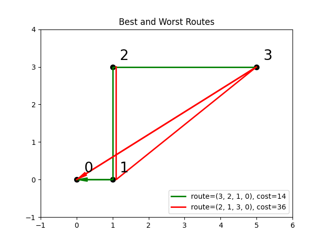
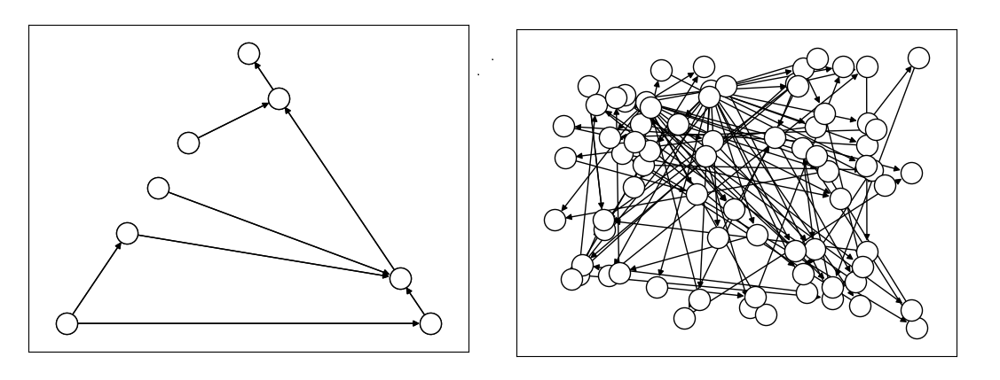
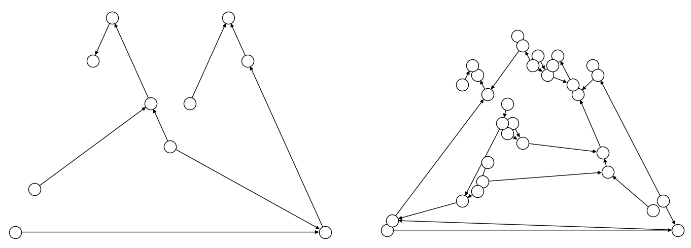

.. _opt_model_construction_nl_guidance:

====================
Building Good Models
====================

The :ref:`opt_model_construction_nl` section explains the basics of using the
:ref:`dwave-optimization <index_optimization>` package to create nonlinear
models for the |nlstride_tm|. This section provides guidance for improving your
models for performance.

As much as possible, design models along these lines:

1.  Exploit the implicit constraints of symbols such as
    :class:`~dwave.optimization.symbols.ListVariable`,
    :class:`~dwave.optimization.symbols.SetVariable`,
    :class:`~dwave.optimization.symbols.DisjointLists`, etc.

    Typically, solver performance strongly depends on the size of the solution
    space for your modeled problem: models with smaller spaces of feasible
    solutions tend to perform better than ones with larger spaces. A powerful
    way to reduce the feasible-solutions space is by using variables that act
    as implicit constraints. This is analogous to judicious typing of a variable
    to meet but not exceed its required assignments: a Boolean variable, ``x``,
    has a solution space of size 2 (:math:`\{True, False\}`) while a
    finite-precision integer variable, ``i``, might have a solution space of
    several billion values.

2.  Use compact matrix operations in your formulations.

    The `dwave-optimization` package enables you to formulate models using
    linear-algebra conventions similar to `NumPy <https://numpy.org/>`_. Compact
    matrix formulation are usually more efficient and should be preferred.

See the formulations used by the package's
:ref:`model generators <optimization_generators>` and relevant
`GitHub examples <https://github.com/dwave-examples>`_ for reference.

Implicitly Constrained Decision Variables
=========================================

When formulating optimization problems, your choice of
:term:`decision variables` significantly affects the model's clarity, size of
the solution space, and, ultimately, the solver's performance.

Ocean software's :class:`~dwave.optimization.model.Model` class provides several
types of decision variables that encode "implicit constraints." These
:ref:`symbols <opt_model_construction_nl_symbols>` inherently represent
common combinatorial structures such as permutations, subsets, or partitions,
guiding the solver to explore only valid configurations.

Using implicitly constrained decision variables offers several advantages:

*   **Simplified Model Formulation:** Complex constraints (e.g., ensuring
    all elements are unique and used in a sequence) are handled implicitly
    by the variable type itself, leading to more concise and readable
    models.

*   **Reduced Solution Space:** The solver's search space is drastically
    reduced because it only considers arrangements that satisfy the
    inherent nature of the symbol (e.g., permutations instead of all
    possible lists).

*   **Potential for Improved Performance:** A smaller, more structured search
    space can lead to faster solution times and better quality solutions.

The table below compares characteristics and typical applications of such
decision variables.

.. list-table:: Implicitly Constrained Decision Variables
    :widths: 15 20 20 22 22
    :header-rows: 1

    *   - **Decision Variable**
        - :meth:`~dwave.optimization.model.Model.list`
        - :meth:`~dwave.optimization.model.Model.set`
        - :meth:`~dwave.optimization.model.Model.disjoint_lists_symbol`
        - :meth:`~dwave.optimization.model.Model.disjoint_bit_sets`
    *   - **Description**
        - Ordered permutation of ``range(N)``
        - Unordered subset of ``range(N)``
        - Disjoint ordered partitions of ``range(N)``
        - Disjoint unordered partitions of ``range(N)``
    *   - **Ordered?**
        - Yes
        - No
        - Yes (within each list)
        - No (within each set)
    *   - **Item Uniqueness**
        - All ``N`` items appear exactly once in the list
        - Unique subset from domain
        - Each item appears in at most one list; lists are permutations
        - Each item appears in at most one set; sets contain unique items
    *   - **Number of Collections**
        - 1 list
        - 1 set
        - Configurable
        - Configurable

Permutation: ``ListVariable`` Symbol
------------------------------------

The :meth:`~dwave.optimization.model.Model.list` method creates a decision
variable representing an ordered arrangement (a permutation) of :math:`N`
distinct items. These items are implicitly integers.

Implicit constraints:

*   All :math:`N` items (integers :math:`0` to :math:`N-1`) are present exactly
    once.
*   Order matters.
*   Elements are unique.

The list variable is ideal for problems where the core decision is finding the
optimal order or sequence of a set of items. It replaces :math:`N` integer
variables and "all-different" constraints along with range constraints. The
solver explores :math:`N!` possible permutations rather than :math:`N^N`
combinations possible with :math:`N` unrestricted integer variables. If your
problem's items are not integers :math:`0` to :math:`N-1` (e.g., city names),
map them to integer indices before defining the model and map back when
interpreting solutions. Note that the solver might return indices as floats,
requiring casting to ``int``.

Common use cases:

*   `Traveling salesperson <https://en.wikipedia.org/wiki/Travelling_salesman_problem>`_:
    Finding the shortest tour.
*   `Quadratic assignment <https://en.wikipedia.org/wiki/Quadratic_assignment_problem>`_:
    Assigning :math:`N` facilities to :math:`N` locations where the interaction
    cost depends on flow and distance, and the assignment is a permutation.
*   `Flow-shop scheduling <https://en.wikipedia.org/wiki/Flow-shop_scheduling>`_:
    Determining the sequence of jobs on a series of machines to minimize
    makespan.

*   Single-machine scheduling: Ordering tasks on a single resource.

Subset: ``SetVariable`` Symbol
------------------------------

The :meth:`~dwave.optimization.model.Model.set` method creates a decision
variable representing an unordered collection (a subset) of unique items chosen
from a universe of :math:`N` items (implicitly integers).

Implicit constraints:

*   Elements selected are unique.
*   Order of elements within the set does not matter.
*   Items are chosen from the universe :math:`[0, \ldots, N-1]`.

The set variable is used when the decision is selecting a group of items, and
the order of selection is irrelevant. The symbol inherently handles the
uniqueness of selected items. Constraints on the size (cardinality) of the set
or other properties based on the selected items are typically added explicitly.
As with the :meth:`~dwave.optimization.model.Model.list` method, if the
problem's items are not :math:`0` to :math:`N-1`, you map them. Note that the
solver might return indices as floats, requiring casting to ``int``.

Common use cases:

*   `knapsack problem <https://en.wikipedia.org/wiki/Knapsack_problem>`_:
    Selecting items to maximize value/utility within a budget/capacity.
*   Set-covering, packing, and partitioning problems: Selecting subsets
    to satisfy coverage or disjointness requirements.
*   Feature selection: Choosing a subset of features in machine learning.
*   Committee selection: Forming a team or committee with specific
    properties from a larger pool.

Disjoint Ordered Lists: ``DisjointLists`` Symbol
------------------------------------------------

The :meth:`~dwave.optimization.model.Model.disjoint_lists` method creates a
complex decision variable. It partitions items from a primary set (integers
from :math:`0` and up) into a specified number of lists. Each of these lists is
an ordered sequence (permutation) of a subset of the primary set, and no item
from the primary set can appear in more than one list.

Implicit constraints:

*   Each item from the primary set (indices :math:`0` to the configured size
    minus 1) appears in at most one list.
*   Order matters within each list.
*   Lists are disjoint regarding item membership.

This variable is exceptionally powerful for problems such as vehicle routing,
where a set of customers needs to be divided among several vehicles, and each
vehicle follows a specific ordered route. The returned object allows you to
access and constrain each list individually. Note that the solver might return
indices as floats, requiring casting to ``int``.

Common use cases:

*   Vehicle routing problems (
    `CVRP <https://en.wikipedia.org/wiki/Vehicle_routing_problem>`_,
    `CVRPTW <https://en.wikipedia.org/wiki/Vehicle_routing_problem>`_:
    Assigning customers to vehicles and determining the optimal sequence of
    visits for each vehicle.
*   Multi-agent task assignment and scheduling: Allocating tasks to different
    agents/robots where each agent performs a sequence of assigned tasks.
*   Parallel machine scheduling: Assigning jobs to different machines and
    sequencing them on each machine.

Disjoint Unordered Sets: ``DisjointBitSets`` Symbol
---------------------------------------------------

The :meth:`~dwave.optimization.model.Model.disjoint_bit_sets` method is used to
partition a universe of a specified number of items into a specified number of
mutually exclusive, unordered sets.

Implicit constraints:

*   Each item from the universe (indices :math:`0` up to the configured size
    minus 1) appears in at most one set.
*   Order does not matter within each set.
*   Sets are disjoint.

This variable is suited for problems where items need to be grouped into distinct
categories or containers, and the order of items within a category does not
matter. The returned object allows individual manipulation and constraint of
each set. Note that the solver might return indices as floats, requiring casting
to ``int``.

Common use cases:

*   `Bin packing <https://en.wikipedia.org/wiki/Bin_packing_problem>`_:
    Assigning items to a minimum number of bins.
*   Set-partitioning and clustering: Dividing items into disjoint, unordered
    groups.
*   Resource allocation: Grouping resources into pools where order within a pool
    doesn't matter.
*   Graph coloring (vertex coloring variant): Assigning vertices (items) to
    color classes (sets) such that no two adjacent vertices share the same
    color.

Example: Implicitly Constrained Variables
-----------------------------------------

Consider a problem of selecting a route for several destinations with the cost
increasing on each leg of the itinerary; for the example formulated below, one
can travel through four destinations in any order, one destination per day, with
the transportation cost per unit of travel doubling every subsequent day.

The figure below shows four destinations as dots labeled ``0`` to
``3``, and plots the least costly (green) and most costly (red) routes.

          the least costly while the red one, (2, 1, 3, 0), is the most costly.
    :align: center
    :scale: 80%

    Finding the optimal route between destinations.

The code snippet below defines the cost per leg and the distances between the
four destinations, with values chosen for simple illustration.

>>> import numpy as np
...
>>> cost_per_day = [1, 2, 4]
>>> distance_matrix = np.asarray([
...     [0, 1, np.sqrt(10), np.sqrt(34)],
...     [1, 0, 3, np.sqrt(25)],
...     [np.sqrt(10), 3, 0, 4],
...     [np.sqrt(34), np.sqrt(25), 4, 0]])

This section compares two formulations of this small routing problem: an
intuitive model that uses the generic
:class:`~dwave.optimization.symbols.BinaryVariable` symbol to represent decisions
on ordering the destinations versus a model that uses the implicitly constrained
:class:`~dwave.optimization.symbols.ListVariable` symbol, where the order of
destinations is a permutation of values. The figure below compares the directed
acyclic graphs for these two formulations.

        far fewer nodes than that one the right.
    :align: center
    :scale: 100%

    Comparison between models using implicitly-constrained decision symbol
    (left) and explicit constrains on a simple binary symbol (right) in
    formulation. The first formulation has fewer symbols. (The
    :ref:`dwave-optimization <index_optimization>` package's
    :meth:`~dwave.optimization.model.Model.to_networkx` method can be used to
    generate such graphs.)

It is expected that the more compact model that uses implicit constraints will
perform better.

The two tabs below provide the two formulations.

.. tab-set::

    .. tab-item:: Implicit Constraints

        The model in this tab is formulated using the implicitly
        constrained :class:`~dwave.optimization.symbols.ListVariable` symbol.

        >>> from dwave.optimization import Model
        ...
        >>> model = Model()
        >>> # Add the constants
        >>> cost = model.constant(cost_per_day)
        >>> distances = model.constant(distance_matrix)
        >>> # Add the decision symbol
        >>> route = model.list(4)
        >>> # Optimize the objective
        >>> model.minimize((cost * distances[route[:-1],route[1:]]).sum())

        You can see the objective values for the least and most costly routes
        as permutations of the :math:`[0, 1, 2, 3]` list as follows:

        >>> with model.lock():
        ...     model.states.resize(2)
        ...     route.set_state(0, [3, 2, 1, 0])
        ...     route.set_state(1, [2, 1, 3, 0])
        ...     print(int(model.objective.state(0)), int(model.objective.state(1)))
        14 36

    .. tab-item:: Explicit Constraints

        The model in this tab is formulated using explicit constraints on the
        generic :class:`~dwave.optimization.symbols.BinaryVariable` symbol.

        >>> from dwave.optimization.mathematical import add
        ...
        >>> model = Model()
        >>> # Add the problem constants
        >>> cost = model.constant(cost_per_day)
        >>> distances = model.constant(distance_matrix)

        Define constants that are used to formulate the explicit constraints.

        >>> one = model.constant(1)
        >>> indx_int = model.constant([0, 1, 2, 3])

        Add the decision symbol: for each of the itinerary's four legs, each
        of the four destinations is represented by a binary variable. If leg
        1 should be to destination 2, for example, the value of row 1 is
        :math:`False, False, True, False`. This is a representation known as
        `one-hot encoding <https://en.wikipedia.org/wiki/One-hot>`_.

        >>> itinerary_loc = model.binary((4, 4))

        Add the objective. Here, the :code:`indx_int` constant converts the
        binary one-hot variables to an index of the distance matrix.

        >>> model.minimize(add(*(
        ...     (itinerary_loc[u, pos] * itinerary_loc[v, (pos + 1) % 4] * distances[u, v] +
        ...     itinerary_loc[v, pos] * itinerary_loc[u, (pos + 1) % 4] * distances[v, u]) *
        ...     cost[pos]
        ...     for u in range(4)
        ...     for v in range(u+1, 4)
        ...     for pos in range(3)
        ... )))

        Add explicit one-hot constraints: summing the columns of the decision
        variable must give ones because each destination is visited once;
        summing rows must give ones because each leg visits one destination.

        >>> for i in range(distances.shape()[0]):
        ...     model.add_constraint(itinerary_loc[i, :].sum() <= one)
        ...     model.add_constraint(one <= itinerary_loc[i,:].sum())
        ...     model.add_constraint(itinerary_loc[:, i].sum() <= one)
        ...     model.add_constraint(one <= itinerary_loc[:, i].sum()) # doctest: +ELLIPSIS
        <dwave.optimization.symbols.binaryop.LessEqual at ...>
        ...

        You can see the objective cost for the least costly route
        as follows:

        >>> with model.lock():
        ...     model.states.resize(2)
        ...     itinerary_loc.set_state(0, [
        ...         [0, 0, 0, 1],
        ...         [0, 0, 1, 0],
        ...         [0, 1, 0, 0],
        ...         [1, 0, 0, 0]])
        ...     print(int(model.objective.state(0)))
        14

The directed acyclic graph for the implicitly constrained model has few nodes
and the model is more efficient.

.. _opt_model_construction_nl_compact:

Compact Matrix Formulation
==========================

Like a large class of real-world problems, optimally loading a truck to convey
the most valuable merchandise while not exceeding limitations on carrying weight
or allowable volume, can be considered a variation on the well-known
`knapsack optimization problem <https://en.wikipedia.org/wiki/Knapsack_problem>`_.
The problem is to maximize the total value of items packed in a knapsack without
exceeding its capacity.

Such real-world problems, when formulated mathematically for automated solution,
typically include a data-transformation step that provides the weights and
values of the problem's items in some structure. Here, an illustrative problem
of just four items is modeled, with weights and values :math:`30, 10, 40, 20`
and :math:`10, 20, 30, 40`, respectively, and a maximum capacity of :math:`30`
for the truck.

For a practical formulation of the knapsack problem, see the code in the
:class:`~dwave.optimization.generators.knapsack` generator.

This example compares two formulations of a small truck-loading problem: an
intuitive model that represents multiple binary decisions with multiple binary
symbols etc. versus a more compact model. The figure below compares the directed
acyclic graphs for these two formulations.

        ten nodes while the right one has thirty nodes.
    :align: center
    :scale: 80%

    Comparison between models using compact matrix operations (left) and
    less-compact operations (right) in formulation. The less-compact formulation
    has triple the number of symbols. (The
    :meth:`~dwave.optimization.model.Model.to_networkx` method can be used to
    generate such graphs.)

The two tabs below provide the two formulations.

.. tab-set::

    .. tab-item:: Compact Formulation

        The model in this tab is formulated using compact matrix operations.

        Instantiate a nonlinear model and add the constant symbols.

        >>> model = Model()
        >>> weight = model.constant([30, 10, 40, 20])
        >>> value = model.constant([15, 25, 35, 45])
        >>> capacity = model.constant(30)

        Add a binary-array variable for the items: which items should be
        selected for loading into the truck.

        >>> items = model.binary(4)

        Add a constraint that the total weight must not exceed the truck's
        capacity.

        >>> total_weight = items * weight
        >>> model.add_constraint(total_weight.sum() <= capacity) # doctest: +ELLIPSIS
        <dwave.optimization.symbols.binaryop.LessEqual at ...>

        Add the objective (transport as much valuable merchandise as possible):

        >>> total_value = items * value
        >>> model.minimize(-total_value.sum())

        The size of this model is a third of the alternative formulation
        shown in the second tab:

        >>> model.num_nodes()
        10

    .. tab-item:: Non-compact Formulation

        The model in this tab is formulated using one binary decision variable
        per item. Each variable and constant adds a node to the directed
        acyclic graph.

        Instantiate a nonlinear model and add the constant symbols. The weight
        and value of each item is represented by a symbol.

        >>> model = Model()
        >>> weight0 = model.constant(30)
        >>> weight1 = model.constant(10)
        >>> weight2 = model.constant(40)
        >>> weight3 = model.constant(20)
        >>> val0 = model.constant(15)
        >>> val1 = model.constant(25)
        >>> val2 = model.constant(35)
        >>> val3 = model.constant(45)
        >>> capacity = model.constant(30)

        Add a binary variable for each item: should that item be loaded into the
        truck (yes or no?).

        >>> item0 = model.binary()
        >>> item1 = model.binary()
        >>> item2 = model.binary()
        >>> item3 = model.binary()

        Add the constraint on the total weight:

        >>> total_weight = item0*weight0 + item1*weight1 + item2*weight2 + item3*weight3
        >>> model.add_constraint(total_weight <= capacity) # doctest: +ELLIPSIS
        <dwave.optimization.symbols.binaryop.LessEqual at ...>

        Add the objective to maximize the transported value:

        >>> total_value = item0*val0 + item1*val1 + item2*val2 + item3*val3
        >>> model.minimize(-total_value)

        The size of this model is triple the alternative formulation
        shown in the first tab:

        >>> model.num_nodes()
        28

Compare the two formulations. Prefer compact-matrix formulations for your
models.

.. _opt_model_construction_nl_vs_solve:

Construction Vs. Solve Information
==================================

When constructing a model, consider when information in your model is available:
is a value already known during construction or only at run-time?

The following example attempts to make conditional use of the state of an
integer variable, ``x`` in constructing a model. This fails because the state is
set during solution, not construction.

>>> from dwave.optimization import Model
...
>>> model = Model()
>>> x = model.integer()
>>> c = model.constant(1)
>>> try:
...     z = 1 if x>=c else 2
... except:
...     print("Cannot set z")
Cannot set z

A valid alternative in such situations is to use the
:func:`~dwave.optimization.mathematical.where` function to represent the
dependency.

>>> from dwave.optimization import Model
>>> from dwave.optimization.mathematical import where
...
>>> model = Model()
>>> x = model.integer()
>>> c = model.constant(1)
>>> z = where(x >= c, model.constant(1), model.constant(2))

When processing the model, the solver assigns values to the state of ``z`` based
on the value it has assigned to the state of ``x``.

Using Dynamic Arrays
--------------------

Some symbols are
:ref:`dynamically sized arrays <optimization_philosophy_tensor_programming_dynamic>`,
meaning arrays with a state-dependent size. For example, a
:meth:`~dwave.optimization.model.Model.set` variable, with a domain of the
subsets of :math:`[0, n)`, encodes subsets with different lengths, therefore the
set variable's state size also varies.

>>> from dwave.optimization import Model
...
>>> model = Model()
>>> model.states.resize(2)
>>> s = model.set(5)
>>> s.set_state(0, [0, 3])              # {0, 3} is a subset of [0, 5)
>>> s.set_state(1, [0, 1, 2])           # {0, 1, 2} is also a subset of [0, 5)
...
>>> print(f"State sizes:\n0: {len(s.state(0))}\n1: {len(s.state(1))}")
State sizes:
0: 2
1: 3

Indexing such symbols can be a bit tricky. For example, you cannot simply read
an element of a set variable's state by directly indexing it because when
constructing the model it is unknown whether or not such an index is valid.

>>> try:
...     t = s[2]
... except:
...     print("Cannot use an index on the first dimension of dynamic array")
Cannot use an index on the first dimension of dynamic array

Instead, as with NumPy,\ [#]_ you can use slicing.

>>> t = s[2:3]                                  # t equals s[2] if it exists
>>> with model.lock():
...     model.states.resize(2)
...     s.set_state(0, [0, 1, 2, 3, 4])         # s[2] = 2
...     print(t.state(0))
...
...     s.set_state(1, [0, 1])                  # index 2 is out of range
...     print(t.state(1))
[2.]
[]

Typically, the successor symbols in your model need values rather than an empty
list or null. To ensure that inputs to operations on a set, when slicing, are
always numerical, you can use the :func:`~dwave.optimization.mathematical.where`
function conditioned on a :meth:`~dwave.optimization.model.ArraySymbol.size`
method. The following code replaces the null value with an out-of-range value,
:math:`99`, to signal that the index is invalid for the set.

>>> from dwave.optimization import Model
>>> from dwave.optimization.mathematical import where
...
>>> model = Model()
>>> s = model.set(5)
...
>>> t = s[2:3]                                  # t equals s[2] if it exists
>>> index_2_in_range = s.size() >= 3            # index 2 exists if len(s) >= 3
>>> t_known_size = t.resize(1)                  # explained below
...
>>> t_numerical = where(index_2_in_range, t_known_size, model.constant([99]))
...
>>> with model.lock():
...     model.states.resize(2)
...     s.set_state(0, [0, 1, 2, 3, 4])         # s[2] = 2
...     print(t_numerical.state(0))
...
...     s.set_state(1, [0, 1])                  # index 2 is out of range
...     print(t_numerical.state(1))
[2.]
[99.]

The :func:`~dwave.optimization.mathematical.where` function expects that the
values from which it chooses be the same the same size. Because slicing can
return an array of varying size---though for indices :math:`[i, i+1]`, used
here, the resulting size is :math:`1` when the index is in range and :math:`0`
otherwise---the code above uses the
:meth:`~dwave.optimization.model.ArraySymbol.size` method to "declare" to the
model that the size is :math:`1`.

Example: Disjoint List
~~~~~~~~~~~~~~~~~~~~~~

The :meth:`~dwave.optimization.model.Model.disjoint_lists_symbol` variable,
which instantiates successor lists that are dynamic arrays, can be used for
`vehicle routing <https://en.wikipedia.org/wiki/Vehicle_routing_problem>`_
problems as shown in the :ref:`optimization_generators` section. Below is code
that might be part of such a model to illustrate indexing on a list variable.

>>> import numpy as np
>>> from dwave.optimization import Model
>>> from dwave.optimization.mathematical import where
...
>>> model = Model()                 # Construct the model & decision variable
>>> num_vehicles = 2
>>> num_customers = 5
...
>>> disjoint_lists_symbol, lists = model.disjoint_lists(
...     primary_set_size=num_customers,
...     num_disjoint_lists=num_vehicles,
... )
...
>>> list_lengths = {}               # Track lengths of dynamic arrays (lists)
>>> for k, _ in enumerate(lists):
...     list_lengths[k] = lists[k].size()
...
>>> rh = np.arange(num_customers).astype(int)   # Range helper for safe iteration
>>> rh = np.append(rh, 99)
>>> range_helper = model.constant(rh)
...
>>> nodes = []
>>> for k in range(num_vehicles):
...     vehicle_nodes = []
...     for list_index in range(num_customers):
...         index_in_range = list_lengths[k] >= range_helper[list_index] + model.constant(1)
...         customer = where(
...             index_in_range,
...             lists[k][list_index:list_index + 1].sum(),      # sum for scalar
...             range_helper[-1]
...         )
...         vehicle_nodes.append(customer)
...     nodes.append(vehicle_nodes)

The code above uses the :meth:`~dwave.optimization.model.ArraySymbol.sum` method
to turn the returned array into a scalar, providing the
:func:`~dwave.optimization.mathematical.where` function with alternative values
of the same size, from which it chooses based on whether the index is in range
of the list.

Test with a solution:

>>> with model.lock():
...     model.states.resize(2)
...     disjoint_lists_symbol.set_state(0, [[0, 3], [1, 2, 4]])
...     for k in range(num_vehicles):
...         print("vehicle ", k)
...         vehicle_states = [int(node.state(0)) for node in nodes[k]]
...         print(vehicle_states)
vehicle  0
[0, 3, 99, 99, 99]
vehicle  1
[1, 2, 4, 99, 99]

Here, the dynamic list for vehicle 0 is of length 2 so the remaining elements
use the default padding value 99; the list for vehicle 1 is length 3 and the
last two elements use the default value.

.. [#]
    You can access index :math:`i` of an array, :math:`A`, by slicing the array
    for indices :math:`[i, i+1]`.

    >>> import numpy as np
    ...
    >>> A = np.asarray([0, 1, 2, 3, 4])
    >>> print(A[2:3])
    [2]

    And whereas trying to directly access an index that is out of range raises
    an error,

    >>> try:
    ...     b = A[55]
    ... except:
    ...     print("Error on out-of-range index")
    Error on out-of-range index

    slicing returns a result even for out-of-range indices:

    >>> b = A[55:56]
    >>> print(b)
    []

