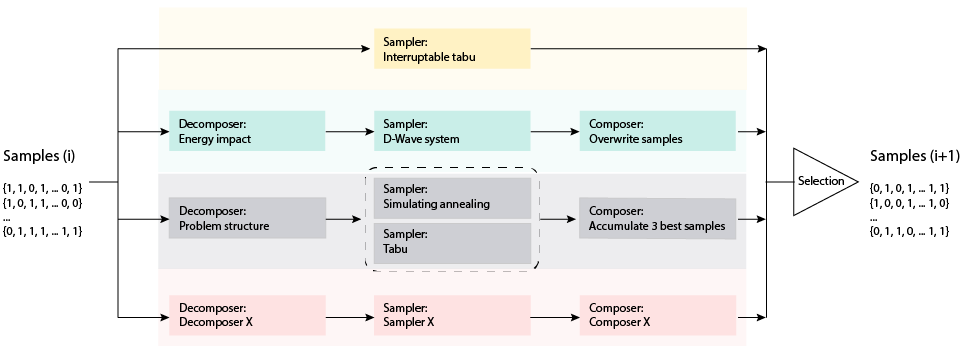
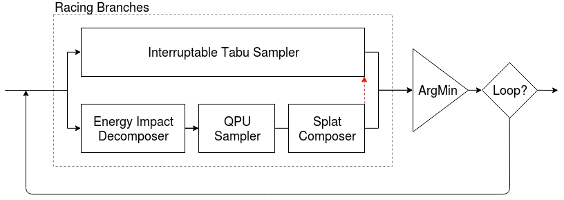
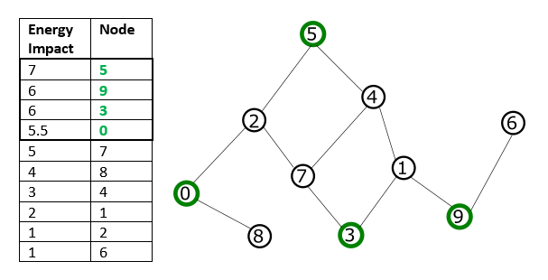
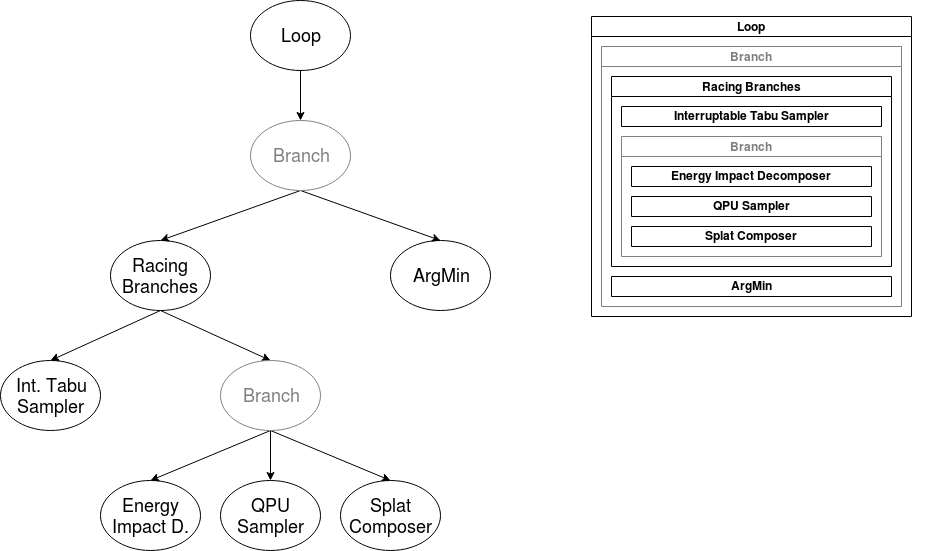

.. _opt_dwave_hybrid:

==================================
dwave-hybrid Development Framework 
==================================

Introduction
============

**dwave-hybrid** provides a framework for iterating arbitrary-sized sets of 
samples through parallel solvers to find an optimal solution.

For the documentation of a particular code element, see the 
:ref:`hybrid_api_ref` section. This introduction gives an overview of the 
package; steps you through using it, starting with running a provided hybrid
solver that handles arbitrary-sized QUBOs; and points out the way to developing 
your own components in the framework.

*   :ref:`opt_dwave_hybrid_overview` presents the framework and explains key concepts.

*   :ref:`opt_dwave_hybrid_using_framework` shows how to use the framework. You can quickly get 
    started by using a provided reference sampler built with this framework, 
    :class:`Kerberos <oceandocs:hybrid.reference.kerberos.KerberosSampler>`, to 
    solve a problem too large to :term:`minor-embed` on a D-Wave system. Next, 
    use the framework to build (hybrid) workflows; for example, a workflow for 
    larger-than-QPU lattice-structured problems.

*   :ref:`opt_dwave_hybrid_dev_components` guides you to developing your own hybrid components.

*   :ref:`opt_dwave_hybrid_ref_examples` describes some workflow examples included in the code.

.. _opt_dwave_hybrid_overview:

Overview
========

The *dwave-hybrid* framework enables you to quickly design and test workflows that
iterate sets of samples through samplers to solve arbitrary QUBOs. Large problems
can be decomposed and two or more solution techniques can run in parallel.

The :ref:`HybridBlockDiagram` figure below shows an example configuration. Samples
are iterated over four parallel solvers. The top **branch** represents a classical tabu
search that runs on the entire problem until interrupted by another branch completing.
These use different decomposers to parcel out parts of the current sample
set (iteration :math:`i`) to samplers such as a D-Wave system (second-highest branch)
or another structure of parallel simulated annealing and tabu search. A generic
representation of a branch's components---decomposer, sampler, and composer---is
shown in the lowest branch. A user-defined criterion selects from current samples
and solver outputs a sample set for iteration :math:`i+1`.

  Schematic Representation

You can use the framework to run a provided hybrid solver or to configure workflows using
provided components such as tabu samplers and energy-based decomposers.

You can also use the framework to build your own components to incorporate into your
workflow.

.. _opt_dwave_hybrid_using_framework:

Using the Framework
===================

This section helps you quickly use a provided reference sampler to solve 
arbitrary-sized problems and then shows you how to build (hybrid) workflows 
using provided components.

Reference Hybrid Sampler: Kerberos
==================================

*dwave-hybrid* includes a reference example sampler built using the framework:
Kerberos is a dimod-compatible hybrid asynchronous decomposition sampler that 
enables you to solve problems of arbitrary structure and size. It finds best 
samples by running in parallel tabu search, simulated annealing, and D-Wave 
subproblem sampling on problem variables that have high-energy impact.

The example below uses Kerberos to solve a large QUBO.

>>> import dimod
>>> from hybrid.reference.kerberos import KerberosSampler
>>> with open('../problems/random-chimera/8192.01.qubo') as problem:  # doctest: +SKIP
...     bqm = dimod.BinaryQuadraticModel.from_coo(problem)
>>> len(bqm)          # doctest: +SKIP
8192
>>> solution = KerberosSampler().sample(bqm, max_iter=10, convergence=3)   # doctest: +SKIP
>>> solution.first.energy     # doctest: +SKIP
-4647.0

Building Workflows
==================

As shown in the :ref:`opt_dwave_hybrid_overview` section, you build hybrid solvers by 
arranging components such as samplers in a workflow.

Building Blocks
---------------

The basic components---building blocks---you use are based on the 
:class:`.Runnable` class: decomposers, samplers, and composers. Such components 
input a set of samples, a :class:`~hybrid.core.SampleSet`, and output updated 
samples. A :class:`State` associated with such an iteration of a component holds 
the problem, samples, and optionally additional information.

The following example demonstrates a simple workflow that uses just one 
:class:`.Runnable`, a sampler representing the classical tabu search algorithm, 
to solve a problem (fully classically, without decomposition). The example 
solves a small problem of a triangle graph of nodes identically coupled. An 
initial :class:`.State` of all-zero samples is set as a starting point. The 
solution, `new_state`, is derived from a single iteration of the 
`TabuProblemSampler` :class:`.Runnable`.

>>> import dimod
>>> # Define a problem
>>> bqm = dimod.BinaryQuadraticModel.from_ising({}, {'ab': 0.5, 'bc': 0.5, 'ca': 0.5})
>>> # Set up the sampler with an initial state
>>> sampler = TabuProblemSampler(tenure=2, timeout=5)
>>> state = State.from_sample({'a': 0, 'b': 0, 'c': 0}, bqm)
>>> # Sample the problem
>>> new_state = sampler.run(state).result()
>>> print(new_state.samples)                     # doctest: +SKIP
    a   b   c  energy  num_occ.
0  +1  -1  -1    -0.5         1
['SPIN', 1 rows, 1 samples, 3 variables]

Flow Structuring
----------------

The framework provides classes for structuring workflows that use the 
"building-block" components. As shown in the :ref:`opt_dwave_hybrid_overview` section, 
you can create a *branch* of :class:`Runnable` classes; for example 
:code:`decomposer | sampler | composer`, which delegates part of a problem to a 
sampler such as a D-Wave quantum computer.

The following example shows a branch comprising a decomposer, local Tabu 
solver, and a composer. A 10-variable binary quadratic model is decomposed by 
the energy impact of its variables into a 6-variable subproblem to be sampled 
twice. An initial state of all -1 values is set using the utility function 
:meth:`~hybrid.utils.min_sample`.

>>> import dimod           # Create a binary quadratic model
>>> bqm = dimod.BinaryQuadraticModel({t: 0 for t in range(10)},
...                                  {(t, (t+1) % 10): 1 for t in range(10)},
...                                  0, 'SPIN')
>>> branch = (EnergyImpactDecomposer(size=6, min_gain=-10) |
...           TabuSubproblemSampler(num_reads=2) |
...           SplatComposer())
>>> new_state = branch.next(State.from_sample(min_sample(bqm), bqm))
>>> print(new_state.subsamples)      # doctest: +SKIP
    4   5   6   7   8   9  energy  num_occ.
0  +1  -1  -1  +1  -1  +1    -5.0         1
1  +1  -1  -1  +1  -1  +1    -5.0         1
['SPIN', 2 rows, 2 samples, 6 variables]

Such :class:`.Branch` classes can be run in parallel using the 
:class:`.RacingBranches` class. From the outputs of these parallel branches, 
:class:`.ArgMin` selects a new current sample. And instead of a single iteration 
on the sample set, you can use the :class:`.Loop` to iterate a set number of 
times or until a convergence criteria is met.

This example of :ref:`racingBranches1` solves a binary quadratic model by 
iteratively producing best samples. It employs both tabu search on the entire
problem and a D-Wave quantum computer on subproblems. In addition to 
building-block components such as employed above, this example also uses 
infrastructure classes to manage the decomposition and parallel running of 
branches.

    Racing Branches

.. todo:: consider modifying this pulled-in example (markers will change)

.. include:: ../ocean/api_ref_hybrid/README.rst
    :start-after: start_hybid_example
    :end-before: end_hybrid_example

Flow Refining
-------------

The framework enables quick modification of work flows to improve solutions and 
performance. For example, after verifying the :ref:`racingBranches1` workflow 
above on its small problem, you might make a series of modifications such as the 
examples below to better fit it to problems with large numbers of variables.

1.  Configure a decomposition window that moves down a fraction of problem 
    variables, ordered from highest to lower energy impact, and submit those 
    subproblems to a D-Wave quantum computer while tabu searches globally. This 
    example submits 50-variable subproblems on up to 15% of the total variables.

.. code-block:: python

    # Redefine the workflow: a rolling decomposition window
    subproblem = hybrid.EnergyImpactDecomposer(size=50, rolling_history=0.15)
    subsampler = hybrid.QPUSubproblemAutoEmbeddingSampler() | hybrid.SplatComposer()

    iteration = hybrid.RacingBranches(
        hybrid.InterruptableTabuSampler(),
        subproblem | subsampler
    ) | hybrid.ArgMin()

    workflow = hybrid.LoopUntilNoImprovement(iteration, convergence=3)

2.  Instead of sequentially producing a sample per subproblem, a further 
    modification might be to process all the subproblems in parallel and merge 
    the returned samples. Here the :class:`~hybrid.decomposers.EnergyImpactDecomposer` 
    is iterated until it raises a :meth:`~hybrid.exceptions.EndOfStream` exception 
    when it reaches 15% of the variables, and then all the 50-variable subproblems
    are submitted to the D-Wave quantum computer in parallel. Subsamples returned 
    by the QPU are disjoint in variables, so we can easily reduce them all to 
    a single subsample, which is then merged with the input sample using
    :class:`~hybrid.composers.SplatComposer`:

.. code-block:: python

    # Redefine the workflow: parallel subproblem solving for a single sample
    subproblem = hybrid.Unwind(
        hybrid.EnergyImpactDecomposer(size=50, rolling_history=0.15)
    )

    # Helper function to merge subsamples in place
    def merge_substates(_, substates):
        a, b = substates
        return a.updated(subsamples=hybrid.hstack_samplesets(a.subsamples, b.subsamples))

    # Map QPU sampling over all subproblems, then reduce subsamples by merging in place
    subsampler = hybrid.Map(
        hybrid.QPUSubproblemAutoEmbeddingSampler()
    ) | hybrid.Reduce(
        hybrid.Lambda(merge_substates)
    ) | hybrid.SplatComposer()

3.  Change the criterion for selecting subproblems. By default, the variables 
    are selected by maximal energy impact but selection can be better tailored 
    to a problem's structure.

    For example, for binary quadratic model representing the problem graph shown 
    in the :ref:`eidEnergy` graphic, if you select a subproblem size of four, 
    these nodes selected by descending energy impact are not directly connected 
    (no shared edges, and might not represent a local structure of the problem).

    Traversal by Energy Impact

    Configuring a mode of traversal such as breadth-first (BFS) or priority-first selection (PFS)
    can capture features that represent local structures within a problem.

    .. code-block:: python

        # Redefine the workflow: subproblem selection
        subproblem = hybrid.Unwind(
            hybrid.EnergyImpactDecomposer(size=50, rolling_history=0.15, traversal='bfs'))

    These two selection modes are shown in the :ref:`eidBfsPfs` graphic. BFS 
    starts with the node with maximal energy impact, from which its graph 
    traversal proceeds to directly connected nodes, then nodes directly connected 
    to those, and so on, with graph traversal ordered by node index. In PFS, 
    graph traversal selects the node with highest energy impact among unselected 
    nodes directly connected to any already selected node.

.. figure:: ../_images/eid_bfs_pfs.png
    :name: eidBfsPfs
    :scale: 70 %
    :alt: EID BFS

    Traversal by BFS or PFS

Additional Examples
===================

Tailoring State Selection
-------------------------

The next example tailors a state selector for a sampler that does some 
post-processing and can alert upon suspect samples. Sampler output modified by 
ellipses ("...") for readability is shown below for an Ising model of a triangle 
problem with zero biases and interactions all equal to 0.5. The first of three 
:class:`~hybrid.core.State` classes is flagged as problematic using the ``info`` 
field::

    [{...,'samples': SampleSet(rec.array([([0, 1, 0], 0., 1)], ..., ['a', 'b', 'c'], {'Postprocessor': 'Excessive chain breaks'}, 'SPIN')},
    {...,'samples': SampleSet(rec.array([([1, 1, 1], 1.5, 1)], ..., ['a', 'b', 'c'], {}, 'SPIN')},
    {...,'samples': SampleSet(rec.array([([0, 0, 0], 0., 1)], ..., ['a', 'b', 'c'], {}, 'SPIN')}]

This code snippet defines a metric for the key argument in :class:`~hybrid.flow.ArgMin`::

    def preempt(si):
        if 'Postprocessor' in si.samples.info:
            return(math.inf)
        else:
            return(si.samples.first.energy)

Using the defined key on the above input, :class:`~hybrid.flow.ArgMin` finds the 
state with the lowest energy (zero) excluding the flagged state (which also has 
energy of zero):

>>> ArgMin(key=preempt).next(states)     # doctest: +SKIP
{'problem': BinaryQuadraticModel({'a': 0.0, 'b': 0.0, 'c': 0.0}, {('a', 'b'): 0.5, ('b', 'c'): 0.5, ('c', 'a'): 0.5},
0.0, Vartype.SPIN), 'samples': SampleSet(rec.array([([0, 0, 0], 0., 1)],
dtype=[('sample', 'i1', (3,)), ('energy', '<f8'), ('num_occurrences', '<i4')]), ['a', 'b', 'c'], {}, 'SPIN')}

Parallel Sampling
-----------------

The code snippet below uses :class:`~hybrid.flow.Map` to run a tabu search on 
two states in parallel.

>>> Map(TabuProblemSampler()).run(States(                     # doctest: +SKIP
        State.from_sample({'a': 0, 'b': 0, 'c': 1}, bqm1),
        State.from_sample({'a': 1, 'b': 1, 'c': 0}, bqm2)))
>>> _.result()                # doctest: +SKIP
[{'samples': SampleSet(rec.array([([-1, -1,  1], -0.5, 1)], dtype=[('sample', 'i1', (3,)),
 ('energy', '<f8'), ('num_occurrences', '<i4')]), ['a', 'b', 'c'], {}, 'SPIN'),
 'problem': BinaryQuadraticModel({'a': 0.0, 'b': 0.0, 'c': 0.0}, {('a', 'b'): 0.5, ('b', 'c'): 0.5,
 ('c', 'a'): 0.5}, 0.0, Vartype.SPIN)},
 {'samples': SampleSet(rec.array([([ 1,  1, -1], -1., 1)], dtype=[('sample', 'i1', (3,)),
 ('energy', '<f8'), ('num_occurrences', '<i4')]), ['a', 'b', 'c'], {}, 'SPIN'),
 'problem': BinaryQuadraticModel({'a': 0.0, 'b': 0.0, 'c': 0.0}, {('a', 'b'): 1, ('b', 'c'): 1,
 ('c', 'a'): 1}, 0.0, Vartype.SPIN)}]

Logging and Execution Information
=================================

You can see detailed execution information by setting the level of logging.

The package supports logging levels TRACE, DEBUG, INFO, WARNING, ERROR, and 
CRITICAL in ascending order of severity. By default, logging level is set to 
ERROR. You can select the logging level with environment variable 
``DWAVE_HYBRID_LOG_LEVEL``.

For example, on a Windows operating system, set this environment variable to 
INFO level as:

.. code-block:: bash

    set DWAVE_HYBRID_LOG_LEVEL=INFO

or on a Unix-based system as:

.. code-block:: bash

    DWAVE_HYBRID_LOG_LEVEL=INFO

The previous example above might output something like the following:

>>> print("Solution: sample={s.samples.first}".format(s=solution))   # doctest: +SKIP

.. code-block:: bash

    2018-12-10 15:18:30,634 hybrid.flow INFO Loop Iteration(iterno=0, best_state_quality=-3.0)
    2018-12-10 15:18:31,511 hybrid.flow INFO Loop Iteration(iterno=1, best_state_quality=-3.0)
    2018-12-10 15:18:35,889 hybrid.flow INFO Loop Iteration(iterno=2, best_state_quality=-3.0)
    2018-12-10 15:18:37,377 hybrid.flow INFO Loop Iteration(iterno=3, best_state_quality=-3.0)
    Solution: sample=Sample(sample={'a': 1, 'b': -1, 'c': -1}, energy=-3.0, num_occurrences=1)

.. _opt_dwave_hybrid_dev_components:

Developing New Components
=========================

The *dwave-hybrid* framework enables you to build your own components to incorporate into your
workflow.

The key superclass is the :class:`~hybrid.core.Runnable` class: all basic components---samplers,
decomposers, composers---and flow-structuring components such as branches inherit
from this class. A :class:`~hybrid.core.Runnable` is run for an iteration in which it updates
the :class:`~hybrid.core.State` it receives. Typical methods are `run` or `next` to execute an
iteration and `stop` to terminate the :class:`~hybrid.core.Runnable`.

The :ref:`hybrid_core` and :ref:`hybrid_flow` sections describe, respectively, the basic :class:`~hybrid.core.Runnable`
classes (building blocks) and flow-structuring ones and their methods. If you are
implementing these methods for your own :class:`~hybrid.core.Runnable` class, see comments in
the code.

The :ref:`racingBranches1` graphic below shows the top-down composition (tree structure) of a hybrid loop.

  Top-Down Composition

.. include:: ../ocean/api_ref_hybrid/traits.rst
     :start-after: start_hybrid_traits
     :end-before: end_hybrid_traits

The :ref:`hybrid_conversion` section describes the :class:`~hybrid.core.HybridRunnable`
class you can use to produce a :class:`~hybrid.core.Runnable` sampler based on
a :ref:`dimod <index_dimod>` sampler.

The :ref:`hybrid_utilities` section provides a list of useful utility methods.

.. _opt_dwave_hybrid_ref_examples:

Reference Examples
==================

The `examples <https://github.com/dwavesystems/dwave-hybrid/tree/master/examples>`_
directory of the code includes implementations of some :ref:`hybrid_reference_workflows`
you can incorporate as provided into your application and also use to jumpstart
your development of custom workflows.

A typical first use of dwave-hybrid might be to simply use the Kerberos reference
sampler to solve a QUBO, as shown in :ref:`opt_dwave_hybrid_using_framework`. Next, you might tune its configurable
parameters, described under :ref:`hybrid_reference_workflows`.

To further improve performance, you can step up from using a generic
workflow to one tailored for your application and its problem. As a first step you can
modify a reference workflow with existing components. After that, you can implement your
own components as described in :ref:`opt_dwave_hybrid_dev_components`.
