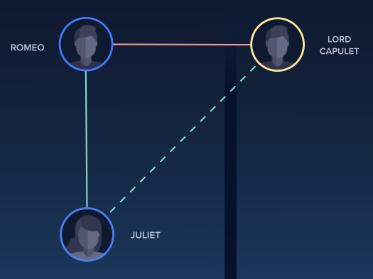

.. _opt_example_bqm_structuralimbalance:

========================================
Structural Imbalance in a Social Network
========================================

This example solves a structural-imbalance problem, similar to the
`Leap <https://cloud.dwavesys.com/leap/>`_ demo and
`Jupyter Notebook <https://github.com/dwave-examples/structural-imbalance-notebook>`_,
to demonstrate using Leap's hybrid solver service on a problem of arbitrary
structure and size.

*Social networks* map relationships between people or organizations onto graphs, with
the people/organizations as nodes and relationships as edges; for example,
Facebook friends form a social network. *Signed social networks* map both friendly and
hostile relationships by assigning to edges either positive or negative values. Such
networks are said to be *structurally balanced* when they can be cleanly divided into
two sets, with each set containing only friends, and all relations between these sets
are hostile. The measure of *structural imbalance* or *frustration* for a signed social
network, when it cannot be cleanly divided, is the minimum number of edges that violate
the social rule, “the enemy of my friend is my enemy.”

   Juliet’s new love of Romeo introduces imbalance into the social network of Verona. Green edges represent friendly relationships (Juliet & Romeo and Juliet & Lord Capulet) while red edges represent hostile relationships (Romeo and Lord Capulet). The black vertical line dividing the set with Romeo from the set with Lord Capulet crosses the friendly edge between Juliet and Lord Capulet.

Finding a division that minimizes frustration is an NP-hard graph problem (it can be
viewed as an expansion of the well-known
`maximum cut <https://en.wikipedia.org/wiki/Maximum_cut>`_ problem).

Example Requirements
====================

.. example-requirements-start-marker

The code in this example requires that your development environment have 
`Ocean software <https://github.com/dwavesystems/dwave-ocean-sdk>`_ and be 
configured to access SAPI, as described in the :ref:`gs_initial_setup` section. 

.. example-requirements-end-marker

Solution Steps
==============

.. example-steps-start-marker

Section :ref:`solving_problems` describes the problem-solving workflow as
consisting of two main steps: (1) Formulate the problem as an
:term:`objective function` in a supported model and (2) Solve your model with
a D-Wave :term:`solver`.

.. example-steps-end-marker

In this example, a function in Ocean software handles both steps. Our task is
mainly to select the :term:`sampler` used to solve the problem.

Formulate the Problem
=====================

For a social graph, `G`, this example simply builds a random sparse graph---using the
`NetworkX <https://networkx.org>`_ :func:`~networkx.generators.geometric.random_geometric_graph()`
function, which places uniformly at random a specified number of nodes, `problem_node_count`,
in a unit cube, joining edges of any two if the distance is below a given radius---and randomly
assigns :math:`-1, 1` signs to represent friendly and hostile relationships.

>>> import networkx as nx
>>> import random
>>> problem_node_count = 300
>>> G = nx.random_geometric_graph(problem_node_count, radius=0.0005*problem_node_count)
>>> G.add_edges_from([(u, v, {'sign': random.choice((-1, 1))}) for u, v in G.edges])

Solve the Problem by Sampling
=============================

As mentioned above, this example uses Ocean's :doc:`dwave_networkx </docs_dnx/sdk_index>`
function, :func:`~dwave_networkx.algorithms.social.structural_imbalance`, to create the
appropriate BQM to represent
the problem graph and return a solution. It requires just the selection of a :term:`sampler`.

D-Wave's quantum cloud service provides cloud-based hybrid solvers you can submit arbitrary
BQMs to. These solvers, which implement state-of-the-art classical algorithms together
with intelligent allocation of the quantum processing unit (QPU) to parts of the problem
where it benefits most, are designed to accommodate even very large problems. Leap's
solvers can relieve you of the burden of any current and future development and optimization
of hybrid algorithms that best solve your problem.

Ocean software's :doc:`dwave-system </docs_system/sdk_index>`
:class:`~dwave.system.samplers.LeapHybridSampler` class enables you to easily incorporate
Leap's hybrid solvers into your application:

>>> from dwave.system import LeapHybridSampler
>>> sampler = LeapHybridSampler()     # doctest: +SKIP

Finally, the returned set of frustrated edges and a bicoloring are counted and printed.

>>> import dwave_networkx as dnx
>>> imbalance, bicoloring = dnx.structural_imbalance(G, sampler)    # doctest: +SKIP
>>> set1 = int(sum(list(bicoloring.values())))        # doctest: +SKIP
>>> print("One set has {} nodes; the other has {} nodes.".format(set1, problem_node_count-set1))  # doctest: +SKIP
>>> print("The network has {} frustrated relationships.".format(len(list(imbalance.keys()))))    # doctest: +SKIP
One set has 143 nodes; the other has 157 nodes.
The network has 904 frustrated relationships.

The graphic below visualizes the result of one such run.

.. figure:: ../_images/structural_imbalance_300.png
   :name: structural_imbalance_300
   :alt: image
   :align: center
   :scale: 60 %

   One solution found for a 300-node problem. Two circular sets, of blue or yellow nodes, are internally connected by solid green edges representing friendly relationships while red edges representing hostile relationships and dashed green edges representing frustrated relationships are stretched out between these.
