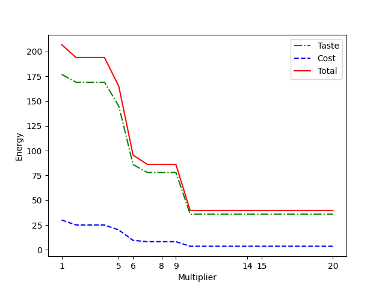

.. _opt_example_cqm_diet:

=============
Diet Planning
=============

This example demonstrates the use of a `Leap <https://cloud.dwavesys.com/leap/>`_
hybrid :ref:`cqm_sdk` (CQM) solver on a simple mixed-integer linear-programming (MILP)
type of optimization problem, which can be expressed as a linear objective and
constraints with integer and real-valued variables. Other examples include
*quadratic* objectives and constraints, which better make use of the strengths of
D-Wave's solvers.

The goal of this problem is to optimize the taste of a diet's foods while
keeping to the dieter's budget and daily requirements on macro-nutrients.

Example Requirements
====================

.. include:: ../shared/examples.rst
    :start-after: start_requirements
    :end-before: end_requirements

Solution Steps
==============

.. |workflow_section| replace:: :ref:`opt_workflow`

.. include:: ../shared/examples.rst
    :start-after: start_standard_steps
    :end-before: end_standard_steps

This example formulates this problem as a :ref:`constrained quadratic model <cqm_sdk>`
and uses the :class:`~dwave.system.samplers.LeapHybridCQMSampler` to find good
solutions.

Formulate the Problem
=====================

The table below shows a selection of foods chosen by a dieter, ranked for
the dieter's taste on a scale of one to ten, with evaluations (not necessarily
realistic) of nutrients and costs.

.. _example_cqm_diet_reals_table_1:

.. list-table:: Nutrients, Cost, and Taste Rankings for Available Foods
   :header-rows: 1

   * - **Food**
     - **Calories**
     - **Protein**
     - **Fat**
     - **Carbs**
     - **Fiber**
     - **Taste**
     - **Cost**
   * - Rice
     - 100
     - 3
     - 1
     - 22
     - 2
     - 7
     - 2.50
   * - Tofu
     - 140
     - 17
     - 9
     - 3
     - 2
     - 2
     - 4.0
   * - Bananas
     - 90
     - 1
     - 0
     - 23
     - 3
     - 10
     - 1.0
   * - Lentils
     - 150
     - 9
     - 0
     - 25
     - 4
     - 3
     - 1.30
   * - Bread
     - 270
     - 9
     - 3
     - 50
     - 3
     - 5
     - 0.25
   * - Avocado
     - 300
     - 4
     - 30
     - 20
     - 14
     - 5
     - 2.00

The following table shows the dieter's daily requirements for selected nutrients.

.. _example_cqm_diet_reals_table_2:

.. list-table:: Daily Required Nutrients
   :header-rows: 1

   * - **Nutrient**
     - **Calories**
     - **Protein**
     - **Fat**
     - **Carbs**
     - **Fiber**
   * - **Daily Requirement**
     - 2000
     - 50
     - 30
     - 130
     - 30

For simplicity, store the contents of the two tables above as a dict. The dict
also contains information on whether the portion of a particular food is best
treated as continuous (for example, rice can be any weight), in which case it
should be represented with real-valued variables, or as a discrete unit (such as
fruit that is eaten whole), in which case it is best represented by integer-valued
variables.

>>> foods = {
...   'rice': {'Calories': 100, 'Protein': 3, 'Fat': 1, 'Carbs': 22, 'Fiber': 2,
...            'Taste': 7, 'Cost': 2.5, 'Units': 'continuous'},
...   'tofu': {'Calories': 140, 'Protein': 17, 'Fat': 9, 'Carbs': 3, 'Fiber': 2,
...            'Taste': 2, 'Cost': 4.0, 'Units': 'continuous'},
...   'banana': {'Calories': 90, 'Protein': 1, 'Fat': 0, 'Carbs': 23, 'Fiber': 3,
...              'Taste': 10, 'Cost': 1.0, 'Units': 'discrete'},
...   'lentils': {'Calories': 150, 'Protein': 9, 'Fat': 0, 'Carbs': 25, 'Fiber': 4,
...               'Taste': 3, 'Cost': 1.3, 'Units': 'continuous'},
...   'bread': {'Calories': 270, 'Protein': 9, 'Fat': 3, 'Carbs': 50, 'Fiber': 3,
...             'Taste': 5, 'Cost': 0.25, 'Units': 'continuous'},
...   'avocado': {'Calories': 300, 'Protein': 4, 'Fat': 30, 'Carbs': 20, 'Fiber': 14,
...               'Taste': 5, 'Cost': 2.0, 'Units': 'discrete'}}
...
>>> min_nutrients = {"Protein": 50, "Fat": 30, "Carbs": 130, "Fiber": 30}
>>> max_calories = 2000

Variables
=========

Instantiate some real and integer variables\ [#]_ in a list, :code:`quantities`,
that in the solutions will be assigned values for the selected quantities of
every available food.

>>> quantities = [dimod.Real(f"{food}") if foods[food]["Units"] == "continuous"
...                                     else dimod.Integer(f"{food}")
...                                     for food in foods.keys()]

.. [#]

   Always keep in mind that such "variables" are actually
   :class:`~dimod.QuadraticModel` objects,

   >>> quantities[0]
   QuadraticModel({'rice': 1.0}, {}, 0.0, {'rice': 'REAL'}, dtype='float64')

   with a single variable with the requested label; e.g., :code:`rice`. This
   means, for example, that multiplying by two doubles the linear bias,

   >>> 2*quantities[0]
   QuadraticModel({'rice': 2.0}, {}, 0.0, {'rice': 'REAL'}, dtype='float64')

   multiplying two such "variables" creates a quadratic bias,

   >>> quantities[0] * quantities[1]          # doctest: +SKIP
   QuadraticModel({'rice': 0.0, 'tofu': 0.0}, {('tofu', 'rice'): 1.0}, 0.0,
   ...            {'rice': 'REAL', 'tofu': 'REAL'}, dtype='float64')

   but multiplying three such quadratic models requires a non-quadratic term
   and so :code:`quantities[0] * quantities[1] * quantities[2]` cannot generate
   a quadratic model and results in an error.

Bounds on the range of values for non-binary variables shrink the solution
space the solver must search, so it is helpful to set such bounds; for many
problems, you can find bounds from your knowledge of the problem. In this case,
no food by itself should be assigned a quantity that exceeds :code:`max_calories`.

>>> for ind, food in enumerate(foods.keys()):
...   ub = max_calories / foods[food]["Calories"]
...   quantities[ind].set_upper_bound(food, ub)

The maximum quantity of rice, for example, which here has 100 calories per portion,
is 20 portions because :math:`20*100 = 2000`.

>>> quantities[0].upper_bound("rice")
20.0

Lower bounds are actually *required* in this problem for correct formulation:
a valid mathematical solution might be to offset the calories of gorging on large
numbers of tasty bananas by eating a negative amount of high-in-calories bread, so
the formulation must include the impossibility of consuming negative quantities
of food. Because Ocean sets a default value of zero for `~dimod.quadratic.Real`
variables, no explicit configuration is needed.

You can now formulate an :term:`objective function` and any constraints feasible
solutions must meet, and set these in your CQM.

Objective Function
------------------

The objective function must maximize taste of the diet's foods while minimizing
purchase cost.

To maximize taste and minimize cost is to assign values to the variables that
represent quantities of each food, :math:`q_i`, such that when multiplied by
coefficients representing the cost, :math:`c_i`, or taste, :math:`t_i`,
of each food, form the linear terms of the following summations to be optimized:

.. math::

	\min \sum_i q_i c_i \qquad \text{Minimize cost}

  \max \sum_i q_i t_i \qquad \text{Maximize taste}

To optimize two different objectives, taste and cost, requires weighing one
against the other. A simple way to do this, is to set priority weights; for example,

.. math::

	\text{objective} = \alpha \text{(objective 1)} + \beta \text{(objective 2)}

By setting, for example :math:`\alpha=2, \beta=1`, you double the priority of the
first objective compared to the second.

Instantiate a CQM.

>>> cqm = dimod.ConstrainedQuadraticModel()

You can define a utility function, :code:`total_mix`, to calculate the summations
for any given category such as calories.

>>> def total_mix(quantity, category):
...   return sum(q * c for q, c in zip(quantity, (foods[food][category] for food in foods.keys())))

Set the objective\ [#]_. Because Ocean solvers minimize objectives, to maximize taste,
:code:`Taste` is multiplied by `-1` and minimized.

>>> cqm.set_objective(-total_mix(quantities, "Taste") + 6*total_mix(quantities, "Cost"))

.. [#] Section `Tuning the Solution`_ belows shows how the priority weights
  :math:`\alpha, \beta` above were chosen.

Constraints
-----------

The problem has the following constraints of the
:ref:`Daily Required Nutrients <example_cqm_diet_reals_table_2>` table:

1. Calories: no more than 2000
2. Protein: at least 50
3. Fat: at least 30
4. Carbs: at least 130
5. Fiber: at least 30

Constrain the diet's calorie intake to the required daily maximum.

>>> cqm.add_constraint(total_mix(quantities, "Calories") <= max_calories, label="Calories")
'Calories'

Require that the daily minimum of each nutrient is met or exceeded.

>>> for nutrient, amount in min_nutrients.items():
...   cqm.add_constraint(total_mix(quantities, nutrient) >= amount, label=nutrient)
'Protein'
'Fat'
'Carbs'
'Fiber'

You can access these constraints as a dict with the labels as keys:

>>> list(cqm.constraints.keys())
['Calories', 'Protein', 'Fat', 'Carbs', 'Fiber']
>>> print(cqm.constraints["Calories"].to_polystring())
100*rice + 140*tofu + 90*banana + 150*lentils + 270*bread + 300*avocado <= 2000.0
>>> print(cqm.constraints["Protein"].to_polystring())
3*rice + 17*tofu + banana + 9*lentils + 9*bread + 4*avocado >= 50.0

Solve the Problem by Sampling
=============================

D-Wave's quantum cloud service provides cloud-based
:std:doc:`hybrid solvers <sysdocs_gettingstarted:doc_leap_hybrid>` you can
submit arbitrary QMs to. These solvers, which implement state-of-the-art
classical algorithms together with intelligent allocation of the quantum
processing unit (QPU) to parts of the problem where it benefits most, are
designed to accommodate even very large problems. Leap's solvers can
relieve you of the burden of any current and future development and optimization
of hybrid algorithms that best solve your problem.

Ocean software's :doc:`dwave-system </docs_system/sdk_index>`
:class:`~dwave.system.samplers.LeapHybridCQMSampler` class enables you to
easily incorporate Leap's hybrid CQM solvers into your application:

>>> from dwave.system import LeapHybridCQMSampler
>>> sampler = LeapHybridCQMSampler()                        # doctest: +SKIP

Submit the CQM to the selected solver. For one particular execution, the CQM
hybrid sampler returned 49 samples, out of which 25 were solutions that met all
the constraints.

>>> sampleset = sampler.sample_cqm(cqm)                    # doctest: +SKIP
>>> feasible_sampleset = sampleset.filter(lambda row: row.is_feasible)   # doctest: +SKIP
>>> print("{} feasible solutions of {}.".format(len(feasible_sampleset), len(sampleset)))    # doctest: +SKIP
25 feasible solutions of 49.

You can define a utility function, :code:`print_diet`, to display returned
solutions in an intuitive format.

>>> def print_diet(sample):
...    diet = {food: round(quantity, 1) for food, quantity in sample.items()}
...    print(f"Diet: {diet}")
...    taste_total = sum(foods[food]["Taste"] * amount for food, amount in sample.items())
...    cost_total = sum(foods[food]["Cost"] * amount for food, amount in sample.items())
...    print(f"Total taste of {round(taste_total, 2)} at cost {round(cost_total, 2)}")
...    for constraint in cqm.iter_constraint_data(sample):
...       print(f"{constraint.label} (nominal: {constraint.rhs_energy}): {round(constraint.lhs_energy)}")

The best solution found in this current execution was a diet of bread and bananas,
with avocado completing the required fiber and fat portions:

>>> best = feasible_sampleset.first.sample                       # doctest: +SKIP
>>> print_diet(best)                                             # doctest: +SKIP
Diet: {'avocado': 1.0, 'banana': 6.0, 'bread': 4.1, 'lentils': 0.3, 'rice': 0.0, 'tofu': 0.0}
Total taste of 86.56 at cost 9.46
Calories (nominal: 2000): 2000
Protein (nominal: 50): 50
Fat (nominal: 30): 42
Carbs (nominal: 130): 372
Fiber (nominal: 30): 46

Tuning the Solution
===================

Consider sampling each part of the combined objective on its own (i.e.,
:math:`\alpha=1, \beta=0` and :math:`\alpha=0, \beta=1`), and comparing the
best solutions. Start with taste:

>>> cqm.set_objective(-total_mix(quantities, "Taste"))
>>> sampleset_taste = sampler.sample_cqm(cqm)                     # doctest: +SKIP
>>> feasible_sampleset_taste = sampleset_taste.filter(lambda row: row.is_feasible)  # doctest: +SKIP
>>> best_taste = feasible_sampleset_taste.first                   # doctest: +SKIP
>>> print(round(best_taste.energy))                               # doctest: +SKIP
-177
>>> print_diet(best_taste.sample)                                 # doctest: +SKIP
Diet: {'avocado': 0.0, 'banana': 17.0, 'bread': 0.0, 'lentils': 0.0, 'rice': 0.0, 'tofu': 3.3}
Total taste of 176.93 at cost 30.41
Calories (nominal: 2000): 2000
Protein (nominal: 50): 74
Fat (nominal: 30): 30
Carbs (nominal: 130): 402
Fiber (nominal: 30): 58

You can see that this diet is high in bananas, the tastiest food, and makes up
for that food's low levels of protein and fat with tofu.

Next, for cost:

>>> cqm.set_objective(total_mix(quantities, "Cost"))
>>> sampleset_cost = sampler.sample_cqm(cqm)                     # doctest: +SKIP
>>> feasible_sampleset_cost = sampleset_cost.filter(lambda row: row.is_feasible)  # doctest: +SKIP
>>> best_cost = feasible_sampleset_cost.first                    # doctest: +SKIP
>>> print(round(best_cost.energy))                               # doctest: +SKIP
3
>>> print_diet(best_cost.sample)                                 # doctest: +SKIP
Diet: {'avocado': 1.0, 'banana': 0.0, 'bread': 5.3, 'lentils': 0.0, 'rice': 0.0, 'tofu': 0.0}
Total taste of 31.67 at cost 3.33
Calories (nominal: 2000): 1740
Protein (nominal: 50): 52
Fat (nominal: 30): 46
Carbs (nominal: 130): 287
Fiber (nominal: 30): 30

This diet is ranked as less tasty than the previous but much cheaper. It relies
mainly on bread and uses avocado to add fat and fiber.

Because of the differences in energy scale between the two parts of the
combined objective, :math:`177 \gg 3`, if you do not multiply the part
representing cost by some positive factor, optimal solutions will maximize taste
and neglect cost. That is, if in
:math:`\text{objective} = \alpha \text{(objective 1)} + \beta \text{(objective 2)}`
you set set :math:`\alpha = \beta = 1`, solutions will likely be close or identical
to those found when optimizing for taste alone.

>>> cqm.set_objective(-total_mix(quantities, "Taste") + 1 * total_mix(quantities, "Cost"))
>>> sampleset = sampler.sample_cqm(cqm)                        # doctest: +SKIP
>>> feasible_sampleset = sampleset.filter(lambda row: row.is_feasible)  # doctest: +SKIP
>>> best = feasible_sampleset.first.sample                     # doctest: +SKIP
>>> print_diet(best)                                           # doctest: +SKIP
Diet: {'avocado': 0.0, 'banana': 17.0, 'bread': 0.0, 'lentils': 0.0, 'rice': 0.0, 'tofu': 3.3}
Total taste of 176.93 at cost 30.41
Calories (nominal: 2000): 2000
Protein (nominal: 50): 74
Fat (nominal: 30): 30
Carbs (nominal: 130): 402
Fiber (nominal: 30): 58

Compare the best solutions found when optimizing for taste and cost alone. Notice
that to reduce 27 units of cost (:math:`30 - 3`) in the latter solution, taste
was decreased by 145 (:math:`177 - 32`), for a ratio of :math:`145/27 \approx 5.5`.
To give each part of the combined objective a similar weighting, the
`Objective Function`_ section above multiplied the part of the objective that
minimizes cost by a factor of :math:`\beta=6`.

The graphic below shows the solution energies of the combined objective and both
of its parts for :math:`\alpha = 1, \beta = \{1, 2, 3, ... 19, 20\}`.

   Energy of the objective for various multipliers of the cost.

For low (:math:`1-5`) ratios of :math:`\frac{\beta}{\alpha}` solutions are optimized
for taste alone; for high ratios (:math:`> 15`) solutions are optimized for cost.
The relationship between this ratio and the weightings of the two parts of the
combined optimization is non-linear, so while you can use such reasoning as was
done above to find a starting point for "good" relative weightings, typically
you need to experiment.

Notice that in all the previous solutions, the resulting diet relied on only two
or three foods. If the dieter wants a more diverse diet, you can enforce that by
setting appropriate bounds on the variables (or, equivalently, adding constraints
on minimum/maximum quantities of each food).

>>> cqm.set_objective(-total_mix(quantities, "Taste") + 6*total_mix(quantities, "Cost"))
>>> for variable in cqm.variables:
...    cqm.set_lower_bound(variable, 1)
>>> sampleset_diverse = sampler.sample_cqm(cqm)                   # doctest: +SKIP
>>> feasible_sampleset_diverse = sampleset_diverse.filter(lambda row: row.is_feasible)  # doctest: +SKIP
>>> best_diverse = feasible_sampleset_diverse.first.sample        # doctest: +SKIP
>>> print_diet(best_diverse)                                      # doctest: +SKIP
Diet: {'avocado': 1.0, 'banana': 11.0, 'bread': 1.2, 'lentils': 1.0, 'rice': 1.0, 'tofu': 1.0}
Total taste of 132.93 at cost 21.1
Calories (nominal: 2000): 2000
Protein (nominal: 50): 55
Fat (nominal: 30): 44
Carbs (nominal: 130): 382
Fiber (nominal: 30): 59
