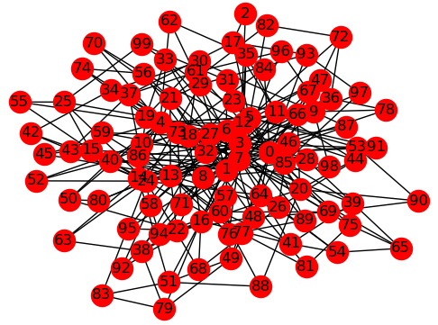

.. _opt_example_dwavehybrid_workflow:

=======================================
Big Random Graph: dwave-hybrid Workflow
=======================================

This example solves a graph problem with too many variables to fit onto the QPU.

    Problem Graph with Many Variables.

The purpose of this example is to illustrate a hybrid solution---the combining
of classical and quantum resources---to a problem that cannot be mapped in its
entirety to the |dwave_short| quantum computer due to the number of its
variables. Hard optimization problems might have many variables; for example,
scheduling or allocation of resources. In such cases, quantum resources are used
as an accelerator much as GPUs are for graphics.

.. note:: For fully connected graphs, the number of edges grows very quickly
    with increased nodes, degrading performance. The current example uses 100
    nodes but with a degree of three (each node connects to three other nodes).
    You can increase the number of nodes substantially as long as you keep the
    graph sparse.

For more detailed examples of using :ref:`dwave-hybrid <index_hybrid>` to
combine classical and quantum resources in solving your problem, see the
`Hybrid Computing Jupyter Notebooks <https://github.com/dwave-examples/structural-imbalance-notebook>`_.

Example Requirements
====================

.. include:: ../shared/examples.rst
    :start-after: start_requirements
    :end-before: end_requirements

Solution Steps
==============

.. |workflow_section| replace:: :ref:`opt_workflow`

.. include:: ../shared/examples.rst
    :start-after: start_standard_steps
    :end-before: end_standard_steps

This example uses :ref:`dwave-hybrid <index_hybrid>` to combine a tabu search on
a CPU with the submission of parts of the (large) problem to a |dwave_short|
quantum computer.

Formulate the Problem
=====================

This example uses a synthetic problem for illustrative purposes: a
:std:doc:`NetworkX <networkx:index>` generated graph,
:func:`~networkx.generators.random_graphs.barabasi_albert_graph`, with random
:math:`+1` or :math:`-1` couplings assigned to its edges.

.. testcode::

    # Represent the graph problem as a binary quadratic model
    import dimod
    import networkx as nx
    import random

    graph = nx.barabasi_albert_graph(100, 3, seed=1)  # Build a quasi-random graph
    # Set node and edge values for the problem
    h = {v: 0.0 for v in graph.nodes}
    J = {edge: random.choice([-1, 1]) for edge in graph.edges}
    bqm = dimod.BQM(h, J, vartype=dimod.SPIN)

Create a Hybrid Workflow
========================

The following simple workflow uses a :code:`RacingBranches` class to iterate two
:code:`Branch` classes in parallel: a tabu search,
:code:`InterruptableTabuSampler`, which is interrupted to potentially
incorporate samples from subproblems (subsets of the problem variables and
structure) by
:code:`EnergyImpactDecomposer | QPUSubproblemAutoEmbeddingSampler | SplatComposer`,
which decomposes the problem by selecting variables with the greatest energy
impact, submits these to the |dwave_short| quantum computer, and merges the
subproblem's samples into the latest problem samples. In this case, subproblems
contain 30 variables in a rolling window that can cover up to 75 percent of the
problem's variables.

.. testcode::

    # Set a workflow of tabu search in parallel to submissions to a D-Wave system
    import hybrid
    workflow = hybrid.Loop(
       hybrid.RacingBranches(
            hybrid.InterruptableTabuSampler(),
            hybrid.EnergyImpactDecomposer(size=30, rolling=True, rolling_history=0.75)
            | hybrid.QPUSubproblemAutoEmbeddingSampler()
            | hybrid.SplatComposer()) | hybrid.ArgMin(), convergence=3)

Solve the Problem Using Hybrid Resources
========================================

Once you have a hybrid workflow, you can run and tune it within the
:ref:`dwave-hybrid <index_hybrid>` framework or convert it to a
:ref:`dimod <index_dimod>` sampler.

.. testcode::

    # Convert to dimod sampler and run workflow
    result = hybrid.HybridSampler(workflow).sample(bqm)

While the tabu search runs locally, one or more subproblems are sent to the QPU.

>>> print("Solution: sample={}".format(result.first)) # doctest: +SKIP
Solution: sample=Sample(sample={0: -1, 1: -1, 2: -1, 3: 1, 4: -1, ... energy=-169.0, num_occurrences=1)