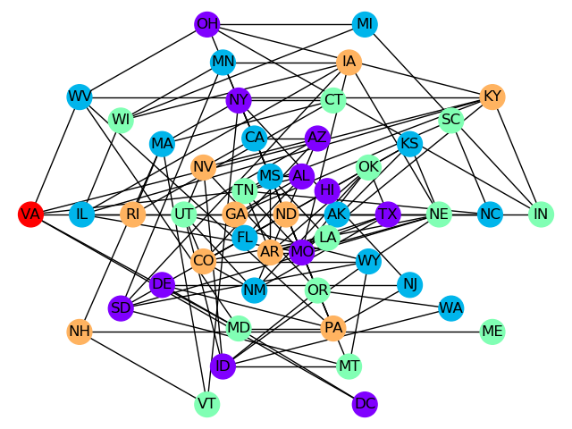

.. _opt_example_kerberos_map:

==================
Large Map Coloring
==================

This example solves a map coloring problem to demonstrate an out-of-the-box use of
Ocean's classical-quantum hybrid sampler, :doc:`dwave-hybrid </docs_hybrid/sdk_index>`
:class:`~hybrid.reference.kerberos.KerberosSampler`, that enables you to solve problems
of arbitrary structure and size.

Map coloring is an example of a
:doc:`constraint satisfaction problem </concepts/csp>` (CSP). CSPs require
that all a problem's variables be assigned values, out of a finite domain, that result
in the satisfying of all constraints. The map-coloring CSP is to assign a
color to each region of a map such that any two regions sharing a border have different
colors.

.. figure:: ../_images/us_map.png
   :name: ProblemMapColoringSDKExampleKerberos
   :alt: image
   :align: center
   :scale: 70 %

   Coloring a map of the USA.

The :ref:`map_coloring` advanced example demonstrates lower-level coding of a similar
problem, which gives the user more control over the solution procedure but requires
the knowledge of some system parameters (e.g., knowing the maximum number of supported
variables for the problem). Example :ref:`hybrid1` demonstrates the hybrid approach to
problem solving in more detail by explicitly configuring the classical and quantum workflows.

Example Requirements
====================

.. include:: ../shared/examples.rst
    :start-after: start_requirements
    :end-before: end_requirements

Solution Steps
==============

.. |workflow_section| replace:: :ref:`opt_workflow`

.. include:: ../shared/examples.rst
    :start-after: start_standard_steps
    :end-before: end_standard_steps

In this example, a function in Ocean software handles both steps. Our task is
mainly to select the sampler used to solve the problem.

Formulate the Problem
=====================

This example uses the `NetworkX <https://networkx.org>`_
:func:`~networkx.readwrite.adjlist.read_adjlist` function to read a text file,
``usa.adj``, containing the states of the USA and their adjacencies (states with
a shared border) into a graph. The original map information was found on
`write-only blog of Gregg Lind <https://writeonly.wordpress.com/2009/03/20/adjacency-list-of-states-of-the-united-states-us/>`_ and looks like this::

    # Author Gregg Lind
    # License:  Public Domain.    I would love to hear about any projects you use if it for though!
    #
    AK,HI
    AL,MS,TN,GA,FL
    AR,MO,TN,MS,LA,TX,OK
    AZ,CA,NV,UT,CO,NM
    CA,OR,NV,AZ
    CO,WY,NE,KS,OK,NM,AZ,UT

    # Snipped here for brevity

You can see in the first non-comment line that the state of Alaska ("AK") has Hawaii
("HI") as an adjacency and that Alabama ("AL") shares borders with four states.

>>> import networkx as nx
>>> G = nx.read_adjlist('usa.adj', delimiter = ',')   # doctest: +SKIP

Graph G now represents states as vertices and each state's neighbors as shared edges.

Solve the Problem by Sampling
=============================

Ocean's :doc:`dwave_networkx </docs_dnx/sdk_index>` can return a
`minimum vertex coloring <https://en.wikipedia.org/wiki/Graph_coloring>`_ for a graph,
which assigns a color to the vertices of a graph in a way that no adjacent vertices
have the same color, using the minimum number of colors. Given a graph representing a
map and a :term:`sampler`, the
:func:`~dwave_networkx.algorithms.coloring.min_vertex_coloring` function tries to
solve the map coloring problem.

:doc:`dwave-hybrid </docs_hybrid/sdk_index>` :class:`~hybrid.reference.kerberos.KerberosSampler`
is classical-quantum hybrid asynchronous decomposition sampler, which can decompose large problems
into smaller pieces that
it can run both classically (on your local machine) and on the D-Wave system.
Kerberos finds best samples by running in parallel :class:`~hybrid.samplers.TabuProblemSampler`,
:class:`~hybrid.samplers.SimulatedAnnealingProblemSampler`, and D-Wave subproblem sampling on
problem variables that have high impact. The only optional parameters set here
are a maximum number of iterations and number of iterations with no improvement that
terminates sampling. (See the :ref:`hybrid1` example for more details on configuring
the classical and quantum workflows.)

>>> import dwave_networkx as dnx
>>> from hybrid.reference.kerberos import KerberosSampler
>>> coloring = dnx.min_vertex_coloring(G, sampler=KerberosSampler(), chromatic_ub=4, max_iter=10, convergence=3)   # doctest: +SKIP
>>> set(coloring.values())       # doctest: +SKIP
{0, 1, 2, 3}

.. note:: The next code requires `Matplotlib <https://matplotlib.org>`_\ .

Plot the solution, if valid.

>>> import matplotlib.pyplot as plt       # doctest: +SKIP
>>> node_colors = [coloring.get(node) for node in G.nodes()]           # doctest: +SKIP
# Adjust the next line if using a different map
>>> if dnx.is_vertex_coloring(G, coloring):  # doctest: +SKIP
...    nx.draw(G, pos=nx.shell_layout(G, nlist = [list(G.nodes)[x:x+10] for x in range(0, 50, 10)] + [[list(G.nodes)[50]]]), with_labels=True, node_color=node_colors, node_size=400, cmap=plt.cm.rainbow)
>>> plt.show()    # doctest: +SKIP

The graphic below shows the result of one such run.

   One solution found for the USA map-coloring problem.
