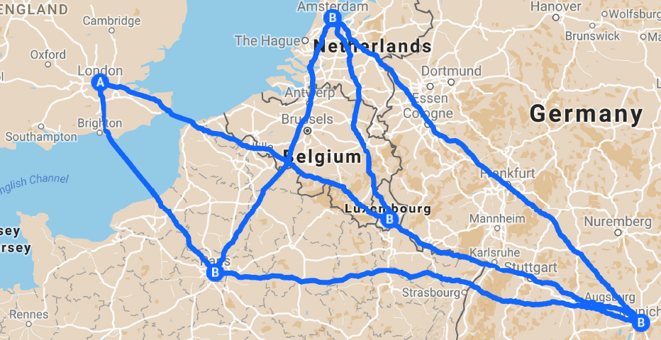

.. _opt_example_nl_tsp:

=====================
Traveling Salesperson
=====================

This example demonstrates the most basic use of a 
`Leap <https://cloud.dwavesys.com/leap/>`_ hybrid solver on a problem formulated 
as a :ref:`nonlinear model <nl_model_sdk>`. For more advanced solver usage, see 
the :ref:`example_nl_cvrp` example; for information on formulating problems as
nonlinear models, see the :ref:`dwave-optimization <intro_optimization>` package.

The goal of renowned 
`traveling salesperson <https://en.wikipedia.org/wiki/Travelling_salesman_problem>`_ 
optimization problem is, for a given a list of cities and distances 
between each pair of cities, to find the shortest possible route that visits 
each city exactly once and returns to the city of origin. 

.. |copy| unicode:: U+000A9 .. COPYRIGHT SIGN

    Traveling-salesperson problem. Map data |copy| 2017 GeoBasis-DE/BKG (|copy| 2009), Google.

Example Requirements
====================

.. include:: ../shared/examples.rst
    :start-after: start_requirements
    :end-before: end_requirements

Solution Steps
==============

.. |workflow_section| replace:: :ref:`opt_workflow`

.. include:: ../shared/examples.rst
    :start-after: start_standard_steps
    :end-before: end_standard_steps

This example formulates this problem as a :ref:`nonlinear model <nl_model_sdk>`
and uses the :class:`~dwave.system.samplers.LeapHybridNLSampler` to find good
solutions.

Formulate the Problem
=====================

First, create a matrix of distances between all pairs of the problem's 
destinations. In real-world problems, such a matrix can be generated 
from an application with access to an online map. Here a matrix of approximate 
driving distances between five Italian cities is created with the following 
index order: 0: Rome, 1: Turin, 2: Naples, 3: Milan, and 4: Genoa.

>>> DISTANCE_MATRIX = [
...     [0, 656, 227, 578, 489],
...     [656, 0, 889, 141, 170],
...     [227, 889, 0, 773, 705],
...     [578, 141, 773, 0, 161],
...     [489, 170, 705, 161, 0]]

For example, the distance between Turin (row 1) and Milan (column 3) is about 
141 kilometers. Note that such a distance matrix is symmetric because the 
distance between Rome to Turin is the same regardless of the direction of 
travel.

This example uses one of Ocean software's model generators to instantiate a 
:class:`~dwave.optimization.model.Model` class for a traveling-salesperson problem. 
The :class:`~dwave.optimization.model.Model` class encodes all the information 
(:term:`objective function`, constraints, constants, and decision variables) 
relevant to your models. 

>>> from dwave.optimization.generators import traveling_salesperson
>>> model = traveling_salesperson(distance_matrix=DISTANCE_MATRIX)

For detailed information on how the traveling-salesperson problem is modelled, 
see the documentation for the 
:class:`~dwave.optimization.generators.traveling_salesperson` generator. 

Solve the Problem by Sampling
=============================

D-Wave's quantum cloud service provides cloud-based
:std:doc:`hybrid solvers <sysdocs_gettingstarted:doc_leap_hybrid>` you can
submit quadratic and nonlinear models to. These solvers, which implement 
state-of-the-art classical algorithms together with intelligent allocation 
of the quantum processing unit (QPU) to parts of the problem where it benefits 
most, are designed to accommodate even very large problems. Leap's solvers can
relieve you of the burden of any current and future development and optimization
of hybrid algorithms that best solve your problem.

Ocean software's :doc:`dwave-system </docs_system/sdk_index>`
:class:`~dwave.system.samplers.LeapHybridNLSampler` class enables you to
easily incorporate Leap's hybrid nonlinear-model solvers into your application:

>>> from dwave.system import LeapHybridNLSampler
>>> sampler = LeapHybridNLSampler()                  # doctest: +SKIP

Submit the model to the selected solver. 

>>> results = sampler.sample(
...     model,
...     label='SDK Examples - TSP')  	# doctest: +SKIP

The 
:class:`~dwave.optimization.generators.traveling_salesperson` generator
constructs a model with a single decision variable to represent the 
itinerary; the code below iterates through the model's decision 
variables, in effect retrieving the variable used by the model to 
represent the itinerary. It prints the first state set by the solver,
which represents an assigned travel order for the five Italian cities
(Milan, Rome, Naples, Turin, Genoa). 

>>> route, = model.iter_decisions()     # doctest: +SKIP
>>> print(route.state(0))               # doctest: +SKIP
[3. 0. 2. 1. 4.]   

For more advanced usage of the results returned by the solver, see 
the :ref:`example_nl_cvrp` example
