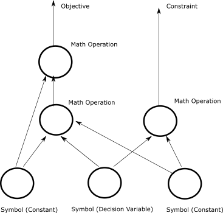
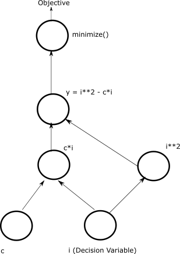
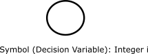
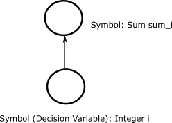
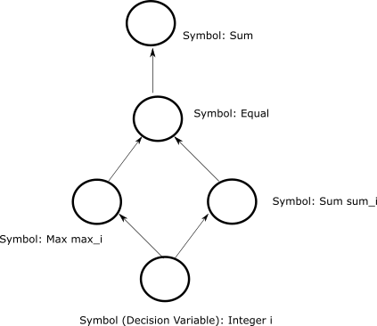
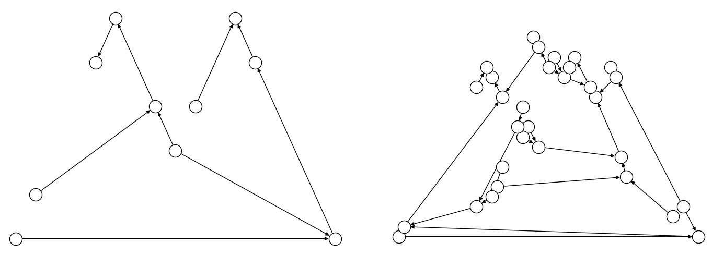
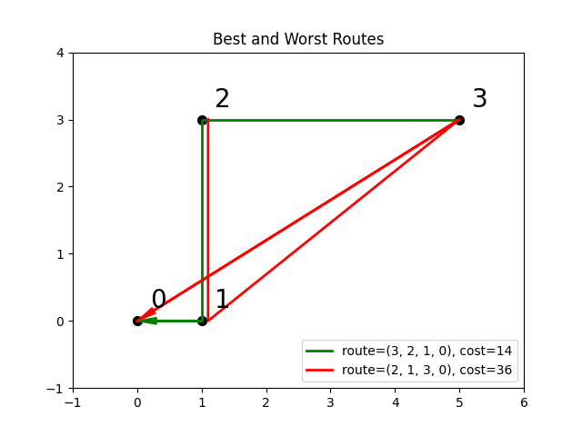

.. _opt_model_construction_nl:

=====================================
Model Construction (Nonlinear Models)
=====================================

Introduction
============

`Nonlinear programming (NLP) <https://en.wikipedia.org/wiki/Nonlinear_programming>`_ 
is the process of solving an optimization problem where some of the constraints 
are not linear equalities and/or the objective function is not a linear function. 
Such optimization problems are pervasive in business and logistics: inventory 
management, scheduling employees, equipment delivery, and many more. 

.. _intro_optimization_nonlinear_models: 

Nonlinear Models
================

`dwave-optimization` enables you to formulate the nonlinear models needed for 
such industrial optimization problems. The model can then be submitted to the
`Leap <https://cloud.dwavesys.com/leap/>`_\ |TM| service's quantum-classical 
hybrid nonlinear-program solver to find good solutions.

Examples of problems suited to such solution methods are resource routing,
scheduling, allocation, and job-shop scheduling.  

Successful implementation, as for any solver, requires following some 
:ref:`best practices <intro_optimization_usage_guidelines>` in formulating 
your model.  

.. _intro_optimization_symbols: 

Symbols
-------

Nonlinear models can be mapped to a 
`directed acyclic graph <https://en.wikipedia.org/wiki/Directed_acyclic_graph>`_. 
The model's symbols---decision variables, intermediate variables, constants, 
and mathematical operations---are represented as nodes in the graph while the 
flow of operations upon these symbols are represented as the graph's edges.

        representing symbols connected by directional lines with arrowheads.
    :align: center
    :scale: 100%

    A nonlinear model as a directed acyclic graph.

Consider an illustrative problem of finding the minimum of a function of an 
integer variable, the polynomial :math:`y = i^2 - 4i`. 

.. figure:: ../_images/simple_polynomial_minimization.png
    :name: simplePolynomialMinimization
    :alt: Plot of :math:`y = i^2 - 4i` with the x-axis from about -2 to +3 and 
        the y-axis from -5 to +5, showing a parabola with its minimum at 
        (i,y) of (+2,-4).
    :align: center
    :scale: 100%

    Minimum point of a simple polynomial, :math:`y = i^2 - 4i`. 

The `dwave-optimization` package can formulate the problem as nonlinear model 
as follows:

>>> from dwave.optimization import Model
...
>>> model = Model()
>>> i = model.integer(lower_bound=-5, upper_bound=5)
>>> c = model.constant(4)
>>> y = i**2 - c*i
>>> model.minimize(y)      

The code above has the following elements:

*   :code:`i` is a :class:`~dwave.optimization.symbols.IntegerVariable`  
    symbol, typically constructed with the 
    :meth:`~dwave.optimization.model.Model.integer` method, that represents 
    a single integer of values between :math:`-5` and :math:`+5`. It is a 
    decision variable: to find the minimum of the polynomial, 
    a :term:`solver` must assign values to decision variable :code:`i` such that 
    the objective function of this model is minimized.  
*   :code:`c` is a :class:`~dwave.optimization.symbols.Constant` 
    symbol that represents a single invariable value, :math:`4`, which is 
    the linear coefficient multiplying :math:`i` in the polynomial. This type 
    of symbol is used as input to mathematical operations but its value is never 
    updated by a solver.   
*   :code:`y` is an intermediate symbol used for convenience to formulate 
    the model in a human-readable way. It is fully determined by other 
    symbols---the :code:`i` and :code:`c` symbols---and so implicitly constrained.
    A solver must update :code:`y` if it updates :code:`i`, to a value fully 
    determined by the value it selected to assign to :code:`i`.  
*   The :class:`~dwave.optimization.symbols.Min` symbol is a 
    mathematical operation on inputs from other symbols. In this model, it 
    generates the objective function. 

The directed acyclic graph below illustratively represents the model for 
minimizing polynomial :math:`y = i^2 - 4i`.

        are the :math:`i` and :math:`c` symbols, which connect into :math:`i*i` and
        :math:`c*i` symbols, which then connect to a :math:`y = i*i -c*i` symbol, 
        which connects to a :code:`minimize()` symbol that outputs the objective.  
    :align: center
    :scale: 100%

    An directed acyclic graph that illustrates one way of representing the model 
    for minimizing polynomial :math:`y = i^2 - 4i`. The package's 
    :meth:`~dwave.optimization.model.Model.to_networkx` method generates the 
    graph that actually represents the model.  

The package provides various :ref:`symbols <optimization_models>` that enable 
you to select those most suited to an efficient formulation of your model. 

.. _intro_optimization_states: 

States
------

States represent assignments of values to a symbol. For example, symbol 
:math:`k`, defined as an :class:`~dwave.optimization.symbols.IntegerVariable` 
of size :math:`2 \times 3`, might have states ``[[1, 1, 2], [4, 5, 5]]`` and 
``[[1, 1, 3], [4, 5, 5]]``. Such states, which might be returned from a solver 
in response to a submission that requested two results, represent two assignments 
that differ in one element of the array (element :math:`j_{0,2}`), as is typical 
at the end of an iterative solution process. 

The solutions to nonlinear models you submit to a Leap hybrid nonlinear-program 
solver are states of the model's decision variables. For example, the state of 
symbol :code:`i` in the model above for the simple polynomial, :math:`y = i^2 - 4i`.

The `dwave-optimization` package enables you to set the states of symbols in a 
model. You can sets states for two purposes:

*   Setting initial states for the solver. For some problems you might have 
    estimates or guesses of solutions, and by providing to the solver, as part 
    of your problem submission, such assignments of decision variables as an 
    initial state of the model, you may accelerate the solution.    
*   Testing and developing your models. 

The following code sets states for the :code:`i` decision variable
of the model formulated above for the simple polynomial: for states 0 to 4, it 
assigns values 0 to 4. It then prints the resulting value of the model's objective 
function for each state.  

>>> with model.lock():
...     model.states.resize(5)
...     for j in range(5):
...         i.set_state(j, [j])
...     for j in range(5):
...         print(f"For state {j}, i={i.state(j)} results in objective {model.objective.state(j)}")
For state 0, i=0.0 results in objective 0.0
For state 1, i=1.0 results in objective -3.0
For state 2, i=2.0 results in objective -4.0
For state 3, i=3.0 results in objective -3.0
For state 4, i=4.0 results in objective 0.0

The code above selects a symbol by label ('``i``'); however, you can also set states 
for symbols of a model without using labels. 

>>> with model.lock():
...     for symbol in model.iter_decisions():
...         symbol.set_state(0, [2])
...     assert model.objective.state(0) == -4

This process of iterating through a model to select symbols of various types 
(decision variables, constraints, etc) is helpful when model construction is 
separated from model-instance solution, for example in application code or 
when using the package's :ref:`model generators <optimization_generators>`. 

.. _intro_optimization_constructing_models: 

Constructing Models
===================

Typically, you construct your model by instantiating decision-variable symbols
("primitives"), using such model methods as :meth:`~dwave.optimization.model.Model.integer`
and :meth:`~dwave.optimization.model.Model.disjoint_lists`, and constants
(:meth:`~dwave.optimization.model.Model.constant`).

The example below, uses the :meth:`~dwave.optimization.model.Model.integer`
method to instantiate an :class:`~dwave.optimization.symbols.IntegerVariable`
symbol.

>>> from dwave.optimization import Model
...
>>> model = Model()
>>> i = model.integer(100, lower_bound=0, upper_bound=20)

These decision-variable and constant symbols form the "root" of the directed 
acyclic graph.

        is the :math:`i` symbol.  
    :align: center
    :scale: 100%

    An directed acyclic graph that shows a single primitive, decision variable 
    :math:`i`, an :class:`~dwave.optimization.symbols.IntegerVariable`.

Operations on these symbols, create new symbols, which form the model's
full directed acyclic graph. The :class:`~dwave.optimization.symbols.Sum`
symbol, for example, sums the 100 integer elements of the 
:math:`1 \times 100`-shaped :class:`~dwave.optimization.symbols.IntegerVariable`
:math:`i`.

>>> sum_i = i.sum()

        is the :math:`i` symbol and the top one is :math:`sum_i`.  
    :align: center
    :scale: 100%

    An directed acyclic graph that shows a primitive, decision variable 
    :math:`i`, an :class:`~dwave.optimization.symbols.IntegerVariable`, 
    and :math:`sum_i`, a :class:`~dwave.optimization.symbols.Sum` symbol.

You can access these symbols by iterating on the model's symbols.

>>> with model.lock():
...     for symbol in model.iter_symbols():
...         print(f"Symbol {type(symbol)} is node {symbol.topological_index()}")
Symbol <class 'dwave.optimization.symbols.IntegerVariable'> is node 0
Symbol <class 'dwave.optimization.symbols.Sum'> is node 1

Typically, you add symbols to the model through mathematical operations
between symbols. The code below adds a symbol that checks that only one
of the 100 values assigned to symbol :math:`i` is a nonzero positive 
integer. 

>>> max_i = i.max()
>>> one_nozero = (sum_i == max_i).sum()

        is the :math:`i` symbol, next are MAx and Sum circles, and then Equal, 
        and the top circle is SUM.  
    :align: center
    :scale: 100%

    An directed acyclic graph that shows a primitive, decision variable 
    :math:`i`, an :class:`~dwave.optimization.symbols.IntegerVariable`, 
    and additional mathematical-operation symbols.

>>> symbols = {}
>>> one_one = 100*[0]
>>> with model.lock():
...     for symbol in model.iter_symbols():
...         symbols[symbol.topological_index()] = symbol
...     last_symbol = max(symbols.keys())
...     model.states.resize(1)
...     one_one[15] = 1
...     symbols[0].set_state(0, one_one)
...     print(symbols[last_symbol].state(0) == True)
...     one_one[25] = 1
...     symbols[0].set_state(0, one_one)
...     print(symbols[last_symbol].state(0) == False)
True
True

.. _intro_optimization_usage_guidelines:

Constructing Good Models 
======================== 

As much as possible, design models along these lines:

1.  Use compact matrix operations in your formulations.

    The `dwave-optimization` package enables you to formulate models 
    using linear-algebra conventions similar to `NumPy <https://numpy.org/>`_. 
    Compact matrix formulation are usually more efficient and should be preferred. 

2.  Exploit the implicit constraints of symbols such as 
    :class:`~dwave.optimization.symbols.ListVariable`, 
    :class:`~dwave.optimization.symbols.SetVariable`,
    :class:`~dwave.optimization.symbols.DisjointLists`,
    and :class:`~dwave.optimization.symbols.DisjointBitSets`.

    Typically, solver performance strongly depends on the size of the solution
    space for your modelled problem: models with smaller spaces of feasible 
    solutions tend to perform better than ones with larger spaces. A powerful 
    way to reduce the feasible-solutions space is by using variables that act 
    as implicit constraints. This is analogous to judicious typing of a variable 
    to meet but not exceed its required assignments: a Boolean variable, ``x``, 
    has a solution space of size 2 (:math:`\{True, False\}`) while a 
    finite-precision integer variable, ``i``, might have a solution space of 
    several billion values. 

See the formulations used by the package's 
:ref:`model generators <optimization_generators>` and relevant 
`GitHub examples <https://github.com/dwave-examples>`_ for reference.

Example: Compact Matrix Formulation 
-----------------------------------

Like a large class of real-world problems, optimally loading a truck to 
convey the most valuable merchandise while not exceeding limitations on 
carrying weight or allowable volume, can be considered a variation on 
the well-known 
`knapsack optimization problem <https://en.wikipedia.org/wiki/Knapsack_problem>`_. 
The problem is to maximize the total value of items packed in a knapsack 
without exceeding its capacity. 

Such real-world problems, when formulated mathematically for automated solution, 
typically include a data-transformation step that provides the weights and values 
of the problem's items in some structure. Here, an illustrative problem of just 
four items is modeled, with weights and values :math:`30, 10, 40, 20` and 
:math:`10, 20, 30, 40`, respectively, and a maximum capacity of :math:`30` for 
the truck.

For a practical formulation of the knapsack problem, see the code in the 
:class:`~dwave.optimization.generators.knapsack` generator.

This example compares two formulations of a small truck-loading problem: an 
intuitive model that represents multiple binary decisions with multiple binary 
symbols etc. versus a more compact model. The figure below compares the directed 
acyclic graphs for these two formulations.

        nodes while the right one has thirty nodes.  
    :align: center
    :scale: 80%

    Comparison between models using compact matrix operations (left) and 
    less-compact operations (right) in formulation. The less-compact formulation 
    has triple the number of symbols. Graphs are created using the package's 
    :meth:`~dwave.optimization.model.Model.to_networkx` method.  

The two tabs below provide the two formulations. 
 
.. tab-set::

    .. tab-item:: Compact Formulation  

        The model in this tab is formulated using compact matrix operations. 

        Instantiate a nonlinear model and add the constant symbols. 

        >>> model = Model()
        >>> weight = model.constant([30, 10, 40, 20])
        >>> value = model.constant([10, 20, 30, 40])
        >>> capacity = model.constant(30)
        
        Add a binary-array variable for the items: which items should be 
        selected for loading into the truck.
        
        >>> items = model.binary(4) 

        Add a constraint that the total weight must not exceed the truck's
        capacity.

        >>> total_weight = items * weight 
        >>> model.add_constraint(total_weight.sum() <= capacity) # doctest: +ELLIPSIS
        <dwave.optimization.symbols.LessEqual at ...>

        Add the objective (transport as much valuable merchandise as possible):

        >>> total_value = items * value
        >>> model.minimize(-total_value.sum())

        The size of this model is a third of the alternative formulation
        shown in the second tab:

        >>> model.num_nodes()
        10

    .. tab-item:: Non-compact Formulation

        The model in this tab is formulated using one binary decision variable 
        per item. Each variable and constant adds a node to the directed 
        acyclic graph.
        
        Instantiate a nonlinear model and add the constant symbols. The weight 
        and value of each item is represented by a symbol.

        >>> model = Model()
        >>> weight0 = model.constant(30) 
        >>> weight1 = model.constant(10)
        >>> weight2 = model.constant(40)
        >>> weight3 = model.constant(20)
        >>> val0 = model.constant(10) 
        >>> val1 = model.constant(20)
        >>> val2 = model.constant(30)
        >>> val3 = model.constant(40)
        >>> capacity = model.constant(30)
        
        Add a binary variable for each item: should that item be loaded into 
        the truck (yes or no?).
        
        >>> item0 = model.binary() 
        >>> item1 = model.binary()
        >>> item2 = model.binary()
        >>> item3 = model.binary()

        Add the constraint on the total weight:

        >>> total_weight = item0*weight0 + item1*weight1 + item2*weight2 + item3*weight3
        >>> model.add_constraint(total_weight <= capacity) # doctest: +ELLIPSIS
        <dwave.optimization.symbols.LessEqual at ...>

        Add the objective to maximize the transported value:

        >>> total_value = item0*val0 + item1*val1 + item2*val2 + item3*val3
        >>> model.minimize(-total_value)

        The size of this model is triple the alternative formulation
        shown in the first tab:

        >>> model.num_nodes()
        29

Compare the two formulations. Prefer compact-matrix formulations for 
your models. 

Example: Implicitly Constrained Symbols 
---------------------------------------

Consider a problem of selecting a route for several destinations 
with the cost increasing on each leg of the itinerary; for the 
example formulated below, one can travel through four destinations 
in any order, one destination per day, with the transportation cost 
per unit of travel doubling every subsequent day.

The figure below shows four destinations as dots labeled ``0`` to
``3``, and plots the least costly (green) and most costly (red) 
routes.

          the least costly while the red one, (2, 1, 3, 0), is the most costly.  
    :align: center
    :scale: 80%

    Finding the optimal route between destinations.

The code snippet below defines the cost per leg and the distances 
between the four destinations, with values chosen for simple illustration. 

>>> import numpy as np
...
>>> cost_per_day = [1, 2, 4]
>>> distance_matrix = np.asarray([
...     [0, 1, np.sqrt(10), np.sqrt(34)], 
...     [1, 0, 3, np.sqrt(25)], 
...     [np.sqrt(10), 3, 0, 4], 
...     [np.sqrt(34), np.sqrt(25), 4, 0]])

This section compares two formulations of this small routing problem: an 
intuitive model that uses the generic 
:class:`~dwave.optimization.symbols.BinaryVariable` symbol to represent decisions
on ordering the destinations versus a model that uses the implicitly constrained
:class:`~dwave.optimization.symbols.ListVariable` symbol, where the order of 
destinations is a permutation of values. The figure below compares the directed 
acyclic graphs for these two formulations.

.. figure:: ../_images/route_models.png
    :name: RouteModels
    :alt: Illustrative directed acyclic graph of two models. The left graph has 
        far fewer nodes than that one the right.  
    :align: center
    :scale: 100%

    Comparison between models using implicitly-constrained decision symbol (left) 
    and explicit constrains on a simple binary symbol (right) in formulation. The 
    first formulation has fewer symbols.    

It is expected that the more compact model that uses implicit constraints 
will perform better. 

The two tabs below provide the two formulations. 
 
.. tab-set::

    .. tab-item:: Implicit Constraints  

        The model in this tab is formulated using the implicitly 
        constrained :class:`~dwave.optimization.symbols.List` symbol. 
 
        >>> model = Model()
        >>> # Add the constants
        >>> cost = model.constant(cost_per_day)
        >>> distances = model.constant(distance_matrix)
        >>> # Add the decision symbol
        >>> route = model.list(4)
        >>> # Optimize the objective
        >>> model.minimize((cost * distances[route[:-1],route[1:]]).sum())

        You can see the objective values for the least and most costly routes 
        as permutations of the :math:`[0, 1, 2, 3]` list as follows:

        >>> with model.lock():
        ...     model.states.resize(2)
        ...     route.set_state(0, [3, 2, 1, 0])
        ...     route.set_state(1, [2, 1, 3, 0])
        ...     print(int(model.objective.state(0)), int(model.objective.state(1)))
        14 36

    .. tab-item:: Explicit Constraints  

        The model in this tab is formulated using explicit constraints on the
        generic :class:`~dwave.optimization.symbols.BinaryVariable` symbol. 
        
        >>> from dwave.optimization.mathematical import add 
        ...
        >>> model = Model()
        >>> # Add the problem constants
        >>> cost = model.constant(cost_per_day)
        >>> distances = model.constant(distance_matrix)

        Define constants that are used to formulate the explicit constraints.

        >>> one = model.constant(1)
        >>> indx_int = model.constant([0, 1, 2, 3])

        Add the decision symbol: for each of the itinerary's four legs, each 
        of the four destinations is represented by a binary variable. If leg 
        1 should be to destination 2, for example, the value of row 1 is
        :math:`False, False, True, False`. This is a representation known as 
        `one-hot encoding <https://en.wikipedia.org/wiki/One-hot>`_. 

        >>> itinerary_loc = model.binary((4, 4))

        Add the objective. Here, the :code:`indx_int` constant converts 
        the binary one-hot variables to an index of the distance matrix. 

        >>> model.minimize(add(*(
        ...     (itinerary_loc[u, pos] * itinerary_loc[v, (pos + 1) % 4] * distances[u, v] +
        ...     itinerary_loc[v, pos] * itinerary_loc[u, (pos + 1) % 4] * distances[v, u]) *
        ...     cost[pos]
        ...     for u in range(4)
        ...     for v in range(u+1, 4)
        ...     for pos in range(3)
        ... )))

        Add explicit one-hot constraints: summing the columns of the 
        decision variable must give ones because each destination is
        visited once; summing rows must give ones because each leg
        visits one destination.

        >>> for i in range(distances.shape()[0]):
        ...     model.add_constraint(itinerary_loc[i, :].sum() <= one)
        ...     model.add_constraint(one <= itinerary_loc[i,:].sum())
        ...     model.add_constraint(itinerary_loc[:, i].sum() <= one)
        ...     model.add_constraint(one <= itinerary_loc[:, i].sum()) # doctest: +ELLIPSIS
        <dwave.optimization.symbols.LessEqual at ...>
        ...

        You can see the objective cost for the least costly route 
        as follows:

        >>> with model.lock():
        ...     model.states.resize(2)
        ...     itinerary_loc.set_state(0, [ 
        ...         [0, 0, 0, 1], 
        ...         [0, 0, 1, 0], 
        ...         [0, 1, 0, 0],
        ...         [1, 0, 0, 0]])
        ...     print(int(model.objective.state(0)))
        14

The directed acyclic graph for the implicitly constrained model has few nodes 
and the model is more efficient.
