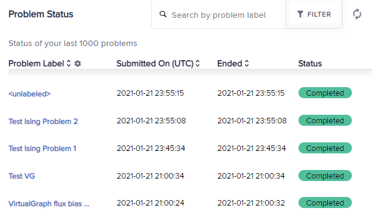

.. _opt_solver_cqm_parameters:

=====================
CQM Solver Parameters
=====================

This section describes the parameters of quantum-classical hybrid
:ref:`constrained quadratic model <concept_models_cqm>` solvers such as the Leap
service's ``hybrid_constrained_quadratic_model_version1``. For the properties
that inform and restrict your use of the solver, see the
:ref:`opt_solver_cqm_properties` section.

.. _parameter_cqm_cqm:

cqm
===

Ocean software's :class:`dimod.ConstrainedQuadraticModel` (CQM) contains linear
and quadratic biases for problems formulated as
:ref:`constrained quadratic models <concept_models_cqm>` as well as additional
information such as variable labels, offsets, and equality and inequality
constraints.

Relevant Properties
-------------------

*   :ref:`property_cqm_maximum_number_of_variables` defines the
    maximum number of problem variables for hybrid solvers.
*   :ref:`property_cqm_maximum_number_of_biases` and
    :ref:`property_cqm_maximum_number_of_quadratic_variables`
    define the maximum number of problem biases for hybrid solvers.
*   :ref:`property_cqm_maximum_number_of_constraints` defines the maximum number
    of constraints accepted by the solver.
*   :ref:`property_cqm_minimum_time_limit_s` and
    :ref:`property_cqm_maximum_time_limit_hrs` define the runtime duration for
    hybrid solvers.
*   :ref:`property_cqm_num_biases_multiplier`,
    :ref:`property_cqm_num_constraints_multiplier`, and
    :ref:`property_cqm_num_variables_multiplier` define multipliers used in the
    internal calculation of the default run time for a given problem.

Example
-------

This example creates a single-constraint CQM and submits it to a CQM solver.

>>> from dimod import ConstrainedQuadraticModel, Binary
>>> from dwave.system import LeapHybridCQMSampler
...
>>> cqm = ConstrainedQuadraticModel()
>>> x = Binary('x')
>>> cqm.add_constraint_from_model(x, '>=', 0, 'Min x')
'Min x'
>>> sampleset = LeapHybridCQMSampler().sample_cqm(cqm)  # doctest: +SKIP

.. _parameter_cqm_label:

label
=====

.. include:: ../shared/parameters.rst
    :start-after: start_parameter_label
    :end-before: end_parameter_label

Example
-------

This example sets a label on a simple bin-packing problem submitted to a CQM
solver.

>>> from dimod.generators import bin_packing
>>> from dwave.system import LeapHybridCQMSampler
...
>>> cqm = bin_packing([3, 5, 1, 3], 7)
>>> sampleset = LeapHybridCQMSampler().sample_cqm(
...     cqm,
...     label="Simple example")     # doctest: +SKIP

    Problem labels on the dashboard.

.. _parameter_cqm_time_limit:

time_limit
==========

.. include:: ../shared/parameters.rst
    :start-after: start_parameter_time_limit
    :end-before: end_parameter_time_limit

Relevant Properties
-------------------

*   :ref:`property_cqm_minimum_time_limit_s` defines the minimum supported value
    for any given CQM problem. The specified :ref:`parameter_cqm_time_limit`
    cannot be lower than the smaller of this value and the calculated default
    runtime for the submitted problem.
*   For CQM solvers, :ref:`property_cqm_num_biases_multiplier`,
    :ref:`property_cqm_num_constraints_multiplier`, and
    :ref:`property_cqm_num_variables_multiplier` define multipliers used in the
    internal calculation of the default run time for a given problem. The
    specified :ref:`parameter_cqm_time_limit` cannot be lower than the smaller
    of the calculated default runtime for the submitted problem and
    :ref:`property_cqm_minimum_time_limit_s`.

Example
-------

This illustrative example configures a time limit of 6 seconds.

>>> from dimod.generators import bin_packing
>>> from dwave.system import LeapHybridCQMSampler
...
>>> cqm = bin_packing([3, 5, 1, 3], 7)
>>> sampleset = LeapHybridCQMSampler().sample_cqm(
...     cqm,
...     time_limit=6)   # doctest: +SKIP
