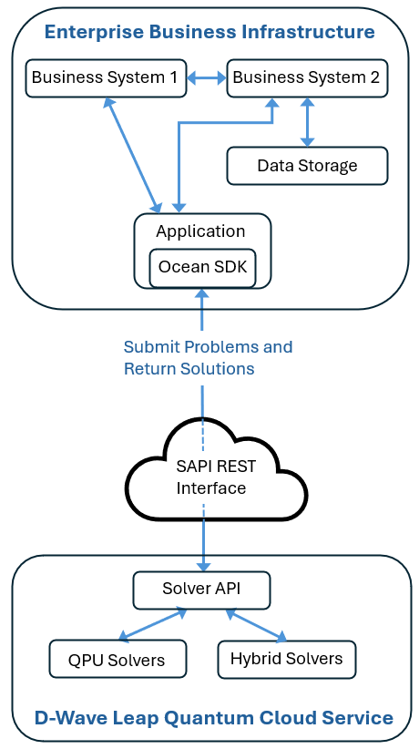
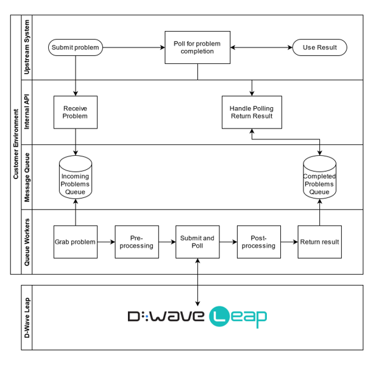

.. _opt_productizing_quantum_apps:

=========================
Productizing Applications
=========================

This section provides insight into successfully deploying your application to a
production environment.

Although production environments can vary widely between businesses, some common
components and processes can be identified as shown in
:numref:`Figure %s <QuantumAppProdArch>`. In fact, applications can be
easy to integrate into business operations in part because applications
typically run batch-based operations, submitting problems to and receiving
solutions from hybrid and quantum solvers via the Leap service. While both your
business case and production environment can dictate the design and implementation
of the production application you build, a service-oriented architecture can be
an optimal solution for many enterprise businesses; thus, the production
environment and application design described in this section are based on such
an architecture.

.. _quantum_apps_prod_env:

Production Environment
======================

A production environment that implements a service-oriented architecture can
include microservices. :numref:`Figure %s <QuantumAppProdArch>` shows how a
microservice can be designed to act as an intermediary between various business
systems and D-Wave's compute infrastructure, made available via the solver
API and the Leap quantum cloud service. To communicate with D-Wave's hybrid and
quantum solvers, a microservice uses D-Wave's Ocean SDK, which is Python-based
and open source; in this context, the Ocean SDK manages submitting problems to
and receiving solutions from hybrid and quantum solvers. ``Business System 1``,
``Business System 2``, and ``Date Storage`` represent business systems,
including, but not limited to, enterprise content development systems
(e.g., Microsoft Sharepoint) and database management systems.

    Quantum-application infrastructure in production.

.. _quantum_apps_microservice_design:

Microservice Design
===================

A microservice integrated with the Ocean SDK can provide the capability to
handle large-scale, long-running hybrid jobs in a heterogeneous,
service-oriented architecture typical of many enterprise businesses.
A microservice provides the following benefits for running hybrid jobs:

*   Run long jobs. Hybrid problems can be configured to run
    for a few seconds or several hours.

*   Manage job requests in a reliable, industrial-grade queue,
    such as Redis, RabbitMQ, Amazon Elasticache, SQS, Kinesis, and so forth.

*   Horizontally scale queue workers to perform required preprocessing,
    retrieve additional data from datastores, transform the problem
    into the required format and upload it to a hybrid solver in the
    Leap service.

*   Easily keep up to date with Ocean SDK releases to help ensure the
    best performance and take advantage of new features.

:numref:`Figure %s <QuantumAppProdMicroserviceArch>` shows an example of a
microservice architecture.

          production

    Microservice architecture for a quantum-application architecture in
    production.

In :numref:`Figure %s <QuantumAppProdMicroserviceArch>`, queue workers grab
problems off a queue of incoming problems. Each worker handles the following:

*   Preprocessing, which could include retrieving additional data from databases,
    handling problem formulation, and storing the formulated problem.

*   Submitting the job and polling the hybrid solver for completion of the job.

*   Post-processing, which could include unpacking the solution, sending
    solution to other business systems for further processing, sending
    notifications.
    
.. _quantum_apps_performance_sizing:

Performance and Sizing
======================

Some performance and sizing requirements to consider are the following:

*   Initial desired throughput (i.e., solved problems per second).

*   Latency, size, and bandwidth for hybrid problems.

*   Problem size can range from about 10 MB to greater than 1 GB.

*   Asynchronous processing because potentially long runtimes can be requested.

.. _quantum_apps_security:

Security
========

In addition to implementing best practices for security and access control,
you should also consider the following best practices specific to interacting
with the D-Wave compute infrastructure:

*   Use a minimum-permission model for allowing the microservice access to
    sensitive data, such as personally identifiable information (PII).

*   Ensure that access control to the microservice for submitting problems is
    limited to authorized users.

*   Keep your Leap API token secure as follows:

    *   Do not hardcode your API token into your microservice.

    *   Store your API token in a secure location and do not write it logs.

    *   Generate a new API token on a regular basis. 

.. _quantum_apps_prod_monitoring_metrics:

Monitoring and Logging
======================

The microservice should log metrics, including problem IDs, timestamps,
source, and timing information. A problem ID uniquely identifies each problem
and can be used to track your submissions and troubleshoot issues
Logging as much metadata as is reasonably possible could help make
troubleshooting easier. Also, consider investing in structured logging solutions,
such as Elasticsearch, Datadog, Splunk, and so forth.

Consider building a dashboard to show important metrics, such as hybrid solver
usage, to your stakeholders.