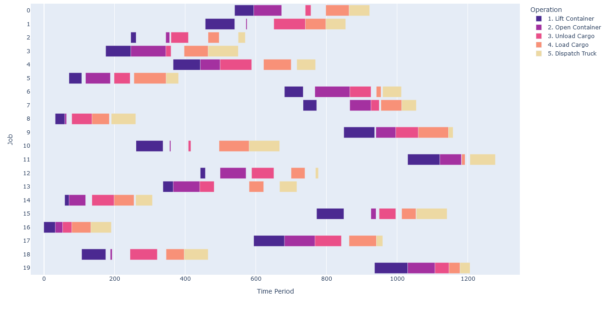
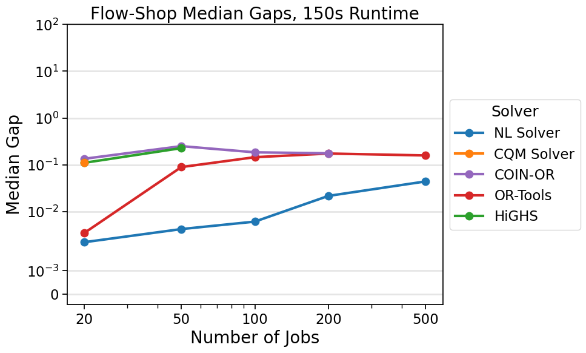

.. _opt_vignette_fss:

====================
Flow-Shop Scheduling
====================

`Flow-shop scheduling <https://en.wikipedia.org/wiki/Flow-shop_scheduling>`_
(FSS) is an optimization challenge that involves organizing a set of jobs that
need to be processed through multiple machines in a specific order. This type of
scheduling is important in manufacturing and production environments, where
operators are pressed to efficiently manage the workflow by optimizing the time
it takes to complete each job and thus maintain a smooth and linear progression
through the production line.

Specifically, in the FSS problem, a set of :math:`n` jobs each having :math:`m`
tasks must run in order on :math:`m` machines; for example, see
:numref:`Figure %s <vignetteFssGraphic>`. The order of the jobs must be
consistent across all machines. The goal is to find a permutation of the jobs
that minimizes the overall `makespan <https://en.wikipedia.org/wiki/Makespan>`_
(that is, the finish time).

This study shows how the optimization of flow-shop scheduling using D-Wave's
hybrid nonlinear-program solver (NL solver) improves this process, with the goal
of driving operational efficiencies. This study includes performance benchmarks
of D-Wave's NL and :term:`CQM` solvers as well as COIN-OR, OR-Tools, and SciPy's
HiGHS.

    An example of flow-shop scheduling.

Mathematical Models
===================

This section discusses the various mathematical models that were used in this
study.

Mixed Integer Linear Programming (MILP) Model
---------------------------------------------

For MILP solvers, the study uses the formulation provided by Manne [Man1960]_.
Job orders are represented by binary variables :math:`x_{ij}`. For each pair of
jobs :math:`i` and :math:`j`, the variable :math:`x_{ij}` is assigned a value of
1 if job :math:`i` is scheduled to be processed after job :math:`j`. If job
:math:`i` is not processed after job :math:`j`, then :math:`x_{ij}` is assigned
a value of 0. This binary system determines the sequence of job processing. Task
completion times are encoded by continuous variables. In the resulting
formulation, the number of binary variables is quadratic in the number of jobs,
and the number of continuous variables is equal to the number of jobs multiplied
by the number of tasks.

The assigned constraints ensure that the jobs do not overlap, and the order of
the jobs is respected across all machines. For each job, the number of
constraints is quadratic in the number of machines.

This formulation is used by the CQM solver, COIN-OR's Pulp CBC CMD solver, and
SciPy's HiGHS.

OR-Tools CP-SAT Solver
----------------------

OR-Tools defines an FSS formulation that fits their API where task processing
times are passed as an :math:`n\times m` matrix.

Nonlinear Solver Model 
---------------------------

D-Wave's NL solver can efficiently encode an FSS problem by taking advantage of
a list variable (:class:`~dwave.optimization.symbols.ListVariable`) that encodes
an ordering of the jobs. This variable eliminates the need for both the
quadratic number of binary variables representing job orders and constraints
preserving job order for the MILP formulation. The array of processing times
is converted to a constant variable from which the task end times are computed.
As a result, there is no need to encode constraints that prevent the jobs from
overlapping.

The relevant Python code is as follows:

.. testsetup::

    processing_times = [[10, 5, 7], [20, 10, 15]]
    num_jobs = 3
    num_machines = 2

.. testcode::

    from dwave.optimization import Model
    from dwave.optimization.mathematical import maximum

    model = Model()

    # Add the constant processing-times matrix
    times = model.constant(processing_times)

    # The decision symbol is a num_jobs-long array of integer variables
    order = model.list(num_jobs)
    end_times = []

    for machine_m in range(num_machines):
        machine_m_times = []
        if machine_m == 0:
            for job_j in range(num_jobs):
                if job_j == 0:
                    machine_m_times.append(times[machine_m, :][order[job_j]])
                else:
                    end_job_j = times[machine_m, :][order[job_j]]
                    end_job_j += machine_m_times[-1]
                    machine_m_times.append(end_job_j)
        else:
            for job_j in range(num_jobs):
                if job_j == 0:
                    end_job_j = end_times[machine_m - 1][job_j]
                    end_job_j += times[machine_m, :][order[job_j]]
                    machine_m_times.append(end_job_j)
                else:
                    end_job_j = maximum(end_times[machine_m - 1][job_j], machine_m_times[-1])
                    end_job_j += times[machine_m, :][order[job_j]]
                    machine_m_times.append(end_job_j)
        end_times.append(machine_m_times)
    makespan = end_times[-1][-1]
    # The objective is to minimize the last end time
    model.minimize(makespan)
    cntx = model.lock()

This model is available via the 
:func:`~dwave.optimization.generators.flow_shop_scheduling` generator.

Results
=======

All problems were run with a time limit of 150 seconds.
Results are reported as optimality gaps (that is, (energy/best solution) - 1)
when feasible. Infeasible solutions correspond to infinite gaps in the median,
and if the median is infeasible, the data point is not shown in the plot. In
order to impose time limits on COIN-OR's solver, presolve techniques are turned
off. Presolve modifies the model by removing redundant equations, changing some
equations to bounds, and so forth without contributing to the time limit.

D-Wave's NL solver and CQM solver benchmarks were run on D-Wave's |cloud_tm|_
quantum cloud service. COIN-OR, OR-Tools, and HiGHS were run on an Intel Core
i9-7900X CPU @ 3.30GHz processor with 16GB RAM. The benchmarks for OR-Tools were
run with eight threads (the minimum number for parallel search), and the
remaining were run with a single thread. The instances run in this benchmark are
the set of Taillard FSS instances [Tai1993]_, which is an industry-standard
benchmarking testbed (for example, [Li2022]_, [Kar2022]_, [Mao2021]_).
These 120 instance files contain the processing times for each task, with
problem sizes ranging from 20 to 500 jobs on 5 to 20 machines. For each job
size, there are instances with 5, 10, and 20 machines, excluding 200 jobs
(having 10 and 20 machines) and 500 jobs (having 20 machines).

:numref:`Figure %s <vignetteFssLineplot>` shows the results on the Taillard FSS
instances with a time limit of 150 seconds. The plot displays the median gap
versus number of jobs for each solver. The complete study contains more time
limits, where the results are qualitatively the same, except for OR-Tools
obtaining optimality in the smallest instances with the largest time limit.
For each number of jobs with a 150-second runtime, D-Wave's NL solver
outperforms the other solvers.

    On FSS problems with 150 seconds of runtime, the median gap for solutions
    found by D-Wave's NL solver beats the median gaps found by all other solvers
    tested on all sizes available in the Taillard benchmarking library.
    