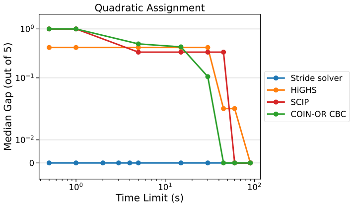
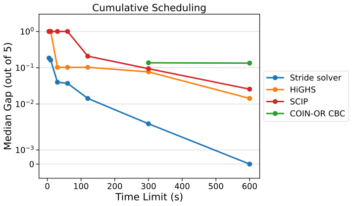
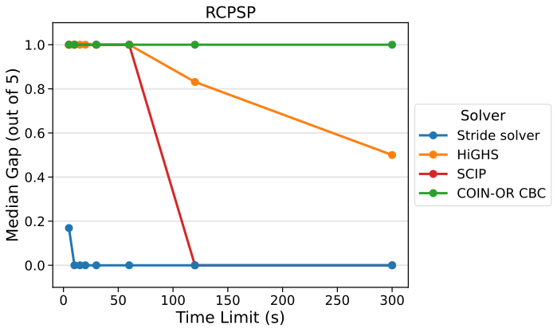

.. _opt_vignette_miplib:

=================
MIPLIB Benchmarks
=================

The `Mixed-Integer Programming Library (MIPLIB) <https://miplib.zib.de/>`_ is a collection of
problems used to compare the performance of mixed-integer
optimization solvers. Often these problems are highly nonlinear in
nature, but they are reformulated as linear programs for
solvers that do not have more extensive modeling capabilities.
This often results in a large number of auxiliary variables and
constraints, which can make the problem more difficult to solve.
The Stride solver can handle the nonlinear formulations of these problems
natively, and by taking advantage of combinatorial structures, it can
greatly reduce the search space to find better solutions in less time.

This section reformulates three mixed-integer programs (MIPs) from this library
as nonlinear models. The Stride solver demonstrates superior performance on
these nonlinear models compared to open-source MIP solvers on the original
linear formulations.

Quadratic Assignment
====================

The first problem is an instance of `quadratic assignment <https://en.wikipedia.org/wiki/Quadratic_assignment_problem>`_.
Given a set of locations and facilities, each with a set of flows (for
example, the amount of supplies transported) between each pair, the goal is to
determine the optimal placement of the facilities so that the sum of the flows
times the distances is minimized.

Model Formulation
-----------------

The problem instance is "qap10" from MIPLIB. The problem data (set of flows and
distances) is extracted from the file given knowledge of the model. The MIP
model has 4,150 binary variables. 100 of these variables, relabeled to
:math:`x_{ij}`, are equal to 1 if facility :math:`i` is in
location :math:`j` and 0 otherwise. Since the objective is naturally formulated
as a quadratic function, :math:`\sum_{i,j,k,l} F_{i,k} D_{j,l} x_{ij} x_{kl}`,
the other 4,050 variables are needed to linearize the model. This introduces
1,820 constraints. HiGHS, SCIP, and COIN-OR CBC CMD (with Pulp) were run by loading the
.mps file as a model.

The nonlinear formulation for the Stride solver
uses a list variable to represent the assignment of facilities to locations, i.e.,
in the state of the list variable, element :math:`i` is the location of facility
:math:`i`. Since every state of a list variable of length :math:`n` is a permutation
of the integers 0 through :math:`n-1`, every state gives a one-to-one matching
between facilities and locations. This means every state is feasible, eliminating
the need for constraints in the model. You can use the list variable to re-index the
rows and columns of the distance matrix so that the objective function is just a sum
over all entries of the product of the flow and re-indexed distance matrix.

Numpy arrays `flows` and `distances` are created from the data and added to the model as constants.

The Python code for the nonlinear model is as follows:

.. testsetup::

    import numpy as np

    flows = np.array([[0,5,10], [5,0,7], [10,7,0]])
    distances = np.array([[0,2,3], [2,0,4], [3,4,0]])

.. testcode::

    from dwave.optimization import Model

    model = Model()

    # Add the flow and distance numpy arrays as model constants
    F = model.constant(flows)
    D = model.constant(distances)

    # Create a list variable to encode facility placement
    n = distances.shape[0]
    x = model.list(n)

    # Minimize the sum of the flows times the distances
    model.minimize((F*D[x,:][:,x]).sum())

This model is available via the
:func:`~dwave.optimization.generators.quadratic_assignment` generator.

Results
-------

As is the case for all three problems in this study, performance is only reported
on a single instance. This is due to lack of availability of other problems in the same
class in MIPLIB and the fact that the data was extracted manually from each .mps file.
The problem was run five times for each solver and each time limit shown in the
figures. :numref:`Figure %s <vignetteMIPLIBQAP>` shows the
median gap out of the five runs for each time limit. D-Wave's Stride solver (version 1.33.0)
benchmarks were run on D-Wave's |cloud_tm|_ quantum cloud
service. The classical solvers were run on an AMD EPYC 9534
64-Core Processor @ 2.45 GHz with 128 GB of memory. Infeasible solutions
and gaps above 100% are reported as 1.0.

The optimal energy is 340, as reported by MIPLIB. The shortest runtime for which
results are shown in the plot is 0.5s, at which time the Stride solver finds the
optimal solution.

    D-Wave's Stride solver finds the optimal solution to "qap10" in 0.5 seconds.

For more results on the quadratic assignment problem, see the :ref:`opt_vignette_qap`
Performance Benchmark.

Cumulative Scheduling
=====================

The second problem is an instance of cumulative scheduling. There is a
given set of jobs to run on a machine with some processing capacity.
Each job has a machine utilization, processing time, release date, and
due date. The goal is to schedule the jobs on the machine so that the
sum of the delays (the differences between the start times and the release
times) is minimized, while not exceeding the processing capacity at any
given time.

Model Formulation
-----------------

The problem instance is "csched007" from MIPLIB and is given as an .mps
file. The formulation for the MIP uses binary variables, :math:`x_{ij}`, equal to
1 if job :math:`i` starts at time :math:`j` and 0 otherwise. It also uses continuous
variables for the delay times and machine utilizations.
HiGHS, SCIP, and COIN-OR's CBC CMD solver were run on the model with the .mps
file as input.

The nonlinear model for the Stride solver uses integer variables for
the start times of the jobs. The cumulative consumption is tracked with the
:class:`~dwave.optimization.symbols.AccumulateZip` symbol,
which adds the consumption of a job when it starts and subtracts it when it ends.
The objective function is the sum of the delays, which are given by the start times minus the
release times (the earliest possible starts).

The number of jobs, release dates, due dates, processing times, machine utilizations, and
processing capacity are extracted from the file with the knowledge of the model.
Numpy arrays `release_times`, `max_start_times`, `durations`, and `machine_uses` are
created from this data and added to the model as constants.

The Python code for the nonlinear model is as follows:

.. testsetup::

    import numpy as np

    num_jobs = 2
    release_times = np.array([0, 1])
    max_start_times = np.array([2, 3])
    durations = np.array([2, 2])
    machine_uses = np.array([2, 1])
    capacity = 3

.. testcode::

    from dwave.optimization import Model, symbols, expression
    from dwave.optimization.mathematical import concatenate, argsort

    model = Model()

    # use integer variables for start times
    # keep track of both start times and end times of jobs
    start_times = model.integer(num_jobs, release_times, max_start_times)
    # durations is a numpy array of values equal to the processing times minus 1
    durations = model.constant(durations)
    end_times = start_times + durations

    # need both machine_use for when a job starts and -machine_use for when a job ends
    event_consumption = model.constant(np.concatenate((machine_uses, -machine_uses)))
    # sort the event consumptions by the time they occur
    events = concatenate((start_times, end_times))
    order = argsort(events)
    order_events_consumption = event_consumption[order]

    # track the cumulative consumption, adding consumption when a job starts
    #  and subtracting when it ends
    @expression
    def add(x, y):
        return x + y
    cumulative_consumption = symbols.AccumulateZip(
        add, (order_events_consumption, ), initial=model.constant(0)
        )
    model.add_constraint((cumulative_consumption <= model.constant(capacity)).all())
    model.objective = sum(start_times[j] - release_times[j] for j in range(num_jobs))

Results
-------

The problem was run five times for each solver and each time limit shown in the
figures. :numref:`Figure %s <vignetteMIPLIBcsched>` shows the median gap out
of the five runs for each time limit. D-Wave's Stride solver (version 1.31.0)
benchmarks were run on D-Wave's |cloud|_ quantum cloud
service. The classical solvers were run on an AMD EPYC 9534
64-Core Processor @ 2.45 GHz with 128 GB of memory. The optimal energy is 351,
as reported by MIPLIB.

    D-Wave's Stride solver finds the best solution to "csched007" out of all solvers
    for all time limits.

Resource-Constrained Project Scheduling
=======================================

The third problem is an instance of resource-constrained project scheduling.
Here there is a given set of jobs that can be run in one of multiple modes, and each
job uses a certain amount of resources depending on that mode. The goal is to determine
start times for the jobs so that the maximum amount of each resource consumed at any
given time is minimized. There are also precedence constraints on the jobs.
All jobs must be completed within a fixed time horizon.

Model Formulation
-----------------

The problem instance from MIPLIB is "30n20b8" and is again given as an .mps file.
HiGHS, SCIP, and COIN-OR (with Pulp) were run by loading the .mps file as a model.

The Stride model formulation follows a pattern similar to that of cumulative
scheduling, using integer variables for start times and modes of the jobs, but
also for the maximum amount of each resource consumed over all time steps. It
adds precedence constraints and creates a set of events for each resource, which
is the start and end times of each job run in its selected mode. Again, it uses
the :class:`~dwave.optimization.symbols.AccumulateZip` symbol, here to determine
the cumulative consumption at each event, adding constraints to ensure the
consumption is less than or equal the integer decision variable for each
resource. The objective to minimize is a weighted sum of the maximum resource
consumptions.

The problem data, including runtimes, resource usage, time horizon, precedence
constraints, and bounds on job runtimes, is extracted from the file.
Numpy arrays `lower_bounds`, `upper_bounds`, `durations`, `machine_uses`,
`capacity`, `upper_bounds_modes`, `runtimes_matrix`, `rm_use_matrix`,
`rt_use_matrix` and list of tuples `precedence_pairs` are created from this
data and added to the model as constants.

The Python code for the nonlinear model is as follows:

.. testsetup::

    import numpy as np

    num_jobs = 2
    lower_bounds = np.array([0, 1])
    upper_bounds = np.array([2, 3])
    durations = np.array([2, 2])
    machine_uses = np.array([2, 1])
    capacity = 3
    upper_bounds_modes = np.array([1, 1])
    runtimes_matrix = np.array([[2, 2], [2, 2]])
    rm_use_matrix = np.array([[2, 2], [1, 1]])
    rt_use_matrix = np.array([[0, 0], [1, 1]])
    precedence_pairs = [(1, 2)]

.. testcode::

    from dwave.optimization import Model, put, symbols, expression
    from dwave.optimization.mathematical import concatenate, argsort

    model = Model()

    # use integer variables for the start times of the jobs
    starts = model.integer(num_jobs, lower_bound=lower_bounds, upper_bound=upper_bounds)

    # use integers for the modes of the jobs
    modes = model.integer(num_jobs, lower_bound=0, upper_bound=upper_bounds_modes)

    runtimes_mat_mod = runtimes_matrix - 1

    runtimes_matrix_c = model.constant(runtimes_matrix)
    runtimes_mat_mod_c = model.constant(runtimes_mat_mod)
    rm_use_matrix_c = model.constant(rm_use_matrix)
    rt_use_matrix_c = model.constant(rt_use_matrix)

    # create precedence constraints
    for (j1,j2) in precedence_pairs:
        model.add_constraint(starts[model.constant(j1-1)]
                            + runtimes_matrix_c[model.constant(j1-1),modes[model.constant(j1-1)]]
                            - starts[model.constant(j2-1)] <= 0)
    # create integer variables for the maximum amount of each resource consumed
    r_mechaniker = model.integer(1, lower_bound=0, upper_bound=40)
    r_techniker = model.integer(1, lower_bound=0, upper_bound=30)

    # get runtime for each job (depends on which mode it is in)
    runtimes = model.constant(np.zeros(num_jobs))
    for i in range(num_jobs):
        runtimes = put(runtimes, model.constant(i).reshape((1)), runtimes_mat_mod_c[i, modes[i]].reshape((1)))

    end_times = starts + runtimes

    # get total consumption (mechaniker and techniker)
    #  note that each job uses only one resource and not the other, so we can just sum over all jobs

    # concatenate the consumption with the negative consumption for start and end times
    m_consumption_pos = model.constant(np.zeros(num_jobs))
    t_consumption_pos = model.constant(np.zeros(num_jobs))
    # consumption depends on the mode a job runs in
    for i in range(num_jobs):
        m_consumption_pos = put(m_consumption_pos, indices = model.constant(i).reshape((1)),
            values = rm_use_matrix_c[i,modes[i]].reshape((1)))
        t_consumption_pos = put(t_consumption_pos, indices = model.constant(i).reshape((1)),
            values = rt_use_matrix_c[i, modes[i]].reshape((1)))

    m_consumption = concatenate((m_consumption_pos, -1*m_consumption_pos))
    t_consumption = concatenate((t_consumption_pos, -1*t_consumption_pos))

    events = concatenate((starts, end_times))
    order = argsort(events)
    order_events_consumption_m = m_consumption[order]
    order_events_consumption_t = t_consumption[order]

    # track the cumulative consumption, adding consumption when a job starts
    #  and subtracting when it ends

    @expression
    def add(x, y):
        return x + y

    # ensure that the resources used at each time are <= maximum resource consumptions
    cumulative_consumption_m = symbols.AccumulateZip(
        add, (order_events_consumption_m, ), initial=model.constant(0)
        )
    model.add_constraint((cumulative_consumption_m <= r_mechaniker).all())

    cumulative_consumption_t = symbols.AccumulateZip(
        add, (order_events_consumption_t, ), initial=model.constant(0)
        )
    model.add_constraint((cumulative_consumption_t <= r_techniker).all())

    # minimize weighted sum of maximum resource consumptions
    model.objective = 100*r_mechaniker + 51*r_techniker

Results
-------

The problem was run five times for each solver and each time limit shown in the
figures. :numref:`Figure %s <vignetteMIPLIBrcpsp>` shows the median gap out of the five
runs for each time limit. The optimal energy is 302, as reported by MIPLIB. D-Wave's Stride
solver (version 1.32.0) benchmarks were run on D-Wave's |cloud|_ quantum cloud
service. The classical solvers were run on an AMD EPYC 9534
64-Core Processor @ 2.45 GHz with 128 GB of memory.
Infeasible solutions and gaps above 100% are reported as 1.0.

    D-Wave's Stride solver finds the best solution to "30n20b8" out of all solvers
    for all time limits.

Data
====

Solver runtimes and energies are available in CSV format
:download:`here <../downloadables/vignette_miplib.csv>`.