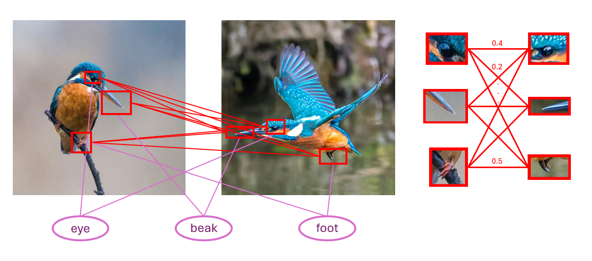
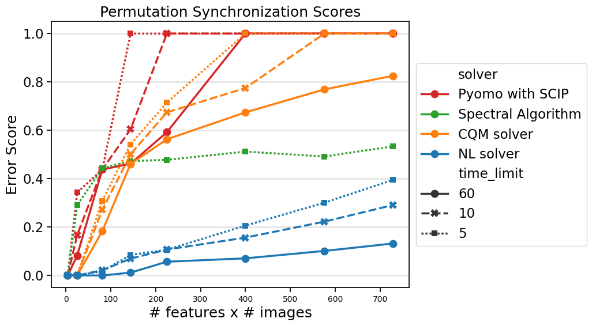

.. _opt_vignette_object-tracking:

===============
Object Tracking
===============

An important problem in computer vision is the task of object tracking, where
key features are identified and traced throughout a video (see, for example,
[Pac2013]_ and [Mas2017]_). This can be done by first detecting highlights in a
set of stills from the video, then assigning probabilities that each highlight
matches those in another image via a machine learning algorithm. This gives us a
matrix of probabilities for each pair of still images. We want to then maximize
continuity and reduce mismatches, which is where we can apply optimization
solvers.

    The object tracking problem.

Problem Instances
=================

We generate instances ranging in size from 2 to 30 features in 2 to 30 images
and fix a 1:1 ratio of features to images. For each pair :math:`(i,j)` of images
in each instance, we create a stochastic matrix representing the probabilities
of features in image :math:`i` matching features in image :math:`j`. The
matrices are generated with uniform random entries with normalized columns.

Mathematical Models
===================

This section discusses the various mathematical models that were used in this
study.

Nonlinear Model
---------------

With the nonlinear solver (also known as the |nlstride|), we use
:meth:`~dwave.optimization.model.Model.list` variables to represent the global
permutations, which can be viewed as mappings from the features in each image to
the global labels. We view the state of the list variable as a permutation in
one-line form where, for example, [210] represents the mapping:

.. table:: Example permutation mapping
   :width: 60%

   +---------+-----------+
   | Feature | Label     |
   +=========+===========+
   | 0       | 2 ("eye") |
   +---------+-----------+
   | 1       | 1 ("ear") |
   +---------+-----------+
   | 2       | 0 ("foot")|
   +---------+-----------+

For each of the :math:`n` images, we create a global permutation of length equal
to the number of features, :math:`m`.

.. testsetup:: [vto_nl1]

    m = 2
    n = 3

.. testcode:: [vto_nl1]

    from dwave.optimization import Model, put

    model = Model()

    permutations = {i: model.list(m) for i in range(n)}

Taking the composition of the global permutations :math:`\pi_i` and
:math:`\pi_j` gives the map between the features in image :math:`i` and the
features in image :math:`j`, which we can call :math:`\pi_{ij}`. Computing this
composition involves creating inverse permutations:

.. testcode:: [vto_nl1]

    inv_perms = {}

    for i in range(n):
        perm = permutations[i]
        array = model.constant(m*[0])
        indices = perm
        values = model.constant([x for x in range(m)])
        inv_perm = put(array, indices, values)
        inv_perms[i] = inv_perm

For example, if :math:`\pi_1 = [120]`, then :math:`\pi_1^{-1} = [201]`, where
the :math:`i^{th}` entry of :math:`\pi_1^{-1}` is the index of :math:`i` in
:math:`\pi_1`. 

The pairwise permutation :math:`\pi_{ij}` is then given by indexing
:math:`\pi_j^{-1}` by :math:`\pi_i`:

.. math::

    \pi_{ij} = \pi_j^{-1}[\pi_i]

.. testcode:: [vto_nl1]

    perm_convs = {}

    for i in range(n):
        for j in range(n):
            perm_convs[(i,j)] = inv_perms[j][permutations[i]]

As an example, if :math:`\pi_1 = [021]` and :math:`\pi_2 = [120]`, then
:math:`\pi_{12} = \pi_2^{-1}[\pi_1] = [201][021] = [210]`.

The objective function ensures that the entries of our stochastic matrices
indexed by the pairwise permutations are as close to 1 as possible.

.. testcode:: [vto_nl1]

    import numpy as np

    M_raw = {(i,j): np.random.rand(m,m) for i in range(n-1) for j in range(i+1,n)}
    M = {(i,j): v/v.sum(axis=1, keepdims=True) for (i,j), v in M_raw.items()}

    model.objective = model.constant(0)

    for (i,j) in M.keys():
        for k in range(m):
            model.objective += 1 - model.constant(M[(i,j)])[k,perm_convs[(i,j)][k]]

    model.lock()

Spectral Algorithm
------------------

The spectral algorithm is a polynomial-time, deterministic algorithm that gives
an approximate solution to this problem. To obtain the global permutations, put
the pairwise stochastic matrices in a block matrix, then find the top :math:`m`
eigenvectors and project the resulting blocks onto permutation matrices. See
[Pac2013]_ for more details.

Mixed Integer Quadratic Programming (MIQP) Model
------------------------------------------------

This model uses binary variables :math:`x_{i,j,k}`, equal to 1 if in image
:math:`i`, the :math:`j^{th}` feature is labeled as feature :math:`k`, to
represent the global permutations. This formulation is used for the CQM solver
and Pyomo with SCIP.

The key idea for the objective is that :math:`\pi_{i_1,i_2}[j_1] = j_2` means
feature :math:`j_1` in image :math:`i_1` is mapped to feature :math:`j_2` in
image :math:`i_2`, so we want the sum of entries :math:`M_{i,j}[k_1,k_2]` of the
stochastic matrix to be maximized where, for some label:

.. math::

    x_{i,k_1,\text{label}} * x_{j,\pi_{ij}[k_2],\text{label}} = 1.

The relevant Python code is as follows:

.. testsetup:: [vto_cqm1]

    n = 3
    m = 4

.. testcode:: [vto_cqm1]

    import numpy as np
    from dimod import ConstrainedQuadraticModel, Binary
    
    M_raw = {(i,j): np.random.rand(m,m) for i in range(n-1) for j in range(i+1,n)}
    M = {(i,j): v/v.sum(axis=1, keepdims=True) for (i,j), v in M_raw.items()}

    cqm = ConstrainedQuadraticModel()
    vars = {(i,j,k): Binary(f'x_{i}_{j}_{k}')
            for i in range(n) for j in range(m) for k in range(m)}
    for i in range(n):
        for j in range(m):
            cqm.add_constraint(sum([vars[(i,j,k)] for k in range(m)])==1)
            cqm.add_constraint(sum([vars[(i,k,j)] for k in range(m)])==1)
    obj = 0
    
    for (i,j) in M.keys():
        for k1 in range(m):
            for k2 in range(m):
                obj += (1 - M[(i,j)][k1,k2])*sum(vars[(i,k1,label)]*vars[(j,k2,label)]
                 for label in range(m))
    cqm.set_objective(obj)

Results
=======

The figure below shows the results for the object-tracking instances for the
nonlinear solver, CQM solver, Pyomo with SCIP, and the spectral algorithm with
runtimes of 5, 10, and 60 seconds. Since the spectral algorithm is
deterministic, the runtime is fixed, but all spectral algorithm runtimes for
these instances are under 5 seconds. D-Wave's nonlinear solver (version 1.26.0)
and CQM solver benchmarks were run on D-Wave's |cloud_tm|_ quantum cloud
service. Pyomo with SCIP and the spectral algorithm were run on an AMD EPYC 9534
64-Core Processor @ 2.45 GHz with 128 GB of memory. The error score (on a scale
of 0 to 1) is the gap from the specified solver divided by the gap from the
random solution. The optimal solution (used for computing the gap) is taken to
be the best solution found throughout the study, which includes a 20-minute run
on the nonlinear solver (not shown). The problem size is equal to the number of
features times the number of images.

:numref:`Figure %s <vignetteObjectTrackingLineplot>` shows results on the object
tracking instances with 5, 10, and 60 seconds of runtime.

    For runtimes up to 60 seconds, D-Wave's nonlinear solver finds the best
    solutions to the object tracking problem. On all but the smallest two
    problem instances (where it ties), the nonlinear solver with 5-second
    runtimes beats all other solvers at all runtimes tested.

Data
====

Solver runtimes and energies are available in CSV format
:download:`here <../downloadables/vignette_object-tracking.csv>`.