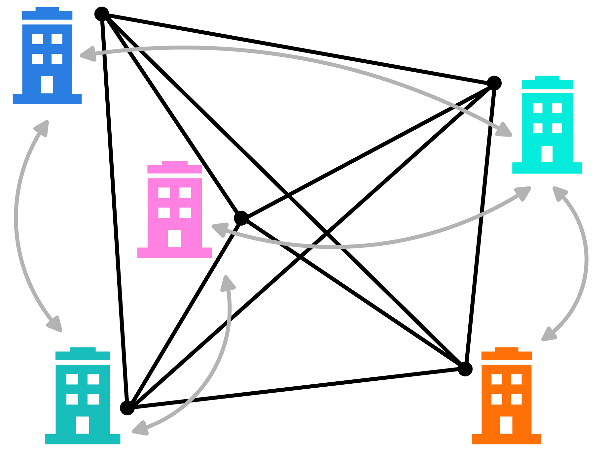
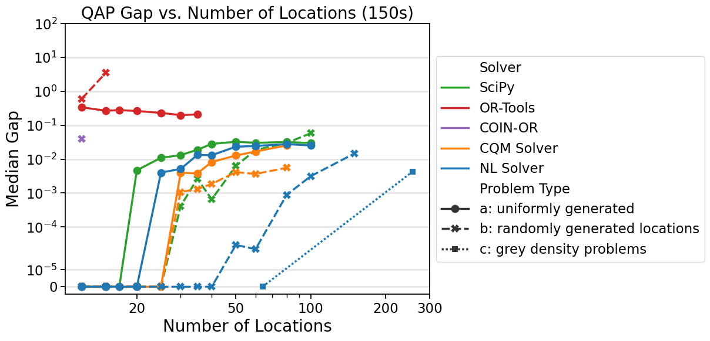

.. _opt_vignette_qap:

============================
Quadratic Assignment Problem
============================

The goal of the `quadratic assignment problem
<https://en.wikipedia.org/wiki/Quadratic_assignment_problem>`_ (QAP) is to
select locations that minimize the total flow cost between facilities.

The optimization tasks for this problem include minimizing transportation costs,
reducing travel distances, and optimizing resource allocation. These tasks are
commonly found in industries where efficient layout planning and logistics are
essential, such as manufacturing, supply chain management, and facility layout
design.

In QAP, we are given a set of :math:`n` facilities and :math:`n` locations.
Between each pair of facilities, there is a "flow" (for example, the amount of
supplies transported from one facility to the other). The goal is to place the
facilities so that the sum of the flows times the distances is minimized. The
objective function is nonlinear in the problem variables, which makes it
difficult to formulate for MILP and LP solvers.

    The quadratic assignment problem.

This study shows that on QAP problems from the Taillard benchmarking library
(see [Tai1991]_ and [Tai1995]_) with 150 seconds of runtime, the gap for
solutions found by D-Wave's hybrid nonlinear-program solver, or NL solver, beats
or ties all "b" and "c" instances. For the "a" instances, the only solver to
beat the NL solver is D-Wave's hybrid constrained quadratic model (CQM) solver.

Problem Instances
=================

The instances benchmarked for this paper are the Taillard instances ([Tai1991]_
and [Tai1995]_). These 26 problems contain the distance between each pair of
locations and the flow between each pair of facilities, with problem sizes
ranging from 12 to 256 locations (the number of locations is equal to the number
of facilities). These instances, categorized as "a", "b", and "c" are as
follows:

*   "a" instances are from [Tai1991]_ and are uniformly generated.

*   "b" instances are from [Tai1995]_ and are randomly generated, with distance
    matrices containing Euclidean distances between pairs of :math:`n` randomly
    generated points in the plane.

*   "c" instances are from [Tai1995]_ and have binary flow matrices with a block
    of 1s in the upper left corner and are inspired by the problem of printing
    greys of a given density.

Mathematical Models
===================

This section discusses the various mathematical models that were used in this
study.

Mixed Integer Nonlinear Programming (MINLP) Model
-------------------------------------------------

For MINLP solvers, the study uses binary variables :math:`x_{ij}` to indicate
whether facility :math:`i` is placed in location :math:`j`. Thus the number of
variables is quadratic in the number of locations. If :math:`F_{ik}` is the flow
from facility :math:`i` to facility :math:`k`, and :math:`D_{j\ell}` is the
distance between location :math:`j` and location :math:`\ell`, then the aim is
to minimize the objective function:

.. math::

    \sum_{i,j,k,\ell} F_{ik} D_{j\ell} x_{ij} x_{k\ell}

The sum is over all pairs of facilities :math:`i,j` and all pairs of locations
:math:`k,\ell`. The formulation also encodes constraints to ensure that there is
only one facility placed in each location and only one location per facility.
The number of constraints is twice the number of locations.

This formulation is used by D-Wave's hybrid CQM solver, COIN-OR with Ipopt
(Interior Point Optimizer), and OR-Tools with the CP-SAT solver.

SciPy Quadratic Assignment Function
-----------------------------------

SciPy provides a quadratic assignment function that includes its 2-opt method, a
local search algorithm that searches by swapping facility placements.

Nonlinear Model
---------------

D-Wave's NL solver can efficiently encode a QAP problem by
taking advantage of a :meth:`~dwave.optimization.model.Model.list` variable that
encodes an ordering of the facility placements. This variable eliminates the
need for both the quadratic number of binary variables representing facility
placements and the constraints preventing multiple facilities per location (and
vice versa) required by the MINLP formulation. The arrays of flows and distances
are converted to constant variables from which the objective value is computed.

The relevant Python code is as follows:

.. testsetup::

    import numpy as np

    flows = np.array([[0,5,10], [5,0,7], [10,7,0]])
    distances = np.array([[0,2,3], [2,0,4], [3,4,0]])

.. testcode::

    from dwave.optimization import Model

    model = Model()

    # Add the flow and distance matrices
    F = model.constant(flows)
    D = model.constant(distances)

    # Create a list variable to encode facility placement
    n = distances.shape[0]
    x = model.list(n)

    # Minimize the sum of the flows times the distances
    model.minimize((F*D[x,:][:,x]).sum())
    cntx = model.lock()

This model is available via the 
:func:`~dwave.optimization.generators.quadratic_assignment` generator.

Results
=======

All problems were run with a time limit of 150 seconds. Results are reported as
optimality gaps :math:`( \frac{\rm energy}{\rm best\: known\: solution} - 1)`
when feasible. Infeasible solutions correspond to infinite gaps in the median,
and if the median is infeasible, the data point is not shown in the plot. In
order to impose time limits on COIN-OR's solver, presolve techniques are turned
off. Solvers that terminate faster than the time limit are rerun for the full
allocated time and the minimum objective value found is saved.

D-Wave's NL solver and CQM solver benchmarks ran on D-Waves's |cloud_tm|_
quantum cloud service. COIN-OR, OR-Tools, and SciPy were run on an Intel Core
i9-7900X CPU @ 3.30GHz processor with 16GB RAM. The benchmarks for OR-Tools were
run with eight threads, and the remaining were run with a single thread.

:numref:`Figure %s <vignetteQAPLineplot>` shows results on the Taillard QAP
instances with a time limit of 150 seconds.

    The complete study contains more time limits. For all "b" and "c" instances,
    the NL solver beats or ties all other solvers. For all "a" instances, the
    only solver to beat the NL solver is D-Wave's CQM solver. The NL solver is
    the only solver able to obtain a feasible solution for the problems of size
    150 and 256 for all time limits tested.