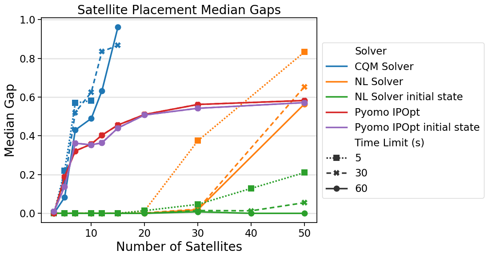

.. _opt_vignette_satellite:

===================
Satellite Placement
===================

.. raw:: html

       

        

        

        In the satellite-placement problem, a set of satellites, each having
        east and west boundaries, is to be placed along an arc. Between each
        pair of satellites, there is interference that decreases with distance.
        The goal is to place the satellites so that the maximum interference
        experienced by any pair is minimized.
        

    

   

Problem Instances
=================

Global west and east boundaries are set to 0 and 180. Midpoints for each
satellite's range are generated uniformly in [0,180], and a radius of up to 70
(not going beyond 0 or 180) determines the range. Interferences are generated
uniformly between 0 and 1. There are 11 problem instances for each number of
satellites.

Mathematical Models
===================

Mixed Integer Programming (MIP) Formulation
-------------------------------------------

The MIP formulation is based on the formulation provided in [Spa1991]_ and is
used by the CQM solver. The locations of the satellites are represented by
continuous variables :math:`\theta_i`. Satellite orders are encoded by binary
variables. An integer variable :math:`z` is needed to help track the
interferences experienced by each pair of satellites. Additional binary
variables are needed to reduce the degree of the constraints, as the CQM solver
can handle at most quadratic terms. These additional binary variables are set
equal to the product of each pair of the original binary variables, meaning that
the number of these variables is quartic in the number of satellites.

Mixed Integer Nonlinear Programming (MINLP) Formulation
-------------------------------------------------------

The `Pyomo <https://www.pyomo.org/>`_ modeling language with IPOpt (Interior
Point Optimization) can use absolute value rather than encoding the order of the
satellites with binary variables. Here, :math:`z` and :math:`\theta_i` are
continuous variables, :math:`d_{ij}` is the interference between satellites
:math:`i` and :math:`j`, and :math:`W_i` and :math:`E_i` are the west and east
boundaries of satellite :math:`i`. The formulation is then the same as in
[Spa1991]_:

.. math::

    \begin{array}\\
    \text{maximize } &z\\
    \text{such that } & d_{ij}z \leq |\theta_j -\theta_i| \leq 360-d_{ij}z &
    \forall 1 \leq i < j \leq n\\
    &W_i \leq \theta_i \leq E_i & \forall 1 \leq i \leq n\\
    \end{array}

Nonlinear Solver Formulation
----------------------------

This formulation makes use of a :class:`dwave.optimization.Model.list` variable
to eliminate the need for the binary variables in the MIP formulation encoding
the order of the satellites. To introduce continuous variables in the model, the
:class:`~dwave.optimization.symbols.LinearProgram` class is used.

For each satellite ordering, there is an associated linear program:

.. math::

    \begin{array}\\
    \text{minimize } & c\mathbf{x}\\
    \text{such that }& A\mathbf{x} \leq b\\
    \text{and } & l \leq \mathbf{x} \leq u\\
    \end{array}

The linear program is determined by the inequalities below:

.. math::

    \begin{array}\\
    \theta_j - \theta_i + d_{\sigma(i)\sigma(j)}z \leq 0\\
    -\theta_j + \theta_i + d_{\sigma(i)\sigma(j)}z \leq 360\\
    \end{array}

Here, :math:`d_{\sigma(i)\sigma(j)}` is the interference between the satellites
in the :math:`i^{\text{th}}` and :math:`j^{\text{th}}` positions. The matrix
:math:`A` of the linear program is determined by the coefficients of the
left-hand sides of the inequalities, and the vector :math:`\mathbf{b}` is equal
to :math:`(0,\ldots,0,360,\ldots,360)`, determined by the right-hand sides.

The upper and lower bound vectors :math:`l` and :math:`u` are the west and east
boundaries :math:`W_{\sigma(i)}` and :math:`E_{\sigma(i)}`, ordered by the state
of the list variable.

Finally, to maximize :math:`z`, define the vector :math:`\mathbf{c}` to be
:math:`(0,\ldots,0,-1)`, since
:math:`\mathbf{x} = (\theta_1, \ldots, \theta_n, z)`.

These values are the arguments for the
:class:`~dwave.optimization.symbols.LinearProgram` symbol:

.. testsetup::

    import numpy as np
    from dwave.optimization import Model, linprog

    model = Model()
    c = model.integer(2, lower_bound=-10, upper_bound=10)
    A = model.integer((3, 2), lower_bound=-10, upper_bound=10)
    b = model.integer(3, lower_bound=-10, upper_bound=10)
    W = model.integer(2, lower_bound=0, upper_bound=1)
    E = model.integer(2, lower_bound=0, upper_bound=1)

.. testcode::

    from dwave.optimization import linprog

    lp = linprog(c=c, A_ub=A, b_ub=b, lb=W, ub=E)

Initial States
--------------

The nonlinear solver and Pyomo can make use of initial states. For this study,
the nonlinear solver ran with and without an initial state for the list variable
representing the order of the satellites. An initial state was assigned by the
order of midpoints of the satellite ranges (“sorted_indices”):

.. testsetup::

    from dwave.optimization import Model
    num_satellites = 2

    model = Model()
    sorted_indices = [0,1]

.. testcode::

    orders = model.list(num_satellites)
    model.states.resize(1)
    orders.set_state(0, sorted_indices)

Pyomo and IPOpt also ran with and without an initial state for the locations
of the satellites, given by the midpoints of the satellite ranges.

Results
=======

:numref:`Figure %s <vignetteSatLineplot>` shows the median gaps for the
nonlinear solver, CQM solver, and Pyomo with IPOpt, with runtimes of 5, 30, and
60 seconds. D-Wave's nonlinear solver and CQM solver benchmarks were run on
D-Wave's |cloud_tm|_ quantum cloud service. Pyomo with IPOpt was run on an AMD
EPYC 9534 64-Core Processor @ 2.45 GHz with 64 GB of memory. Pyomo reports the
same energy for all runtimes given and thus is represented by a single line.
The gaps are computed with respect to the best solution found over all runs.
Infeasible solutions are counted as infinite gaps.

D-Wave's nonlinear solver finds the best solutions to the satellite-placement
problem with 60-second runtimes. The other solvers tested--D-Wave's CQM solver
and Pyomo with IPOpt--reach the same median gap for only up to three satellites
with the same time limit.

    On all problem sizes tested, D-Wave's nonlinear solver finds the best
    solutions to the satellite placement problem with 60-second runtimes.

Nonlinear Model: Full Formulation
=================================

.. testsetup::

    D = [[0.5,0.5],[0.5,0.5]]
    W = [1,2]
    E = [3,4]

.. testcode::

    import itertools
    import numpy as np

    from dwave.optimization import Model
    from dwave.optimization import linprog
    from dwave.optimization.mathematical import hstack, vstack, concatenate

    model = Model()

    D = model.constant(D)
    W = model.constant(W)
    E = model.constant(E)

    num_satellites = W.size()

    x = model.list(num_satellites)

    d = D[x, :][:, x]
    w = W[x]
    e = E[x]

    # Create a list of all ordered pairs of satellites to construct A
    combinations = list(itertools.combinations(range(num_satellites), 2))
    num_rows = len(combinations)

    from_ = model.constant([i for i, j in combinations])
    to_ = model.constant([j for i, j in combinations])

    # Construct the part of A indexed by the theta values
    theta = np.zeros((num_rows, num_satellites))
    for row, (i, j) in enumerate(combinations):
        theta[row][i] = +1
        theta[row][j] = -1
    model.theta = theta = model.constant(np.vstack((theta, -theta)))
    # Concatenate A with the column for the coefficients of z
    d_combinations = d[from_, to_]
    A = hstack((theta, concatenate((d_combinations, d_combinations)).reshape(-1, 1)))
    b_ub = model.constant([0] * num_rows + [360] * num_rows)

    # Create the vectors for the upper and lower bounds
    lb = concatenate((w, model.constant([0])))
    ub = concatenate((e, model.constant([+1_000])))  # just a large number

    # And finally we want to maximize z
    c = model.constant([0] * num_satellites + [-1])

    # Create the LP
    lp = linprog(c=c, A_ub=A, b_ub=b_ub, lb=lb, ub=ub)

    # Add the LP as a constraint to the model
    success = model.add_constraint(lp.success)
    model.minimize(lp.fun)

    cntx = model.lock()

