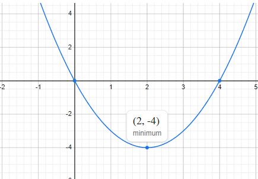

.. _opt_workflow:

===================================
Basic Workflow: Models and Sampling
===================================

This section provides a high-level description of how you solve problems using
**hybrid** solvers. (For solving problems directly on a
:term:`QPU`, see :ref:`this <qpu_workflow>` section instead.)

.. include:: ../shared/workflow.rst
    :start-after: start_workflow_intro
    :end-before: end_workflow_intro

.. _opt_workflow_objective_functions:

Objective Functions
===================

.. include:: ../shared/workflow.rst
    :start-after: start_objective
    :end-before: end_objective

.. _opt_workflow_simple_obj_example:

Simple Objective Example
------------------------

.. include:: ../shared/workflow.rst
    :start-after: start_simple_objective_example
    :end-before: end_simple_objective_example

The :ref:`opt_simple_sampling_example` example below shows an equally simple
solution by sampling.

.. _opt_workflow_models:

Supported Models
----------------

To express your problem as an objective function and submit to a |dwave_short|
:term:`hybrid` sampler for solution, you typically use
:ref:`Ocean software's <index_ocean_sdk>` nonlinear model.

.. include:: ../shared/models.rst
        :start-after: start_models_nonlinear
        :end-before: end_models_nonlinear

Other Models
~~~~~~~~~~~~

Ocean software also supports some :term:`quadratic models <quadratic model>`
that can be submitted to hybrid solvers in the
`Leap <https://cloud.dwavesys.com/leap/>`_ service. These might currently be
more suited to some problems.

*   .. include:: ../shared/models.rst
        :start-after: start_models_cqm
        :end-before: end_models_cqm

*   .. include:: ../shared/models.rst
        :start-after: start_models_bqm
        :end-before: end_models_bqm

*   .. include:: ../shared/models.rst
        :start-after: start_models_dqm
        :end-before: end_models_dqm

.. _opt_workflow_samplers:

Samplers
========

.. include:: ../shared/workflow.rst
    :start-after: start_samplers
    :end-before: end_samplers

.. _opt_simple_sampling_example:

Simple Sampling Example
-----------------------

.. include:: ../shared/workflow.rst
    :start-after: start_simple_sampler_example
    :end-before: end_simple_sampler_example

.. _opt_workflow_simple_example:

Simple Workflow Example
=======================

This example uses :ref:`Ocean software <index_ocean_sdk>` tools to
demonstrate the solution workflow described in this section on a simple problem
of of finding the minimum of a function of an integer variable, the polynomial
:math:`y = i^2 - 4i`.

        the y-axis from -5 to +5, showing a parabola with its minimum at
        (i,y) of (+2,-4).
    :align: center
    :scale: 100%

    Minimum point of a simple polynomial, :math:`y = i^2 - 4i`.

The :ref:`dwave-optimization <index_optimization>` package can formulate the
problem as nonlinear model as follows:

>>> from dwave.optimization import Model
...
>>> model = Model()
>>> i = model.integer(lower_bound=-5, upper_bound=5)
>>> y = i**2 - 4*i
>>> model.minimize(y)

Instantiate a hybrid nonlinear sampler and submit the problem for solution by a
remote solver provided by the Leap quantum cloud service:

>>> from dwave.system import LeapHybridNLSampler
...
>>> with LeapHybridNLSampler() as sampler:                  # doctest: +SKIP
...     results = sampler.sample(
...         model,
...         label='SDK Examples - Polynomial')

Solutions are the assignment of values to the model's
:term:`decision variables`, which are represented as
:ref:`states <opt_model_construction_nl_states>` of the model. Print the best
solution, which is typically the first returned state.

>>> with model.lock():                                      # doctest: +SKIP
...     print(f"At i={i.state(0)}, lowest value of y is {model.objective.state(0)}")
At i=2.0, lowest value of y is -4.0

The best (lowest-energy) solution found has :math:`i=2` as expected.