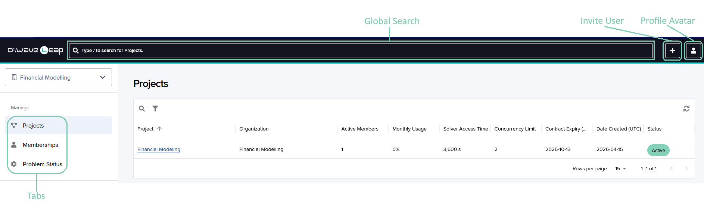
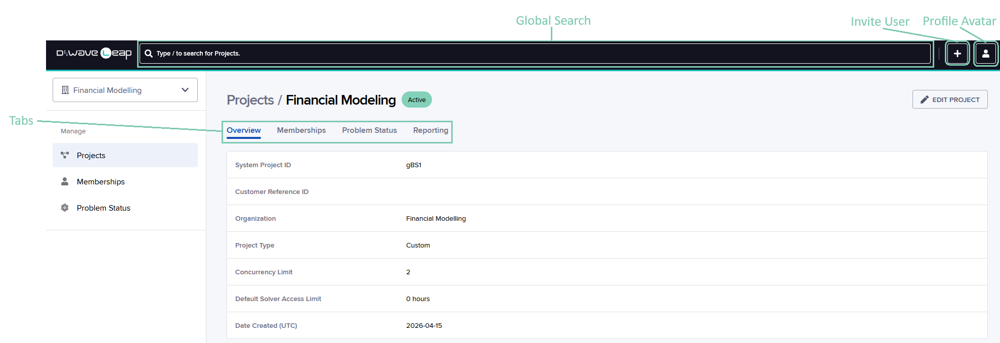
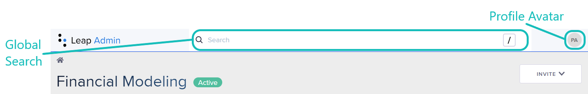
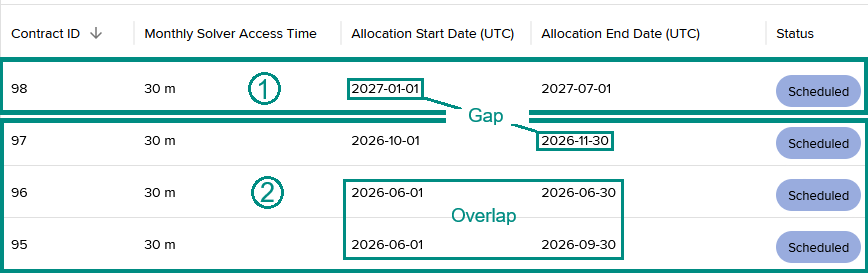

.. include:: ../shared/admin.rst
    :start-after: start_substitutions
    :end-before: end_substitutions

.. |set-default-to-unlimited-access| replace::

   The **Set Default to Unlimited Access** option allows any project member to
   use the full monthly solver-access time allocated to the project as
   determined by the sum of the project's active solver-access time records.

.. |solver_time_default| replace::

   Specify the default limit on solver-access time for new members who accept
   the invitation for the project after this field has been set. Existing
   members are not impacted; they retain the current limit on their
   solver-access time.

.. _leap_admin:

===================
Leap Administration
===================

This section includes the following information:

*   :ref:`admin_overview` provides an overview of Leap administration, including
    terminology.
*   :ref:`admin_quick_start` shows how to easily invite people to a
    :ref:`seat-based project <admin_project_seat_time>`.
*   :ref:`admin_managing_organizations` shows how to view organization-related
    information.
*   :ref:`admin_managing_projects` shows how to update and view your projects.
*   :ref:`admin_managing_project_members` shows how to invite and manage members
    of your projects.
*   :ref:`admin_problem_status` shows how to view and cancel problem
    submissions.
*   :ref:`admin_reports` explains how to generated reports.

.. _admin_overview:

Overview
========

Leap Admin is an easy-to-use cloud-based administration tool that you use to
perform the following tasks:

*   Manage multiple projects in multiple
    :ref:`organizations <admin_def_organization>`.

*   Invite people to a :ref:`project <admin_def_project>`. Projects are used to
    manage the project's members and their solver access in the Leap service.

*   View the status of problems submitted to solvers.

*   Troubleshoot submission issues.

*   Generate solver usage reports.

For information about |dwave_short| quantum computers, problems, and solvers,
see the :ref:`opt_index_get_started` or :ref:`qpu_index_get_started` sections.

If you have access to Leap Admin, then you have been designated as a project or
organization administrator with privileges to manage one or more projects or
organizations that have been created by |dwave_short| in accordance with your
customer contract.

To get started quickly, go to the :ref:`admin_quick_start` subsection.

Leap Admin Organization Page
----------------------------

When you open an organization, the organization page is displayed as shown in
:numref:`Figure %s <AdminOrgPage>`.

    Leap Admin: Organization Page

Tabs that organize tasks into logical groups are as follows:

*   **Overview**

    Displays information about the organization.

*   **Projects**

    Displays summary information for the projects in the organization. To
    display a project's project page, click its name.

Leap Admin Project Page
-----------------------

When you open a project, the project page is displayed as shown in
:numref:`Figure %s <AdminProjectPage>`.

    Leap Admin: Project Page

Tabs that organize tasks into logical groups are as follows:

*   **Overview**

    Displays information about the project.

*   **Problem Status**

    Displays a summary of the statuses of all submitted problems. To display the
    problem's parameters and resulting sample set, click a problem ID.

*   **Reporting**

    Enables generating CSV or Excel reports on solver usage statistics.

*   **Project Members**

    Displays summary information for the project members. To display more
    information about a specific member, click their member name.

Global Search and Profile Avatar Menu
-------------------------------------

    Global Search and Profile Avatar Menu

You can perform the following tasks via global search and the profile avatar
menu on the organization and project pages:

*   Global search field

    Search for a project by name and for a member in any of your projects.

*   Profile avatar menu

    From your profile avatar, select the appropriate menu item to go to the
    **dashboard**, this documentation, open a project, or log out of Leap
    Admin.

Administration Tasks
--------------------

*   :ref:`Manage organizations <admin_managing_organizations>`

    You can view information about the organization, such as its name and
    status, and summary information about its projects, such as their status
    and number of members.

*   :ref:`Manage projects <admin_managing_projects>`

    You can view project information such as the project members, the solvers
    available in the project, and the project status. For time-based projects,
    you can also set the default limit for any single member's
    solver-access time.

*   :ref:`Add and manage project members <admin_managing_project_members>`

    To add members, you must first invite them to join the project. You can also
    set a per-member limit on solver-access time that overrides the project
    default.

*   :ref:`View and manage problems submitted to solvers in the projects
    <admin_problem_status>`

    You can view and filter a list of problem submissions, access the details
    of any problem, and cancel pending submissions.

*   :ref:`Generate and export usage reports <admin_reports>`

    You can generate usage reports and export them to `XLSX` and `CSV` files.

Terminology
-----------

*   **Application**

    A program that submits problems to solvers.

.. _admin_def_organization:

*   **Organization**

    Any organization such as a company or institution that has one or more
    associated projects.

.. _admin_def_organization_administrator:

*   **Organization administrator**

    A project member who has the Organization Admin role.

.. _admin_def_project:

*   **Project**

    A logical or organizational grouping of project members that is used to
    manage members' solver access.

.. _admin_def_project_administrator:

*   **Project administrator**

    A project member who has the Project Admin role.

.. _admin_def_project_member:

*   **Project member**

    A user who has joined a project in the Leap service, also known as a
    *member*.

.. _admin_def_role:

*   **Role**

    A role gives a member the privileges to perform specific actions in a
    project or organization. A role can be either *Project Admin*, *User*, or
    *Organization Admin*. The *Project Admin* role is intended for people who
    administer a project. The *Organization Admin* role is intended for people
    who administer an organization and its associated projects. Only members
    with the *Project Admin* or *Organization Admin* role can access Leap Admin.
    The *User* role is intended for people whose main activity is submitting
    problems. For more information, see :ref:`admin_user_roles`.

.. _admin_def_seat:

*   **Seat**

    A seat represents access to a project's solvers for a single member or
    application. A customer contract specifies the number of seats that are
    available for each seat type.

.. _admin_def_seat_type:

*   **Seat type**

    |seat_type_def|

    For more information, see :ref:`admin_seat_types`.

.. _admin_def_solver_access_limit:

*   **Solver access limit**

    |solver_access_limit|

Conventions
-----------

For sequential steps in the user interface, variables are indicated
in italics; for example, **Leap Admin** > *project_name*.

.. _admin_quick_start:

Quick Start
===========

The goal of this subsection is to invite people to a
:ref:`seat-based project <admin_project_seat_time>`.

To log in to Leap Admin, you must have received an email to join a project as a
project administrator. A project administrator for a project is a member who has
the *Project Admin* role in that project. If you did not receive an email
invitation as expected, contact your organization administrator or
|support_email|_.

.. note:: If your invitation has expired or if you did not receive one, contact
    |support_email|_.

To invite people to a project, perform the following tasks:

*   :ref:`admin_logging_in`

*   :ref:`admin_project_inviting_users_join`

.. _admin_logging_in:

Logging in to Leap Admin
------------------------

1.  Log in to the Leap service at `<https://cloud.dwavesys.com/leap/login/>`_.

2.  In the upper right corner of the **dashboard**, select
    *your_profile_avatar* > **Leap Admin** as shown in
    :numref:`Figure %s <DashboardLeapAdminLogin>`.

    .. _fig_dashboard_leap_admin_login:

    .. figure:: ../_images/leap_admin_dashboard_login.png
        :name: DashboardLeapAdminLogin
        :alt: Leap Admin Login Menu
        :width: 25 %

        Leap Admin: Login Menu

.. note::
    If you are a project administrator for multiple projects,
    select *your_profile_avatar* > **Leap Admin** > *project_name*.

.. _admin_project_inviting_users_join:

Inviting People to a Project
----------------------------

#.  Click **Invite** > *role*.

    A *role* gives a member the privileges to perform specific actions in a
    project. For more information, see :ref:`admin_user_roles`.

    .. tip:: As a best practice, invite additional project and organization
        administrators as backups.

2.  Select the seat type for the people to be invited in the
    **Seat Type** field.

    For more information, see the following sections:

    *   :ref:`admin_seat_types`

    *   :ref:`admin_inviting_users_join`

3.  Specify the email addresses of the people to add to the project.

    If an error occurs when specifying an email address, ensure that the email
    address is allowed as specified (individually or by pattern) in the
    **Allowed Email Settings** section.

    If the email address is not permitted in the **Allowed Email Settings**
    section on the **Overview** page, contact your organization administrator
    or |support_email|_.

.. _admin_managing_organizations:

Managing Organizations
======================

.. note::
    To create an organization, contact |support_email|_.

A customer contract defines an organization, which represents a company or
institution in the Leap service. An organization contains one or more associated
projects.

Organization Administrators
---------------------------

:ref:`Organization administrators <admin_def_organization_administrator>` can
invite people to the Leap service in any :ref:`role <admin_def_role>` as well as
administer many aspects of the projects contained in their organization,
including specifying a project's allowed email addresses and performing all
tasks that a project administrator can.

Viewing Allowed Emails
----------------------

The **Allowed Email Settings** section displays the email addresses, domains,
and subdomains that are allowed for the members of all projects in an
organization. Organization administrators can further restrict each
:ref:`project's allowed email addresses <admin_allowed_email_addresses>`.

.. note:: If you need to change an organization's allowed email addresses for
    project members, contact |support_email|_.

Viewing Summary Information for Projects
----------------------------------------

The organization's **Projects** tab displays summary information for all
projects in an organization.

.. tabularcolumns:: |l|L|

.. list-table:: **Projects** Tab
    :widths: 1 3

    *   -   **Project Name**
        -   Name of the project. Click the name to go to its project page.

    *   -   **Active Members (Count)**
        -   Number of active members in the project.

    *   -   **Monthly Usage**
        -   Amount of solver-access time that has been consumed in the project
            for the month.

    *   -   **Solver Access Time**
        -   Amount of solver-access time aggregated over all active records for
            the project.

    *   -   **Contract Expiration**
        -   Date that the contract with which the project is associated expires.

    *   -   **Creation Date**
        -   Date that the project was created.

    *   -   **Project Status**
        -   Status of the project. For a description of project statuses, see
            the :ref:`admin_proj_status_viewing` section.

Filtering and Sorting the Columns
~~~~~~~~~~~~~~~~~~~~~~~~~~~~~~~~~

Clicking the icons in the table headings or selecting the fields above the table
performs the following actions:

.. tabularcolumns:: |l|L|

.. list-table:: Columns: Filtering and Sorting
    :widths: 1 3

    *   -   |filter_single|
        -   Filters the rows by matching a part of the project name.

    *   -   |filter_combo|
        -   Filters the rows by a combination of project attributes, such as
            project name, project status, and a range of dates for when the
            project's contract is to expire.

    *   -   |sort_col|
        -   Sorts in ascending or descending order.

    *   -   |filter_col|
        -   Sets the filters for a column.

    *   -   |gear_col|
        -   Specifies the unit of time for the column. In addition, for the
            **Monthly Usage** column, specifies the percent usage.

.. _admin_managing_organizations_status_viewing:

Viewing Organization Status
---------------------------

An organization's status is the state of the organization in the organization
life cycle and is displayed next to the organization name on the organization's
page. The life-cycle states are the following:

.. tabularcolumns:: |l|L|

.. list-table:: Organization Status
    :widths: 1 3

    *   -   **New**
        -   The organization has been created, but none of its projects have
            started as determined by the earliest start date of any project's
            solver-access time allocation.

    *   -   **Active**
        -   At least one of the organization's projects has started as
            determined by the earliest start date of any project's solver-access
            time allocation.

    *   -   **Expired**
        -   The end date of all solver-access time allocations in all the
            organization's projects has been reached.

.. _admin_managing_projects:

Managing Projects
=================

.. note::
    To create a project, contact |support_email|_.

A customer contract defines each project, including the
:ref:`project type <admin_project_seat_time>` (seat- or time-based), the solvers
that are available, and the allowed email addresses for project members.

In addition to viewing the email domains and subdomains (or individual email
addresses) of the people who can be invited and project-level information
such as the available solvers and the project's :ref:`seats <admin_def_seat>`,
you can also change a few project settings, such as its
:ref:`customer reference ID <admin_project_info_viewing>` and members' limits on
solver-access time and :ref:`seat types <admin_seat_changing_user>`.

.. tip::
    *   To go to another project, select *your_profile_avatar* >
        **Projects** > *project_name*.

    *   To go to the organization, click the Home icon.

.. _admin_project_seat_time:

Seat- versus Time-based Projects
--------------------------------

Both seat- and time-based projects are supported as follows:

*   Seat-based projects enable you to easily assign a project member, such as a
    developer whose main activity is submitting problems, to a
    :ref:`seat <admin_def_seat>` of a predefined :ref:`type <admin_seat_types>`
    that best meets the member's intended use.

*   Time-based projects do not have seats; instead you allocate an amount of
    solver-access time to each project member.

.. _admin_projects_users_searching_for:

Searching for Projects and Members
----------------------------------

To search for a project that you administrator or for a member in a project that
you administer, do the following:

#.  Click in the global search field |global_search| (at the top of the page)
    and enter the text to search for.

    The text matches any part of a project or member name (including an email
    address). The matching projects and member names are displayed in a dropdown
    list.

    .. tip::
        The global search shortcut key is `/` (forward slash).

    .. admonition:: Limitations
        :name: global_search_limits

        *   The search is case-insensitive.

        *   Only the Latin-1 character set is supported.

        *   The minimum number of characters required to display matches is 3.

        *   The maximum number of characters is 254.

#.  If one of the specific members or projects in the dropdown list is what you
    are searching for, then select it; otherwise, narrow your search by
    selecting one of the following options from the dropdown list:

    *   **Show all results for** *search_text*

        Displays a list of all matching project and member names.

    *   **Users (** *number_of_results* **) --- Show All**

        Displays a list of all matching member names.

    *   **Projects (** *number_of_results* **) --- Show All**

        Displays a list of all matching project names.

.. tip::

    *   Use the `Up` and `Down` arrow keys to select an item in the results list
        and press `Enter` to go to the selection.

    *   To go back to the complete search results, click **Search Results**.

    *   To try a new search, replace the text in the global search field
        |global_search|.

.. _admin_project_info_viewing:

Viewing Basic Information
-------------------------

Basic information, such as a project's name, status, and associated
:ref:`organization <admin_def_organization>`, is displayed on the project page's
title banner; additional basic information is displayed in the following
sections on the project's **Overview** tab.

.. tabularcolumns:: |l|L|

.. list-table:: **Current Usage** Section (Time-based Projects Only)
    :widths: 1 3

    *   -   **Project Monthly Solver Time Usage**
        -   Percent of solver-access time used in the project for the current
            renewal period.

.. tabularcolumns:: |l|L|

.. list-table:: **Project Details** Section
    :widths: 1 3

    *   -   **Project Name**
        -   Name of the project.

    *   -   **System Project ID**
        -   Unique identifier for a project. It is used for internal purposes,
            such as a prefix for the project's API token.

    *   -   **Project Creation Date**
        -   Date that the project was created.

    *   -   **Customer Reference ID**
        -   ID that you provide and which can be used for your specific internal
            processes.

Viewing Project Seats
---------------------

Each project member, whether a person or an application, occupies a single seat
of a given type. The number of seats and seat types are determined by the
customer contract. Each row in the **Project Seats** section represents a
particular seat type, including such information as the number of seats
currently occupied and the limit on solver-access time, as follows:

.. tabularcolumns:: |l|L|

.. list-table::

    *   -   **Seat Type**
        -   The name of the seat type.

    *   -   **Seats Occupied**
        -   The number of seats that are currently allocated to members or
            applications out of the maximum number of seats that can be
            occupied; for example, ``2 of 5`` means that 2 seats are occupied
            out of the 5 available.

            A seat is considered to be occupied once an invitation has been
            sent.

            The number of members in a project at any one time cannot exceed
            the total number of seats available for all seat types.

    *   -   **Solver Access Limit**
        -   |solver_access_limit|

    *   -   **Seat Description**
        -   The description for the seat type. For more information, see
            :ref:`admin_seat_types`.

To change a member's seat type, see the :ref:`admin_seat_changing_user` section.

.. _admin_seat_types:

Seat Types
~~~~~~~~~~

|seat_type_def|

You can switch a member or application between seat types, but a member or
application can only occupy one seat type at any one time.

Examples of seat types are as follows:

.. tabularcolumns:: |l|p{10.5cm}|

.. list-table:: Seat Types
    :widths: 1 3

    *   -   **User**
        -   Intended for members whose main activity is submitting problems;
            for example, a developer. This seat type provides an unlimited
            amount of solver-access time.

    *   -   **Observer**
        -   Intended for members whose main activity is administration or
            troubleshooting; they do not submit problems frequently. This seat
            type provides a limited amount of solver-access time.

    *   -   **Service Account**
        -   Intended for applications that submit problems; for example, a
            production application that submits problems on a schedule. This
            seat type provides an unlimited amount of solver-access time.

    *   -   **Inactive**
        -   Intended for members who should remain in the project but are
            temporarily inactive. They cannot submit problems to solvers.

Viewing Solver-Access Time
--------------------------

The **Solver Access Time Schedule** section displays the solver-access time
records as determined by the customer contract.

.. tip:: A project administrator receives a notification when the project's
    solver-access time reaches 80%.

Solver-Access Time Records
~~~~~~~~~~~~~~~~~~~~~~~~~~

A solver-access time record is an amount of solver-access time for a specific
period of days. A gap or overlap of solver-access time can occur between
records. For example, if a new contract states that solver-access time be
increased by 1 hour for September, then instead of increasing the solver-access
time for an existing record, a separate record is created for 1 hour of
solver-access time from September 1 to 30.

Thus, record periods (in units of whole days) can be contiguous, overlap, or
have gaps between them. :numref:`Figure %s <ExampleSolverAccessTimeRecords>`
illustrates the following:

*   A gap occurs between record 1 and the set of records 2 because the start
    date in record 1 is not contiguous with the closest end date in the set of
    records 2.

*   The records in the set of records 2 are contiguous.

*   In the set of records 2, the middle record overlaps with the previous
    record.

    Example of Solver-Access Time Records

Renewal Date
~~~~~~~~~~~~

Solver-access time renews every month simultaneously for all active records.
The renewal date is the day of the month that is specified in the anniversary
date for all active records; however, if the anniversary date's day of the month
is greater than the last day of a renewal month, then the renewal date is the
last day of the month. For example, if the anniversary date is January 31, then
the next renewal date is February 28 (or February 29 in a leap year).

.. note::
    If there is a gap between records and the first one expires, then the
    renewal date is set to the next record's renewal date, which might differ
    from the first record's renewal date.

Anniversary Date
~~~~~~~~~~~~~~~~

When a record is created, the anniversary date is automatically calculated as
follows:

*   The anniversary date is the start date of the new record, if either of the
    following is true:

    *   The new record is the only active or scheduled record in the project.

    *   There is a gap between the new record and an active or scheduled record.

*   The anniversary date is the same as the existing active or scheduled records
    if the new record is contiguous with those existing records.

.. tabularcolumns:: |l|L|

.. list-table:: **Solver Access Time Schedule** Section

    *   -   **Solver Access Time**
        -   A record's amount of solver-access time available for each renewal
            period. Consumption of solver-access time is aggregated across all
            regions.

            **Note:** The maximum number of problems per member that can be in
            a solver queue is 1,000; if this maximum is exceeded, then problems
            are rejected.

    *   -   **Start Date (UTC)**
        -   The date (inclusive) that access is provided to solvers. This date
            is determined by the customer contract.

    *   -   **End Date (UTC)**
        -   The date (inclusive) that access to solvers ends. This date is
            determined by the customer contract.

    *   -   **Anniversary Date (UTC)**
        -   The anniversary date is used to calculate the renewal date.

    *   -   **Status**
        -   **Active**: The current date is between the record's start and end
            dates. Only active records contribute solver-access time.

            **Disabled**: The record was disabled by |dwave_short|.

            **Scheduled**: The record has been scheduled for activation beyond
            the current date. When the current date reaches the record's start
            date, then the record is activated.

            **Expired**: The current date has passed the record's end date.

    *   -   **Project Member Default Solver Access Limit**
            (time-based projects only)
        -   |solver_time_default|

            |set-default-to-unlimited-access|

            For more information, see the :ref:`admin_solver_time_default_all`
            section.

    *   -   **Project Allocation Summary** (time-based projects only)
        -   The information in this section aggregates key information for the
            active records in the project.

.. _admin_allowed_email_addresses:

Changing the Allowed Email Addresses for Members
------------------------------------------------

If you are an organization administrator, you can change the email addresses
that are allowed for members.

You specify email addresses either individually or by pattern via the wildcard
(``*`` (asterisk)) symbol in the **Permitted Emails** list of the
**Allowed Email Settings** section. Although patterns are flexible, they
typically map to domains or subdomains. For example, to allow all email
addresses at ``mycompany.com``, specify ``*@mycompany.com``; to allow all email
addresses at ``mycompany.com`` and any of its subdomains, in addition to
``*@mycompany.com``, specify ``*.mycompany.com``.

The project's parent organization also limits the allowed email addresses. You
can invite only people whose email addresses are allowed by both. For example,
if ``*@quantumcompany.com`` only is specified for the organization, but you
specify ``*@classiccompany.com`` only for the project, then you cannot invite
anyone.

You add, remove, and edit an email address or pattern in the **Overview** >
**Allowed Email Settings** section as follows:

.. tabularcolumns:: |l|L|

.. list-table:: **Allowed Email Settings**
    :widths: 1 3

    *   -   **Add New Email** > **Add**
        -   Enter the email address or pattern and click **Add**.

    *   -   **Permitted Emails** > **Remove**
        -   To remove an email address or pattern, select it and click
            **Remove**.

            **Note:** This action does not affect existing members of the
            project.

    *   -   **Permitted Emails** > **Edit**
        -   To edit an email address or pattern, select it and click **Edit**.

.. tip:: To select multiple email addresses or patterns, use ``Shift`` + click
    or ``Ctrl`` + click.

Viewing Available Solvers
-------------------------

You view a list of solvers that are available in the project in the **Overview**
> **Project Solvers** section. The status of solvers is displayed in the
**Status** column.

Solvers are specific to a region (for example, Europe or North America). To
display the solvers for a region, click the region name. The solvers that are
available in a project are determined by the customer contract.

To view a solver's properties and parameters, click its name in the
**Solver Name** column. For more information on solver properties and
parameters, see the :ref:`opt_index_properties_parameters` and
:ref:`index_quantum_research` sections.

.. _admin_proj_status_viewing:

Viewing Project Status
----------------------

A project's status is the state of the project in the project life cycle as
follows:

.. tip:: Project status is displayed in the project page's title banner.

.. tabularcolumns:: |l|L|

.. list-table:: Project Status
    :widths: 1 3

    *   -   **New**
        -   The project has been created, but its start date has not been
            reached. You can specify the people to be invited, but the
            invitations themselves are not sent until the start date has been
            reached.

    *   -   **Active**
        -   The project has started as determined by its start date.

            **Note:** Invitations that have been scheduled are sent on the start
            date.

    *   -   **Suspended**
        -   The project cannot be used.

            **Note:** This is an exception state. If you believe your project
            should not have been suspended, contact |support_email|_.

    *   -   **Expired**
        -   The end date for the project's solver-access time has been reached.
            Project members can still log in to the project, but cannot run
            problems on the solvers.

.. _admin_solver_time_default_all:

Changing the Solver-Access Time Limit for Time-based Projects
-------------------------------------------------------------

.. note:: This feature applies to time-based projects only.

By default, any one project member can use up all of a project's monthly
solver-access time. If you want to change this default or set a different limit
for an individual member, do the following:

#.  Go to the project page's **Overview** tab >
    **Solver Access Time Schedule** section >
    **Project Member Default Solver Access Limit** field.

#.  |solver_time_default|

|set-default-to-unlimited-access| If you want to keep project members from using
up all of the project's monthly solver-access time\ [#]_, deselect this option
and enter a specific amount in the
**Project Member Default Solver Access Limit** field. Consider an example where
monthly solver-access time, which is the sum of the project's active
solver-access time records, is 30 minutes. If you want to keep any one of your
project members from using up all of this time and limit them to 5 minutes each
per month, then you specify 5 minutes in the
**Project Member Default Solver Access Limit** field.

To override this default and specify a different amount of solver-access time
for an individual member, see the :ref:`admin_user_solver_time` section.

.. [#] Solvers have different usage rates. For more information, see the
    :ref:`qpu_operation_timing` section.

.. _admin_managing_project_members:

Managing Project Members
========================

You manage project members by first inviting people to join a project and
managing the invitation process, including sending them reminders to accept the
invitation and revoking invitations. You can also change members'
:ref:`roles <admin_def_role>`, :ref:`seat types <admin_seat_types>`,
and :ref:`solver-access time limits <admin_def_solver_access_limit>` as well as
remove members from projects.

.. _admin_user_roles:

Member Roles and Privileges
---------------------------

A member has one of the following roles and associated privileges.

.. tabularcolumns:: |l|p{10.5cm}|

.. list-table:: Member Roles and Privileges
    :widths: 1 3

    *   -   **User**
        -   Project member who has the following privileges in the project:

            *   Manage and submit their problems to solvers.

            *   Manage their own profile settings.

            *   Reset their API token.

            Members that have the *User* role cannot access Leap Admin.

    *   -   **Project Admin**
        -   Project member who has the following privileges in the project:

            *   Perform any user tasks.

            *   Manage invitations.

            *   View limited project-level member information.

            *   Remove members from a project.

            *   Change a member's role.

            *   Change a member's solver-access time.

            *   Manage problems.

    *   -   **Organization Admin**
        -   Project member who has the following privileges in the organization
            and its projects:

            *   Perform any project administrator tasks.

            *   Invite organization administrators.

            *   Assign the Organization Admin role to and remove it from
                a member.

            *   Change a project's name.

            *   Change a project's allowed email addresses for members.

.. _admin_inviting_users_join:

Inviting People to Join a Project
---------------------------------

You invite people to join a project by sending them email invitations via Leap
Admin. To join the project, the person must accept the invitation by clicking
the link in the email. A person who is new to the Leap service must also create
an account.

Invitations expire after 14 days; you can send reminders to people who have
active invitations. If an invitation expires or is revoked, you can send a new
invitation.

Access to the Leap service is supported only from certain regions. For more
information, see the
`From What Countries Can I Access D-Wave's Leap Quantum Cloud Service
<https://support.dwavesys.com/hc/en-us/articles/360051869733>`_ article.

When creating an account or joining a project, the person might be required to
accept the |dwave_short| terms and conditions. The customer contract determines
whether or not this is required for people joining the project.

.. note::
    To change whether accepting terms and conditions is required or not,
    contact |support_email|_.

Procedure
~~~~~~~~~

#.  To invite people to join a project or organization, click
    **Invite** > *role*.

    *Role* is one of the project member roles to assign to a person:
    **User**, **Project Admin**, or **Organization Admin**. Only an organization
    administrator can assign the **Organization Admin** role.

    For more information, see :ref:`admin_user_roles`.

#.  In the invitation dialog box, specify the following fields:

    .. tabularcolumns:: |l|p{9cm}|

    .. list-table:: Invitation Dialog Box

        *   -   **Organization**
            -   (Read-only) Organization to which you are inviting people.

        *   -   **Project**
            -   Project to which you are inviting people.

        *   -   **Seat Type**
            -   An available seat type for the invitees. For more information,
                see the :ref:`admin_seat_types` section.

        *   -   **Email**
            -   Email addresses or member names (if they already exist in the
                Leap service) of the people you want to invite to the project.

                **Tip:**

                *   You can copy and paste multiple email addresses from either
                    a single column in an Excel spreadsheet or a semicolon-,
                    space-, new line-, or comma-delimited list (for example, a
                    CSV file).

                *   To edit an invitee, double-click the field for the invitee's
                    name or email address.

                *   To display an email address, place the pointer over the
                    invitee field.

                *   To delete an invitee at the end of the list, place the
                    cursor at the end of the list and press `Backspace`. To
                    delete the next invitee, press `Backspace` again.

                **Note:** The email addresses to be added must be specified in
                the **Overview** tab > **Allowed Email Settings** section.
                For more information, see :ref:`admin_allowed_email_addresses`.

        *   -   **Set solver access limit** (time-based projects only)
            -   Maximum amount of solver-access time available per month for the
                specified invitees. You set this maximum with one of the
                following options:

                *   *Deselected*

                    (Default) This field is set to the amount of solver-access
                    time in the **Project Member Default Solver Access Limit**
                    field.

                *   *Selected*

                    Choose one of the following options:

                    *   **Use Project Default** --- Sets the maximum amount
                        of solver-access time to the lower of either the value
                        in the **Project Member Default Solver Access Limit**
                        field or the sum of the project's active solver-access
                        time records.

                    *   **Unlimited Access to Project Solver Time** ---
                        Sets the maximum amount of solver-access time to the
                        full monthly solver-access time allocated to the project
                        as determined by the sum of the project's active
                        solver-access time records.

                    *   **Custom Amount** --- Sets the maximum amount of
                        solver-access time to the lower of either this custom
                        value or the sum of the project's active solver-access
                        time records.

Once people occupy seats in a project, they have the privileges associated with
their role as described in :ref:`admin_user_roles`; for example, access to the
project's solvers.

.. _admin_member_status_viewing:

Viewing the Status of a Member
------------------------------

To view the status of a member, go to the **Project Members** tab and look at
the **Membership Status** column.

.. tabularcolumns:: |l|L|

.. list-table:: **Membership Status** Column
    :widths: 1 3

    *   -   **Invitation Pending**
        -   The invitation has been created but not sent because the project has
            not started.

    *   -   **Invitation Sent**
        -   The person has been invited to the project, but has not accepted.
            You can send a reminder.

    *   -   **Invitation Revoked**
        -   The invitation has been revoked.

    *   -   **Invitation Expired**
        -   The invitation to the person has expired. An invitation expires
            after 7 days. You can send a reminder.

    *   -   **Active**
        -   The person has accepted the invitation.

    *   -   **Solver Access Expired**
        -   The member's solver-access time has expired for the project.

    *   -   **Inactive**
        -   The person is no longer a member of the project; however, the person
            might still be a member of another project. Nevertheless, the
            person's statistics such as the problems they submitted and problem
            access time used are still displayed in the project.

            **Note:** This status is displayed for historical purposes.

Sending Reminders
-----------------

You can send invitation reminders to one or more invitees.

*   To send an invitation reminder to an invitee, click |meatball_menu| >
    **Send invitation reminder** in the table on the **Project Members** tab.

*   To send invitation reminders to multiple invitees simultaneously, perform
    the following:

    #.  On the **Project Members** tab, select the invitees to which to send
        invitation reminders.

        .. tip::
            You can select all invitees on the page by selecting the checkbox in
            the header row (next to **User**).

    #.  Select the **Manage Selected** > **Send invitation reminder** menu.

.. tip::
    The |meatball_menu| context menu is displayed in an invitee's row on the far
    right when you hover the pointer over the row.

Resending Invitations
---------------------

You can resend invitations that have expired.

*   To resend an invitation, click |meatball_menu| >
    **Resend invitation** in the table on the **Project Members** tab.

*   To resend the invitation to multiple invitees simultaneously, perform the
    following:

    #.  On the **Project Members** tab, select the invitees for which to resend
        invitations.

        .. tip::

            You can select all invitees on the page by selecting the checkbox in
            the header row (next to **User**).

    #.  Select the **Manage Selected** > **Resend invitation** menu.

Revoking Invitations
--------------------

You can revoke invitations for one or more invitees.

*   To revoke the invitation for an invitee, click |meatball_menu| >
    **Revoke invitation** in the table on the **Project Members** tab.

*   To revoke the invitations for multiple invitees simultaneously, perform the
    following:

    #.  On the **Project Members** tab, select the invitees for which to revoke
        invitations.

        .. tip::
            You can select all invitees on the page by selecting the checkbox in
            the header row (next to **User**).

    #.  Select the **Manage Selected** > **Revoke invitation** menu.

Searching for Project Members
-----------------------------

To find a member in any project, use the global search field |global_search|
at the top of the page. For more information, see
:ref:`admin_projects_users_searching_for`.

Viewing Member Information
--------------------------

A list of members is displayed on the **Project Members** tab as follows:

.. tabularcolumns:: |l|L|

.. list-table:: **Project Members** Tab
    :widths: 1 3

    *   -   **User**
        -   Name and email address of the member. Click the name to display
            more information about the member.

            **Note**

            *   Only people who have created accounts in the Leap service
                would have more information about them to display; for example,
                a person who has the **Invitation Sent** member status would not
                have created an account.

            *   A member with a user name of **Archived User** represents a user
                account that has had its personal identifiable information (PII)
                anonymized or removed.

    *   -   **Seat Type**
        -   A seat type gives a member a certain amount of solver-access time.

            For more information, see :ref:`admin_seat_types`.

    *   -   **Role**
        -   A role gives a member certain privileges. For more information, see
            :ref:`admin_user_roles`.

    *   -   **Project Usage for Month**
        -   Displays the amount of solver-access time that a member has consumed
            for all solvers during the monthly renewal period. Solvers have
            different usage rates. For more information, see the
            :ref:`qpu_operation_timing` section.

    *   -   **Solver Access Limit**
        -   Displays the amount of solver-access time that is allocated to a
            member.

    *   -   **Membership Status**
        -   The status of the member in the project. For more information, see
            :ref:`admin_member_status_viewing`.

            **Tip:** In the **Membership Status** column filter, the number of
            members in a particular status for the project is displayed in
            parentheses next to the status name.

To display information on a specific member, click the project's
**Project Members** tab > *member_name*. The following information is displayed:

.. tabularcolumns:: |l|p{10.5cm}|

.. list-table:: Single **User** Tab
    :widths: 1 3

    *   -   **User Profile**
        -   Basic information about the member.

    *   -   **Problem Status**
        -   The status of the problems that the member submitted to the solvers
            in a project. For more information, see
            :ref:`admin_problem_status_viewing`.

    *   -   **Reporting**
        -   Reports on the member's solver usage. For more information, see
            :ref:`admin_reports`.

Filtering and Sorting the Columns
~~~~~~~~~~~~~~~~~~~~~~~~~~~~~~~~~

Clicking the icons in the table headings or selecting the fields above the table
performs the following actions:

.. tabularcolumns:: |l|L|

.. list-table:: Columns: Filtering and Sorting
    :widths: 1 3

    *   -   |filter_single|
        -   Filters the rows by matching a part of the member name.

    *   -   |filter_combo|
        -   Filters the rows by a combination of membership status, seat type,
            role, and part of a member name.

    *   -   |sort_col|
        -   Sorts in ascending or descending order.

    *   -   |filter_col|
        -   Sets the filters for a column.

    *   -   |gear_col|
        -   Specifies the unit of time for the column.

.. _admin_seat_changing_user:

Changing a Project Member's Seat Type
-------------------------------------

On the project's **Project Members** tab, click |meatball_menu| for a member
in the table and select **Change seat type**.

For example, if a project member who occupies a **User** seat is on vacation,
you could temporarily free up their seat by changing their seat type to
**Inactive** and then inviting another person to occupy the seat and submit
problems until the vacationing member returns.

.. note:: Switching a member or application to a seat type with less
    solver-access time than already consumed in the current period disables
    problem submission for that member or application until the next period.

.. _admin_user_solver_time:

Modifying the Limit on a Member's Solver-Access Time
----------------------------------------------------

#.  On the **Project Members** tab, click |meatball_menu| for a member in the
    table and select **Modify Solver Access Limit**.

2.  In the **Modify Solver Access Time** dialog box, select one of the following
    to set the desired limit on solver-access time:

    *   **Use Seat-Type Default** --- Sets the maximum amount of solver-access
        time to the seat type's solver-access limit as specified in the
        **Seat-Type Default Limit** field.

    *   **Custom Amount** --- Sets the maximum amount of solver-access time
        to this custom value. This value must be equal to or less than the seat
        type's solver-access limit as specified in the
        **Seat-Type Default Limit** field.

        For time-based projects, sets the maximum amount of solver-access time
        to the lower of either this custom value or the sum of the project's
        active solver-access time records.

    *   **Use Project Default** (time-based projects only) ---
        Sets the maximum amount of solver-access time to the lower of either the
        value in the
        :ref:`Project Member Default Solver Access Limit <admin_solver_time_default_all>`
        field or the sum of the project's active solver-access time records.

    *   **Unlimited Access to Project Solver Time** (time-based projects only)
        --- Sets the maximum amount of solver-access time to the full monthly
        solver-access time allocated to the project as determined by the sum of
        the project's active solver-access time records.

.. tip::

    To change the limit on solver-access time for multiple members
    simultaneously, perform the following:

    #.  On the **Project Members** tab, select the members for whom you want to
        change the limit on solver-access time. The selected members must occupy
        the same seat type.

    #.  Select the **Manage Selected** > **Modify Solver Access Limit** menu.

    #.  Set the desired limit on solver-access time in the
        **Modify Solver Access Limit** dialog box, which is the same one that is
        displayed for a single member.

.. _admin_user_role_change:

Changing a Member's Role
------------------------

On the **Project Members** tab, click |meatball_menu| for a member in the table
and select one of the following:

*   **Remove Project Admin Role**

    Changes the member's role to *User*.

    .. note:: You cannot remove your own Project Admin role. Instead, ask
        another organization or project administrator to do so.

*   **Remove Organization Admin Role**

    Changes the member's role to *User* or *Project Admin*, whichever was the
    member's previous role. Only an organization administrator can perform this
    action.

    .. note:: You cannot remove your own Organization Admin role. Instead, ask
        another organization administrator to do so.

*   **Assign project admin**

    Changes the member's role to *Project Admin*.

*   **Assign organization admin**

    Changes the member's role to *Organization Admin*. Only an organization
    administrator can perform this action.

Removing Members From a Project
-------------------------------

You can remove one or more members simultaneously.

.. note:: You can only remove members whose membership status is *Active*.

*   On the **Project Members** tab, click |meatball_menu| for a member and
    select **Remove from project**.

*   To remove multiple members simultaneously, perform the following:

    #.  On the **Project Members** tab, select the members to remove.

        .. tip::
            You can select all members on the page by selecting the checkbox in
            the header row (next to **User**).

    #.  Select the **Manage Selected** > **Remove from project** menu.

        If you do not want to send notifications to members, select the option
        to not send email notifications to members in the dialog box that is
        displayed.

When members are removed, their statuses change to `Inactive` for the project
and they can no longer use the solvers in the project. However, their usage
statistics are preserved for historical purposes.

If you remove a member with the Org Admin role from that member's last project,
then the Org Admin role is also removed from the member.

If you want a person to rejoin a project or return as an organization
administrator, send an invitation as described in
:ref:`admin_inviting_users_join`.

If you are the only organization administrator in an organization and you remove
yourself from your last project, your Org Admin role is removed and you will not
be able to access the organization in Leap Admin. To reinstate access, contact
|support_email|_.

.. _admin_problem_status:

Managing Problem Submissions
============================

You manage problem submissions by viewing the status and details of problem
submissions and cancelling problem submissions.

.. _admin_problem_status_viewing:

Viewing the Status of Problem Submissions
-----------------------------------------

To view the status of problems submitted to a project's solvers, go to the
**Problem Status** tab.

.. tip::

    *   To display the most up-to-date status, click **Refresh Table**.

    *   To copy a problem ID to the clipboard, hover over the problem ID and
        click the copy icon that is displayed.

The following information is displayed:

.. tabularcolumns:: |l|L|

.. list-table:: **Problem Status** Tab
    :widths: 1 3

    *   -   **Problem ID/Problem Label**
        -   The problem's ID or label. The ID is system-generated.

    *   -   **User**
        -   The member name and email address of the person who submitted
            the problem.

    *   -   **Submitted On (UTC)**
        -   When the problem was submitted. Includes the date and time in UTC.

    *   -   **Ended (UTC)**
        -   When processing of the problem ended. Includes the date and time in
            UTC.

    *   -   **Solver**
        -   The name of the solver to which the problem was submitted.

    *   -   **Problem Status**
        -   The status of the submitted problem. For more information, see
            :ref:`admin_problem_submission_status`.

    *   -   **Region:** *selected_region*
        -   Sets the solver region (for example, Europe or North America).
            Only the problems submitted to that region's solvers are displayed.

.. _admin_problem_submission_status:

Problem Submission Statuses
~~~~~~~~~~~~~~~~~~~~~~~~~~~

In the **Problem Status** column, the status of each problem submission can be
one of the following:

.. tabularcolumns:: |l|L|

.. list-table:: **Problem Status** Column
    :widths: 1 3

    *   -   **Pending**
        -   The problem was submitted, but the solver has not started working
            on a solution.

    *   -   **In-Progress**
        -   The problem was submitted and the solver is working on a solution.

    *   -   **Completed**
        -   The solver has successfully completed its work on the problem.

    *   -   **Cancelling**
        -   A request to cancel work on a problem is being processed.

    *   -   **Cancelled**
        -   Work on the problem has been cancelled. Cancelled problems do not
            use any solver-access time.

    *   -   **Failed**
        -   Work on the problem did not successfully complete. Failed problems
            do not use any solver-access time.

Filtering and Sorting the Columns
~~~~~~~~~~~~~~~~~~~~~~~~~~~~~~~~~

Clicking the icons in the table headings or selecting the fields above the table
performs the following actions:

.. tabularcolumns:: |l|L|

.. list-table:: Columns: Filtering and Sorting
    :widths: 1 3

    *   -   |filter_single|
        -   Filters the rows by matching a part of the problem ID or label.

    *   -   |filter_combo|
        -   Filters the rows by a combination of a part of a member name or
            email address, problem status, solvers (by region), and submission
            beginning and ending dates and times.

            **Note:** To change the region, select the desired region in the
            **Region:** *current_region* field.

    *   -   |sort_col|
        -   Sorts in ascending or descending order.

    *   -   |filter_col|
        -   Filters on the status in the **Problem Status** column.

    *   -   |gear_col|
        -   Displays either problem IDs or problem labels in the column.

Viewing Problem Submission Details
----------------------------------

To view a problem's details, click a problem ID or problem label on the
**Problem Status** tab. The following information is displayed:

.. tabularcolumns:: |l|L|

.. list-table:: **Problem Status** Tab
    :widths: 1 3

    *   -   **Problem Parameters**
        -   Displays the problem's parameters, ID, solver, problem type, status,
            and embedded problem data. For more information, see the
            :ref:`opt_index_properties_parameters` and :ref:`index_quantum_research`
            sections.

    *   -   **Solution**
        -   Displays the resulting sample set, which you can export along with a
            sample set visualization.

    *   -   **Timing**
        -   Displays timing parameters for the problem. For more information,
            see the :ref:`qpu_operation_timing` section.

Cancelling Problem Submissions
------------------------------

To cancel a pending or in-progress problem, click the **X** in the problem's
**Problem Status** column.

To cancel multiple pending or in-progress problems, select the checkbox for each
problem and click **Cancel Problems** > **Cancel Selected**. Cancelled problems
do not use any solver-access time.

.. tip::
    *   Before cancelling problem submissions, display the most up-to-date
        status by clicking **Refresh Table**.

    *   If you run scripts to continuously submit problems, refresh the table
        after cancelling problem submissions to confirm that the cancellation
        attempts succeeded.

.. _admin_reports:

Generating Solver Usage Reports
===============================

Reports on solver usage contain statistics that characterize how your projects
and individuals use solver time in a project over a period of time. These
statistics are organized into the following categories:

*   Information about the members who submitted problems

*   Number of submitted problems

*   Solver times; they are further described as follows:

    *   Solver category: QPU, hybrid, or custom

    *   Solver names

    *   Totals and subtotals of solver-access times

    *   The unit of time scale (for example, daily, monthly, and so forth)
        as displayed in the **Aggregate Time Scale** field.

The statistics are exported as either an `XLSX` and `CSV` file. See the
spreadsheet column headings for the exact statistics. On the **Reporting** tab,
you specify filters for the statistics.

To configure and generate solver usage reports, go to the **Reporting** tab and
specify the following filter fields:

.. tabularcolumns:: |p{2.5cm}|p{11cm}|

.. list-table:: **Reporting** tab
    :widths: 1 3

    *   -   **Projects**
        -   (Read-only) The project to be included in the report.

    *   -   **Users**
        -   The members whose solver usage is to be included in the report.

    *   -   **Date Range**
        -   *   **Preset Range** --- A set of common ranges (UTC).

            *   **Custom Range** --- A date range (UTC) that you specify.

    *   -   **Solvers**
        -   The solvers for which their usage is to be included in the report.

            Solvers are specific to a region (for example, Europe or North
            America). To select the solvers for a region, click the region name
            and select the desired solvers.

            .. tip:: To select all the solvers in all regions, select
                **All Regions, Solvers**.

    *   -   **Format**
        -   *   **Export File Format**

                The file format of the exported report.

                **Note:** The `XLSX` format contains formulas for totals and
                subtotals whereas the `CSV` format contains data only.

            *   **Usage Time Units**

                The unit of time in which solver usage is to be expressed.

            *   **Aggregate Time Scale**

                The scale, expressed as a unit of time, for solver usage in the
                date range. For example, if **Daily** is selected, then solver
                usage is expressed as separate daily totals within the date
                range.

.. tip::
    *   To reset the filter fields to their default values, click
        **Reset Template**.

    *   To get all values for a field, leave it blank. For example, to generate
        statistics for all members, leave the **Users** field blank.