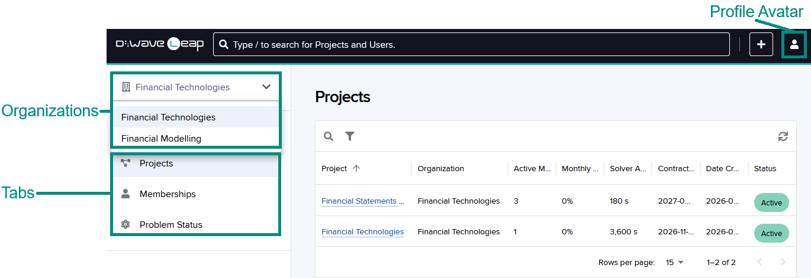

.. include:: ../shared/admin.rst
    :start-after: start_substitutions
    :end-before: end_substitutions

.. _leap_admin:

===================
Leap Administration
===================

If you have project or organization administrator privileges, you can use Leap
Admin to manage your projects or organizations.

.. _admin_overview:

Overview
========

Leap Admin is an easy-to-use cloud-based administration tool that you use to
perform the following major tasks:

*   Manage multiple projects in multiple
    :ref:`organizations <admin_def_organization>`.

*   Invite people to a :ref:`project <admin_def_project>`. Projects are used to
    manage the project's members and their solver access in the Leap service.

*   View the status of problems submitted to solvers.

*   Troubleshoot submission issues.

*   Generate solver usage reports.

For information about |dwave_short| quantum computers, problems, and solvers,
see the :ref:`opt_index_get_started` or :ref:`qpu_index_get_started` topics.

To get started quickly, go to the :ref:`admin_quick_start` topic.

Searching Globally
------------------

Via the Global Search field as shown in :numref:`Figure %s <AdminGlobalSearch>`,
you can search for projects and members across all projects in the current
organization. The text matches any part of a project, or member name (including
an email address).

.. figure:: ../_images/leap_admin_global_search.png
    :name: AdminGlobalSearch
    :alt: Global Search

    Global Search

.. admonition:: Some Limitations
    :name: global_search_limits

    *   Searching is case-insensitive.

    *   For project names, the Latin-1 character set and the Ä, ä, Ö, ö, ẞ, Ü, ü
        characters are supported; however, diacritical marks are ignored.

    *   For member names, only the Latin-1 character set is supported.

    *   The maximum number of characters is 254.

.. tip::
    *   Use the `Up` and `Down` arrow keys to select an item in the results list
        and press `Enter` to go to the selection.

.. _admin_user_roles:

Member Roles and Privileges
---------------------------

A member has one of the following roles and associated privileges. The roles are
hierarchical in the following order, with *Organization Admin* at the
highest level; as such, you can only perform actions for others who are at
your role level and below.

.. tabularcolumns:: |l|p{10.5cm}|

.. list-table:: Member Roles and Privileges
    :widths: 1 3

    *   -   **Organization Admin**
        -   Project member who has the following privileges in the organization
            and its projects:

            *   Perform any project administrator tasks.

            *   Change a project's name.

    *   -   **Project Admin**
        -   Project member who has the following privileges in the project:

            *   Perform any user tasks.

            *   Manage invitations.

            *   View limited project-level member information.

            *   Remove members from a project.

            *   Change a member's role.

            *   Change a member's solver-access time.

            *   Manage problems.

    *   -   **User**
        -   Project member who has the following privileges in the project:

            *   Manage and submit their problems to solvers.

            *   Manage their own profile settings.

            *   Reset their API token.

            Members that have the *User* role cannot access Leap Admin.

Customizing How Information Is Displayed
----------------------------------------

Leap Admin's user interface is quite intuitive; you can filter and sort data
as well as customize the arrangement of columns using actions on the various
tabs and sections (e.g., **Projects**, **Problem Status**, and
**Solver Access Time Schedule**) by clicking the icons in the table headings or
above the table. Some icons are hidden until you place the pointer over data
that you want to act on; for example, placing the pointer over a problem ID
displays **Copy** |copy_icon|.

Some actions include the following:

*   Filtering rows by matching data in the rows

*   Sorting data in columns in ascending or descending order

*   Setting units for the data (e.g., time in units of seconds,
    minutes, hours, or all of them)

*   Reordering columns, including pinning a column to the left or right side
    of the table

*   Hiding and showing columns

.. tip:: 
    
    *   Filtering and sorting is case-insensitive.
        
    *   When filtering and sorting on project names, diacritical marks on the
        Ä, ä, Ö, ö, Ü, ü characters are ignored. Also, although project names
        that differ only by diacritical mark are grouped together, they may not
        always be sorted in the same order.

Terminology and Conventions
---------------------------

*   **Application**

    A program that submits problems to solvers.

.. _admin_def_organization:

*   **Organization**

    Any organization such as a company or institution that has one or more
    associated projects.

.. _admin_def_organization_administrator:

*   **Organization administrator**

    A project member who has the Organization Admin role.

.. _admin_def_project:

*   **Project**

    A logical or organizational grouping of project members that is used to
    manage members' solver access.

.. _admin_def_project_administrator:

*   **Project administrator**

    A project member who has the Project Admin role.

.. _admin_def_project_member:

*   **Project member**

    A user who has joined a project in the Leap service, also known as a
    *member*.

.. _admin_def_role:

*   **Role**

    A role gives a member the privileges to perform specific actions in a
    project or organization. A role can be either *Project Admin*, *User*, or
    *Organization Admin*. The *Project Admin* role is intended for people who
    administer a project. The *Organization Admin* role is intended for people
    who administer an organization and its associated projects. Only members
    with the *Project Admin* or *Organization Admin* role can access Leap Admin.
    The *User* role is intended for people whose main activity is submitting
    problems.
    
    For more information, see :ref:`admin_user_roles`.

.. _admin_def_seat:

*   **Seat**

    A seat represents access to a project's solvers for a single member or
    application. A customer contract specifies the number of seats that are
    available for each seat type.

.. _admin_def_seat_type:

*   **Seat type**

    |seat_type_def|

    For more information, see :ref:`admin_seat_types`.

.. _admin_def_solver_access_limit:

*   **Solver access limit**

    |solver_access_limit|

.. _admin_def_sat_record:

*   **Solver-access time record**

    A solver-access time record is an amount of solver-access time for a
    specific period of days.

    For more information, see :ref:`sat_record`.

For sequential steps in the user interface, variables are indicated
in italics; for example, **Leap Admin** > *project_name*.

.. _admin_quick_start:

Quick Start
===========

The goal of this topic is to invite people to a
:ref:`seat-based project <admin_project_seat_time>`.

To log in to Leap Admin, you must have received an email to join a project as a
project administrator. A project administrator for a project is a member who has
the *Project Admin* role in that project. If you did not receive an email
invitation as expected, contact your organization administrator or
|support_email|_.

.. note:: If your invitation has expired or if you did not receive one, contact
    |support_email|_.

To invite people to a project, perform the following tasks:

*   :ref:`admin_logging_in`

*   :ref:`admin_project_inviting_users_join`

.. _admin_logging_in:

Logging in to Leap Admin
------------------------

1.  Log in to the Leap service at `<https://cloud.dwavesys.com/leap/login/>`_.

2.  In the upper right corner of the dashboard, select **Profile Avatar**
    |profile_avatar_icon| > **Leap Admin** as shown in
    :numref:`Figure %s <DashboardLeapAdminLogin>`.

    .. _fig_dashboard_leap_admin_login:

    .. figure:: ../_images/leap_admin_dashboard_login.png
        :name: DashboardLeapAdminLogin
        :alt: Leap Admin Login Menu
        :width: 25 %

        Leap Admin: Login Menu

.. note::
    If you are a project administrator for multiple projects,
    select **Profile Avatar** |profile_avatar_icon| > **Leap Admin** >
    *project_name*.

.. _admin_project_inviting_users_join:

Inviting People to a Project
----------------------------

#.  In the upper-right corner, click |plus_icon| > **Invite User** and make the
    appropriate selections.

    You may find the following field descriptions helpful:

    *   **Role**: A *role* gives a member the privileges to perform specific
        actions in a project. For more information, see :ref:`admin_user_roles`.

    *   **Seat Type**: For more information, see the following sections:

        *   :ref:`admin_seat_types`

        *   :ref:`admin_inviting_users_join`

    .. tip::
    
        *   As a best practice, invite additional project and organization
            administrators as backups.

        *   If the desired email address is not allowed as specified
            (individually or by pattern) in the **Allowed Email Settings**
            section on the **Overview** page, contact |support_email|_.

.. _admin_managing_organizations:

Managing Organizations
======================

A customer contract defines an organization, which represents a company or
institution in the Leap service. An organization contains one or more projects.

.. note::
    *   Only organization administrators can view organizations.

    *   To create an organization, contact |support_email|_.

When you open an organization, the organization page is displayed as shown in
:numref:`Figure %s <AdminOrgPage>`, where tabs organize tasks into logical groups.
If you have more than one organization, you can select one via a dropdown list.

    Leap Admin: Organization Page

Organization Administrators
---------------------------

:ref:`Organization administrators <admin_def_organization_administrator>` can
invite people to the Leap service in any :ref:`role <admin_def_role>` as well as
administer many aspects of the projects contained in their organization,
including performing all tasks that a project administrator can.

Viewing Summary Information for Projects
----------------------------------------

The organization's **Projects** tab displays summary information for all
projects in an organization.

You may find the following field descriptions helpful:

*   **Monthly Usage**: Amount of solver-access time that has been consumed in
    the project for the month.

*   **Solver Access Time**: Amount of solver-access time aggregated over all
    active :ref:`records <sat_record>` for the project.

*   **Status**: Status of the project. For a description of project
    statuses, see the :ref:`admin_proj_status_viewing` section.

.. _admin_managing_organizations_status_viewing:

Viewing Organization Status
---------------------------

An organization's status is the state of the organization in the organization
life cycle and is displayed next to the organization name on the organization's
page. The life-cycle states are the following:

.. tabularcolumns:: |l|L|

.. list-table:: Organization Status
    :widths: 1 3

    *   -   **New**
        -   The organization has been created, but none of its projects have
            started as determined by the earliest start date of any project's
            solver-access time allocation.

    *   -   **Active**
        -   At least one of the organization's projects has started as
            determined by the earliest start date of any project's solver-access
            time allocation.

    *   -   **Expired**
        -   The end date of all solver-access time allocations in all the
            organization's projects has been reached.

.. _admin_managing_projects:

Managing Projects
=================

A customer contract defines each project, including the
:ref:`project type <admin_project_seat_time>` (seat- or time-based), the solvers
that are available, and the allowed email addresses for project members.

In addition to viewing the email domains and subdomains (or individual email
addresses) of the people who can be invited (also known as the "allowed email
list") and project-level information such as the available solvers and the
project's :ref:`seats <admin_def_seat>`, you can change a few project
settings, such as its :ref:`customer reference ID <admin_project_info_viewing>`,
members' limits on solver-access time, and
:ref:`seat types <admin_seat_changing_user>`.

.. note::
    To create a project or change a project's allowed email list, contact
    |support_email|_.

When you open a project, the project page is displayed as shown in
:numref:`Figure %s <AdminProjectPage>`, where tabs organize tasks into logical
groups.

.. figure:: ../_images/leap_admin_project_admin_project_page.png
    :name: AdminProjectPage
    :alt: Leap Admin Project Page

    Leap Admin: Project Page

.. _admin_project_seat_time:

Seat- versus Time-based Projects
--------------------------------

Both seat- and time-based projects are supported as follows:

*   Seat-based projects enable you to easily assign a project member, such as a
    developer whose main activity is submitting problems, to a
    :ref:`seat <admin_def_seat>` of a predefined :ref:`type <admin_seat_types>`
    that best meets the member's intended use.

*   Time-based projects do not have seats; instead you allocate an amount of
    solver-access time to each project member.

.. _admin_project_info_viewing:

Viewing Basic Information
-------------------------

Basic information about the project, such as its status is displayed on the
project's title banner.

You may find the following field descriptions helpful.

.. tabularcolumns:: |l|L|

.. list-table:: **Overview** Section
    :widths: 1 3

    *   -   **Project Code**
        -   Unique identifier for a project. It is used for internal purposes,
            such as a prefix for the project's API token.

    *   -   **Project Type**
        -   Classification of the project as determined by the customer contract;
            for example, Development.

    *   -   **Customer Reference ID**
        -   ID that you provide and which can be used for your specific internal
            processes.

.. tabularcolumns:: |l|L|

.. list-table:: **Current Usage** Section (Time-based Projects Only)
    :widths: 1 3

    *   -   **Monthly Usage**
        -   Amount and percent of solver-access time used in the project for the
            current renewal period.

Viewing Project Seats
---------------------

Each project member, whether a person or an application, occupies a single seat
of a given type. The number of seats and seat types are determined by the
customer contract. Each row in the **Project Seats** section represents a
particular seat type, including such information as the number of seats
currently occupied and the limit on solver-access time.

You may find the following field descriptions helpful.

.. tabularcolumns:: |l|L|

.. list-table::

    *   -   **Seat Type**
        -   The name of the seat type.

    *   -   **Seats Occupied**
        -   A seat is considered to be occupied once an invitation has been
            sent.

            The number of members in a project at any one time cannot exceed
            the total number of seats available for all seat types.

    *   -   **Solver Access Limit**
        -   |solver_access_limit|

To change a member's seat type, see the :ref:`admin_seat_changing_user` section.

.. _admin_seat_types:

Seat Types
~~~~~~~~~~

|seat_type_def|

You can switch a member or application between seat types, but a member or
application can only occupy one seat type at any one time.

Examples of seat types are as follows:

.. tabularcolumns:: |l|p{10.5cm}|

.. list-table:: Seat Types
    :widths: 1 3

    *   -   **User**
        -   Intended for members whose main activity is submitting problems;
            for example, a developer. This seat type provides an unlimited
            amount of solver-access time.

    *   -   **Observer**
        -   Intended for members whose main activity is administration or
            troubleshooting; they do not submit problems frequently. This seat
            type provides a limited amount of solver-access time.

    *   -   **Service Account**
        -   Intended for applications that submit problems; for example, a
            production application that submits problems on a schedule. This
            seat type provides an unlimited amount of solver-access time.

    *   -   **Inactive**
        -   Intended for members who should remain in the project but are
            temporarily inactive. They cannot submit problems to solvers.

Viewing Solver-Access Time
--------------------------

The **Solver Access Time Schedule** section displays the solver-access time
records as determined by the customer contract.

.. tip:: A project administrator receives a notification when the project's
    solver-access time reaches 80%.

You may find the following field descriptions helpful.

.. tabularcolumns:: |l|L|

.. list-table:: **Solver Access Time Schedule** Section

    *   -   **Monthly Solver Access Time**
        -   A record's amount of solver-access time available for each renewal
            period. Consumption of solver-access time is aggregated across all
            regions.

            **Note:** The maximum number of problems per member that can be in
            a solver queue is 1,000; if this maximum is exceeded, then problems
            are rejected.

    *   -   **Allocation Start Date (UTC)**
        -   The date (inclusive) that access is provided to solvers. This date
            is determined by the customer contract.

    *   -   **Allocation End Date (UTC)**
        -   The date (inclusive) that access to solvers ends. This date is
            determined by the customer contract.

    *   -   **Anniversary Date (UTC)**
        -   The anniversary date is used to calculate the renewal date for
            monthly solver-access time.

    *   -   **Status**
        -   **Active**: The current date is between the record's start and end
            dates. Only active records contribute solver-access time.

            **Disabled**: The record was disabled by |dwave_short|.

            **Scheduled**: The record has been scheduled for activation beyond
            the current date. When the current date reaches the record's start
            date, then the record is activated.

            **Expired**: The current date has passed the record's end date.

.. _sat_record:

Solver-Access Time Records
~~~~~~~~~~~~~~~~~~~~~~~~~~

A solver-access time record is an amount of solver-access time for a specific
period of days. A gap or overlap of solver-access time can occur between
records. For example, if a new contract states that solver-access time be
increased by 1 hour for September, then instead of increasing the solver-access
time for an existing record, a separate record is created for 1 hour of
solver-access time from September 1 to 30.

Thus, record periods (in units of whole days) can be contiguous, overlap, or
have gaps between them. :numref:`Figure %s <ExampleSolverAccessTimeRecords>`
illustrates the following:

*   A gap occurs between the set of records 1 and record 2 because the latest
    end date in the set of records 1 is not contiguous with the start date in
    record 2.

*   The records in the set of records 1 are contiguous.

*   In the set of records 1, the first and second records overlap.

.. figure:: ../_images/leap_admin_solver_time_alloc_record.png
    :name: ExampleSolverAccessTimeRecords
    :alt: Example of Solver-Access Time Records

    Example of Solver-Access Time Records

Renewal Date
~~~~~~~~~~~~

Solver-access time renews every month simultaneously for all active records.
The renewal date is the day of the month that is specified in the anniversary
date for all active records; however, if the anniversary date's day of the month
is greater than the last day of a renewal month, then the renewal date is the
last day of the month. For example, if the anniversary date is January 31, then
the next renewal date is February 28 (or February 29 in a leap year).

.. note::
    If there is a gap between records and the first one expires, then the
    renewal date is set to the next record's renewal date, which might differ
    from the first record's renewal date.

Anniversary Date
~~~~~~~~~~~~~~~~

When a record is created, the anniversary date is automatically calculated as
follows:

*   The anniversary date is the start date of the new record, if either of the
    following is true:

    *   The new record is the only active or scheduled record in the project.

    *   There is a gap between the new record and an active or scheduled record.

*   The anniversary date is the same as the existing active or scheduled records
    if the new record is contiguous with those existing records.

Viewing Available Solvers
-------------------------

You view the solvers that are available in a project in its **Overview**
> **Solver Access Summary** section.

Solvers are specific to a region (for example, Europe or North America). To
display the solvers for a region, click the region name. The solvers that are
available in a project are determined by the customer contract.

To view a solver's properties and parameters, click its name in the
**Solver Name** column. For more information on solver properties and
parameters, see the :ref:`opt_index_properties_parameters` and
:ref:`index_quantum_research` sections.

.. _admin_proj_status_viewing:

Viewing Project Status
----------------------

A project's status is the state of the project in the project life cycle as
follows:

.. tip:: Project status is displayed in the project page's title banner.

.. tabularcolumns:: |l|L|

.. list-table:: Project Status
    :widths: 1 3

    *   -   **New**
        -   The project has been created, but its start date has not been
            reached. You can specify the people to be invited, but the
            invitations themselves are not sent until the start date has been
            reached.

    *   -   **Active**
        -   The project has started as determined by its start date.

            **Note:** Invitations that have been scheduled are sent on the start
            date.

    *   -   **Suspended**
        -   The project cannot be used.

            **Note:** This is an exception state. If you believe your project
            should not have been suspended, contact |support_email|_.

    *   -   **Expired**
        -   The end date for the project's solver-access time has been reached.
            Project members can still log in to the project, but cannot run
            problems on the solvers.

.. _admin_solver_time_default_all:

Changing the Solver-Access Time Limit for Time-based Projects
-------------------------------------------------------------

.. note:: This feature applies to time-based projects only.

By default, any one project member can use up all of a project's monthly
solver-access time. If you want to change this default or set a different limit
for an individual member, do the following:

#.  Edit the project page and deselect the **Set Default Solver Access to Unlimited** 
    option.

#.  In the **Default Solver Access Limit** field, specify the default limit on
    solver-access time for new members who accept the invitation for the project
    after this field has been set. Existing members are not impacted; they retain
    the current limit on their solver-access time.

    You can override this default limit for an individual member; to do so, see
    the :ref:`admin_user_solver_time` section.

.. [#] Solvers have different usage rates. For more information, see the
    :ref:`qpu_operation_timing` section.

.. _admin_managing_project_members:

Managing Project Members
========================

You manage project members by first inviting people to join a project and
managing the invitation process, including sending them reminders to accept the
invitation and revoking invitations. You can also change members'
:ref:`roles <admin_user_roles>`, :ref:`seat types <admin_seat_types>`,
and :ref:`solver-access time limits <admin_def_solver_access_limit>` as well as
remove members from projects.

.. _admin_inviting_users_join:

Inviting People to Join a Project
---------------------------------

You invite people to join a project by sending them email invitations via Leap
Admin. To join the project, the person must accept the invitation by clicking
the link in the email. A person who is new to the Leap service must also create
an account.

Invitations expire after 30 days; you can send reminders to people who have
active invitations. If an invitation expires or is revoked, you can send a new
invitation.

Access to the Leap service is supported only from certain regions. For more
information, see the
`From What Countries Can I Access D-Wave's Leap Quantum Cloud Service
<https://support.dwavesys.com/hc/en-us/articles/360051869733>`_ article.

When creating an account or joining a project, the person might be required to
accept the |dwave_short| terms and conditions. The customer contract determines
whether or not this is required for people joining the project.

.. note::
    To change whether accepting terms and conditions is required or not,
    contact |support_email|_.

Procedure
~~~~~~~~~

To invite people to join a project or organization, click |plus_icon| >
**Invite User** and specify the fields.

You may find the following field descriptions helpful.

.. tabularcolumns:: |l|p{9cm}|

.. list-table:: Invitation Dialog Box

    *   -   **Organization**
        -   (Read-only) Organization to which you are inviting people.

    *   -   **Project**
        -   Project to which you are inviting people.

    *   -   **Seat Type**
        -   An available seat type for the invitees. For more information,
            see the :ref:`admin_seat_types` section.

    *   -   **Email**
        -   Email addresses or member names (if they already exist in the
            Leap service) of the people you want to invite to the project.

            **Tip:**

            *   You can copy and paste multiple email addresses from either
                a single column in an Excel spreadsheet or a semicolon-,
                space-, new line-, or comma-delimited list (for example, a
                CSV file).

        **Note:** If the desired email address is not allowed as specified
        (individually or by pattern) in the **Allowed Email Settings**
        section on the **Overview** page, contact |support_email|_.

*   -   **Role**
    -   One of the project member :ref:`roles <admin_user_roles>` to assign
        to a person: **User**, **Project Admin**, or **Organization Admin**.
        Only an organization administrator can assign the
        **Organization Admin** role.

        Once people occupy seats in a project, they have the privileges
        associated with their role as described in :ref:`admin_user_roles`;
        for example, access to the project's solvers.

*   -   **Set Solver Access to Unlimited** (time-based projects only)
    -   Maximum amount of solver-access time available per month for the
        specified invitees. You set this maximum with one of the
        following options:

        *   *Deselected*

            (Default) This field is set to the amount of solver-access
            time in the **Project Member Default Solver Access Limit**
            field.

        *   *Selected*

        Sets the maximum amount of solver-access time to the same as
        that of the project's **Default Solver Access Limit** field.

.. _admin_member_status_viewing:

Viewing the Status of a Member
------------------------------

To view the status of a member, go to the **Project Members** tab and look at
the **Membership Status** column.

.. tabularcolumns:: |l|L|

.. list-table:: **Membership Status** Column
    :widths: 1 3

    *   -   **Invitation Pending**
        -   The invitation has been created but not sent because the project has
            not started.

    *   -   **Invitation Sent**
        -   The person has been invited to the project, but has not accepted.
            You can send a reminder.

    *   -   **Invitation Revoked**
        -   The invitation has been revoked.

    *   -   **Invitation Expired**
        -   The invitation to the person has expired. An invitation expires
            after 7 days. You can send a reminder.

    *   -   **Active**
        -   The person has accepted the invitation.

    *   -   **Solver Access Expired**
        -   The member's solver-access time has expired for the project.

    *   -   **Inactive**
        -   The person is no longer a member of the project; however, the person
            might still be a member of another project. Nevertheless, the
            person's statistics such as the problems they submitted and problem
            access time used are still displayed in the project.

            **Note:** This status is displayed for historical purposes.

Sending Reminders
-----------------

You can send invitation reminders to one or more invitees.

*   To send an invitation reminder to an invitee, click |meatball_menu| >
    **Send Invitation Reminder**.

*   To send invitation reminders to multiple invitees simultaneously, select the
    invitees to which to send invitation reminders and use **Manage Selected**
    |multiselect_menu|.

Resending Invitations
---------------------

You can resend invitations that have expired.

*   To resend an invitation, click |meatball_menu| >
    **Resend invitation** in the table on the **Project Members** tab.

*   To resend the invitation to multiple invitees simultaneously, select the
    invitees for which to resend invitations and use **Manage Selected**
    |multiselect_menu|.

Revoking Invitations
--------------------

You can revoke invitations for one or more invitees.

*   To revoke the invitation for an invitee, click |meatball_menu| >
    **Revoke invitation** in the table on the **Project Members** tab.

*   To revoke the invitations for multiple invitees simultaneously, select the 
    invitees for which to revoke invitations and use **Manage Selected**
    |multiselect_menu|.

Viewing Member Information
--------------------------

A list of members is displayed on the **Project Members** tab as follows:

.. tabularcolumns:: |l|L|

.. list-table:: **Project Members** Tab
    :widths: 1 3

    *   -   **User**
        -   Name and email address of the member. Click the name to display
            more information about the member.

            **Note**

            *   Only people who have created accounts in the Leap service
                would have more information about them to display; for example,
                a person who has the **Invitation Sent** member status would not
                have created an account.

            *   A member with a user name of **Archived User** represents a user
                account that has had its personal identifiable information (PII)
                anonymized or removed.

    *   -   **Seat Type**
        -   A seat type gives a member a certain amount of solver-access time.

            For more information, see :ref:`admin_seat_types`.

    *   -   **Role**
        -   A role gives a member certain privileges. For more information, see
            :ref:`admin_user_roles`.

    *   -   **Project Usage for Month**
        -   Displays the amount of solver-access time that a member has consumed
            for all solvers during the monthly renewal period. Solvers have
            different usage rates. For more information, see the
            :ref:`qpu_operation_timing` section.

    *   -   **Solver Access Limit**
        -   Displays the amount of solver-access time that is allocated to a
            member.

    *   -   **Membership Status**
        -   The status of the member in the project. For more information, see
            :ref:`admin_member_status_viewing`.

To display information about a specific member, click the project's
**Memberships** tab > *member_name*.

.. _admin_seat_changing_user:

Changing a Project Member's Seat Type
-------------------------------------

On the project's **Project Members** tab, click |meatball_menu| for a member
in the table and select **Change seat type**.

For example, if a project member who occupies a **User** seat is on vacation,
you could temporarily free up their seat by changing their seat type to
**Inactive** and then inviting another person to occupy the seat and submit
problems until the vacationing member returns.

.. note:: Switching a member or application to a seat type with less
    solver-access time than already consumed in the current period disables
    problem submission for that member or application until the next period.

.. _admin_user_solver_time:

Modifying the Limit on a Member's Solver-Access Time
----------------------------------------------------

#.  On the **Project Members** tab, click |meatball_menu| for a member in the
    table and select **Modify Solver Access Limit**.

    *   For multiple members simultaneously, select the members to modify and
        use **Manage Selected** |multiselect_menu|.

#.  In the **Modify Solver Access Time** dialog box, select one of the following
    to set the desired limit on solver-access time:

    *   **Use Seat-Type Default** --- Sets the maximum amount of solver-access
        time to the seat type's solver-access limit as specified in the
        **Seat-Type Default Limit** field.

    *   **Custom Amount** --- Sets the maximum amount of solver-access time
        to this custom value. This value must be equal to or less than the seat
        type's solver-access limit as specified in the
        **Seat-Type Default Limit** field.

        For time-based projects, sets the maximum amount of solver-access time
        to the lower of either this custom value or the sum of the project's
        active solver-access time records.

    *   **Use Project Default** (time-based projects only) ---
        Sets the maximum amount of solver-access time to the lower of either the
        value in the
        :ref:`Project Member Default Solver Access Limit <admin_solver_time_default_all>`
        field or the sum of the project's active solver-access time records.

    *   **Unlimited Access to Project Solver Time** (time-based projects only)
        --- Sets the maximum amount of solver-access time to the full monthly
        solver-access time allocated to the project as determined by the sum of
        the project's active solver-access time records.

.. _admin_user_role_change:

Changing a Member's Role
------------------------

On the **Project Members** tab, click |meatball_menu| for a member in the table
and select one of the following:

*   **Remove Project Admin Role**

    Changes the member's role to *User*.

    .. note:: You cannot remove your own Project Admin role. Instead, ask
        another organization or project administrator to do so.

*   **Remove Organization Admin Role**

    Changes the member's role to *User* or *Project Admin*, whichever was the
    member's previous role. Only an organization administrator can perform this
    action.

    .. note:: You cannot remove your own Organization Admin role. Instead, ask
        another organization administrator to do so.

*   **Assign project admin**

    Changes the member's role to *Project Admin*.

*   **Assign organization admin**

    Changes the member's role to *Organization Admin*. Only an organization
    administrator can perform this action.

Removing Members From a Project
-------------------------------

You can remove one or more members simultaneously.

.. note:: You can only remove members whose membership status is *Active*.

*   On the **Project Members** tab, click |meatball_menu| for a member and
    select **Remove from project**.

*   To remove multiple members simultaneously, select the members to remove and
    use **Manage Selected** |multiselect_menu|.

When members are removed, their statuses change to `Inactive` for the project
and they can no longer use the solvers in the project. However, their usage
statistics are preserved for historical purposes.

If you remove a member with the Org Admin role from that member's last project,
then the Org Admin role is also removed from the member.

If you want a person to rejoin a project or return as an organization
administrator, send an invitation as described in
:ref:`admin_inviting_users_join`.

If you are the only organization administrator in an organization and you remove
yourself from your last project, your *Org Admin* role is removed and you will
not be able to access the organization in Leap Admin. To reinstate access,
contact |support_email|_.

.. _admin_problem_status:

Managing Problem Submissions
============================

You manage problem submissions by viewing the status and details of problem
submissions and cancelling problem submissions.

.. _admin_problem_status_viewing:

Viewing the Status of Problem Submissions
-----------------------------------------

To view the status of problems submitted to a project's solvers, go to the
**Problem Status** tab.

.. tip::

    *   To display the most up-to-date status, click the **Refresh Table**
        |refresh_icon|.

    *   To copy a problem ID to the clipboard, place the pointer over the
        problem ID and click the subsequently displayed **Copy** |copy_icon| icon.

    *   If multiple regions are available, you can display the problems
        submitted only to a specific region's solvers by using **Regions**
        |region_icon|.

You may find the following field descriptions helpful.

.. tabularcolumns:: |l|L|

.. list-table:: **Problem Status** Tab
    :widths: 1 3

    *   -   **Problem**
        -   The problem's ID or label. The ID is system-generated.

    *   -   **Status**
        -   The status of the submitted problem. For more information, see
            :ref:`admin_problem_submission_status`.

.. _admin_problem_submission_status:

Problem Submission Statuses
~~~~~~~~~~~~~~~~~~~~~~~~~~~

In the **Problem Status** column, the status of each problem submission can be
one of the following:

.. tabularcolumns:: |l|L|

.. list-table:: **Problem Status** Column
    :widths: 1 3

    *   -   **Pending**
        -   The problem was submitted, but the solver has not started working
            on a solution.

    *   -   **In-Progress**
        -   The problem was submitted and the solver is working on a solution.

    *   -   **Completed**
        -   The solver has successfully completed its work on the problem.

    *   -   **Cancelling**
        -   A request to cancel work on a problem is being processed.

    *   -   **Cancelled**
        -   Work on the problem has been cancelled. Cancelled problems do not
            use any solver-access time.

    *   -   **Failed**
        -   Work on the problem did not successfully complete. Failed problems
            do not use any solver-access time.

Viewing Problem Submission Details
----------------------------------

To view a problem's details, click a problem ID or problem label on the
**Problem Status** tab. The following information is displayed:

.. tabularcolumns:: |l|L|

.. list-table:: **Problem Status** Tab
    :widths: 1 3

    *   -   **Problem Parameters**
        -   Displays the problem's parameters, ID, solver, problem type, status,
            and embedded problem data. For more information, see the
            :ref:`opt_index_properties_parameters` and :ref:`index_quantum_research`
            sections.

    *   -   **Solution**
        -   Displays the resulting sample set, if available for the solver. You
            can export the sample set along with its visualization.

    *   -   **Timing**
        -   Displays timing parameters for the problem. For more information,
            see the :ref:`qpu_operation_timing` section.

Cancelling Problem Submissions
------------------------------

To cancel pending or in-progress problems, select the problems and click the
**Cancel Problems** **X**.

Cancelled problems do not use any solver-access time.

.. tip::
    *   Before cancelling problem submissions, display the most up-to-date
        status by clicking **Refresh Table** |refresh_icon|.

    *   If you run scripts to continually submit problems, refresh the table
        after cancelling problem submissions to confirm that the cancellation
        attempts succeeded.

.. _admin_reports:

Generating Solver Usage Reports
===============================

Reports on solver usage contain statistics that characterize how your projects
and individuals use solver time in a project over a period of time. These
statistics are organized into the following categories:

*   Information about the members who submitted problems

*   Number of submitted problems

*   Solver times with the following details:

    *   Solver category: QPU, hybrid, or custom

    *   Solver names

    *   Totals and subtotals of solver-access times

    *   The unit-of-time scale (for example, daily, monthly, and so forth)
        as specified in the **Aggregate Time Scale** field. For example, if
        **Daily** is selected, then solver usage is expressed as separate daily
        totals within the date range.

The statistics are exported as either an `XLSX` and `CSV` file. See the
spreadsheet column headings for the exact statistics. On the **Reporting** tab,
you specify filters for the statistics.

To configure and generate solver usage reports, go to the **Reporting** tab and
specify the desired filter fields.

.. tip::
    *   To get all values for a field, leave it blank. For example, to generate
        statistics for all members, leave the **Users** field blank.

    *   To reset the filter fields to their default values, click
        **Reset Template**.