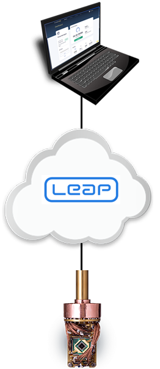

.. _index_leap_sapi:

============
Leap Service
============

.. toctree::
    :hidden:
    :maxdepth: 1

    dev_env
    admin
    sapi_rest
    Leap Service Release Notes <https://docs.dwavequantum.com/projects/leap_sapi/en/latest/index.html>

Launched in 2018, the |cloud_tm| quantum cloud service from |dwave_short|_
brings quantum computing to the real world by providing real-time cloud access
to our systems.

.. sections-start-marker

.. grid:: 2 2 3 3
    :gutter: 2

    .. grid-item-card:: :ref:`leap_dev_env`
        :img-top: /_images/ide_icon.svg
        :link: leap_dev_env
        :link-type: ref

        Description of Leap support for third-party IDEs.

    .. grid-item-card:: :ref:`leap_admin`
        :img-top: /_images/leap_admin_icon.svg
        :link: leap_admin
        :link-type: ref

        Description of how project administrators manage access
        to projects in Leap.

    .. grid-item-card:: :ref:`leap_sapi_rest`
        :img-top: /_images/rest_api_icon.svg
        :link: leap_sapi_rest
        :link-type: ref

        Reference documentation for the :term:`Solver API <SAPI>` (SAPI)
        REST interface.

    .. grid-item-card:: Leap Service Release Notes
        :img-top: /_images/release_notes_icon.svg
        :link: https://docs.dwavequantum.com/projects/leap_sapi/en/latest/index.html
        :link-type: url

        Leap service release notes, fixed and open issues.

.. sections-end-marker

      computer through the cloud.
    :scale: 50 %

You use the Leap service to do the following:

*   Submit problems to |dwave_short| quantum computers,
    including :ref:`hybrid solvers <opt_index_properties_parameters>`, which use a
    combination of classical and quantum resources and can accept extremely
    large problems.

*   Get started quickly and write your quantum applications using an integrated
    development environment (IDE) that is compliant with the
    `Development Containers specification <https://containers.dev/supporting>`_,
    for example, cloud-based
    `GitHub Codespaces <https://docs.github.com/codespaces>`_.

*   Run demos and interactive coding examples
    in `Resources <https://cloud.dwavesys.com/leap/resources/demos/>`_.

*   Get involved in
    `our community of like-minded users <https://support.dwavesys.com/hc/en-us/
    community/topics>`_.

*   `Administer projects <https://cloud.dwavesys.com/leap/admin>`_,
    including managing solvers and users together and setting access to solvers
    for those users.

Sign up for the Leap service here: https://cloud.dwavesys.com/leap.

Dashboard
=========

The dashboard is the home for your experience using the Leap service and
contains a considerable amount of useful information. For example, you can
manage your account settings and see the status of problems you have submitted,
usage statistics, solver status, a summary of your account, and your active
project and its associated API token.

You might be a member of multiple projects, but the information displayed on the
dashboard is only for the active project; for example, the solvers that have
been assigned to the active project.

The Leap service supports solvers in multiple regions (for example, North
America and Europe). The dashboard displays the solvers that are available by
region.

.. note::

    You can make a different project active by selecting
    *your_user_name* > **Projects** > *project*.

Solvers
=======

You submit problems to :term:`solvers <solver>`.
Solvers are either quantum processing units (QPUs), classical,\ [#]_ or hybrid;
hybrid solvers use a combination of quantum and classical resources.

.. [#] Classical solvers can be used to test your code during development.

Problem Submission and API Tokens
=================================

To submit a problem, an API token is required. Instead of a user name and
password, an API token is used to authenticate your client session when it
connects to the Leap service. A unique and secure API token is generated
for each of your projects, excluding those with the **Trial Plan** account
type,\ [#]_ and is available on the dashboard. If your API token is shared or
compromised in any way, you should reset it via the dashboard.

To learn about authorizing the Ocean software access to your account in
the Leap service and enabling it to store your API token in your development
environment, see the :ref:`leap_dev_env` section.

Up to 1000 of your most recent problems are stored and accessible in
the Leap service for up to 365 days; if the number of your problems
exceeds 1000, the Leap service begins to delete the oldest ones.

.. [#]  Projects with the **Trial Plan** account type do not include the use of
    API tokens required to submit arbitrary problems to solvers and thus users
    in those projects can only run some demos.

Customer Plans and Access to Solvers
====================================

Your customer plan\ [#]_ and :ref:`seat type <admin_def_seat_type>` in a
project, together with your customer contract (where applicable), determine your
degree of access to solvers; for example, you may not have access to all solvers
that are available in the Leap service. You can view your solver access and
usage for a project on the dashboard.

Users with :ref:`limited solver access <admin_def_solver_access_limit>` can
submit problems to the solvers in a project while their remaining solver-access
time\ [#]_ for that project is sufficient.

.. [#] For information about customer plans, see the
    `Leap Customer Plans <https://cloud.dwavesys.com/leap/plans>`_ page.

.. [#] A user's solver-access time for a project is renewed monthly, subject to
    the customer contract; the renewal date is displayed on the dashboard.

.. _leap_support_for_dev_env:

Support for IDEs
================

The Leap service supports third-party integrated development environments (IDEs)
that are compliant with the Development Containers specification. Examples of
popular, compliant IDEs are cloud-based GitHub Codespaces and locally installed
VS Code.

For more information, see the :ref:`leap_dev_env` section.

Administration
==============

Leap Admin is an easy-to-use cloud-based administration tool.\ [#]_
You use Leap Admin to invite users and manage their access to projects in the
Leap service, view the status of problems submitted to solvers, troubleshoot
submission issues, and generate solver usage reports.

For more information, see the :ref:`leap_admin` section.

.. [#] To administer projects, you must be a project administrator.

Community, Resources, and Help
==============================

The Leap service has many learning resources available as follows:

*   `Community <https://support.dwavesys.com/>`_

    A community space where you can pose questions and provide answers to other
    users of the service.

*   `Resources <https://cloud.dwavesys.com/leap/resources/demos/>`_

    Includes demos and a searchable collection of examples and Jupyter
    notebooks.

*   `Help <https://support.dwavesys.com/>`_

    Includes a frequently asked questions (FAQ) section and a knowledge base.
