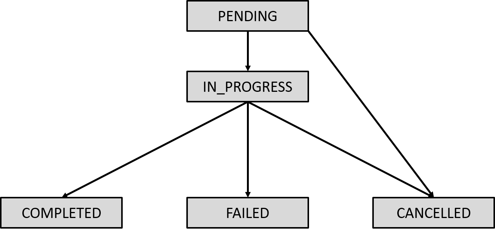

.. _leap_sapi_rest:

===================
SAPI REST Interface
===================

This section includes the following information:

*   :ref:`sapi_rest_intro` introduces HTTP codes, problem lifecycle, SAPI
    versioning, etc.
*   :ref:`sapi_rest_resources` describes the Solver Application Programming
    Interface (SAPI) resources and provides example usages.
*   :ref:`sapi_rest_full_examples` demonstrates using the RESTful interface,
    without Ocean software, on problems to a quantum computer and to a hybrid
    solver.

.. _sapi_rest_intro:

Introduction
============

The Solver API (SAPI) is an interface to |dwave_short| quantum computers
and hybrid and classical :term:`solvers <solver>` in the Leap service. This
section describes the SAPI interface, including the calls you may use to submit
and manage problems and access the available solvers.

A
`REST <https://en.wikipedia.org/wiki/Representational_state_transfer>`_\ -based
web services API, SAPI is fairly simple to use; it exposes only a few basic
calls. Most of the work for you will be restructuring your problem into a format
that the API can answer, and then parsing results.

.. note::

    |dwave_short| provides a full-stack open-source Software Development Kit
    (SDK), :ref:`Ocean SDK <index_ocean_sdk>`. It is recommended that you
    develop your applications on top of that.

This document is intended for developers who want to build their own
applications on top of the SAPI REST interface. Readers should be familiar with
the HTTP protocol.

.. _sapi_rest_general_response_codes:

HTTP Response Codes
-------------------

You can see a list of HTTP response codes
`here <https://en.wikipedia.org/wiki/List_of_HTTP_status_codes>`_.
The following table describes some of the most frequently encountered codes.

.. table:: HTTP Response Codes

    ========================== ================================================
    Code                       Explanation
    ========================== ================================================
    200  OK	                   No error.
    201  CREATED               Creation of a resource was successful.
    202  ACCEPTED              Request such as problem cancellation was
                               received.
    304  NOT MODIFIED          The requested resource has not changed since
                               the time specified in the request's
                               ``If-Modified-Since`` header.
    400  BAD REQUEST           Invalid request URI or header, or unsupported
                               nonstandard parameter.
    401  UNAUTHORIZED          Authorization required. This error can also mean
                               that incorrect user credentials were sent with
                               the request.
    403  FORBIDDEN             Unsupported standard parameter, or
                               authentication or authorization failed.
    404  NOT FOUND             Resource (such as a problem) not found.
    409  CONFLICT              Conflict such as a request for problem
                               cancellation.
                               for a problem that has already terminated.
    429  TOO MANY REQUESTS     API request rate exceeds the permissible limit.
    500  INTERNAL SERVER ERROR Internal error. This is the default code that is
                               used for all unrecognized server errors.
    ========================== ================================================

.. _sapi_rest_lifecycle:

SAPI Problem Lifecycle
----------------------

A problem may have one of the following statuses:

.. table:: Problem Status

    ============ ========================================================
    Status       Description
    ============ ========================================================
    PENDING      Problem was submitted and is queued for processing.
    IN_PROGRESS  Problem is currently being processed.
    COMPLETED    Problem completed successfully.
    FAILED       Problem processing failed.
    CANCELLED    Problem was cancelled.
    ============ ========================================================

        progress to one of the terminal states. The terminal states are
        cancelled, completed, or failed.

    Initially a problem is in the PENDING state. When a solver starts to process
    a problem, its state changes to IN_PROGRESS. After completion, the problem
    status changes to either COMPLETED or FAILED (if an error occurred).
    COMPLETED, FAILED, and CANCELLED are all terminal states. After a problem
    enters a terminal state, its status does not change. Users can cancel
    a problem at any time before it reaches its terminal state.

.. _sapi_rest_version:

SAPI Version
------------

To ensure compatibility, verify the version of the SAPI resource you are using
in your code. You can see the version number in the response header sent from
SAPI.

The base URL and authorization token used in the following example are
explained in the :ref:`sapi_rest_url_token_setup` subsection.

.. testsetup:: rest_live

    import os
    SAPI_TOKEN = os.environ["SAPI_TOKEN"]   # pull-request 528

.. doctest:: rest_live
    :skipif: False

    >>> import requests
    ...
    >>> SAPI_HOME = "https://na-west-1.cloud.dwavesys.com/sapi/v2"
    ... # Replace with your API token
    >>> SAPI_TOKEN = "ABC-1234567...345678"     # doctest: +SKIP
    ...
    >>> r = requests.get(f"{SAPI_HOME}/problems/?max_results=3",
    ...                  headers={'X-Auth-Token': SAPI_TOKEN})
    >>> print(r.headers["Content-Type"])   # doctest: +SKIP
    application/vnd.dwave.sapi.problems+json; version=2.1.0; charset=utf-8

.. |general error responses| replace:: In addition to generic client and server
    :ref:`error responses <sapi_rest_general_response_codes>`, SAPI may return
    particular error codes.

.. _sapi_rest_resources:

Resources
=========

.. testsetup:: rest_live

    import os
    SAPI_TOKEN = os.environ["SAPI_TOKEN"]   # pull-request 528

This chapter describes supported Solver Application Programming Interface (SAPI)
resources and provides example usages.

.. _sapi_rest_resources_setup:

Examples Setup
--------------

The examples below use the following setup:

.. tab-set::

    .. tab-item:: Python

        .. doctest:: rest_live
            :skipif: False

            >>> import base64
            >>> import hashlib
            >>> import json
            >>> import os
            >>> import requests
            >>> import struct
            >>> from urllib.parse import urlencode
            ...
            >>> SAPI_HOME = "https://na-west-1.cloud.dwavesys.com/sapi/v2"
            ... # Replace with your API token
            >>> SAPI_TOKEN = "ABC-1234567...345678"     # doctest: +SKIP
            ...
            >>> session = requests.Session()
            >>> session.headers = {'X-Auth-Token': SAPI_TOKEN,
            ...                    'Content-type': 'application/json'}

        For some examples of uploading problems to the Leap service's
        quantum-classical hybrid solvers, a serialized binary quadratic model
        (:math:`\text{E} = -ab`) is also used. The following code uses
        :ref:`Ocean software <index_ocean_sdk>` to serialize the problem to the
        required format.\ [#]_

        .. doctest:: rest_live
            :skipif: False

            >>> import dimod
            >>> bqm = dimod.BinaryQuadraticModel({}, {'xy': -1}, 'BINARY')
            >>> bqm_ser = bqm.to_file().read()

        .. [#]
            For details of the required format, see the
            :ref:`dimod <index_dimod>` :meth:`~dimod.QuadraticModel.to_file`
            method.

            .. dropdown:: Example serialized file

                .. include:: ../shared/sapi_rest.rst
                    :start-after: start_bqm_file
                    :end-before: end_bqm_file

    .. tab-item:: cURL

        .. code-block:: bash

            $ export SAPI_HOME=https://na-west-1.cloud.dwavesys.com/sapi/v2
            $ export SAPI_TOKEN=ABC-1234567...345678    # Replace with your API token

        For some examples of uploading problems to the Leap service's
        quantum-classical hybrid solvers, a serialized binary quadratic model
        (:math:`\text{E} = -ab`) is also used.
        The :ref:`dimod <index_dimod>` :meth:`~dimod.QuadraticModel.to_file`
        method is used to serialize the problem, which is saved to a file.

        .. dropdown:: Example serialized file

            .. include:: ../shared/sapi_rest.rst
                :start-after: start_bqm_file
                :end-before: end_bqm_file

SAPI Resources
--------------

SAPI provides the following resources and methods.

.. table:: SAPI Resources

    ============================================ ====== =========================================
    Resource                                     Method Reference
    ============================================ ====== =========================================
    /bqm/multipart                               POST   :ref:`sapi_rest_get_multi_id`
    /bqm/multipart/<problem_data_id>/part/<part> PUT    :ref:`sapi_rest_upload_multi_parts`
    /bqm/multipart/<problem_data_id>/combine     POST   :ref:`sapi_rest_upload_multi_md5`
    /bqm/multipart/<problem_data_id>/status      GET    :ref:`sapi_rest_upload_multi_status`
    /problems/                                   POST   :ref:`sapi_rest_submit_problem`
    /problems/                                   DELETE :ref:`sapi_rest_cancel_many_problems`
    /problems/<problem_id>                       DELETE :ref:`sapi_rest_cancel_problem_by_id`
    /problems/                                   GET    :ref:`sapi_rest_list_problems`
    /problems/<problem_id>/                      GET    :ref:`sapi_rest_get_problem`
    /problems/<problem_id>/info                  GET    :ref:`sapi_rest_get_problem_info`
    /problems/<problem_id>/answer/               GET    :ref:`sapi_rest_get_problem_answer`
    /problems/<problem_id>/messages/             GET    :ref:`sapi_rest_get_problem_messages`
    /solvers/remote/                             GET    :ref:`sapi_rest_list_remote_solvers`
    /solvers/remote/<solver_id>/                 GET    :ref:`sapi_rest_get_remote_solver_config`
    ============================================ ====== =========================================

.. _sapi_rest_get_multi_id:

Initiate Upload of Problem Data
-------------------------------

For quantum-classical hybrid solvers in the Leap service, you must upload your
problem using the ``$SAPI_HOME/bqm/multipart/*`` endpoints before submitting a
SAPI request to run the problem. For large problems (starting from several
megabytes and higher), upload the problem data in multiple parts.

*   Maximum problem size currently supported is 50 GB.
*   Size of all parts must be 5M (5242880 bytes), except the last, which may be
    smaller.

To initiate the uploading of a problem, in a single part for small problems or
multiple parts for problems of several megabytes and higher, send an HTTP POST
request to ``bqm/multipart``.

The POST request body should contain the number of bytes---``size``, as an
integer---required to store the problem.

SAPI returns an identifier, of type
`UUID <https://en.wikipedia.org/wiki/Universally_unique_identifier>`_, for the
uploaded problem.

.. tab-set::

    .. tab-item:: Python

        This example initiates an upload of the serialized BQM, ``bqm_ser``,
        created in the :ref:`sapi_rest_resources_setup` section.

        .. doctest:: rest_live
            :skipif: test_api_token_set == False

            >>> size = len(bqm_ser)
            >>> r = session.post(f"{SAPI_HOME}/bqm/multipart",
            ...                  json={"size": size})

        .. doctest:: rest_live
            :skipif: test_api_token_set == False
            :hide:

            >>> # blocking call to sequence Upload Problem Data
            >>> r.json()    # doctest: +ELLIPSIS
            {'id': '...'}

    .. tab-item:: cURL

        This example sets the size of the uploaded problem, ``size``, to the
        number of bytes of the serialized BQM of the
        :ref:`sapi_rest_resources_setup` section.

        .. code-block:: bash

            $ size=312
            $ curl -H "X-Auth-Token: $SAPI_TOKEN" -H "Content-type: application/json" \
            -X POST $SAPI_HOME/bqm/multipart/ -d '{"size": '"$size"'}'
            {"id":"be806ff1-09d3-49d4-bba1-3008790c99d6"}

.. dropdown:: 2xx responses
    :color: success

    SAPI returns a ``200 OK`` response with an identifier for the problem data
    that is to be uploaded.

    .. doctest:: rest_live
        :skipif: test_api_token_set == False

        >>> problem_data_id = r.json()["id"]
        >>> print(problem_data_id)    # doctest: +SKIP
        be806ff1-09d3-49d4-bba1-3008790c99d6

.. dropdown:: Error responses
    :color: danger

    |general error responses|

    *   ``400`` for a failure to initiate upload

    Below are some example error responses:

    >>> r.status_code   # doctest: +SKIP
    401
    >>> r.reason   # doctest: +SKIP
    'Unauthorized'

.. _sapi_rest_upload_multi_parts:

Upload Problem Data
-------------------

To upload a problem, or parts of a large problem, send an HTTP PUT request to
``bqm/multipart/<problem_data_id>/part/<part>`` (for each part, where ``<part>``
is an integer beginning at 1).

The POST request body should contain the data for (one part of) the problem,
encoded as described in the :ref:`dimod <index_dimod>`
:meth:`~dimod.QuadraticModel.to_file` method, and the header should contain the
MD5 checksum.

For a multi-part upload, data size for each part should be 5 MB (5242880 bytes),
except for the last part, which may be smaller.

.. testsetup:: md5

    import dimod
    bqm = dimod.BinaryQuadraticModel({}, {'xy': -1}, 'BINARY')
    bqm_ser = bqm.to_file().read()

.. dropdown:: Calculating the MD5 Hash

    The MD5 checksum can be found, for example, using the Python
    :py:mod:`hashlib` library. The following code example finds the checksum
    for the problem created in the :ref:`sapi_rest_resources_setup` section.

    .. doctest:: md5
        :skipif: False

        >>> import hashlib
        >>> import base64
        ...
        >>> # For small problems:
        >>> hash_md5 = hashlib.md5()
        >>> hash_md5.update(bqm_ser)
        >>> part_hash = base64.b64encode(hash_md5.digest()).decode('utf-8')
        >>> print(part_hash)
        mkDiHuw5xZD3ocYSikE4nw==

        >>> # For large problems:
        >>> hash_md5 = hashlib.md5()
        >>> with bqm.to_file() as f:    # for a saved file: with open("filename", "r")
        ...  for chunk in iter(lambda: f.read(4096), b""):
        ...   hash_md5.update(chunk)
        >>> part_hash = (base64.b64encode(hash_md5.digest()).decode('utf-8'))
        >>> print(part_hash)
        mkDiHuw5xZD3ocYSikE4nw==

.. tab-set::

    .. tab-item:: Python

        This example uses the identifier ``problem_data_id`` returned from the
        :ref:`sapi_rest_get_multi_id` example and an MD5 hash calculated above.

        .. doctest:: rest_live
            :skipif: test_api_token_set == False

            >>> r = session.put(f"{SAPI_HOME}/bqm/multipart/{problem_data_id}/part/1",
            ...                  headers={"Content-type": "application/octet-stream",
            ...                           "Content-MD5": "mkDiHuw5xZD3ocYSikE4nw=="},
            ...                  data=bqm_ser)

        .. doctest:: rest_live
            :skipif: test_api_token_set == False
            :hide:

            >>> # blocking call to sequence Submit a Checksum
            >>> r.json()
            {}

    .. tab-item:: cURL

        This example sets the identifier, ``problem_data_id``, of the problem
        data to be uploaded to the value returned from the
        :ref:`sapi_rest_get_multi_id` example, the MD5 checksum, ``md5``, to the
        value calculated above, and the uploaded data to the BQM of the
        :ref:`sapi_rest_resources_setup` section saved to file ``my_bqm.txt``.

        .. code-block:: bash

            $ problem_data_id="be806ff1-09d3-49d4-bba1-3008790c99d6"
            $ md5="mkDiHuw5xZD3ocYSikE4nw=="
            $ curl -H "X-Auth-Token: $SAPI_TOKEN" -H "Content-MD5: $md5" -H \
            "Content-type: application/octet-stream" -X PUT \
            $SAPI_HOME/bqm/multipart/$problem_data_id/part/1 -T my_bqm.txt

.. dropdown:: 2xx responses
    :color: success

    SAPI returns a ``200 OK`` response.

    You can check the upload status using the method shown in the
    :ref:`sapi_rest_upload_multi_status` section.

    .. doctest:: rest_live
        :skipif: test_api_token_set == False

        >>> session.get(f"{SAPI_HOME}/bqm/multipart/{problem_data_id}/status").json()   # doctest: +SKIP
        {'status': 'UPLOAD_IN_PROGRESS',
         'parts': [{'part_number': 1, 'checksum': '9a40e21eec39c590f7a1c6128a41389f'}]}

.. dropdown:: Error responses
    :color: danger

    |general error responses|

    *   ``400`` for a failure to upload or invalid checksum
    *   ``404`` for a failure to find the specified upload
    *   ``415`` for incorrect media type

    Below is and example error response to an incorrect MD5:

    >>> r.status_code   # doctest: +SKIP
    401
    >>> r.reason   # doctest: +SKIP
    'Bad Request'

    Below is and example error response to an incorrect content type:

    >>> r.status_code   # doctest: +SKIP
    415
    >>> r.reason   # doctest: +SKIP
    'Unsupported Media Type'

.. _sapi_rest_upload_multi_md5:

Complete the Problem Upload
---------------------------

To complete an upload of problem data, send an HTTP POST request to
``bqm/multipart/<problem_data_id>/combine``.

The POST request body should contain the checksum for the entire problem, as a
string.

.. dropdown:: Calculating the Checksum

    The Leap service calculates the checksum of the combined file in a
    particular way: it concatenates all the checksums of the parts and then
    calculates the checksum of that concatenation. Your checksum must follow
    this same format.

    The checksum can be found, for example, using the Python :py:mod:`hashlib`
    library. The examples below find the concatenated checksum for the problem
    of the :ref:`sapi_rest_resources_setup` section and for an artificial
    problem that reuses that same problem to represent two parts for the sole
    purpose of constructing a combined checksum.

    .. doctest:: md5
        :skipif: False

        >>> # For a problem uploaded in a single part:
        >>> hash_md5 = hashlib.md5()
        >>> hash_md5.update(bqm_ser)
        >>> problem_checksum = (hashlib.md5(bytes.fromhex(hash_md5.hexdigest()))).hexdigest()
        >>> print(problem_checksum)
        baf79ab99e269f7fda21e927b33345e9

        >>> # For large problems:
        >>> hash_md5_1 = hashlib.md5()
        >>> hash_md5_1.update(bqm_ser)  # replace bqm_ser with the part 1 data
        >>> hash_md5_2 = hashlib.md5()
        >>> hash_md5_2.update(bqm_ser)  # replace bqm_ser with the part 2 data
        >>> print((hashlib.md5(bytes.fromhex(
        ...        hash_md5_1.hexdigest() +
        ...        hash_md5_2.hexdigest())
        ...        )).hexdigest())
        65e5a89d30c855758d71844a927a8133

.. tab-set::

    .. tab-item:: Python

        This example uses the identifier ``problem_data_id`` returned from the
        :ref:`sapi_rest_get_multi_id` example and a checksum calculated above.

        .. doctest:: rest_live
            :skipif: test_api_token_set == False

            >>> r = session.post(f"{SAPI_HOME}/bqm/multipart/{problem_data_id}/combine",
            ...                   json={"checksum": "baf79ab99e269f7fda21e927b33345e9"})

        .. doctest:: rest_live
            :skipif: test_api_token_set == False
            :hide:

            >>> # blocking call to sequence Submit a Problem
            >>> r.json()
            {}

    .. tab-item:: cURL

        This example sets the identifier, ``problem_data_id``, of the problem
        data to be uploaded to the value returned from the
        :ref:`sapi_rest_get_multi_id` example and the checksum, ``checksum``, to
        the value calculated above.

        .. code-block:: bash

            $ problem_data_id="be806ff1-09d3-49d4-bba1-3008790c99d6"
            $ checksum="baf79ab99e269f7fda21e927b33345e9"
            $ curl  -H "X-Auth-Token: $SAPI_TOKEN" -H "Content-type: application/json" \
            -X POST $SAPI_HOME/bqm/multipart/$problem_data_id/combine/ -d '{"checksum":'"$checksum"'}'

.. dropdown:: 2xx responses
    :color: success

    SAPI returns a ``200 OK`` response.

    You can check the upload status using the method shown in the
    :ref:`sapi_rest_upload_multi_status` section.

    .. doctest:: rest_live
        :skipif: test_api_token_set == False

        >>> session.get(f"{SAPI_HOME}/bqm/multipart/{problem_data_id}/status").json()
        {'status': 'UPLOAD_COMPLETED', 'parts': []}

.. dropdown:: Error responses
    :color: danger

    |general error responses|

    *   ``400`` for a failure to upload or missing or invalid checksum
    *   ``404`` for a failure to find the specified upload

    Below are some example error responses:

    >>> r.reason   # doctest: +SKIP
    Failed to combine the multipart upload

.. _sapi_rest_upload_multi_status:

Status of a Problem Upload
--------------------------

To query the status of an in-progress problem upload, send an HTTP GET request
to ``bqm/multipart/<problem_data_id>/status``.

The GET request should contain no body.

SAPI returns the status as a string with parts and checksums.

.. tab-set::

    .. tab-item:: Python

        This example uses the identifier ``problem_data_id`` returned from the
        :ref:`sapi_rest_get_multi_id` example.

        .. doctest:: rest_live
            :skipif: test_api_token_set == False

            >>> r = session.get(f"{SAPI_HOME}/bqm/multipart/{problem_data_id}/status")

    .. tab-item:: cURL

        This example sets the identifier, ``problem_data_id``, of the problem
        data being uploaded to the value returned from the
        :ref:`sapi_rest_get_multi_id` example.

        .. code-block:: bash

            $ problem_data_id="be806ff1-09d3-49d4-bba1-3008790c99d6"
            $ curl -H "X-Auth-Token: $SAPI_TOKEN" $SAPI_HOME/bqm/multipart/$problem_data_id/status

.. dropdown:: 2xx responses
    :color: success

    SAPI returns a ``200 OK`` response.

    For an ongoing upload, SAPI returns a status similar to the following:

    >>> r.json()   # doctest: +SKIP
    {'status': 'UPLOAD_IN_PROGRESS',
     'parts': [{'part_number': 1, 'checksum': '9a40e21eec39c590f7a1c6128a41389f'}]}

    For a successfully completed upload, SAPI returns a status similar to
    the following:

    >>> r.json()   # doctest: +SKIP
    {'status': 'UPLOAD_COMPLETED', 'parts': []}

.. dropdown:: Error responses
    :color: danger

    |general error responses|

    *   ``404`` for a failure to find the specified upload

.. _sapi_rest_submit_problem:

Submit Problems
---------------

To submit problems to a solver in the Leap service, send an HTTP POST request to
``problems``.

The POST request body should contain the JSON-encoded fields described below.
When possible, if you have more than one problem, submit them in a single
query.\ [#]_

.. dropdown:: Fields in Request Body

    The JSON data for the submitted problem includes the following key-value
    pairs:

    .. tabularcolumns:: |p{4cm}|p{8cm}|

    .. table:: Key-Value Pairs for ``problems`` Request

        =============== ===========================
        Key             Value
        =============== ===========================
        data            Encoded problem data; see below.
        label           Optional user-defined string to label the problem.
        params          Solver-specific
                        :ref:`hybrid parameters <opt_index_properties_parameters>`
                        or :ref:`QPU parameters <qpu_solver_parameters>`.
        solver          Solver to be used.
        type            One of the supported
                        :ref:`problem types <property_qpu_supported_problem_types>`
                        (on QPUs, see the equivalent property for hybrid solvers
                        :ref:`here <opt_index_properties_parameters>`).
        =============== ===========================

    .. tabularcolumns:: |p{3.5cm}|p{10cm}|

    .. table:: Problem ``data`` Field and Encoding

        ================== =======================================
        Key                Value and Encoding
        ================== =======================================
        format             Format of the problem data as a string.
                           Supported values are:

                           *    ``qp`` for submissions that contain the problem
                                data.
                           *    ``ref`` for submissions that use
                                :ref:`uploaded problem data <sapi_rest_get_multi_id>`,
                                encoded as described in the
                                :ref:`dimod <index_dimod>`
                                :meth:`~dimod.QuadraticModel.to_file` method.

        lin                For ``data`` with ``format="qp"``, linear
                           coefficients as base64-encoded little-endian doubles.

                           Set values for all qubits of the QPU's
                           :ref:`working graph <topologies_working_graph>`
                           in the same order as the
                           :ref:`qubits <property_qpu_qubits>` solver property.

                           *    For qubits used to represent your problem
                                (*active qubits*), set to the corresponding
                                linear biases of your problem.
                           *    For qubits not used to represent your problem
                                (*inactive qubits*), set to
                                `NaN <https://en.wikipedia.org/wiki/NaN>`_.

                           For example, *before encoding*, a ``lin`` of length
                           5627 might have a value
                           ``(-0.5, 0.5, nan, nan, ...)`` representing biases
                           only on qubits ``30`` and ``31``
                           on an |dwave_5kq_tm| QPU for which the
                           :ref:`qubits <property_qpu_qubits>` property has a
                           value starting as ``[30, 31, 32, 33, ...`` and a
                           length of 5627 (a working graph of 5627 qubits).
                           After encoding, it might look like
                           ``AAAAAAAA4L8AAAAAAADgPw ... D4fw==``.

                           Not used for ``data`` with ``format="ref"``.

        quad               For ``data`` with ``format="qp"``, quadratic
                           coefficients as base64-encoded little-endian
                           doubles.

                           Set one value per active coupler in the same order
                           as the :ref:`couplers <property_qpu_couplers>`
                           solver property. An *active coupler* means that both
                           qubits the coupler is incident to are active.
                           `NaN <https://en.wikipedia.org/wiki/NaN>`_ values
                           are not permitted.

                           For example, *before encoding*, a ``quad`` of length
                           1 might have a value ``(-1.0)`` representing a
                           single interaction between qubits ``30`` and ``31``
                           on an |dwave_5kq| QPU for which the
                           :ref:`couplers <property_qpu_couplers>` property has
                           a value starting As
                           ``[[30, 31], [31, 32], [32, 33], ...`` and a length
                           of 40279. After encoding, it might look like
                           ``AAAAAAAA8L8=``.

                           Not used for ``data`` with ``format="ref"``.
        ================== =======================================

For an example of sumitting a problem to a quantum processing unit (QPU)
sampler,see the :ref:`sapi_rest_full_examples` section.

.. testsetup:: rest_live
    :skipif: test_api_token_set == False

    from urllib.parse import urlencode
    import requests
    filter = urlencode({"filter": "none,+id,+status,+properties.category"})
    r_hybrid_bqm = requests.get("https://na-west-1.cloud.dwavesys.com/sapi/v2/solvers/remote/?" \
      + filter, headers={'X-Auth-Token': SAPI_TOKEN}).json()
    hybrid_bqm_solvers =  [r_hybrid_bqm[i]['id'] for i in range(len(r_hybrid_bqm)) if \
      r_hybrid_bqm[i]['properties']['category'] == "hybrid" and \
      r_hybrid_bqm[i]['status'] == "ONLINE" and \
      "binary" in r_hybrid_bqm[i]['id']]
    solver_hybrid_bqm = hybrid_bqm_solvers[0]

.. tab-set::

    .. tab-item:: Python

        This example uses the identifier ``problem_data_id`` returned from the
        :ref:`sapi_rest_get_multi_id` example and hybrid solver
        ``solver_hybrid_bqm`` selected as in
        the :ref:`sapi_rest_quick_start_submit_hybrid` section.

        .. doctest:: rest_live
            :skipif: test_api_token_set == False or hss_spot_check == False

            >>> r = session.post(f"{SAPI_HOME}/problems",
            ...                   json=[{"solver": solver_hybrid_bqm,
            ...                          "label": "REST Submission to hybrid BQM solver",
            ...                          "data": {"format": "ref", "data": problem_data_id},
            ...                          "type": "bqm",
            ...                          "params": {"time_limit": 5}}])

    .. tab-item:: cURL

        This example sets the identifier, ``problem_data_id``, of the problem
        data being uploaded to the value returned from the
        :ref:`sapi_rest_get_multi_id` example and sets the requested solver to
        ``hybrid_binary_quadratic_model_version2p``, a solver available to the
        user account that executed this example.

        .. code-block:: bash

            $ problem_data_id="be806ff1-09d3-49d4-bba1-3008790c99d6"
            $ curl -H "X-Auth-Token: $SAPI_TOKEN" $SAPI_HOME/problems -X POST \
            -d '[{"type":"bqm","label": "REST Submission to hybrid BQM solver", \
            "solver":"hybrid_binary_quadratic_model_version2p", \
            "data":{"format": "ref", "data": "'"$problem_data_id"'"}, \
            "params":{"time_limit":5}}]'

.. [#]
    The request body is JSON data enclosed in a list. For submitting multiple
    problems in a single query, the list is the comma-separated fields of each
    problem: ``[{"solver": ...},{"solver": ...},...{"solver": ...}]``.

.. dropdown:: 2xx responses
    :color: success

    SAPI returns a ``200 OK`` response with the problem identifier.

    Below are some example 201 responses:

    >>> r.json()   # doctest: +SKIP
    {'status': 'IN_PROGRESS',
     'id': 'a239c000-10de-4663-b562-af8029c0c470',
     'solver': 'hybrid_binary_quadratic_model_version2p',
     'type': 'bqm',
     'submitted_on': '2022-09-01T16:48:36.052206Z',
     'label': 'REST Submission to hybrid BQM solver'}

    >>> r.json()  # doctest: +SKIP
    {'status': 'COMPLETED',
     'id': '51fa2c98-3f19-4dd9-9f2d-c4295278218f',
     'solver': 'Advantage_system4.1',
     'type': 'ising',
     'submitted_on': '2022-09-01T17:55:00.877038Z',
     'label': 'QPU REST submission 1',
     'solved_on': '2022-09-01T17:55:01.087126Z',
     'answer': {'solutions': 'AMA=',
                'energies': 'AAAAAAAA8L8AAAAAAADwvw==',
     ... # SNIPPED FOR BREVITY
                'num_variables': 5760}
    }

    The following table describes fields in the responses above.

    .. include:: ../shared/sapi_rest.rst
        :start-after: start_problem_resource_fields
        :end-before: end_problem_resource_fields

    .. include:: ../shared/sapi_rest.rst
        :start-after: start_answer_encoding
        :end-before: end_answer_encoding

    .. include:: ../shared/sapi_rest.rst
        :start-after: start_answer_bq
        :end-before: end_answer_bq

.. dropdown:: Error responses
    :color: danger

    |general error responses|

    *   ``400`` for various failures

    Below are some example error responses:

    >>> r.json()   # doctest: +SKIP
    {'error_code': 400,
     'error_msg': 'Problem type (cqm) is not supported by the solver.'}

    >>> r.json()   # doctest: +SKIP
    {'error_code': 400,
     'error_msg': 'Attempting to run a problem for less than the allowed minimum time_limit 3.0 s'}

    >>> r.json()   # doctest: +SKIP
    {'error_code': 400,
     'error_msg': 'Solver does not exist or apitoken does not have access'}

.. _sapi_rest_cancel_many_problems:

Cancel Multiple Problems
------------------------

To cancel pending problems (problems with status ``PENDING``), send an HTTP
DELETE request to ``problems``.

The request body should be a JSON-encoded list of problem IDs; if the request
body is empty, the request has no effect.

When possible, if you have more than one problem to cancel, submit them in a
single query.

.. tab-set::

    .. tab-item:: Python

        .. doctest:: rest_live
            :skipif: test_api_token_set == False

            >>> id_list = ["74d9344c-0160-47bc-b7b1-e245b2ffd955",
            ...            "25f98470-bc55-476c-9042-120bbc0336cf"]
            ...
            >>> r = session.delete(f"{SAPI_HOME}/problems", json=id_list)

    .. tab-item:: cURL

        .. code-block:: bash

            $ id_list=[\"74d9344c-0160-47bc-b7b1-e245b2ffd955\",\"25f98470-bc55-476c-9042-120bbc0336cf\"]
            $ curl -H "X-Auth-Token: $SAPI_TOKEN" $SAPI_HOME/problems -X DELETE -d $id_list

.. dropdown:: 2xx responses
    :color: success

    SAPI returns a ``2xx`` response. Below are some example 2xx responses:

    *   ``200`` for cancelled problem
    *   ``202`` for cancellation request received for in-progress jobs.
        The problem is cancelled if the request was received in time;
        otherwise, it will complete.

    >>> r.json()   # doctest: +SKIP
    [{'status': 'CANCELLED',
      'id': '74d9344c-0160-47bc-b7b1-e245b2ffd955',
      'solver': 'hybrid_binary_quadratic_model_version2p',
      'type': 'bqm',
      'submitted_on': '2022-09-01T18:20:02.594833Z',
      'label': 'REST Submission to hybrid BQM solver',
      'solved_on': '2022-09-01T18:20:03.708681Z'}]

    >>> r.json()   # doctest: +SKIP
    [{'error_code': 202, 'error_msg': 'Attempting to cancel problem in progress.'},
     {'error_code': 202, 'error_msg': 'Attempting to cancel problem in progress.'}]
    >>> r = session.get(SAPI_HOME + "/problems/74d9344c-0160-47bc-b7b1-e245b2ffd955/info") # doctest: +SKIP
    >>> r.json()['metadata']['status']       # doctest: +SKIP
    'CANCELLED'

    >>> r.json()   # doctest: +SKIP
    [{'error_code': 202, 'error_msg': 'Attempting to cancel problem in progress.'},
     {'error_code': 202, 'error_msg': 'Attempting to cancel problem in progress.'}]
    >>> r = session.get(SAPI_HOME + "/problems/7d341c42-0eea-460a-b7d0-82892a4a6726/info") # doctest: +SKIP
    >>> r.json()['metadata']['status']       # doctest: +SKIP
    'COMPLETED'

    The following table describes fields in the responses above.

    .. include:: ../shared/sapi_rest.rst
        :start-after: start_problem_resource_fields
        :end-before: end_problem_resource_fields

.. dropdown:: Error responses
    :color: danger

    |general error responses|

    *   ``404`` for nonexistent problem ID
    *   ``409`` for a poblem that reached a terminal states before the request

    Below are some example error responses:

    >>> r.json()   # doctest: +SKIP
    [{'error_code': 409, 'error_msg': 'Problem has been finished.'},
     {'error_code': 409, 'error_msg': 'Problem has been finished.'}]

.. _sapi_rest_cancel_problem_by_id:

Cancel a Problem by ID
----------------------

To cancel a previously submitted problem, make an HTTP DELETE request to
``problems/<problem_id>``.

The request should contain no body.

.. tab-set::

    .. tab-item:: Python

        .. doctest:: rest_live
            :skipif: test_api_token_set == False

            >>> problem_id = "74d9344c-0160-47bc-b7b1-e245b2ffd955"
            ...
            >>> r = session.delete(f"{SAPI_HOME}/problems/{problem_id}")

    .. tab-item:: cURL

        .. code-block:: bash

            $ problem_id="74d9344c-0160-47bc-b7b1-e245b2ffd955"
            $ curl -H "X-Auth-Token: $SAPI_TOKEN" $SAPI_HOME/problems/$problem_id -X DELETE

.. dropdown:: 2xx responses
    :color: success

    SAPI returns a ``2xx`` response. Below are some example 2xx responses:

    *   ``200`` for cancelled problem.
    *   ``202`` for cancellation request received for in-progress jobs.
        The problem is cancelled if the request was received in time;
        otherwise, it will complete.

    >>> r.json()   # doctest: +SKIP
    {'status': 'CANCELLED',
     'id': 'd92d5b66-330b-4bfd-b26f-a6220b4d2710',
     'solver': 'hybrid_binary_quadratic_model_version2p',
     'type': 'bqm',
     'submitted_on': '2022-09-01T20:09:55.377688Z',
     'label': 'REST Submission to hybrid BQM solver',
     'solved_on': '2022-09-01T20:09:56.489498Z'}

    The following table describes fields in the response above.

    .. include:: ../shared/sapi_rest.rst
        :start-after: start_problem_resource_fields
        :end-before: end_problem_resource_fields

.. dropdown:: Error responses
    :color: danger

    |general error responses|

    *   ``404`` for nonexistent problem ID
    *   ``409`` for a poblem that reached a terminal states before the request

    Below are some example error responses:

    >>> r.json()   # doctest: +SKIP
    {'error_code': 409,
     'error_msg': 'Problem has been finished.'}

.. _sapi_rest_list_problems:

List Problems
-------------

To retrieve a list of problems, send an HTTP GET request to ``problems``.

The request should contain no body.

By default, the request blocks for up to one second unless at least one problem
has completed processing.

.. include:: ../shared/sapi_rest.rst
    :start-after: start_timeout
    :end-before: end_timeout

You can filter the results using one or more optional filter keys, concatenated
with an ampersand ("&").

.. dropdown:: Filter Keys

    .. tabularcolumns:: |p{4cm}|p{8cm}|

    .. table:: Key-Value Pairs for filtering Results of List Problems

        =============== ===========================
        Key             Value
        =============== ===========================
        id              Comma-separated list of problem IDs
        label           Labels that contain the given text.
        max_results     Maximum number of results to return. Returns up to 1000
                        if not specified.
        status          Problem state: COMPLETED, IN_PROGRESS, PENDING, FAILED,
                        CANCELLED.
        solver          Solver name (e.g.,
                        ``hybrid_binary_quadratic_model_version2p``).
        =============== ===========================

.. tab-set::

    .. tab-item:: Python

        .. doctest:: rest_live
            :skipif: test_api_token_set == False

            >>> r = session.get(f"{SAPI_HOME}/problems/?max_results=3")

    .. tab-item:: cURL

        .. code-block:: bash

            $ filter="solver=Advantage_system4.1&max_results=3"
            $ curl  -H "X-Auth-Token: $SAPI_TOKEN" -X GET "$SAPI_HOME/problems/?$filter"

.. dropdown:: 2xx response
    :color: success

    SAPI returns a ``200 OK`` response.

    >>> r.json()  # doctest: +SKIP
    [{'id': 'fe863ae1-1d7e-4444-a18e-c1fe7708b8a0',
      'solver': 'Advantage_system4.1',
      'type': 'ising',
      'label': 'QPU REST submission 1',
      'submitted_on': '2022-08-29T15:13:11.532127Z',
      'solved_on': '2022-08-29T15:13:11.709085Z',
      'status': 'COMPLETED'},
     {'id': '25f98470-bc55-476c-9042-120bbc0336cf',
      'solver': 'Advantage_system4.1',
      'type': 'ising',
      'label': 'QPU REST submission 1',
      'submitted_on': '2022-08-29T15:12:10.461598Z',
      'solved_on': '2022-08-29T15:12:10.635163Z',
      'status': 'COMPLETED'},
     {'id': 'a56da5c5-f8a9-49ad-885b-d7e1b117639e',
      'solver': 'Advantage_system4.1',
      'type': 'ising',
      'label': 'QPU REST submission 1',
      'submitted_on': '2022-08-29T15:11:38.897970Z',
      'solved_on': '2022-08-29T15:11:39.088480Z',
      'status': 'COMPLETED'}]

    The following table describes fields in the response above.

    .. include:: ../shared/sapi_rest.rst
        :start-after: start_problem_resource_fields
        :end-before: end_problem_resource_fields

.. dropdown:: Error responses
    :color: danger

    |general error responses|

    *   ``400`` if ``timeout`` is specified as an unsupported value
    *   ``404`` for nonexistent or non-accessible problem ID
    *   ``410`` for submitted problems that are no longer accessible

    Below are some example error responses:

    >>> r.text   # doctest: +SKIP
    'Problem does not exist or apitoken does not have access'

.. _sapi_rest_get_problem:

Retrieve a Problem
------------------

To retrieve a previously submitted problem, send an HTTP GET request to
``problems/<problem_id>``.

The request should contain no body.

By default, the request blocks for up to one second if a submitted problem has
not completed processing.

.. include:: ../shared/sapi_rest.rst
    :start-after: start_timeout
    :end-before: end_timeout

.. tab-set::

    .. tab-item:: Python

        .. doctest:: rest_live
            :skipif: test_api_token_set == False

            >>> problem_id = "74d9344c-0160-47bc-b7b1-e245b2ffd955"
            ...
            >>> r = session.get(f"{SAPI_HOME}/problems/{problem_id}?timeout=5")

    .. tab-item:: cURL

        .. code-block:: bash

            $ problem_id="74d9344c-0160-47bc-b7b1-e245b2ffd955"
            $ curl -H "X-Auth-Token: $SAPI_TOKEN" $SAPI_HOME/problems/$problem_id?timeout=5 -X GET

.. dropdown:: 2xx responses
    :color: success

    SAPI returns a ``200 OK`` response.

    >>> r.json()   # doctest: +SKIP
    {'status': 'COMPLETED',
     'id': '74d9344c-0160-47bc-b7b1-e245b2ffd955',
     'solver': 'hybrid_binary_quadratic_model_version2p',
     'type': 'bqm',
     'submitted_on': '2022-08-31T14:27:47.822848Z',
     'label': 'hybrid BQM solver REST Submission python 2',
     'solved_on': '2022-08-31T14:27:55.497511Z',
     'answer': {'format': 'bq',
     ... # SNIPPED FOR BREVITY
     'charge_time': 4981622,
     'run_time': 4981622}}}}

    The following table describes fields in the response above.

    .. include:: ../shared/sapi_rest.rst
        :start-after: start_problem_resource_fields
        :end-before: end_problem_resource_fields

    .. include:: ../shared/sapi_rest.rst
        :start-after: start_answer_encoding
        :end-before: end_answer_encoding

    .. include:: ../shared/sapi_rest.rst
        :start-after: start_answer_bq
        :end-before: end_answer_bq

.. dropdown:: Error responses
    :color: danger

    |general error responses|

    *   ``400`` if ``timeout`` is specified as an unsupported value
    *   ``404`` for nonexistent problem ID
    *   ``410`` for submitted problems that are no longer accessible

    Below are some example error responses:

    >>> r.json()   # doctest: +SKIP
    {'error_code': 404,
     'error_msg': 'Problem does not exist or apitoken does not have access'}

.. _sapi_rest_get_problem_info:

Retrieve Problem Information
----------------------------

To retrieve information about a problem, send an HTTP GET request to
``problems/<problem_id>/info``:

The request should contain no body.

.. tab-set::

    .. tab-item:: Python

        .. doctest:: rest_live
            :skipif: test_api_token_set == False

            >>> problem_id = "74d9344c-0160-47bc-b7b1-e245b2ffd955"
            ...
            >>> r = session.get(f"{SAPI_HOME}/problems/{problem_id}/info")

    .. tab-item:: cURL

        .. code-block:: bash

            $ problem_id="74d9344c-0160-47bc-b7b1-e245b2ffd955"
            $ curl -H "X-Auth-Token: $SAPI_TOKEN" $SAPI_HOME/problems/$problem_id/info -X GET

.. dropdown:: 2xx responses
    :color: success

    SAPI returns a ``200 OK`` response.

    >>> r.json()   # doctest: +SKIP
    {'id': '7d341c42-0eea-460a-b7d0-82892a4a6726',
     'data': {'format': 'ref', 'data': 'be806ff1-09d3-49d4-bba1-3008790c99d6'},
     'params': {'time_limit': 5},
     'metadata': {'submitted_by': 'ABC-123456789...',
     'solver': 'hybrid_binary_quadratic_model_version2p',
     'type': 'bqm',
     'submitted_on': '2022-09-01T18:27:30.281252Z',
     'solved_on': '2022-09-01T18:27:35.473474Z',
     'status': 'COMPLETED',
     'messages': [],
     'label': 'REST Submission to hybrid BQM solver'},
     'answer': {'format': 'bq',
     ... # SNIPPED FOR BREVITY
     'run_time': 4998527}}}}

    The following table describes fields in the response above.

    .. include:: ../shared/sapi_rest.rst
        :start-after: start_problem_resource_fields
        :end-before: end_problem_resource_fields

    .. include:: ../shared/sapi_rest.rst
        :start-after: start_answer_encoding
        :end-before: end_answer_encoding

    .. include:: ../shared/sapi_rest.rst
        :start-after: start_answer_bq
        :end-before: end_answer_bq

.. dropdown:: Error responses
    :color: danger

    |general error responses|

    *   ``404`` for nonexistent problem ID
    *   ``410`` for submitted problems that are no longer accessible

    Below are some example error responses:

    >>> r.json()   # doctest: +SKIP
    {'error_code': 404,
     'error_msg': 'Problem does not exist or apitoken does not have access'}

.. _sapi_rest_get_problem_answer:

Retrieve an Answer
------------------

To retrieve an answer for a problem, send an HTTP GET request to
``problems/<problem_id>/answer``. The answer consists of solution data in binary
format or a URL to such solution data as well as additional problem information.

The request should contain no body.

.. tab-set::

    .. tab-item:: Python

        .. doctest:: rest_live
            :skipif: test_api_token_set == False

            >>> problem_id = "74d9344c-0160-47bc-b7b1-e245b2ffd955"
            ...
            >>> r = session.get(f"{SAPI_HOME}/problems/{problem_id}/answer")

    .. tab-item:: cURL

        .. code-block:: bash

            $ problem_id="74d9344c-0160-47bc-b7b1-e245b2ffd955"
            $ curl -H "X-Auth-Token: $SAPI_TOKEN" $SAPI_HOME/problems/$problem_id/answer -X GET

.. dropdown:: 2xx responses
    :color: success

    .. dropdown:: Quadratic models
        :color: success

        SAPI returns a ``200 OK`` response.

        >>> r.json()   # doctest: +SKIP
        {'answer': {'solutions': 'AMA=',
        'energies': 'AAAAAAAA8L8AAAAAAADwvw==',
        'timing': {'qpu_sampling_time': 769.4,
        'qpu_anneal_time_per_sample': 20.0,
        'qpu_readout_time_per_sample': 36.4,
        'qpu_access_time': 15831.76,
        'qpu_access_overhead_time': 6535.24,
        'qpu_programming_time': 15062.36,
        'qpu_delay_time_per_sample': 20.54,
        'total_post_processing_time': 1853.0,
        'post_processing_overhead_time': 1853.0},
        'num_occurrences': 'BgAAAAQAAAA=',
        'format': 'qp',
        'active_variables': 'HgAAAB8AAAA=',
        'num_variables': 5760}}

        .. include:: ../shared/sapi_rest.rst
            :start-after: start_answer_encoding
            :end-before: end_answer_encoding

        .. include:: ../shared/sapi_rest.rst
            :start-after: start_answer_bq
            :end-before: end_answer_bq

    .. dropdown:: Nonlinear models
        :color: success

        SAPI returns a ``200 OK`` response.

        >>> r.json()    # doctest: +SKIP
        {'answer': {'format': 'binary-ref',
        'auth_method': 'sapi-token',
        'url': 'https://cloud.dwavesys.com/sapi/v2/problems/74d9344c-0160-47bc-b7b1-e245b2ffd955/answer/data/',
        'timing': {'qpu_access_time': 47512, 'warnings': [], 'charge_time': 1000000, 'run_time': 1067327},
        'shape': {}}}

        .. tabularcolumns:: |p{4.5cm}|p{9.5cm}|

        .. table:: Problem Resource Fields

            ================= ===========================
            Key               Value
            ================= ===========================
            format            String: ``binary-ref``.
            auth_method       Authorization method required to download
                              binary data specified in ``url``.
            url               URL to download the solution in binary format.
            timing            Solver-specific JSON object reporting the time
                              that the solver took to handle the problem.
            shape             Shape of the nonlinear problem.
            ================= ===========================

.. dropdown:: Error responses
    :color: danger

    |general error responses|

    *   ``404`` for nonexistent problem ID
    *   ``410`` for submitted problems that are no longer accessible

    Below are some example error responses:

    >>> r.text   # doctest: +SKIP
    'Problem does not exist or apitoken does not have access'

.. _sapi_rest_get_problem_messages:

Retrieve Problem Messages
-------------------------

To retrieve messages for a problem, send an HTTP GET request to
``problems/<problem_id>/messages``.

The request should contain no body.

.. tab-set::

    .. tab-item:: Python

        .. doctest:: rest_live
            :skipif: test_api_token_set == False

            >>> problem_id = "74d9344c-0160-47bc-b7b1-e245b2ffd955"
            ...
            >>> r = session.get(f"{SAPI_HOME}/problems/{problem_id}/messages")

    .. tab-item:: cURL

        .. code-block:: bash

            $ problem_id="74d9344c-0160-47bc-b7b1-e245b2ffd955"
            $ curl -H "X-Auth-Token: $SAPI_TOKEN" $SAPI_HOME/problems/$problem_id/messages -X GET

.. dropdown:: 2xx responses
    :color: success

    SAPI returns a ``200 OK`` response.

    >>> r.json()   # doctest: +SKIP
    []

.. dropdown:: Error responses
    :color: danger

    |general error responses|

    *   ``404`` for nonexistent problem ID
    *   ``410`` for submitted problems that are no longer accessible

    Below are some example error responses:

    >>> r.text   # doctest: +SKIP
    'Problem does not exist or apitoken does not have access'

.. _sapi_rest_list_remote_solvers:

Retrieve Available Solvers
--------------------------

To retrieve a list of available solvers from the Leap service, send an HTTP GET
request to ``solvers/remote``.

The request should contain no body.

The request supports the use of the ``If-None-Match`` request header. If the
``ETag`` (entity tag) value in the request header matches the one on the server,
a ``304 (Not Modified)`` response is returned; otherwise, the list of solvers is
returned. You can use this feature to manage downloading and caching of this
content.

By default, all solver fields are returned. You can use the ``filter`` parameter
to get a subset of solver fields.

.. dropdown:: Filtering Solver Fields with the ``filter`` Parameter

    .. include:: ../shared/sapi_rest.rst
        :start-after: start_filter
        :end-before: end_filter

.. tab-set::

    .. tab-item:: Python

        .. doctest:: rest_live
            :skipif: test_api_token_set == False

            >>> filter = urlencode({"filter": "none,+id,+status,+avg_load,+properties.num_qubits,+properties.category"})
            ...
            >>> r = session.get(f"{SAPI_HOME}/solvers/remote/?{filter}")

    .. tab-item:: cURL

        .. code-block:: bash

            $ filter="filter=none%2C%2Bid%2C%2Bstatus"
            $ curl -H "X-Auth-Token: $SAPI_TOKEN" $SAPI_HOME/solvers/remote/?filter

.. dropdown:: 2xx response
    :color: success

    SAPI returns a ``200 OK`` response.

    The ``Cache-Control`` response header is returned with the following
    directives:

    *   ``private``

    *   ``max-age``: Specifies the time, in seconds, that the returned solver
        fields should be cached; the time depends on the expected longevity of
        the solver field values. Solver fields with values that change more
        frequently (e.g., ``avg_load``) should probably be cached for a shorter
        time than fields with values that change infrequently (e.g.,
        ``description`` and ``id``). The value for this directive is based on
        the shortest cache-refresh time of the returned fields. (Use the
        ``filter`` parameter to return the desired subset of solver fields.)

    .. doctest:: rest_live
        :skipif: test_api_token_set == False

        >>> r = r.json()
        >>> for i in range(len(r)):
        ...    print(f"{r[i]['id']} \n\tStatus: {r[i]['status']}    Load: {r[i]['avg_load']}")  # doctest: +SKIP
        DW_2000Q_6
            Status: ONLINE    Load: 0.0
        DW_2000Q_VFYC_6
            Status: ONLINE    Load: 0.0
        hybrid_binary_quadratic_model_version2p
            Status: ONLINE    Load: 0.0
        hybrid_discrete_quadratic_model_version1p
            Status: ONLINE    Load: 0.0
        Advantage_system4.1
            Status: ONLINE    Load: 0.13
        hybrid_constrained_quadratic_model_version1p
            Status: ONLINE    Load: 0.0
        Advantage_system6.1
            Status: ONLINE    Load: 0.01
        Advantage2_prototype1.1
            Status: ONLINE    Load: 0.0

    .. include:: ../shared/sapi_rest.rst
        :start-after: start_solver_resource_fields
        :end-before: end_solver_resource_fields

.. dropdown:: Error responses
    :color: danger

    |general error responses|

    * ``304`` for unmodified resource

.. _sapi_rest_get_remote_solver_config:

Retrieve Solver Fields
----------------------

To retrieve the fields of a solver, send an HTTP GET request to
``solvers/remote/<solver_id>``.

The request supports the ``If-None-Match`` request header. If the ``ETag``
(entity tag) value in the request header matches the one on the server, a
``304 (Not Modified)`` response is returned; otherwise, the solver fields and
values are returned. You can use this feature to manage downloading and caching
of this content.

By default, all solver fields are returned. You can use the ``filter`` parameter
to get a subset of solver fields.

.. dropdown:: Filtering Solver Fields with the ``filter`` Parameter

    .. include:: ../shared/sapi_rest.rst
        :start-after: start_filter
        :end-before: end_filter

.. tab-set::

    .. tab-item:: Python

        .. doctest:: rest_live
            :skipif: test_api_token_set == False

            >>> solver_name = "Advantage_system4.1"
            >>> r = session.get(f"{SAPI_HOME}/solvers/remote/{solver_name}")

    .. tab-item:: cURL

        .. code-block:: bash

            $ solver_name="Advantage_system4.1"
            $ filter="none%2C%2Bstatus%2C%2Bavg_load%2C%2Bproperties.num_qubits"
            $ curl -H "X-Auth-Token: $SAPI_TOKEN" $SAPI_HOME/solvers/remote/$solver_name/?filter

.. dropdown:: 2xx response
    :color: success

    SAPI returns a ``200 OK`` response.

    The ``Cache-Control`` response header is returned with the following
    directives:

    *   ``private``

    *   ``max-age``: Specifies the time, in seconds, that the returned solver
        fields should be cached; the time depends on the expected longevity of
        the solver field values. Solver fields with values that change more
        frequently (e.g., ``avg_load``) should probably be cached for a shorter
        time than fields with values that change infrequently (e.g.,
        ``description`` and ``id``). The value for this directive is based on
        the shortest cache-refresh time of the returned fields. (Use the
        ``filter`` parameter to return the desired subset of solver fields.)

    .. doctest:: rest_live
        :skipif: test_api_token_set == False

        >>> r.json()['description']
        'Advantage performance update'

    .. include:: ../shared/sapi_rest.rst
        :start-after: start_solver_resource_fields
        :end-before: end_solver_resource_fields

.. dropdown:: Error responses
    :color: danger

    |general error responses|

    *   ``304`` for unmodified resource

.. _sapi_rest_full_examples:

End-to-End Examples
===================

.. testsetup:: rest_live

    import os
    SAPI_TOKEN = os.environ["SAPI_TOKEN"]   # pull-request 528

This chapter demonstrates using the RESTful Solver Application Programming
Interface (SAPI) directly---without :ref:`Ocean software <index_ocean_sdk>`
providing the client---with two simple examples: submitting a problem to a
quantum processing unit (QPU) and to a quantum-classical hybrid solver.

.. ATTENTION::
    The examples in this guide are pedagogical: errors are not handled, for
    example. For a production-code implementation, see Ocean software's
    :ref:`cloud client <index_cloud>` package.

Import Python Packages Used in Examples
---------------------------------------

The examples in this chapter use Python with the following packages:

*   `Requests <https://requests.readthedocs.io/en/latest/>`_ as the HTTP library
*   :py:mod:`base64`, :py:mod:`hashlib`, :py:mod:`json`, :py:mod:`struct` and
    :py:func:`urllib.parse.urlencode` for encoding

.. doctest:: rest_live
    :skipif: False

    >>> import base64
    >>> import hashlib
    >>> import json
    >>> import requests
    >>> import struct
    >>> from urllib.parse import urlencode

.. _sapi_rest_url_token_setup:

Set Up the Session
------------------

The :ref:`ocean_sapi_access_basic` section explains how you can find your base
URL and API token. Start by setting up the base URL and authentication token
used for all SAPI requests.

*   SAPI endpoints are specific to a region. Examples in this document use the
    https://na-west-1.cloud.dwavesys.com/sapi/v2 base, for North America.

*   All requests to SAPI require users to authenticate using an API token.
    An API token is sent to SAPI in the form of HTTP header ``X-Auth-Token``.

.. doctest:: rest_live
    :skipif: False

    >>> SAPI_HOME = "https://na-west-1.cloud.dwavesys.com/sapi/v2"
    ... # Replace with your API token
    >>> SAPI_TOKEN = "ABC-1234567...345678"     # doctest: +SKIP
    ...
    >>> session = requests.Session()
    >>> session.headers = {'X-Auth-Token': SAPI_TOKEN, 'Content-type': 'application/json'}

.. _sapi_rest_token_available_solvers:

Retrieve Solvers Available for the Token
----------------------------------------

Send a ``GET`` request method to the
:ref:`/solvers/remote <sapi_rest_list_remote_solvers>` resource. The optional
:ref:`filter <sapi_rest_list_remote_solvers>` parameter, used to reduce the
quantity of retrieved information, can be omitted.

.. doctest:: rest_live
    :skipif: test_api_token_set == False

    >>> filter = urlencode({"filter": "none,+id,+status,+avg_load,+properties.num_qubits,+properties.category"})
    ...
    >>> r1 = session.get(f"{SAPI_HOME}/solvers/remote/?{filter}")
    >>> print(r1.status_code)
    200

The response contains all the solvers available to the API token. The code below
lists the solver names, statuses, and current usage loads.

.. doctest:: rest_live
    :skipif: test_api_token_set == False

    >>> r1 = r1.json()
    >>> for i in range(len(r1)):
    ...    print(f"{r1[i]['id']} \n\tStatus: {r1[i]['status']}    Load: {r1[i]['avg_load']}")  # doctest: +SKIP
    DW_2000Q_6
        Status: ONLINE    Load: 0.0
    DW_2000Q_VFYC_6
        Status: ONLINE    Load: 0.0
    hybrid_binary_quadratic_model_version2p
        Status: ONLINE    Load: 0.0
    hybrid_discrete_quadratic_model_version1p
        Status: ONLINE    Load: 0.0
    Advantage_system4.1
        Status: ONLINE    Load: 0.13
    hybrid_constrained_quadratic_model_version1p
        Status: ONLINE    Load: 0.0
    Advantage_system6.1
        Status: ONLINE    Load: 0.01
    Advantage2_prototype1.1
        Status: ONLINE    Load: 0.0

Submit a Problem to a QPU Sampler
---------------------------------

This example of submitting a problem in :term:`Ising format <Ising>`,
:math:`\text{E}_{ising}(\vc s) = \sum_{i=1}^N h_i s_i + \sum_{i=1}^N \sum_{j=i+1}^N J_{i,j} s_i s_j`,
to a quantum computer uses the following simple problem with a single quadratic
interaction:

.. math::

    \text{E}   = -0.5x + 0.5y -xy.

Here, the linear and quadratic coefficients are stored in a dict.

.. doctest:: rest_live
    :skipif: False

    >>> biases = {'x': -0.5, 'y': 0.5, 'xy': -1}

Select a Solver
~~~~~~~~~~~~~~~

You might decide, for example, that your application is best suited to use an
|dwave_5kq| quantum computer, and select one with the largest
:ref:`working graph <topologies_working_graph>`. This example selects one of the
|dwave_5kq| quantum computers available at the time of execution for the user
account running the example.

.. doctest:: rest_live
    :skipif: test_api_token_set == False

    >>> advantage_systems =  {r1[i]['id']: r1[i]["properties"]["num_qubits"] for
    ...    i in range(len(r1)) if "Advantage_system" in r1[i]['id']}
    >>> akeys = list(advantage_systems.keys())
    >>> avals = list(advantage_systems.values())
    >>> qpu_solver = akeys[avals.index(max(avals))]
    >>> print(qpu_solver)   # doctest: +SKIP
    Advantage_system4.1

Send a ``GET`` request method to the
:ref:`/solvers/remote/\<solver_id\> <sapi_rest_get_remote_solver_config>`
resource.\ [#]_

.. [#]

    The response from the previous request using the ``GET`` method to the
    :ref:`/solvers/remote <sapi_rest_list_remote_solvers>` resource can include
    all the information acquired here if the
    :ref:`filter <sapi_rest_list_remote_solvers>` parameter is omitted.

.. doctest:: rest_live
    :skipif: test_api_token_set == False

    >>> r2 = session.get(f"{SAPI_HOME}/solvers/remote/{qpu_solver}")
    >>> r2 = r2.json()

Format Your Problem for the Selected Solver
~~~~~~~~~~~~~~~~~~~~~~~~~~~~~~~~~~~~~~~~~~~

Typically you map (:term:`minor-embed`) your variables to a QPU's qubits using a
heuristic tool such as :ref:`minorminor <index_minorminer>`. This example
is simple enough to just select the first coupler and the two qubits it couples.

.. doctest:: rest_live
    :skipif: test_api_token_set == False

    >>> qubits = r2['properties']['qubits']
    >>> couplers = r2['properties']['couplers']
    ...
    >>> xy = couplers[0]
    >>> print(f"Variable x is embedded as qubit {xy[0]} and y as {xy[1]}.")    # doctest: +SKIP
    Variable x is embedded as qubit 30 and y as 31.

Next, format the biases as shown in the :ref:`sapi_rest_submit_problem` section.
For less simple examples you will likely need to develop encoding functions
similar to those of Ocean software's :ref:`cloud client <index_cloud>` package.

.. doctest:: rest_live
    :skipif: test_api_token_set == False

    >>> lin_vec = len(qubits)*[float('nan')]
    >>> lin_vec[qubits.index(xy[0])] = biases['x']
    >>> lin_vec[qubits.index(xy[1])] = biases['y']
    >>> lin_vec_encode =  base64.b64encode(struct.pack('<' + ('d' * len(lin_vec)), *lin_vec))
    >>> lin = lin_vec_encode.decode("utf-8")
    ...
    >>> quad_vec = [biases['xy']]
    >>> quad_vec_encode =  base64.b64encode(struct.pack('<' + ('d' * len(quad_vec)), *quad_vec))
    >>> quad = quad_vec_encode.decode("utf-8")

Submit Your SAPI Request
~~~~~~~~~~~~~~~~~~~~~~~~

Send a ``POST`` request method to the
:ref:`/problems <sapi_rest_submit_problem>` resource with your configured
request body, including the problem and solver parameters described in
the :ref:`qpu_solver_properties_all` section. This example sets the number of
required reads (anneals) and a problem label.

You should get a valid problem identifier in the response.

.. doctest:: rest_live
    :skipif: test_api_token_set == False

    >>> r3 = session.post(f"{SAPI_HOME}/problems",
    ...                   json=[{"solver": qpu_solver,
    ...                          "label": "QPU REST submission 1",
    ...                          "data": {"format": "qp", "lin": lin, "quad": quad},
    ...                          "type": "ising",
    ...                          "params": {"num_reads": 10}}])
    >>> r3 = r3.json()
    >>> print(f"ID of submission is {r3[0]['id']}.")     # doctest: +SKIP
    ID of submission is 29776c79-8893-48e7-b35e-d3618553fcb4.

Retrieve Your Solutions
-----------------------

Send a ``GET`` request method to the
:ref:`/problems/\<problem_id\>/answer <sapi_rest_get_problem_answer>` resource.

.. doctest:: rest_live
    :skipif: test_api_token_set == False

    >>> r4 = session.get(f"{SAPI_HOME}/problems/{r3[0]['id']}/answer")    # doctest: +SKIP
    >>> r4 = r4.json()     # doctest: +SKIP

Decode the Response
~~~~~~~~~~~~~~~~~~~

As shown in the :ref:`sapi_rest_get_problem_info` section, some fields of the
response are binary encoded. Here too, less simple examples will likely require
decoding functions similar to those of Ocean software's
:ref:`cloud client <index_cloud>` package.

.. testsetup:: rest_live

    r4 = {'answer': {'solutions': 'AMA=', 'energies': 'AAAAAAAA8L8AAAAAAADwvw==',
        'timing': {'qpu_sampling_time': 769.4, 'qpu_anneal_time_per_sample': 20.0,
        'qpu_readout_time_per_sample': 36.4, 'qpu_access_time': 15831.76,
        'qpu_access_overhead_time': 5962.24, 'qpu_programming_time': 15062.36,
        'qpu_delay_time_per_sample': 20.54, 'total_post_processing_time': 214.0,
        'post_processing_overhead_time': 214.0}, 'num_occurrences': 'BgAAAAQAAAA=',
        'format': 'qp', 'active_variables': 'HgAAAB8AAAA=', 'num_variables': 5760}}

.. doctest:: rest_live
    :skipif: False

    >>> qpu_access_time = r4['answer']['timing']['qpu_access_time']
    ...
    >>> energies = base64.b64decode(r4['answer']['energies'])
    >>> energies_decode = struct.unpack('<' + ('d' * (len(energies) // 8)), energies)
    ...
    >>> print(f"Found lowest energy {min(energies_decode)} in {qpu_access_time} microseconds.")
    Found lowest energy -1.0 in 15831.76 microseconds.

.. _sapi_rest_quick_start_submit_hybrid:

Submit a Problem to a Quantum-Classical Hybrid Solver
-----------------------------------------------------

This example submits a binary quadratic model (BQM) problem, in
:term:`Ising format <Ising>`,
:math:`\text{E}_{ising}(\vc s) = \sum_{i=1}^N h_i s_i + \sum_{i=1}^N \sum_{j=i+1}^N J_{i,j} s_i s_j`,
to a quantum-classical hybrid BQM solver in the Leap service. The following
simple problem with a single quadratic interaction is used:

.. math::

    \text{E} = -xy.

.. _sapi_rest_problem_upload:

Upload Problem to the Leap Service
~~~~~~~~~~~~~~~~~~~~~~~~~~~~~~~~~~

Here, :ref:`Ocean software <index_ocean_sdk>` is used to serialize the problem
to the format described in the :ref:`dimod <index_dimod>`
:meth:`~dimod.QuadraticModel.to_file` method.

.. doctest:: rest_live
    :skipif: False

    >>> import dimod
    >>> bqm = dimod.BinaryQuadraticModel({}, {'xy': -1}, 'BINARY')
    >>> bqm_ser = bqm.to_file().read()

.. dropdown:: Example serialized file

    .. include:: ../shared/sapi_rest.rst
        :start-after: start_bqm_file
        :end-before: end_bqm_file

The following code combines the POST request of :ref:`sapi_rest_get_multi_id`,
the PUT request of :ref:`sapi_rest_upload_multi_parts`, and the POST request of
:ref:`sapi_rest_upload_multi_md5` to execute a multi-part upload of the problem
data. Calculations of the checksums for the part(s) and whole are shown there.

.. doctest:: rest_live
    :skipif: test_api_token_set == False or hss_spot_check == False

    >>> size = len(bqm_ser)
    >>> r5 = session.post(f"{SAPI_HOME}/bqm/multipart",
    ...     json={"size": size})
    ...
    >>> problem_data_id = r5.json()["id"]
    ...
    >>> hash_md5 = hashlib.md5()
    >>> hash_md5.update(bqm_ser)
    >>> part_hash = base64.b64encode(hash_md5.digest()).decode('utf-8')
    ...
    >>> r6 = session.put(f"{SAPI_HOME}/bqm/multipart/{problem_data_id}/part/1",
    ...     headers={"Content-type": "application/octet-stream",
    ...              "Content-MD5": part_hash},
    ...     data=bqm_ser)

.. doctest:: rest_live
    :skipif: test_api_token_set == False or hss_spot_check == False
    :hide:

    >>> # blocking call to sequence r6 (part upload) and r7 (combine checksum)
    >>> r6.json()
    {}

    >>> # For a problem uploaded in a single part:
    >>> hash_md5 = hashlib.md5()
    >>> hash_md5.update(bqm_ser)
    >>> problem_checksum = (hashlib.md5(bytes.fromhex(hash_md5.hexdigest()))).hexdigest()
    ...
    >>> r7 = session.post(f"{SAPI_HOME}/bqm/multipart/{problem_data_id}/combine",
    ...    json={"checksum": problem_checksum})

.. doctest:: rest_live
    :skipif: test_api_token_set == False or hss_spot_check == False
    :hide:

    >>> # blocking call to sequence r7 (checksum) and r8 (submission)
    >>> r7.json()
    {}

Select a Solver
~~~~~~~~~~~~~~~

This example selects the first Binary Quadratic Model (BQM) hybrid solver
available at the time of execution for the user account running the example. It
uses the response ``r1`` from the :ref:`sapi_rest_token_available_solvers`
section above.

.. doctest:: rest_live
    :skipif: test_api_token_set == False or hss_spot_check == False

    >>> hybrid_bqm_solvers =  [r1[i]['id'] for i in range(len(r1)) if
    ...    r1[i]['properties']['category'] == "hybrid" and "binary" in r1[i]['id']]
    >>> bqm_solver = hybrid_bqm_solvers[0]
    >>> print(bqm_solver)                           # doctest: +SKIP
    hybrid_binary_quadratic_model_version2p

Submit Your SAPI Request
~~~~~~~~~~~~~~~~~~~~~~~~

Format the request body as shown in the :ref:`sapi_rest_submit_problem` section.
Also set the problem and solver parameters described in the
:ref:`qpu_solver_properties_all` section. This example sets a value for the
maximum solver runtime and a problem label.

Send a ``POST`` request method to
the :ref:`/problems <sapi_rest_submit_problem>` resource. You should get
a valid problem identifier in the response.

.. doctest:: rest_live
    :skipif: test_api_token_set == False or hss_spot_check == False

    >>> r8 = session.post(f"{SAPI_HOME}/problems",
    ...                   json=[{"solver": bqm_solver,
    ...                          "label": "REST Submission to hybrid BQM solver 2",
    ...                          "data": {"format": "ref", "data": problem_data_id},
    ...                          "type": "bqm",
    ...                          "params": {"time_limit": 10}}])
    >>> r8 = r8.json()
    >>> problem_id = r8[0]['id']
    >>> print(f"Problem identifier is {problem_id}.")   # doctest: +SKIP
    Problem identifier is 8460ca28-ff9a-46be-bc7b-adac13e8348d.

Retrieve Your Solutions
~~~~~~~~~~~~~~~~~~~~~~~

Send a ``GET`` request method to the
:ref:`/problems/\<problem_id\>/answer <sapi_rest_get_problem_answer>` resource.
Once the problem execution is finished, your solution and additional information
is retrieved. Decode the answer as shown in the :ref:`sapi_rest_get_problem`
section.

.. doctest:: rest_live
    :skipif: test_api_token_set == False or hss_spot_check == False

    >>> r9 = session.get(f"{SAPI_HOME}/problems/{problem_id}")
    >>> r9 = r9.json()
    >>> if r9['status'] == 'COMPLETED':       # doctest: +SKIP
    ...   print(f"Run time was {r9['answer']['data']['info']['run_time']} microseconds.")
    ... else:
    ...   print("Not completed")
    Run time was 9987459 microseconds.
