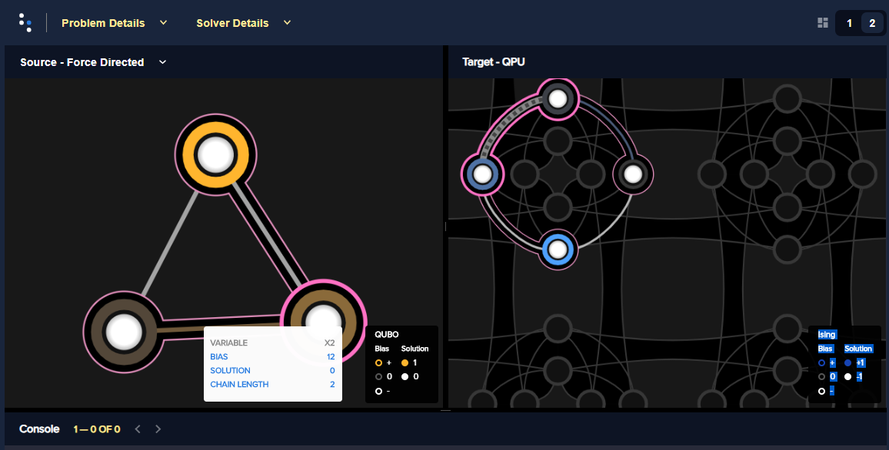

.. _ocean_workflow:

========================================
Workflow Steps: Formulation and Sampling
========================================

.. |figSolutionOverview| replace:: oceanSolutionOverview

.. include:: ../shared/workflow.rst
    :start-after: start_workflow_intro
    :end-before: end_workflow_intro

.. _ocean_workflow_objective_functions:

Objective Functions
===================

.. |figObjectiveFunction| replace:: oceanObjectiveFunction

.. include:: ../shared/workflow.rst
    :start-after: start_objective
    :end-before: end_objective

.. _ocean_workflow_simple_obj_example:

Simple Objective Example
------------------------

.. include:: ../shared/workflow.rst
    :start-after: start_simple_objective_example
    :end-before: end_simple_objective_example

The :ref:`ocean_simple_sampling_example` example below shows an equally simple
solution by sampling.

.. _ocean_workflow_models:

Supported Models
----------------

To express your problem as an objective function and submit to a |dwave_short|
sampler for solution, you typically use one of the
:ref:`Ocean software <index_ocean_sdk>` quadratic :ref:`models <concept_models>`
supported by |dwave_short| quantum computers and some of the
`Leap <https://cloud.dwavesys.com/leap/>`_ service's :term:`hybrid` samplers or
the :ref:`nonlinear model <concept_models_nonlinear>`.

The following are quadratic models supported on the QPU and some hybrid solvers:

*   .. include:: ../shared/models.rst
        :start-after: start_models_bqm
        :end-before: end_models_bqm

*   .. include:: ../shared/models.rst
        :start-after: start_models_ising
        :end-before: end_models_ising

*   .. include:: ../shared/models.rst
        :start-after: start_models_qubo
        :end-before: end_models_qubo

The following models are supported only by hybrid solvers:

*   .. include:: ../shared/models.rst
        :start-after: start_models_nonlinear
        :end-before: end_models_nonlinear

*   .. include:: ../shared/models.rst
        :start-after: start_models_cqm
        :end-before: end_models_cqm

*   .. include:: ../shared/models.rst
        :start-after: start_models_dqm
        :end-before: end_models_dqm

.. _ocean_workflow_formulating_cqm:

Formulation Example: CQM for Greatest Rectangle Area
----------------------------------------------------

Consider the simple problem of finding the rectangle with the greatest area when
the perimeter  is limited.

In this example, the perimeter  of the rectangle is set to 8 (meaning the
largest area is for the :math:`2X2` square). A CQM is created with two integer
variables, :math:`i, j`, representing the lengths of the rectangle's sides, an
objective function :math:`-i*j`, representing the rectangle's area (the
multiplication of side :math:`i` by side :math:`j`, with a minus sign because
Ocean samplers minimize rather than maximize), and a constraint
:math:`2i + 2j <= 8`, requiring that the sum of both sides must not exceed the
perimeter .

>>> from dimod import ConstrainedQuadraticModel, Integer
>>> i = Integer('i', upper_bound=4)
>>> j = Integer('j', upper_bound=4)
>>> cqm = ConstrainedQuadraticModel()
>>> cqm.set_objective(-i*j)
>>> cqm.add_constraint(2*i+2*j <= 8, "Max perimeter")
'Max perimeter'

.. _ocean_workflow_formulating_bqm:

Formulation Example: BQM for a Boolean Circuit
----------------------------------------------

Consider the problem of determining outputs of a Boolean logic circuit. In its
original context (in "problem space"), the circuit might be described with input
and output voltages, equations of its component resistors, transistors, etc, an
equation of logic symbols, multiple or an aggregated truth table, and so on. You
can choose to use Ocean software to formulate BQMs for binary gates directly in
your code or mathematically formulate a BQM, and both can be done in various
ways; for example, a BQM for each gate or one BQM for all the circuit's gates.

The following are two example formulations.

1.  The :ref:`qpu_example_not` section shows that a NOT gate, represented
    symbolically as :math:`x_2 \Leftrightarrow \neg x_1`, is formulated
    mathematically as BQM,

    .. math::

        -x_1 -x_2  + 2x_1x_2

2.  Ocean software's :doc:`dimod <index_dimod>` package enables the following
    formulation of an AND gate as a BQM:

>>> from dimod.generators import and_gate
>>> bqm = and_gate('in1', 'in2', 'out')

The BQM for this AND gate may look like this:

>>> bqm     # doctest: +SKIP
BinaryQuadraticModel({'in1': 0.0, 'in2': 0.0, 'out': 3.0},
...                  {('in2', 'in1'): 1.0, ('out', 'in1'): -2.0, ('out', 'in2'): -2.0},
...                  0.0,
...                  'BINARY')

The members of the two :class:`dicts <python:dict>` are linear and quadratic
coefficients, respectively, the third term is a constant offset associated with
the model, and the fourth shows the variable types in this model are binary.

For more detailed information on the parts of the :ref:`Ocean <index_ocean_sdk>`
software's programming model and how they work together, see the
:ref:`ocean_stack` section.

Once you have a model that represents your problem, you sample
it for solutions. The :ref:`ocean_workflow_sampling` subsection explains how to
submit your problem for solution.

.. _ocean_workflow_sampling:

Sampling: Minimizing the Objective
==================================

Having formulated an :term:`objective function` that represents your problem as
described in the :ref:`ocean_workflow_objective_functions` subsection above, you
sample this :term:`quadratic model` (QM) or :term:`nonlinear model` for
solutions. :ref:`Ocean <index_ocean_sdk>` software provides quantum, classical,
and quantum-classical :term:`hybrid` :term:`samplers <sampler>` that run either
remotely (for example, in the `Leap <https://cloud.dwavesys.com/leap/>`_
services) or locally on your CPU. These compute resources are known as
:term:`solvers <solver>`.

.. note:: Some classical samplers actually brute-force solve small problems
    rather than sample, and these are also referred to as "solvers".

Ocean's samplers enable you to submit your problem to remote or local compute
resources (solvers) of different types:

*   :ref:`opt_index_hybrid_solvers` such as
    `Leap's <https://cloud.dwavesys.com/leap/>`_ service's
    ``hybrid_nonlinear_program_version<x>`` and
    ``hybrid_binary_quadratic_model_version<x>`` solvers.
*   :ref:`qpu_intro_classical` such as the
    :class:`~dimod.reference.samplers.ExactSolver` class for exact solutions to
    small problems
*   :ref:`qpu_intro_quantum_solvers` such as the :term:`Advantage` system.

.. _ocean_simple_sampling_example:

Simple Sampling Example
-----------------------

.. |figSimpleRandomSampler| replace:: oceanSimpleRandomSampler
.. |simple_objective_example_ref| replace::
    :ref:`ocean_workflow_simple_obj_example`

.. include:: ../shared/workflow.rst
    :start-after: start_simple_sampler_example
    :end-before: end_simple_sampler_example

Submit the Model to a Solver
----------------------------

The example code below submits a :term:`BQM` representing a Boolean AND gate
(see also the :ref:`qpu_exampler_and` section) to a Leap :term:`hybrid` solver.
In this case, the :ref:`dwave-system <index_system>` package's
:class:`~dwave.system.samplers.LeapHybridSampler` class is the Ocean sampler and
the remote compute resource selected might be Leap hybrid solver
``hybrid_binary_quadratic_model_version<x>``.

>>> from dimod.generators import and_gate
>>> from dwave.system import LeapHybridSampler
>>> bqm = and_gate('x1', 'x2', 'y1')
>>> sampler = LeapHybridSampler()    # doctest: +SKIP
>>> answer = sampler.sample(bqm)   # doctest: +SKIP
>>> print(answer)    # doctest: +SKIP
  x1 x2 y1 energy num_oc.
0  1  1  1    0.0       1
['BINARY', 1 rows, 1 samples, 3 variables]

Improve the Solutions
---------------------

For complex problems, you can often improve solutions and performance by
applying some of Ocean software's preprocessing, postprocessing, and diagnostic
tools.

Additionally, when submitting problems directly to a |dwave_short| quantum
computer, you can benefit from some advanced features (for example features such
as :ref:`spin-reversal transforms <qpu_basic_config_spin_reversal_transforms>`
and :ref:`anneal offsets <qpu_qa_anneal_offsets>`, which reduce the impact of
possible analog and systematic :ref:`errors <qpu_errors>`) and the techniques
described in the :ref:`qpu_solver_configuration` section.

Example: Preprocessing
~~~~~~~~~~~~~~~~~~~~~~

The :ref:`dwave-preprocessing <index_preprocessing>` package provides algorithms
such as roof duality, which fixes some of a problem's variables before
submitting to a sampler.

As an illustrative example, consider the binary quadratic model, :math:`x + yz`.
Clearly :math:`x=0` for all the best solutions (variable assignments that
minimize the value of the model) because any assignment of variables that sets
:math:`x=1` adds a value of 1 compared to assignments that set :math:`x=0`. (On
the other hand, assignment :math:`y=0, z=0`, assignment :math:`y=0, z=1`, and
assignment :math:`y=1, z=0` are all equally good.) Therefore, you can fix
variable :math:`x` and solve a smaller problem.

>>> from dimod import BinaryQuadraticModel
>>> from dwave.preprocessing import roof_duality
>>> bqm = BinaryQuadraticModel({'x': 1}, {('y', 'z'): 1}, 0,'BINARY')
>>> roof_duality(bqm)
(0.0, {'x': 0})

For problems with hundreds or thousands of variables, such preprocessing can
significantly improve performance.

Example: Diagnostics
~~~~~~~~~~~~~~~~~~~~

When sampling directly on the |dwave_short| :term:`QPU`, the mapping from
problem variables to qubits, :term:`minor-embedding`, can significantly affect
performance. Ocean tools perform this mapping heuristically so simply rerunning
a problem might improve results. Advanced users may customize the mapping by
directly using the :ref:`minorminer <index_minorminer>` tool, setting a
minor-embedding themselves, or using the
:ref:`problem-inspector <index_inspector>` tool.

For example, the :ref:`qpu_example_and` example submits the BQM representing an
AND gate to a |dwave_short| quantum computer, which requires mapping the
problem's logical variables to qubits on the QPU. The code below invokes the
:ref:`problem-inspector <index_inspector>` tool to visualize the
minor-embedding.

>>> import dwave.inspector
>>> dwave.inspector.show(response)   # doctest: +SKIP

    View of the logical and embedded problem rendered by Ocean's problem
    inspector. The AND gate's original BQM is represented on the left; its
    embedded representation on a D-Wave system, on the right, shows a two-qubit
    chain (qubits 176 and 180) for variable :math:`x2`. The tool is helpful in
    visualizing the quality of your embedding.

See also the :ref:`qpu_problem_inspector` section.

Example: Postprocessing
~~~~~~~~~~~~~~~~~~~~~~~

Example :ref:`qpu_example_pp_greedy` improves samples returned from a QPU by
post-processing with a classical greedy algorthim.

See also the :ref:`qpu_postprocessing` section.