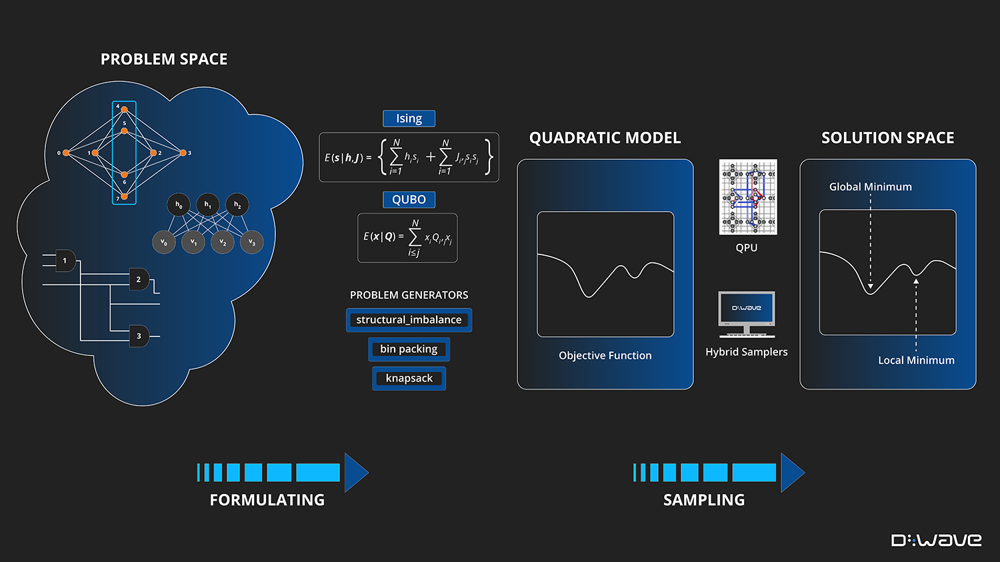

.. _solving_problems:

How a D-Wave System Solves Problems
===================================

This section explains some of the basics of how you can use D-Wave quantum computers
to solve problems and how Ocean tools can help.

For quantum computing, as for classical, solving a problem requires that it
be formulated in a way the computer and its software understand.

For example, if you want your laptop to calculate the area of a $1 coin, you might
express the problem as an equation, :math:`A=\pi r^2`, that you program as
:code:`math.pi*13.245**2` in your Python CLI. For a laptop with Python software,
this formulation---a particular string of alphanumeric symbols---causes the manipulation
of bits in a CPU and memory chips that produces the correct result.

The D-Wave system uses a quantum processing unit (QPU) to solve a :term:`binary quadratic model` (BQM)\ [#]_\ :
given :math:`N` variables :math:`x_1,...,x_N`, where each variable
:math:`x_i` can have binary values :math:`0` or :math:`1`, the system finds assignments of
values that minimize

.. math::

    \sum_i^N q_ix_i + \sum_{i<j}^N q_{i,j}x_i  x_j

where :math:`q_i` and :math:`q_{i,j}` are configurable (linear and quadratic) coefficients.
To formulate a problem for the D-Wave system is to program :math:`q_i` and :math:`q_{i,j}` so
that assignments of :math:`x_1,...,x_N` also represent solutions to the problem.

.. [#] The "native" forms of BQM programmed into a D-Wave system are the :term:`Ising` model
       traditionally used in statistical mechanics and its computer-science equivalent,
       shown here, the :term:`QUBO`.

Ocean software can abstract away much of the mathematics and programming for some types of problems.
At its heart is a binary quadratic model (BQM) class that together with other Ocean tools helps
formulate various optimization problems.
It also provides an API to binary quadratic :term:`sampler`\ s (the component used to minimize a BQM
and therefore solve the original problem), such as the D-Wave system and classical algorithms
you can run on your computer.

The following sections describe this problem-solving procedure in
two steps (plus a third that may benefit some problems); see the :ref:`gs`
Examples section and :std:doc:`System Documentation <sysdocs_gettingstarted:index>`
for further description.

1. :ref:`formulating_bqm`.
2. :ref:`submitting`.
3. :ref:`improving`, if needed, using advanced features.

   Solution steps: (1) a problem known in "problem space" (a circuit
   of Boolean gates, a graph, a network, etc) is formulated as a BQM, mathematically or using
   Ocean functionality and (2) the BQM is sampled for solutions.

.. _formulating_bqm:

Formulate Your Problem for a Quantum Computer
=============================================

There are different ways of mapping between a problem---chains of amino acids
forming 3D structures of folded proteins, traffic in the streets of Beijing, circuits
of binary gates---and a BQM to be solved (by sampling) with a D-Wave system or locally on
your CPU/GPU.

For example, consider the problem of determining outputs of a Boolean logic circuit. In its original
context (in "problem space"), the circuit might be described with input and output voltages,
equations of its component resistors, transistors, etc, an equation of logic symbols,
multiple or an aggregated truth table, and so on. You can choose to use Ocean software to formulate
BQMs for binary gates directly in your code or mathematically formulate a BQM, and both
can be done in different ways too; for example, a BQM for each gate or one BQM for
all the circuit's gates.

The following are two example formulations.

1. The :ref:`not` example, takes a NOT gate represented symbolically as
   :math:`x_2 \Leftrightarrow \neg x_1` and formulates it mathematically as the following BQM:

   .. math::

       -x_1 -x_2  + 2x_1x_2

   The table below shows that this BQM has lower values for valid states of the NOT
   gate (e.g., :math:`x_1=0, x_2=1`) and higher for invalid states (e.g., :math:`x_1=0, x_2=0`).

   .. table:: Boolean NOT Operation Formulated as a BQM.
      :name: BooleanNOTasQUBO

      ===========  ============  ===============  ============
      :math:`x_1`  :math:`x_2`   **Valid?**       **BQM Value**
      ===========  ============  ===============  ============
      :math:`0`    :math:`1`     Yes              :math:`0`
      :math:`1`    :math:`0`     Yes              :math:`0`
      :math:`0`    :math:`0`     No               :math:`1`
      :math:`1`    :math:`1`     No               :math:`1`
      ===========  ============  ===============  ============

2. Ocean's :doc:`dwavebinarycsp </docs_binarycsp/sdk_index>` tool enables the
   following formulation of an AND gate as a BQM:

   .. code-block:: python

       >>> import dwavebinarycsp
       >>> import dwavebinarycsp.factories.constraint.gates as gates
       >>> csp = dwavebinarycsp.ConstraintSatisfactionProblem(dwavebinarycsp.BINARY)
       >>> csp.add_constraint(gates.and_gate(['x1', 'x2', 'y1']))  # add an AND gate
       >>> bqm = dwavebinarycsp.stitch(csp)

The resultant BQM of this AND gate may look like this:

>>> bqm     # doctest: +SKIP
BinaryQuadraticModel({'x1': 0.0, 'x2': 0.0, 'y1': 6.0},
...                  {('x2', 'x1'): 2.0, ('y1', 'x1'): -4.0, ('y1', 'x2'): -4.0},
...                  -1.5,
...                  Vartype.BINARY)

The members of the two dicts are linear and quadratic coefficients, respectively,
the third term is a constant offset associated with the model, and the fourth
shows the variable types in this model are binary.

For more detailed information on the parts of Ocean programming model and how
they work together, see :ref:`oceanstack`.

Once you have a BQM that represents your problem, you sample it for solutions.
:ref:`samplers_and_solvers` explains how to submit your problem for solution.
