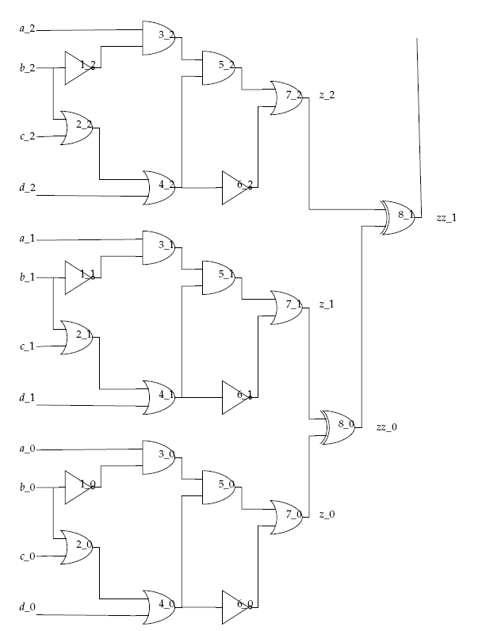
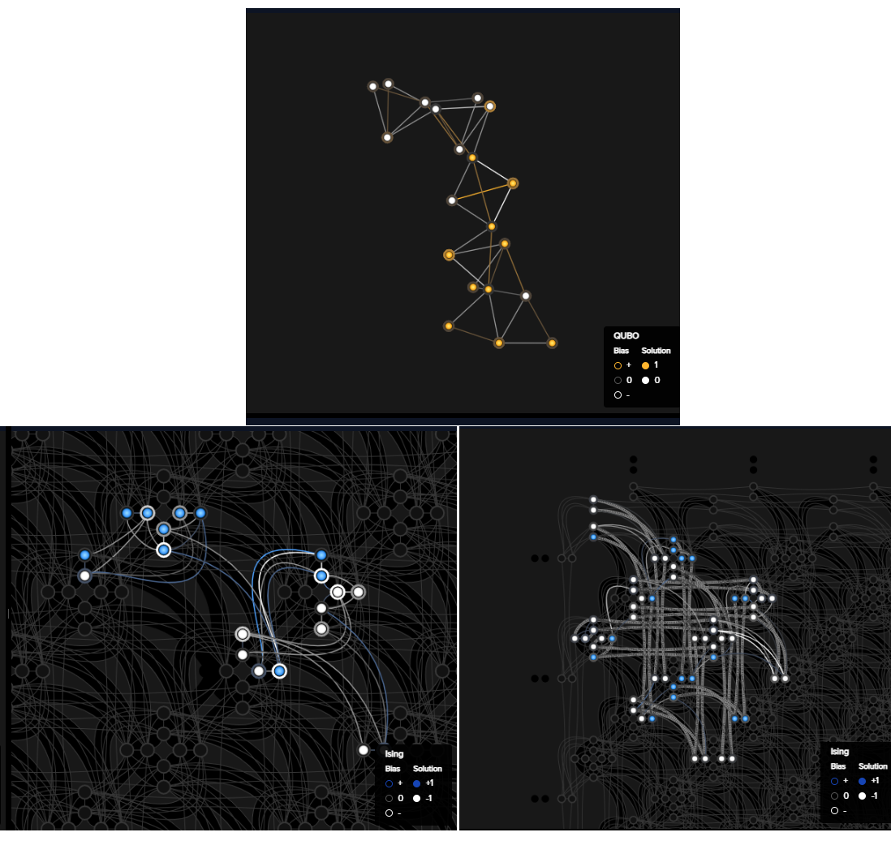
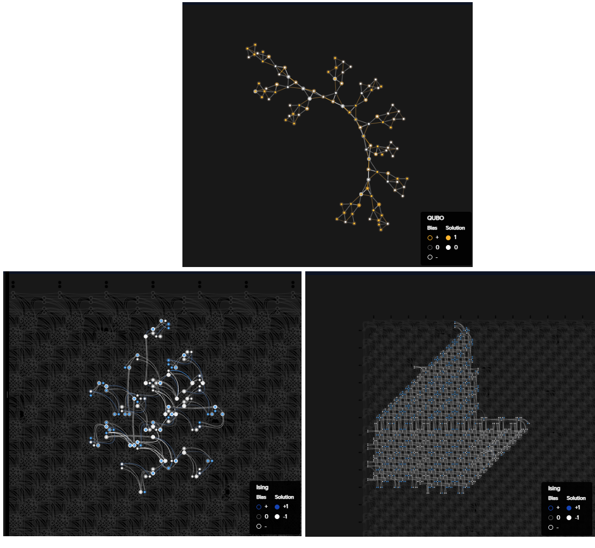

.. _qpu_example_multigate:

================================
Logic Circuit: Embedding Effects
================================

This example solves a logic-circuit problem on a |dwave_short| quantum computer.
It expands on the discussion in the :ref:`qpu_example_and` example about the
effect of :term:`minor-embedding` on performance, demonstrating different
approaches to embedding.

.. code for the latex (raw::  latex)

    \begin{figure}
    \begin{centering}
    \begin{circuitikz}

    \node (in1) at (0, 6.3) {$a$};
    \node (in2) at (0, 5) {$b$};
    \node (in3) at (0, 2.7) {$c$};
    \node (in4) at (0, 1) {$d$};

    \node(out1) at  (10.5, 4.1) {$z$} ;

    \draw

    (1.75,5) node[not port] (mynot1) {1}
    (2.25,3) node[or port] (myor2) {2}

    (5,6) node[and port] (myand3) {3}
    (5,1) node[or port] (myor4) {4}

    (7,5) node[and port] (myand5) {5}
    (7,1) node[not port] (mynot6) {6}

    (9.25,4) node[or port] (myor7) {7}

    (0.1, 6.25) -- (myand3.in 1)
    (0.1, 5) -- (mynot1.in)
    (0.1, 5) -| (myor2.in 1)
    (0.1, 2.7) -- (myor2.in 2)
    (0.1, 0.75) -- (myor4.in 2)

    (mynot1.out) |- (myand3.in 2)
    (myor2.out) |- (myor4.in 1)
    (myand3.out) |- (myand5.in 1)
    (myor4.out) |- (myand5.in 2)
    (myor4.out) |- (mynot6.in)
    (myand5.out) |- (myor7.in 1)
    (mynot6.out) |- (myor7.in 2)

    (myor7.out) -- (10.4, 4.0);

    \end{circuitikz}\\

    \end{centering}

    \caption{Logic circuit that implements $z=a \overline{b} c + $a \overline{b}
     c + b \overline{d} + c \overline{d}.}
    \label{fig:logicCircuit}
    \end{figure}

    A simple circuit is shown in Figure \ref{fig:logicCircuit}.

.. figure:: ../_images/MultiGateCircuit.png
    :name: Problem_MultiGateCircuit
    :alt: image
    :align: center
    :scale: 90 %

    Circuit with 7 logic gates, 4 inputs (:math:`a, b, c, d`), and 1 output
    (:math:`z`). The circuit implements function
    :math:`z = \overline{b} (ac + ad + \overline{c}\overline{d})`.

Example Requirements
====================

.. include:: ../shared/examples.rst
    :start-after: start_requirements
    :end-before: end_requirements

For the optional graphics, you will also need the non-open-source
:ref:`problem-inspector <index_inspector>` Ocean package, which you may have
chosen to install in the :ref:`ocean_install_contrib` section.

Solution Steps
==============

.. |workflow_section| replace:: :ref:`qpu_workflow`

.. include:: ../shared/examples.rst
    :start-after: start_standard_steps
    :end-before: end_standard_steps

Formulating the Problem as a CSP
================================

Other examples (:ref:`qpu_example_not` and :ref:`qpu_example_and`) show how a
Boolean gate is represented as a *constraint satisfaction problem* (:term:`CSP`)
on a quantum computer. This example aggregates the resulting binary quadratic
models (:term:`BQM`) to do the same for multiple gates that constitute a
circuit.

Small-Circuit Problem
---------------------

To start with, solve the circuit with 7 logic gates shown above.

The code below represents standard Boolean gates with BQMs provided by
:ref:`dimod <index_dimod>` BQM generators, represents the Boolean NOT operation
by inverting the coefficients of the relevant variables, and sums the
gate-level BQMs. The resulting aggregate BQM has its lowest value for variable
assignments that satisfy all the constraints representing the circuit's Boolean
gates.

>>> from dimod.generators import and_gate, or_gate
...
>>> bqm_gate2 = or_gate('b', 'c', 'out2')
>>> bqm_gate3 = and_gate('a', 'b', 'out3')
>>> bqm_gate3.flip_variable('b')
>>> bqm_gate4 = or_gate('out2', 'd', 'out4')
>>> bqm_gate5 = and_gate('out3', 'out4', 'out5')
>>> bqm_gate7 = or_gate('out5', 'out4', 'z')
>>> bqm_gate7.flip_variable('out4')
...
>>> bqm = bqm_gate2 + bqm_gate3 + bqm_gate4 + bqm_gate5 + bqm_gate7
>>> print(bqm.num_variables)
9

This circuit is small enough to solve with a brute-force algorithm such as that
used by the :class:`~dimod.reference.samplers.ExactSolver` class. Solve and
print all feasible solutions.

>>> from dimod import ExactSolver, drop_variables
...
>>> solutions = ExactSolver().sample(bqm).lowest()
>>> out_fields = [key for key in list(next(solutions.data(['sample'])))[0].keys() if 'out' in key]
>>> print(drop_variables(solutions, out_fields))
    a  b  c  d  z energy num_oc.
0   0  0  0  1  0    0.0       1
1   0  0  1  1  0    0.0       1
2   0  1  1  1  0    0.0       1
3   0  1  0  1  0    0.0       1
4   1  1  0  1  0    0.0       1
5   1  1  1  1  0    0.0       1
6   1  1  1  0  0    0.0       1
7   1  1  0  0  0    0.0       1
8   0  1  0  0  0    0.0       1
9   0  1  1  0  0    0.0       1
10  0  0  1  0  0    0.0       1
11  1  0  0  1  1    0.0       1
12  1  0  1  1  1    0.0       1
13  1  0  1  0  1    0.0       1
14  1  0  0  0  1    0.0       1
15  0  0  0  0  1    0.0       1
['BINARY', 16 rows, 16 samples, 5 variables]

Brute-force algorithms are not effective for large problems.

Large-Circuit Problem
---------------------

In the figure below, the 7-gates circuit solved above is replicated with the
outputs connected through a series of XOR gates.

    Multiple replications of the 7-gates circuit
    (:math:`z = \overline{b} (ac + ad + \overline{c}\overline{d})`) connected by
    XOR gates.

The :code:`circuit_bqm` function defined below replicates, for a specified
number of circuits, the BQM developed above and connects the outputs through a
cascade of XOR gates.

>>> from dimod import BinaryQuadraticModel, quicksum
>>> from dimod.generators import and_gate, or_gate, xor_gate
...
>>> def circuit_bqm(n: int = 3) -> BinaryQuadraticModel:
...       "Create a BQM for n replications of the 7-gate circuit."
...
...       if n < 2:
...          raise ValueError("n must be at least 2")
...
...       bqm_gate2 = [or_gate(f"b_{c}", f"c_{c}", f"out2_{c}") for c in range(n)]
...       bqm_gate3 = [and_gate(f"a_{c}", f"b_{c}", f"out3_{c}") for c in range(n)]
...       [bqm.flip_variable("b_{}".format(indx)) for indx, bqm in enumerate(bqm_gate3)]
...       bqm_gate4 = [or_gate(f"out2_{c}", f"d_{c}", f"out4_{c}") for c in range(n)]
...       bqm_gate5 = [and_gate(f"out3_{c}", f"out4_{c}", f"out5_{c}") for c in range(n)]
...       bqm_gate7 = [or_gate(f"out5_{c}", f"out4_{c}", f"z_{c}") for c in range(n)]
...       [bqm.flip_variable("out4_{}".format(indx)) for indx, bqm in enumerate(bqm_gate7)]
...       bqm_z = [xor_gate("z_0", "z_1", "zz0", "aux0")] + [
...                xor_gate(f"z_{c}", f"zz{c-2}", f"zz{c-1}", f"aux{c-1}") for c in range(2, n)]
...       return quicksum(bqm_gate2 + bqm_gate3 + bqm_gate4 + bqm_gate5 + bqm_gate7 + bqm_z)

Instantiate a BQM for six replications. The resulting circuit has 64 variables.

>>> bqm = circuit_bqm(6)
>>> print(bqm.num_variables)
64

Minor-Embedding and Sampling
============================

The :ref:`qpu_example_and` example used the
:class:`~dwave.system.composites.EmbeddingComposite` composite to
:term:`minor-embed` its unstructured problem onto the :term:`topology` of
a quantum computer's :term:`qubits` and :term:`couplers`. That composite uses
the :ref:`minorminer algorithm <index_minorminer>` to find a minor embedding
for each problem you submit.

For some applications, the submitted problems might be related or limited
in size in such a way that you can find a common minor embedding for the entire
set of problems. For instance, you might wish to submit the circuit of this
example multiple times with various configurations of fixed inputs (inputs set
to zero or one).

One approach is to pre-calculate a minor embedding for a clique (a
:term:`complete graph`), a "clique embedding", of a size at least equal to the
maximum number of variables (nodes) expected in your problem. Because any BQM of
:math:`n` variables maps to a subgraph of an :math:`n`--node clique\ [#]_, you
can then use the clique embedding by assigning to all unused nodes and edges a
value of zero.

.. [#]
    The figure below illustrates such subgraphs. Two random
    :func:`~networkx.generators.random_graphs.random_regular_graph` graphs with
    four and three nodes, respectively, each with two edges per node, are
    plotted on a background of a 5-node clique.

    .. figure:: ../_images/subgraphs_clique5.png
        :name: MultiGateCircuit_SubgraphsClique5
        :alt: image
        :align: center
        :scale: 50 %

        Two subgraphs of a 5-node clique. The clique is plotted in yellow and
        the random sub-graphs in blue (four nodes) and red (three nodes).

Configure a quantum computer as a :term:`sampler` using both the
:class:`~dwave.system.composites.EmbeddingComposite` composed sampler, for
standard embedding, and the :class:`~dwave.system.samplers.DWaveCliqueSampler`
composed sampler, for clique embedding.

.. include:: ../shared/examples.rst
    :start-after: start_default_solver_config
    :end-before: end_default_solver_config

>>> from dwave.system import DWaveSampler, EmbeddingComposite, DWaveCliqueSampler
...
>>> sampler1 = EmbeddingComposite(DWaveSampler(solver=dict(topology__type='pegasus')))
>>> sampler2 = DWaveCliqueSampler(solver=dict(name=sampler1.child.solver.name))  # doctest: +SKIP

Performance Comparison: Embedding Time
--------------------------------------

The :class:`~dwave.system.samplers.DWaveCliqueSampler` composed sampler reduces
the overhead of repeatedly finding minor embeddings for applications that submit
a sequence of problems that are all sub-graphs of a clique that can be embedded
on the QPU sampling the problems.

The table below shows the minor-embedding times\ [#]_ for a series of random
problems of increasing size\ [#]_. Some interesting differences are bolded.

.. note:: The times below are for a particular development environment.
    Embedding times can be expected to vary for different CPUs, operating
    systems, etc as well as varying across problems and executions of the
    heuristic algorithm.

.. list-table:: Minor-Embedding: Embedding Times
    :widths: 20 10 10 30
    :header-rows: 1

    *   - Problem Size: Nodes (Edges/Node)
        - :class:`~dwave.system.composites.EmbeddingComposite` Time [sec]
        - :class:`~dwave.system.samplers.DWaveCliqueSampler` Time [sec]
        - Notes
    *   - 10 (5)
        - **0.06**
        - **152.7**
        - :class:`~dwave.system.samplers.DWaveCliqueSampler` calculates all
          clique embeddings for the QPU.
    *   - 20 (10)
        - 0.41
        - 0.11
        -
    *   - 30 (15)
        - 1.39
        - 0.11
        -
    *   - 40 (20)
        - 3.88
        - 0.13
        -
    *   - 50 (25)
        - 9.7
        - 0.14
        -
    *   - 60 (30)
        - 17.91
        - 0.16
        -
    *   - 70 (35)
        - 22.02
        - 0.19
        -
    *   - 80 (40)
        - **73.74**
        - **0.25**
        -
    *   - 90 (45)
        - 65.05
        - 0.22
        -
    *   - 100 (50)
        - 28.92
        - 0.25
        - For this execution,
          :class:`~dwave.system.composites.EmbeddingComposite` found a good
          embedding quickly; other executions might not.

.. [#] The times are approximate: the code measures the blocking time when
    submitting problems, of which minor-embedding is the major element.

You can see that while the first submission is slow for the
:class:`~dwave.system.samplers.DWaveCliqueSampler` composed sampler, subsequent
submissions are fast. For the
:class:`~dwave.system.composites.EmbeddingComposite` composed sampler, the time
depends on the size and complexity of each problem, can vary between submissions
of the same problem, and each submission incurs the cost of finding an embedding
anew.

.. [#]

    The code below can take several minutes to run. Uncommenting the print
    statement lets you view the execution's progress. Note that if you have
    already used :class:`~dwave.system.samplers.DWaveCliqueSampler`, your cache
    might need to be cleared with the
    :func:`~minorminer.busclique.busgraph_cache.clear_all_caches` function to
    measure the initial calculation time.

    >>> import time
    >>> import networkx as nx
    ...
    >>> samplers = {"sampler1": sampler1, "sampler2": sampler2}   # doctest: +SKIP
    >>> times = {key: [] for key in samplers.keys()}              # doctest: +SKIP
    >>> for name, sampler in samplers.items():                    # doctest: +SKIP
    ...    for i in range(10):
    ...       nodes = 10 + 10*i
    ...       edges = 5 + 5*i
    ...       G = nx.random_regular_graph(n=nodes, d=edges)
    ...       # print("Submitting problem of {} nodes and {} edges to sampler {}".format(nodes, edges, name))
    ...       times[name].append(time.time())
    ...       sampler.sample_ising({}, {edge: 1 for edge in G.edges})
    ...       times[name][i] = time.time() - times[name][i]

For example, to submit a problem with two replications of the
:math:`z = \overline{b} (ac + ad + \overline{c}\overline{d})` circuit, which has
20 variables (and 34 interactions), you can expect an embedding time of less
than a second.

>>> bqm1 = circuit_bqm(2)
>>> bqm2 = bqm1.copy(bqm1)
>>> bqm1.fix_variables([('b_0', 0), ('b_1', 0), ('a_0', 1)])
>>> bqm2.fix_variables([('b_0', 1), ('b_1', 1), ('a_0', 0)])
...
>>> bqms = [bqm1, bqm2]
>>> times = {key: [] for key in samplers.keys()}             # doctest: +SKIP
>>> for name, sampler in samplers.items():                   # doctest: +SKIP
...    for i, bqm in enumerate(bqms):
...       times[name].append(time.time())
...       sampler.sample(bqm, num_reads=5000)
...       times[name][i] = time.time() - times[name][i]
>>> times                                                    # doctest: +SKIP
{'sampler1': [0.43480920791625977, 0.381976842880249],
 'sampler2': [0.12912440299987793, 0.12194108963012695]}

If, however, you wish to submit a problem with ten replications repeatedly, with
some subset of the variables fixed, the overhead cost of embedding can be
minutes.

Performance Comparison: Solution Quality
----------------------------------------

The :class:`~dwave.system.composites.EmbeddingComposite` composed sampler
attempts to find a good embedding for any given problem while the
:class:`~dwave.system.samplers.DWaveCliqueSampler` reuses a clique embedding
found once. Typically the former results in an embedding with shorter chains
than the latter, with the difference in length increasing for larger problems.
Chain length can significantly affect solution quality.

The table below compares, for the two embedding methods, the ratio of ground
states (solutions for which the value of the BQM is zero, meaning no constraint
is violated or all assignments of values to the problem's variables match valid
states of the circuit represented by the BQM) to total samples returned from the
quantum computer when minor-embedding a sequence of problems of increasing size.

The results are for one particular code\ [#]_ execution on problems that
replicate the :math:`z = \overline{b} (ac + ad + \overline{c}\overline{d})`
circuit between two to ten times.

.. list-table:: Minor-Embedding: Ground-State Ratio Across Samplers
    :widths: 10 10 10
    :header-rows: 1

    *   - Problem Size: Circuit Replications
        - :class:`~dwave.system.composites.EmbeddingComposite` Ground-State
          Ratio [%]
        - :class:`~dwave.system.samplers.DWaveCliqueSampler` Ground-State Ratio
          [%]
    *   - 2
        - 69.6
        - 74.4
    *   - 3
        - 52.6
        - 25.2
    *   - 4
        - 40.5
        - 16.8
    *   - 5
        - 29.1
        - 3.3
    *   - 6
        - 20.9
        - 2.9
    *   - 7
        - 16.3
        - 0.2
    *   - 8
        - 14.4
        - 0.0
    *   - 9
        - 8.9
        - 0.0
    *   - 10
        - 7.2
        - 0.3

You can see that for small problems, using a clique embedding can produce
high-quality solutions, and might be advantageously used when submitting a
sequence of related problems.

.. [#]

    The code below can take minutes to run. Uncommenting the print statements
    lets you view the execution's progress.

    >>> samplers = {"sampler1": sampler1, "sampler2": sampler2}    # doctest: +SKIP
    >>> samplesets = {key: [] for key in samplers.keys()}          # doctest: +SKIP
    >>> for num_circuits in range(2, 11):
    ...    bqm = circuit_bqm(num_circuits)
    ...    for name, sampler in samplers.items():                  # doctest: +SKIP
    ...       # print("Submitting problem of {} circuits to sampler {}".format(num_circuits, name))
    ...       sampleset = sampler.sample(bqm, num_reads=5000)
    ...       if sampleset.first.energy > 0:
    ...          samplesets[name].append(0)
    ...       else:
    ...          samplesets[name].append(sum(sampleset.lowest().record.num_occurrences))

Visualizing the Minor Embedding
~~~~~~~~~~~~~~~~~~~~~~~~~~~~~~~

Ocean's :ref:`problem-inspector <index_inspector>` can illuminate differences in
solution quality between alternative minor embeddings. You can use it to
visualize sample sets returned from a quantum computer in your browser.

>>> import dwave.inspector
>>> bqm = circuit_bqm(2)
>>> sampleset1 = sampler1.sample(bqm, num_reads=5000)
>>> dwave.inspector.show(sampleset1)                 # doctest: +SKIP

The figure below, constituted of snapshots from the problem inspector for
submissions to the two samplers defined above, shows that for the BQM
representing two replications of the
:math:`z = \overline{b} (ac + ad + \overline{c}\overline{d})` circuit, with its
20 variables and 34 edges, the clique embedding uses chains of length two to
represent nodes that the standard embedding represented with single qubits.

    Graph of two replications of the
    :math:`z = \overline{b} (ac + ad + \overline{c}\overline{d})` circuit (top
    centre), a standard embedding (bottom-left), and a clique-embedding
    (bottom-right).

Short chains of a few qubits generally enable good quality solutions: as shown
in the table above, for a two-replications circuit the ratio of ground states is
similar for both embedding methods.

The BQM representing ten replications of the
:math:`z = \overline{b} (ac + ad + \overline{c}\overline{d})` circuit has over
100 variables. Typically, minor embeddings for dense graphs require longer
chains than those of sparse graphs; for this problem the clique embedding needed
chains of up to 11 qubits versus the standard embedding's chains of 2 qubits.
Depending on the problem, such chains may degrade the solution, as is the case
here.

>>> bqm = circuit_bqm(10)
>>> for sampler in samplers.values():                      # doctest: +SKIP
...    sampleset = sampler.sample(bqm, num_reads=5000, return_embedding=True)
...    chain_len = max(len(x) for x in sampleset.info["embedding_context"]["embedding"].values())
...    print("Maximum chain length: {}".format(chain_len)) # doctest: +SKIP
...    dwave.inspector.show(sampleset)
Maximum chain length: 2
Maximum chain length: 11

    Graph of ten replications of the
    :math:`z = \overline{b} (ac + ad + \overline{c}\overline{d})` circuit (top
    centre), an embedding (bottom-left), a clique-embedding (bottom-right).

The :ref:`qpu_example_inspector_graph_partitioning` example demonstrates how the
problem inspector can be used to analyze your problem submissions.

Performance Comparison: Embedding Executions
--------------------------------------------

Algorithmic minor embedding is heuristic: solution results can vary
significantly based on the minor embedding found.

The table below compares, for a single random :func:`~dimod.generators.ran_r`
problem of a given size, the ratio of ground states to total samples returned
from the quantum computer over several executions\ [#]_ of minor embedding.
The outlier results are bolded.

For each run, the :class:`~dwave.system.composites.EmbeddingComposite` composed
sampler finds and returns a minor embedding for the problem. The returned
embedding is then reused twice by a
:class:`~dwave.system.composites.FixedEmbeddingComposite` composed sampler.

.. list-table:: Minor-Embedding: Ground-State Ratio Across Executions
    :widths: 10 20 10
    :header-rows: 1

    *   - Execution
        - Ground-State Ratio [%]
        - Chain Length
    *   - 1
        - 10.1, 10.1, **8.9**
        - 4
    *   - 2
        - 25.8, 29.1, 28.4
        - 4
    *   - 3
        - 24.9, 24.4, 27.9
        - 3
    *   - 4
        - 14.0, 11.0, 13.6
        - 3
    *   - 5
        - 38.5, 36.4, 34.5
        - 4
    *   - 6
        - 15.4, 14.6, 14.5
        - 4
    *   - 7
        - 43.8, 44.2, **45.1**
        - 3
    *   - 8
        - 15.9, 17.2, 15.3
        - 4
    *   - 9
        - 31.1, 34.1, 27.1
        - 3
    *   - 10
        - 15.3, 11.5, 12.1
        - 3

You can see that each set of three submission of the problem using the same
embedding have minor variations in the ground-state ratios. However, the
variation across minor-embeddings of the same problem can be significant.
Consequently, for some applications it can be beneficial to run the
minor-embedding multiple times and select the best embedding.

.. [#]

    The code below can take minutes to run. Uncommenting the print statements
    lets you view the execution's progress.

    >>> from dimod.generators import ran_r
    >>> from dwave.system import DWaveSampler, EmbeddingComposite, FixedEmbeddingComposite
    ...
    >>> problem_size = 20
    >>> num_problems = 10
    >>> submission_repeats = 2
    >>> qpu = DWaveSampler(solver=dict(topology__type='pegasus'))
    >>> sampler1 = EmbeddingComposite(qpu)
    >>> bqm = ran_r(10, problem_size)
    ...
    >>> samplesets = {}
    >>> chain_len = []
    >>> for runs in range(num_problems):
    ...    samplesets[runs] = []
    ...    print("Run {}".format(runs))
    ...    sampleset = sampler1.sample(bqm, num_reads=5000, return_embedding=True)
    ...    if sampleset.first.energy > 0:
    ...        samplesets[runs].append(0)
    ...    else:
    ...        samplesets[runs].append(sum(sampleset.lowest().record.num_occurrences))
    ...    embedding = sampleset.info["embedding_context"]["embedding"]  # doctest: +SKIP
    ...    chain_len.append(max(len(x) for x in embedding.values()))     # doctest: +SKIP
    ...    sampler2 = FixedEmbeddingComposite(qpu, embedding=embedding)  # doctest: +SKIP
    ...
    ...    for i in range(submission_repeats):
    ...        print("\tSubmitting {}--{}".format(runs, i))
    ...        sampleset = sampler2.sample(bqm, num_reads=5000, return_embedding=True)   # doctest: +SKIP
    ...        if sampleset.first.energy > 0:                  # doctest: +SKIP
    ...           samplesets[runs].append(0)
    ...        else:
    ...           samplesets[runs].append(sum(sampleset.lowest().record.num_occurrences))
