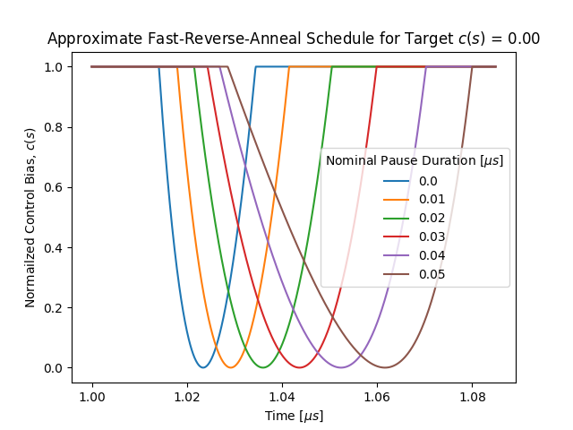
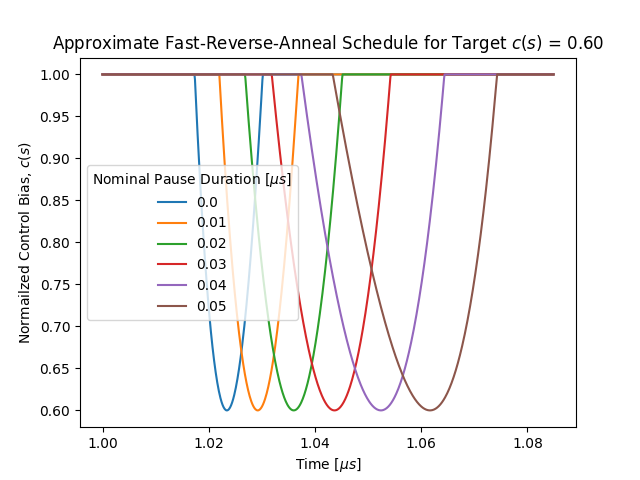
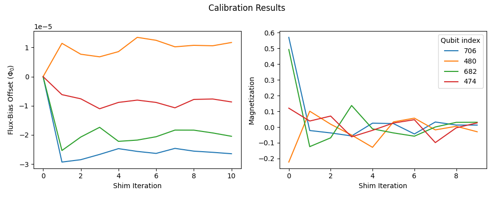
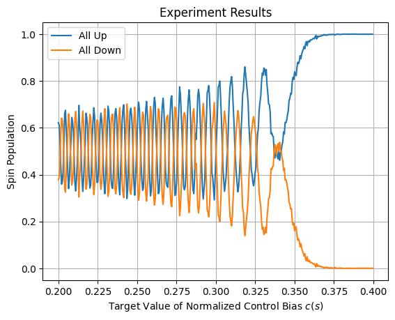
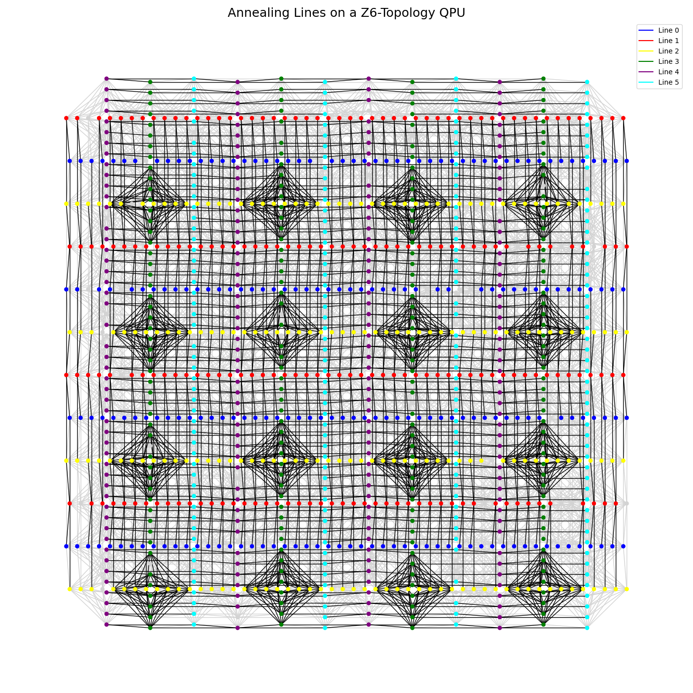
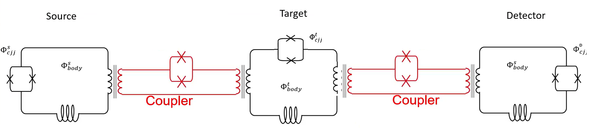
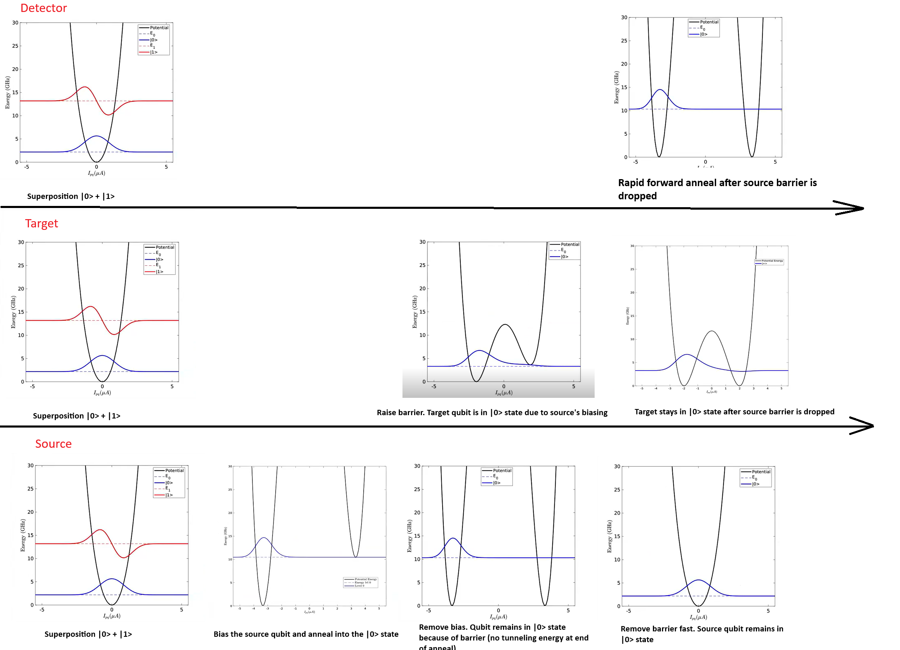
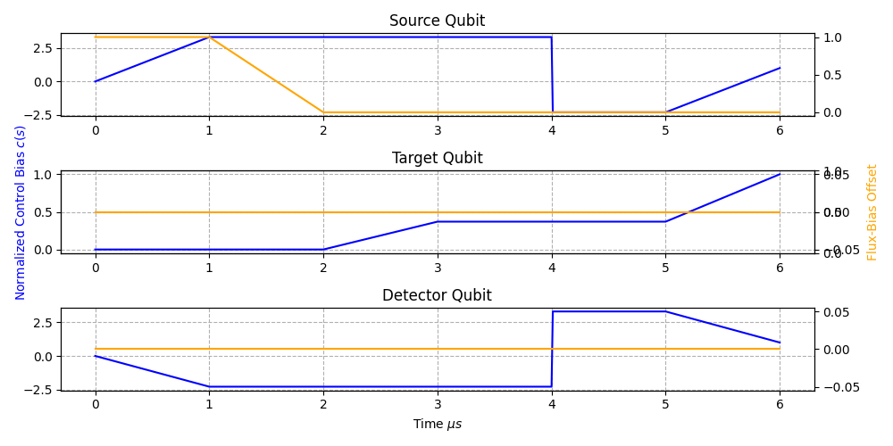
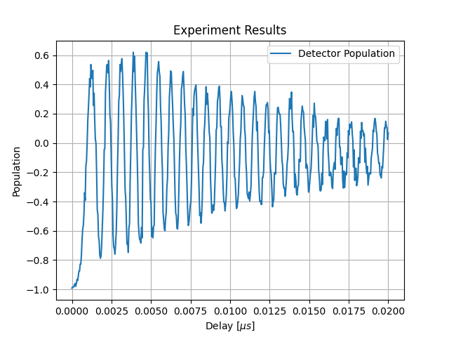

.. _qpu_experimental_research:

=====================
Experimental Research
=====================

Some QPU solvers in the |cloud|_ service support experimental features used for
advanced research, described in this section.

.. note::
    Not all accounts have access to such research quantum computers.

.. _qpu_experimental_research_fast_reverse_annealing:

Fast Reverse Annealing
======================

Fast reverse annealing is an experimental feature to support limited use of the
standard :ref:`reverse annealing <qpu_qa_anneal_sched_reverse>` feature in the
coherent regime of the quantum processing unit (QPU).

The generally available (GA)
:ref:`fast-anneal protocol <qpu_qa_anneal_sched_fast>` enables sub-nanosecond
annealing times, providing access to the QPU's coherent regime. It does so by
linearly ramping up the flux applied to the qubits, :math:`\Phi_{\rm CCJJ}`, in
contrast to the slower standard-anneal protocol of linearly growing the
qubits' persistent current, :math:`I_p(s)`. This experimental feature, fast
reverse annealing, enables reverse annealing in the coherent regime by rapidly
ramping down :math:`\Phi_{\rm CCJJ}`. To maximize speed (the slope of the ramp),
the QPU is programmed with an anneal schedule designed to overshoot the target
:ref:`normalized control bias <qpu_annealprotocol_standard>`,
:math:`c(s)`.\ [#]_ Although the QPU cannot in fact follow this nominal
annealing schedule, it achieves in this way reverse annealing in the coherent
regime.

.. [#]

    The normalized control bias is given by

    .. math::

        c(s) = \frac{\Phi_{\rm CCJJ}(s) -\Phi_{\rm CCJJ}^{\rm initial}}
        {\Phi_{\rm CCJJ}^{\rm final} - \Phi_{\rm CCJJ}^{\rm initial}},

    where :math:`\Phi_{\rm CCJJ}^{\rm initial}` and
    :math:`\Phi_{\rm CCJJ}^{\rm final}` are the values of :math:`\Phi_{\rm CCJJ}` at
    :math:`s = 0` and :math:`s = 1`, respectively (:math:`c(0) = 0` and
    :math:`c(1)` = 1).

Current Limitations
-------------------

As noted above, in the current implementation, the QPU does not precisely follow
anneal schedules set by the user. Consequently, some predefined schedules have
been calibrated for use and the feature  has the following restrictions.

*   Where the standard reverse annealing supports a schedule of
    :ref:`max_anneal_schedule_points <property_qpu_max_anneal_schedule_points>`
    points you can customize, which represents the QPU annealing with high
    accuracy, fast reverse annealing is restricted to a class of nominal
    schedules with a single shape: :math:`c(s)` ramps down fast from
    the initial value :math:`c(s)=1` to a value you select, pauses there for a
    duration you select, and then ramps back up fast to the final value
    :math:`c(s)=1`; this nominal schedule represents the QPU annealing only very
    loosely (:numref:`Figure %s <fastReverseAnnealingWaveform0>` and
    :numref:`Figure %s <fastReverseAnnealingWaveform06>` are more realistic
    depictions of the QPU annealing schedule).

*   Durations of the pause can only be selected from a discrete set of supported
    values.

*   The :ref:`parameter_qpu_anneal_schedule` must be provided although the
    configured values do not affect the executed schedule.

Usage
-----

To submit a fast-reverse-annealing problem to the QPU, set the experimental
:ref:`parameter_qpu_target_c` and :ref:`parameter_qpu_nominal_pause_time`
parameters. Use the
`dwave-experimental <https://github.com/dwavesystems/dwave-experimental>`_
:func:`~dwave.experimental.fast_reverse_anneal.api.get_parameters` function
(you can also directly use the
:ref:`property_qpu_get_fast_reverse_anneal_exp_feature_info` parameter) to view
supported values for the feature parameters.

To assess for your nominal schedule (your configured target :math:`c(s)` and
pause duration), the anneal schedule that is executed by the QPU, use the
utilities that the
`dwave-experimental <https://github.com/dwavesystems/dwave-experimental>`_
repository provides, which can generate such graphs as those shown in
:numref:`Figure %s <fastReverseAnnealingWaveform0>` and
:numref:`Figure %s <fastReverseAnnealingWaveform06>`. These figures show
approximate schedules on the QPU for target :math:`c(s)` set to 0 and 0.6 with
various pause times.

    Approximate fast-reverse-annealing schedule, showing the normalized control
    bias, :math:`c(s)`, as a function of time, with various pause durations, for
    a target :math:`c(s)=0`.

    Approximate fast-reverse-annealing schedule, showing the normalized
    normalized control bias, :math:`c(s)`, as a function of time, with various
    pause durations, for a target :math:`c(s)=0.6`.

Example: Larmor Precession
--------------------------

This example demonstrates
`Larmor Precession <https://en.wikipedia.org/wiki/Larmor_precession>`_ in a
ring of qubits with ferromagnetic (FM) coupling. When subjected to fast reverse
annealing, the measured populations of all-up and all-down spin states
oscillate as expected.

The code below assumes that the following packages are installed:
``dwave-ocean-sdk`` (not all its packages are required), ``dwave-experimental``,
``numpy``, and ``tqdm`` (graphic progress meter, optional).

Accessing the QPU
~~~~~~~~~~~~~~~~~

To run the code on a QPU that supports this experimental feature and that your
account has access to, ensure the following:

1.  Set up your development environment as described in the
    :ref:`Get Started with Ocean Software <dwave:ocean_index_get_started>`
    documentation.

2.  Replace the placeholder name below with the solver name of your research
    node.

You can select a QPU and verify the selection as follows.

>>> from dwave.system import DWaveSampler
...
>>> qpu = DWaveSampler(solver="Advantage2_research1.4")     # doctest: +SKIP
>>> print(qpu.solver.name)                                  # doctest: +SKIP
Advantage2_research1.4

Embed the FM Ring
~~~~~~~~~~~~~~~~~

Create a FM ring of four qubits and find a
:ref:`minor-embedding <qpu_embedding_intro>`. A four-qubit ring can be embedded
with chain length of 1, as shown in this example's output.

.. testcode::
    :skipif: True
    
    import dimod
    from minorminer.subgraph import find_subgraph

    num_qubits = 4   # Length of the FM ring
    edges = [(i, (i + 1) % num_qubits) for i in range(num_qubits)]
    embedding = find_subgraph(edges, qpu.edgelist)
    bqm = dimod.BQM.from_ising(
        h={q: 0 for q in embedding.values()},  # For fast annealing, linear coefficients must be zero
        J={(embedding[v1], embedding[v2]): -1 for v1, v2 in edges})  # FM (J = -1) coupling

>>> print(embedding)                                        # doctest: +SKIP
{0: 718, 1: 719, 2: 552, 3: 713}

Calibration Refinement
~~~~~~~~~~~~~~~~~~~~~~

D-Wave provides a
`shimming tutorial <https://github.com/dwavesystems/shimming-tutorial>`_ that
explains the need and methods for a more refined calibration used in such
experiments as this one.

Flux-bias shimming is used here to calibrate qubits constituting the FM ring by
centring the spin-up/spin-down oscillations around the expected ratio of 0.5
population value.

A simple calibration routine is to initialize the ring's qubits in an all-up
state, and for a range of target :math:`c(s)` values, run a single fast reverse
annealing and evaluate the populations of all-up and all-down states. The
shim-learning rate is adaptively updated on each iteration using the
hypergradient-descent method proposed in
`Online Learning Rate Adaptation with Hypergradient Descent by Atilim Gunes Baydin et al <https://arxiv.org/abs/1703.04782>`_.

For more complex experiments, you can develop more sophisticated calibration
techniques. The team at D-Wave will appreciate any techniques you wish to
contribute to its Ocean software.

.. testcode::
    :skipif: True

    import numpy as np
    from dwave.experimental.shimming import shim_flux_biases, qubit_freezeout_alpha_phi

    sampler_params = dict(
        num_reads = 1024,
        answer_mode = "raw",
        reinitialize_state = True,
        initial_state = {q: 1 for q in embedding.values()},
        x_target_c = 0.25,
        x_nominal_pause_time = 0.0,
        anneal_schedule = [[0, 1], [1, 1]],     # Not used but currently required
        auto_scale = False,
        label="Fast Reverse Anneal: Calibration Refinement")

    bqm_shim = dimod.BQM.from_ising(
        h = {q: 0 for q in embedding.values()}, # For fast annealing linear coefficients must be zero
        J = {(embedding[v1], embedding[v2]): 0 for v1, v2 in edges}) # No coupling for shim

    x_target_c_updates = np.arange(0.2, 0.22, 0.001)

    flux_biases, _, _ = shim_flux_biases(
        bqm=bqm_shim,
        sampler=qpu,
        sampling_params=sampler_params,
        sampling_params_updates = [{"x_target_c": x_target_c} for x_target_c in x_target_c_updates],
        symmetrize_experiments=False,
        learning_schedule=None,
        beta_hypergradient=0.4,
        alpha=0.1*qubit_freezeout_alpha_phi())

If you plot the values of the flux bias over the course of shimming, you should
see convergence, as shown in
:numref:`Figure %s <fastReverseAnnealingCalibration>`. This figure also shows
how the flux-bias shimming minimizes the single-qubit magnetization averaged
over the set of target :math:`c(s)` values sampled on each iteration.

        of iterations for the qubits in the FM ring.

    Refinement of the flux-bias-offset calibration.

Run the Experiment
~~~~~~~~~~~~~~~~~~

The code below runs the experiment.

.. testcode::
    :skipif: True

    from tqdm import tqdm                                   # doctest: +SKIP

    c_target_range = np.arange(0.2, 0.4, 0.0005)
    num_samples = sampler_params['num_reads'] * num_qubits
    sampler_params["label"] = "Fast Reverse Anneal: Larmor Experiment"

    pro_up = []
    pro_down = []
    for target_c in tqdm(c_target_range):                   # doctest: +SKIP

        sampler_params['x_target_c'] = target_c

        sampleset = qpu.sample(bqm, flux_biases=flux_biases, **sampler_params)

        p_all_up = np.count_nonzero(sampleset.record.sample == 1)/num_samples
        p_all_down = np.count_nonzero(sampleset.record.sample == -1)/num_samples
        pro_up.append(p_all_up)
        pro_down.append(p_all_down)

Results should look similar to those shown in
:numref:`Figure %s <fastReverseAnnealingLarmor>`.

        spin-down populations.

    Measured populations of all-up versus all-down spin state showing an
    oscillating pattern as function of target :math:`c(s)` as a result of Larmor
    precession.

Optional Graphic Code
~~~~~~~~~~~~~~~~~~~~~

The following code can be used to visualize results. The code requires that
``matplotlib`` is installed.

To view the refinement of the flux-bias-offset calibration, you can use the code
below to plot outputs ``flux_biases, flux_bias_history, mag_history`` of the
``shim_flux_biases()`` function used above.

.. testcode::
    :skipif: True

    import matplotlib.pyplot as plt

    mag_array = np.array(list(mag_history.values()))
    flux_array = np.array(list(flux_bias_history.values()))
    num_qubits = bqm_shim.num_variables
    mag_array = np.reshape(mag_array, (num_qubits, 10, len(x_target_c_updates)))

    plt.figure('all_fluxes')
    plt.plot(flux_array.T)
    plt.title("Calibration Results 1")
    plt.xlabel("Shim Iteration")
    plt.ylabel("Flux-Bias Offset ($\\Phi_0$)")
    plt.legend(embedding.values(), title="Qubit Index")
    plt.show()

    plt.figure('all_avg_mags')
    plt.title('Calibration Results 2')
    for i in range(num_qubits):
        plt.plot(np.mean(mag_array, axis=2)[i])
    plt.xlabel("Shim Iteration")
    plt.ylabel("Averaged Single-Qubit Magnetization (a.u.)")
    plt.legend(bqm.variables, title="Qubit Index")
    plt.show()

To view the experiment results, you can use code such as the following.

.. testcode::
    :skipif: True

    plt.plot(c_target_range, pro_up, label='All Up')
    plt.plot(c_target_range, pro_down, label='All Down')
    plt.xlabel("Normalized Anneal Schedule $s$")
    plt.ylabel("Spin Population")
    plt.legend()
    plt.title("Experiment Results")
    plt.grid(True)
    plt.show()

.. _qpu_experimental_research_multicolor_annealing:

Multicolor Annealing
====================

Multicolor annealing is an experimental feature to enable the programming of
multiple :ref:`anneal schedules <parameter_qpu_anneal_schedules>` for
subsets of qubits on the quantum processing unit (QPU).

The generally available (GA) :ref:`parameter_qpu_anneal_schedule` parameter
enables users to make changes to the
:ref:`global anneal schedule <qpu_qa_anneal_sched>` by submitting a set of
points that define the piece-wise linear (PWL) waveform of the wanted annealing
pattern. For example, you can change the standard schedule by introducing a
pause or a quench, or you can initialize the qubits into a specific classical
state and reverse anneal from there.

This experimental feature, multicolor annealing, lets you set a different anneal
schedule for each of several subsets of qubits. You can also configure a
schedule for large positive or negative polarizing
:ref:`flux biases <parameter_qpu_flux_biases>` to each subset of qubits.

:numref:`Figure %s <multicoloredAnnealZ6Lines>` shows the subsets of the QPU's
qubits on each of the six annealing lines of a particular |adv2_tm| QPU with a
:ref:`Zephyr <topology_intro_zephyr>` :math:`Z_6` topology.

    A QPU with a :math:`Z_6` topology shown with its six annealing lines in
    different colors.

Current Limitations
-------------------

*   Current implementation of the
    :ref:`property_qpu_get_multicolor_annealing_exp_feature_info` property does
    not return the field ``minPolarizingTimeStep``. The value for the
    ``Advantage2_research1.4`` QPU is 0.02 microseconds, and this field is
    expected to be part of a future release.
*   Current implementation returns the field ``minTimeStep`` in the
    :ref:`property_qpu_get_multicolor_annealing_exp_feature_info` property. The
    name of that field is expected to change to ``minAnnealTimeStep`` in a
    future release.
*   Current implementation requires that the last points of anneal schedules set
    through the :ref:`parameter_qpu_anneal_schedules` must not be specified to a
    precision greater than the value of the ``minPolarizingTimeStep`` field
    (0.02 microseconds on the ``Advantage2_research1.4`` QPU).
*   In the current implementation, you can specify the
    :ref:`parameter_qpu_anneal_schedules` parameter with a maximum precision of
    :math:`0.01\ \text{µs}` (:math:`10\ \text{ns}`). However, the
    :ref:`parameter_qpu_schedule_delays` parameter enables you to shift anneal
    schedules relative to each other with higher precision (:math:`1\ \text{ps}`).
*   Values of the normalized control bias, :math:`c(s)`, that extend beyond
    those corresponding to the highest and lowest possible transverse
    (tunneling) energy, :math:`A(c)`, are allowed only for a duration of
    :math:`0.02\ \text{µs}`. (You may do so to increase the generated waveform's
    rate of change; see the
    :ref:`property_qpu_get_multicolor_annealing_exp_feature_info` section.)
*   Scheduled flux biases applied to the qubits of an annealing line are limited
    to one very high or low value (polarization), and to zero (no polarization),
    in contrast to a range of flux biases that can be statically applied through
    the :ref:`parameter_qpu_flux_biases` parameter.
*   For 2 microseconds after changing the polarization value from :math:`\pm 1`
    to :math:`0` for the qubits of an annealing line, you must not set a new
    value of the normalized control bias, :math:`c(s)`, through the
    :ref:`parameter_qpu_anneal_schedules` parameter, on that same line. This
    ensures that the flux biases are applying the expected offset value when the
    normalized control bias is changed on the polarized qubits.
*   The range of values supported for the :ref:`parameter_qpu_schedule_delays`
    parameter, :math:`[-100, 100]` is not available in the information provided
    by the :ref:`property_qpu_get_multicolor_annealing_exp_feature_info`
    property.

Usage
-----

Use the
`dwave-experimental <https://github.com/dwavesystems/dwave-experimental>`_
:func:`~dwave.experimental.multicolor_anneal.api.get_properties` function
(you can also directly use the
:ref:`property_qpu_get_multicolor_annealing_exp_feature_info` property) to view
supported values for the feature parameters.

To submit a multicolor-annealing problem to the QPU, set the following
experimental parameters:

*   :ref:`parameter_qpu_anneal_schedules`: Sets the anneal schedule for each
    subset of qubits.

*   :ref:`parameter_polarizing_schedules`: Sets the schedule for flux biases to
    polarize each subset of qubits.

*   :ref:`parameter_qpu_disable_filtering`: Disables software filtering of
    waveforms to match channel bandwidth, allowing faster anneal schedules.

*   :ref:`parameter_qpu_schedule_delays`: Sets delays between the application of
    the anneal schedule of an annealing line relative to the others, enabling
    shifts with higher precision than the :ref:`parameter_qpu_anneal_schedules`
    parameter alone allows for.

.. _research_enablement_mca_example:

Example: Larmor Precession In an Excited Qubit
----------------------------------------------

This example demonstrates
`Larmor Precession <https://en.wikipedia.org/wiki/Larmor_precession>`_ of a
target qubit after being diabatically excited into a superposition state by a
coupled source qubit that undergoes reverse annealing from a state previously
set by the application of a flux bias. This rapid reverse anneal of the source
qubit causes a fast flux pulse into the target qubit, which has been annealed to
some chosen extent where it was held. A detector qubit, also coupled to the
target qubit, measures the spin state of the target qubit oscillating at a
frequency determined by the energy barrier of the target qubit's double-well
potential, at the selected point in its anneal.
:numref:`Figure %s <mca3QubitSetup>` illustrates the experimental setup.

        are used to create qubits and the two circuits that couple these qubits.

    Three coupled superconducting qubits used in the described experiment.

:numref:`Figure %s <mca3QubitEnergies>` shows the energy landscape of each of
the three qubits in this experiment, over time. The experiment starts by
polarizing the source qubit with a flux-bias waveform while annealing it to a
high value of the normalized control bias, :math:`c(s)`. Consequently, even when
the polarizing waveform turns off, the high energy barrier keeps the source
qubit locked in the state set by the polarizing bias.
Next, the target qubit is annealed to a value of :math:`c(s)`, ``target_c``,
corresponding to some selected transverse energy, :math:`A(c)`, to which you
wish to raise the energy barrier.\ [#]_

The target qubit is biased by the state of the source qubit due to the coupling
between them. Next, the source qubit is reverse annealed fast, lowering its
energy barrier and removing the bias it applies to the target qubit, leaving the
target qubit in an excited state. After a short but controlled delay (provided
here by scanning the :ref:`parameter_qpu_schedule_delays` parameter), the
detector qubit is quenched. This enables you to measure the spin state
of the target qubit at short times after it is excited.

.. [#]
    You can find the anneal schedules in the
    :ref:`qpu_solver_properties_specific` section. Use the values provided for
    the fast-anneal protocol.

    Qubit potentials for each stage of the experiment.

The code below assumes that the following packages are installed:
``dwave-ocean-sdk`` (not all its packages are required), ``dwave-experimental``,
``numpy``, and ``tqdm`` (graphic progress meter, optional).

Accessing the QPU
~~~~~~~~~~~~~~~~~

To run the code on a QPU that supports this experimental feature and that your
account has access to, ensure the following:

1.  Set up your development environment as described in the
    :ref:`Get Started with Ocean Software <dwave:ocean_index_get_started>`
    documentation.

2.  Replace the placeholder name below with the solver name of your research
    node.

You can select a QPU and verify the selection as follows.

>>> from dwave.system import DWaveSampler, FixedEmbeddingComposite
...
>>> qpu = DWaveSampler(solver="Advantage2_research1.4")     # doctest: +SKIP
>>> print(qpu.solver.name)                                  # doctest: +SKIP
Advantage2_research1.4

Obtain Multicolor-Anneal Information
~~~~~~~~~~~~~~~~~~~~~~~~~~~~~~~~~~~~

The :ref:`property_qpu_get_multicolor_annealing_exp_feature_info` property (in
fact a parameter that functions in place of a property) returns information
about per-line anneal schedules, such as the subset of the QPU's qubits
indexed to each line, supported minimum time steps, and ranges of normalized
control bias, :math:`c(s)`, etc. Use this property to retrieve the information
needed to use multicolor annealing on your selected QPU, either through the
`dwave-experimental <https://github.com/dwavesystems/dwave-experimental>`_
:func:`~dwave.experimental.multicolor_anneal.api.get_properties` function
(recommended) or directly.

1.  Use the :func:`~dwave.experimental.multicolor_anneal.api.get_properties`
    function (recommended)

.. testcode::
    :skipif: True

    from dwave.experimental import multicolor_anneal as mca

    exp_feature_info = mca.get_properties(qpu)

    num_anneal_lines = len(exp_feature_info)

>>> print(f"QPU {qpu.solver.name} has {num_anneal_lines} annealing lines.") # doctest: +SKIP
QPU Advantage2_research1.4 has 6 annealing lines.

2.  Alternatively, use the
    :ref:`property_qpu_get_multicolor_annealing_exp_feature_info` property directly.

.. testcode::
    :skipif: True

    computation = qpu.solver.sample_ising({qpu.nodelist[0]:0},
                                      {},
                                      num_reads=1,
                                      x_get_multicolor_annealing_exp_feature_info=True)

    result = computation.result()
    exp_feature_info = result['x_get_multicolor_annealing_exp_feature_info']

    num_anneal_lines = len(exp_feature_info)

>>> print(f"QPU {qpu.solver.name} has {num_anneal_lines} annealing lines.") # doctest: +SKIP
QPU Advantage2_research1.4 has 6 annealing lines.

Embed the Experiment Qubits
~~~~~~~~~~~~~~~~~~~~~~~~~~~

The code below selects a random qubit on annealing line 0, to function in the
experiment as the source of an excitation, and then finds a qubit on line 1 that
is coupled to the first, which functions in the experiment as the target qubit,
and finally finds a qubit on line 2 that is coupled to the target qubit, and
serves as the detector qubit to make the measurements.

This method of embedding is pedagogic; for actual experiments it is recommended
that you always embed logical problems as multiple embedded instances tiled
across the full set of the QPU's physical qubits in order to make best use
of the system.

See the `multicolor annealing example <https://github.com/dwavesystems/dwave-experimental/tree/main/examples>`_
in the ``dwave-experimental`` repository.

.. testcode::
    :skipif: True

    import random

    qubits_of_line = {}

    for q in range(num_anneal_lines):
        qubits_of_line[q] = exp_feature_info[q]['qubits']

    line_target = 0
    line_source = 1
    line_detector = 2

    random_qubit_index = len(qubits_of_line[line_target])//2 + random.randrange(20)
    Q_target = qubits_of_line[line_target][random_qubit_index]
    adjacent = qpu.adjacency[Q_target]

    attempts  = 2
    while (
        attempts < 20 and
        not set(qubits_of_line[line_source]).intersection(set(adjacent)) and
        not set(qubits_of_line[line_detector]).intersection(set(adjacent))):

        print(f"Trying again ({attempts})")
        random_qubit_index = len(qubits_of_line[line_target])//2 + random.randrange(20)
        Q_target = qubits_of_line[line_target][random_qubit_index]
        adjacent = qpu.adjacency[Q_target]

        attempts += 1

    Q_source= list(set(qubits_of_line[line_source]).intersection(set(adjacent)))[0]
    Q_detector= list(set(qubits_of_line[line_detector]).intersection(set(adjacent)))[0]

    embedding = {'Q_target': [Q_target], 'Q_source': [Q_source], 'Q_detector': [Q_detector]}
    sampler = FixedEmbeddingComposite(qpu, embedding=embedding)

>>> print(f"""
... Target qubit {Q_target} on line {line_target}\nSource qubit {Q_source} 
... on line {line_source}\nDetector qubit {Q_detector} on line {line_detector}
... """) # doctest: +SKIP
Target qubit 365 on line 0
Source qubit 370 on line 1
Detector qubit 371 on line 2

Calibration Refinement
~~~~~~~~~~~~~~~~~~~~~~

D-Wave provides a
`shimming tutorial <https://github.com/dwavesystems/shimming-tutorial>`_ that
explains the need and methods for a more refined calibration used in such
experiments as this one.

See the `dwave-experimental <https://github.com/dwavesystems/dwave-experimental>`_
repository for refining calibration of the qubits. This pedagogic example does
not refine calibration.

For more complex experiments, you can develop more sophisticated calibration
techniques. The team at D-Wave will appreciate any techniques you wish to
contribute to its Ocean software.

Obtain Boundary Values
~~~~~~~~~~~~~~~~~~~~~~

Next, retrieve the maximum and minimum values you can use in creating an anneal
schedule for the selected QPU.

.. testcode::
    :skipif: True

    Q_target_max_c = exp_feature_info[line_target]['maxC']
    Q_target_min_c = exp_feature_info[line_target]['minC']

    Q_source_max_c = exp_feature_info[line_source]['maxC']
    Q_source_min_c = exp_feature_info[line_source]['minC']

    Q_detector_max_c = exp_feature_info[line_detector]['maxC']
    Q_detector_min_c = exp_feature_info[line_detector]['minC']

    min_time_step = exp_feature_info[0]["minTimeStep"]

>>> print(f"Minimum time step is {min_time_step} µs")           # doctest: +SKIP
Minimum time step is 0.01 µs

Set Schedules
~~~~~~~~~~~~~

Next, set schedules for polarizing the source qubit, initializing the target
qubit, exciting the target qubit with the source, and measuring the target
qubit's state by quenching the detector qubit.

#.  Polarize the source qubit.
#.  Anneal the source qubit to a high value of normalized control bias,
    :math:`c(s)`, raising its energy barrier.
#.  Remove the polarizing bias on the source qubit. Because of the high energy
    barrier, the source qubit remains locked in the state set by the
    polarization.
#.  Anneal the target qubit to ``target_c``, a value of :math:`c(s)` calculated
    for your chosen transverse energy, :math:`A(c)`, to which to raise the
    energy barrier. The target qubit is biased to the same state as the source
    qubit due to the antiferromagnetic coupling between them.
#.  Reverse anneal the source qubit fast, lowering its energy barrier and
    removing the bias it applies to the target qubit, leaving the target qubit
    precessing in an excited state.
#.  After a short but controlled delay (provided here by scanning the
    :ref:`parameter_qpu_schedule_delays` parameter), quench the detector qubit
    to measure the the spin state of the target qubit at short times after it is
    excited.

:numref:`Figure %s <mca3QubitSchedules>` shows these schedules.

.. testcode::
    :skipif: True

    import numpy as np

    target_c = 0.37

    anneal_schedules = np.zeros((6, 8, 2))
    anneal_schedules[line_source] = [
        [0.0, 0.0],[1.0, Q_source_max_c], [2.0, Q_source_max_c], [3.0, Q_source_max_c],
        [4.0, Q_source_max_c], [4.0 + min_time_step, Q_source_min_c],
        [5.0, Q_source_min_c], [6.0, 1.0]]

    # Set supported time increments that can serve any non-participating annealing lines
    anneal_schedules[:, :, 0] = anneal_schedules[line_source][:, 0]

    anneal_schedules[line_target] = [
        [0.0, 0.0],[1.0, 0.0], [2.0, 0.0], [3.0, target_c],[4.0, target_c],
        [4.0 + min_time_step, target_c],[5.0, target_c], [6.0, 1.0]]

    anneal_schedules[line_detector] = [
        [0.0, 0.0],[1.0, Q_detector_min_c], [2.0, Q_detector_min_c],
        [3.0, Q_detector_min_c], [4.0, Q_detector_min_c],
        [4.0 + min_time_step, Q_detector_max_c],[5.0, Q_detector_max_c], [6.0, 1.0]]

    # Set supported time increments for any non-participating lines
    polarization_schedules = np.zeros((6, 8, 2))
    polarization_schedules[:, :, 0] = np.linspace(
        0.0, anneal_schedules[0][-1][0], anneal_schedules.shape[1])

    polarization_schedules[line_source] = [
        [0.0, 1],[1.0, 1], [2.0, 0], [3.0, 0], [4.0, 0],
        [4.5, 0], [5.0, 0], [6.0, 0]]

You can visually validate your schedules by plotting them as shown in
:numref:`Figure %s <mca3QubitSchedules>`.

    Anneal and polarization schedules for three qubits.

Run the Experiment
~~~~~~~~~~~~~~~~~~

The code below runs the experiment. The three anneal and one polarization
schedules, shown in :numref:`Figure %s <mca3QubitSchedules>`, are applied to
each submission, with the delay between the target qubit's reverse anneal and
the detector qubit's quench swept across a range of time values, ``delay_sweep``,
in the code. :numref:`Figure %s <mcaLarmor>` plots the spin population
and shows a Larmor precession that corresponds to the chosen transverse energy,
:math:`A(c)`, of the anneal for the target qubit.

.. testcode::
    :skipif: True

    from tqdm import tqdm
    import dimod

    qpu_parameters = dict(
        num_reads = 500,
        answer_mode = "raw",
        x_disable_filtering = True,
        x_schedule_delays = num_anneal_lines * [0.0],
        x_anneal_schedules = anneal_schedules,
        x_polarizing_schedules = polarization_schedules)

    delay_sweep = np.arange(0.0, 0.02, 40*exp_feature_info[0]["scheduleDelayStep"])

    res_plus=[]

    for delay in tqdm(delay_sweep):
        qpu_parameters['x_schedule_delays'][line_detector] = delay
        sampleset = sampler.sample_ising(
            {},
            {('Q_target', 'Q_source'): -1, ('Q_target', 'Q_detector'): -1},
            **qpu_parameters,
            label="Multicolor Anneal: 3Q Lamar Precession Experiment")
        sample = dimod.keep_variables(sampleset, ['Q_detector']).record.sample
        res_plus.append(np.mean(sample))

Results should look similar to those of :numref:`Figure %s <mcaLarmor>`.

    Experiment results showing Larmor precession.

Optional Graphic Code
~~~~~~~~~~~~~~~~~~~~~

The following code can be used to visualize results. The code requires that
``matplotlib`` is installed.

To view schedules, you can use code such as the following.

.. testcode::
    :skipif: True

    import matplotlib.pyplot as plt

    def plot_anneal_3q(anneal_pwl, fb_pwl, title):

        anneal = np.asarray(anneal_pwl)
        fb = np.asarray(fb_pwl)

        fig, ax = plt.subplots(3, 1, figsize=(10, 5))

        for indx, line in enumerate([line_source, line_target, line_detector]):

            ax[indx].plot(anneal[line][:,0], anneal[line][:,1], 'blue', label="Anneal")

            ax[indx].set_title(title[indx])

            ax_twin = ax[indx].twinx()
            ax_twin.plot(fb[line][:,0], fb[line][:,1], 'orange', label="Flux Bias")
            ax[indx].grid(axis='both', linestyle='--')

        ax[2].set_xlabel('Time $\\mu s$')
        ax[1].set_ylabel('Normalized Control Bias $c(s)$', color='blue')
        ax_twin = ax[1].twinx()
        ax_twin.set_ylabel('Flux-Bias Offset', color='orange', labelpad=20)
        plt.subplots_adjust(hspace=0.6)
        plt.tight_layout()

To view the experiment results, you can use code such as the following.

.. testcode::
    :skipif: True

    plt.plot(delay_sweep, res_plus, '.-', label='Spin Population')
    plt.xlabel("Delay [$\mu s$]")
    plt.ylabel("Spin Population")
    plt.legend()
    plt.grid(True)
    plt.title("Experiment Results")
    plt.show()

.. _qpu_experimental_research_utilities:

``dwave-experimental`` Utilities
================================

The `dwave-experimental <https://github.com/dwavesystems/dwave-experimental>`_
repository provides Ocean utilities to support advanced QPU prototype features.
It also contains useful code examples.

.. currentmodule:: dwave.experimental.fast_reverse_anneal.api

.. autofunction:: get_solver_name

Fast Reverse Annealing
----------------------

.. autofunction:: get_parameters

.. automodule:: dwave.experimental.fast_reverse_anneal.schedule
    :members:

Multicolor Annealing
--------------------

.. currentmodule:: dwave.experimental.multicolor_anneal.api

.. autofunction:: get_properties

Shimming
--------

.. currentmodule:: dwave.experimental.shimming

.. automodule:: dwave.experimental.shimming.flux_biases
    :members:
