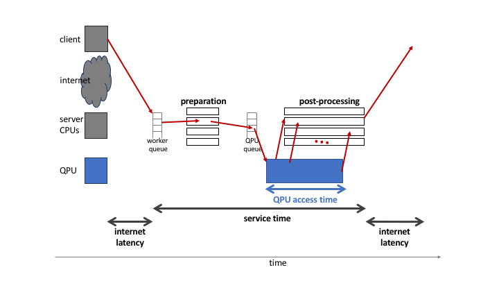
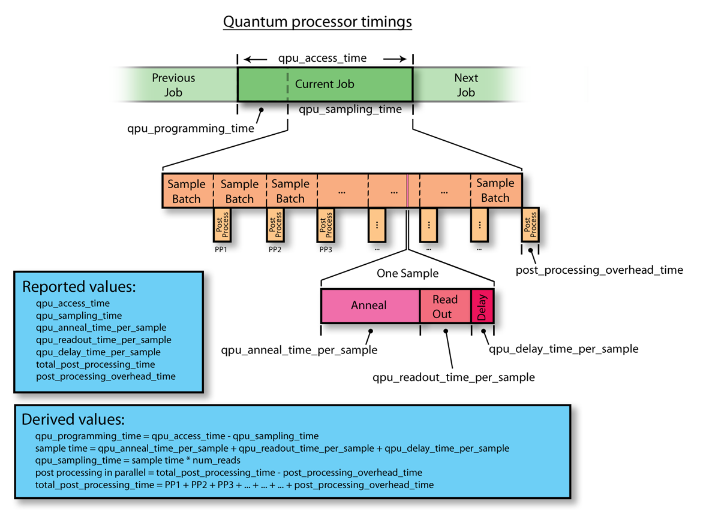
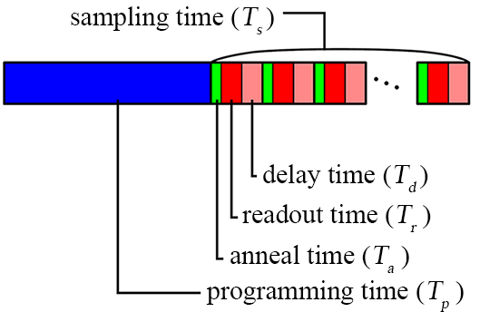
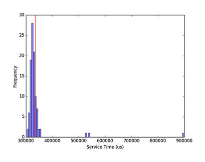

.. _qpu_operation_timing:

====================
Operation and Timing
====================

This section describes the computation process of |dwave_short| quantum
computers, focusing on system timing, as follows:

*   :ref:`qpu_timing_overview` overviews the time allocated to a quantum machine
    instruction (QMI) while sections :ref:`qpu_timing_breakdown_service` and
    :ref:`qpu_timing_breakdown_access` detail its parts, including the
    programming cycle and the anneal-read cycle of the |dwave_short| QPU.
*   :ref:`qpu_qpu_usage_charges` and :ref:`qpu_admin_stats_total_time` specify
    how solver usage is charged and reported in statistics for administrators.
*   :ref:`qpu_timing_runtime_limits` and :ref:`qpu_runtime_estimating` explain
    the limits on QMI runtime duration and how to estimate the runtime for your
    problems.
*   :ref:`qpu_sapi_qpu_timing` describes timing-related fields in the Solver
    API (SAPI).
*   :ref:`qpu_timing_source_variation` describes sources of variation and error
    in timing.

.. _qpu_timing_overview:

QMI Timing
==========

:numref:`Fig. %s <highlevel_timing>` shows a simplified diagram of the sequence
of steps, the dark red set of arrows, to execute a quantum machine instruction
(QMI) on a |dwave_short| system, starting and ending on a user's client system.
Each QMI consists of a single input together with parameters. A QMI is sent
across a network to the SAPI server and joins a queue. Each queued QMI is
assigned to one of possibly multiple workers, which may run in parallel. A
worker prepares the QMI for the quantum processing unit (QPU) and
postprocessing\ [#]_\ , sends the QMI to the QPU queue, receives samples
(results) and post-processes them (overlapping in time with QPU execution), and
bundles the samples with additional QMI-execution information for return to the
client system.

.. [#]
    Server-side :ref:`postprocessing <qpu_postprocessing>` for |dwave_5kq|
    systems is limited to computing the energies of returned samples.
    :ref:`Ocean software <index_ocean_sdk>` provides additional
    client-side postprocessing tools.

        highlighting QPU access and service time.

    Overview of execution of a single QMI, starting from a client system, and
    distinguishing classical (client, CPU) and quantum (QPU) execution.

The total time for a QMI to pass through the |dwave_short| system is the
:ref:`service time <qpu_timing_breakdown_service>`.
The execution time for a QMI as observed by a client includes service time and
internet latency. The QPU executes one QMI at a time, during which the QPU is
unavailable to any other QMI. This execution time is known as the QMI's
:ref:`QPU access time <qpu_timing_breakdown_access>`.

.. _qpu_timing_breakdown_service:

Service Time
============

The service time can be broken into:

-   Any time required by the worker before and after QPU access
-   Wait time in queues before and after QPU access
-   QPU access time
-   Postprocessing time

Service time is defined as the difference between the times of the QMI's ingress
(arrival at SAPI) and sample set's egress (exit from the quantum computer) for
each QMI.

Service time for a single QMI depends on the system load; that is, how many
other QMIs are present at a given time. During periods of heavy load, wait time
in the two queues may contribute to increased service times. |dwave_short| has
no control over system load under normal operating conditions. Therefore, it is
not possible to guarantee that service time targets can be met. Service time
measurements described in other |dwave_short| documents are intended only to
give a rough idea of the range of experience that might be found under varying
conditions.

.. dropdown:: Viewing the Service Time for Your Problems

    You can know the service time for a submitted problem by calculating the
    difference between its recorded egress and ingress times.

    On the dashboard in the Leap service, you can select a submitted problem (by
    your assigned label or its SAPI-assigned identifier) and view those times as
    shown here:

    .. figure:: ../_images/leap_service_time.png
        :name: leapServiceTime
        :alt: Snapshot of the Leap service's Problem Parameters for the problem.

        Ingress and egress times for a problem in the Leap service.

    Alternatively, you can retrieve this same information from SAPI in various
    ways, as demonstrated in the :ref:`qpu_sapi_qpu_timing` section and in
    examples in the :ref:`leap_sapi_rest` section.

Postprocessing Time
-------------------

Server-side postprocessing for |dwave_5kq| systems is limited to computing the
energies of returned samples.\ [#]_ As shown in the :ref:`qpu_postprocessing`
section, more complex postprocessing can provide performance benefits at low
timing cost. :ref:`Ocean software <index_ocean_sdk>` provides such additional
client-side postprocessing tools.

.. [#]
    Earlier |dwave_short| systems, such as the |dwave_2kq| system, optionally
    provided additional server-side postprocessing.

:numref:`Figure %s <timing_structure>` shows how a problem's set of samples are
batched and sent through the postprocessing solver as the next batch is being
computed by the QPU. Server-side postprocessing works in parallel with sampling,
so that the computation times overlap except for postprocessing the last batch
of samples.

        entire span of a current problem is reported as QPU access time. This is
        divided into two parts: QPU programming time and QPU sampling time. QPU
        sampling time is further broken down into individual samples (reads),
        each of which requires anneal time, readout time, and a small QPU delay
        time per sample. Sampling time may also include postprocessing time if
        this is enabled for the problem. A small about of postprocessing
        overhead time is also required for each problem regardless of whether
        postprocessing is enabled. In summary, the system reports back the
        following values: QPU access time, QPU sampling time, QPU anneal time
        per sample, QPU readout time per sample, QPU delay time per sample,
        total postprocessing time, and postprocessing overhead time.

    Relationship of QPU time to postprocessing time, illustrated by one QMI in a
    sequence (previous, current, next).

Postprocessing overhead is designed not to impose any delay to QPU access for
the next QMI, because postprocessing of the last batch of samples takes place
concurrently with the next QMI's programming time.

.. dropdown:: Viewing the Postprocessing Time for Your Problems

    As shown in :numref:`Fig. %s <timing_structure>`,
    ``total_post_processing_time`` is the sum of all times for the
    "Post Process" boxes while ``post_processing_overhead_time`` is the extra
    time needed (a single "Post Process" box) to process the last batch of
    samples. This latter time together with ``qpu_access_time`` contributes to
    overall service time.

    On the dashboard in the Leap service, you can click on a submitted problem
    identified by your assigned label or its SAPI-assigned identifier and see
    its postprocessing times. Alternatively, you can retrieve this same
    information from SAPI as demonstrated in the :ref:`qpu_sapi_qpu_timing`
    section.

.. _qpu_timing_breakdown_access:

QPU Access Time
===============

As illustrated in :numref:`Figure %s <QPU_access_time>`, the time to execute a
single QMI on a QPU, *QPU access* time, is broken into two parts: a one-time
initialization step to program the QPU (blue) and typically multiple sampling
times for the actual execution on the QPU (repeated multicolor).

        horizontal axis in this diagram is time, because this diagram shows how
        the QPU access time changes over time. QPU access time begins with the
        single largest fixed block of time: programming time. This block is the
        same regardless of the number of samples specified. The rest of the
        block repeats per sample (within a repeating block called QPU sampling
        time): QPU anneal time per sample, QPU readout time per sample, QPU
        readout time per sample, and QPU delay time per sample.

    Detail of QPU access time.

The QPU access time also includes some overhead:

.. math::

    T  =   T_p +  \Delta +  T_s,

where :math:`T_P` is the programming time, :math:`T_s` is the sampling time, and
:math:`\Delta` (reported as *qpu_access_overhead_time* by SAPI and not included
in the *qpu_access_time* SAPI field that reports the QPU-usage time being
:ref:`charged <qpu_qpu_usage_charges>`) is an initialization time spent in
low-level operations, roughly 10-20 ms for |dwave_5kq| systems.

The time for a single sample is further broken into anneal (the anneal
proper; green), readout (read the sample from the QPU; red), and thermalization
(wait for the QPU to regain its initial temperature; pink).
Possible rounding errors mean that the sum of these times may not match
the total sampling time reported.

.. math::

    T_s  / R   \approx  T_a  + T_r + T_d,

where :math:`R` is the number of reads, :math:`T_a` the single-sample annealing
time, :math:`T_r` the single-sample readout time, and :math:`T_d` the
single-sample delay time, which consists of the following optional
components\ [#]_\ :

.. math::

    T_d  = &readout\_thermalization \\
    &+ reduce\_intersample\_correlation \\
    &+ reinitialize\_state.

.. [#]
    See descriptions of these components under
    :ref:`qpu_solver_parameters`. The
    :ref:`parameter_qpu_reinitialize_state` parameter is used only for reverse
    annealing.

Programming Cycle
-----------------

When an Ising problem is provided as a set of :ref:`parameter_qpu_h` and
:ref:`parameter_qpu_j` values,\ [#]_ the |dwave_short| system conveys those
values to the DACs located on the QPU. Room-temperature electronics generate the
raw signals that are sent via wires into the refrigerator to program the DACs.
The DACs then apply static magnetic-control signals locally to the qubits and
couplers. This is the *programming cycle* of the QPU.\ [#]_ After the
programming cycle, the QPU is allowed to cool for a postprogramming
thermalization time of, typically, 1 ms; see the :ref:`qpu_errors_temperature`
section for more details about this cooling time.

.. [#]
    Several other instructions to the system are provided by the user: for
    example, an :ref:`parameter_qpu_annealing_time` over which the quantum
    annealing process is to occur. See the :ref:`qpu_solver_parameters` section.

.. [#]
    In some descriptions, the programming cycle is subdivided into a reset step
    that erases previous data stored in the DACs, followed by a programming
    step.

The total time spent programming the QPU, including the postprogramming
thermalization time, is reported back as *qpu_programming_time.*

Anneal-Read Cycle
-----------------

After the programming cycle, the system switches to the annealing phase during
which the QPU is repeatedly annealed and read out. Annealing is performed using
the analog lines over a time specified by the user as
:ref:`parameter_qpu_annealing_time` and reported by the QPU as
*qpu_anneal_time_per_sample.* Afterward, the digital readout system of the QPU
reads and returns the spin states of the qubits. The system is then allowed to
cool for a time returned by the QPU as *qpu_delay_time_per_sample*---an interval
comprising a constant value plus any additional time optionally specified by the
user via the :ref:`parameter_qpu_readout_thermalization` parameter. During
*qpu_delay_time_per_sample*, the QPU returns to the superposition state; that
is, the ground state of the initial Hamiltonion.\ [#]_

The anneal-read cycle is also referred to as a *sample.* The cycle repeats for
some number of samples specified by the user in the
:ref:`parameter_qpu_num_reads` parameter, and returns one solution per sample.
The total time to complete the requested number of samples is returned by the
QPU as *qpu_sampling_time.*

.. [#] For :ref:`reverse annealing <qpu_qa_anneal_sched_reverse>`,
    see the :ref:`parameter_qpu_initial_state` and
    :ref:`parameter_qpu_reinitialize_state` solver parameters.

.. _qpu_qpu_usage_charges:

Usage Charge Time
=================

|dwave_short| charges you for time that solvers run your problems, with rates
depending on QPU usage. You can see the rate at which your account's quota is
consumed for a particular solver in the solver's
:ref:`property_qpu_quota_conversion_rate` property.

You can see the time you are charged for in the responses returned for your
submitted problems. The relevant field in the response is
:code:`'qpu_access_time'`. The example in the :ref:`qpu_sapi_qpu_timing` section
shows :code:`'qpu_access_time': 9687` in the returned response, meaning almost
10 milliseconds are being charged.

For example, for a QPU solver with a
:ref:`quota conversion rate <property_qpu_quota_conversion_rate>` of 1, a
problem that results in a :code:`'qpu_access_time': 1500`, deducts
1.5 milliseconds seconds from your account's quota.

.. _qpu_admin_stats_total_time:

Reported Time (Statistics)
==========================

One timing parameter, *qpu_access_time*, provides the raw data for the
"Total Time" values reported as system statistics, available to administrators.
Reported statistics are the sum of the *qpu_access_time* values for each QMI
selected by the users, solvers, and time periods selected in the filter.

.. note::
    Reported statistics are in milliseconds, while SAPI inputs and outputs are
    in microseconds.  One millisecond is 1000 microseconds.

.. _qpu_timing_runtime_limits:

QMI Runtime Limit
=================

The |dwave_short| system limits your ability to submit a long-running QMI to
prevent you from inadvertently monopolizing QPU time. This limit varies by
system; check the :ref:`property_qpu_problem_run_duration_range` property for
your solver.

The limit is calculated according to the following formula:

.. math::
    :nowrap:

    \begin{equation}
        Duration = ((P_1 + P_2) * P_3) + P_4
    \end{equation}

where :math:`P_1`, :math:`P_2`, :math:`P_3`, and :math:`P_4` are the values
specified for the :ref:`parameter_qpu_annealing_time`,
:ref:`parameter_qpu_readout_thermalization`,
:ref:`parameter_qpu_num_reads` (samples), and
:ref:`parameter_qpu_programming_thermalization` parameters, respectively.

If you attempt to submit a QMI whose execution time would exceed the limit for
your system, an error is returned showing the values in microseconds. For
example:

.. parsed-literal::

    ERROR: Upper limit on user-specified timing related parameters exceeded: 12010000 > 3000000

Note that it is possible to specify values that fall within the permitted ranges
for each individual parameter, yet together cause the time to execute the QMI to
surpass the limit.

.. _qpu_timing_runtime_limit_keep_within:

Keeping Within the Runtime Limit
--------------------------------

If you are submitting long-duration problems directly to QPUs, you may need to
make multiple problem submissions to avoid exceeding the runtime limit.\ [#]_
You can always divide the required number of reads among these submissions such
that the runtime for each submission is equal to or less than the QPU's runtime
limit. For example, if a QPU has a runtime limit of 1,000,000 microseconds (1
second) and a problem has an estimated runtime of 3,750,000 microseconds for
1000 reads, the problem could be divided into four submissions of 250 reads
each. (With
:ref:`spin-reversal transforms (SRTs) <qpu_config_srt>`, you
similarly divide your samples into such batches; consider using
:ref:`Ocean software <index_ocean_sdk>`'s
:class:`~dwave.preprocessing.composites.SpinReversalTransformComposite`
composite to also benefit from potential reduction in QPU biases.)

For a detailed breakdown of the QPU access-time estimates
for your problem submission, see the :ref:`qpu_runtime_estimating` section.

.. [#] You could also adjust timing-related solver parameters. For information
    about solver parameters, see the :ref:`qpu_solver_parameters` section.
    section.

.. _qpu_runtime_estimating:

Estimating Access Time
======================

You can estimate a problem's QPU access time from the parameter values you
specify, timing data provided in the :ref:`property_qpu_problem_timing_data`
solver property, and the number of qubits used to embed\ [#]_ the problem on the
selected QPU.

Ocean software's
:meth:`~oceandocs:dwave.cloud.solver.StructuredSolver.estimate_qpu_access_time`
method implements the procedure described in the table below. The following
example uses this method to estimate the QPU access time for a random problem
with a 20-node complete graph using an anneal schedule that sets a ~1 ms pause
on a |dwave_short| quantum computer. For the particular execution shown in this
example, quantum computer system ``Advantage_system4.1`` was selected, the
required QPU access time for 50 samples found acceptable, and the problem then
submitted to that quantum computer with the same embedding used in the time
estimation.

.. testsetup::

    estimated_runtime = 75005
    # For https://github.com/dwavesystems/dwave-system/pull/443#issuecomment-1211404745
    embedding = {0: (180, 181, 2940), 1: (195, 196, 2955), 2: (150, 151, 2970),
                 3: (165, 166, 2985), 4: (210, 211, 3000), 5: (225, 226, 3015),
                 6: (240, 241, 3240), 7: (255, 256, 3255), 8: (270, 271, 3030),
                 9: (285, 286, 3045), 10: (300, 301, 3210), 11: (315, 316, 3225),
                 12: (90, 3150, 3151), 13: (105, 3165, 3166), 14: (330, 3060, 3061),
                 15: (345, 3075, 3076), 16: (361, 3090, 3091), 17: (376, 3105, 3106),
                 18: (60, 3120, 3121), 19: (75, 3135, 3136)}

>>> from dwave.system import DWaveSampler, FixedEmbeddingComposite
>>> from minorminer.busclique import find_clique_embedding
>>> import dimod
...
>>> # Create a random problem with a complete graph
>>> bqm = dimod.generators.uniform(20, "BINARY")
...
>>> # Select a QPU, find an embedding for the problem and the number of required qubits
>>> qpu = DWaveSampler()
>>> embedding = find_clique_embedding(bqm.variables, qpu.to_networkx_graph())  # doctest: +SKIP
>>> num_qubits = sum(len(chain) for chain in embedding.values())
...
>>> # Define the submission parameters and estimate the required time
>>> MAX_TIME = 500000   # limit single-problem submissions to 0.5 seconds
>>> num_reads = 50
>>> anneal_schedule = [[0.0, 0.0], [40.0, 0.4], [1040.0, 0.4], [1042, 1.0]]
>>> estimated_runtime = qpu.solver.estimate_qpu_access_time(num_qubits,
...    num_reads=num_reads, anneal_schedule=anneal_schedule)    # doctest: +SKIP
>>> print("Estimate of {:.0f}us on {}".format(estimated_runtime, qpu.solver.name))  # doctest: +SKIP
Estimate of 75005us on Advantage_system4.1
...
>>> # Submit to the same solver with the same embedding
>>> if estimated_runtime < MAX_TIME:
...    sampleset = FixedEmbeddingComposite(qpu, embedding).sample(bqm,
...       num_reads=num_reads, anneal_schedule=anneal_schedule)   # doctest: +SKIP

The following table provides a procedure for collecting the required information
and calculating the runtime estimation for versions 1.0.x\ [#]_ of the
:ref:`timing model <property_qpu_problem_timing_data>`.

.. list-table:: Estimating the QPU Access Time for Problems
    :widths: 10 20 70
    :header-rows: 1

    *   -   Row
        -   QMI Time Component
        -   Instruction
    *   -   1
        -   Typical programming time
        -   Take the value from the
            :ref:`typical_programming_time <property_qpu_problem_timing_data>`
            field.
    *   -   2
        -   Reverse annealing programming time
        -   If reverse annealing is used, take the value from one of the the
            fields of the :ref:`property_qpu_problem_timing_data` solver
            property as follows:

            *   If the :ref:`parameter_qpu_reinitialize_state` parameter is
                specified as true, then take the value from
                ``reverse_annealing_with_reinit_prog_time_delta``.
            *   If the :ref:`parameter_qpu_reinitialize_state` parameter is
                specified as false, then take the value from
                ``reverse_annealing_without_reinit_prog_time_delta``.

            Otherwise, the value is 0.
    *   -   3
        -   Programming thermalization time
        -   Take the value from either the
            :ref:`parameter_qpu_programming_thermalization` solver parameter, if
            specified, or the
            :ref:`default_programming_thermalization <property_qpu_problem_timing_data>`
            field.
    *   -   4
        -   Total programming time
        -   Add rows 1--3.
    *   -   5
        -   Anneal time
        -   Take the anneal time specified in the
            :ref:`parameter_qpu_anneal_schedule` or
            :ref:`parameter_qpu_annealing_time` solver parameter; otherwise,
            take the value from the
            :ref:`default_annealing_time <property_qpu_problem_timing_data>`
            field.
    *   -   6
        -   Readout time
        -   Calculate this value using the :mod:`numpy` functions
            :func:`numpy.interp` and :func:`numpy.emath.log10` and the Python
            function :func:`pow` as follows:

            *   If :ref:`readout_time_model <property_qpu_problem_timing_data>`
                is ``pwl_log_log``, then the following Python code can be used:

                ``pow(10, interp(log10(m), q, t))``

            *   If :ref:`readout_time_model <property_qpu_problem_timing_data>`
                is ``pwl_linear``, then the following Python code can be used:

                ``interp(m, q, t)``

            where ``m`` is the number of qubits in the
            :term:`embedded <embed>` problem and
            ``q = readout_time_model_parameters[0:N]`` and
            ``t = readout_time_model_parameters[N:2N]`` are the first ``N`` and
            last ``N`` elements of the
            ``2N = len(readout_time_model_parameters)`` elements of the
            :ref:`property_qpu_problem_timing_data` solver property's
            ``readout_time_model_parameters`` field.
    *   -   7
        -   Delay time
        -   Take the value from the
            :ref:`qpu_delay_time_per_sample <property_qpu_problem_timing_data>`
            field.
    *   -   8
        -   Reverse annealing delay time
        -   If reverse annealing is used, take the value from one of the
            following fields of the :ref:`property_qpu_problem_timing_data`
            solver property:

            *   If the :ref:`parameter_qpu_reinitialize_state` parameter is
                specified as true, then take the value from
                ``reverse_annealing_with_reinit_delay_time_delta``.

            *   If the :ref:`parameter_qpu_reinitialize_state` parameter is
                specified as false, then take the value from
                ``reverse_annealing_without_reinit_delay_time_delta``.
    *   -   9
        -   Readout thermalization time
        -   Take the value from either the
            :ref:`parameter_qpu_readout_thermalization` solver parameter, if
            specified, or the :ref:`property_qpu_default_readout_thermalization`
            solver property.
    *   -   10
        -   Decorrelation time
        -   If the :ref:`parameter_qpu_reduce_intersample_correlation` solver
            parameter is specified as true, then the following Python code can
            be used to calculate the decorrelation time:

            ``a / m * (r[1] - r[0]) + r[0]``

            where ``a`` is the anneal time (row 5), ``m`` is the
            :ref:`decorrelation_max_nominal_anneal_time <property_qpu_problem_timing_data>`
            field, ``r[0]`` and ``r[1]`` are the first and last elements of the
            :ref:`decorrelation_time_range <property_qpu_problem_timing_data>`
            field.

            If the :ref:`parameter_qpu_reduce_intersample_correlation` solver
            parameter is false, the value is 0.
    *   -   11
        -   Sampling time per read
        -   Add rows 5--8 and the larger of either row 9 or 10.
    *   -   12
        -   Number of reads
        -   Take the value from the :ref:`parameter_qpu_num_reads` solver
            parameter.
    *   -   13
        -   Total sampling time
        -   Multiply row 11 by row 12.
    *   -   14
        -   QPU access time
        -   Add row 4 and 13.

.. [#]
    Embedding is typically heuristic and the number of required qubits can vary
    between executions. If you are using a heuristic embedding tool such as
    :ref:`minorminor <index_minorminer>` indirectly through your sampler (e.g.,
    by using Ocean’s
    :class:`~oceandocs:dwave.system.composites.EmbeddingComposite` or
    :class:`~oceandocs:dwave.system.samplers.DWaveCliqueSampler`), you can use
    the same tool on your problem to estimate the expected number of qubits: for
    large, complex problems you might run the tool several times and take the
    number of qubits from the produced average or worst-case embedding; for
    small, simple problems even a single run might be sufficient. If you are
    using such a tool directly (e.g., in conjunction with Ocean's
    :class:`~oceandocs:dwave.system.composites.FixedEmbeddingComposite`) or
    otherwise generating a heuristic or non-heuristic embedding, take the
    required number of qubits from your embedding. Because embedding depends on
    a QPU's working graph, such embeddings should be for the particular QPU for
    which you are estimating the access time.

.. [#]
    The version is specified in the :ref:`property_qpu_problem_timing_data`
    solver property.

.. _qpu_sapi_qpu_timing:

SAPI Timing Fields
==================

The table below lists the timing-related fields available in |dwave_short|'s
:ref:`Ocean SDK <index_ocean_sdk>` and which you can access from
the ``info`` field in the :ref:`dimod <index_dimod>` ``sampleset`` class, as in
the example below. Note that the time is given in microseconds with a resolution
of at least 0.01 :math:`\mu s`.\ [#]_

.. [#] Time resolution is higher for some fields, such as
    ``qpu_anneal_time_per_sample``, which can be meaningful when the
    :ref:`fast-anneal protocol <qpu_annealprotocol_fast>` is used.

>>> from dwave.system import DWaveSampler, EmbeddingComposite
>>> sampler = EmbeddingComposite(DWaveSampler())
>>> sampleset = sampler.sample_ising({'a': 1}, {('a', 'b'): 1})
>>> print(sampleset.info["timing"])   # doctest: +SKIP
{'qpu_sampling_time': 80.78,
 'qpu_anneal_time_per_sample': 20.0,
 'qpu_readout_time_per_sample': 39.76,
 'qpu_access_time': 16016.18,
 'qpu_access_overhead_time': 10426.82,
 'qpu_programming_time': 15935.4,
 'qpu_delay_time_per_sample': 21.02,
 'total_post_processing_time': 809.0,
 'post_processing_overhead_time': 809.0}

.. list-table:: Fields that affect *qpu_access_time*
    :widths: 10 30 20 40
    :header-rows: 1

    *   -   QMI Time Component
        -   SAPI Field Name
        -   Meaning
        -   Affected by
    *   -   :math:`T`
        -   *qpu_access_time*
        -   Total time in QPU
        -   All parameters listed below
    *   -   :math:`T_p`
        -   *qpu_programming_time*
        -   Total time to program the QPU\ [#]_
        -   *programming_thermalization*, weakly affected by other problem
            settings (such as :math:`h`, :math:`J`, *anneal_offsets*,
            *flux_offsets*, and *h_gain_schedule*)
    *   -   :math:`\Delta`
        -   ..
        -   Time for additional low-level operations
        -
    *   -   :math:`R`
        -   ..
        -   Number of reads (samples)
        -   *num_reads*
    *   -   :math:`T_s`
        -   *qpu_sampling_time*
        -   Total time for :math:`R` samples
        -   *num_reads*, :math:`T_a`, :math:`T_r`, :math:`T_d`
    *   -   :math:`T_a`
        -   *qpu_anneal_time_per_sample*
        -   Time for one anneal
        -   *anneal_schedule*, *annealing_time*
    *   -   :math:`T_r`
        -   *qpu_readout_time_per_sample*
        -   Time for one read
        -   Number of qubits read\ [#]_
    *   -   :math:`T_d`
        -   *qpu_delay_time_per_sample*
        -   Delay between anneals\ [#]_
        -   *anneal_schedule*, *readout_thermalization*,
            *reduce_intersample_correlation*, (only in case of reverse
            annealing), *reinitialize_state*

.. [#]
    Even if *programming_thermalization* is 0, :math:`T_p` is typically between
    10 and 20 ms depending on processor and describes the time spent setting the
    :math:`h` and :math:`J` parameters of the problem as well as other features
    such as *anneal_offsets*, *flux_offsets*, *h_gain_schedule*.

.. [#]
    The time to read a sample set from a |dwave_5kq| generation QPU depends on
    the location of the qubits on the processor and the number of qubits in the
    sample set: a problem represented by a dozen qubits has shorter read times
    (and so a shorter :math:`T_r`, the *total_readout_time*) than a problem
    represented by several thousand qubits.

    For the |dwave_5kq| QPU, this can be significant. For example, some small
    problems may take :math:`25\ \mu s` per read while a large problem might
    take :math:`150\ \mu s` per read.

.. [#]
    The time returned in the *qpu_delay_time_per_sample* field is equal to a
    constant plus the user-specified value, *readout_thermalization*.

Timing Data Returned by ``dwave-cloud-client``
----------------------------------------------

Below is a sample skeleton of Python code for accessing timing data returned by
``dwave-cloud-client``. Timing values are returned in the computation object and
the timing object; further code could query those objects in more detail. The
timing object referenced on line 16 is a Python dictionary containing (key,
value) pairs. The keys match keywords discussed in this section.

.. _Python:

.. code-block:: python

 01 import random
 02 import datetime as dt
 03 from dwave.cloud import Client

 04 # Connect using the default or environment connection information
 05 with Client.from_config() as client:

 06     # Load the default solver
 07     solver = client.get_solver()

 08     # Build a random Ising model to exactly fit the graph the solver supports
 09     linear = {index: random.choice([-1, 1]) for index in solver.nodes}
 10     quad = {key: random.choice([-1, 1]) for key in solver.undirected_edges}

 11     # Send the problem for sampling, include solver-specific parameter 'num_reads'
 12     computation = solver.sample_ising(linear, quad, num_reads=100)
 13     computation.wait()

 14     # Print the first sample out of a hundred
 15     print(computation.samples[0])
 16     timing = computation['timing']

 17     # Service time
 18     time_format = "%Y-%m-%d %H:%M:%S.%f"
 19     start_time = dt.datetime.strptime(str(computation.time_received)[:-6], time_format)
 20     finish_time = dt.datetime.strptime(str(computation.time_solved)[:-6], time_format)
 21     service_time = finish_time - start_time
 22     qpu_access_time = timing['qpu_access_time']
 23     print("start_time="+str(start_time)+", finish_time="+str(finish_time)+ \
 24             ", service_time="+str(service_time)+", qpu_access_time="       \
 25             +str(float(qpu_access_time)/1000000))

.. _qpu_timing_source_variation:

Timing Variation and Error
==========================

Running a program that accesses |dwave_short| systems across the internet or
even examining QPU-timing information may show variation from run to run from
the end-user's point of view. This section describes some of the possible
sources of such variation.

Nondedicated QPU Use
--------------------

|dwave_short| systems are typically shared among multiple users, each of whom
submits QMIs to solve a problem, with little to no synchronization among users.
(A single user may also have multiple client programs submitting unsynchronized
QMIs to a |dwave_short| system.) The QPU must be used by a single QMI at a time,
so the |dwave_short| system software ensures that multiple QMIs flow through the
system and use the QPU sequentially. In general, this means that a QMI may get
queued for the QPU or some other resource, injecting indeterminacy into the
timing of execution.

.. note::
    Contact your |dwave_short| system administrator or |support_email| if you
    need to ensure a quiet system.

Nondeterminacy of Classical System Timings
------------------------------------------

Even when a system is quiet except for the program to be measured, timings often
vary. As illustrated in
:numref:`Fig. %s <plot_distr_sequential_workflow_results>`, running a given code
block repeatedly can yield different runtimes on a classical system, even though
the instruction execution sequence does not change. Runtime distributions with
occasional large outliers, as seen here, are not unusual.

        plotted against the frequency of their occurrence. Along the horizontal
        axis is service time in microseconds from 300,000 to 900000, marked in
        intervals of 100,000. Along the vertical axis is frequency from 0 to 30,
        marked in intervals of 5. The histogram is annotated with a line showing
        the mean runtime of 336.5 ms, which is higher than 75 percent of the
        results.

    Histogram of 100 measurements of classical execution time using a wall clock
    timer, showing that the mean time of 336.5 ms (red line) is higher than 75
    percent of the measurements.

Timing variations are routine, caused by noise from the operating system (e.g.,
scheduling, memory management, and power management) and the runtime environment
(e.g., garbage collection, just-in-time compilation, and thread migration). [#]_
In addition, the internal architecture of the classical portion of the
|dwave_short| system includes multiple hardware nodes and software servers,
introducing communication among these servers as another source of variation.

For these reasons, mean reported runtimes can often be higher than median
runtimes: for example, in
:numref:`Fig. %s <plot_distr_sequential_workflow_results>`, the mean time of
336.5 ms (vertical red line) is higher than 75 percent of the measured runtimes
due to a few extreme outliers (one about 3 times higher and two almost 2 times
higher than median). As a result, mean runtimes tend to exceed median runtimes.
In this context, the smallest time recorded for a single process is considered
the most accurate, because noise from outside sources can only increase elapsed
time.\ [#]_ Because system activity increases with the number of active QMIs,
the most accurate times for a single process are obtained by measuring on an
otherwise quiet system.

.. note::
    The 336 ms mean time shown for this particular QMI is not intended to be
    representative of QMI execution times.

The cost of reading a system timer may impose additional measurement errors,
since querying the system clock can take microseconds. To reduce the impact of
timing code itself, a given code block may be measured outside a loop that
executes it many times, with running time calculated as the average time per
iteration. Because of system and runtime noise and timer latency, component
times measured one way may not add up to total times measured another way.\ [#]_
These sources of timer variation or error are present on all computer systems,
including the classical portion of |dwave_short| platforms. Normal timer
variation as described here may occasionally yield atypical and imprecise
results; also, one expects wall clock times to vary with the particular system
configuration and with system load.

.. [#]
    A more common practice in computational research is to report an alternative
    measurement called CPU time, which is intended to filter out operating
    system noise. However, CPU timers are only accurate to tens of milliseconds,
    and CPU times are not available for QPU time measurements. For consistency,
    we use wall clock times throughout.

.. [#]
    Randal E. Bryant and David R. O'Hallaron,
    *Computer Systems: A Programmer's Perspective (2nd Edition)*, Pearson, 2010.

.. [#]
    Paulo Eduardo Nogueira, Rivalino Matias, Jr., and Elder Vicente,
    *An Experimental Study on Execution Time Variation in Computer Experiments*,
    ACM Symposium on Applied Computing, 2014.

Internet Latency
----------------

If you are running your program on a client system geographically remote from
the |dwave_short| system on which you're executing, you will likely encounter
latency and variability from the internet connection itself (see
:numref:`Fig. %s <highlevel_timing>`).

Settings of User-Specified Parameters
-------------------------------------

The following user-specified parameters can cause timing to change, but should
not affect the variability of timing. For more information on these parameters,
see the :ref:`qpu_solver_parameters` section.

*   :ref:`parameter_qpu_anneal_schedule`---User-provided anneal schedule.
    Specifies the points at which to change the default schedule. Each point is
    a pair of values representing time :math:`t` in microseconds and normalized
    anneal fraction :math:`s`. The system connects the points with
    piecewise-linear ramps to construct the new schedule. If
    :ref:`parameter_qpu_anneal_schedule` is specified, :math:`T_a`,
    *qpu_anneal_time_per_sample* is populated with the total time specified by
    the piecewise-linear schedule.
*   :ref:`parameter_qpu_annealing_time`---Duration, in microseconds, of quantum
    annealing time. This value populates :math:`T_a`,
    *qpu_anneal_time_per_sample*.
*   :ref:`parameter_qpu_num_reads`---Number of samples to read from the solver
    per QMI.
*   :ref:`parameter_qpu_programming_thermalization`---Number of microseconds to
    wait after programming the QPU to allow it to cool; i.e.,
    *post-programming thermalization time*. Values lower than the default
    accelerate solving at the expense of solution quality. This value
    contributes to the total :math:`T_p`, *qpu_programming_time*.
*   :ref:`parameter_qpu_readout_thermalization`---Number of microseconds to wait
    after each sample is read from the QPU to allow it to cool to base
    temperature; i.e., *post-readout thermalization time*. This optional value
    contributes to :math:`T_d`, *qpu_delay_time_per_sample*.
*   :ref:`parameter_qpu_reduce_intersample_correlation`---Used to reduce
    sample-to-sample correlations. When true, adds to :math:`T_d`,
    *qpu_delay_time_per_sample*. Amount of time added increases linearly with
    increasing length of the anneal schedule.
*   :ref:`parameter_qpu_reinitialize_state`---Used in reverse annealing. When
    ``True`` (the default setting), reinitializes the initial qubit state for
    every anneal-readout cycle, adding between 100 and 600 microseconds to
    :math:`T_d`, *qpu_delay_time_per_sample*. When ``False``, adds approximately
    10 microseconds to :math:`T_d`.\ [#]_

.. note::
    Depending on the parameters chosen for a QMI, QPU access time may be a large
    or small fraction of service time. E.g., a QMI requesting a single sample
    with short :ref:`parameter_qpu_annealing_time` would see programming time as
    a large fraction of service time and QPU access time as a small fraction.

.. [#]
    Amount of time varies by system.

