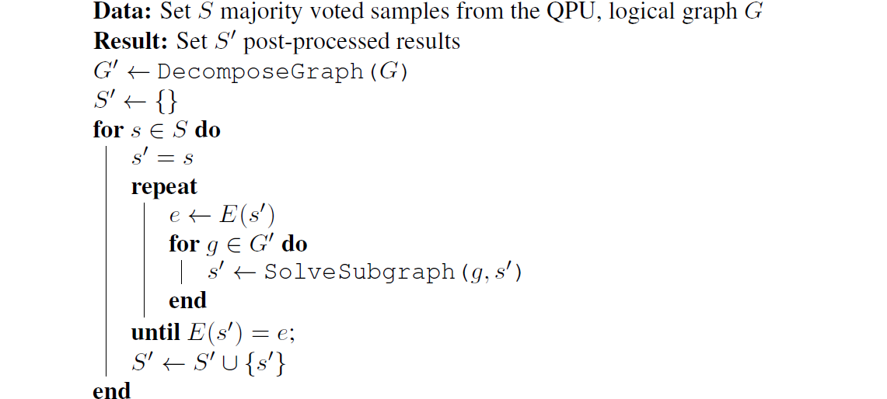
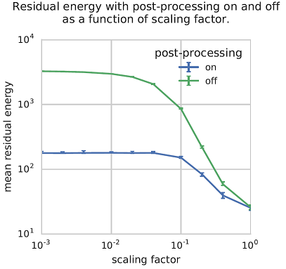
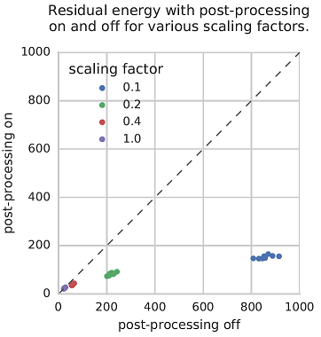
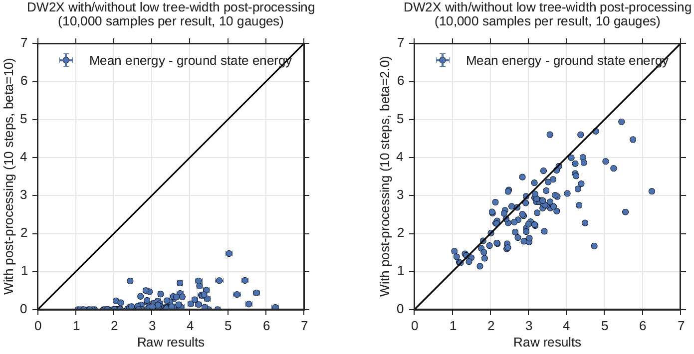
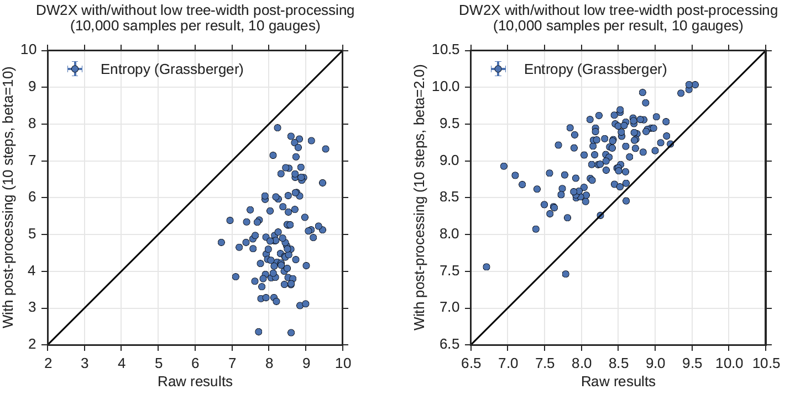
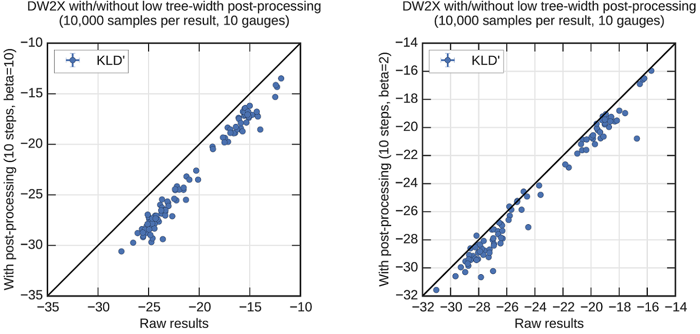
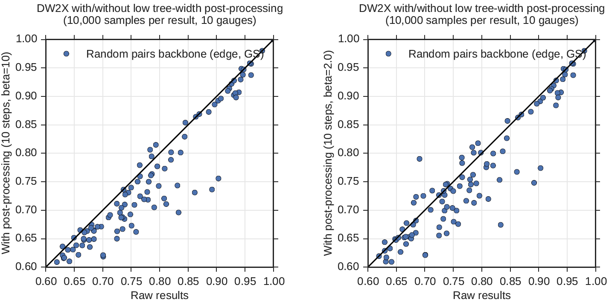
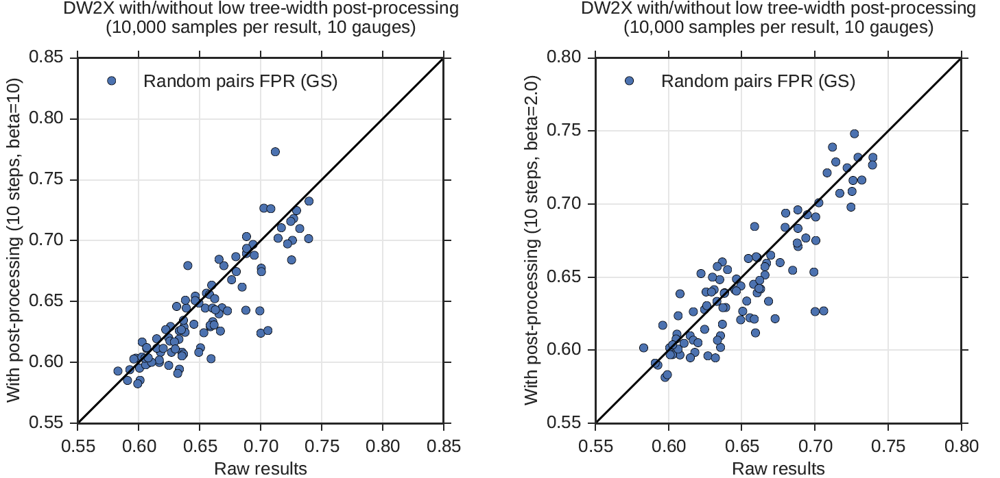

.. _qpu_postprocessing:

==============
Postprocessing
==============

Postprocessing optimization and sampling algorithms provide local improvements
with minimal overhead to solutions obtained from the quantum processing unit
(QPU).

Server-side postprocessing for |dwave_5kq| systems is limited to computing the
energies of returned samples\ [#]_ but :ref:`Ocean software <index_ocean_sdk>`
provides additional client-side postprocessing tools (see, for example, the
:ref:`Postprocessing with a Greedy Solver <qpu_example_pp_greedy>` section).

.. [#]
    Earlier |dwave_short| systems, such as the |dwave_2kq| system, optionally
    provided additional postprocessing server-side.

This appendix provides an overview of some postprocessing methods for your
consideration and presents the results of a number of tests conducted by
|dwave_short| on the postprocessor of one of |dwave_short|'s previous quantum
computers, the |dwave_2kq| or DW2X systems.

.. _qpu_pp_types:

Optimization and Sampling Postprocessing
========================================

For optimization problems, the goal is to find the state vector with the lowest
energy. For sampling problems, the goal is to produce samples from a specific
probability distribution. In both cases, a logical graph structure is defined
and embedded into the QPU’s topology. Postprocessing methods are applied to
solutions defined on this logical graph structure.

.. _Optimization_Postprocessing:

Optimization Postprocessing
---------------------------

The goal of optimization postprocessing is to obtain a set of samples with
lowest energy on a graph :math:`G`. For simplicity of discussion, assume that
:math:`G` is a logical graph. Pseudocode for optimization postprocessing is
shown below. The postprocessing method works by performing local updates to the
state vector :math:`S` based on low treewidth graphs. Specifically, the
*DecomposeGraph* function uses a set of algorithms based on the minimum-degree
[Mar1957]_ heuristic to decompose graph :math:`G` into several low treewidth
subgraphs that cover the nodes and edges of :math:`G`. The *SolveSubgraph*
function is then used to update the solution on each subgraph to obtain a
locally optimal solution :math:`s'`. *SolveSubgraph* is an exact solver for low
treewidth graphs based on belief propagation on junction trees [Jen1990]_.

        the set of majority voted samples, S, from the QPU's logical graph
        and the result is postprocessed results for S prime.

    Optimization postprocessing algorithm.

.. the latex code

    |nbsp|

    .. math::
        :nowrap:

        \begin{algorithm}[H]
        \KwData{Set $S$ majority voted samples from the QPU, logical graph $G$}
        \KwResult{Set $S'$ post-processed results}
        \SetKwFunction{DecomposeGraph}{DecomposeGraph}
        \SetKwFunction{SolveSubgraph}{SolveSubgraph}
            $G' \gets$ \DecomposeGraph{$G$}\\
            $S'$ $\gets\lbrace\rbrace$\\
            \For{$s \in S$}{
            $s'=s$\\
                \Repeat{$E(s') = e$ }{
                    $e \gets E(s')$\\
                    \For {$g \in G'$}{
                        $s' \gets$ \SolveSubgraph{$g, s'$}
                    }
                }
            $S'\gets S' \cup \lbrace s'\rbrace$

            }
        \caption{Optimization postprocessing algorithm}
        \label{alg_opt}
        \end{algorithm}

.. _qpu_pp_types_sampling:

Sampling Postprocessing
-----------------------

In sampling mode, the goal of postprocessing is to obtain a set of samples that
correspond to a target Boltzmann distribution with inverse temperature
:math:`\beta` defined on the logical graph :math:`G`. The pseudocode for
sampling postprocessing is shown below. As with optimization postprocessing, the
graph :math:`G` is decomposed into low treewidth subgraphs :math:`G'` that cover
:math:`G`. On each subgraph, the state variables :math:`S` obtained from the QPU
are then updated using the *SampleSubgraph* function to match the exact
Boltzmann distribution conditioned on the states of the variables outside the
subgraph. Such algorithms should enable users to set the number of subgraph
update iterations :math:`n` and the choice of :math:`\beta`. Heuristically, this
inverse temperature depends on model parameters in the Hamiltonian. As a general
rule, :math:`\beta` should be set to a value close to an inverse temperature
corresponding to raw QPU samples. Some variation from a classical Boltzmann
distribution is expected in postprocessed samples. See
:ref:`qpu_pp_tests_sampling` for discussion.

.. figure:: ../_images/alg2.png
    :name: algorithm_2
    :alt: Sampling postprocessing algorithm, showing that the start is the
        set of majority voted samples, S, from the QPU's logical graph, with
        inverse temperature beta, and iteration number N. The result is
        postprocessed results for S prime.

    Sampling postprocessing algorithm.

.. the latex code

    |nbsp|

    .. math::
        :nowrap:

        \begin{algorithm}[H]
        \KwData{Set of majority voted samples $S$ from QPU, logical graph $G$,
            inverse temperature $\beta$, iteration number $n$}
        \KwResult{Set $S'$ post-processed results}
        \SetKwFunction{DecomposeGraph}{DecomposeGraph}
        \SetKwFunction{SampleSubgraph}{SampleSubgraph}
            $G' \gets$ \DecomposeGraph{$G$}\\
            $S'$ $\gets\lbrace\rbrace$\\
            \For{$s \in S$}{
                $s'=s$  \\
                \For{$i \gets 1$ \KwTo $n$}{
                        \For {$g \in G'$}{
                            $s' \gets$ \SampleSubgraph{$g, s', \beta$}
                        }
                }
                $S'\gets S' \cup \lbrace s'\rbrace$

                }
        \caption{Sampling post-processing algorithm}
        \label{alg_sampling}
        \end{algorithm}

.. _qpu_pp_tests_optimization:

Optimization Tests and Results
==============================

This section describes a set of tests and results that examine the quality of
results returned by the optimization postprocessor on one of |dwave_short|'s
previous quantum computers, the |dwave_2kq| system. The goal is to describe the
difference between postprocessed solutions from those obtained solely via the
QPU.

Postprocessing for optimization is evaluated by generating 10 random problems on
a |dwave_short| QPU, each with :math:`J` values drawn uniformly at random from
:math:`\{1, -1\}`. Each problem is evaluated based on a set of scaling factors.
Problems are scaled to exaggerate the negative effects of analog noise on
solution quality, so the optimization postprocessor can demonstrate that it can
recover a high-quality solution from the QPU solution. Specifically, with small
scaling factors, it is difficult to faithfully represent problems in the QPU
because of the exaggeration of analog noise. This noise causes the solver to
return lower-quality solutions, and provides a nice mechanism to evaluate the
optimization postprocessor.

For each problem and scaling factor, 1000 samples were drawn with postprocessing
on and off. As seen in :numref:`Figure %s <residual_line>` and
:numref:`Figure %s <residual_scatter>`, postprocessing for optimization can
improve solutions significantly. Furthermore, the worse the non-postprocessed
solutions are, the more postprocessing helps.

        above the ground-state energy) returned with and without optimization
        postprocessing. Along its horizontal axis is the scaling factor from
        0.001 to 0, marked in exponential multiples of 10. Along its vertical
        axis is the mean residual energy from 10 to 10,000, marked in
        exponential multiples of 10. Two lines are plotted in the graph showing
        the residual energy with and without postprocessing. It shows that that
        optimization postprocessing does no harm, and helps more when scaling
        factors are smaller and the samples not as good. Error bars in the plot
        indicate 95% confidence intervals over input Hamiltonians.

    Line plot of mean residual energies (mean energies above ground-state
    energy) returned by the |dwave_short| system with and without optimization
    postprocessing. Observe that optimization postprocessing does no harm, and
    helps more when scaling factors are smaller and the non-postprocessed
    samples not as good. Error bars indicate 95% confidence intervals over input
    Hamiltonians.

        mean energies above the ground-state energy) returned with and without
        optimization postprocessing for various scaling factors. Along its
        horizontal axis are the energies with postprocessing off, from 0 to
        1000, marked in increments of 200. Along its vertical axis are the
        energies with postprocessing on, from 0 to 1000, marked in increments of
        200. Points plotted show 4 different scaling factors: 0.1, 0.2, 0.4, and
        1, grouped in small clumps. The graph is annotated with a straight line
        running diagonally from 0,0 to 1000,1000, showing the imaginary line
        where postprocessing on and postprocessing off would yield identical
        results. Points pointed close to this line show little or no benefit to
        postprocessing. Those plotted below the line show the positive effect of
        postprocessing. The data here shows that optimization postprocessing
        does no harm and helps more for smaller scaling factors. For instance,
        problems scaled by a factor of 0.4 and 1.0 are close to the line, while
        those scaled by a factor of 0.2 and especially 0.1 are well below it. No
        points are plotted above the line, showing that optimization
        postprocessing does no harm to the returned results.

    Scatter plot of mean residual energies (mean energies above ground-state
    energy) returned by the |dwave_short| system with and without optimization
    postprocessing, with each point representing an input Hamiltonian. Observe
    that optimization postprocessing does no harm, and helps more when scaling
    factors are smaller and the non-postprocessed samples not as good.

.. _qpu_pp_tests_sampling:

Sampling Tests and Results
==========================

This section describes tests conducted to examine the quality of results
returned by the sampling postprocessor on one of |dwave_short|'s previous
quantum computers, the |dwave_2kq| system. The goal is to describe the
difference between postprocessed samples from those obtained solely via the QPU.
Postprocessing is considered here at two different temperatures: an ultra-cold
temperature, and a measured local temperature [Ray2016]_.

The results show that the energy improves for cold temperature, but at the cost
of diversity. For the local temperature, diversity of postprocessed samples
improves without compromising the energy distribution. Measures such as
false-positive rate and backbone, defined below, complement the typical
energy/entropy statistics. The results show that the backbone and false-positive
rates are improved by low-temperature postprocessing. Together, these studies
provide a glimpse into the behavior of QPU and postprocessed samples.

Methodology
-----------

The study considers a particular problem class: Not-All-Equal-3SAT (NAE3SAT),
with 30 logical variables and a clause-to-variable ratio of 1.8. Each clause is
a logical constraint on three variables, and the energy of a sample is linear in
the number of clause violations.\ [#]_  This class was chosen because a variety
of meaningful metrics can be used to analyze the raw QPU samples and the
postprocessed results [Dou2015]_. The embedding of this problem was chosen using
the standard routine [Cai2014]_, and chain strength for the embedding was chosen
by a heuristic rule that gave close-to-optimal results in terms of the fraction
of ground states seen without postprocessing.

Sample quality is evaluated with respect to a target Boltzmann distribution
using two values of :math:`\beta`: an ultra-cold temperature corresponding to
:math:`\beta=10` and a local estimate corresponding to :math:`\beta=2.0`. The
cold temperature was chosen to be (for practical purposes) indistinguishable
from the limiting case :math:`\beta\rightarrow \infty`. In this limited
postprocessing, samples can only decrease in energy. This is a useful limit when
the objective is to obtain ground-state, or low-energy, samples. In the examples
presented, a significant fraction of samples are ground states both in the raw
QPU sample set and in the postprocessed sample set. The local temperature is
chosen so that before and after postprocessing, the sample-set mean energy is
approximately unchanged. The local temperature can be estimated accurately by an
independent procedure that probes the average energy change as a function of
:math:`\beta` [Ray2016]_. Postprocessing at this local temperature should
produce more diverse samples (higher entropy distributions) without increasing
the average energy. This should be observed in the sampling metrics.

:numref:`Figure %s <mean_energy_solutions>` through
:numref:`Figure %s <dw2x_solutions_fpr>` show sample quality before and after
postprocessing with :math:`n=10`, for various sampling metrics. Each pair of
plots shows results from postprocessing at low temperature :math:`\beta=10`
(left) and local temperature :math:`\beta=2` (right). Each panel shows results
from 100 random NAE3SAT instances generated on 30 variables with
clause-to-variable ratio 1.8. For each input, 1000 samples were collected from
10 different spin-reversal transforms for a total of 10,000 samples. The default
annealing time of :math:`20 \ \mu s` was used for all samples, and the
postprocessor was applied with :math:`n=10` steps. QPU samples have undergone
embedding and chain-correction, and the following analysis is performed entirely
in the logical space. Depending on the test being performed, sometimes only a
subset of the samples were used. For example, it is convenient to define some
metrics with respect to ground states only, or randomly select pairs of
solutions to examine. Standard errors, and estimator bias (where relevant), are
evaluated with the jackknife method [Efr1982]_.

Mean Energy
-----------

:numref:`Figure %s <mean_energy_solutions>` demonstrates the mean energy for
solutions to the test problems compared before and after postprocessing. The
mean energy is the expectation of the sample set energies; this estimator is
unbiased and of small variance.

If you postprocess at low temperature, you hope to transform excited states into
low-energy ones, so that you aim for a decrease in mean energy under
postprocessing. In the cold case, shown on the left, the mean energy decreases
dramatically after postprocessing, which is suggestive of successful
postprocessing.

        received before postprocessing (that is, the raw results) and after, but
        each using different values of beta. Both graphs show the raw results
        along the horizontal axis, from 0 to 7, marked in increments of 1. Along
        the vertical axis are the postprocessed results, from 0 to 7, marked in
        increments of 1. Both graphs are annotated with a straight line running
        diagonally from 0,0 to 7,7, showing the imaginary line where the mean
        energy of the raw results and that of the postprocessed results would be
        identical. In the left graph, postprocessing uses a beta value of 10. In
        the right graph, postprocessing uses a beta value of 2. The results show
        that postprocessing using a beta value of 10 (the left graph)
        significantly reduces the ground state energy of the samples. It shows
        the plotted points near the horizontal axis rather than near the
        diagonal line. When the beta value equals 2 (the right graph) there is
        less difference in the mean energy of the plotted results of the
        postprocessed samples and the raw results.

    Mean energy comparison of solutions to 100 NAE3SAT problems before and after
    postprocessing. Postprocessing is performed at :math:`\beta=10` (left) and
    :math:`\beta=2` (right). Postprocessing at :math:`\beta=10` significantly
    reduces the energy of samples, whereas postprocessing at :math:`\beta=2`
    does not. Standard errors are shown for each estimate, but these are in most
    cases small compared to the marker size.

If you postprocess at some other temperature, your aim is to approach the mean
energy of the Boltzmann distribution at :math:`\beta`. The local temperature
here is chosen so that to a first approximation energy should be unchanged under
postprocessing. However, a single value of :math:`\beta` is chosen for all
NAE3SAT problems, so some upward or downward fluctuation in mean energy is
expected in any given problem. :numref:`Figure %s <mean_energy_solutions>`
(right) shows that, despite some fluctuations between problem instances, the
mean energies before and after are, in the typical case, strongly correlated.
This suggests only that the approximation to :math:`\beta` local was appropriate
for this class.

Entropy
-------

Entropy is a measure of the size of the solution space. The aim of
postprocessing at low temperature is to approach the ground-state entropy (a
uniform distribution over ground states); in this process, the sample diversity
is typically reduced. Successful postprocessing at the local
:math:`\beta` --- chosen so that energy is approximately constant --- leads to
an increase in entropy. The Boltzmann distribution is the maximum entropy
distribution for a given mean energy; therefore, if mean energy is unchanged,
expect to see the largest value for entropy in the Boltzmann distribution.

The entropy for a distribution :math:`P(x)` is defined as
:math:`-\sum_x P(x)\log P(x)`, and can be estimated using samples drawn from
:math:`P`. The Grassberger estimator [Gra2008]_ was used to measure the entropy
from the sample sets. :numref:`Figure %s <entropy_solutions>` shows the relative
entropy of the samples before and after postprocessing. At the cold temperature,
the entropy decreases significantly, likely due to many of the excited states
returned by the QPU being transformed into ground states. This also follows from
the mean energy plot in :numref:`Figure %s <mean_energy_solutions>`. At local
:math:`\beta`, the entropy increases as one would expect. Low treewidth
postprocessing allows the samples to diversify toward the maximum entropy
distribution. This later choice of :math:`\beta` allows a fair comparison of the
two distributions since mean energy is controlled for; otherwise, entropy can
always be improved by raising the mean energy of the distribution.

        received before postprocessing (that is, the raw results) and after, but
        each using different values of beta. Both graphs show the raw results
        along the horizontal axis and the postprocessed results along the
        vertical axis. The left graph's horizontal and vertical axes run from 2
        to 10, marked in increments of 1. The right graph's horizontal and
        vertical axes run from 6.5 to 10.5, marked in increments of 0.5. Both
        graphs are annotated with a straight line running diagonally from 0,0 to
        the top right corner, showing the imaginary line where the entropy
        energy of the raw results and that of the postprocessed results would be
        identical. In the left graph, postprocessing uses a beta value of 10. In
        the right graph, postprocessing uses a beta value of 2. The results show
        that postprocessing using a beta value of 10 (the left graph) reduces
        the entropy of the solutions while postprocessing with a beta value of 2
        (the right graph) increases it. This is apparent because the plotted
        points fall below the diagonal line in the left graph, while on the
        right graph they fall above it.

    Entropy comparison of solutions to 100 NAE3SAT problems before and after
    postprocessing. Postprocessing is performed at :math:`\beta=10` (left) and
    :math:`\beta=2` (right). Postprocessing at :math:`\beta=10` reduces the
    entropy whereas postprocessing at :math:`\beta=2` increases it.

KL Divergence
-------------

The Kullback--Leibler (KL) divergence is defined as :math:`\beta` Energy
:math:`-` Entropy :math:`+ \log(Z(\beta))`, where :math:`Z(\beta)` is a constant
called the partition function. It is an important measure of distributional
distance and is bounded below by zero. Postprocessing typically has a trade-off
between mean energy and entropy. Distributions of high diversity (e.g., random
samples) typically have higher energy; KL divergence is able to capture the
trade-off between decreasing mean energy and increasing entropy. For any
:math:`\beta`, as a distribution approaches the Boltzmann distribution, its KL
divergence decreases toward zero. Postprocessing as undertaken here is
guaranteed to decrease KL divergence. The more successful the postprocessing is,
the larger the decrease, and the closer the postprocessed distribution is to
zero.

To demonstrate the effectiveness of postprocessing, you need not know the
constant :math:`\log(Z)`; present instead :math:`KLD' = (KLD-log(Z))/\beta`.
:numref:`Figure %s <kl_solutions_prime>` shows a significant and consistent
decrease in KL divergence for all cases. In the cold case, the improvement in KL
divergence is largely due to decreases in the mean energy. For the local
temperature postprocessing, the decrease is a result of increased sample
diversity.

        received before postprocessing (that is, the raw results) and after, but
        each using different values of beta. Both graphs show the raw results
        along the horizontal axis and the postprocessed results along the
        vertical axis. The left graph's horizontal and vertical axes run from
        -35 to -10, marked in increments of 5. The right graph's horizontal and
        vertical axes run from -32 to -14, marked in increments of 2. Both
        graphs are annotated with a straight line running diagonally from the
        bottom left to the top right corner, showing the imaginary line where
        the KL divergence of the raw results and that of the postprocessed
        results would be identical. In the left graph, postprocessing uses a
        beta value of 10. In the right graph, it uses a beta value of 2. The
        results show that, in both cases, postprocessing improves the KL
        divergence, though this improvement is more significant when beta is 10.
        This is apparent because the plotted points fall below the diagonal line
        in both cases, and are farther below it in the left graph.

    :math:`KLD'` comparison of solutions to 100 NAE3SAT problems before and
    after postprocessing. Postprocessing is performed at :math:`\beta=10` (left)
    and :math:`\beta=2` (right). In both cases, postprocessing improves the KL
    divergence, though the improvement is more significant at :math:`\beta=10`.

Backbone
--------

If you restrict attention to the subset of samples that are ground states, you
can define the backbone as the set of all variables that are perfectly
correlated. Since the problem is symmetric, it is most interesting to consider
edge states rather than spin states; to consider the number of correlations
among variable pairs that are perfect (either perfect alignment or
antialignment). The measure is interesting only for problems with ground-state
degeneracy, such as NAE3SAT.

Define the backbone over edge variables for a distribution :math:`P` as

.. math::
    :nowrap:

    \begin{equation}
        b = \frac{1}{\left|E\right|} \sum_{(i, \ j) \in E}^{E}
        I\left(|\langle x_i x_j\rangle_{GS}| \equiv 1\right),
    \end{equation}

where :math:`E` is the set of edges in the problem, :math:`x_i` is the spin
state of variable :math:`i`, and angled brackets indicate an average with
respect to the distribution over ground states (for the energy function of
interest). :math:`I()` is an indicator function, evaluating to 1 when the
argument is true. For a distribution that has nonzero probability to see all
ground states, the backbone is equal to that of the Boltzmann
distribution\ [#]_. If the distribution covers only a subset of ground states,
the backbone is larger than the Boltzmann distribution. In the special case that
only a single ground state is observed, the maximum value (1) is obtained.

Estimate the backbone from a finite set of samples drawn from :math:`P` by
replacing :math:`\langle x_i x_j\rangle` with an empirical estimate\ [#]_. This
estimator is sensitive to not only whether the distribution supports a given
ground state, but also how frequently the ground state is sampled. For a finite
number of samples, the backbone is minimized by a distribution that is well
spread across the ground state\ [#]_. Consider the special case of a sampler
that mostly sees a single ground state. If you only draw a few samples, the
backbone is estimated as 1, even if by drawing many samples you would see the
correct result. By contrast, if many diverse samples are drawn, a much smaller
value is found. The Boltzmann distribution is uniform on the ground states and
has a small backbone. Effective postprocessing reduces the estimate of the
backbone as sample diversity increases and the Boltzmann distribution is
approached.

:numref:`Figure %s <dw2x_solutions>` shows the expected backbone when
subsampling only two samples from the distribution. After postprocessing is
applied with the cold temperature, the average backbone estimate produced by the
sample improves overall. The trend is similar but less pronounced at the local
temperature.

        10,000 samples received before postprocessing (that is, the raw results)
        and after, but each using different values of beta. Both graphs show the
        raw results along the horizontal axis and the postprocessed results
        along the vertical axis. Both graphs have horizontal and vertical axes
        running from 0.6 to 1, marked in increments of 0.05. They are each
        annotated with a straight line running diagonally from the bottom left
        to the top right corner, showing the imaginary line where the average
        backbone estimate of the raw results and that of the postprocessed
        results would be identical. In the left graph, postprocessing uses a
        beta value of 10. In the right graph, it uses a beta value of 2. The
        results show that, in both cases, postprocessing improves the average
        backbone estimate overall, though this improvement is more significant
        when beta is 10.

    Backbone comparison of solutions to 100 NAE3SAT problems before and after
    postprocessing. Postprocessing is performed at :math:`\beta=10` (left) and
    :math:`\beta=2` (right). In both cases, postprocessing improves the average
    backbone estimate overall, though the improvement is more significant at
    :math:`\beta=10`.

False-Positive Rate
-------------------

One application of sampling is to create SAT filters [Dou2015]_. A brief
abstract description: the filter is defined by a set of samples,
:math:`\mathcal{S}=\{x\}`, which are ground-state solutions to a satisfiable
NAE3SAT problem instance. A test :math:`T` of this filter is defined by a random
triplet of indices, :math:`i_1,i_2,i_3`, and negations, :math:`n_1,n_2,n_3`.
Indices are sampled uniformly from 1 to :math:`N` (:math:`N=30`, the number of
logical variables) without repetition; negations, from :math:`\pm 1`. The test
yields either a false positive (1) if every sample in the set passes the test

.. math::

    \wedge_{x \in \mathcal{S}} I\left(\left|\sum_{l=1}^3 n_l x_{i_l}\right|
    \equiv 1\right)

or zero otherwise. The false-positive rate (FPR) for a given filter is an
average over tests; the FPR for a distribution is an average over tests and
sample sets of a given size.

Including a diverse set of samples (ground states) in the filter yields a lower
FPR, for much the same reason as it reduces the backbone. This reduction in the
FPR relates directly to filter effectiveness in application. Thus,
postprocessing can be deemed successful if the set of ground states produced are
diversified---yielding lower FPRs.

:numref:`Figure %s <dw2x_solutions_fpr>` demonstrates the performance of
filters. The FPR is determined by a double average over tests and sample sets.
Filters were constructed from 1000 random sample pairs drawn without replacement
from the larger sample set; to each was applied 1000 random tests.
Postprocessing improves the FPR in the majority of cases, though the signal is
not very strong. Trends in this metric are consistent with the backbone result,
as would be expected because the backbone can be considered to place a limit on
the FPR.

        10,000 samples received before postprocessing (that is, the raw results)
        and after, but each using different values of beta. Both graphs show the
        raw results along the horizontal axis and the postprocessed results
        along the vertical axis. Both graphs have horizontal and vertical axes
        running from 0.55 to 0.85, marked in increments of 0.05. They are each
        annotated with a straight line running diagonally from the bottom left
        to the top right corner, showing the imaginary line where the relative
        false positive rate of the raw results and that of the postprocessed
        results would be identical. In the left graph, postprocessing uses a
        beta value of 10. In the right graph, it uses a beta value of 2. The
        results show that, in both cases, postprocessing improves the relative
        false positive rate overall, though this improvement is more significant
        when beta is 10.

    Relative FPR comparison of solutions to 100 NAE3SAT problems before and
    after postprocessing. Postprocessing
    is performed at at :math:`\beta = 10` (left) and :math:`\beta = 2` (right).
    In both cases, postprocessing improves FPR overall, though the improvement
    is more significant at :math:`\beta = 10`.

.. [#]
    The actual energy penalty for a clause violation is model dependent since
    the Hamiltonian is scaled to meet the QPU constraint on coupling strength.

.. [#]
    All Boltzmann distributions see the ground states uniformly, though the
    probability to see a ground state is not uniform and increases with
    :math:`\beta`.

.. [#]
    This finite set is drawn from the empirical set restricting to ground states
    and without replacement. This ensures that the estimate is independent from
    the fraction of samples that are ground states, which may vary between
    distributions.

.. [#]
    A uniform distribution is expected to be close to optimal for many
    Hamiltonians, though it is not optimal in general.