.. _qpu_annealing:

=====================================
Annealing Implementation and Controls
=====================================

This section describes how quantum annealing (QA) is implemented and features
that allow you to control the annealing process\ [#]_.

*   Per-qubit :ref:`anneal offsets <qpu_qa_anneal_offsets>`: adjust the standard
    annealing path per qubit.
*   :ref:`Global anneal schedule <qpu_qa_anneal_sched>`: enable mid-anneal
    :ref:`quench and pause <qpu_qa_anneal_sched_pause>`,
    :ref:`reverse annealing <qpu_qa_anneal_sched_reverse>`, and
    :ref:`fast annealing <qpu_annealprotocol_fast>`.

.. [#]
    Another feature that enables control of the annealing process, the
    time-dependent gain, :ref:`parameter_qpu_h_gain_schedule`, applied to linear
    coefficients (biases), :math:`h_i`, described in the
    :ref:`qpu_solver_parameters` section, is currently used only experimentally
    and not described here.

.. _qpu_qa_implementation:

QA Implementation
=================

The superconducting QPU at the heart of the |dwave_short| system, which operates
at a temperature below 20 mK, is a controllable, physical realization of the
quantum Ising spin system in a transverse field. Each qubit and coupler on the
QPU has several controls that are manipulated by individual on-QPU
digital-to-analog converters (DACs); see [Bun2014]_ and [Joh2010]_. Along with
the DACs, a small number of analog control lines provide the time-dependent
control required by the quantum Hamiltonian:

.. math::
    :label: qpu_equation_quantum_hamiltonian

    {\cal H}_{ising} = - \frac{A({s})}{2}
    \left(\sum_i {\hat\sigma_{x}^{(i)}}\right)
    + \frac{B({s})}{2} \left(\sum_{i} h_i {\hat\sigma_{z}^{(i)}}
    + \sum_{i>j} J_{i,j} {\hat\sigma_{z}^{(i)}} {\hat\sigma_{z}^{(j)}}\right)

where :math:`{\hat\sigma_{x,z}^{(i)}}` are Pauli matrices operating on a qubit
:math:`q_i` (the quantum one-dimensional Ising spin), and nonzero values of
:math:`h_i` and :math:`J_{i,j}` are limited to those available in the QPU graph;
see the :ref:`QPU Architecture <qpu_topologies>` section.

The quantum annealing process occurs between time :math:`t=0` and time
:math:`t_f`, which users specify via the :ref:`parameter_qpu_annealing_time`
parameter or according to a schedule set with the
:ref:`parameter_qpu_anneal_schedule` parameter. For simplicity, this is
parameterized as :math:`s`, the normalized anneal fraction, which ranges from 0
to 1.

At time :math:`t=0` (:math:`s=0`), :math:`A(0) \gg B(0)`, which leads to a
trivial and easily initialized quantum ground state of the system where each
spin, :math:`s_i`, is in a delocalized combination of its classical states
:math:`s_i = \pm 1`. The system is then annealed by decreasing :math:`A` and
increasing :math:`B` until time :math:`t_f` (:math:`s=1`), when
:math:`A(1) \ll B(1)`, and the qubits have dephased to classical systems and the
:math:`{\hat\sigma_{z}^{(i)}}` can be replaced by classical spin variables
:math:`s_i = \pm 1`. At this point, the system is described by the classical
Ising spin system

.. math::
    :nowrap:

    \begin{equation}
        \text{E}_{ising}(\vc{s}) =  \sum_{i} h_i s_i +
        \sum_{i>j} J_{i,j} s_i s_j
    \end{equation}

such that the classical spin states represent a low-energy solution.

:numref:`Figure %s <annealing-functions>` shows how :math:`A` and :math:`B`
change over time for a standard anneal.

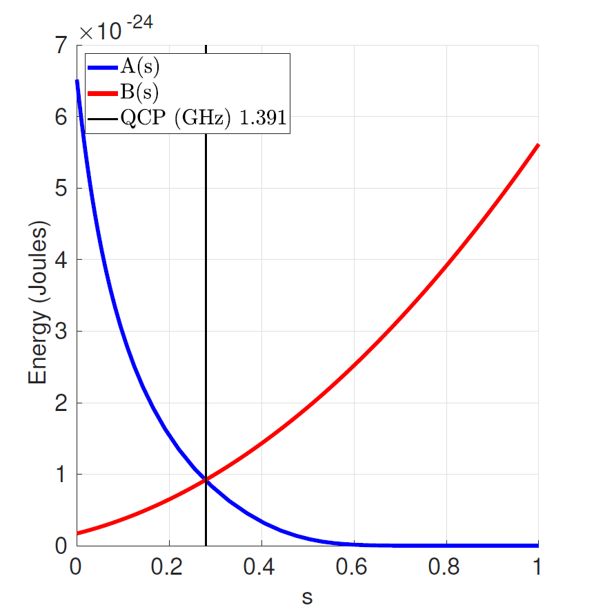
        typical anneal schedule while physical temperature remains constant.
        Along its horizontal axis is s (normalized annealing time) from 0 to 1,
        marked in increments of 0.2. Along its vertical axis is energy in
        Joules, from 0 to 7 x 10^-24, marked in increments of 1. Two lines are
        plotted in the graph. The concave curve labeled A(s) decreases from
        6.5 x 10 to the -24 joules to to 0 joules between 0 and approximately
        0.5 s. The concave curve labeled B(s) increases from approximately 0.2
        to 6.3 x 10 to the -24 joules between 0 and 1 s. QCP (quantum critical
        point) is the point in the anneal where the amplitudes of A and B are
        equal and occurs at 1.391 gigahertz.

    Annealing functions :math:`A(s)`, :math:`B(s)`. Annealing begins at
    :math:`s=0` with :math:`A(s) \gg B(s)` and ends at :math:`s=1`
    with :math:`A(s) \ll B(s)`. The quantum critical point (QCP) is the point
    in the anneal where the amplitudes of :math:`A(s)` and :math:`B(s)`
    are equal. Data shown are representative of |dwave_5kq_tm| systems.

.. _qpu_rfsquid_qubit:

Hardware: Coupled Flux Qubits
-----------------------------

The |dwave_short| QPU is a network of calibrated, superconducting flux qubits
that are tunably coupled; see [Har2010_2]_. The physical Hamiltonian of this set
of flux qubits in the qubit approximation is

.. math::
    :label: qpu_equation_rfsquid_hamiltonian

    \begin{array}{rcl}
        H &=& -\frac{1}{2}\sum_i\left[\Delta_q(\Phi_{\rm CCJJ}(s))
        {\hat\sigma_{x}^{(i)}} - 2 h_i |I_p(\Phi_{\rm CCJJ}(s))| \Phi^x_i(s)
        {\hat\sigma_{z}^{(i)}} \right] \\
        & & + \sum_{i>j} J_{i,j} M_{\rm AFM} I_p(\Phi_{\rm CCJJ}(s))^2
        {\hat\sigma_{z}^{(i)}} {\hat\sigma_{z}^{(j)}}
    \end{array}

where :math:`\Delta_q` is the energy difference between the two eigenstates of
the qubit with no external applied flux (the degeneracy point) where the
eigenstates are :math:`(\ket{0} \pm \ket{1})/\sqrt{2}`. This energy difference
captures the contribution of coherent tunneling between the two wells.
:math:`I_p` represents the magnitude of the current flowing in the body of the
qubit loop; see :numref:`Figure %s <ip-delta>`. :math:`M_{\rm AFM}` is the
maximum mutual inductance generated by the couplers between the qubits
(typically 2 pH), :math:`\Phi_i^x(s)` is an external flux applied to the qubits,
and :math:`\Phi_{\rm CCJJ}(s)` is an external flux applied to every qubit's
compound Josephson-junction structures to change the potential energy shape of
the qubit.

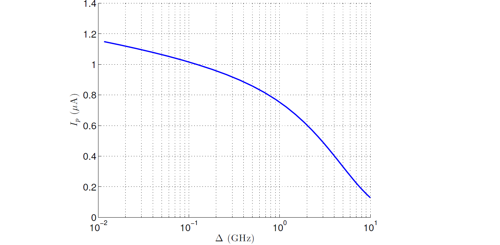
        horizontal axis is delta gigahertz ranging from 0.01 to 10, marked in
        multiples of 10. Along its vertical axis is I p in micro Amperes ranging
        from 0 to 1.4. One line is plotted in the graph. It is a decreasing
        convex curve, starting at approximately 1.2 micro Amperes on the
        vertical axis at 0.01 gigahertz and sloping to approximately 0.1 micro
        Amperes at 10 GHz.

    Typical :math:`I_p` vs :math:`\Delta_q`. This relationship is fixed by the
    physical parameters of the flux qubit. Data shown are representative of
    |dwave_short| 2X systems.

The relationship between :math:`\Delta_q(\Phi_{\rm CCJJ})` and
:math:`I_p(\Phi_{\rm CCJJ})` is fixed by the physical parameters of the flux
qubit. Changing the applied :math:`\Phi_{\rm CCJJ}` moves the flux qubit along
the curve shown in :numref:`Figure %s <ip-delta>`.

.. _qpu_annealprotocol_standard:

Standard-Anneal Protocol
~~~~~~~~~~~~~~~~~~~~~~~~

To map the QPU's Hamiltonian to equation
:math:numref:`qpu_equation_quantum_hamiltonian`, set
:math:`\Phi^x_i(s) = M_{\rm AFM} |I_p(s)|`. Thus, as :math:`\Phi_{\rm CCJJ}(s)`
changes during the anneal, :math:`\Phi^x_i(s)` changes as required to keep the
relative energy ratio between the :math:`h` and :math:`J` terms constant. In
particular, the physical flux applied to the qubit to implement a fixed
:math:`h` value increases as the anneal progresses. Then, the mapping to the
Ising Hamiltonian becomes:

.. math::
    :nowrap:

    \begin{align}
        A(s) &= \Delta_q(\Phi_{\rm CCJJ}(s)) \nonumber \\
        B(s) &	= 2M_{\rm AFM} |I_p(\Phi_{\rm CCJJ}(s))|^2
    \end{align}

For simplicity, introduce a normalized annealing bias,

.. math::
    :nowrap:

    \begin{equation}
        c(s) = \frac{\Phi_{\rm CCJJ}(s) -\Phi_{\rm CCJJ}^{\rm initial}}
        {\Phi_{\rm CCJJ}^{\rm final} - \Phi_{\rm CCJJ}^{\rm initial}},
    \end{equation}

where :math:`\Phi_{\rm CCJJ}^{\rm initial}` and
:math:`\Phi_{\rm CCJJ}^{\rm final}` are the values of :math:`\Phi_{\rm CCJJ}` at
:math:`s = 0` and :math:`s = 1`, respectively (:math:`c(0) = 0` and
:math:`c(1)` = 1).

The signal :math:`c(s)` is provided by an external room-temperature current
source. The time-dependence of this bias signal is chosen to produce a linear
growth in time of the persistent current flowing in the qubits, :math:`I_p(s)`.
Because :math:`B(s) = 2 M_{\rm AFM} I_p(s)^2`, the problem energy scale grows
quadratically in time (as seen in :numref:`Figure %s <annealing-functions>`).

.. _qpu_annealprotocol_fast:

Fast-Anneal Protocol
~~~~~~~~~~~~~~~~~~~~

Depending on the length of time chosen for the quantum annealing process to
execute (i.e., :math:`t_f`), one can distinguish between three regimes (see
[Ami2015]_) of the quantum dynamics:

*   *Coherent*: the anneal is too fast to be much affected by the environment
    (the QPU acts as though it were a closed system).
*   *Non-equilibrium*: the anneal is slow enough for the environment to start
    to cause the system to occupy excited states, but not slow enough to
    establish thermal equilibrium.
*   *Quasistatic*: the anneal is so slow that the system follows equilibrium
    during most of the evolution.

Some QPUs support an alternate anneal protocol, *fast anneal*, that enables you
to execute an anneal within the coherent regime; for example,
:math:`0 \le t \le t_f=7~\text{ns}`. This is the anneal protocol used in
experiments such as [Kin2022]_.

In this protocol, instead of shaping the signal from the external current
source, :math:`c(s)`, to produce a linear growth of the qubits' persistent
current, :math:`I_p(s)`, the flux applied to all qubits,
:math:`\Phi_{\rm CCJJ}(s)`, is ramped up linearly. This enables the QPU to
complete an anneal in mere nanoseconds, well within the coherent regime.

However, for these potentially very fast ramps in :math:`\Phi_{\rm CCJJ}(s)`,
no attempt is made to keep the relative energy ratio between :math:`h` and
:math:`J` terms constant (through adjustments of :math:`\Phi^x_i(s)`, as is done
by the standard-anneal protocol, where it is set to the linear
:math:`M_{\rm AFM} |I_p(s)|`). Consequently, this protocol is used only for
problems with no linear biases (:math:`h=0`).

.. note::

    Although linear biases must be zero when using the fast-anneal protocol,
    for some problems you can emulate these biases by coupling a problem qubit
    to an ancillary qubit to which a :ref:`flux-bias offset <qpu_error_fix_fbo>`
    is applied.

    See :ref:`an example <qpu_config_emulate_with_fbo>` in the
    :ref:`qpu_solver_configuration` section.

.. _qpu_energy_scales:

Energy Scales
-------------

Energy scales :math:`A(s)` and :math:`B(s)` can be described, based on the
parameters defined in the :ref:`qpu_rfsquid_qubit` section above, as follows:

*   :math:`A(s)` represents the transverse, or tunneling, energy. It equals
    :math:`\Delta_q`, the energy difference between the two eigenstates of the
    qubit with no external applied flux.
*   :math:`B(s)` is the energy applied to the problem Hamiltonian. It equals
    :math:`2M_{\rm AFM}I_p(s)^2`, where :math:`M_{\rm AFM}` represents the
    maximum available mutual inductance achievable between pairs of flux qubit
    bodies and :math:`I_p` is the magnitude of the current flowing in the body
    of the qubit loop.

A single, global, time-dependent bias controls the changes of energy scales
:math:`A(s)` and :math:`B(s)` during the quantum annealing process. At any
intermediate value of :math:`s`, the ratio :math:`A(s)/B(s)` is fixed. You can
choose the trajectory of one of :math:`A` or :math:`B` with time.

For the standard-annealing protocol, where :math:`I_p(s)` grows linearly with
time, :math:`B(s)` grows quadratically. Typical values of :math:`A(s)` and
:math:`B(s)` are shown in :numref:`Figure %s <annealing-functions>`.

For the fast-anneal protocol, where :math:`\Phi_{\rm CCJJ}(s)` increases
linearly with time, :math:`A(s)` and :math:`B(s)` are produced by the linear
growth of the signal :math:`c(s)` . A typical plot of :math:`A(c(s))` and
:math:`B(c(s))` is shown in :numref:`Figure %s <fastAnnealSchedule>`.

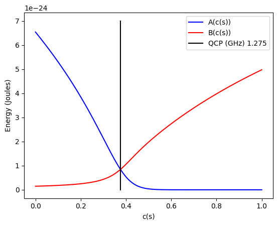
        fast-anneal schedule. Along its horizontal axis is c(s) (normalized
        annealing bias) from 0 to 1, marked in increments of 0.2. Along its
        vertical axis is energy in Joules, from 0 to 7 x 10^-24, marked in
        increments of 1. Two lines are plotted in the graph. The concave curve
        labeled A(c(s)) decreases from 6.5 x 10 to the -24 joules to to 0 joules
        between 0 and approximately 0.5 s. The concave curve labeled B(c(s))
        increases from approximately 0 to 5 x 10 to the -24 joules between 0 and
        1 s. QCP (quantum critical point) is the point in the anneal where the
        amplitudes of A and B are equal and occurs at 1.275 gigahertz.

    Annealing functions :math:`A(c(s))` and :math:`B(c(s))` for fast anneal.
    Data shown are representative of |dwave_5kq| systems.

.. note::

    If you are using the Leap quantum cloud service from |dwave_short|, you can
    find the :math:`A(s)` and :math:`B(s)` and :math:`c(s)` values for the QPUs
    here: :ref:`qpu_solver_properties_specific`. If you have an on-premises
    system, contact |dwave_short| to obtain the values for your system.

.. _qpu_qa_freezeout:

Freezeout Points
----------------

:math:`A(s)` sets the time scale for qubit dynamics. As annealing progresses,
:math:`A(s)`, and therefore this time scale, decreases. When the dynamics of the
complex Ising spin system become slow compared to :math:`t_f`, the network is
*frozen*---that is, the spin state does not change appreciably as the Ising spin
Hamiltonian evolves. While in general each Ising spin problem has different
dynamics, it is instructive to analyze a simple system consisting of clusters of
uniformly coupled qubits. These clusters of coupled qubits are called
*logical qubits*.\ [#]_

.. [#]
    For a logical qubit made of 3 qubits, for example, the relevant multiqubit
    states might be :math:`\ket{\uparrow \uparrow \uparrow}` and
    :math:`\ket{\downarrow \downarrow \downarrow}`.

Networks of logical qubits *freeze out* at different points in the annealing
process, depending on several factors, including:

*   Number of qubits in the network
*   Coupling strengths between the qubits
*   Overall time scale of the anneal, :math:`t_f`

In general, freezeout points move earlier in :math:`s` for larger logical qubit
sizes, for more strongly coupled logical qubits, and for smaller annealing time
:math:`t_f`. :numref:`Figure %s <annealing_functions_5us>` and
:numref:`Figure %s <annealing_functions_100us>` show representative freezeout
points for several qubit network sizes. A network of logical qubits is created
by coupling multiple qubits to a single central qubit using :math:`J = +1`; see
the :ref:`qpu_ice_measure_2spin` section for more details.

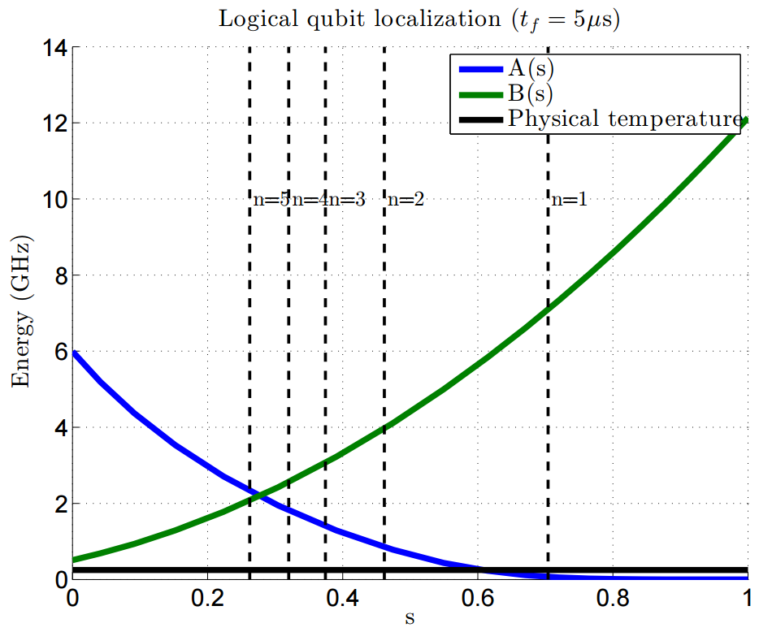
        for several logical qubit sizes, for an annealing time of 5
        microseconds. Along its horizontal axis is s (normalized annealing time)
        from 0 to 1, marked in increments of 0.2. Along its vertical axis is
        energy in gigahertz, from 0 to 14, marked in increments of 2. Three
        lines are plotted in the graph. The concave curve labeled A(s) decreases
        from 6 to 0 gigahertz between 0 and approximately 0.7 s. The concave
        curve labeled B(s) increases from approximately 0.5 to 12 gigahertz
        between 0 and 1 s. A third line representing physical temperature is a
        straight horizontal line close to 0 on the vertical axis. The graph is
        annotated with 5 vertical dashed lines that mark the freezeout points
        for logical qubit sizes (n) 1 through 5. Larger logical qubit sizes
        freeze out earlier in the anneal than the smaller ones do. For instance,
        n=5 freezes out at approximately s=0.25, while n=1 freezes out at
        approximately s=0.7.

    Representative annealing schedules with freezeout points for several logical
    qubit sizes and :math:`t_f = 5\ \mu s`. The dashed lines show localization
    points for a :math:`N = 1` through :math:`N = 5` logical qubit clusters from
    right to left, respectively. Data shown are representative of |dwave_short|
    2X systems.

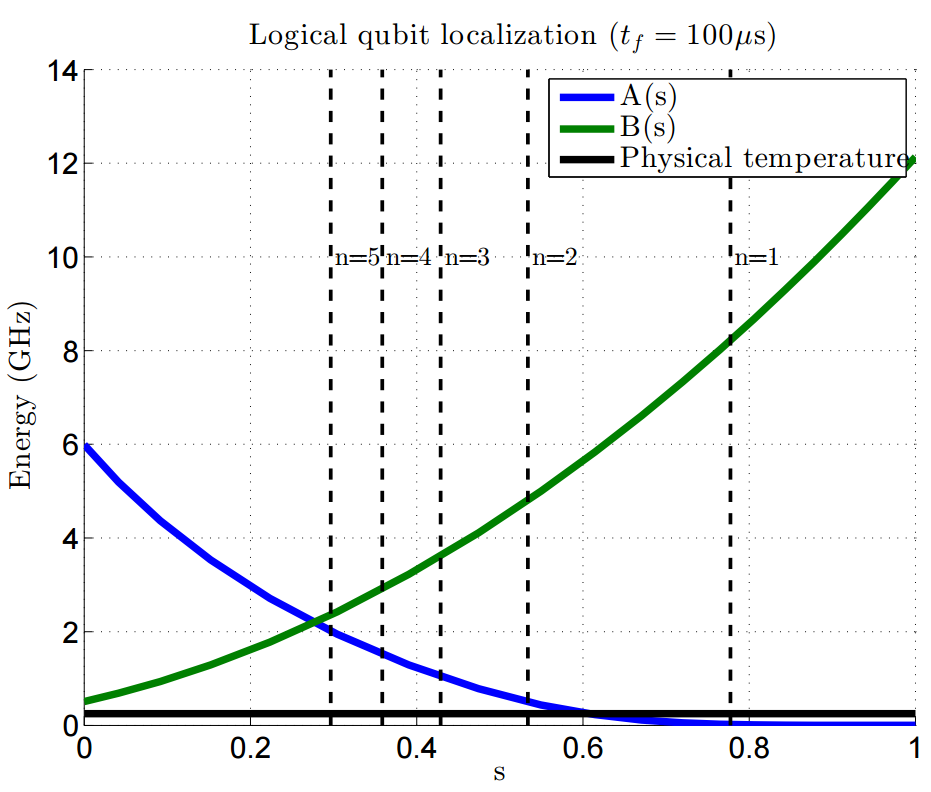
        for several logical qubit sizes, for an annealing time of 100
        microseconds. Along its horizontal axis is s (normalized annealing time)
        from 0 to 1, marked in increments of 0.2. Along its vertical axis is
        energy in gigahertz, from 0 to 14, marked in increments of 2. Three
        lines are plotted in the graph. The concave curve labeled A(s) decreases
        from 6 to 0 gigahertz between 0 and approximately 0.7 s. The concave
        curve labeled B(s) increases from approximately 0.5 to 12 gigahertz
        between 0 and 1 s. A third line representing physical temperature is a
        straight horizontal line close to 0 on the vertical axis. The graph is
        annotated with 5 vertical dashed lines that mark the freezeout points
        for logical qubit sizes (n) 1 through 5. Larger logical qubit sizes
        freeze out earlier in the anneal than the smaller ones do. For instance,
        n=5 freezes out close to s=0.3, while n=1 freezes out close to s=0.8.
        When compared with the previous graph, this graph shows that longer
        anneal times result in later freezeout points.

    Representative annealing schedules with freezeout points for several logical
    qubit sizes and :math:`t_f = 100\ \mu s`. The dashed lines show localization
    points for a :math:`N = 1` through :math:`N = 5` logical qubit clusters from
    right to left, respectively. Data shown are representative of |dwave_short|
    2X systems.

Measuring\ [#]_ :math:`I_p` at the freezeout point of various-sized logical
qubits results in :numref:`Figure %s <ip-vs-logical-qubit-size>`. The figure
shows that less annealing time and larger clusters move the freezeout point
earlier in the anneal, where :math:`I_p` is lower.

.. [#]
    While absolute calibration is difficult through the SAPI interfaces, if
    temperature is used as an absolute calibration factor, the population
    statistics of a simple logical qubit transition can approximately determine
    the relative value of :math:`I_p` at freezeout.

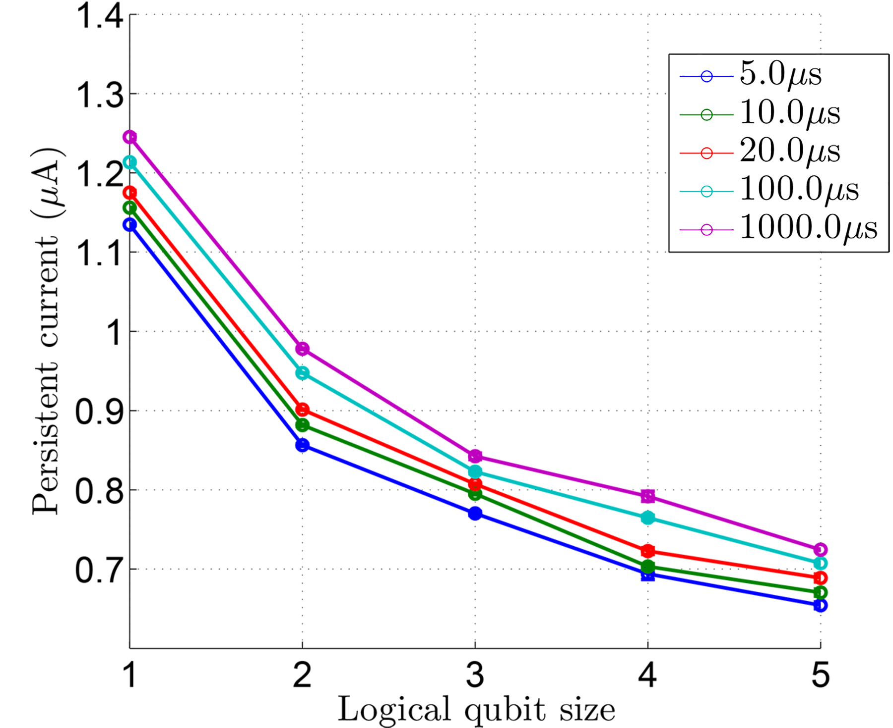
        annealing time. Along its horizontal axis is logical qubit cluster size,
        from 1 to 5, in increments of 0.5. Along its vertical axis is persistent
        current in micro Amperes. Five lines are plotted in the graph
        representing different annealing times of 5, 10, 20, 100, and 1000
        microseconds. Each line has points marked for logical qubit sizes 1, 2,
        3, 4, and 5. These points are joined by straight line segments. The
        graph shows that freezeout occurs earlier when anneal times are shorter
        and when cluster sizes are larger.

    :math:`I_p` (persistent current) at the freezeout point as a function of
    logical qubit size and annealing time. The change in :math:`I_p` at
    freezeout, as the annealing time varies from 5 to 1000 :math:`\mu s` and the
    logical spin cluster size varies from 1 to 5. Shorter annealing time and
    larger clusters move the freezeout point earlier in the anneal, where
    :math:`I_p` is lower. Data shown are representative of |dwave_short| 2X
    systems.

The signal corresponding to fixed :math:`h` values scales as :math:`I_p`. Larger
logical qubits freeze out earlier in the annealing process: at lower
:math:`I_p`. Thus, if an erroneous fixed flux offset exists in the physical body
(a static addition to the term :math:`\Phi^x_i`), then the corresponding
:math:`\delta h` at freezeout grows with the logical qubit size because of the
lower persistent current at the freezeout point. This error should roughly
double going from a logical qubit of size 1 to a logical qubit of size 5. The
standard deviation of :math:`\delta h` versus logical qubit size plot in
:numref:`Figure %s <gaussian_systematic_h>` indicates that this is approximately
true.

.. _qpu_qa_anneal_offsets:

Anneal Offsets
==============

The standard annealing trajectory lowers :math:`A(s)` and raises :math:`B(s)`
identically for all qubits in the QPU. This single annealing path, however, may
not be ideal for some applications of quantum annealing. This section describes
*anneal offsets*, which allow you to adjust the standard annealing path per
qubit.

As discussed :ref:`above <qpu_annealprotocol_standard>`, the annealing process
is controlled via a global, time-dependent bias signal :math:`c(s)` that
simultaneously modifies both :math:`A(s)` and :math:`B(s)`.
:numref:`Figure %s <annealing-functions>` shows typical :math:`A(s)` and
:math:`B(s)` across the annealing algorithm; values of :math:`A(s)`,
:math:`B(s)`, and :math:`c(s)` for QPUs can be found in the
:ref:`qpu_solver_properties_specific` section.
:numref:`Figure %s <anneal-bias-versus-anneal-fraction>` plots the annealing
bias :math:`c(s)` versus :math:`s`. Because of the shape of the qubit energy
potential, :math:`c(s)` is not linear in :math:`s` but is chosen to ensure that
:math:`I_p(s)` grows linearly with :math:`s`.

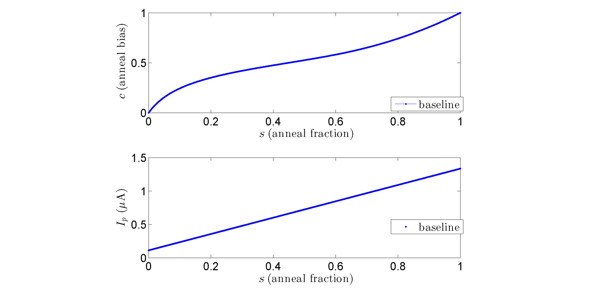
        against shows s (normalized annealing time). Along its horizontal axis
        is s (normalized annealing time) from 0 to 1, in increments of 0.2.
        Along its vertical axis is c (anneal control bias) from 0 to 1, in
        increments of 0.5. One curved line is plotted in the graph, starting
        from 0,0 and ending at 1,1, with a slight convex curve near the start
        and a slight concave curve near the end. The bottom graph shows I_p
        plotted against s (normalized annealing time). Along its horizontal
        axis is s (normalized annealing time) from 0 to 1, in increments of 0.2.
        Along its vertical axis is I p in micro Amperes from 0 to 1.5, in
        increments of 0.5. One straight line is plotted in the graph, starting
        from 0,0 and ending at 1,1.

    Annealing control bias :math:`c` versus anneal fraction :math:`s`. At
    :math:`c=0, s=0,` :math:`A(s) \gg B(s)`, and at
    :math:`c=1, s=1, A(s) \ll B(s).` Data shown are representative of
    |dwave_2kq_tm| systems.

On-QPU DACs allow adjustments of static annealing offsets :math:`\delta c_i` per
qubit, thereby advancing or delaying the annealing signal locally for each.
:numref:`Figure %s <anneal-bias-versus-anneal-fraction-with-offsets>` shows an
example of the annealing control bias with :math:`\delta c_i = 0.05` and
:math:`\delta c_i = -0.05`. Note that the anneal offset is a *vertical* shift up
or down in annealing control bias, not a shift in :math:`s`.

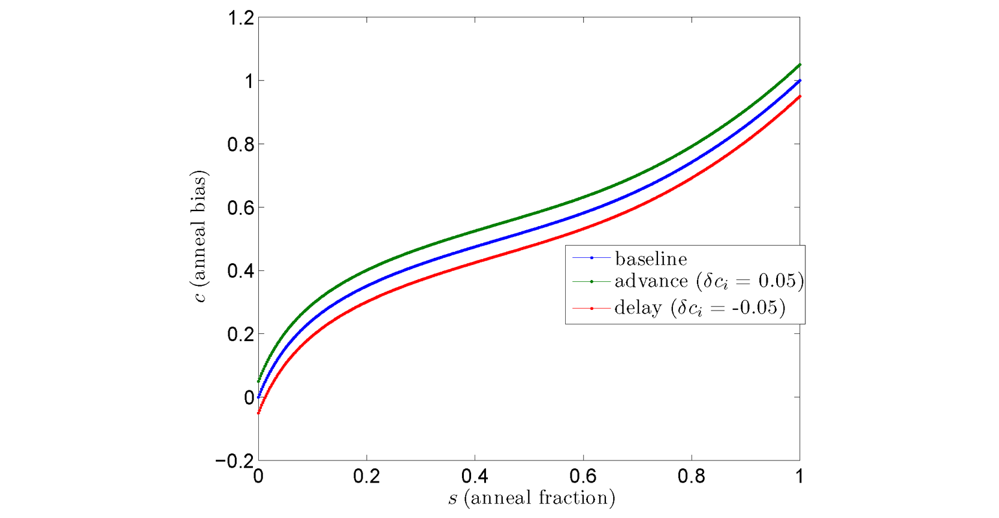
        annealing time). It compares the baseline anneal trajectory with an
        advance of 0.05 and a delay of 0.05 of normalized anneal offset values.
        Along its horizontal axis is s (normalized annealing time) from 0 to 1,
        in increments of 0.2. Along its vertical axis is c (anneal control bias)
        from -0.2 to 1.2, in increments of 0.2. Three curved lines are plotted
        in the graph, one showing the baseline, the others showing an advance of
        0.5 and a delay of 0.5 of the anneal trajectory. The baseline curve is
        between the advance (top) and delay (bottom). All curves start at 0 on
        the horizontal axis and near 0 on the vertical axis and progress to 1 on
        the horizontal axis and near 1 on the vertical axis. The vertical
        distance between the curves increases slightly by the time they reach 1
        on the horizontal axis.

    Annealing control bias :math:`c` versus anneal fraction :math:`s` for
    several anneal offset values. Data shown are representative of |dwave_2kq|
    systems.

Advancing or delaying the annealing bias by setting :math:`\delta c_i \ne 0`
changes the transverse field :math:`A_i(s)` with respect to the original global
:math:`A(s)`. This allows you to increase or decrease :math:`A_i(s)`. Note that
:math:`\delta c_i > 0` advances the annealing process (:math:`A_i(s) < A(s)`)
and :math:`\delta c_i < 0` delays the annealing process (:math:`A_i(s) > A(s)`).
:numref:`Figure %s <delta-versus-anneal-fraction-with-offsets>` shows typical
:math:`A_i(s)` versus :math:`s` for two values of :math:`\delta c_i`. Both
:math:`A(s)` and :math:`B(s)` simultaneously change with control bias :math:`c`.
Thus, a consequence of advancing or delaying the annealing process with anneal
offset :math:`\delta c_i` is that :math:`B(s)\rightarrow B_i(s)`.
:numref:`Figure %s <delta-versus-anneal-fraction-with-offsets>` also shows
typical :math:`B_i(s)` versus :math:`s` for the same set of :math:`\delta c_i`.

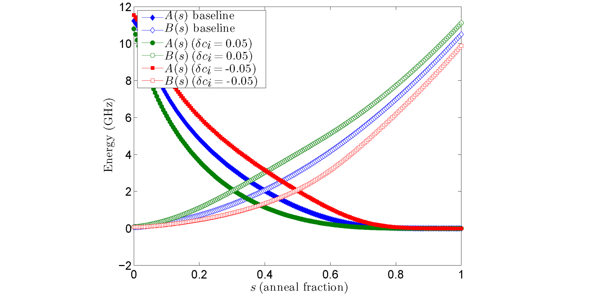
        and negative anneal offsets. Along its horizontal axis is s (normalized
        annealing time) from 0 to 1, in increments of 0.2. Along its vertical
        axis is energy in gigahertz from -2 to 12, in increments of 2. Six
        concave curved lines are plotted in the graph: 3 for A(s), starting on
        the upper left and ending on the lower right, and 3 for B(s), starting
        on the lower left and ending on the upper right. Each set includes a
        baseline curve in the center, a curve with a 0.05 positive offset, and a
        curve with a 0.05 negative offset.

    :math:`A(s)` and :math:`B(s)` versus anneal fraction :math:`s`. At
    :math:`c(s=0)=0`, :math:`A(s) \gg B(s)`, and at
    :math:`c(s=1) = 1, A(s) \ll B(s)`. The baseline curve
    (:math:`\delta c_i = 0`) is shown along with :math:`A_i(s), B_i(s)` for
    anneal offset :math:`\delta c_i=0.05` (advances the annealing process for
    the qubit) and :math:`A_i(s),B_i(s)` for anneal offset
    :math:`\delta c_i = -0.05` (delays the annealing process for the qubit).
    Data shown are representative of |dwave_2kq| systems.

The change of :math:`B(s)\rightarrow B_i(s)` has consequences for the target
Ising spin Hamiltonian parameters :math:`h_i` and :math:`J_{i,j}`. The anneal
offset for the :math:`i{\rm th}` qubit deflects
:math:`h_i\rightarrow h_i(\delta c_i,s)`, and the anneal offsets for the
:math:`i{\rm th}` and :math:`j{\rm th}` qubit deflect
:math:`J_{i,j} \rightarrow J_{i,j}(\delta c_i,\delta c_j,s)`.
:numref:`Figure %s <hamiltonian-distortion-single-q>` shows plots of the bias
:math:`h_i(\delta c_i,s)/h` and coupling strength
:math:`J_{i,j}(\delta c_i,0,s)/J`, both normalized by the values that would have
been set without an applied offset, for several values of an offset
:math:`\delta c_i` applied to a single qubit.
:numref:`Figure %s <hamiltonian-distortion-two-q>` shows plots of
:math:`J_{i,j}(\delta c_i,\delta c_j,s)/J` for several values of offsets
:math:`\delta c_i, \delta c_j` applied to a pair of coupled qubits.

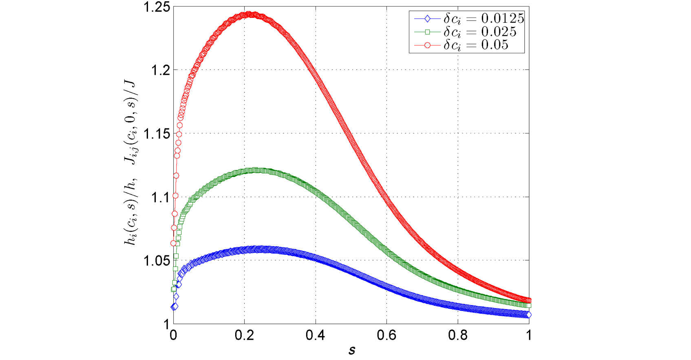
        different anneal offset values.	Along its horizontal axis is s
        (normalized annealing time) from 0 to 1, in increments of 0.2. Along its
        vertical axis is the Hamiltonian energy from 1 to 1.25 in increments of
        0.05. Three convex curves are plotted across the graph for offset values
        of 0.05 (top), 0.025 (middle), and 0.0125 (bottom). All lines start at
        s=0 and progress to s=1. The top line, for offset 0.05 has quite a steep
        peak at around s=0.5. The bottom line, for offset 0.0125 is a flatter
        curve. The middle line, for offset 0.025, is closer to the bottom line
        than it is to the top. All come close to re-converging at s=1.

    :math:`h_i(\delta c_i, s)/h` and :math:`J_{i,j}(\delta c_i,0, s)/J` versus
    :math:`s` for several values of :math:`\delta c_i`. The deviation of these
    quantities is :math:`s`-dependent. You can choose a particular value of
    :math:`s` at which to exactly compensate the change in target parameter by
    adjusting
    :math:`h_i(\delta c_i, s)\rightarrow h_i', J_{i,j}(\delta c_i,0, s) \rightarrow J_{i,j}'`.
    For values of :math:`s` before or after this point, a residual change in
    target parameter remains. Data shown are representative of |dwave_2kq|
    systems.

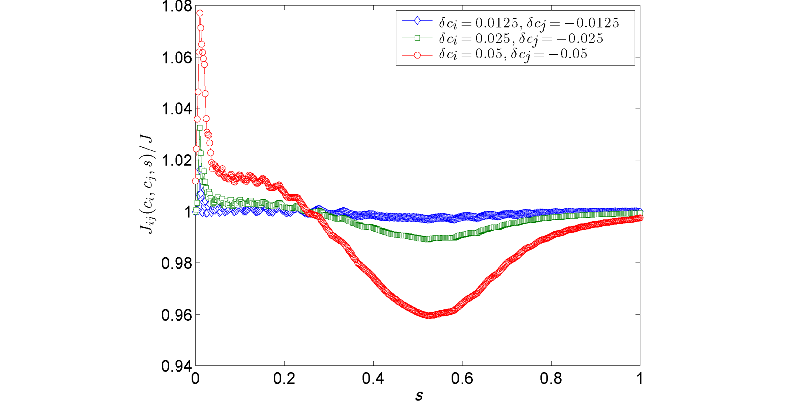
        different anneal offset values. Along its horizontal axis is s
        (normalized annealing time) from 0 to 1, in increments of 0.2. Along its
        vertical axis is the Hamiltonian energy from 0.94 to 1.08 in increments
        of 0.02. Three curves are plotted across the graph for offset values of
        0.05, 0.025, and 0.0125. All lines start at s=0 and progress to s=1. The
        curve for offset 0.05 has quite a steep dip at around s=0.5. The curve
        for offset 0.0125 is a flatter curve. The curve for offset 0.025,
        remains closer to the 0.0125 curve than to the other. All come close to
        re-converging at s=1.

    :math:`J_{ij}(\delta c_i,\delta c_j, s)/J` versus :math:`s` for several
    values of :math:`\delta c_i` and :math:`\delta c_j`. The deviation of these
    quantities away from 1 is :math:`s`-dependent. You can choose a particular
    value of :math:`s` at which to exactly compensate the change in target
    parameter by adjusting
    :math:`J_{i,j}(\delta c_i,\delta c_j, s)\rightarrow J_{i,j}'`. For values of
    :math:`s` before or after this point, a residual change in target parameter
    remains. Data shown are representative of |dwave_2kq| systems.

The changes shown in :numref:`Figure %s <hamiltonian-distortion-single-q>` and
:numref:`Figure %s <hamiltonian-distortion-two-q>` are :math:`s`-dependent. The
largest changes are earlier in the annealing process. You can choose a
particular value of :math:`s^*` at which to exactly compensate these changes in
target parameters by rescaling the requested target parameters. However, for
values of :math:`s` before or after :math:`s^*`, a residual change in target
parameter remains.

.. note::

    Where a two-state approximation holds well for the qubits (i.e., larger
    values of :math:`s`), the effective Hamiltonian, rewritten following
    [Lan2017]_, can be approximated as:

    .. math::

        H(s, \delta c) = \frac{1}{2} \sum_{i,j} J_{i,j}
        \sqrt{B(c^{-1}(c(s) + \delta c_i)) B(c^{-1}(c(s) + \delta c_j))}
        \sigma_{z}^{(i)} \sigma_{z}^{(j)} + \frac{1}{2} \sum_i
        \left[
            B(c^{-1}(c(s) + \delta c_i)) \sigma_{x}^{(i)} -
            A(c^{-1}(c(s) + \delta c_i)) \sigma_{x}^{(i)}
        \right]

    where :math:`J_{i,j}` and :math:`h_i` are the programmed biases for the
    Ising model, and :math:`c(s)` and :math:`c^{-1}` are the smooth, monotonic
    :ref:`normalized annealing bias <qpu_annealprotocol_standard>` and its
    inverse. You can determine all values of :math:`c(s)` and :math:`c^{-1}` by
    smoothly approximating (e.g. linear interpolation) the discretized form of
    :math:`c(s)` available for QPUs in the :ref:`qpu_solver_properties_specific`
    section.

    The impact of offsets can be interpreted as perturbations of :math:`J` and
    :math:`h` values relative to a fixed schedule,

    .. math::

        J_{i,j} (s, \delta c_i, \delta c_j) &=
        \frac{J_{i,j}}{B(s)}
        \sqrt{B(c^{-1}(c(s) + \delta c_i)) B(c^{-1}(c(s) + \delta c_j))}

        h_i(s,\delta c_i) &=
        h_i \frac{B(c^{-1}(c(s) + \delta c_i))}{B(s)}.

    For example, in the perturbative limit of small anneal offsets, a Taylor
    expansion yields:

    .. math::

        J_{i,j}(s,\delta c_i, \delta c_j) &\approx
        [
            1 + \frac{d B(s)}{ds} (\frac{dc(s)}{ds})^{-1}
            \frac{\delta c_i + \delta c_j}{2}
        ] J_{i,j}

        h_i(s,\delta c_i) &\approx
        [1 + \frac{d B(s)}{ds} (\frac{dc(s)}{ds})^{-1} \delta c_i] h_{i,j}.

Anneal offsets may improve results for problems in which the qubits have
irregular dynamics for some easily determined reason. For example, if a qubit's
final value does not affect the energy of the classical state, you can advance
it (with a positive offset) to reduce quantum bias in the system; see
[Kin2016]_. Anneal offsets can also be useful in embedded problems with varying
chain length: longer chains may freeze out earlier than shorter ones---at an
intermediate point in the anneal, some variables act as fixed constants while
others remain undecided. If, however, you advance the anneal of the qubits in
the shorter chains, they freeze out earlier than they otherwise would. The
correct offset will synchronize the annealing trajectory of shorter chains with
that of the longer ones. As a general rule, if a qubit is expected to be subject
to a strong effective field relative to others, delay its anneal with a negative
offset.

Determining the optimum offsets for different problem types is an area of
research at |dwave_short|. Expect that the appropriate offsets for two different
qubits in the same problem to be within 0.2 normalized offset units of each
other.

.. _qpu_qa_anneal_sched:

Varying the Global Anneal Schedule
==================================

You can make changes to the global anneal schedule by submitting a set of points
that define the piece-wise linear (PWL) waveform of the annealing pattern you
want. You can change the standard (forward) schedule by introducing a pause or a
quench, or you can initialize the qubits into a specific classical state and
anneal in reverse from there. This section describes these features.

.. _qpu_qa_anneal_sched_pause:

Pause and Quench
----------------

|dwave_5kq| systems provide user control over the global annealing trajectories:

*   You can scale the quadratic growth in persistent current---that is,
    quadratic growth in :math:`B(t)`---using the
    :ref:`sysdocs:param_anneal_time` parameter.
*   You can also set the :ref:`sysdocs:param_anneal_sched` parameter, which
    allows for a *pause* or *quench* partway through the annealing
    process.\ [#]_ A pause dwells for some time at a particular anneal fraction;
    a quench abruptly terminates the anneal within a few hundred nanoseconds of
    the point specified.

.. [#]
    The :ref:`parameter_qpu_annealing_time` and
    :ref:`parameter_qpu_anneal_schedule` parameters are mutually exclusive.

Unlike the :ref:`anneal offsets <qpu_qa_anneal_offsets>` feature---which allows
you to control the annealing path of individual qubits separately---anneal
schedule changes apply to all qubits in the working graph.

Changes to the schedule are controlled by a PWL waveform comprising :math:`n`
pairs of points. The first element is time :math:`t` in microseconds; the
second, the anneal fraction, :math:`s`, as a value between 0 and 1. This input
causes the system to produce linear changes in :math:`s` between :math:`s_i` and
:math:`s_{i+1}`.

.. include:: ../shared/anneal.rst
    :start-after: start_schedule_rules
    :end-before: end_schedule_rules

The table below gives three valid examples of anneal schedule points, producing
the varying patterns of :math:`B(t)` that appear in
:numref:`Figure %s <annealing_trajectories>`.

.. list-table:: Anneal Schedule Tuples: Examples
    :widths: 3 4
    :header-rows: 1

    *   -   Points
        -   Result
    *   -   :math:`{(0.0, 0.0) (20.0, 1.0)}`
        -   Standard trajectory of 20-\ :math:`\mu s` anneal.
            Here, :math:`B(t)` grows quadratically with time.
    *   -   :math:`{(0.0, 0.0) (10.0, 0.5) (110.0, 0.5) (120.0, 1.0)}`
        -   Mid-anneal pause at :math:`s = 0.5`. The quadratic growth of
            :math:`B(t)` is interrupted by a 100-\ :math:`\mu s` pause halfway
            through.
    *   -   :math:`{(0.0, 0.0) (10.0, 0.5) (12.0, 1.0)}`
        -   Mid-anneal quench at :math:`s = 0.5`. The quadratic growth of
            :math:`B(t)` is interrupted by a rapid 2-\ :math:`\mu s` quench
            halfway through.

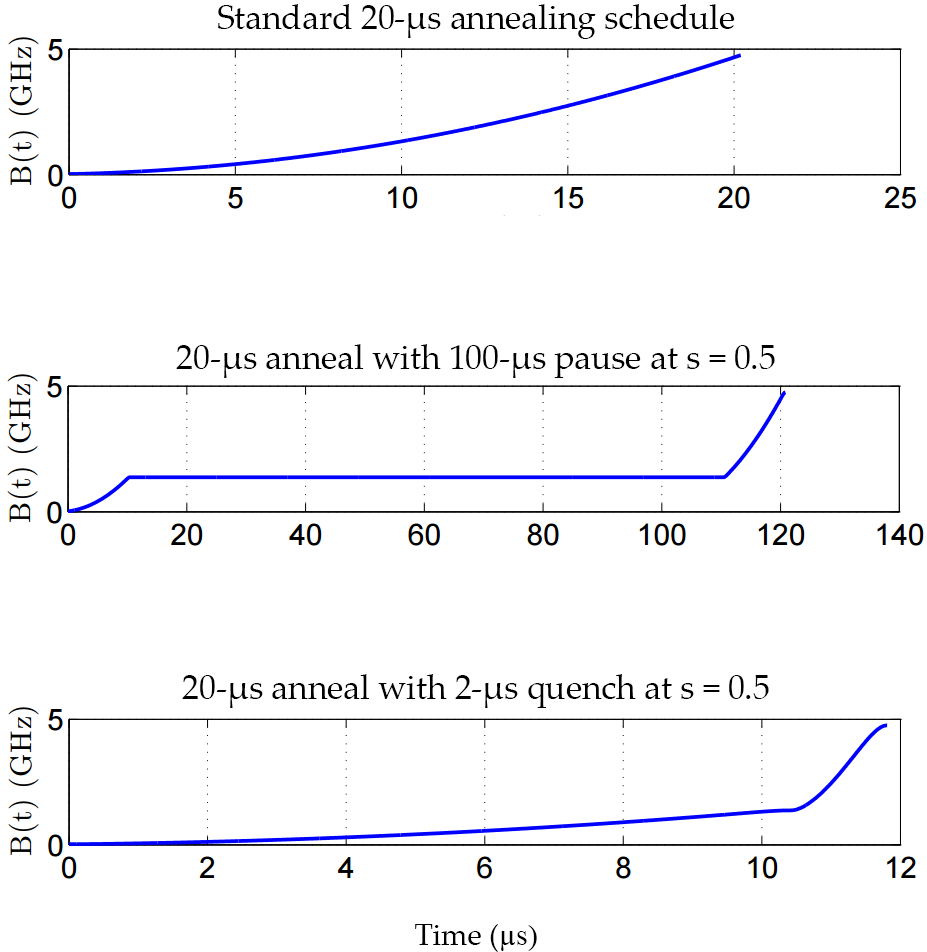

    Annealing schedule variations. **Top:** Standard quadratic growth of
    :math:`B` for :math:`t_f = 20\ \mu s`. **Middle:** Mid-anneal pause of
    :math:`100\ \mu s` at :math:`s = 0.5` for a background
    :math:`t_f = 20\ \mu s`. **Bottom:**  Mid-anneal quench of :math:`2\ \mu s`
    at :math:`s = 0.5` for a background :math:`t_f = 20\ \mu s`.

This degree of control over the global annealing schedule allows you to study
the quantum annealing algorithm in more detail. For example, a pause can be a
useful diagnostic tool for instances with a small perturbative anticrossing.
:numref:`Figure %s <16q-pause>` shows typical measurements of the 16-qubit
instance reported in [Dic2013]_ with a pause inserted. While pauses early or
late in the anneal have no effect, a pause near the expected perturbative
anticrossing produces a large increase in the ground-state success rate.

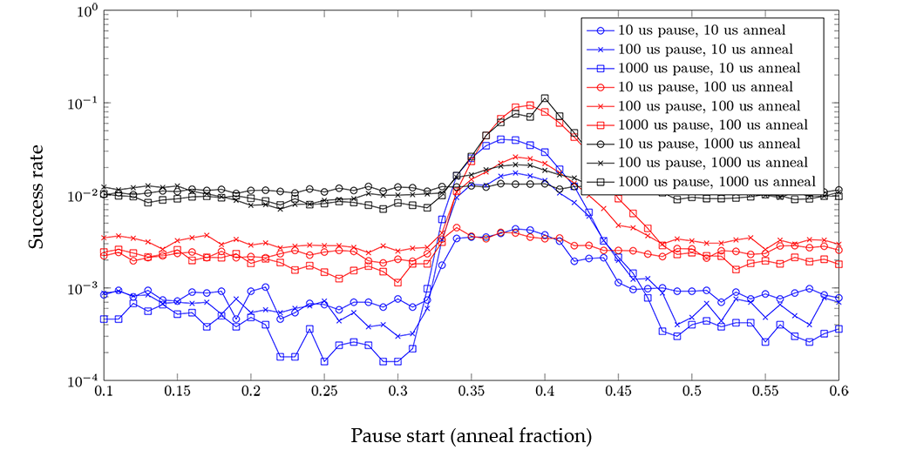
        horizontal axis shows the anneal fraction from 0.1 to 0.6, marked in
        increments of 0.05. The vertical axis shows success rate marked from
        0.001 to 1, marked in exponents of 10. Nine lines are plotted in the
        graph representing each of the following: 1000, 100, and 10	microsecond
        pauses in 1000 microsecond anneals; 1000, 100, and 10 pauses in 100
        microsecond anneals; and 1000, 100, and 10 pauses in 10 microsecond
        anneals. The plotted data shows that, in general, longer anneal times
        have higher success rates. It shows that in all cases, when the pause
        occurs near the perturbative anticrossing, the success rate increases
        for all anneal schedules shown.

    Typical measurements from a 16-qubit reference instance showing pauses of
    different lengths inserted at different points in the annealing schedule.
    Pauses inserted near the expected anticrossing increase the likelihood of
    obtaining results from the ground state. Data shown are representative of
    |dwave_2kq| systems.

Another example is a quench inserted at :math:`s < 1`. If the quench is fast
compared to problem dynamics, then the distribution of states returned by the
quench can differ significantly from that returned by the standard annealing
schedule. :numref:`Figure %s <16q-quench>` shows typical measurements of the
same 16-qubit instance with a quench added. The probability of obtaining ground
state samples depends on when in the anneal the quench occurs, with later
quenches more likely to obtain samples from the ground state.

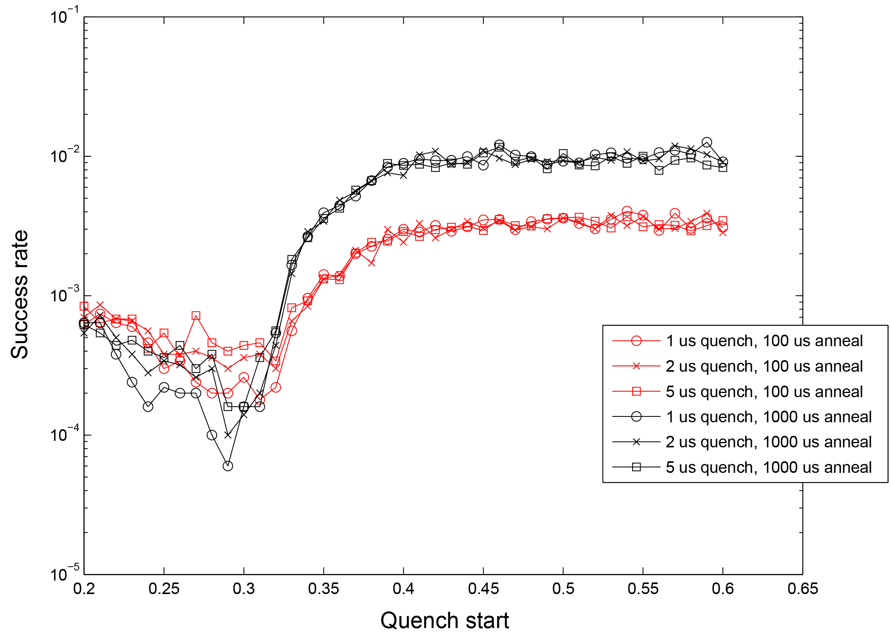
        horizontal axis shows the anneal fraction from 0.2 to 0.65, marked in
        increments of 0.05. The vertical axis shows success rate marked from
        0.0001 to 0.1, marked in exponents of 10. Eight lines are plotted in the
        graph representing each of the following: 2, 1, 0.5, and 0.1 microsecond
        quenches in 1000 microsecond anneals; and 2, 1, 0.5, and 0.1 quenches in
        100 microsecond anneals. The plotted data shows that, in general, longer
        anneal times have higher success rates. It shows that later quenches are
        more likely to obtain samples from the ground state.

    Typical measurements from a 16-qubit reference instance showing quenches of
    different speeds compared to problem dynamics at different points in the
    anneal schedule. Later quenches increase the likelihood of obtaining results
    from the ground state. Data shown are representative of |dwave_2kq| systems.

.. _qpu_qa_anneal_sched_reverse:

Reverse Annealing
-----------------

As described above, the annealing functions :math:`A(s)` and :math:`B(s)` are
defined such that :math:`A(s) \gg B(s)` at :math:`s=0` and :math:`A(s) \ll B(s)`
at :math:`s = 1`, where :math:`s` is the normalized annealing fraction. In the
standard quantum annealing protocol, :math:`s` increases linearly with time,
with :math:`s(0)=0` and :math:`s(t_f)=1`, where :math:`t_f` is the total
annealing time. The network of qubits starts in a global superposition over all
possible classical states and, as :math:`s \rightarrow 1`, the system localizes
into a single classical state; see :numref:`Figure %s <annealing-functions>`.

*Reverse annealing* allows you to initialize the qubits into a specific
classical state, begin the evolution at :math:`s = 1`, anneal along a path
toward :math:`s=0`, and then return back up to :math:`s=1`.
:numref:`Figure %s <reverse-annealing-pwl>` shows a typical reverse annealing
process where the system reverses to :math:`s = 0.5`, pauses for
:math:`25  \ \mu s` at :math:`s = 0.5`, and ends at :math:`s=1`.

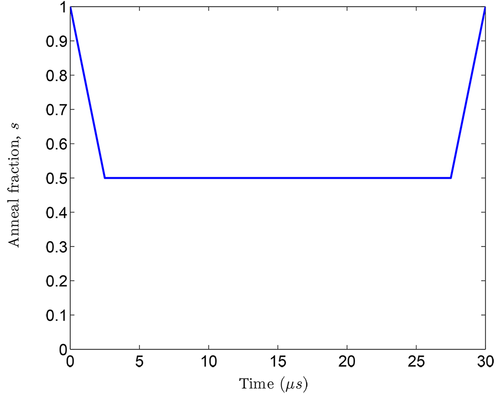
        microseconds. The vertical axis shows normalized anneal fraction from 0
        to 1. The plot starts at 1,0 then dips to 0.5 where it remains until 25
        microseconds at which point it returns back up to 1.

    Typical reverse annealing protocol with a :math:`5 \ \mu s` equivalent ramp
    rate from :math:`s = 1` to :math:`s = 0.5`, followed by a pause at
    :math:`s = 0.5` for :math:`25 \ \mu s`, and then a ramp back to
    :math:`s = 1`.

The reverse annealing feature gives you additional control over and insight into
the quantum annealing process in the |dwave_short| QPU.\ [#]_
Examples of how you might use reverse annealing include:

*   Quantum Boltzmann sampling---Prepare a classical state and then draw a set
    of samples from a probability distribution that may be changing with
    :math:`s`.
*   Hybrid algorithms---Prepare a classical state provided by a classical
    heuristic and then turn on a finite :math:`A(s)` and allow the system to
    evolve.
*   Tunneling rate measurements---Prepare a particular classical state and
    measure the rate at which the system tunnels from this state to another for
    a range of :math:`s`.
*   Relaxation rate measurements---Prepare a classical state that is an excited
    state of the problem Hamiltonian and measure the rate at which the system
    relaxes to lower energy states for a range of :math:`s`.

.. [#]
    For more information, see *Reverse Annealing for Local Refinement of
    Solutions*, |dwave_short| White Paper Series, no. 14-1018A-A, 2017.

The reverse annealing interface uses three parameters:
:ref:`parameter_qpu_anneal_schedule` defines the waveform, :math:`s(t)`, and
:ref:`parameter_qpu_initial_state` and :ref:`parameter_qpu_reinitialize_state`
control the system state at the start of an anneal.

As for pause and quench, the reverse annealing schedule is controlled by a PWL
waveform comprising :math:`n` pairs of points. The first element of the pair is
time :math:`t` in microseconds; the second, the anneal fraction, :math:`s`, as a
value between 0 and 1. Just as in forward annealing, time :math:`t` must
increase for all points in the schedule. For a reverse anneal, however, the
anneal fraction *must* start and end at :math:`s = 1`.

The following table shows the tuples that you submit to get the pattern in
:numref:`Figure %s <reverse-annealing-pwl>`.

.. tabularcolumns:: |p{6cm}|p{8cm}|

.. table:: Reverse Annealing Schedule Tuples: Example

    +-------------------------------+------------------------------------------+
    | Points                        | Result                                   |
    +===============================+==========================================+
    | :math:`{(0.0, 1) (2.5, 0.5)   | Reverse anneal, therefore begins at      |
    | (27.5, 0.5) (30.0, 1.0)}`     | :math:`s = 1`. A :math:`30.0 \ \mu s`    |
    |                               | anneal with a mid-anneal pause at        |
    |                               | :math:`s = 0.5` that lasts for           |
    |                               | :math:`25 \ \mu s`.                      |
    +-------------------------------+------------------------------------------+

When supplying a reverse annealing waveform through
:ref:`parameter_qpu_anneal_schedule`, you must also supply the initial state to
which the system is set. When multiple reads are requested in a single call to
SAPI, you have two options for the starting state of the system. These are
controlled by the :ref:`parameter_qpu_reinitialize_state` Boolean parameter:

*   ``reinitialize_state=true`` (default)---Reinitialize the initial state for
    every anneal-readout cycle. Each anneal begins from the state given in the
    :ref:`parameter_qpu_initial_state` parameter. Initialization time is
    required before every anneal-readout cycle. The amount of time required to
    reinitialize varies by system.
*   ``reinitialize_state=false``---Initialize only at the beginning, before the
    first anneal cycle. Each anneal (after the first) is initialized from the
    final state of the qubits after the preceding cycle. Initialization time is
    required only once.

The :ref:`parameter_qpu_reinitialize_state` parameter affects timing. See the
:ref:`qpu_operation_timing` section for more information.

.. _qpu_qa_anneal_sched_fast:

Fast Anneal
-----------

Some QPUs support an alternate anneal protocol, the
:ref:`fast-anneal protocol <qpu_annealprotocol_fast>`, that enables you to
execute an anneal within the coherent regime; for example,
:math:`0 \le t \le t_f=7~\text{ns}`. This is the anneal protocol used in
experiments such as [Kin2022]_.

Access this expanded range of annealing times by setting the
:ref:`parameter_qpu_fast_anneal` parameter to ``True``. Provide the annealing
timespan in either the :ref:`parameter_qpu_annealing_time` or the
:ref:`parameter_qpu_anneal_schedule` parameter. Anneal times must be within the
range specified by the :ref:`property_qpu_fast_anneal_time_range` property
for the selected QPU.

See the :ref:`qpu_annealprotocol_fast` section for further details.

