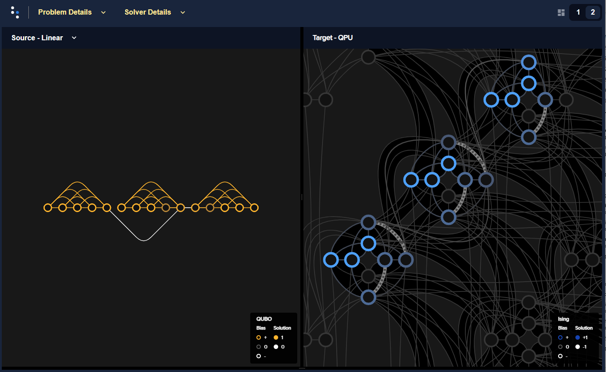
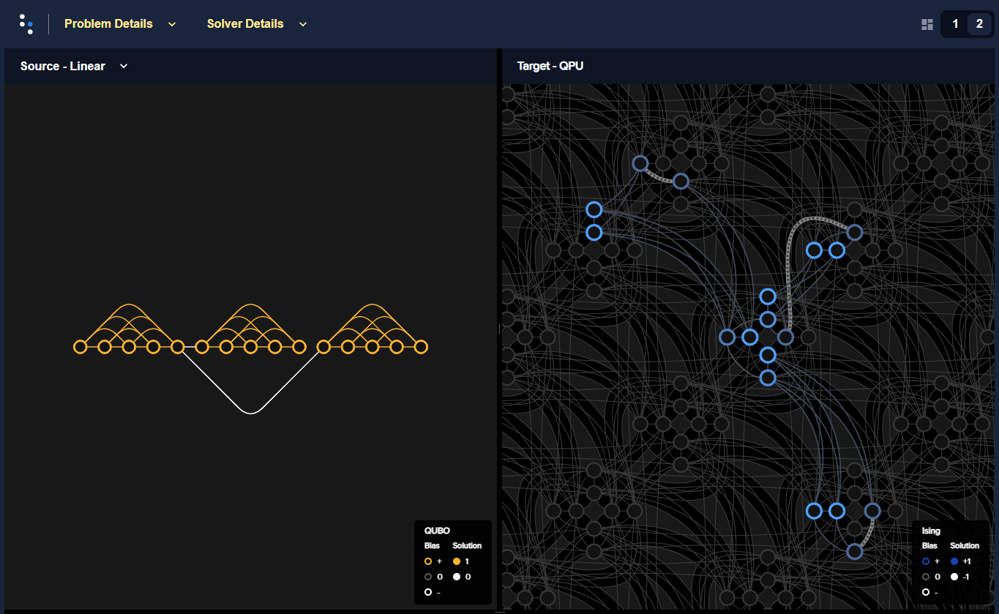
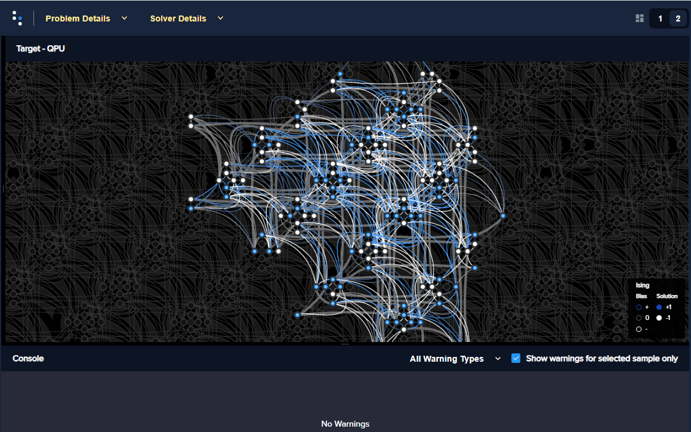
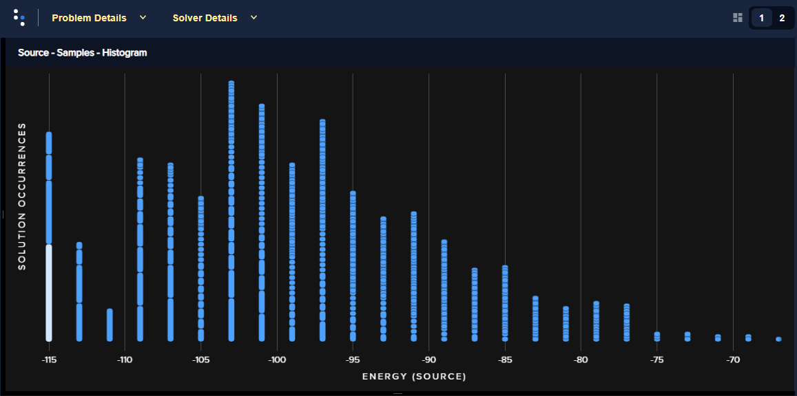
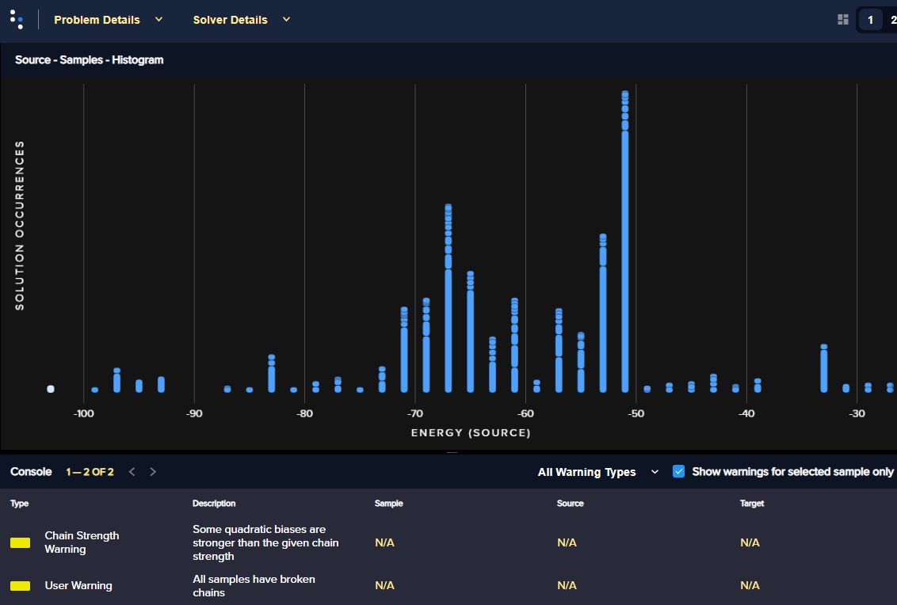
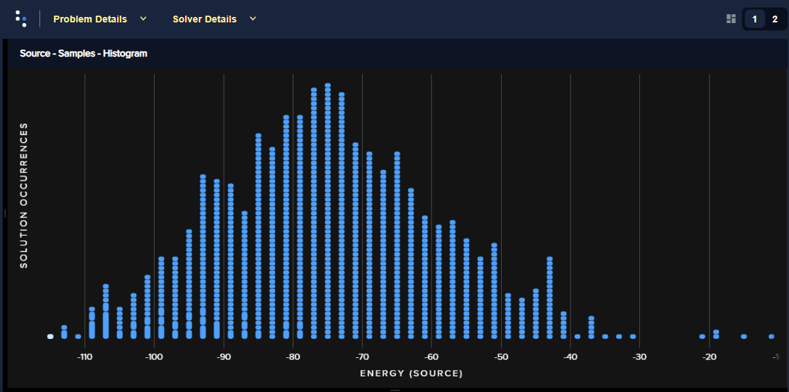
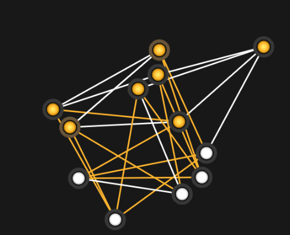
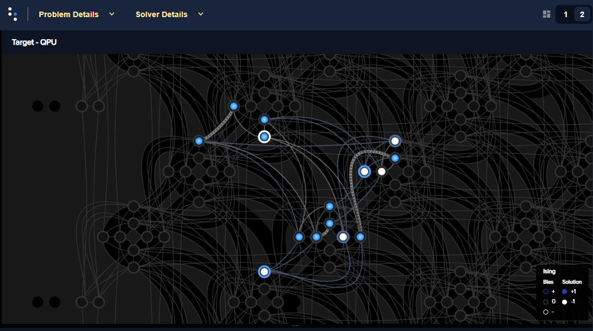
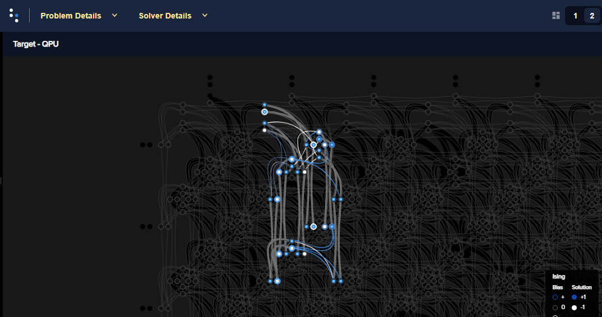
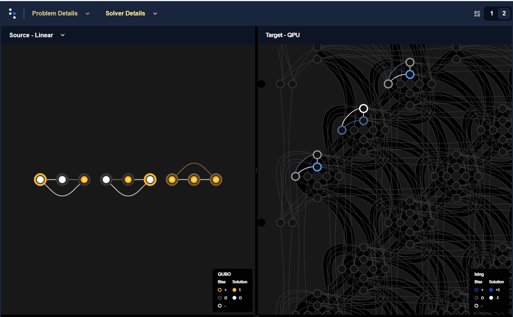

.. _qpu_embedding_guidance:

===============================
Minor-Embedding: Best Practices
===============================

The |dwave_short| QPU minimizes the energy of an Ising spin configuration
whose pairwise interactions lie on the edges of a QPU
:ref:`working graph <sysdocs:getting_started_topologies>`, such as the Pegasus
graph of an |dwave_5kq| system. To solve an Ising spin problem with arbitrary
pairwise interaction structure, the corresponding graph must be
:std:doc:`minor embedded <oceandocs:concepts/embedding>` into a QPU's graph.

There are algorithms that can embed a problem of :math:`N` variables in at most
:math:`N^2` qubits.

Ocean software's
:std:doc:`minorminer <oceandocs:docs_minorminer/source/sdk_index>` provides
embedding tools.

This chapter presents the following embedding topics:

.. contents::
    :depth: 1
    :local:
    :backlinks: none

.. _cb_embedding_global_local:

Global Versus Local
===================

*Global embedding* models each constraint as a BQM, adds all constraint models,
and maps the aggregate onto the QPU graph. Advantages of this method are that it
typically requires fewer qubits and shorter
:std:doc:`chains <oceandocs:concepts/embedding>`.

*Locally structured embedding* models each constraint locally within a subgraph,
places the local subgraphs within the QPU graph, and then connects variables
belonging to multiple local subgraphs. Advantages of this method, when the
scopes of constraints are small, are typically that it is more scalable to large
problems, requires less precision for parameters, and enforces qubit chains with
lower coupling strengths.

Example
-------

.. example code run on Advantage_system4.1

    bqm = dimod.BQM({0: 1.0, 1: 1.0, 2: 1.0, 3: 1.0, 4: 1.0, 6: 1.0, 5: 1.0,
        7: 1.0, 8: 1.0, 9: 1.0, 11: 1.0, 10: 1.0, 12: 1.0, 13: 1.0, 14: 1.0},
        {(1, 0): 1.0, (2, 0): 1.0, (2, 1): 1.0, (3, 0): 1.0, (3, 1): 1.0,
        (3, 2): 1.0, (4, 0): 1.0, (4, 1): 1.0, (4, 2): 1.0, (4, 3): 1.0,
        (5, 6): 1.0, (7, 6): 1.0, (7, 5): 1.0, (8, 6): 1.0, (8, 5): 1.0,
        (8, 7): 1.0, (9, 6): 1.0, (9, 5): 1.0, (9, 7): 1.0, (9, 8): 1.0,
        (10, 11): 1.0, (12, 11): 1.0, (12, 10): 1.0, (13, 11): 1.0,
        (13, 10): 1.0, (13, 12): 1.0, (14, 11): 1.0, (14, 10): 1.0,
        (14, 12): 1.0, (14, 13): 1.0, (4, 9): -1, (9, 14): -1}, 1, 'BINARY')
    embedding = {0: [3135], 1: [90, 3165], 2: [75], 3: [60], 4: [3120, 105],
        5: [3075], 6: [150, 3105], 7: [135], 8: [120], 9: [3060, 165],
        10: [3015], 11: [210, 3045], 12: [195], 13: [180], 14: [3000]}

The two graphics below compare local and global embeddings onto an |dwave_5kq|
QPU of a BQM represented by a graph composed of three :math:`K_5` cliques (fully
connected five-node graphs), sparsely interconnected.

*   :numref:`Figure %s <embeddingThreeK5sLocal>` shows a local embedding: each
    :math:`K_5` subgraph is manually embedded using the
    :class:`~dwave.system.composites.FixedEmbeddingComposite` class into a
    :math:`K_{4,4}`-like structure of the Pegasus graph.

*   :numref:`Figure %s <embeddingThreeK5sGlobal>` shows a global embedding: the
    entire BQM is embedded using the
    :class:`~dwave.system.composites.EmbeddingComposite` class.

    Example of local embedding for a BQM represented by a graph of three
    connected :math:`K_5` cliques.

    Example of global embedding for a BQM represented by a graph of three
    connected :math:`K_5` cliques.

In this small example, global embedding is likely more performant but for a
larger number of repeated subgraphs, local emebedding with its repeated
structure likely would keep chains shorter and uniform across the entire problem
(assuming simple and sparse connectivity between parts).

Further Information
-------------------

*   [Bia2016]_ compares global and local methods of embedding in the context of
    CSPs and discusses a rip-up and replace method.
*   [Boo2016]_ discusses clique minor generation.
*   [Cai2014]_ gives a practical heuristic for finding graph minors.
*   [Jue2016]_ discusses using FPGA-like routing to embed.
*   [Ret2017]_ describes embedding quantum-dot cellular automata networks.

.. _cb_embedding_chains:

Chain Management
==================

Similar to Lagrangian relaxation, you map a given problem's variable :math:`s_i`
onto :std:doc:`chain <oceandocs:concepts/embedding>`
:math:`\{q_i^{(1)}, \cdots, q_i^{(k)}\}` while encoding equality constraint
:math:`q_i^{(j)} = q_i^{(j')}` as an Ising penalty
:math:`-M q_i^{(j)} q_i^{(j')}` of weight :math:`M > 0`.

The following considerations and recommendations apply to chains.

*   Prefer short chains to long chains.
*   Prefer uniform chain lengths to uneven chains.
*   Balance chain strength and problem range. Estimate chain strength and set
    just slightly above the minimum threshold needed, using	strategies for
    auto-adjusting these chains. When mapping a problem's variable to qubits
    chains, the penalties for equality constraints should be (1) large enough so
    low-energy configurations do not violate these constraints and (2) the
    smallest weight that enforces the constraints while enabling precise problem
    statement (on :math:`\vc{h}` and :math:`\vc{J}`) and efficient exploration
    of the search space. An effective procedure	incrementally updates weights
    until the equality constraints are satisfied.

    See also the :ref:`qpu_config_precision` section.

Example
-------

This example embeds a BQM representing a 30-node
:std:doc:`signed-social network <oceandocs:docs_dnx/reference/algorithms/social>`
problem and then looks at the effects of different chain-strength settings.

>>> import networkx as nx
>>> import random
>>> import numpy as np
>>> import dwave_networkx as dnx
>>> import dimod
>>> from dwave.system import DWaveSampler, LazyFixedEmbeddingComposite
>>> import dwave.inspector
...
>>> # Create a problem
>>> G = nx.generators.complete_graph(30)
>>> G.add_edges_from([(u, v, {'sign': 2*random.randint(0, 1) - 1}) for u, v in G.edges])
>>> h, J = dnx.algorithms.social.structural_imbalance_ising(G)
>>> bqm = dimod.BQM.from_ising(h, J)
>>> # Sample on a D-Wave system
>>> num_samples = 1000
>>> sampler = LazyFixedEmbeddingComposite(DWaveSampler())
>>> sampleset = sampler.sample(bqm, num_reads=num_samples)      # doctest: +SKIP

You can now analyze the solution looking for the affects of your chain-strength
setting in various ways.

As a first iteration, it's convenient to use the Ocean software's default chain
strength. The :class:`~dwave.system.composites.LazyFixedEmbeddingComposite`
class sets a default chain strength using the
:func:`~dwave.embedding.chain_strength.uniform_torque_compensation` function
to calculate a reasonable value. For this problem, with the embedding found
heuristically, it calculated a chain strength of about 7.

>>> print(sampleset.info["embedding_context"]["chain_strength"]) # doctest: +SKIP
7.614623037288188

You can check the length of the longest chain.

>>> chains = sampleset.info["embedding_context"]["embedding"].values()  # doctest: +SKIP
>>> print(max(len(chain) for chain in chains))               # doctest: +SKIP
6

You can verify that the default chain strength for this problem is strong
enough so few chains are broken.

>>> print("Percentage of samples with >10% breaks is {} and >0 is {}.".format(
...       np.count_nonzero(sampleset.record.chain_break_fraction > 0.10)/num_samples*100,
...       np.count_nonzero(sampleset.record.chain_break_fraction > 0.0)/num_samples*100)) # doctest: +SKIP
Percentage of samples with >10% breaks is 0.0 and >0 is 17.5.

You can also look at the embedding and histograms of solution energies using
the Ocean software's
:std:doc:`problem inspector <oceandocs:docs_inspector/sdk_index>` tool.

>>> dwave.inspector.show(sampleset)                       # doctest: +SKIP

:numref:`Figure %s <chainstrengthSsn30Embedding>` shows the BQM embedded in an
|dwave_5kq| QPU.

    BQM representing a social-network problem of 30 nodes embedded in an
    |dwave_5kq| QPU.

The following graphs show histograms of the returned solutions' energies for
different chains strengths:

*   :numref:`Figure %s <chainstrengthSsn30HistogramAuto>` has the default chain
    strength, which for this problem was calculated as about 7.
*   :numref:`Figure %s <chainstrengthSsn30Histogram1>` has a chain strength
    manually set to 1 (identical to the maximum bias for the problem). [#]_
*   :numref:`Figure %s <chainstrengthSsn30Histogram14>` has a chain strength
    manually set to 14 (double the default value for this problem).

.. [#]
    You can set a chain strength relative to your problem's largest bias by
    using, for example, the :func:`~dwave.embedding.chain_strength.scaled`
    function.

    >>> from dwave.embedding.chain_strength import scaled
    ...
    >>> sampleset = sampler.sample(
    ...     bqm, num_reads=num_samples, chain_strength=scaled)  # doctest: +SKIP

    Energy histogram for the social-network problem with a chain strength of ~7.

    Energy histogram for the social-network problem with a chain strength of 1.

    Energy histogram for the social-network problem with a chain strength of 14.

You can see that setting the chain strength too low compared to the problem's
biases results in high chain breakage and consequently few good solutions;
setting it too high distorts the problem.

Further Information
-------------------

*   The :std:doc:`Multiple-Gate Circuit <oceandocs:examples/multi_gate>` example
    in the :std:doc:`Ocean software documentation <oceandocs:index>` is a good
    introductory example of the effects of setting chain strengths.
*   The
    :std:doc:`Using the Problem Inspector <oceandocs:examples/inspector_graph_partitioning>`
    example demonstrates using the Ocean software's
    :std:doc:`problem inspector <oceandocs:docs_inspector/sdk_index>` tool for
    examining embeddings and setting chain strengths.

*   [Rie2014]_ studies embedding and parameter setting, and their effects on
    problem solving in the context of optimization problems.
*   [Ven2015b]_ discusses effects of embedding the Sherrington-Kirkpatrick
    problem.

.. _cb_embedding_clique:

Embedding Complete Graphs
===========================

Embeddings for cliques (fully-connected graphs) can be very useful: a
minor-embedding for a :math:`K_n` clique can be used for all minors of that
graph. This means that if your application needs to submit to the QPU a series
of problems of up to :math:`n` variables, having an embedding for the
:math:`K_n` graph lets you simply reuse it for all those submissions, saving the
embedding-computation time in your application's runtime execution.

Using a clique embedding can have a high cost for sparse graphs because chain
lengths increase significantly for high numbers of variables.

Example: Largest Cliques on the Chimera Topology
------------------------------------------------

The largest complete graph :math:`K_V` that is a minor of a
:math:`M\times N\times L` Chimera graph has :math:`V=1+L\min(M,N)` vertices.
For example, 65 vertices is the theoretical maximum on a C16 Chimera graph (a
:math:`16 {\rm x} 16` matrix of 8-qubit unit cells for up to\ [#]_
:math:`2MNL=2 \times 16 \times 16 \times 4=2048` qubits), which was the topology
of the |dwave_2kq| system.

.. [#]
    The yield of a working graph is typically less than 100%.

Example: Chain Lengths for Cliques on Pegasus and Chimera Topologies
--------------------------------------------------------------------

:numref:`Table %s <completeEmbeddingsChainLength>` shows some example embeddings
of complete graphs versus chain lengths for both QPU topologies with 95% yields.
For a given maximum chain length, you can embed cliques of about the following
sizes in Pegasus P16 and Chimera C16 topologies with working graphs simulating
95% yield (by random removal of 5% of nodes and 0.5% of edges to represent
inactivated qubits and couplers):

.. table:: Complete Embeddings Versus Chain Length for 95% Yields.
    :name: completeEmbeddingsChainLength

    ======================  ======================  ======================
    **Chain Length**        **Chimera Topology**    **Pegasus Topology**
    ======================  ======================  ======================
    1                       :math:`K_2`             :math:`K_4`
    2                       :math:`K_4`             :math:`K_{10}`
    4                       :math:`K_{12}`          :math:`K_{30}`
    10                      :math:`K_{28}`          :math:`K_{71}`
    ======================  ======================  ======================

For a Pegasus graph with 100% yield the largest complete graph that is
embeddable is :math:`K_{150}` with chain length of 14. QPUs typically do not
achieve 100% yield.

Example: Clique-Embedding a Sparse BQM
--------------------------------------

:numref:`Figure %s <embeddingSparseBqm>` shows an example BQM constructed from
a sparse `NetworkX <https://networkx.org/>`_ graph,
:func:`~networkx.generators.small.chvatal_graph()`. This example embeds the BQM
onto an |dwave_5kq| QPU in two ways: (1) using the standard
:std:doc:`minorminer <oceandocs:docs_minorminer/source/sdk_index>` heuristic of
the :class:`~dwave.system.composites.EmbeddingComposite` class and (2) using
a clique embedding found by the
:class:`~dwave.system.samplers.DWaveCliqueSampler` class.

    BQM based on a sparse graph.

>>> from dwave.system import DWaveSampler, EmbeddingComposite, DWaveCliqueSampler
>>> import networkx as nx
>>> import dimod
>>> import random
>>> import dwave.inspector
...
>>> # Create a small, sparse BQM from a NetworkX graph
>>> G = nx.generators.small.chvatal_graph()
>>> for edge in G.edges:
...     G.edges[edge]['quadratic'] = random.choice([1,-1])
>>> bqm = dimod.from_networkx_graph(G,
...                                 vartype='BINARY',
...                                 edge_attribute_name='quadratic')
>>> sampleset = EmbeddingComposite(DWaveSampler()).sample(bqm, num_reads=1000)
>>> sampleset_clique = DWaveCliqueSampler().sample(bqm,
...                                                num_reads=1000) # doctest: +SKIP

The following graphs show both embeddings:

*   :numref:`Figure %s <embeddingSparseBqmNotClique>` is an embedding found for
    the sparse graph.
*   :numref:`Figure %s <embeddingSparseBqmClique>` is a clique embedding in
    which the BQM graph is a minor.

    Embedding found for the sparse graph of the problem.

    Clique embedding that includes the sparse graph of the problem.

Clearly the clique embedding requires more and longer chains.

Further Information
-------------------

*   [Pel2021]_ proposes a method of parallel quantum annealing that makes use
    of available qubits by embedding several small problems in the same
    annealing cycle.
*   [Zbi2020]_ proposes two algorithms, Spring-Based MinorMiner (SPMM) and
    Clique-Based MinorMiner (CLMM), for minor-embedding QUBO problems into
    Chimera and Pegasus graphs.
*   `Exploring the Pegasus Topology <https://github.com/dwave-examples/pegasus-notebook>`_
    Jupyter Notebook.

.. _cb_embedding_precomputing:

Reusing Embeddings
==================

For problems that vary only the biases and weights on a fixed graph, you can set
a good embedding once before submitting the problem to the QPU. There is no need
to recompute the embedding (a time-consuming operation) for every submission.

.. _cb_embedding_preembedding:

Pre-embedding Local Constraint Structures
=========================================

The structure of some problems contains repeated elements; for example, the
multiple AND gates, half adders, and full adders in the
`Factoring <https://github.com/dwave-examples/factoring>`_ example. Such
problems may benefit from being embedded with repeating block structures for the
common elements, with connectivity then added as needed.

Example
-------

.. raw:: latex

    \begin{figure}
    \begin{centering}
    \begin{circuitikz}

    \node (in0) at (0.4, 0.5) {$in11$};
    \node (in1) at (4.3, 0.5) {$in21$};
    \node (in2) at (8.3, 0.5) {$in31$};

    \node (in3) at (0.4, -0.5) {$in12$};
    \node (in4) at (4.4, -0.5) {$in22$};
    \node (in5) at (8.4, -0.5) {$in32$};

    \node(out1) at  (2.5, 0.3) {$out1$};
    \node(out1) at  (6.5, 0.3) {$out2$};
    \node(out3) at  (10.5, 0.3) {$out3$};

    \draw

    (2,0) node[and port] (myand1) {1}
    (6,0) node[or port] (myand2) {2}
    (10,0) node[and port] (myand3) {3}

    (0.1, 0.3) -- (myand1.in 1)
    (myand3.out) -- (11,0);

    \end{circuitikz}\\

    \end{centering}

    \caption{A small embedding problem constructed with Boolean gates.}
    \label{fig:embeddingThreeGates}
    \end{figure}

    This small example pre-embeds three gates shown in Figure \ref{fig:embeddingThreeGates}.

.. only:: html

    .. figure:: ../_images/embedding_three_gates.png
        :name: embeddingThreeGatesHTML
        :alt: image
        :align: center
        :scale: 90 %

        Circuit of three Boolean gates.

    This small example pre-embeds three Boolean gates.

You can embed a BQM representing an AND or OR gate in a repeating
structure of the Pegasus topology, a :math:`K_{4,4}` biclique with additional
couplers connecting some horizontal and vertical qubits.

>>> import minorminer
>>> import dwave_networkx as dnx
>>> from dimod.generators import and_gate, or_gate
...
>>> pegasus_k44 = dnx.pegasus_graph(2, node_list=[4, 5, 6, 7, 40, 41, 42, 43])
...
>>> bqm_and1 = and_gate('in11', 'in12', 'out1')
>>> embedding_and = minorminer.find_embedding(list(bqm_and1.quadratic.keys()), pegasus_k44)
>>> embedding_and                                           # doctest: +SKIP
{'in12': [40], 'in11': [4], 'out1': [41]}
...
>>> bqm_or2 = or_gate('in21', 'in22', 'out2')
>>> embedding_or = minorminer.find_embedding(list(bqm_or2.quadratic.keys()), pegasus_k44)
>>> embedding_or                                        # doctest: +SKIP
{'in22': [4], 'in21': [41], 'out2': [40]}

.. example code run on Advantage_system4.1

    embedding = {'in12': [3120], 'in11': [60], 'out1': [3135], 'in22': [120],
        'in21': [3075], 'out2': [3060], 'in22': [3000], 'in21': [180],
        'out2': [3015]}

    Circuit of three Boolean gates pre-embedded in an |dwave_5kq| QPU.

Further Information
-------------------

*   [Ada2015]_  describes embedding an RBM on the |dwave_short| system by
    mapping the visible nodes to chains of vertical qubits and hidden nodes to
    chains of horizontal qubits.

.. _cb_embedding_vg:

Virtual Graphs
==============

.. include:: ../shared/notes.rst
    :start-after: start_virtual_graph_deprecation
    :end-before: end_virtual_graph_deprecation

The |dwave_short| *virtual graph* feature simplifies the process of
minor-embedding by enabling you to more easily create, optimize, use, and reuse
an embedding for a given working graph. When you submit an embedding and specify
a chain strength using the
:class:`~dwave.system.composites.VirtualGraphComposite` class, it automatically
calibrates the qubits in a chain to compensate for the effects of unintended
biases---see
:ref:`integrated control errors (ICE) 1 <sysdocs:qpu_ice_background_susceptibility>`---
caused by QPU imperfections.

Further Information
-------------------

*   [Dwave6]_ is a white paper describing measured performance improvements from
    using virtual graphs.
