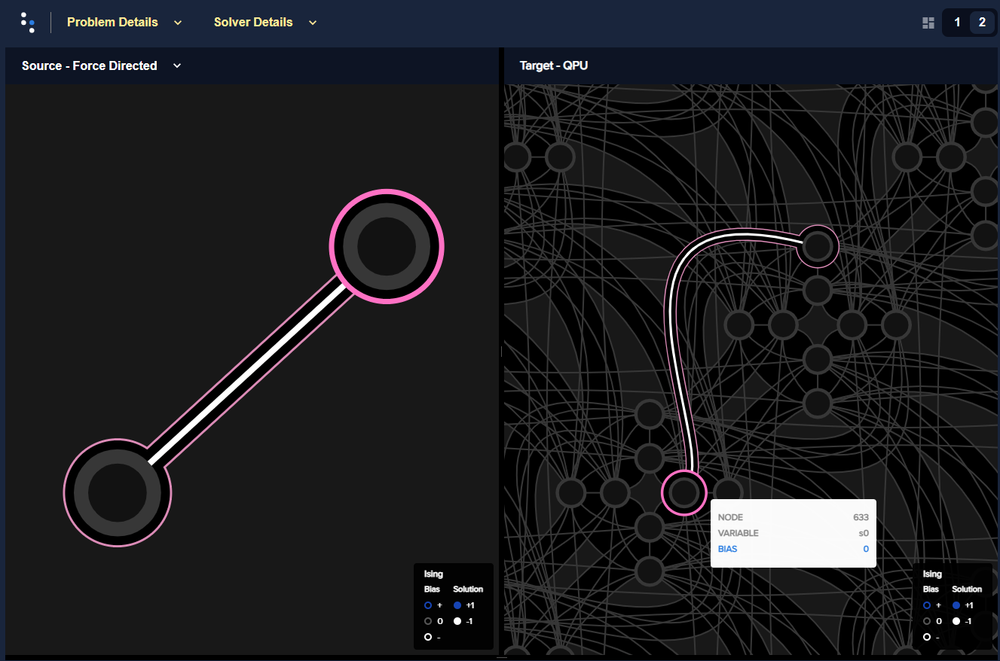
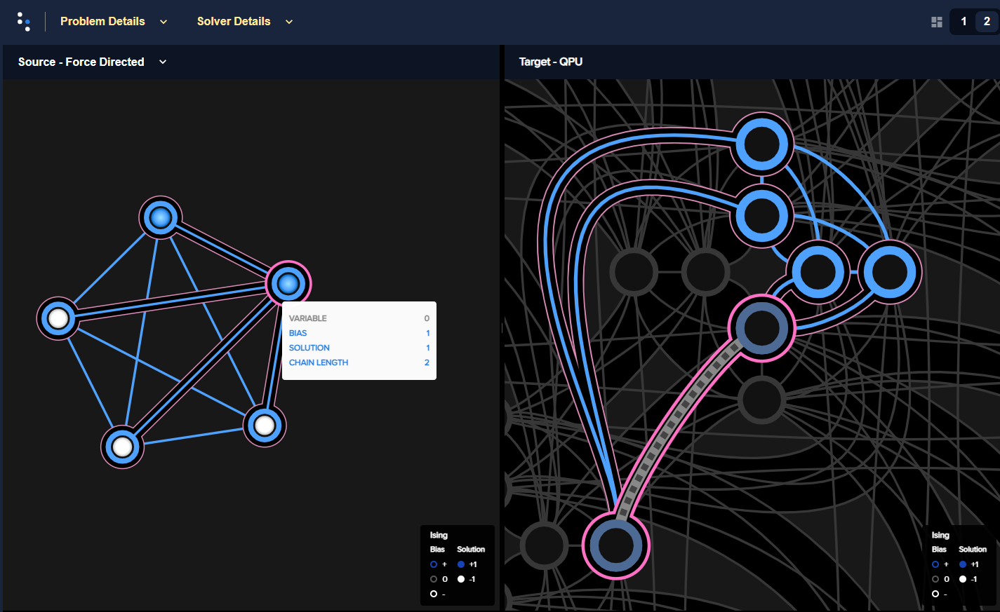
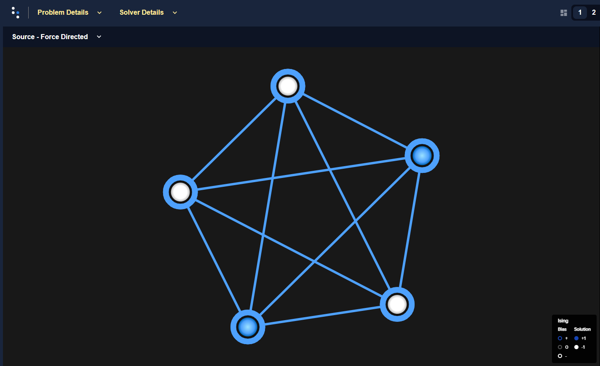
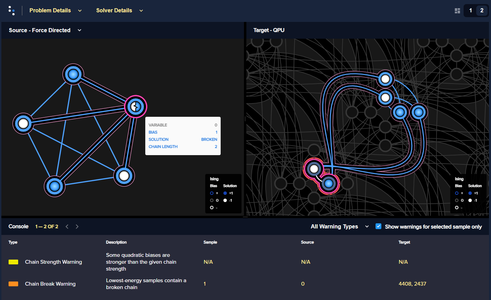

.. _qpu_embedding_intro:

===============
Minor Embedding
===============

To solve an arbitrarily structured
:ref:`binary quadratic model <concept_models_bqm>` (BQM) directly on a
|dwave_short| quantum computer requires mapping, called *minor embedding*, to
the :ref:`topology <qpu_topologies>` of the system's quantum processing unit
(QPU). This preprocessing can be done by a :term:`composed sampler` consisting
of the :class:`~dwave.system.samplers.DWaveSampler()` and a composite that
performs minor-embedding. (This step is handled automatically by :term:`hybrid`
samplers such as :class:`~dwave.system.samplers.LeapHybridSampler`.)

For example, a simple two-variable BQM,

.. math::

    E(\bf{s}) = - s_0 s_1
    \qquad\qquad s_i\in\{-1,+1\}

might be embedded to two connected qubits, such as ``633`` and ``3603`` on the
particular Advantage system shown below:

    Two-variable problem, shown on the left as a graph, is embedded in two
    connected qubits on an Advantage, shown on the right against the Pegasus
    topology. Variable :math:`s_0`, highlighted in dark magenta, is represented
    by qubit number ``633`` and variable :math:`s_1` is represented by qubit
    ``3603``. (This and similar images in this section are generated by Ocean's
    :ref:`problem inspector <index_inspector>` tool.)

In the Advantage's :term:`Pegasus` topology, most qubits are connected to
fifteen other qubits, so other valid minor-embeddings for this particular QPU
might be ``633`` for :math:`s_0` and ``634`` for :math:`s_1` or ``4628`` for
:math:`s_0` and ``1749`` for :math:`s_1`.

.. _qpu_embedding_intro_chains:

Chains
======

Larger problems often require chains because the
:ref:`QPU topology <qpu_topologies>` is not fully connected. For example, a
:math:`K_5` graph is not *native* to the :term:`Pegasus` topology, meaning that
the following five-variable BQM with a clique (fully-connected) :math:`K_5`
graph cannot be represented by five qubits on an Advantage QPU.

>>> import dimod
>>> bqm = dimod.generators.doped(1, 5)
>>> bqm.add_linear_from({v: 1 for v in bqm.variables})

Instead, at least one variable is represented by a *chain* of physical qubits,
as in this minor-embedding:

    Five-variable :math:`K_5` fully-connected problem, shown on the left as a
    graph, is embedded in six qubits on an Advantage, shown on the right against
    the Pegasus topology. Variable ``0``, highlighted in dark magenta, is
    represented by two qubits, ``1975`` and ``4840``.

The minor-embedding above was derived from the hueristic used by the
:class:`~dwave.system.composites.EmbeddingComposite` composite on the
:term:`working graph` of an Advantage selected by the
:class:`~dwave.system.samplers.DWaveSampler` sampler class:

>>> from dwave.system import DWaveSampler, EmbeddingComposite, FixedEmbeddingComposite
>>> sampler = EmbeddingComposite(DWaveSampler())

Other qubits might have been chosen; for example,

>>> sampler = FixedEmbeddingComposite(DWaveSampler(),
...     embedding={0: [4408, 2437], 1: [4333], 2: [4348], 3: [2497], 4: [2512]})    # doctest: +SKIP

intentionally sets the embedding shown below to represent this same :math:`K_5`
graph:

.. figure:: ../_images/embedding_5var6qubits_2.png
    :align: left
    :name: Embedding3var6qubits_2
    :scale: 60 %
    :alt: Three-variable fully-connected problem embedded into six qubits.

    Five-variable :math:`K_5` fully-connected problem, shown on the left as a
    graph, is embedded in six qubits on an Advantage, shown on the right against
    the Pegasus topology. Variable ``0``, highlighted in dark magenta, is
    represented by two qubits, ``4408`` and ``2437``.

.. _qpu_embedding_intro_chain_strength:

Chain Strength
==============

For a chain of qubits to represent a variable, all its constituent qubits must
return the same value for a sample. This is accomplished by setting a strong
coupling to the edges connecting these qubits. That is, for the qubits in a
chain to be likely to return identical values, the coupling strength for their
connecting edges must be strong compared to the coupling with other qubits
that influence non-identical outcomes.

The :math:`K_5` BQM for a

.. todo:: verify link to https://docs.ocean.dwavesys.com/en/stable/docs_dimod/reference/generated/dimod.generators.doped.html

:ref:`doped ferromagnetic problem <dimod.generators.doped>`, created in the
:ref:`subsection above <qpu_embedding_intro_chains>`, has ten
:term:`ground states <ground state>` (best solutions). These are shown
below---solved by brute-force stepping through all possible configurations of
values for the variables---with ground-state energy :math:`-3.0`:

>>> print(dimod.ExactSolver().sample(bqm).lowest())
   0  1  2  3  4 energy num_oc.
0 +1 +1 -1 -1 -1   -3.0       1
1 -1 +1 +1 -1 -1   -3.0       1
2 +1 -1 +1 -1 -1   -3.0       1
3 -1 -1 +1 +1 -1   -3.0       1
4 -1 +1 -1 +1 -1   -3.0       1
5 +1 -1 -1 +1 -1   -3.0       1
6 -1 -1 -1 +1 +1   -3.0       1
7 -1 -1 +1 -1 +1   -3.0       1
8 -1 +1 -1 -1 +1   -3.0       1
9 +1 -1 -1 -1 +1   -3.0       1
['SPIN', 10 rows, 10 samples, 5 variables]

These solutions are states in which two variables are assigned one value and the
remaining three variables the complementary value; for example two are
:math:`-1` and three :math:`+1` as shown below.

    Ground state of the five-variable :math:`K_5` fully-connected problem.

A typical submission of the problem to a quantum computer, using the same
minor-embedding as the previous subsection and the default chain strength,
returned all the ground states, with these solutions constituting over 90% of
the returned samples.

>>> sampleset = sampler.sample(bqm, num_reads=1000)     # doctest: +SKIP
>>> print(sampleset.lowest())       # doctest: +SKIP
    0  1  2  3  4 energy num_oc. chain_.
0  -1 +1 +1 -1 -1   -3.0      69     0.0
1  +1 -1 -1 +1 -1   -3.0     115     0.0
2  +1 -1 -1 -1 +1   -3.0      95     0.0
3  +1 -1 +1 -1 -1   -3.0      84     0.0
4  -1 -1 -1 +1 +1   -3.0     116     0.0
5  -1 -1 +1 +1 -1   -3.0      99     0.0
6  -1 -1 +1 -1 +1   -3.0      91     0.0
7  +1 +1 -1 -1 -1   -3.0      71     0.0
8  -1 +1 -1 +1 -1   -3.0      98     0.0
9  -1 +1 -1 -1 +1   -3.0      95     0.0
10 +1 -1 -1 +1 -1   -3.0       1     0.2
['SPIN', 11 rows, 934 samples, 5 variables]

The default chain strength is set by the
:func:`~dwave.embedding.chain_strength.uniform_torque_compensation` function:

>>> print(round(sampleset.info['embedding_context']['chain_strength'], 3)) # doctest: +SKIP
2.828

Resubmitting with a much lower chain strength produced less satisfactory results
(only ~10% of returned samples are ground states).

>>> sampleset = sampler.sample(bqm, num_reads=1000, chain_strength=1) # doctest: +SKIP
>>> print(sampleset.lowest())		# doctest: +SKIP
   0  1  2  3  4 energy num_oc. chain_.
0 -1 +1 +1 -1 -1   -3.0      12     0.0
1 +1 -1 -1 +1 -1   -3.0      13     0.0
2 +1 -1 -1 -1 +1   -3.0      13     0.0
3 +1 -1 +1 -1 -1   -3.0      16     0.0
4 -1 -1 -1 +1 +1   -3.0       6     0.0
5 -1 -1 +1 +1 -1   -3.0      10     0.0
6 -1 -1 +1 -1 +1   -3.0      17     0.0
7 +1 +1 -1 -1 -1   -3.0      17     0.0
8 -1 +1 -1 +1 -1   -3.0      10     0.0
9 -1 +1 -1 -1 +1   -3.0       7     0.0
['SPIN', 10 rows, 121 samples, 5 variables]

Many of the remaining ~90% of returned samples have "broken chains", meaning
qubits of a chain did not have identical values due to insufficiently strong
coupling compared to quadratic coefficients of interactions (of the variable
the chain represented) with other variables.

    Five-variable :math:`K_5` fully-connected problem is embedded in six qubits
    on an Advantage using a low chain strength. Variable ``0``, highlighted in
    dark magenta, is represented by two qubits, numbers ``2437`` and ``4408``.
    The displayed solution has a broken chain: qubit ``4408`` returned a value
    of :math:`-1` (represented by a white dot) while qubit ``2347`` returned a
    value of :math:`+1` (a blue dot). The logical representation of the problem,
    on the left, shows a half-white, half-blue dot to represent a value based on
    a broken chain.

Further Information
===================

For information on handling embedding and chains, see the following sections:

*   Section :ref:`qpu_embedding_guidance` provides more-advanced guidance.

*   Examples in the :ref:`qpu_example_and`, :ref:`qpu_example_multigate`,
    and :ref:`qpu_example_inspector_graph_partitioning` sections show through
    some simple examples how to embed and set chain strength.

*   The :ref:`minorminer <index_minorminer>` tool is the hueristic used by common
    Ocean embedding :term:`composites <composites>`.

*   The :ref:`problem inspector <index_inspector>` tool visualizes embeddings.

.. todo:: verify links above

