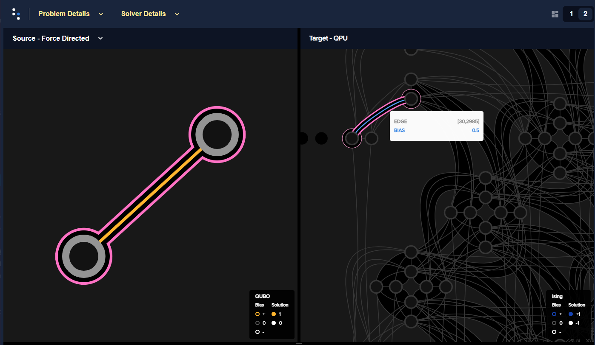
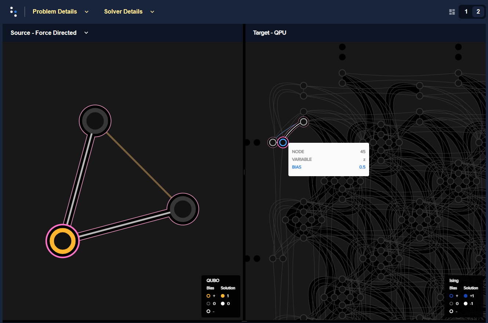
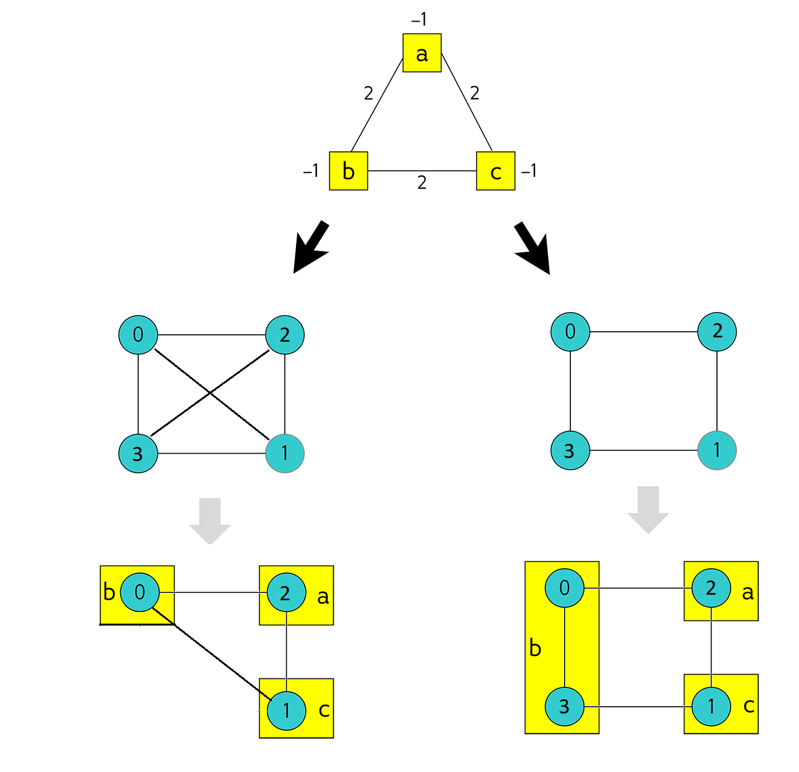
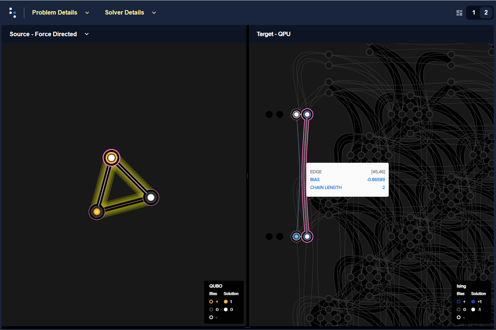

.. _qpu_example_and:

================
Boolean AND Gate
================

This example solves a simple problem of a Boolean AND gate on a D-Wave system to demonstrate
programming the underlying hardware more directly; in particular, :term:`minor-embedding`
a :ref:`chain <embedding_sdk>`.

Other examples demonstrate more advanced steps that are typically needed for solving actual problems.

Example Requirements
====================

.. include:: ../shared/examples.rst
    :start-after: start_requirements
    :end-before: end_requirements

Solution Steps
==============

.. |workflow_section| replace:: :ref:`qpu_workflow`

.. include:: ../shared/examples.rst
    :start-after: start_standard_steps
    :end-before: end_standard_steps

This example mathematically formulates the BQM and uses Ocean tools to solve it
on a D-Wave quantum computer.

Formulate the AND Gate as a BQM
===============================

Ocean tools can automate the representation of logic gates as a BQM, as demonstrated
in the :ref:`multi_gate` example. The :ref:`not` example presents a mathematical
formulation of a BQM for a Boolean gate in detail. This example briefly repeats the steps
of mathematically formulating a BQM while adding details on the underlying physical processes.

A D-Wave quantum processing unit (:term:`QPU`) is a chip with interconnected qubits; for example,
an Advantage QPU has over 5000 qubits connected in a :term:`Pegasus` topology. Programming it
consists mostly of setting two inputs:

* Qubit bias weights: control the degree to which a qubit tends to a particular state.
* Qubit coupling strengths: control the degree to which two qubits tend to the same state.

The biases and couplings define an energy landscape, and the D-Wave quantum computer seeks
the minimum energy of that landscape. Once you express your problem in a formulation\ [#Ising]_
such that desired outcomes have low energy values and undesired outcomes high energy values,
the D-Wave system solves your problem by finding the low-energy states.

.. [#Ising] This formulation, called an :term:`objective function`, corresponds to the :term:`Ising`
       model traditionally used in statistical mechanics: given :math:`N` variables
       :math:`s_1,...,s_N`, corresponding to physical Ising spins, where each variable
       :math:`s_i` can have values :math:`-1` or :math:`+1`, the system energy for
       an assignment of values is,

       .. math::

           E(\pmb{s}|\pmb{h},\pmb{J})  = \left\{ \sum_{i=1}^N h_i s_i + \sum_{i<j}^N J_{i,j} s_i s_j  \right\}

       where :math:`h_i` are biases and :math:`J_{i,j}` couplings between spins.

This example uses another binary quadratic model (:term:`BQM`), the computer-science equivalent of the Ising model,
the :term:`QUBO`: given :math:`M` variables :math:`x_1,...,x_N`, where each variable :math:`x_i` can
have binary values :math:`0` or :math:`1`, the system tries to find assignments of values
that minimize

.. math::

    E(q_i, q_{i,j}; x_i) = \sum_i^N q_ix_i + \sum_{i<j}^N q_{i,j}x_i  x_j,

where :math:`q_i` and :math:`q_{i,j}` are configurable (linear and quadratic) coefficients.
To formulate a problem for the D-Wave system is to program :math:`q_i` and :math:`q_{i,j}` so
that assignments of :math:`x_1,...,x_N` also represent solutions to the problem.

AND as a Penalty Function
-------------------------

This example represents the AND operation, :math:`z \Leftrightarrow x_1 \wedge x_2`,
where :math:`x_1, x_2` are the gate's inputs and :math:`z` its output,
using a :term:`penalty function`:

.. math::

    x_1 x_2 - 2(x_1+x_2)z +3z.

This penalty function represents the AND gate in that for assignments of variables that match
valid states of the gate, the function evaluates at a lower value than assignments that would
be invalid for the gate. Therefore, when the D-Wave system minimizes a BQM based on this penalty function,
it finds those assignments of variables that match valid gate states.

You can verify that this penalty function represents the AND gate in the same way as was
done in the :ref:`not` example. See the
:std:doc:`D-Wave Problem-Solving Handbook <sysdocs_gettingstarted:doc_handbook>`
for more information about penalty functions in general, and penalty functions for representing
Boolean operations in particular.

Formulating the Problem as a QUBO
---------------------------------

For this example, the penalty function is quadratic, and easily reordered in the familiar
QUBO formulation:

.. math::

    E(q_i, q_{i,j}; x_i) = 3x_3 + x_1x_2 - 2x_1x_3 - 2x_2x_3

where :math:`z=x_3` is the AND gate's output, :math:`x_1, x_2` the inputs, linear
coefficients are :math:`q_1=3`, and quadratic coefficients are :math:`q_{1,2}=1,
q_{1,3}=-2, q_{2,3}=-2`.
The coefficients matrix is,

.. math::

     Q = \begin{bmatrix} 0 & 1 & -2\\
                           & 0 & -2\\
                           &   & 3 \end{bmatrix}

See the
:std:doc:`Getting Started with the D-Wave System <sysdocs_gettingstarted:doc_getting_started>`
and
:std:doc:`D-Wave Problem-Solving Handbook <sysdocs_gettingstarted:doc_handbook>`
books for more information about formulating problems as QUBOs.

The line of code below sets the QUBO coefficients for this AND gate.

>>> Q = {('x1', 'x2'): 1, ('x1', 'z'): -2, ('x2', 'z'): -2, ('z', 'z'): 3}

.. _and_solve_by_sampling: 

Solve the Problem by Sampling (Automated Minor-Embedding)
=========================================================

For reference, first solve with the same steps used in the :ref:`not` example.

Again use sampler :class:`~dwave.system.samplers.DWaveSampler` from Ocean software's
:doc:`dwave-system </docs_system/sdk_index>` and
its :class:`~dwave.system.composites.EmbeddingComposite` composite to :term:`minor-embed`
the unstructured problem (variables :math:`x_1`, :math`x_2`, and :math`z`) on the sampler's graph structure (the
QPU's numerically indexed qubits).

The next code sets up a D-Wave system as the sampler.

.. include:: min_vertex.rst
   :start-after: default-config-start-marker
   :end-before: default-config-end-marker

>>> from dwave.system import DWaveSampler, EmbeddingComposite
>>> sampler = DWaveSampler()
>>> sampler_embedded = EmbeddingComposite(sampler)

As before, ask for 5000 samples.

>>> sampleset = sampler_embedded.sample_qubo(Q, num_reads=5000,
...                                          label='SDK Examples - AND Gate')
>>> print(sampleset)   # doctest: +SKIP
  x1 x2  z energy num_oc. chain_b.
0  0  1  0    0.0    1812      0.0
1  1  0  0    0.0     645      0.0
2  1  1  1    0.0     862      0.0
3  0  0  0    0.0    1676      0.0
5  1  0  0    0.0       1 0.333333
6  1  1  1    0.0       1 0.333333
4  0  1  1    1.0       3      0.0
['BINARY', 7 rows, 5000 samples, 3 variables]

Almost all the returned samples from this execution represent valid value 
assignments for an AND gate, and minimize (are low-energy states of) the BQM.

Note that lines 5 and 6 of output from this execution show samples that seem
identical to lines 1 and 2 (but with non-zero values in the rightmost column,
:code:`chain_b.`). The next section addresses that.

Understanding Minor-Embedding
=============================

This section looks more closely into :term:`minor-embedding`. Above and in the :ref:`not`
example, :doc:`dwave-system </docs_system/sdk_index>`
:class:`~dwave.system.composites.EmbeddingComposite` composite abstracted the minor-embedding.

Minor-Embedding a NOT Gate
--------------------------

For simplicity, first return to the NOT gate. The :ref:`not`
example found that a NOT gate can be represented by a BQM in QUBO form with the
following coefficients:

>>> Q_not = {('x', 'x'): -1, ('x', 'z'): 2, ('z', 'x'): 0, ('z', 'z'): -1}

Minor embedding maps the two problem variables x and z to the indexed qubits of the
D-Wave QPU. Here, do this mapping yourself.

The next line of code looks at the ``nodelist`` property of the sampler. Select 
the first node, which on a QPU is a qubit, and print its adjacent nodes, which 
are the qubits it is coupled to.

>>> sampler.nodelist[0]   # doctest: +SKIP
30
>>> print(sampler.adjacency[sampler.nodelist[0]])      # doctest: +SKIP
{2985, 2955, 45, 2970, 2940, 31}

For the Advantage system the above code ran on in this particular execution, 
you see that the first available qubit, ``30``, is adjacent to qubit ``31`` 
and a few others. 

You can map the NOT problem's two linear coefficients (coefficients of the 
:math:`-1x` and :math:`-1z` terms) and single quadratic coefficient (coefficient 
of the :math:`2xz` term) to :math:`q_1=q_2=-1` biases applied to the  Advantage's 
qubits ``30`` and ``31`` and a :math:`q_{1,2}=2` coupling strength applied to 
coupler ``[30, 31]``. The figure below shows this embedding of the NOT gate 
onto an Advantage QPU.

    A NOT gate minor embedded onto an Advantage QPU. Variables :math:`x,z` 
    (left) are minor-embedded to qubits ``30`` and ``31`` (right). This 
    visualization is produced by Ocean's :ref:`sdk_index_inspector` tool.
    
Notice that coupling strength is :code:`BIAS 0.5` above: as explained in the 
:std:doc:`system documentation <sysdocs_gettingstarted:doc_getting_started>`,
the QPU can be viewed as minimizing the Ising model (see Ising_ footnote
above), with linear biases setting the amplitudes of magnetic fields applied 
to qubits and quadratic biases the strength of coupling between qubits. While
QUBOs are more convenient to work with for some problems, Ocean converts 
problems submitted to a QPU to equivalent Ising models, producing the 
:math:`J_{1,2}` bias of ``0.5`` for the ``[30, 31]`` coupler shown above (and
, not shown, zero :math:`h_1=h_2` biases on the two qubits):

>>> dimod.qubo_to_ising(Q_not) 
({'x': 0.0, 'z': 0.0}, {('x', 'z'): 0.5}, -0.5)

The following code uses the :class:`~dwave.system.composites.FixedEmbeddingComposite` 
composite to manually minor-embed the problem on this Advantage QPU.\ [#]_ 

>>> from dwave.system import FixedEmbeddingComposite
>>> sampler_embedded = FixedEmbeddingComposite(sampler, {"x": [30], "z": [31]})   
>>> print(sampler_embedded.adjacency["x"])   # doctest: +SKIP
{'z'}

.. [#]
    For your selected QPU, use your :code:`sampler.nodelist[0]` qubit for 
    :math:`x` and any of its adjacent qubits, 
    :code:`sampler.adjacency[sampler.nodelist[0]]`, for :math:`z`, 
    as done above. 

As in the :ref:`not` example, most the results from 5000 samples are valid 
states of a NOT gate, with complementary values for :math:`x` and :math:`z`.

>>> sampleset = sampler_embedded.sample_qubo(Q_not, num_reads=5000,
...                                          label='SDK Examples - AND Gate') # doctest: +SKIP
>>> print(sampleset)   # doctest: +SKIP
   x  z energy num_oc. chain_.
0  0  1   -1.0    2264     0.0
1  1  0   -1.0    2733     0.0
2  0  0    0.0       2     0.0
3  1  1    0.0       1     0.0
['BINARY', 4 rows, 5000 samples, 2 variables]

The crucial point to understand in this subsection is that you cannot map the 
set of your problem's variables to a set of arbitrary qubits. Quadratic models 
have interactions between some pairs of the variables and those require the 
existence of couplers between the qubits representing such variable pairs; 
because the graph of a QPU is not fully connected, not all qubits are coupled.
For interacting variables :math:`x, z` of the NOT gate, the selection of qubit 
``30`` for variable :math:`x` severely limits the possible choices of qubits 
that can represent variable :math:`z`. 

From NOT to AND to Larger Problems
----------------------------------

* The BQM for a NOT gate, :math:`-x -z  + 2xz`, can be represented by a fully connected
  :math:`K_2` graph: its linear coefficients are weights of the two connected nodes with
  the single quadratic coefficient the weight of its connecting edge.
* The BQM for an AND gate, :math:`3z + x_1x_2 - 2x_1z - 2x_2z`, needs a :math:`K_3` graph.

.. figure:: ../_images/Embedding_NOTvsAND.png
   :name: Embedding_NOTvsAND
   :alt: image
   :align: center
   :scale: 50 %

   NOT gate :math:`K_2` complete graph (top) versus AND gate :math:`K_3` complete graph (bottom.)

In the previous subsection, to minor-embed a :math:`K_2` graph on a QPU, you selected
an arbitrary qubit (for simplicity, the first listed) and could then select as 
the second any of the qubits coupled to the first. Minor-embedding a :math:`K_3` 
graph on a D-Wave QPU is less straightforward. 

Consider trying to expand the minor embedding you found for the NOT gate above 
to the AND gate. On the same QPU, map :math:`x_1` and :math:`x_2` to the qubits 
used before, ``30`` and ``31``, respectively. For :math:`z` you now need a third 
qubit coupled to both:

>>> print(sampler.adjacency[30])    # doctest: +SKIP
{2985, 2955, 45, 2970, 2940, 31}
>>> print(sampler.adjacency[31])    # doctest: +SKIP
{32, 46, 3150, 3120, 3165, 30, 3135}

Qubit ``30`` is coupled to 5 additional qubits and qubit ``31`` is coupled to 6,\ [#]_
but none common to both. Because each qubit is coupled to a limited set of other 
qubits, only a minority of coupled qubits are also coupled in common to a 
third qubit.

.. [#]
    In the Pegasus topology, most qubits couple to 15 other qubits. The qubits 
    used here couple to fewer because of their positions at the edge of the 
    QPU graph. 

In this case, a more successful selection for variables :math:`x_1` and 
:math:`x_2` is the set of qubits ``30`` and ``2985``:

>>> print(sampler.adjacency[30])    # doctest: +SKIP
{2985, 2955, 45, 2970, 2940, 31}
>>> print(sampler.adjacency[2985])    # doctest: +SKIP
{195, 165, 135, 2986, 45, 180, 150, 120, 2970, 30}

Both these qubits are also coupled to qubit ``45`` and ``2970``. 

The figure below shows a minor embedding of the AND gate onto an Advantage QPU.

    An AND gate minor embedded onto an Advantage QPU. Variables :math:`x_1, x_2, z` 
    (left) are minor-embedded to qubits ``30``, ``2985`` and ``45`` (right). 

Can you always make a successful selection of qubits such that all your 
problem's variables are mapped to qubits with couplings that can represent all 
the problem's interactions? Such one-to-one embeddings, with each graph node 
represented by a single qubit, are called *native* embeddings. The largest clique 
you can embed natively on the Pegasus topology is a :math:`K_4`. Larger cliques 
such as :math:`K_5`, as well as large, non-clique ("sparse") graphs, require 
*chaining* qubits.

Chains 
------

To understand how chaining qubits overcomes the problem of sparse connectivity, 
consider minor embedding the triangular :math:`K_3` graph below into two target graphs, 
one sparser than the other. The graphic below shows two such embeddings: 
the :math:`K_3` graph is mapped on the left to a fully-connected graph of four 
nodes (a :math:`K_4` complete graph ) and on the right to a sparser graph, also 
of four nodes. 
For the left-hand embedding, you can choose any mapping between :math:`a, b, c`
and :math:`0, 1, 2, 3`; here :math:`a, b, c` are mapped to :math:`2, 0, 1`, 
respectively. For the right-hand embedding, however, no choice of just three 
target nodes suffices. The same :math:`2, 0, 1` target nodes leaves :math:`b`
disconnected from :math:`c`. Chaining target nodes :math:`0` and :math:`3` 
to represent node :math:`b` makes use of both the connection between :math:`0` 
to :math:`2` and the connection between :math:`3` and :math:`1`.

    Embedding a triangular graph into fully connected and sparse four-node graphs.

On QPUs, chaining qubits is accomplished by setting the strength of their 
connecting couplers negative enough to strongly correlate the states of the 
chained qubits; if at the end of most anneals these qubits are in the same 
classical state, representing the same binary value in the objective function, 
they are in effect acting as a single variable.

The strength of the coupler between qubits 0 and 3, which represents variable 
:math:`b`, must be set to correlate the qubits strongly, so that in most 
solutions they have a single value for :math:`z`. (Remember the output in the 
:ref:`and_solve_by_sampling` section with its lines 5 and 6? The ``chain_b.`` 
column stands for "chain breaks", which is when qubits in a chain take different 
values.)

The previous subsection showed that if you mapped the AND problem's variables
:math:`x_1` and :math:`x_2` to  qubits ``30`` and ``31``, respectively, on the 
QPU used before, you could not find a single qubit coupled to both for variable 
:math:`z`. But notice, for example, that qubit ``30`` (representing :math:`x_1`) 
is coupled to qubit ``45`` and qubit ``31`` (representing :math:`x_2`) is coupled 
to qubit ``46``. You can represent variable :math:`z` as a chain of qubits 
``45`` and ``46``, which are coupled:

>>> (45, 46) in sampler.edgelist  # doctest: +SKIP
True
>>> sampler_embedded = FixedEmbeddingComposite(sampler, {"x1": [30], "x2": [31], "z": [45, 46]})   # doctest: +SKIP
>>> sampleset = sampler_embedded.sample_qubo(Q, num_reads=5000,
...                                          label='SDK Examples - AND Gate') # doctest: +SKIP
>>> print(sampleset)   # doctest: +SKIP
  x1 x2  z energy num_oc. chain_b.
0  0  1  0    0.0    1522      0.0
1  1  1  1    0.0    1219      0.0
2  0  0  0    0.0    1080      0.0
3  1  0  0    0.0    1163      0.0
4  1  0  1    1.0       6      0.0
5  1  1  0    1.0       6      0.0
6  0  1  1    1.0       2      0.0
7  0  1  1    1.0       2 0.333333
['BINARY', 8 rows, 5000 samples, 3 variables]

The figure below shows this minor embedding of the AND gate onto this 
Advantage QPU.

    An AND gate minor embedded onto an Advantage QPU. Variables :math:`x_1, x_2, z` 
    (left) are minor-embedded to qubits ``30``, ``31`` and chain ``[45, 46]`` (right). 

Chain Strength 
--------------

For illustrative purposes, this subsection purposely weakens the
:ref:`chain strength <concepts__chain_strength>` (strength of the coupling 
between qubits ``45`` and ``46``, which represent variable :math:`z`). 

In the previous subsection, the chain strength, which by default is set by the 
:func:`~dwave.embedding.chain_strength.uniform_torque_compensation` function,
was close to 1. 

>>> print(round(sampleset.info['embedding_context']['chain_strength'], 3))  # doctest: +SKIP
0.866

The following code explicitly sets chain strength to a lower value of ``0.25``. 
Consequently, the two qubits are less strongly correlated and the result is that 
many returned samples represent invalid states for an AND gate.

.. note:: The next code requires the use of Ocean's 
    :ref:`sdk_index_inspector` tool.

>>> import dwave.inspector
>>> sampleset = sampler_embedded.sample_qubo(Q, num_reads=5000,
...                                          chain_strength=0.25,
...                                          label='SDK Examples - AND Gate')   # doctest: +SKIP
>>> print(sampleset)   # doctest: +SKIP
  x1 x2  z energy num_oc. chain_b.
  x1 x2  z energy num_oc. chain_b.
0  0  1  0    0.0    1046      0.0
1  1  1  1    0.0     401      0.0
2  0  0  0    0.0    1108      0.0
3  1  0  0    0.0     885      0.0
4  1  0  1    1.0     917 0.333333
5  0  1  1    1.0     643 0.333333
['BINARY', 6 rows, 5000 samples, 3 variables]

In this case, as above, you are likely to see many samples with broken chains 
(these have non-zero values in the :code:`chain_b.` column) and calling the 
problem inspector shows these:

>>> dwave.inspector.show(sampleset)   # doctest: +SKIP

.. figure:: ../_images/inspector_AND_broken_chain.png
    :name: inspector_AND_broken_chain
    :scale: 50 %
    :alt: View rendered by Ocean's problem inspector.

    An AND gate minor embedded onto an Advantage QPU with a low chain strength. 
    For the selection of a result with a high energy (right), the broken chain is 
    highlighted in red (left), with one of the chain's qubits returning 1 and the 
    other -1.
