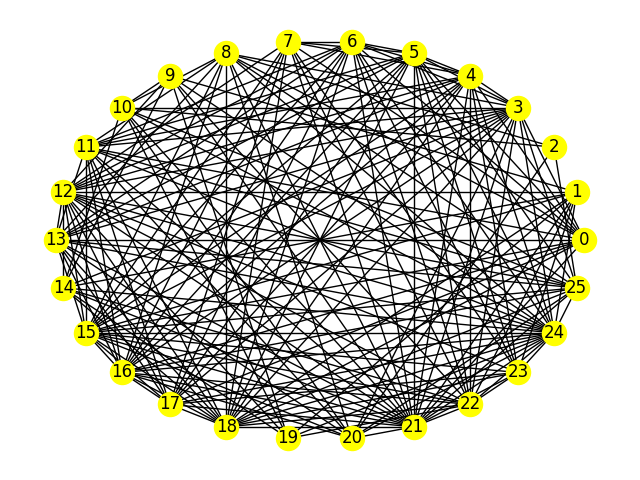
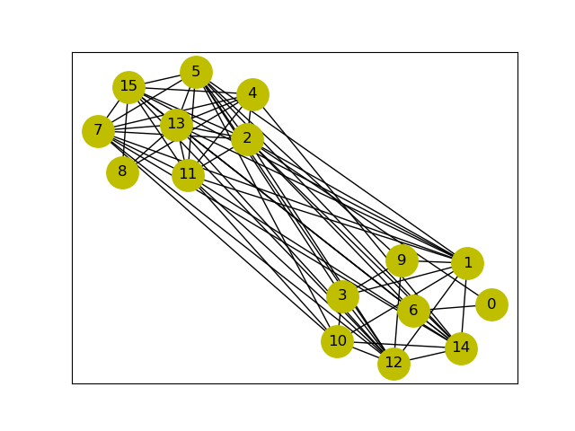
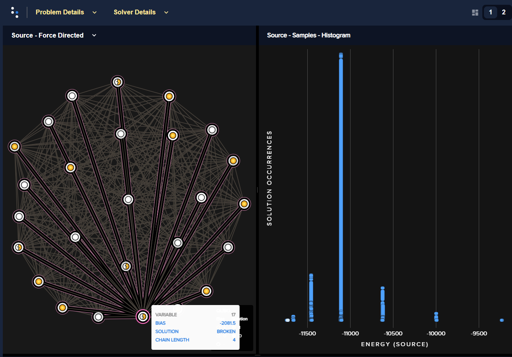
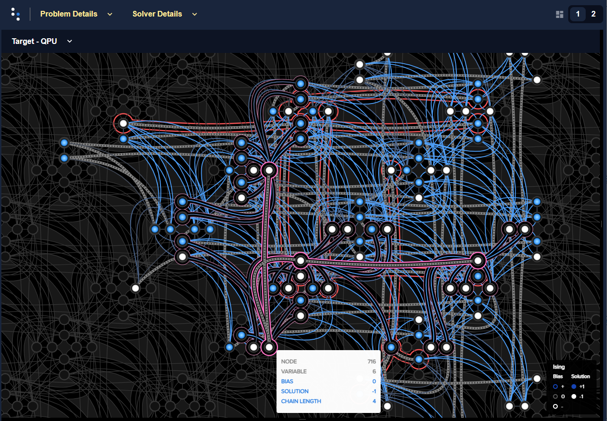
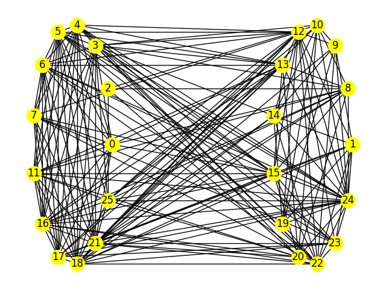
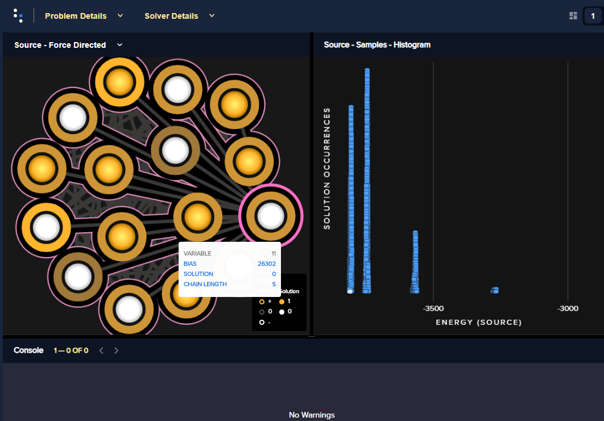
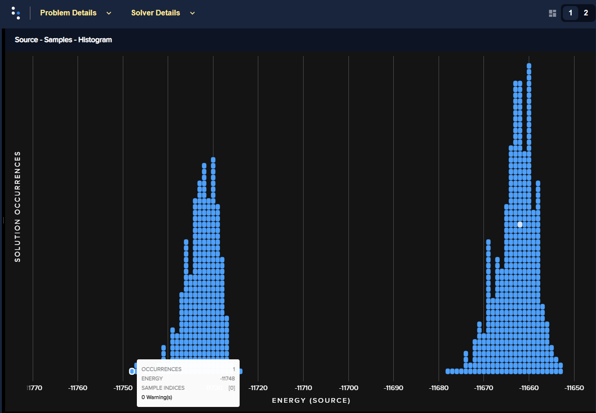
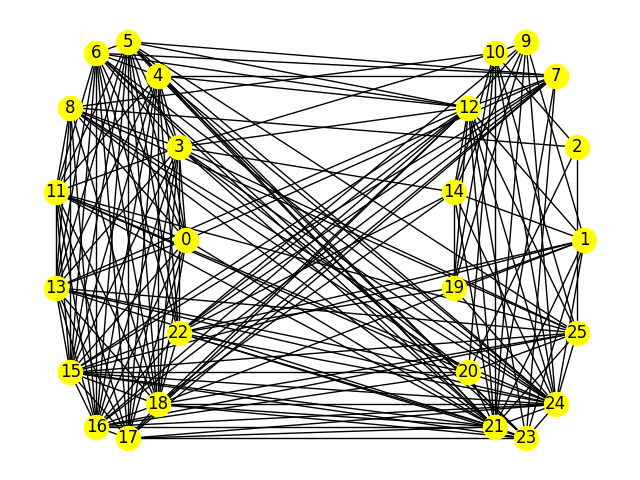

.. _qpu_example_inspector_graph_partitioning:

===========================
Using the Problem Inspector
===========================

This example solves a `graph partition <https://en.wikipedia.org/wiki/Graph_partition>`_
problem to show how D-Wave's :ref:`inspector` tool can help
you evaluate the :term:`minor-embedding` used in your problem submissions to the
quantum computer.

Example Requirements
====================

.. include:: hybrid_solver_service.rst
    :start-after: example-requirements-start-marker
    :end-before: example-requirements-end-marker

Solution Steps
==============

.. include:: hybrid_solver_service.rst
    :start-after: example-steps-start-marker
    :end-before: example-steps-end-marker

In this example, a :term:`QUBO` is formulated with simple math, the problem is
submitted naively to the QPU, its minor embedding examined using the problem
inspector, and the submission improved.

Formulate the Problem
=====================

This example uses a synthetic problem for illustrative purposes: a NetworkX
generated graph,
`NetworkX random_geometric_graph() <https://networkx.org/documentation/latest/reference/generators.html>`_.
The problem of interest here,
which is NP-hard, is to try and find the best division of the graph's nodes into two
equal sets with a minimum number of edges between the two groups.

>>> import networkx as nx
...
>>> graph_nodes = 26
>>> G = nx.random_geometric_graph(n=graph_nodes, radius=.5, dim=2)

    One arbitrary generation of the problem graph.

Reformulate the Problem Graph as a BQM
--------------------------------------

This example formulates the BQM as a QUBO using the same steps described in
detail in the `Graph Partitioning <https://github.com/dwave-examples/graph-partitioning>`_
code example of the `D-Wave Code Examples <https://github.com/dwave-examples>`_ GitHub
repository.

>>> from collections import defaultdict
>>> from itertools import combinations
...
>>> gamma = 70
>>> Q = defaultdict(int)
>>> # Fill in Q matrix
>>> for u, v in G.edges:
...     Q[(u,u)] += 1
...     Q[(v,v)] += 1
...     Q[(u,v)] += -2
>>> for i in G.nodes:
...     Q[(i,i)] += gamma*(1-len(G.nodes))
>>> for i, j in combinations(G.nodes, 2):
...     Q[(i,j)] += 2*gamma

Print the range of values for the generated QUBO's elements:

>>> print("Maximum element is {:.2f} and minimum is {:.2f}.".format(max(Q.values()), min(Q.values())))    # doctest: +SKIP
Maximum element is 140.00 and minimum is -1746.00.

Solve the Problem by Sampling
=============================

.. note:: Importing the problem inspector activates for the session the capture of
    data such as problems sent to the QPU and returned responses, relevant details of
    minor-embedding, and warnings. The recommended workflow is to import it at the
    start of your coding session or at least before submitting your problem, as is
    done below.

>>> import numpy as np
>>> from dwave.system import DWaveSampler, EmbeddingComposite
...
>>> # Import the problem inspector to begin data capture
>>> import dwave.inspector
...
>>> sampler = EmbeddingComposite(DWaveSampler())
>>> num_reads = 1000
>>> sampleset = sampler.sample_qubo(Q, num_reads=num_reads, \
...                                 label='SDK Examples - Inspector')  # doctest: +SKIP

Check the best returned answer:

>>> print("Number of nodes in one set is {}, in the other, {}. \nEnergy is {}.".format(
...        sum(sampleset.first.sample.values()),
...        graph_nodes - sum(sampleset.first.sample.values()),
...        sampleset.first.energy))      # doctest: +SKIP
Number of nodes in one set is 13, in the other, 13.
Energy is -11738.0.

   Best graph partition found for a submission with a lowest energy value of :math:`-11738`.

One simple measure of the overall quality of the returned samples is the percentage
of samples based on chains with high breakage rates. Here a rate above one third is chosen
as the acceptable threshold:

>>> print("Percentage of samples with high rates of breaks is {}.".format(
...        np.count_nonzero(sampleset.record.chain_break_fraction > 0.33)/num_reads*100))    # doctest: +SKIP
Percentage of samples with high rates of breaks is 46.4.

Inspect the Submission
----------------------

Use the problem inspector on the returned samples:

>>> dwave.inspector.show(sampleset)       # doctest: +SKIP

   Problem inspector displaying the logical problem: the problem BQM, on the left, and the returned energies histogram, on the right, for a submission with the chain strength set to its default value. For one arbitrary solution, selected by clicking an energy bar on the right (highlighted white), some values are shown as being based on broken chains. The selected variable on the left, variable ``17``, is shown to be represented on the QPU by a chain of 4 qubits.

The problem inspector can also display the embedded problem, showing the qubits chains
viewed on a background representation of the QPU topology:

   Problem inspector displaying the embedded problem, with broken chains highlighted red, for a submission with the chain strength set to its default value.

Using the same logic described in the
`Graph Partitioning <https://github.com/dwave-examples/graph-partitioning>`_
code example, the problem is resubmitted using a higher chain strength:

>>> sampleset = sampler.sample_qubo(Q, num_reads=num_reads,
...                                 chain_strength=1000,
...                                 label='SDK Examples - Inspector')   # doctest: +SKIP

Check the best returned answer and percentage of samples based on chains with breakage
rates of over 33 percent. Results will vary due to the probabilistic nature of the
quantum computer and its integrated control errors (ICE), but in this case the shown
submission had a lower minimum energy and no samples based on high rates of broken chains.

>>> print("Number of nodes in one set is {}, in the other, {}. \nEnergy is {}.".format(
...        sum(sampleset.first.sample.values()),
...        graph_nodes - sum(sampleset.first.sample.values()),
...        sampleset.first.energy))    # doctest: +SKIP
Number of nodes in one set is 13, in the other, 13.
Energy is -11748.0.
...
>>> print("Percentage of samples with high rates of breaks is {}.".format(
...        np.count_nonzero(sampleset.record.chain_break_fraction > 0.33)/num_reads*100))    # doctest: +SKIP
Percentage of samples with high rates of breaks is 0.0.

   Best graph partition found for a submission with higher chain strength.

If you again use the problem inspector on the returned samples, you see the improved chains.

>>> dwave.inspector.show(sampleset)      # doctest: +SKIP

   Problem inspector displaying the logical problem: BQM and the returned energies histogram for a submission with the chain strength set to :math:`1000`. For one arbitrary solution, selected by clicking an energy bar on the right (highlighted white), all values are shown as being based on non-broken chains.

Also of interest is the "spread" of solution energies. For this submission there are
a few distinct clusters. The problem inspector can zoom in on the lowest:

   Zoom on lowest-energy returned samples for chain strength set to a value of :math:`1000`.

You see that most the returned solutions of lowest energy cluster closely around an
energy of approximately -11735 but that the QPU has found some even lower-energy
solutions. From this one can assume that it might be possible find a better solution
by increasing the number of reads. Additionally however, the complete lack of broken
chains for the current returned sample set suggests that the chain strength can
likely be lowered while still maintaining a low rate of broken chains. Doing so
enables the problem to be represented more accurately on the QPU.

>>> sampleset = sampler.sample_qubo(Q, num_reads=num_reads,
...                                 chain_strength=400,
...                                 label='SDK Examples - Inspector')   # doctest: +SKIP

Below is one run of a few iterations of adjusting chain strength. Notice that the
acceptable rate of chain breaks was set lower, to breakage rates of over 5
percent.

>>> print("Number of nodes in one set is {}, in the other, {}. \nEnergy is {}.".format(
...        sum(sampleset.first.sample.values()),
...        graph_nodes - sum(sampleset.first.sample.values()),
...        sampleset.first.energy))     # doctest: +SKIP
Number of nodes in one set is 13, in the other, 13.
Energy is -11754.0.
...
>>> print("Percentage of samples with >5 percent chain breaks is {}.".format(
...        np.count_nonzero(sampleset.record.chain_break_fraction > 0.05)/num_reads*100))       # doctest: +SKIP
Percentage of samples with >5 percent chain breaks is 0.2.

The result of the shown submission, with a chain strength of :math:`400`, still had
less than 2% of its samples based on broken chains.

   Best graph partition found for a submission with chain strength of :math:`400`.
