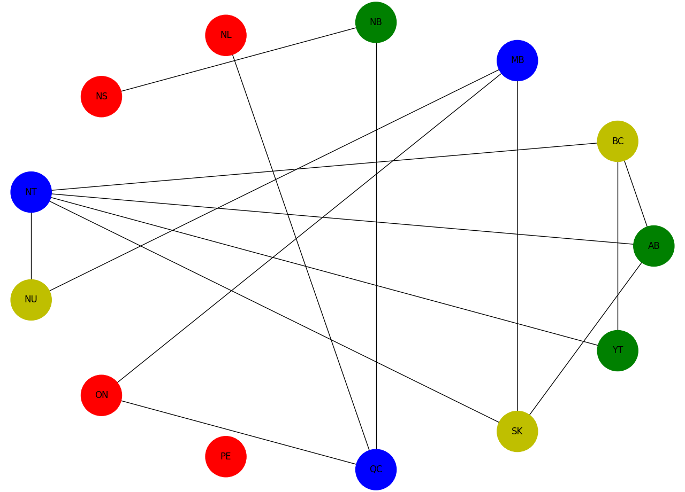

.. _qpu_example_mapcoloring:

============
Map Coloring
============

This example solves a map-coloring problem. It demonstrates using a D-Wave
quantum computer to solve a more complex constraint satisfaction problem (CSP)
than that solved in the :ref:`scheduling` example.

Constraint satisfaction problems require that all a problem's variables be assigned
values, out of a finite domain, that result in the satisfying of all constraints.
The map-coloring CSP requires that you assign a color to each region of a map such
that any two regions sharing a border have different colors.

.. figure:: ../_images/Problem_MapColoring.png
   :name: ProblemMapColoringSDKExampleQPU
   :alt: image
   :align: center
   :scale: 70 %

   Coloring a map of Canada with four colors.

The constraints for the map-coloring problem can be expressed as follows:

* Each region is assigned one color only, of :math:`C` possible colors.
* The color assigned to one region cannot be assigned to adjacent regions.

Example Requirements
====================

.. include:: ../shared/examples.rst
    :start-after: start_requirements
    :end-before: end_requirements

Solution Steps
==============

.. |workflow_section| replace:: :ref:`qpu_workflow`

.. include:: ../shared/examples.rst
    :start-after: start_standard_steps
    :end-before: end_standard_steps

This example formulates the problem as a :term:`binary quadratic model` (BQM) by
using unary encoding to represent the :math:`C` colors: each region is represented
by :math:`C` variables, one for each possible color, which is set to value
:math:`1` if selected, while the remaining :math:`C-1` variables are :math:`0`.
It then solves the BQM on a D-Wave quantum computer.

This example represents the problem's constraints as :ref:`penalties <penalty_sdk>`
and creates an :term:`objective function` by summing all penalty models.

.. note:: This problem can be expressed more simply using variables with multiple
   values; for example, provinces could be represented by discrete variables with
   values :code:`{yellow, green, blue, red}` instead of four binary variables
   (one for each color). For such problems a :term:`discrete quadratic model`
   (DQM) is a better choice.

   In general, problems with constraints are more simply solved using a
   :ref:`constrained quadratic model <cqm_sdk>` (CQM) and appropriate hybrid CQM
   solver, as demonstrated in the :ref:`example_cqm_binpacking` and
   :ref:`example_cqm_stock_selling` examples; however, the purpose of this example
   is to demonstrate solution directly on a D-Wave quantum computer.

The full workflow is as follows:

#. Formulate the problem as a graph, with provinces represented as nodes and
   shared borders as edges, using 4 binary variables (one per color) for each
   province.
#. Create one-hot penalties for each node to enforce the constraint that each
   province is assigned one color only.
#. Create penalties for each edge to enforce the constraint that no two neighbors
   have the same color.
#. Add all the constraints into a single BQM.
#. Sample the BQM.
#. Plot a feasible solution (a solution that meets all the constraints).

Formulate the Problem
=====================

This example finds a solution to the map-coloring problem for a map of Canada
using four colors (the sample code can easily be modified to change the number of
colors or use different maps). Canada's 13 provinces are denoted by postal codes:

.. list-table:: Canadian Provinces' Postal Codes
   :widths: 10 20 10 20
   :header-rows: 1

   * - Code
     - Province
     - Code
     - Province
   * - AB
     - Alberta
     - BC
     - British Columbia
   * - MB
     - Manitoba
     - NB
     - New Brunswick
   * - NL
     - Newfoundland and Labrador
     - NS
     - Nova Scotia
   * - NT
     - Northwest Territories
     - NU
     - Nunavut
   * - ON
     - Ontario
     - PE
     - Prince Edward Island
   * - QC
     - Quebec
     - SK
     - Saskatchewan
   * - YT
     - Yukon
     -
     -

.. toctree::
   :maxdepth: 1
   :hidden:

   qpu_example_mapcoloring_full_code

.. note:: You can skip directly to the complete code for the problem here:
    :ref:`qpu_example_mapcoloring_full_code`.

The example uses :doc:`dimod </docs_dimod/sdk_index>` to set up penalties and
create a binary quadratic model, :doc:`dwave-system </docs_system/sdk_index>` to
set up a D-Wave quantum computer as the :term:`sampler`, and
`NetworkX <https://networkx.org>`_ to plot results.

>>> import networkx as nx
>>> import matplotlib.pyplot as plt    # doctest: +SKIP
>>> from dimod.generators import combinations
>>> from dimod import BinaryQuadraticModel, ExactSolver
>>> from dwave.system import DWaveSampler, EmbeddingComposite

Start by formulating the problem as a graph of the map with provinces as nodes
and shared borders between provinces as edges; e.g., :code:`('AB', 'BC')` is an
edge representing the shared border between British Columbia and Alberta.

>>> provinces = ['AB', 'BC', 'MB', 'NB', 'NL', 'NS', 'NT', 'NU', 'ON', 'PE',
...              'QC', 'SK', 'YT']
>>> neighbors = [('AB', 'BC'), ('AB', 'NT'), ('AB', 'SK'), ('BC', 'NT'), ('BC', 'YT'),
...              ('MB', 'NU'), ('MB', 'ON'), ('MB', 'SK'), ('NB', 'NS'), ('NB', 'QC'),
...              ('NL', 'QC'), ('NT', 'NU'), ('NT', 'SK'), ('NT', 'YT'), ('ON', 'QC')]

You can set four arbitrary colors. The strings chosen here are recognized by
the `Matplotlib <https://matplotlib.org>`_ graphics library, which is used for
plotting a solution in the last step, to represent colors yellow, green, red,
and blue respectively.

>>> colors = ['y', 'g', 'r', 'b']

The next steps represent the binary constraint satisfaction problem with a BQM
that models the two types of constraints using :ref:`penalty models <penalty_sdk>`.

Constraint 1: One Color Per Region
----------------------------------

In the code below, :code:`bqm_one_color` uses a
`one-hot <https://en.wikipedia.org/wiki/One-hot>`_ penalty model to formulate the
constraint that each node (province) select a single color.

.. hint::

  The following illustrative example shows a one-hot constraint on two variables,
  represented by the penalty model, :math:`2ab - a - b`. You can easily verify
  that the ground states (solutions with lowest values, zero in this case) are
  for variable assignments where just one of the variables has the value 1.

  >>> bqm_one_hot = combinations(['a', 'b'], 1)
  >>> print(bqm_one_hot)
  BinaryQuadraticModel({'a': -1.0, 'b': -1.0}, {('b', 'a'): 2.0}, 1.0, 'BINARY')
  >>> print(ExactSolver().sample(bqm_one_hot))
     a  b energy num_oc.
  1  1  0    0.0       1
  3  0  1    0.0       1
  0  0  0    1.0       1
  2  1  1    1.0       1
  ['BINARY', 4 rows, 4 samples, 2 variables]

Set a one-hot constraint on the four binary variables representing the possible
colors for each province.

>>> bqm_one_color = BinaryQuadraticModel('BINARY')
>>> for province in provinces:
...   variables = [province + "_" + c for c in colors]
...   bqm_one_color.update(combinations(variables, 1))

As in the illustrative example above, the binary variables created for each
province set linear biases of -1 and quadratic biases of 2 that penalize states
where more than a single color is selected.

>>> print([variable for variable in bqm_one_color.variables if provinces[0] in variable])
['AB_y', 'AB_g', 'AB_r', 'AB_b']
>>> print(bqm_one_color.linear['AB_y'], bqm_one_color.quadratic['AB_y', 'AB_g'])
-1.0 2.0

Constraint 2: Different Colors for Adjacent Regions
---------------------------------------------------

In the code below, :code:`bqm_neighbors` represents the constraint that two nodes
(provinces) with a shared edge (border) not both select the same color.

.. hint::

  The following illustrative example shows an AND constraint on two variables,
  represented by the penalty model, :math:`1 - ab`. You can easily verify
  that the ground states (solutions with lowest values, zero in this case) are
  for variable assignment :math:`a = b = 1`.

  >>> bqm_and = BinaryQuadraticModel({}, {'ab': -1}, 1, 'BINARY')
  >>> print(ExactSolver().sample(bqm_and))
     a  b energy num_oc.
  2  1  1    0.0       1
  0  0  0    1.0       1
  1  1  0    1.0       1
  3  0  1    1.0       1
  ['BINARY', 4 rows, 4 samples, 2 variables]

  Switching the sign of the quadratic coefficient to :math:`+1` (and dropping the
  offset) now penalizes variable assignment :math:`a = b = 1`.

  >>> bqm_and_plus = BinaryQuadraticModel({}, {'ab': 1}, 0, 'BINARY')
  >>> print(ExactSolver().sample(bqm_and_plus))
     a  b energy num_oc.
  0  0  0    0.0       1
  1  1  0    0.0       1
  3  0  1    0.0       1
  2  1  1    1.0       1
  ['BINARY', 4 rows, 4 samples, 2 variables]

The code below sets quadratic coefficients to :math:`+1` for interactions between
neighboring provinces' variables representing the same color, for example
:code:`AB_y` and :code:`BC_y` (yellow for Alberta and British Columbia).

>>> bqm_neighbors  = BinaryQuadraticModel('BINARY')
>>> for neighbor in neighbors:
...   v, u = neighbor
...   interactions = [(v + "_" + c, u + "_" + c) for c in colors]
...   for interaction in interactions:
...      bqm_neighbors.add_quadratic(interaction[0], interaction[1], 1)

Create a BQM for the Problem
----------------------------

The previous sections created BQMs that represent the two types of constraints.
For some problems, such constraints are supplementary to an objective that needs
to be minimized, but in this problem, any solution that meets the constraints is
a good solution. The BQM that represents the map coloring problem is therefore
a simple sum of the BQMs representing the constraints.

>>> bqm = bqm_one_color + bqm_neighbors

Sample the BQM
--------------

Set up a D-Wave quantum computer as the sampler and request 1000 samples.

.. include:: min_vertex.rst
   :start-after: default-config-start-marker
   :end-before: default-config-end-marker

>>> sampler = EmbeddingComposite(DWaveSampler())       # doctest: +SKIP
>>> sampleset = sampler.sample(bqm, num_reads=1000,
...                            label='SDK Examples - Map Coloring BQM') # doctest: +SKIP
...
>>> best = sampleset.first     # doctest: +SKIP

Verify that the quantum computer found a feasible solution.

>>> if best.energy > 0:        # doctest: +SKIP
...     print("Failed to color map. Try sampling again.")

Plot a Feasible Solution
------------------------

.. note:: The next code requires `Matplotlib <https://matplotlib.org>`_\ .

The function below plots the map as a graph with nodes set to the selected color
for each province.

.. code-block:: python

    def plot_map(sample):
        G = nx.Graph()
        G.add_nodes_from(provinces)
        G.add_edges_from(neighbors)
        # Create a {province: selected color} dict
        color_map = {}
        for province in provinces:
          for c in colors:
           if sample[province + '_' + c]:
               color_map[province] = c
        # Plot with the selected colors
        node_colors = [color_map.get(node) for node in G.nodes()]
        nx.draw_circular(G, with_labels=True, node_color=node_colors, node_size=3000, cmap=plt.cm.rainbow)
        plt.show()

>>> plot_map(best.sample)    # doctest: +SKIP

   Solution for a map of Canada with four colors. The graph comprises 13 nodes representing
   provinces connected by edges representing shared borders. No two nodes connected by
   an edge share a color.

.. note:: You can copy the complete code for the problem here:
    :ref:`map_coloring_full_code`.
