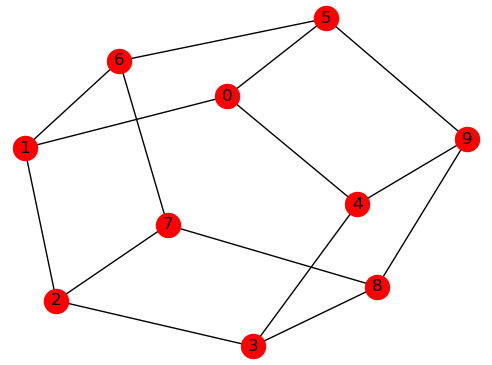

.. _qpu_example_min_vertex:

============
Vertex Cover
============

This example solves a few small examples of a known graph problem,
*minimum vertex cover*. A
`vertex cover <https://en.wikipedia.org/wiki/Vertex_cover>`_ is a set of
vertices such that each edge of the graph is incident with at least one vertex
in the set. A minimum vertex cover is the vertex cover of smallest size.

The purpose of this example is to help a new user to submit a problem to a
|dwave_short| quantum computer using :ref:`Ocean software <index_ocean_sdk>`
with little configuration or coding. Other examples demonstrate more-advanced
steps that might be needed for complex problems.

Example Requirements
====================

.. include:: ../shared/examples.rst
    :start-after: start_requirements
    :end-before: end_requirements

Solution Steps
==============

.. |workflow_section| replace:: :ref:`qpu_workflow`

.. include:: ../shared/examples.rst
    :start-after: start_standard_steps
    :end-before: end_standard_steps

In this example, a function in Ocean software handles both steps. Our task is
mainly to select the :term:`sampler` used to solve the problem.

Formulate the Problem
=====================

The real-world application for this example might be a network provider's
routers interconnected by fiberoptic cables or traffic lights in a city's
intersections. It is posed as a graph problem; here, the five-node star graph
shown below. Intuitively, the solution to this small example is obvious --- the
minimum set of vertices that touch all edges is node 0, but the general problem
of finding such a set is NP hard.

.. figure:: ../_images/minVertexS5.png
    :name: min_Vertex_S5
    :alt: image
    :align: center
    :scale: 70 %

    A five-node star graph.

First, run the code snippet below to create a star graph where node 0 is hub to
four other nodes. The code uses :std:doc:`NetworkX <networkx:index>`, which is
part of your :ref:`Ocean software <index_ocean_sdk>` installation.

>>> import networkx as nx
>>> s5 = nx.star_graph(4)

Solve the Problem by Sampling
=============================

For small numbers of variables, even your computer's CPU can solve minimum
vertex covers quickly. This example demonstrates how to solve the problem both
classically on your CPU and on the quantum computer.

Solving Classically on a CPU
----------------------------

Before using the |dwave_short| quantum computer, it can sometimes be helpful to
test code locally. Here, select one of Ocean software's test samplers to solve
classically on a CPU. Ocean's :doc:`dimod <index_dimod>` package provides a
sampler that simply returns the :term:`BQM's <bqm>` value for every possible
assignment of variable values.

>>> from dimod.reference.samplers import ExactSolver
>>> sampler = ExactSolver()

The next code lines use Ocean's :ref:`dwave_networkx <index_dnx>` to produce a
BQM for our :code:`s5` graph and solve it on our selected sampler. In other
examples the BQM is explicitly created but the Ocean tool used here abstracts the
BQM: given the problem graph it returns a solution to a BQM it creates
internally.

>>> import dwave_networkx as dnx
>>> print(dnx.min_vertex_cover(s5, sampler))
[0]

Solving on a Quantum Computer
-----------------------------

Now use a :term:`sampler` from Ocean software's
:ref:`dwave-system <index_system>` package to solve on a |dwave_short| quantum
computer. In addition to the :class:`~dwave.system.samplers.DWaveSampler` class,
use the :class:`~dwave.system.composites.EmbeddingComposite` composite class,
which maps unstructured problems to the graph structure of the selected sampler,
a process known as :term:`minor-embedding`: our problem star graph must be
mapped to the QPU's numerically indexed qubits.

.. include:: ../shared/examples.rst
    :start-after: start_default_solver_config
    :end-before: end_default_solver_config

>>> from dwave.system import DWaveSampler, EmbeddingComposite
>>> sampler = EmbeddingComposite(DWaveSampler())
>>> print(dnx.min_vertex_cover(s5, sampler))
[0]

Additional Problem Graphs
=========================

The figure below shows another five-node (wheel) graph.

.. figure:: ../_images/minVertexW5.png
    :name: min_Vertex_W5
    :alt: image
    :align: center
    :scale: 70 %

    A five-node wheel graph.

The code snippet below creates a new graph and solves on a |dwave_short| quantum
computer.

>>> w5 = nx.wheel_graph(5)
>>> print(dnx.min_vertex_cover(w5, sampler))   # doctest: +SKIP
[0, 1, 3]

Note that the solution found for this problem is not unique; for example,
[0, 2, 4] is also a valid solution.

>>> print(dnx.min_vertex_cover(w5, sampler))     # doctest: +SKIP
[0, 2, 4]

The figure below shows a ten-node (circular-ladder) graph.

    A ten-node circular-ladder graph.

The code snippet below replaces the problem graph and submits twice to the
|dwave_short| quantum computer for solution, producing two of the possible valid
solutions.

>>> c5 = nx.circular_ladder_graph(5)
>>> print(dnx.min_vertex_cover(c5, sampler))   # doctest: +SKIP
[0, 2, 3, 6, 8, 9]
>>> print(dnx.min_vertex_cover(c5, sampler))   # doctest: +SKIP
[1, 3, 4, 5, 7, 9]

Summary
=======

In the terminology of the :ref:`ocean_stack` section, Ocean tools moved the
original problem through the following layers:

*   Application: an example application might be placing limited numbers of
    traffic-monitoring equipment on routers in a telecommunication network. Such
    problems can be posed as graphs.
*   Method: graph mapping. Many different real-world problems can be formulated
    as instances of classified graph problems. Some of these are hard and the
    best currently known algorithms for solution may not scale well. Quantum
    computing might provide better solutions. In this example, vertex cover is a
    hard problem that can be solved on |dwave_short| quantum computers.
*   Sampler API: the Ocean tool internally builds a :term:`BQM` with lowest
    values (:term:`ground states <ground state>`) that correspond to a minimum
    vertex cover and uses our selected :term:`sampler` to solve it.
*   Sampler: classical :class:`~dimod.reference.samplers.ExactSolver` and then
    quantum :class:`~dwave.system.samplers.DWaveSampler` samplers.
*   Compute resource: first a local CPU then a |dwave_short| quantum computer.
